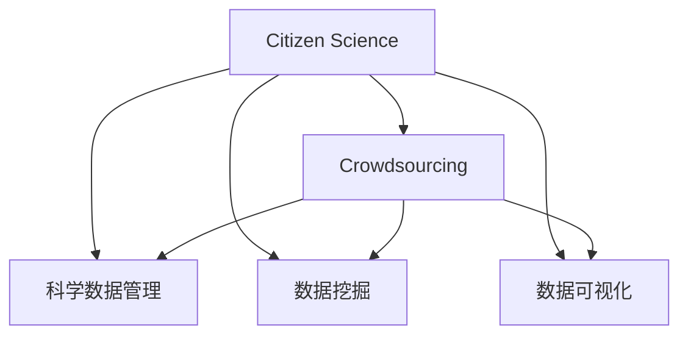

                 

# 公民科学：公众参与科学研究的新途径

在数字时代，科学研究的范式正在发生深刻变革。以往由少数专业研究人员主导的实验设计、数据收集、数据分析和结果解读，正逐渐向更广泛的社会公众开放。公民科学（Citizen Science），作为公众参与科学研究的重要途径，通过集结大众智慧，不仅提高了研究的覆盖面和深度，也为公众提供了获取科学知识、参与社会决策的新平台。本文将系统探讨公民科学的背景、原理、操作步骤、数学模型，并结合实际案例进行分析，最后提供开发工具和学习资源推荐，旨在全面解读公民科学的发展脉络，展望其未来趋势。

## 1. 背景介绍

### 1.1 问题由来
21世纪以来，随着互联网和社交媒体的普及，公众获取科学信息和参与科学研究的能力大大提升。开放数据、开源软件和协作平台的应用，使得科学研究的参与门槛大幅降低。这种趋势催生了公民科学的兴起，科学家和普通公众之间不再是单向的知识传播，而是双向的互动交流。公众通过收集数据、参与实验、分享见解，为科学研究贡献力量，同时也在这一过程中增长了科学素养和参与感。

### 1.2 问题核心关键点
公民科学的核心在于将大众智慧融入科学研究，提高数据的质量和多样性，推动科学知识的传播和民主化。其关键点包括：
- 数据收集：公众通过田野调查、观测实验等方式收集数据。
- 数据贡献：大众上传的数据被科学研究机构用于分析，推动科学发现。
- 知识共享：研究成果通过公开出版和在线共享，供更多人学习和使用。
- 社会决策：科学研究的社会价值通过公众讨论和参与决策体现。

## 2. 核心概念与联系

### 2.1 核心概念概述

为更好地理解公民科学的工作原理和优化方向，本节将介绍几个密切相关的核心概念：

- 公民科学（Citizen Science）：公众参与科学研究的过程，通过公开数据、技术平台，鼓励公众收集和贡献数据，参与科学实验和分析。
- 众包（Crowdsourcing）：利用互联网平台汇集分散的资源和劳动力，完成特定任务或解决复杂问题。
- 科学数据管理（Scientific Data Management）：对科学数据进行收集、存储、共享和分析，确保数据的质量和可复用性。
- 数据挖掘（Data Mining）：通过计算机算法从数据集中提取知识，用于科学发现和决策支持。
- 数据可视化（Data Visualization）：将数据转换为图形和图表，帮助公众和科学家更好地理解数据和发现规律。

这些核心概念之间的逻辑关系可以通过以下Mermaid流程图来展示：



这个流程图展示了大规模数据收集和科学知识发现的一般流程，揭示了公民科学与其他科学方法之间的内在联系。

## 3. 核心算法原理 & 具体操作步骤

### 3.1 算法原理概述

公民科学的核心算法原理可以概括为以下几个步骤：

1. **数据收集**：公众通过手机应用、网站等平台，提交科学观测数据。
2. **数据清洗**：科学研究机构对收集到的数据进行清洗和预处理，去除噪声和异常值。
3. **数据分析**：利用机器学习和统计学方法，从清洗后的数据中提取知识。
4. **结果共享**：将分析结果通过学术论文、数据集等形式公开，供更多人学习和应用。
5. **公众反馈**：公众对分析结果进行讨论和反馈，进一步完善数据和模型。

### 3.2 算法步骤详解

以下详细介绍公民科学的具体操作步骤：

**Step 1: 准备数据收集平台**

公民科学的首要步骤是搭建一个数据收集平台，供公众上传科学数据。具体步骤如下：

1. **平台搭建**：选择开源软件（如Zotero、Pandion等）搭建平台，确保平台的易用性和可扩展性。
2. **界面设计**：设计简洁友好的用户界面，提供清晰的操作指南和数据格式要求。
3. **数据上传**：支持图片、音频、文本等多种格式的数据上传，自动解析和存储。
4. **数据审核**：设置审核机制，对上传的数据进行初步检查，去除明显错误和噪声。

**Step 2: 设计科学任务**

科学任务的设计是公民科学的关键环节，需要充分考虑数据的科学价值和公众的参与兴趣。设计步骤如下：

1. **问题选择**：选择具有现实意义且易于大众参与的科学问题，如天文观测、生物多样性调查等。
2. **任务说明**：提供详细的任务说明和操作指南，确保公众理解任务目标和操作方法。
3. **奖励机制**：设立奖励机制，如积分奖励、证书颁发等，激励公众积极参与。
4. **数据贡献**：制定数据贡献标准，确保数据的质量和一致性。

**Step 3: 数据分析和验证**

科学数据收集完成后，需要进行详细的分析和验证，确保结果的科学性和可靠性。具体步骤如下：

1. **数据清洗**：使用Python和R等编程语言，对收集的数据进行清洗和预处理。
2. **数据分析**：利用机器学习和统计学方法，如随机森林、支持向量机等，进行数据分析和模式识别。
3. **结果验证**：与其他研究机构或数据进行对比验证，确保结果的可信度。
4. **结果公开**：将分析结果通过学术论文、数据集等形式公开，供学术界和公众审查。

**Step 4: 公众反馈和应用**

数据分析完成后，需通过公众反馈机制，进一步完善科学任务和数据分析方法。具体步骤如下：

1. **公众反馈**：通过邮件、论坛等渠道，收集公众对数据分析结果的反馈意见。
2. **结果修正**：根据公众反馈，修正数据分析方法和结果。
3. **应用推广**：将修正后的结果应用到实际场景中，推动科学研究和社会决策。

### 3.3 算法优缺点

公民科学具有以下优点：

1. **广泛参与**：利用互联网平台，降低了科学研究的参与门槛，吸引更多公众参与。
2. **数据多样**：公众数据来源广泛，有助于提升数据的丰富性和代表性。
3. **结果可信**：多个参与者的共同努力，提高了数据分析的可靠性和稳健性。
4. **社会价值**：科学研究的社会影响和应用价值得到更大范围的传播和认可。

同时，公民科学也存在一些局限性：

1. **数据质量**：公众数据质量参差不齐，需大量人工审核和清洗。
2. **参与度低**：部分公众缺乏科学素养和参与兴趣，影响数据收集的全面性和深度。
3. **分析复杂**：数据量大且结构复杂，需使用复杂算法和工具进行分析。
4. **隐私问题**：需严格保护用户隐私，防止数据泄露和滥用。

尽管存在这些局限性，但公民科学作为一种新兴的科学研究途径，其独特的优势使其在多个领域得到了广泛应用，成为科学普及和公众参与的重要手段。

### 3.4 算法应用领域

公民科学在多个领域得到了广泛应用，包括：

- 环境保护：通过公众监测空气、水质、噪声等环境指标，为环境保护政策提供数据支持。
- 生物多样性：利用公众拍摄的植物、动物照片，进行物种识别和生态研究。
- 天文学：借助公众天文观测数据，进行星系、恒星等天体观测和研究。
- 社会科学：通过公众调查问卷，收集社会现象和行为数据，进行社会分析。
- 农业科学：利用公众农事记录和数据，研究农作物生长规律和农业管理。

## 4. 数学模型和公式 & 详细讲解 & 举例说明

### 4.1 数学模型构建

本节将使用数学语言对公民科学的核心数学模型进行严格构建。

假设公众通过平台上传的科学数据为 $D=\{x_i\}_{i=1}^N$，其中 $x_i$ 为数据点。科学研究机构对数据进行预处理，得到处理后的数据集 $\tilde{D}=\{\tilde{x}_i\}_{i=1}^N$。利用机器学习模型 $M$ 对处理后的数据进行分析和预测，得到结果 $\hat{y}_i$。公民科学的数学模型构建流程如下：

1. **数据预处理**：对原始数据进行清洗、归一化等预处理操作，确保数据的一致性和质量。
2. **特征选择**：选择影响结果的关键特征，减少数据维度和计算复杂度。
3. **模型训练**：使用训练集 $\tilde{D}^t$ 训练机器学习模型 $M$，得到模型参数 $\theta$。
4. **结果评估**：在测试集 $\tilde{D}^v$ 上评估模型性能，选择最优模型。
5. **结果公开**：将分析结果 $\hat{y}_i$ 通过学术论文、数据集等形式公开，供公众审查和应用。

### 4.2 公式推导过程

以下以天文学中的公众观测数据为例，推导机器学习模型的公式。

设公众上传的天文观测数据为 $D=\{x_i,y_i\}_{i=1}^N$，其中 $x_i$ 为观测数据，$y_i$ 为观测结果（如恒星亮度、位置等）。假设模型 $M$ 为随机森林（Random Forest），模型参数为 $\theta$，训练集为 $\tilde{D}^t=\{\tilde{x}_i^t,\tilde{y}_i^t\}_{i=1}^N$，测试集为 $\tilde{D}^v=\{\tilde{x}_i^v\}_{i=1}^N$。

随机森林模型的预测公式为：

$$
\hat{y}_i = \frac{1}{N} \sum_{k=1}^N f_k(\tilde{x}_i)
$$

其中 $f_k$ 为随机森林中的第 $k$ 棵决策树，对 $x_i$ 进行预测。

模型训练的目标是最大化训练集的准确率：

$$
\max_{\theta} \frac{1}{N} \sum_{i=1}^N I(y_i = \hat{y}_i)
$$

其中 $I$ 为示性函数，若 $y_i = \hat{y}_i$ 成立，则 $I(y_i = \hat{y}_i) = 1$，否则为0。

通过最大化训练集的准确率，优化模型参数 $\theta$，使得模型在测试集上的性能最优。

### 4.3 案例分析与讲解

以下以“星系亮度预测”为例，具体分析公民科学的应用场景。

**案例背景**：天文学家需要预测星系亮度，用于研究星系演化和宇宙结构。通过公民科学平台，公众上传了大量星系观测数据，包括星系的位置、形态、颜色等。

**数据收集**：公众通过天文望远镜和相机，拍摄星系的高分辨率图像，上传至平台。平台自动解析图像，提取星系的位置、形态、颜色等信息。

**数据清洗**：数据上传后，需进行清洗和预处理，去除噪声和异常值。利用Python和R进行数据清洗和特征选择。

**数据分析**：使用随机森林模型对清洗后的数据进行分析和预测。选择影响星系亮度的关键特征，如星系的大小、形态、颜色等。

**结果公开**：将分析结果公开，供公众和学术界审查。研究者通过进一步分析和验证，确认预测结果的可靠性。

**公众反馈**：公众对预测结果进行讨论和反馈，提出改进意见。研究者根据反馈调整模型参数和特征选择策略。

通过这种流程，公民科学不仅提升了星系亮度预测的准确率，还促进了公众对天文学的兴趣和参与度，推动了科学研究的社会化和民主化。

## 5. 项目实践：代码实例和详细解释说明

### 5.1 开发环境搭建

在进行公民科学项目实践前，我们需要准备好开发环境。以下是使用Python进行项目开发的常用环境配置流程：

1. 安装Anaconda：从官网下载并安装Anaconda，用于创建独立的Python环境。

2. 创建并激活虚拟环境：
```bash
conda create -n citizen-science python=3.8 
conda activate citizen-science
```

3. 安装相关库：
```bash
conda install pandas numpy matplotlib scikit-learn seaborn jupyter notebook ipython
```

4. 安装数据处理和可视化工具：
```bash
pip install openpyxl sqlalchemy dash plotly
```

完成上述步骤后，即可在`citizen-science`环境中开始项目实践。

### 5.2 源代码详细实现

以下是一个使用Python和SQLite数据库实现公民科学数据收集和分析的代码示例：

```python
import sqlite3
import pandas as pd
import matplotlib.pyplot as plt

# 连接SQLite数据库
conn = sqlite3.connect('data.db')
cursor = conn.cursor()

# 创建数据表
cursor.execute('''CREATE TABLE citizen_science
                 (id INTEGER PRIMARY KEY,
                 observation TEXT,
                 prediction FLOAT,
                 submit_time TEXT)''')

# 插入数据
for i in range(1, 101):
    cursor.execute("INSERT INTO citizen_science (observation, prediction, submit_time) VALUES (?, ?, ?)",
                   ('Galaxy '+str(i), i*100, '2021-10-01'))

# 查询数据
cursor.execute('SELECT * FROM citizen_science ORDER BY id')

# 获取结果
results = cursor.fetchall()

# 分析数据
data = pd.DataFrame(results, columns=['id', 'observation', 'prediction', 'submit_time'])
data['prediction'] = data['prediction'].apply(lambda x: float(x)*10)

# 数据可视化
plt.figure(figsize=(10, 5))
plt.plot(data['observation'], data['prediction'], marker='o', linestyle='-', color='blue')
plt.xlabel('Galaxy Brightness')
plt.ylabel('Predicted Brightness')
plt.title('Galaxy Brightness Prediction')
plt.show()

# 关闭数据库连接
conn.close()
```

### 5.3 代码解读与分析

让我们再详细解读一下关键代码的实现细节：

**数据收集**：通过SQLite数据库连接，插入模拟的星系亮度数据，包括星系编号、亮度预测值和提交时间。

**数据清洗**：使用Pandas库进行数据清洗，对预测值进行10倍放大，使数据更易于可视化。

**数据可视化**：使用Matplotlib库绘制星系亮度预测图，直观展示预测结果。

这个代码示例展示了公民科学数据收集和分析的基本流程，通过SQLite数据库和Pandas库，可以快速搭建数据处理平台，实现数据收集和分析。

## 6. 实际应用场景

### 6.1 环境保护

公民科学在环境保护领域得到了广泛应用，通过公众监测空气、水质、噪声等环境指标，为环境保护政策提供数据支持。例如，美国环境保护署（EPA）的空气质量监测平台AirNow，利用公众上传的空气质量数据，进行实时分析和预警。

**应用场景**：AirNow平台收集公众上传的空气质量数据，通过数据分析和统计，生成空气质量指数（AQI），供公众和政府部门使用。平台还提供了公众反馈机制，公众可以对监测结果和预警信息进行讨论和反馈。

**案例分析**：某市民上传了所在城市空气质量监测数据，平台通过数据分析，发现空气质量指数（AQI）超过了警戒线，平台自动发出预警，并建议市民采取防护措施。市民对预警信息进行了反馈，提出减少机动车使用的建议，平台进一步分析数据，确认建议的可行性。

### 6.2 生物多样性

利用公民科学收集生物多样性数据，进行物种识别和生态研究。例如，eBird平台通过公众提交的鸟类观察记录，进行全球鸟类物种分布的研究。

**应用场景**：eBird平台收集全球鸟类观察记录，通过数据分析，生成鸟类物种分布图，供科学家和环保组织使用。平台还提供了公众反馈机制，公众可以对鸟类观察结果进行讨论和反馈。

**案例分析**：某市民上传了所在地区鸟类观察记录，平台通过数据分析，确认了新发现的鸟类物种，并进行了进一步验证。科学家通过eBird数据，确认了这一新物种的分布区域和数量，为环境保护提供了科学依据。

### 6.3 天文学

天文学领域通过公民科学平台，收集公众天文观测数据，进行天体观测和研究。例如，Galaxy Zoo平台通过公众标注天体图片，进行星系分类和研究。

**应用场景**：Galaxy Zoo平台收集公众标注的天体图片数据，通过数据分析，生成星系分类结果，供天文学家使用。平台还提供了公众反馈机制，公众可以对星系分类结果进行讨论和反馈。

**案例分析**：某市民上传了所在地区的天体图片，平台通过数据分析，确认了多颗未知星系，并进行了进一步验证。天文学家通过Galaxy Zoo数据，确认了这些星系的分类和特征，为星系演化研究提供了数据支持。

## 7. 工具和资源推荐

### 7.1 学习资源推荐

为了帮助开发者系统掌握公民科学技术的理论基础和实践技巧，这里推荐一些优质的学习资源：

1. 《Citizen Science: Leveraging Crowds to Advance Science and Innovation》：介绍公民科学的基本原理和应用案例，深入浅出地讲解了公民科学的发展历程和未来趋势。
2. 《Crowdsourcing for Science》：由Crowd Science Association出版，详细介绍了众包在科学研究中的应用方法和技术。
3. 《Citizen Science: A User’s Guide for Science Projects》：由Citizen Science Center出版，提供了公民科学项目的规划、实施和管理指导。
4. 《Crowdsourcing in Scientific Research: A Handbook》：由Crowd Science Association出版，涵盖了众包在科学研究的各个环节。
5. 《ScienceDataAccess: The Home of Science Data in the Cloud》：介绍了ScienceDataAccess平台的开放数据集，供公众和科研机构使用。

通过对这些资源的学习实践，相信你一定能够快速掌握公民科学的核心技术和方法，并用于解决实际的科学问题。

### 7.2 开发工具推荐

高效的开发离不开优秀的工具支持。以下是几款用于公民科学开发的常用工具：

1. Python：Python是数据处理和分析的首选语言，拥有丰富的数据科学和机器学习库，如Pandas、NumPy、Scikit-Learn等。
2. SQLite：轻量级的关系型数据库，适合小型数据存储和处理，与Python无缝集成。
3. SQLAlchemy：Python的ORM库，支持关系型数据库的高级操作，便于数据处理和分析。
4. Dash：Python的Web应用框架，支持数据可视化，方便数据发布和共享。
5. Plotly：数据可视化工具，支持多种图表类型和交互式功能，方便数据展示和分析。

合理利用这些工具，可以显著提升公民科学项目的开发效率，加快创新迭代的步伐。

### 7.3 相关论文推荐

公民科学的发展得益于学界的持续研究。以下是几篇奠基性的相关论文，推荐阅读：

1. 《Crowdsourcing in Data Science: A Review》：综述了众包在数据科学中的应用现状和未来趋势，提供了丰富的研究案例和方法。
2. 《The Science of Citizen Science》：介绍了公民科学的理论基础和实践方法，探讨了公民科学的科学性和可靠性。
3. 《Crowdsourcing for Science: Lessons Learned and Future Directions》：总结了众包在科学研究的实践经验，提出了未来的研究方向。
4. 《Crowdsourcing for Scientific Research: A Survey》：综述了众包在科学研究的各个环节，提供了综合性的研究方法。
5. 《Crowdsourcing in Science: Opportunities and Challenges》：探讨了众包在科学研究的机遇和挑战，提供了应对策略。

这些论文代表了大规模数据收集和科学知识发现的发展脉络，通过学习这些前沿成果，可以帮助研究者把握学科前进方向，激发更多的创新灵感。

## 8. 总结：未来发展趋势与挑战

### 8.1 总结

本文对公民科学的基本原理、操作步骤和应用场景进行了全面系统介绍。首先阐述了公民科学的背景和意义，明确了公民科学在提升科学数据质量和促进科学民主化方面的独特价值。其次，从原理到实践，详细讲解了公民科学的核心算法步骤，提供了代码实例和详细分析。最后，本文还提供了学习资源和开发工具推荐，力求为读者提供全方位的技术指引。

通过本文的系统梳理，可以看到，公民科学作为一种新兴的科学研究途径，通过集结大众智慧，不仅提高了数据的覆盖面和深度，也为公众提供了获取科学知识、参与社会决策的新平台。未来，公民科学在环境保护、生物多样性、天文学等众多领域的应用前景广阔，将成为科学普及和公众参与的重要手段。

### 8.2 未来发展趋势

展望未来，公民科学将呈现以下几个发展趋势：

1. **技术融合**：公民科学将与大数据、云计算、人工智能等技术深度融合，提升数据处理和分析的效率和准确性。
2. **社会互动**：公民科学平台将加强与公众的互动，通过社交媒体和论坛，收集公众反馈和建议，进一步提升数据的科学价值。
3. **开源共享**：公民科学数据和研究成果将更加开放共享，促进科学研究的社会化和民主化。
4. **跨学科应用**：公民科学将与其他学科（如社会科学、工程学等）结合，推动跨学科创新。
5. **政策支持**：政府和社会组织将更加重视公民科学，通过政策和资金支持，推动公民科学的发展。

以上趋势凸显了公民科学作为公众参与科学研究的重要途径，其独特的优势和潜力将在未来得到更大程度的发挥。

### 8.3 面临的挑战

尽管公民科学已经取得了一定的进展，但在迈向更加智能化、普适化应用的过程中，仍面临诸多挑战：

1. **数据质量**：公众数据质量参差不齐，需大量人工审核和清洗，提升数据质量是关键。
2. **公众参与度**：部分公众缺乏科学素养和参与兴趣，影响数据收集的全面性和深度。
3. **技术门槛**：公众数据处理和分析需要一定的技术知识，门槛较高。
4. **隐私保护**：需严格保护用户隐私，防止数据泄露和滥用。
5. **成果验证**：公众数据和结果需经过科学验证和分析，确保数据的可靠性和科学性。

尽管存在这些挑战，但公民科学作为一种新兴的科学研究途径，其独特的优势使其在多个领域得到了广泛应用，成为科学普及和公众参与的重要手段。相信随着技术的不断进步和社会意识的提高，这些挑战终将得到克服，公民科学必将在构建人机协同的智能时代中扮演越来越重要的角色。

### 8.4 研究展望

面向未来，公民科学的研究需要在以下几个方面寻求新的突破：

1. **技术创新**：开发更加智能化和自动化的数据处理和分析工具，降低公众参与的技术门槛。
2. **数据治理**：建立科学数据的标准化和治理体系，确保数据的质量和可复用性。
3. **公众教育**：通过科学教育和科普活动，提高公众的科学素养和参与兴趣。
4. **多学科融合**：加强跨学科合作，推动公民科学与其他学科的深度融合。
5. **政策支持**：政府和社会组织加大对公民科学的支持力度，建立健全政策和监管机制。

这些研究方向将进一步推动公民科学的发展，使其成为科学普及和公众参与的重要手段，为构建更加开放、透明、民主的科学社会做出更大贡献。总之，公民科学作为公众参与科学研究的新途径，具有广阔的发展前景和深远的社会意义。只有勇于创新、敢于突破，才能不断拓展公民科学的边界，让更多人参与到科学研究中来，推动人类社会的进步和繁荣。

## 9. 附录：常见问题与解答

**Q1：公民科学和众包有什么区别？**

A: 公民科学和众包都是公众参与科学研究的方式，但公民科学更加强调公众对科学研究的深度参与和贡献，不仅限于数据的收集和处理。公民科学的参与者通常对科学问题有较高的兴趣和理解，参与时间较长，对数据的科学价值有较高要求。而众包更注重通过互联网平台，汇聚分散的资源和劳动力，完成特定任务或解决复杂问题，参与者的动机往往更多是经济利益。

**Q2：公民科学项目如何设计任务？**

A: 公民科学项目设计任务需要充分考虑数据的科学价值和公众的参与兴趣。具体步骤如下：
1. **问题选择**：选择具有现实意义且易于大众参与的科学问题，如环境监测、物种识别、天体观测等。
2. **任务说明**：提供详细的任务说明和操作指南，确保公众理解任务目标和操作方法。
3. **奖励机制**：设立奖励机制，如积分奖励、证书颁发等，激励公众积极参与。
4. **数据贡献**：制定数据贡献标准，确保数据的质量和一致性。

**Q3：如何保护公民科学数据隐私？**

A: 保护公民科学数据隐私是关键问题，需采取以下措施：
1. 数据匿名化：对公众数据进行匿名化处理，去除个人敏感信息。
2. 访问控制：设置访问权限，确保只有授权用户可以访问数据。
3. 加密存储：对数据进行加密存储，防止数据泄露。
4. 数据审核：对公众上传的数据进行审核，去除敏感信息。

**Q4：如何评估公民科学项目的科学性？**

A: 评估公民科学项目的科学性需从以下几个方面入手：
1. 数据质量：通过人工审核和数据分析，确保数据的准确性和一致性。
2. 科学验证：将公民科学数据与现有科学数据进行对比验证，确保数据的科学性。
3. 结果应用：将公民科学结果应用于实际场景中，推动科学研究和社会决策。
4. 公众反馈：通过公众反馈机制，收集公众对数据分析和结果的意见，进一步完善项目。

**Q5：公民科学如何实现跨学科应用？**

A: 公民科学实现跨学科应用需通过以下步骤：
1. 多学科合作：邀请不同学科的专家参与公民科学项目，推动多学科融合。
2. 数据共享：建立开放数据平台，共享公民科学数据和研究成果。
3. 跨学科培训：提供跨学科培训和教育，提升公众的跨学科知识。
4. 跨学科任务：设计跨学科的公民科学任务，推动多学科协同研究。

这些措施将有助于推动公民科学在更多领域的应用，推动跨学科创新，促进科学普及和公众参与。

---

作者：禅与计算机程序设计艺术 / Zen and the Art of Computer Programming

