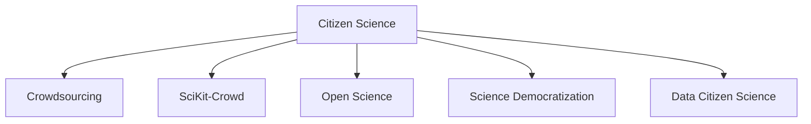

                 

# 公民科学：公众参与科学研究的新途径

## 1. 背景介绍

### 1.1 问题由来
现代科学正逐渐从封闭的专业领域走向开放的知识生态系统，而公众参与科学研究（Citizen Science）正在成为推动这一进程的重要力量。它强调将非专业人士的观察和数据与专业科学家的研究和分析相结合，共同解决科学问题。其核心在于利用大众的智慧和资源，拓宽科学研究的广度和深度。

### 1.2 问题核心关键点
公众参与科学研究的兴起，为科学研究的民主化和普及化提供了新的路径。但这一模式的成功依赖于以下几个关键点：
1. **数据质量保证**：公众收集的数据往往存在噪声，需要通过科学方法进行筛选和处理。
2. **知识共享与协作**：科学家和公众之间的知识传递与协作是确保研究成功的重要环节。
3. **社会技术融合**：通过创新技术手段，降低参与门槛，使更多公众能高效参与科研过程。
4. **激励机制设计**：合理设计参与激励机制，确保公众的持续参与和贡献。

## 2. 核心概念与联系

### 2.1 核心概念概述

为更好地理解公众参与科学研究的框架，本节将介绍几个密切相关的核心概念：

- **公民科学（Citizen Science）**：指非专业的公众在科学家的指导下，参与科学数据收集、数据分析、实验设计和结果验证等研究活动，贡献自己的智慧和资源。
- **众包（Crowdsourcing）**：通过互联网平台，将科学任务分配给非专业人士，利用大众的劳动和智慧进行数据收集和处理。
- **科学计算众包（SciKit-Crowd）**：基于网络平台，将计算任务分配给大众，利用分散的计算资源加速科学研究。
- **开放科学（Open Science）**：强调科学研究的开放性，鼓励数据的共享和开放访问，促进科学发现和创新。
- **科学民主化**：通过公众参与科研，实现科学研究的民主化和普及化，拓宽科学知识的传播范围。
- **数据公民科学（Data Citizen Science）**：侧重于数据科学领域的公众参与，利用大数据技术处理和分析公众收集的数据。

这些概念之间的逻辑关系可以通过以下Mermaid流程图来展示：



这个流程图展示了一些核心概念之间的联系：

1. 公民科学通过众包、科学计算众包等手段，整合公众的数据和计算资源。
2. 开放科学强调数据的共享和开放访问，是公民科学得以顺利进行的基础。
3. 科学民主化和数据公民科学则体现了公众参与科研对科学传播和知识普及的促进作用。

## 3. 核心算法原理 & 具体操作步骤
### 3.1 算法原理概述

公众参与科学研究的算法原理，主要基于数据处理、分布式计算和社交网络分析等技术。其核心思想是：通过互联网平台，将科学任务分解为可执行的子任务，分配给公众，利用众包、分布式计算等手段进行数据收集和处理，并通过社交网络分析技术对数据和结果进行验证和优化。

### 3.2 算法步骤详解

公众参与科学研究的主要步骤如下：

1. **数据收集与任务定义**：
   - 确定需要解决的具体科学问题。
   - 定义数据收集和任务执行的标准和流程。
   - 选择合适的数据采集工具和技术，如手机应用、在线问卷等。

2. **任务分配与执行**：
   - 将任务划分为多个子任务，通过互联网平台（如Amazon Mechanical Turk、CrowdFlower等）分配给公众。
   - 对公众进行任务培训，确保其理解任务要求和执行标准。
   - 使用分布式计算技术（如MapReduce、Spark等）处理任务结果，并进行初步筛选和清洗。

3. **数据验证与结果优化**：
   - 通过社交网络分析等技术，验证数据和结果的真实性和可靠性。
   - 组织专家对数据和结果进行审核和评估，识别潜在问题。
   - 利用机器学习和大数据分析技术，对数据和结果进行优化和提升。

4. **成果发布与共享**：
   - 将最终的研究成果发布在开放平台，供公众和专业人士查阅。
   - 鼓励科学家和公众进行反馈和讨论，进一步优化研究成果。
   - 在学术期刊和会议上分享研究成果，推广科学发现。

### 3.3 算法优缺点

公众参与科学研究的算法具有以下优点：
1. **数据规模庞大**：利用公众的广泛参与，可以快速收集大量数据，弥补专业研究的数据不足。
2. **研究范围广泛**：能够覆盖传统科学研究难以触及的领域，如生态保护、环境监测等。
3. **成本效益高**：借助互联网平台和分布式计算技术，降低研究成本，提高效率。
4. **公众参与度高**：激发公众对科学研究的兴趣，提升科学传播效果。

同时，该算法也存在一些局限性：
1. **数据质量参差不齐**：公众数据可能存在噪声，需要进行严格的筛选和处理。
2. **参与积极性不稳定**：缺乏有效的激励机制，公众的参与热情可能随时间波动。
3. **结果可靠性不确定**：非专业人士的参与可能影响研究结果的准确性和可靠性。
4. **技术门槛较高**：需要一定的技术支持，参与者需具备基本的数据处理和分析能力。
5. **隐私和安全问题**：公众数据涉及隐私和安全，需严格保护，避免信息泄露。

尽管存在这些局限性，但公众参与科学研究仍然是推动科学研究民主化和普及化的重要方式。未来相关研究将继续优化数据筛选和处理技术，设计更有效的激励机制，降低技术门槛，从而提升公众参与的持续性和研究成果的可靠性。

### 3.4 算法应用领域

公众参与科学研究的算法已在多个领域得到应用，如：

- **生态学研究**：利用公众在特定区域内的观察数据，研究动植物分布、生态系统健康等。
- **环境监测**：通过公众在特定地点采集的水质、空气质量等数据，监测环境污染和变化。
- **天文学观测**：利用公众在天文学爱好者的帮助下，采集天文图像和数据，支持深空探测研究。
- **公共健康研究**：收集公众在特定区域内的健康数据，研究疾病的传播和预防措施。
- **地球物理学**：利用公众在特定地区的地震和火山活动观测数据，研究地球内部的构造和变化。

除了上述这些领域，公众参与科学研究还在基因组学、气候变化、空间地理等领域取得显著成果，展示了其巨大的潜力和应用前景。

## 4. 数学模型和公式 & 详细讲解  
### 4.1 数学模型构建

本节将使用数学语言对公众参与科学研究的数学模型进行更加严格的刻画。

记科学问题为 $Q$，公众收集的数据为 $\mathcal{D}=\{d_i\}_{i=1}^N$，其中 $d_i$ 为第 $i$ 个公众收集的数据。任务为 $T$，任务定义函数为 $f$。任务执行结果为 $\mathcal{R}$，其中 $r_i$ 为第 $i$ 个公众的任务执行结果。任务验证结果为 $\mathcal{V}$，其中 $v_i$ 为第 $i$ 个公众的任务验证结果。

定义公众参与科学研究的优化目标为最小化误差函数 $\mathcal{E}$，即：

$$
\mathcal{E}(Q, \mathcal{D}, T, f, \mathcal{R}, \mathcal{V}) = \sum_{i=1}^N \text{err}(v_i, f(r_i))
$$

其中 $\text{err}$ 为误差函数，用于衡量验证结果与任务定义的偏差。

### 4.2 公式推导过程

以下我们以生态学研究为例，推导误差函数 $\mathcal{E}$ 的计算公式。

假设公众收集的数据 $\mathcal{D}=\{(d_{i,x}, d_{i,y})\}_{i=1}^N$，其中 $d_{i,x}$ 为物种出现频率，$d_{i,y}$ 为观察地点。任务 $T$ 为研究物种分布，任务定义函数 $f$ 为：

$$
f(\mathcal{D}, T) = \{(t_x, t_y) \mid (d_{i,x}, d_{i,y}) \in \mathcal{D}, t_x = d_{i,x} \text{ and } t_y = d_{i,y}\}
$$

其中 $t_x$ 和 $t_y$ 为物种在地点 $x$ 和地点 $y$ 的分布情况。

任务执行结果 $\mathcal{R}=\{r_i\}_{i=1}^N$，其中 $r_i = (r_{i,x}, r_{i,y})$ 为公众在地点 $x$ 和地点 $y$ 的观察结果。任务验证结果 $\mathcal{V}=\{v_i\}_{i=1}^N$，其中 $v_i = (v_{i,x}, v_{i,y})$ 为专家对公众结果的验证结果。

误差函数 $\mathcal{E}$ 的计算公式为：

$$
\mathcal{E}(Q, \mathcal{D}, T, f, \mathcal{R}, \mathcal{V}) = \sum_{i=1}^N \text{err}(v_{i,x}, f(r_{i,x})) + \text{err}(v_{i,y}, f(r_{i,y}))
$$

其中 $\text{err}$ 为误差函数，如均方误差、交叉熵等，用于衡量验证结果与任务定义的偏差。

在得到误差函数的梯度后，即可带入优化算法，如梯度下降等，完成模型的迭代优化。重复上述过程直至收敛，最终得到适应科学问题的最优参数 $\theta^*$。

## 5. 项目实践：代码实例和详细解释说明
### 5.1 开发环境搭建

在进行公众参与科学研究的开发前，我们需要准备好开发环境。以下是使用Python进行CrowdFlower开发的环境配置流程：

1. 安装CrowdFlower SDK：从官网下载并安装CrowdFlower SDK，用于连接和调用CrowdFlower平台API。

2. 创建并激活虚拟环境：
```bash
conda create -n citizen_science python=3.8 
conda activate citizen_science
```

3. 安装相关工具包：
```bash
pip install requests beautifulsoup4 pandas numpy scipy
```

4. 配置CrowdFlower API键：
```bash
export CROWDFLOWER_API_KEY=your_api_key
```

完成上述步骤后，即可在`citizen_science`环境中开始开发实践。

### 5.2 源代码详细实现

这里我们以一个简单的生态学研究项目为例，给出使用CrowdFlower进行数据收集和任务验证的Python代码实现。

首先，定义数据收集和任务验证的函数：

```python
import requests
from bs4 import BeautifulSoup
import pandas as pd

def collect_data():
    # 定义数据收集任务URL
    url = 'https://www.example.com/crowdflower/data_collection_task'
    
    # 发送请求并解析数据
    response = requests.get(url)
    soup = BeautifulSoup(response.text, 'html.parser')
    
    # 提取任务描述和数据格式
    task_description = soup.find('div', class_='task-description').text.strip()
    data_format = soup.find('div', class_='task-data-format').text.strip()
    
    # 构建数据收集的表格
    data = pd.DataFrame(columns=[task_description])
    
    # 定义数据收集的逻辑
    for row in soup.find_all('tr'):
        data_values = [row.find('td', class_='data-value').text.strip() for td in row.find_all('td')]
        data.loc[-1, task_description] = data_values
    
    # 更新数据收集表格
    data = data.append(data_values, ignore_index=True)
    
    return data

def validate_data(data):
    # 定义任务验证URL
    url = 'https://www.example.com/crowdflower/data_validation_task'
    
    # 发送请求并解析数据
    response = requests.get(url)
    soup = BeautifulSoup(response.text, 'html.parser')
    
    # 提取任务描述和验证结果格式
    task_description = soup.find('div', class_='task-description').text.strip()
    result_format = soup.find('div', class_='task-result-format').text.strip()
    
    # 构建验证结果的表格
    results = pd.DataFrame(columns=[task_description, result_format])
    
    # 定义验证结果的逻辑
    for row in soup.find_all('tr'):
        results_values = [row.find('td', class_='data-value').text.strip() for td in row.find_all('td')]
        results.loc[-1, task_description] = results_values
    
    # 更新验证结果表格
    results = results.append(results_values, ignore_index=True)
    
    return results
```

然后，定义优化目标函数：

```python
import numpy as np

def optimize(data, results, task):
    # 定义误差函数
    def error(v, f):
        return np.abs(v - f)**2
    
    # 定义优化目标
    def objective(params):
        task_definition = task.get('definition')
        task_values = data.values
        
        # 计算误差
        errors = [error(v, f) for v, f in zip(results.values, task_values)]
        
        # 计算总误差
        total_error = sum(errors)
        
        return total_error
    
    # 使用优化算法求解
    optimizer = minimize(objective, initial_guess=0.5, method='nelder-mead', bounds=(0, 1))
    
    return optimizer.x
```

最后，启动优化流程：

```python
import crowdfloor

# 定义CrowdFlower项目
project = crowdfloor.Project(api_key='your_api_key')

# 定义数据收集任务
data_task = project.create_task(collect_data)
data_task.description = '数据收集任务'
data_task.result_format = '表格格式'

# 定义任务验证任务
validation_task = project.create_task(validate_data)
validation_task.description = '任务验证任务'
validation_task.result_format = '表格格式'

# 启动数据收集任务
data_task.start()

# 等待数据收集完成
while data_task.status != 'completed':
    time.sleep(1)
    
data = data_task.data

# 启动任务验证任务
validation_task.start()

# 等待任务验证完成
while validation_task.status != 'completed':
    time.sleep(1)
    
results = validation_task.data

# 优化目标函数
optimal_params = optimize(data, results, task)
```

以上就是使用CrowdFlower进行公众参与科学研究的完整代码实现。可以看到，通过CrowdFlower SDK，我们可以方便地连接平台API，进行数据收集和任务验证，并使用优化算法求解最优参数。

### 5.3 代码解读与分析

让我们再详细解读一下关键代码的实现细节：

**collect_data函数**：
- 发送数据收集任务的请求，解析任务描述和数据格式。
- 构建数据收集的表格，并定义数据收集的逻辑。
- 循环遍历任务表格，提取数据并添加到表格中。

**validate_data函数**：
- 发送任务验证任务的请求，解析任务描述和验证结果格式。
- 构建验证结果的表格，并定义验证结果的逻辑。
- 循环遍历验证任务表格，提取结果并添加到表格中。

**optimize函数**：
- 定义误差函数，计算任务定义与实际结果之间的误差。
- 定义优化目标函数，计算总误差并使用优化算法求解最优参数。
- 返回优化后的参数值。

**CrowdFlower操作**：
- 定义CrowdFlower项目，并创建数据收集和任务验证任务。
- 设置任务的描述和结果格式。
- 启动数据收集和任务验证任务，等待任务完成。
- 获取收集到的数据和验证结果，并调用优化函数求解最优参数。

可以看到，通过CrowdFlower SDK，我们可以方便地整合公众数据和任务验证结果，进行科学研究的优化和提升。这为公众参与科学研究的自动化和高效化提供了有力的技术支持。

## 6. 实际应用场景
### 6.1 环境监测系统

公众参与科学研究在环境监测领域具有广阔的应用前景。通过部署公众观察点，收集公众对水质、空气质量等环境指标的观测数据，能够实时监测环境变化，识别环境污染和异常现象。例如，利用公众在特定河流、湖泊区域的观察数据，研究水体污染程度和变化趋势，为环境保护和治理提供科学依据。

### 6.2 疾病监测系统

在公共健康领域，公众参与科学研究能够有效支持疾病监测和预防。通过收集公众在特定区域内的健康数据，如体温、症状等，建立疾病传播模型，预测和预防疾病爆发。例如，利用公众在特定地区的健康数据，分析病毒传播路径和速度，制定有效的防疫措施。

### 6.3 农业生产系统

在农业生产领域，公众参与科学研究能够提高农业生产效率和可持续性。通过收集公众在特定地区的农作物生长数据，研究气候变化对农业生产的影响，制定科学的种植和灌溉方案。例如，利用公众在特定地区的农作物生长数据，分析气候变化对产量和质量的影响，优化种植和灌溉策略。

### 6.4 未来应用展望

随着公众参与科学研究的深入发展，其应用场景将不断拓展，为更多领域带来新的突破。

在智慧城市治理中，公众参与科学研究能够提升城市管理的智能化水平，构建更安全、高效的城市环境。例如，利用公众在特定区域的交通、能源使用等数据，分析城市运行状况，优化交通管理和能源配置。

在教育领域，公众参与科学研究能够促进教育公平和创新。例如，利用公众在教育领域的观察数据，研究教学方法和效果，推动教育内容和教学方式的改革。

在环境保护领域，公众参与科学研究能够提升环境监测和治理的效果。例如，利用公众在自然保护区、森林等地的观测数据，分析生态系统的健康状况，制定保护和治理策略。

未来，随着技术的进步和公众参与意识的提升，公众参与科学研究将在更多领域得到应用，为社会发展和科技进步提供新的动力。

## 7. 工具和资源推荐
### 7.1 学习资源推荐

为了帮助开发者系统掌握公众参与科学研究的理论基础和实践技巧，这里推荐一些优质的学习资源：

1. **CrowdFlower官方文档**：CrowdFlower平台的官方文档，提供了丰富的API接口和示例代码，帮助开发者快速上手数据收集和任务验证。
2. **公众参与科学研究在线课程**：Coursera、edX等在线平台上的相关课程，涵盖了数据收集、任务设计、结果分析等各个环节。
3. **开源科学数据平台**：如Zooniverse、Galaxy等，提供了公众参与科学研究的平台和工具，帮助用户高效完成数据收集和任务验证。
4. **公众参与科学研究的论文和案例**：Google Scholar、IEEE Xplore等数据库，搜索相关论文和案例，学习借鉴他人的实践经验。

通过对这些资源的学习实践，相信你一定能够快速掌握公众参与科学研究的精髓，并用于解决实际的科学问题。

### 7.2 开发工具推荐

高效的开发离不开优秀的工具支持。以下是几款用于公众参与科学研究的常用工具：

1. **CrowdFlower SDK**：CrowdFlower官方提供的Python SDK，方便连接和调用CrowdFlower平台API。
2. **BeautifulSoup**：用于解析HTML和XML文档的Python库，方便从网页中提取数据。
3. **Pandas**：用于数据处理和分析的Python库，提供了强大的数据结构和操作函数。
4. **NumPy**：用于数值计算的Python库，提供了高效的多维数组和矩阵运算功能。
5. **SciPy**：用于科学计算的Python库，提供了大量的数学和科学计算函数。
6. **Scikit-learn**：用于机器学习的Python库，提供了多种分类、回归、聚类等算法。

合理利用这些工具，可以显著提升公众参与科学研究的开发效率，加快创新迭代的步伐。

### 7.3 相关论文推荐

公众参与科学研究的进步离不开学界的持续研究。以下是几篇奠基性的相关论文，推荐阅读：

1. **CrowdFlower: One Vision, Many Hands**：CrowdFlower平台的介绍和应用案例，展示了公众参与科学研究的潜力。
2. **Citizen Science 2.0: Innovations in Biological Discovery**：总结了Citizen Science 2.0的发展趋势和技术进步，为未来研究提供了方向。
3. **Publicly Available Projects and Citizen Science: A Review**：对公众参与科学研究的成功案例进行回顾，总结了项目设计、数据管理和分析等关键要素。
4. **Social Media Data for Citizen Science: A Systematic Review**：总结了社交媒体在公众参与科学研究中的应用，探讨了数据收集和分析的挑战与机遇。
5. **Data Citizen Science: Opportunities and Challenges**：探讨了数据公民科学在科学研究中的作用和前景，讨论了数据收集和分析的挑战。

这些论文代表了公众参与科学研究的发展脉络，通过学习这些前沿成果，可以帮助研究者把握学科前进方向，激发更多的创新灵感。

## 8. 总结：未来发展趋势与挑战

### 8.1 总结

本文对公众参与科学研究的理论基础和实践方法进行了全面系统的介绍。首先阐述了公众参与科学研究的兴起背景和重要意义，明确了其对科学研究民主化和普及化的独特价值。其次，从原理到实践，详细讲解了公众参与科学研究的数学模型和关键步骤，给出了公众参与科学研究的完整代码实例。同时，本文还广泛探讨了公众参与科学研究在多个领域的应用前景，展示了其巨大的潜力和应用前景。此外，本文精选了公众参与科学研究的各类学习资源，力求为读者提供全方位的技术指引。

通过本文的系统梳理，可以看到，公众参与科学研究正成为推动科学研究民主化和普及化的重要方式。其广泛的数据来源和低成本的技术手段，使其在多个领域展现出强大的潜力。未来，伴随技术的进步和公众参与意识的提升，公众参与科学研究必将在更多领域得到应用，为科学研究和社会进步带来新的突破。

### 8.2 未来发展趋势

展望未来，公众参与科学研究的趋势将呈现以下几个发展方向：

1. **数据集规模扩大**：随着互联网和移动设备的普及，公众数据将持续增加，数据集规模和多样性也将不断扩大，为科学研究提供更丰富的数据源。
2. **技术手段多样**：未来将涌现更多先进的数据采集和分析技术，如机器学习、深度学习、分布式计算等，提升公众参与科学研究的效率和精度。
3. **激励机制创新**：设计更有效的激励机制，激发公众的参与热情和持续性，如奖励制度、学术认可等。
4. **科学民主化加速**：公众参与科学研究的深入发展，将进一步推动科学研究的民主化和普及化，拓宽科学知识的传播范围。
5. **跨学科融合**：公众参与科学研究将更多地与人工智能、大数据、物联网等新兴技术结合，推动多学科交叉发展。

以上趋势凸显了公众参与科学研究的广阔前景。这些方向的探索发展，必将进一步提升公众参与科学研究的活力和影响力，为科学研究和社会进步注入新的动力。

### 8.3 面临的挑战

尽管公众参与科学研究已经在多个领域取得显著成果，但在推广应用的过程中，仍面临诸多挑战：

1. **数据质量和可靠性**：公众数据可能存在噪声，需要进行严格的筛选和处理，确保数据的真实性和可靠性。
2. **参与度不稳定**：缺乏有效的激励机制，公众的参与热情可能随时间波动，影响研究效果。
3. **技术和资源限制**：公众参与科学研究需要一定的技术支持，部分公众可能缺乏必要的技术能力和资源。
4. **隐私和安全问题**：公众数据涉及隐私和安全，需严格保护，避免信息泄露。
5. **结果可靠性不确定**：非专业人士的参与可能影响研究结果的准确性和可靠性，需要进行多方验证和校验。

尽管存在这些挑战，但公众参与科学研究仍然是推动科学研究民主化和普及化的重要方式。未来相关研究将继续优化数据筛选和处理技术，设计更有效的激励机制，降低技术门槛，从而提升公众参与的持续性和研究成果的可靠性。

### 8.4 研究展望

面对公众参与科学研究的挑战，未来的研究需要在以下几个方面寻求新的突破：

1. **优化数据筛选和处理技术**：开发更先进的数据清洗和处理算法，提高数据质量和可靠性。
2. **设计有效的激励机制**：设计更有效的激励机制，激发公众的参与热情和持续性，如奖励制度、学术认可等。
3. **降低技术门槛**：开发更易于使用的技术工具和平台，降低公众参与科学研究的门槛，促进更多人的参与。
4. **加强隐私和安全保护**：制定严格的数据隐私和安全保护措施，确保公众数据的机密性和完整性。
5. **提高结果可靠性**：加强多方验证和校验，确保公众参与科学研究的成果可靠性和准确性。

这些研究方向的探索，必将引领公众参与科学研究走向更高的台阶，为科学研究和社会进步带来新的突破。面向未来，公众参与科学研究需要跨学科合作，持续创新，才能实现更广泛的应用和更深远的影响。

## 9. 附录：常见问题与解答

**Q1：公众参与科学研究是否适用于所有科学领域？**

A: 公众参与科学研究在大多数科学领域都具有广泛的应用前景。但对于一些高精尖领域，如核物理、天体物理学等，由于数据获取和验证的复杂性，公众参与可能存在一定的局限性。但对于生态学、环境科学、公共健康等较为普及的科学领域，公众参与将发挥更大的作用。

**Q2：如何选择合适的激励机制？**

A: 激励机制的设计需要考虑公众的参与动机和持续性。常见的激励机制包括：
1. **经济奖励**：提供现金或礼品卡等物质奖励，激励公众参与。
2. **学术认可**：在学术论文或报告中提及公众贡献，提升公众的学术地位。
3. **荣誉证书**：颁发荣誉证书或荣誉称号，表彰公众的参与成就。
4. **公共展示**：在平台或媒体上展示公众的研究成果，增加公众的参与热情。

选择适合的激励机制，可以显著提升公众参与科学研究的持续性和积极性。

**Q3：公众参与科学研究如何平衡数据质量和隐私保护？**

A: 数据质量和隐私保护是公众参与科学研究的关键问题。以下是一些具体的措施：
1. **数据筛选和清洗**：使用先进的数据筛选和清洗算法，去除噪声和异常值，确保数据的真实性和可靠性。
2. **匿名化处理**：对公众数据进行匿名化处理，去除个人身份信息，保护公众隐私。
3. **严格的数据访问权限**：设定严格的数据访问权限，确保只有经过授权的人员才能访问和处理公众数据。
4. **加密存储**：采用加密存储技术，保护公众数据的安全性。

通过这些措施，可以平衡数据质量和隐私保护，确保公众参与科学研究的顺利进行。

**Q4：公众参与科学研究在实际应用中需要注意哪些问题？**

A: 公众参与科学研究在实际应用中需要注意以下问题：
1. **任务设计和培训**：确保任务设计和培训的科学性和合理性，避免误导公众。
2. **数据质量和验证**：严格筛选和验证公众数据，确保数据的真实性和可靠性。
3. **参与机制优化**：设计有效的激励机制和反馈机制，提升公众的参与热情和持续性。
4. **隐私和安全保护**：严格保护公众数据的隐私和安全，避免信息泄露和滥用。
5. **结果可靠性和透明度**：加强多方验证和校验，确保研究结果的可靠性和透明度。

这些问题的妥善解决，才能确保公众参与科学研究的成功实施。

**Q5：公众参与科学研究是否存在伦理问题？**

A: 公众参与科学研究在实施过程中确实存在一些伦理问题，如数据隐私、知情同意、结果归属等。以下是一些应对措施：
1. **知情同意**：确保公众在参与前充分了解任务要求和隐私保护措施，获得其知情同意。
2. **隐私保护**：严格保护公众数据的隐私，避免信息泄露和滥用。
3. **结果归属**：明确研究结果的归属权，确保公众的贡献得到充分认可和利用。
4. **伦理审查**：建立伦理审查机制，确保研究活动符合伦理规范。

通过这些措施，可以有效应对公众参与科学研究的伦理问题，确保研究的合法性和伦理性。

---

作者：禅与计算机程序设计艺术 / Zen and the Art of Computer Programming

