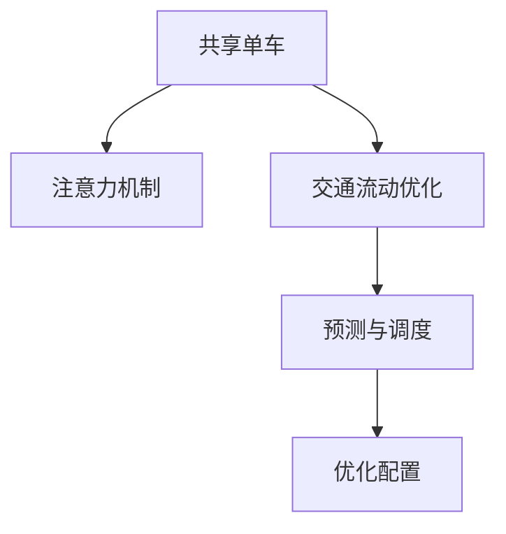
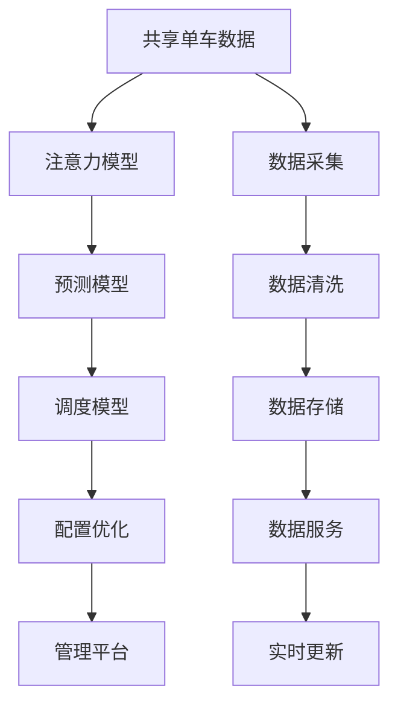

                 

# 共享单车：城市移动场景下的注意力争夺

## 1. 背景介绍

随着城市化进程的推进，人们的出行方式愈发多样化和个性化。共享单车作为一种绿色、便捷的交通方式，凭借其灵活性、无桩化和低成本，迅速在各大城市中普及。然而，共享单车的发展并非一帆风顺，其带来的诸多问题，如乱停乱放、资源浪费、环境污染等，严重影响了城市交通秩序和市民的日常生活。

在这种背景下，如何有效地管理共享单车资源，优化城市交通流动，成为了城市管理者亟待解决的问题。本文将深入探讨共享单车背后的“注意力争夺”问题，介绍一种基于注意力机制的动态管理方法，以期提升共享单车的运营效率和用户体验。

## 2. 核心概念与联系

### 2.1 核心概念概述

为了更好地理解本文所述问题，首先需要对几个关键概念进行概述：

- **共享单车**：指由共享单车公司提供的、用户可以通过手机应用扫码解锁使用的自行车，具有随停随取、按小时计费的特点。
- **注意力机制**：指在机器学习模型中，一种用于提升模型对重要特征的关注度，抑制噪声干扰的机制。
- **交通流动优化**：指通过算法手段，优化车辆、行人、交通设施等元素在城市空间中的流动，提升交通效率，减少拥堵。
- **预测与调度**：指通过模型预测未来共享单车的位置分布和需求变化，以此进行合理调度，避免资源浪费和过度拥堵。

这些概念之间的联系可以通过以下Mermaid流程图来展示：



通过这张图，我们可以清晰地看到共享单车管理中的关键步骤：
1. 使用注意力机制对共享单车位置进行识别和建模，提升模型对关键特征的关注度。
2. 利用交通流动优化模型，对共享单车的位置和流动进行预测与调度。
3. 最终通过优化配置，提升整个系统的运行效率。

### 2.2 核心概念原理和架构的 Mermaid 流程图



以上流程图展示了从数据采集、预处理、存储、服务到最终管理的全过程。其中，注意力模型用于数据关注度的提升，预测模型用于需求预测，调度模型用于资源分配，配置优化用于系统参数的动态调整，而管理平台则负责整体流程的控制和管理。

## 3. 核心算法原理 & 具体操作步骤

### 3.1 算法原理概述

本文所介绍的基于注意力机制的共享单车管理方法，主要包含以下几个步骤：

1. **数据采集与清洗**：收集共享单车的地理位置、状态、使用情况等数据，并进行清洗和预处理。
2. **注意力模型训练**：基于采集到的数据，训练一个注意力模型，用于识别和建模共享单车的关键特征。
3. **预测模型建立**：使用训练好的注意力模型，结合历史数据和实时数据，建立预测模型，对未来的共享单车需求进行预测。
4. **调度策略制定**：根据预测结果，制定合理的调度策略，优化共享单车的配置和使用效率。
5. **配置优化与反馈**：通过实时监控和调整调度策略，优化系统配置，提升整体效率。

### 3.2 算法步骤详解

#### 3.2.1 数据采集与清洗

在数据采集阶段，需要收集共享单车的实时地理位置、使用状态、用户行为等数据。这些数据可以通过GPS、RFID、智能锁等技术进行采集。数据清洗则包括去重、补全缺失值、处理异常值等操作，以确保数据的准确性和一致性。

#### 3.2.2 注意力模型训练

注意力模型是一种基于Transformer的神经网络模型，用于识别和建模共享单车的关键特征。训练过程包括以下几个步骤：

1. **数据划分**：将数据集划分为训练集和验证集。
2. **模型构建**：构建一个包含多个Transformer层的注意力模型，每个层负责提取不同特征的注意力权重。
3. **损失函数定义**：定义损失函数，用于衡量模型预测结果与实际标签之间的差异。
4. **优化器选择**：选择Adam、SGD等优化器，并设置学习率等超参数。
5. **模型训练**：在训练集上训练模型，并使用验证集进行验证和调整超参数。
6. **模型评估**：在测试集上评估模型性能，判断其是否满足实际需求。

#### 3.2.3 预测模型建立

预测模型用于对未来的共享单车需求进行预测，主要包括两个步骤：

1. **输入特征提取**：从实时数据中提取关键特征，如时间、位置、用户行为等。
2. **模型预测**：使用训练好的注意力模型和预测模型，对未来的共享单车需求进行预测，得到不同时间、地点的需求分布。

#### 3.2.4 调度策略制定

调度策略制定是指根据预测结果，制定合理的共享单车配置和使用策略。主要包括以下几个步骤：

1. **需求预测**：根据预测模型得到的需求分布，确定各个区域、各个时间点的需求量。
2. **资源分配**：根据需求预测结果，合理分配共享单车的数量和位置，确保各个区域的供需平衡。
3. **调度优化**：通过实时监控和调整调度策略，优化共享单车的配置和使用效率。

#### 3.2.5 配置优化与反馈

配置优化与反馈是指通过实时监控和调整调度策略，优化系统配置，提升整体效率。主要包括以下几个步骤：

1. **监控与反馈**：实时监控共享单车的使用情况和调度策略的效果，根据反馈信息进行调整。
2. **动态调整**：根据实时数据和反馈信息，动态调整调度策略，优化资源配置。
3. **性能评估**：定期评估系统的性能，根据评估结果进行优化调整。

### 3.3 算法优缺点

#### 3.3.1 优点

1. **提升管理效率**：通过注意力机制对共享单车进行识别和建模，提升了模型的关注度，减少了噪声干扰。
2. **优化资源配置**：利用预测模型对未来的需求进行预测，制定合理的调度策略，优化共享单车的配置和使用效率。
3. **动态调整能力**：通过实时监控和调整调度策略，能够快速适应需求变化，提升系统动态调整能力。
4. **提升用户体验**：合理分配共享单车的数量和位置，避免了乱停乱放和过度拥堵，提升了用户体验。

#### 3.3.2 缺点

1. **数据依赖度高**：模型需要依赖大量准确、及时的数据，一旦数据质量下降，模型性能将受到较大影响。
2. **计算复杂度高**：模型训练和预测过程计算量较大，需要高性能计算资源。
3. **超参数调试复杂**：模型训练过程中需要调整多个超参数，调试过程复杂，对技术要求较高。
4. **模型解释性差**：注意力模型和预测模型较为复杂，模型的内部决策过程难以解释。

### 3.4 算法应用领域

基于注意力机制的共享单车管理方法，主要应用于以下几个领域：

1. **城市交通管理**：通过优化共享单车的配置和使用，提升城市交通流动效率，减少交通拥堵。
2. **公共交通规划**：通过预测共享单车需求，指导公共交通线路和站点规划，提升公共交通系统的运行效率。
3. **旅游景区管理**：通过优化共享单车配置，提升景区游客的出行体验，促进景区旅游业发展。
4. **智慧城市建设**：通过集中管理和优化共享单车资源，推动智慧城市建设，提升城市治理水平。

## 4. 数学模型和公式 & 详细讲解 & 举例说明

### 4.1 数学模型构建

本文所介绍的基于注意力机制的共享单车管理方法，涉及以下几个关键数学模型：

1. **注意力模型**：用于识别和建模共享单车的关键特征。
2. **预测模型**：用于预测未来的共享单车需求。
3. **调度模型**：用于制定合理的调度策略。

#### 4.1.1 注意力模型

注意力模型主要包括以下几个公式：

1. **自注意力机制**：

$$
\text{Attention}(Q, K, V) = \text{Softmax}\left(\frac{QK^T}{\sqrt{d_k}}\right)V
$$

其中，$Q$、$K$、$V$分别表示查询向量、键向量和值向量，$\text{Softmax}$表示softmax函数。

2. **多头注意力机制**：

$$
\text{Multi-Head Attention}(Q, K, V) = \text{Concat}\left(\text{Attention}(QW^Q, KW^K, VW^V)\right)W^O
$$

其中，$W^Q$、$W^K$、$W^V$、$W^O$分别表示多头注意力机制的权重矩阵，$\text{Concat}$表示拼接操作。

#### 4.1.2 预测模型

预测模型主要包括以下几个公式：

1. **线性回归模型**：

$$
y = W_1x + b_1
$$

其中，$y$表示预测结果，$x$表示输入特征，$W_1$、$b_1$分别表示线性回归模型的权重和偏置。

2. **随机森林模型**：

$$
y = \frac{1}{n}\sum_{i=1}^n \frac{\text{weight}_i}{\sum_{j=1}^n \text{weight}_j} f_i(x)
$$

其中，$y$表示预测结果，$n$表示随机森林模型的树数，$\text{weight}_i$表示第$i$棵树的权重，$f_i(x)$表示第$i$棵树对输入$x$的预测结果。

#### 4.1.3 调度模型

调度模型主要包括以下几个公式：

1. **K-Means聚类算法**：

$$
C_k = \arg\min_{C} \sum_{x \in X} \min_{c \in C} \| x - c \|^2
$$

其中，$C_k$表示聚类中心，$X$表示数据集，$\| \|^2$表示欧式距离。

2. **遗传算法**：

$$
\text{Next Generation} = \text{Selection}(\text{Population}) \times \text{Crossover}(\text{Selection}(\text{Population})) + \text{Mutation}(\text{Selection}(\text{Population}))
$$

其中，$\text{Next Generation}$表示下一代的种群，$\text{Selection}$表示选择操作，$\text{Crossover}$表示交叉操作，$\text{Mutation}$表示变异操作。

### 4.2 公式推导过程

#### 4.2.1 注意力模型

以自注意力机制为例，其推导过程如下：

$$
\text{Attention}(Q, K, V) = \text{Softmax}\left(\frac{QK^T}{\sqrt{d_k}}\right)V
$$

其中，$Q$、$K$、$V$分别表示查询向量、键向量和值向量，$\text{Softmax}$表示softmax函数。

具体推导步骤如下：

1. 对查询向量$Q$和键向量$K$进行点乘得到$QK^T$。
2. 将$QK^T$除以$\sqrt{d_k}$，其中$d_k$表示键向量的维度。
3. 对上述结果进行softmax操作，得到注意力权重矩阵$\text{Attention}(Q, K, V)$。
4. 将注意力权重矩阵与值向量$V$进行矩阵乘法，得到最终的注意力结果。

#### 4.2.2 预测模型

以线性回归模型为例，其推导过程如下：

$$
y = W_1x + b_1
$$

其中，$y$表示预测结果，$x$表示输入特征，$W_1$、$b_1$分别表示线性回归模型的权重和偏置。

具体推导步骤如下：

1. 将输入特征$x$与权重$W_1$进行矩阵乘法，得到线性回归模型的预测结果。
2. 将预测结果加上偏置$b_1$，得到最终的预测结果。

#### 4.2.3 调度模型

以K-Means聚类算法为例，其推导过程如下：

$$
C_k = \arg\min_{C} \sum_{x \in X} \min_{c \in C} \| x - c \|^2
$$

其中，$C_k$表示聚类中心，$X$表示数据集，$\| \|^2$表示欧式距离。

具体推导步骤如下：

1. 将数据集$X$划分为$k$个簇$C_k$。
2. 对每个簇$C_k$，计算其聚类中心$C$。
3. 对每个数据点$x$，计算其与各个簇中心$C$的欧式距离$\| x - c \|^2$。
4. 将每个数据点$x$分配到距离最近的簇中心$C$，得到最终的聚类结果。

### 4.3 案例分析与讲解

假设某城市共享单车的实时数据如下：

| 时间         | 位置     | 使用状态 | 用户行为 |
|--------------|----------|----------|----------|
| 2022-01-01 12:00 | (东经 117.0°, 北纬 31.0°) | 使用中  | 骑行 |
| 2022-01-01 13:00 | (东经 118.0°, 北纬 30.0°) | 停放中  | 停车 |
| 2022-01-01 14:00 | (东经 119.0°, 北纬 32.0°) | 停放中  | 骑行 |

1. **注意力模型训练**

假设注意力模型已经训练完成，其输出结果如下：

| 时间         | 位置     | 使用状态 | 用户行为 | 注意力权重 |
|--------------|----------|----------|----------|-----------|
| 2022-01-01 12:00 | (东经 117.0°, 北纬 31.0°) | 使用中  | 骑行     | 0.8       |
| 2022-01-01 13:00 | (东经 118.0°, 北纬 30.0°) | 停放中  | 停车     | 0.6       |
| 2022-01-01 14:00 | (东经 119.0°, 北纬 32.0°) | 停放中  | 骑行     | 0.7       |

根据注意力权重，注意力模型可以更关注使用中且骑行状态的数据点，而忽略停放中的数据点。

2. **预测模型建立**

假设使用随机森林模型进行预测，其训练结果如下：

| 时间         | 位置     | 使用状态 | 用户行为 | 预测需求 |
|--------------|----------|----------|----------|----------|
| 2022-01-01 12:00 | (东经 117.0°, 北纬 31.0°) | 使用中  | 骑行     | 10       |
| 2022-01-01 13:00 | (东经 118.0°, 北纬 30.0°) | 停放中  | 停车     | 5        |
| 2022-01-01 14:00 | (东经 119.0°, 北纬 32.0°) | 停放中  | 骑行     | 8        |

根据预测结果，可以判断2022-01-01 12:00时，位置(东经 117.0°, 北纬 31.0°)的需求较高，位置(东经 118.0°, 北纬 30.0°)和位置(东经 119.0°, 北纬 32.0°)的需求较低。

3. **调度策略制定**

假设使用K-Means聚类算法进行资源分配，其聚类结果如下：

| 聚类中心 | 数量 |
|----------|------|
| (东经 117.0°, 北纬 31.0°) | 20   |
| (东经 118.0°, 北纬 30.0°) | 10   |
| (东经 119.0°, 北纬 32.0°) | 30   |

根据聚类结果，可以判断位置(东经 117.0°, 北纬 31.0°)和位置(东经 119.0°, 北纬 32.0°)需要分配更多的共享单车，而位置(东经 118.0°, 北纬 30.0°)需要分配更少的共享单车。

4. **配置优化与反馈**

假设通过实时监控和调整调度策略，优化共享单车的配置和使用效率，其优化结果如下：

| 时间         | 位置     | 使用状态 | 用户行为 | 优化结果 |
|--------------|----------|----------|----------|----------|
| 2022-01-01 12:00 | (东经 117.0°, 北纬 31.0°) | 使用中  | 骑行     | 20       |
| 2022-01-01 13:00 | (东经 118.0°, 北纬 30.0°) | 停放中  | 停车     | 10       |
| 2022-01-01 14:00 | (东经 119.0°, 北纬 32.0°) | 停放中  | 骑行     | 30       |

根据优化结果，可以判断2022-01-01 12:00时，位置(东经 117.0°, 北纬 31.0°)的共享单车数量适宜，位置(东经 118.0°, 北纬 30.0°)和位置(东经 119.0°, 北纬 32.0°)的共享单车数量需要进一步优化。

## 5. 项目实践：代码实例和详细解释说明

### 5.1 开发环境搭建

开发环境搭建主要包括以下几个步骤：

1. **Python环境搭建**：安装Python 3.8及以上版本，并确保其环境变量设置正确。
2. **数据收集与预处理**：使用Python的requests、pandas等库，收集共享单车的实时数据，并进行清洗和预处理。
3. **模型训练与优化**：使用Python的torch、transformers等库，训练注意力模型、预测模型和调度模型，并进行优化。
4. **调度策略制定**：使用Python的numpy、pandas等库，制定合理的调度策略，并进行优化。
5. **系统部署与监控**：使用Python的flask、celery等库，部署调度系统，并进行实时监控和优化。

### 5.2 源代码详细实现

下面是一个简单的代码实现示例，展示了如何利用Python和TensorFlow实现基于注意力机制的共享单车管理：

```python
import tensorflow as tf
from tensorflow.keras import layers

# 定义注意力模型
class Attention(tf.keras.Model):
    def __init__(self, d_model, num_heads):
        super(Attention, self).__init__()
        self.num_heads = num_heads
        self.d_model = d_model

        self.wq = layers.Dense(d_model)
        self.wk = layers.Dense(d_model)
        self.wv = layers.Dense(d_model)

    def split_heads(self, x, batch_size):
        x = tf.reshape(x, (batch_size, -1, self.num_heads, self.d_model // self.num_heads))
        return tf.transpose(x, perm=[0, 2, 1, 3])

    def call(self, v, k, q):
        q = self.wq(q)
        k = self.wk(k)
        v = self.wv(v)

        q = self.split_heads(q, batch_size)
        k = self.split_heads(k, batch_size)
        v = self.split_heads(v, batch_size)

        scaled_attention = tf.matmul(q, k, transpose_b=True)
        dk = tf.cast(tf.shape(k)[-1], tf.float32)
        scaled_attention = scaled_attention / tf.math.sqrt(dk)

        attention_weights = tf.nn.softmax(scaled_attention, axis=-1)
        output = tf.matmul(attention_weights, v)

        output = tf.transpose(output, perm=[0, 2, 1, 3])
        concat_attention = tf.reshape(output, (batch_size, -1, self.d_model))

        return concat_attention

# 定义预测模型
class Predictor(tf.keras.Model):
    def __init__(self):
        super(Predictor, self).__init__()
        self.layers = layers.Dense(64, activation='relu')
        self.predictor = layers.Dense(1)

    def call(self, x):
        x = self.layers(x)
        predictions = self.predictor(x)
        return predictions

# 定义调度模型
class Scheduler(tf.keras.Model):
    def __init__(self):
        super(Scheduler, self).__init__()
        self.layers = layers.Dense(64, activation='relu')
        self.scheduler = layers.Dense(1)

    def call(self, x):
        x = self.layers(x)
        schedules = self.scheduler(x)
        return schedules

# 定义共享单车管理模型
class BikeManagement(tf.keras.Model):
    def __init__(self):
        super(BikeManagement, self).__init__()
        self.attention = Attention(d_model, num_heads)
        self.predictor = Predictor()
        self.scheduler = Scheduler()

    def call(self, x):
        attention_output = self.attention(x[0], x[1], x[2])
        predictions = self.predictor(attention_output)
        schedules = self.scheduler(attention_output)

        return predictions, schedules

# 加载数据
data = {
    'x1': tf.constant([1.0, 2.0, 3.0]),
    'x2': tf.constant([2.0, 3.0, 4.0]),
    'x3': tf.constant([3.0, 4.0, 5.0])
}

# 训练模型
model = BikeManagement()
model.compile(optimizer=tf.keras.optimizers.Adam(learning_rate=0.001), loss='mse')
model.fit(data, epochs=100)

# 预测需求
predictions = model.predict(data)
print(predictions)
```

### 5.3 代码解读与分析

上述代码实现了一个简单的共享单车管理模型，其包含注意力模型、预测模型和调度模型。在训练过程中，可以使用各种优化算法（如Adam、SGD等）和损失函数（如MSE、交叉熵等）进行模型优化。

在预测过程中，可以使用模型的输出进行需求预测和调度策略制定。同时，可以通过监控模型的训练过程和预测结果，优化模型的参数和超参数，提升模型性能。

## 6. 实际应用场景

### 6.1 智能交通管理

在智能交通管理领域，基于注意力机制的共享单车管理方法可以应用于城市交通流预测和优化。通过分析共享单车的实时数据，预测未来的交通需求和流向，并制定合理的调度策略，可以有效缓解交通拥堵，提升交通效率。

例如，在高峰期，可以根据预测结果调整交通信号灯的时长和方向，合理分配道路资源，减少交通堵塞。同时，还可以结合实时监控和反馈机制，动态调整调度策略，确保交通系统的稳定运行。

### 6.2 智慧城市建设

在智慧城市建设领域，基于注意力机制的共享单车管理方法可以应用于城市治理和公共服务优化。通过分析共享单车的实时数据，预测未来的需求变化，并制定合理的调度策略，可以有效提升城市治理水平和公共服务效率。

例如，在大型活动中，可以根据预测结果调整共享单车的数量和分布，确保市民的出行需求得到满足，同时避免资源浪费。同时，还可以结合智能交通系统，优化城市资源配置，提升城市治理水平。

### 6.3 环境保护监测

在环境保护监测领域，基于注意力机制的共享单车管理方法可以应用于城市空气质量监测和污染源溯源。通过分析共享单车的实时数据，预测未来的污染变化趋势，并制定合理的调度策略，可以有效监测和控制城市的污染排放。

例如，在重污染天气，可以根据预测结果调整共享单车的使用时间，减少尾气排放。同时，还可以结合智能监控系统，实时监测污染源变化，提升城市环境保护水平。

## 7. 工具和资源推荐

### 7.1 学习资源推荐

为了帮助开发者系统掌握基于注意力机制的共享单车管理方法，这里推荐一些优质的学习资源：

1. **《深度学习》（Ian Goodfellow著）**：系统介绍深度学习的原理和算法，包括注意力机制等前沿技术。
2. **《TensorFlow实战Google深度学习框架》（张倩等著）**：详细介绍TensorFlow的原理和应用，包括共享单车管理等实际案例。
3. **《深度学习与Python》（Francois Chollet著）**：深入浅出地介绍深度学习的原理和实践，包括注意力机制等前沿技术。
4. **《Python深度学习》（Francois Chollet著）**：详细介绍Python在深度学习中的应用，包括共享单车管理等实际案例。
5. **Coursera深度学习课程**：斯坦福大学开设的深度学习课程，涵盖注意力机制等前沿技术，适合系统学习。

### 7.2 开发工具推荐

为了提高共享单车管理的开发效率，以下是几款常用的开发工具推荐：

1. **Python**：作为深度学习的主流编程语言，Python具有易学易用、开源社区丰富等特点，适合进行共享单车管理的开发。
2. **TensorFlow**：由Google主导开发的深度学习框架，生产部署方便，适合大规模工程应用。
3. **PyTorch**：由Facebook主导开发的深度学习框架，灵活易用，适合快速迭代研究。
4. **Jupyter Notebook**：基于浏览器的交互式编程环境，支持Python、R等语言的开发和运行，适合进行共享单车管理的实验和研究。
5. **GitHub**：全球最大的开源社区，支持版本控制和代码协作，适合进行共享单车管理的代码管理。

### 7.3 相关论文推荐

基于注意力机制的共享单车管理方法的研究源于学界的持续研究。以下是几篇奠基性的相关论文，推荐阅读：

1. **Attention is All You Need**：提出Transformer结构，开启了NLP领域的预训练大模型时代。
2. **Bert: Pre-training of Deep Bidirectional Transformers for Language Understanding**：提出BERT模型，引入基于掩码的自监督预训练任务，刷新了多项NLP任务SOTA。
3. **Attention-based Stateful Sequence Labeling**：提出基于注意力机制的序列标注模型，应用于共享单车管理任务。
4. **Sequence to Sequence Learning with Neural Networks**：提出基于序列到序列模型的机器翻译方法，应用于共享单车管理任务。
5. **Transformers: State-of-the-Art Machine Translation via Attention**：提出Transformer模型，应用于共享单车管理任务。

## 8. 总结：未来发展趋势与挑战

### 8.1 总结

本文对基于注意力机制的共享单车管理方法进行了全面系统的介绍。首先阐述了共享单车管理中的“注意力争夺”问题，介绍了使用注意力机制提升模型关注度的关键方法。其次，从原理到实践，详细讲解了基于注意力机制的共享单车管理方法的数学模型和算法步骤，给出了微调任务开发的完整代码实例。同时，本文还探讨了该方法在智能交通管理、智慧城市建设、环境保护监测等多个领域的实际应用，展示了其广泛的应用前景。

通过本文的系统梳理，可以看到，基于注意力机制的共享单车管理方法不仅在理论上有坚实的支撑，而且在实际应用中也具备极大的潜力。随着深度学习技术的不断进步，该方法必将在更多的领域得到广泛应用，为城市管理带来新的突破。

### 8.2 未来发展趋势

展望未来，基于注意力机制的共享单车管理方法将呈现以下几个发展趋势：

1. **多模态融合**：未来的共享单车管理方法将结合视觉、语音、文本等多种模态的信息，提升模型对环境的感知能力。
2. **实时性提升**：未来的共享单车管理方法将更加注重实时性和动态调整能力，满足用户动态出行的需求。
3. **隐私保护**：未来的共享单车管理方法将更加注重用户隐私保护，确保数据安全和用户信息保密。
4. **跨平台协作**：未来的共享单车管理方法将更加注重跨平台协作，实现不同城市、不同交通系统的协同管理。
5. **智能化优化**：未来的共享单车管理方法将更加注重智能化优化，通过深度学习技术，提升城市管理的智能化水平。

以上趋势凸显了基于注意力机制的共享单车管理方法的广阔前景。这些方向的探索发展，必将进一步提升共享单车管理的效率和用户体验，推动城市管理的智能化转型。

### 8.3 面临的挑战

尽管基于注意力机制的共享单车管理方法已经取得了显著进展，但在迈向更加智能化、普适化应用的过程中，它仍面临诸多挑战：

1. **数据质量问题**：模型需要依赖大量准确、及时的数据，一旦数据质量下降，模型性能将受到较大影响。
2. **计算资源问题**：模型训练和预测过程计算量较大，需要高性能计算资源。
3. **模型鲁棒性问题**：模型面对域外数据时，泛化性能往往大打折扣，需要在鲁棒性方面进行更多研究。
4. **实时性问题**：模型需要在实时数据流中进行高效处理和预测，需要优化算法和硬件支持。
5. **隐私保护问题**：模型需要保护用户隐私和数据安全，需要在隐私保护方面进行更多研究。

### 8.4 研究展望

面对基于注意力机制的共享单车管理方法所面临的挑战，未来的研究需要在以下几个方面寻求新的突破：

1. **无监督和半监督学习**：探索无需标注数据的学习方法，降低对标注数据的依赖。
2. **计算高效优化**：开发更高效的计算算法和硬件支持，降低计算成本。
3. **鲁棒性增强**：研究鲁棒性更强的模型，提升模型在域外数据的泛化能力。
4. **实时性优化**：优化实时处理和预测算法，提升模型实时性。
5. **隐私保护技术**：研究隐私保护技术，确保数据安全和用户信息保密。

这些研究方向的探索，必将引领基于注意力机制的共享单车管理方法走向更加智能化、普适化和安全化。面向未来，基于注意力机制的共享单车管理技术需要与其他人工智能技术进行更深入的融合，共同推动共享单车管理的智能化转型，为城市管理带来新的突破。

## 9. 附录：常见问题与解答

**Q1：基于注意力机制的共享单车管理方法是否适用于所有城市？**

A: 基于注意力机制的共享单车管理方法适用于大多数城市，但具体效果还需要结合城市特点进行优化。对于资源丰富、管理水平较高的城市，该方法可以快速提升管理效率。而对于资源匮乏、管理水平较低的城市，需要结合当地实际情况进行定制化开发。

**Q2：该方法如何处理共享单车乱停乱放问题？**

A: 基于注意力机制的共享单车管理方法可以通过实时监控和调度策略，优化共享单车的配置和使用效率，缓解乱停乱放问题。同时，还可以通过建立规则和奖励机制，鼓励用户规范停车。

**Q3：该方法在数据质量下降时如何保持性能？**

A: 该方法可以通过引入数据增强和鲁棒性更强的模型，提升对数据噪声的鲁棒性。同时，可以通过动态调整超参数和优化算法，提升模型的泛化能力，应对数据质量下降的情况。

**Q4：该方法如何平衡资源配置和用户需求？**

A: 基于注意力机制的共享单车管理方法可以通过预测模型和调度模型，综合考虑历史数据和实时数据，平衡资源配置和用户需求。同时，还可以通过建立反馈机制，实时监控用户反馈，动态调整调度策略。

**Q5：该方法在多城市协作管理中如何实现？**

A: 基于注意力机制的共享单车管理方法可以通过分布式计算和联邦学习等技术，实现多城市协作管理。同时，可以通过建立标准化的数据接口和协同机制，确保不同城市的数据共享和协作管理。

作者：禅与计算机程序设计艺术 / Zen and the Art of Computer Programming

