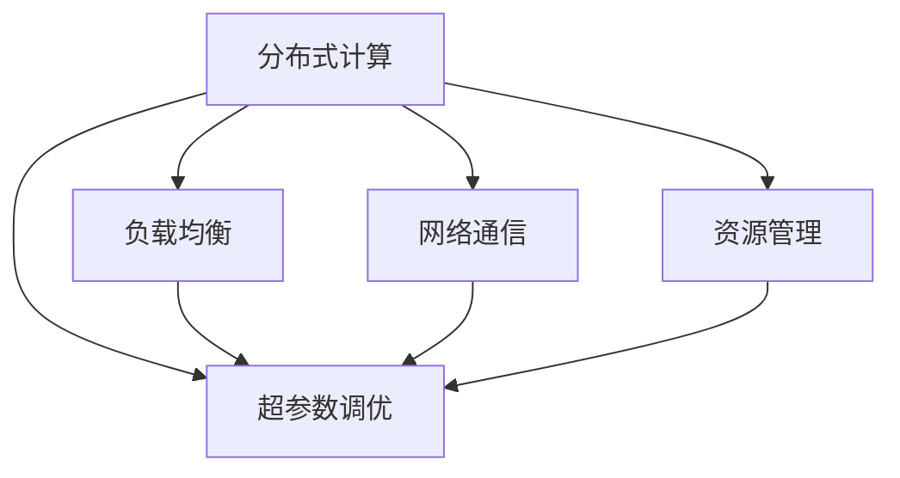

                 

# 分布式优化的挑战和策略

> 关键词：分布式计算, 优化算法, 超参数调优, 负载均衡, 网络通信, 资源管理

## 1. 背景介绍

在现代大规模计算任务中，分布式优化成为了必不可少的环节。随着计算机系统的复杂性不断提高，单一的计算节点已经无法满足日益增长的计算需求。通过分布式计算框架，可以将大规模任务切分为多个子任务，并行运行在不同的计算节点上，从而大幅提升计算效率。

然而，分布式优化的过程并非总是平稳顺利的。它面临着诸如负载均衡、网络通信、资源管理等诸多挑战。这些挑战如果处理不当，可能会导致分布式系统效率低下，甚至完全失效。因此，掌握和应用高效的分布式优化策略，对于构建高性能分布式系统至关重要。

本文将从分布式优化的背景和意义出发，详细探讨分布式优化的核心概念、面临的挑战以及有效的优化策略，并结合实际应用场景进行讲解和分析。

## 2. 核心概念与联系

### 2.1 核心概念概述

在分布式优化中，关键概念包括：

- 分布式计算(Distributed Computing)：通过将大规模任务分解成多个子任务，在不同的计算节点上并行执行，从而提升整体计算效率。
- 负载均衡(Load Balancing)：确保每个计算节点上的任务量大致相等，避免某些节点过载而影响整体系统性能。
- 网络通信(Network Communication)：在分布式系统中，数据需要在不同节点之间传输，网络通信效率直接影响系统的响应速度和吞吐量。
- 资源管理(Resource Management)：优化资源的分配与回收，如CPU、内存、网络带宽等，以实现高效利用。
- 超参数调优(Hyperparameter Tuning)：确定模型训练过程中的超参数，如学习率、批量大小等，以优化模型性能。

这些概念之间的联系可以通过以下Mermaid流程图来展示：



这个流程图展示了大规模计算任务中分布式优化的各个环节及其相互关系。分布式计算是整个系统的基础，负载均衡、网络通信和资源管理是其关键支撑，超参数调优则是提升整体性能的关键手段。

## 3. 核心算法原理 & 具体操作步骤
### 3.1 算法原理概述

分布式优化的目标是在不同的计算节点上并行执行大规模任务，通过协同计算提升效率。其核心算法包括：

- MapReduce：一种分布式计算模型，将任务划分为多个Map阶段和多个Reduce阶段，适合处理大规模数据集。
- 分布式优化算法：如遗传算法、粒子群算法、分布式梯度下降等，通过在多个节点上并行搜索最优解，提升优化效率。
- 超参数调优算法：如网格搜索、随机搜索、贝叶斯优化等，通过多个节点的协同计算，寻找最优超参数配置。

分布式优化的关键在于设计合理的计算模型和优化算法，以充分挖掘并行计算的优势。

### 3.2 算法步骤详解

基于MapReduce模型的分布式优化过程包括：

1. 数据划分：将大规模数据集划分为多个子集，并分配到不同的计算节点上。
2. Map阶段：在每个节点上执行Map函数，将输入数据转化为中间结果。
3. Shuffle阶段：将Map阶段的中间结果按照特定规则（如键值对）进行分组，并将结果传输到Reduce节点。
4. Reduce阶段：在Reduce节点上执行Reduce函数，将分组后的中间结果合并为最终结果。

以下是具体步骤的详细说明：

1. **数据划分**：
   - 根据数据的规模和计算节点的数量，确定每个节点需要处理的数据块大小。
   - 将数据集划分为多个数据块，并将每个数据块分配到对应的计算节点。

2. **Map阶段**：
   - 在每个计算节点上，对分配到的数据块进行Map处理，生成一系列中间结果。
   - Map函数通常是一个无状态函数，只依赖输入数据。

3. **Shuffle阶段**：
   - 将Map阶段生成的中间结果按照键值对进行分组，并将相同键的值合并到一个分组中。
   - 分组后的结果通过网络传输到Reduce节点。

4. **Reduce阶段**：
   - 在Reduce节点上，对每个键对应的值进行合并操作，生成最终结果。
   - Reduce函数通常是累加或聚合操作。

### 3.3 算法优缺点

分布式优化的主要优点包括：

- 高效利用计算资源：通过并行计算，充分利用不同节点的计算能力。
- 处理大规模数据：适用于处理海量数据的分布式计算任务。
- 灵活性高：支持多种数据处理方式和任务类型。

但同时也存在一些缺点：

- 通信开销大：不同节点之间的数据传输增加了网络通信的负担。
- 负载不均衡：某些节点可能过载，而其他节点可能空闲。
- 调优复杂：需要复杂的超参数配置和优化算法。

### 3.4 算法应用领域

分布式优化在以下领域有着广泛应用：

- 大数据处理：处理大规模数据集，如Hadoop、Spark等分布式计算框架。
- 机器学习：大规模模型训练，如TensorFlow分布式训练、PyTorch分布式训练。
- 高并发系统：处理高并发请求，如Web服务器、数据库系统。
- 实时数据处理：实时流数据的处理和分析，如Flink、Storm等流计算框架。
- 人工智能：深度学习模型的分布式训练和推理，如Distributed TensorFlow。

## 4. 数学模型和公式 & 详细讲解 & 举例说明

### 4.1 数学模型构建

分布式优化的数学模型可以表示为：

$$
\min_{x} f(x) = \sum_{i=1}^n f_i(x_i)
$$

其中，$f_i(x_i)$ 表示第$i$个节点的局部函数，$x$ 表示全局最优解。

在分布式优化中，通常使用分布式梯度下降算法来求解上述优化问题。

### 4.2 公式推导过程

分布式梯度下降算法（Distributed Gradient Descent, DGD）的推导过程如下：

1. 假设每个节点$i$的局部函数为 $f_i(x_i)$，其梯度为 $g_i(x_i)$。
2. 更新规则为 $x_{i+1} = x_i - \eta \times g_i(x_i)$，其中 $\eta$ 为学习率。
3. 将每个节点的更新规则进行合并，得到全局更新规则 $x_{i+1} = x_i - \eta \times \sum_{i=1}^n g_i(x_i)$。

### 4.3 案例分析与讲解

以TensorFlow分布式梯度下降为例，解释分布式优化的具体实现：

1. **数据划分**：将训练数据集划分到多个计算节点上。
2. **Map阶段**：在每个节点上，对分配到的数据进行前向传播，计算梯度。
3. **Shuffle阶段**：将每个节点的梯度按照任务维度进行分组，并将结果传输到Reduce节点。
4. **Reduce阶段**：在Reduce节点上，对所有梯度进行聚合，得到全局梯度，并进行反向传播更新模型参数。

## 5. 项目实践：代码实例和详细解释说明
### 5.1 开发环境搭建

在进行分布式优化实践前，我们需要准备好开发环境。以下是使用Python进行PyTorch分布式优化的环境配置流程：

1. 安装Anaconda：从官网下载并安装Anaconda，用于创建独立的Python环境。

2. 创建并激活虚拟环境：
```bash
conda create -n pytorch-env python=3.8 
conda activate pytorch-env
```

3. 安装PyTorch：根据CUDA版本，从官网获取对应的安装命令。例如：
```bash
conda install pytorch torchvision torchaudio cudatoolkit=11.1 -c pytorch -c conda-forge
```

4. 安装Transformers库：
```bash
pip install transformers
```

5. 安装各类工具包：
```bash
pip install numpy pandas scikit-learn matplotlib tqdm jupyter notebook ipython
```

完成上述步骤后，即可在`pytorch-env`环境中开始分布式优化实践。

### 5.2 源代码详细实现

以下是一个基于TensorFlow的分布式梯度下降实现示例：

```python
import tensorflow as tf
from tensorflow import distribute

# 设置分布式计算环境
strategy = distribute.MirroredStrategy()

# 定义全局变量
v = tf.Variable(0.0, strategy=strategy)

# 定义局部函数
def local_function():
    with strategy.scope():
        x = tf.Variable(0.0, name='x')
        y = tf.Variable(0.0, name='y')
        loss = x**2 + y**2
        optimizer = tf.optimizers.SGD(learning_rate=0.01)
        optimizer.minimize(loss)

# 创建多个计算节点
num_gpus = 4
devices = ['/gpu:{}'.format(i) for i in range(num_gpus)]
with strategy.scope():
    local_function = tf.function(local_function)
    
# 在每个计算节点上执行局部函数
with tf.device(devices[0]):
    local_function()
    
with tf.device(devices[1]):
    local_function()
    
with tf.device(devices[2]):
    local_function()
    
with tf.device(devices[3]):
    local_function()
```

### 5.3 代码解读与分析

让我们再详细解读一下关键代码的实现细节：

**TensorFlow分布式计算环境设置**：
- 使用`tf.distribute.MirroredStrategy()`创建分布式计算环境。
- 在每个计算节点上，将全局变量`v`进行同步复制，保证每个节点上的变量值一致。

**局部函数定义**：
- 定义一个无状态局部函数`local_function`，使用`strategy.scope()`对变量进行分布式管理。
- 在函数内部定义局部变量`x`和`y`，并计算损失函数。
- 使用`tf.optimizers.SGD()`定义优化器，并使用`optimizer.minimize(loss)`更新变量`x`和`y`。

**计算节点并行执行**：
- 根据计算节点的数量，分配不同的设备（GPU）。
- 在每个计算节点上执行`local_function`，使用`tf.device(devices[i])`将函数映射到指定设备。

**结果展示**：
- 运行代码后，每个计算节点将分别执行一次局部函数，最终全局变量`v`的值在所有节点上同步更新。

可以看到，TensorFlow提供了丰富的分布式计算功能，使得分布式优化实践变得简单易行。

## 6. 实际应用场景
### 6.1 大规模模型训练

在大规模深度学习模型训练中，分布式优化是不可或缺的。以训练深度神经网络为例，通过分布式计算，可以将模型切分为多个子模型，并行训练在不同的计算节点上，从而大幅提升训练效率。

在实际应用中，可以使用Hadoop、Spark等分布式计算框架，结合TensorFlow或PyTorch的分布式训练功能，构建大规模模型训练系统。例如，可以在多个GPU集群上同时训练多个模型，每个模型分配一定的训练数据，最终将结果合并，得到最终的模型参数。

### 6.2 高并发系统

在Web服务器、数据库系统等高并发应用场景中，分布式优化同样至关重要。通过分布式计算，可以在多个计算节点上并行处理请求，提升系统响应速度和吞吐量。

以Web服务器为例，可以将用户请求分配到多个计算节点上，每个节点独立处理请求，并将结果合并返回给客户端。这种方法可以大大提升服务器的并发处理能力，避免单个节点过载。

### 6.3 实时数据处理

在实时数据处理中，分布式优化可以用于处理大规模的流数据。例如，Flink、Storm等流计算框架，可以将数据流划分为多个子流，并行处理在不同的计算节点上，实时生成处理结果。

在实际应用中，可以构建分布式数据流管道，将实时数据源（如Kafka、消息队列）接入Flink或Storm系统，并行处理数据流，得到实时的处理结果。

### 6.4 未来应用展望

随着分布式计算技术的不断发展，分布式优化将在更多领域得到应用，为高性能计算提供新的解决方案。

在科学研究中，分布式计算可以用于处理大规模科学数据，如基因组分析、天气预报等，加速科学研究的进程。

在商业应用中，分布式优化可以用于处理大规模交易数据，提升金融系统的处理能力，实现高频交易和实时分析。

在社交媒体分析中，分布式优化可以用于处理大规模用户数据，进行情感分析、舆情监测等，提升社交媒体的分析和挖掘能力。

未来，伴随分布式计算技术的持续演进，分布式优化将为高性能计算提供更强大的支持，带来更广泛的应用场景和更大的计算效率提升。

## 7. 工具和资源推荐
### 7.1 学习资源推荐

为了帮助开发者系统掌握分布式优化的理论基础和实践技巧，这里推荐一些优质的学习资源：

1. 《深入理解分布式计算》系列博文：由分布式计算专家撰写，深入浅出地介绍了分布式计算的基本原理和常见算法。

2. 《分布式系统原理与实现》课程：由斯坦福大学开设的分布式系统课程，讲解了分布式系统设计的核心概念和关键技术。

3. 《TensorFlow分布式计算》书籍：TensorFlow官方文档中的分布式计算部分，详细介绍了如何使用TensorFlow进行分布式计算和优化。

4. 《Apache Spark官方文档》：Apache Spark的官方文档，提供了丰富的分布式计算和优化实践样例，是分布式优化的权威资料。

5. 《分布式机器学习》书籍：讲解了分布式机器学习的基本概念和算法，涵盖了分布式优化、数据划分、资源管理等内容。

通过对这些资源的学习实践，相信你一定能够全面掌握分布式优化的精髓，并应用于解决实际的计算问题。

### 7.2 开发工具推荐

高效的分布式优化离不开优秀的工具支持。以下是几款用于分布式优化的常用工具：

1. TensorFlow：基于Python的开源深度学习框架，提供了丰富的分布式计算和优化功能。

2. PyTorch：基于Python的开源深度学习框架，灵活性高，适用于分布式训练和推理。

3. Spark：由Apache基金会维护的分布式计算框架，支持多种编程语言，适用于大数据处理和流计算。

4. Hadoop：开源的分布式计算框架，适用于大规模数据存储和处理。

5. Kafka：高吞吐量的分布式消息系统，适用于大规模数据流处理和实时数据传输。

6. Zookeeper：分布式协调服务，用于管理分布式系统中的节点状态和资源调度。

合理利用这些工具，可以显著提升分布式优化的开发效率，加快技术创新的步伐。

### 7.3 相关论文推荐

分布式优化的研究源于学界的持续探索。以下是几篇奠基性的相关论文，推荐阅读：

1. MapReduce: Simplified Data Processing on Large Clusters：提出MapReduce模型，为大规模数据处理提供了全新的思路。

2. Distributed TensorFlow: Distributed Deep Learning with TensorFlow：介绍TensorFlow的分布式计算和优化功能，展示了分布式深度学习的应用。

3. Efficient Data Analysis with Apache Spark：讲解Apache Spark的分布式计算和优化功能，提供了丰富的实践样例。

4. Cluster-based Distributed Deep Learning: A Survey：综述了分布式深度学习的研究进展，介绍了各种分布式优化算法。

5. Large-scale Distributed Deep Learning Training: A Synthesis of Methods and Tools：总结了分布式深度学习的优化方法，涵盖了数据划分、资源管理等内容。

这些论文代表了分布式优化的最新进展，通过学习这些前沿成果，可以帮助研究者把握学科前进方向，激发更多的创新灵感。

## 8. 总结：未来发展趋势与挑战

### 8.1 总结

本文对分布式优化的背景和意义进行了详细探讨，介绍了分布式优化的核心概念和关键算法，并结合实际应用场景进行讲解和分析。通过本文的系统梳理，可以看到，分布式优化在提升系统性能、扩展计算能力、优化资源管理等方面具有重要价值。

通过本文的系统梳理，可以看到，分布式优化在提升系统性能、扩展计算能力、优化资源管理等方面具有重要价值。掌握和应用高效的分布式优化策略，对于构建高性能分布式系统至关重要。

### 8.2 未来发展趋势

展望未来，分布式优化技术将呈现以下几个发展趋势：

1. 分布式优化算法更加多样化。随着优化算法的不断发展，分布式优化将出现更多高效、稳定的算法，提升计算效率和性能。

2. 分布式资源管理更加精细化。未来的分布式系统将具备更精细化的资源管理能力，能够动态调整计算资源，优化任务调度。

3. 分布式通信更加高效。未来的分布式系统将具备更高效的通信机制，降低网络通信开销，提升系统的响应速度和吞吐量。

4. 分布式模型训练更加智能化。未来的分布式系统将具备更智能的模型训练能力，能够自动进行超参数调优和模型优化。

5. 分布式系统更加灵活可扩展。未来的分布式系统将具备更灵活的可扩展性，能够根据需求动态扩展计算资源，满足不同的计算需求。

以上趋势凸显了分布式优化技术的广阔前景。这些方向的探索发展，必将进一步提升分布式系统的性能和可靠性，为构建高性能分布式系统提供更坚实的技术保障。

### 8.3 面临的挑战

尽管分布式优化技术已经取得了显著进展，但在迈向更加智能化、高效化应用的过程中，它仍面临着诸多挑战：

1. 通信延迟：不同节点之间的通信延迟是分布式优化的主要瓶颈。如何减少通信延迟，提升数据传输速度，是未来需要解决的关键问题。

2. 负载不均衡：分布式系统中负载不均衡问题普遍存在，某些节点可能过载而其他节点闲置。如何设计合理的负载均衡策略，优化资源分配，是分布式优化需要解决的重要问题。

3. 系统复杂性：分布式系统的设计和维护变得越来越复杂。如何简化系统设计，降低开发和维护成本，是未来需要解决的难题。

4. 数据一致性：在分布式系统中，数据的一致性问题难以避免。如何保证数据的一致性和完整性，是分布式优化的重要挑战。

5. 安全性：分布式系统面临的安全问题更加复杂。如何加强系统安全防护，防止数据泄露和攻击，是未来需要重点关注的方向。

这些挑战展示了分布式优化技术在实际应用中仍需不断完善和改进，未来的研究需要在这些方面进行更多的探索和创新。

### 8.4 研究展望

面对分布式优化所面临的挑战，未来的研究需要在以下几个方面寻求新的突破：

1. 研究高效的分布式算法。开发更高效、稳定的分布式优化算法，提升系统性能和可靠性。

2. 研究分布式资源管理。设计更精细化的资源管理策略，实现动态资源调度，优化系统性能。

3. 研究高效的通信机制。开发更高效的分布式通信技术，减少通信延迟，提升系统响应速度和吞吐量。

4. 研究分布式超参数调优。开发更智能的超参数调优算法，提升模型的优化效率和性能。

5. 研究分布式系统的可扩展性。设计更灵活、可扩展的分布式系统架构，满足不同规模的计算需求。

6. 研究分布式系统的安全性。加强分布式系统的安全防护，保证数据和系统的安全。

这些研究方向的发展，必将推动分布式优化技术的不断进步，为构建高性能、安全、可扩展的分布式系统提供更坚实的技术保障。

## 9. 附录：常见问题与解答

**Q1：分布式优化的目标是什么？**

A: 分布式优化的目标是通过并行计算，最大化利用计算资源，提升系统的计算能力和响应速度，实现高效、可靠的系统设计。

**Q2：分布式优化与单机优化的区别是什么？**

A: 分布式优化的主要区别在于计算任务的并行执行，多个计算节点同时处理任务。单机优化则是通过优化算法和数据结构，提升单个节点的计算效率。分布式优化适用于大规模计算任务，单机优化适用于中小规模计算任务。

**Q3：分布式优化中如何处理数据一致性问题？**

A: 在分布式优化中，通常采用分布式事务、分布式锁等机制，保证数据的一致性和完整性。例如，使用Zookeeper进行分布式锁管理，确保多个节点对共享数据的同步更新。

**Q4：分布式优化中如何优化资源管理？**

A: 分布式优化中的资源管理可以通过任务调度、节点亲和性、资源预留等方式实现。例如，使用Yarn调度器对任务进行分配，确保每个节点的资源利用率最大化。

**Q5：分布式优化中如何处理通信延迟问题？**

A: 分布式优化中的通信延迟问题可以通过优化网络拓扑、减少通信量、使用更高效的通信协议等方式解决。例如，使用Spark的Stage划分和Shuffle优化，减少数据传输量，提升系统响应速度。

这些问题的解答展示了分布式优化的复杂性和多样性，需要通过多种策略和手段进行综合考虑和优化。在实际应用中，需要根据具体场景和需求，选择合适的方法和技术。

---

作者：禅与计算机程序设计艺术 / Zen and the Art of Computer Programming

