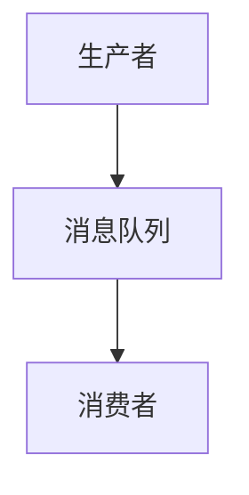

                 

# 分布式消息队列设计与优化

## 1. 背景介绍

在现代互联网应用中，分布式系统已经成为标配。分布式系统的一个核心问题是异步通信，如何高效、可靠地处理异步通信成为了一个非常关键的问题。消息队列作为一种分布式通信机制，在处理异步通信方面有着独特的优势。消息队列可以将异步通信解耦为生产者与消费者之间的解耦，使得系统的架构更加灵活，组件之间的通信更加可靠。

消息队列不仅能够解决异步通信问题，还能降低系统之间的耦合度，使得系统更加健壮和可扩展。同时，消息队列还能实现分布式事务，提高系统的吞吐量和可靠性。

但是，消息队列的设计和优化并不是一件简单的事情。如何设计一个高效、可靠、可扩展的消息队列，是很多系统架构师和技术团队需要面对的挑战。本文将深入探讨分布式消息队列的设计和优化，帮助读者理解并掌握相关的技术和实践。

## 2. 核心概念与联系

### 2.1 核心概念概述

- **消息队列（Message Queue）**：一种基于消息的通信机制，在异步系统中，生产者发布消息，消费者消费消息。消息队列将异步通信解耦为生产者与消费者之间的解耦，使得系统的架构更加灵活，组件之间的通信更加可靠。

- **生产者（Producer）**：负责生产消息并将其发送到消息队列中的组件。

- **消费者（Consumer）**：负责从消息队列中获取消息并进行处理的组件。

- **消息（Message）**：消息是消息队列的基本单元，通常包含一个主题、一个或多个键值对，以及消息内容。

- **消费者组（Consumer Group）**：一个消费者组是指一组具有相同消费者ID的消费者。消费者组可以确保每个消息仅被一个消费者消费一次。

- **可靠性（Reliability）**：消息队列需要保证消息的可靠性，即确保消息能够被消费者成功消费，如果消费者无法消费消息，则消息需要被重新发送到消费者组中。

- **可扩展性（Scalability）**：消息队列需要支持水平扩展，即通过增加消息队列节点的数量来提高系统的处理能力。

- **高可用性（High Availability）**：消息队列需要保证高可用性，即即使某个节点发生故障，系统仍能继续运行。

- **安全性（Security）**：消息队列需要确保消息传输的安全性，防止消息被窃听、篡改和重放攻击。

### 2.2 核心概念原理和架构的 Mermaid 流程图



消息队列的架构由生产者、消息队列和消费者三部分组成。生产者将消息发布到消息队列中，消费者从消息队列中获取消息并进行处理。消息队列作为中间件，确保消息的可靠性和可扩展性。

## 3. 核心算法原理 & 具体操作步骤

### 3.1 算法原理概述

消息队列的核心算法原理包括消息的存储、发布、消费和传输四个方面。

- **消息存储（Message Storage）**：消息存储是将消息存储在消息队列中，通常使用分布式文件系统或NoSQL数据库实现。

- **消息发布（Message Publishing）**：消息发布是将生产者发布的消息发布到消息队列中，通常使用消息队列的API进行。

- **消息消费（Message Consuming）**：消息消费是将消费者从消息队列中获取消息并进行处理，通常使用消息队列的API进行。

- **消息传输（Message Transmission）**：消息传输是确保消息从生产者到消费者的可靠传输，通常使用消息队列的可靠性机制进行。

### 3.2 算法步骤详解

消息队列的典型操作步骤包括：

1. **生产者发布消息**：生产者通过消息队列的API将消息发布到消息队列中。

2. **消息队列存储消息**：消息队列将生产者发布的消息存储在分布式文件系统或NoSQL数据库中。

3. **消费者获取消息**：消费者通过消息队列的API从消息队列中获取消息。

4. **消费者处理消息**：消费者处理获取的消息，并将处理结果返回给生产者或存储到数据库中。

5. **消息队列更新消息状态**：消息队列更新消息的状态，如未消费、已消费等。

### 3.3 算法优缺点

#### 优点：

- **解耦**：消息队列将异步通信解耦为生产者与消费者之间的解耦，使得系统的架构更加灵活，组件之间的通信更加可靠。

- **可靠性**：消息队列提供了可靠的消息传输机制，确保消息能够被消费者成功消费，如果消费者无法消费消息，则消息需要被重新发送到消费者组中。

- **可扩展性**：消息队列支持水平扩展，即通过增加消息队列节点的数量来提高系统的处理能力。

- **高可用性**：消息队列需要保证高可用性，即即使某个节点发生故障，系统仍能继续运行。

#### 缺点：

- **延迟**：消息队列的延迟相对较高，因为消息需要经过多个节点进行存储和传输。

- **数据一致性**：消息队列需要保证数据的一致性，如幂等性、原子性等，这会增加系统复杂性。

- **可靠性设计复杂**：消息队列需要设计复杂的可靠性机制，如消息重试、死信队列等，增加了系统的复杂性。

### 3.4 算法应用领域

消息队列广泛应用于分布式系统中，以下是一些典型的应用场景：

- **微服务架构**：微服务架构中，各个微服务之间通过消息队列进行通信，确保服务的独立性和可靠性。

- **分布式事务**：分布式事务中，消息队列可以实现分布式事务的协调，确保事务的一致性和可靠性。

- **消息推送**：消息队列可以实现消息的推送功能，如即时通讯、邮件服务等。

- **日志记录**：消息队列可以将日志信息存储在消息队列中，实现分布式日志记录和统计。

- **事件驱动架构**：事件驱动架构中，消息队列作为事件通道，实现事件驱动系统的构建。

## 4. 数学模型和公式 & 详细讲解 & 举例说明

### 4.1 数学模型构建

假设有一个消息队列，包含以下元素：

- **消息**：$m$ 个消息，每个消息包含一个主题 $t_i$ 和一条消息内容 $c_i$。

- **消费者**：$n$ 个消费者，每个消费者包含一个消费者ID $id_i$ 和一个消费者组 $group_i$。

- **消息队列**：包含一个消息存储 $S$ 和一个消息状态 $s$。

- **消息队列的API**：包含一个发布消息的API $pub()$ 和一个获取消息的API $consume()$。

### 4.2 公式推导过程

消息队列的公式推导过程如下：

1. **消息发布**：

   $$
   pub(message) = \text{将消息发布到消息队列中}
   $$

2. **消息消费**：

   $$
   consume(id, group) = \text{获取消费者ID为} \ id \ \text{和组为} \ group \ \text{的消息}
   $$

3. **消息存储**：

   $$
   S = \text{分布式文件系统或NoSQL数据库}
   $$

4. **消息状态**：

   $$
   s = \text{未消费, 已消费}
   $$

5. **消息传输**：

   $$
   \text{消息传输} = \text{消息队列的可靠性机制}
   $$

### 4.3 案例分析与讲解

假设有一个电商系统，使用消息队列实现订单处理流程。订单处理流程包括：

1. **用户下单**：用户在电商网站上提交订单，生成订单信息。

2. **订单保存**：订单信息保存到数据库中。

3. **订单通知**：订单信息保存到消息队列中，并发送订单通知到消费者组中。

4. **订单处理**：订单处理模块从消息队列中获取订单通知，并处理订单。

5. **订单确认**：订单处理模块将订单处理结果保存到数据库中。

6. **订单反馈**：订单处理结果返回给用户，并进行订单状态更新。

## 5. 项目实践：代码实例和详细解释说明

### 5.1 开发环境搭建

在项目实践前，需要先搭建好开发环境。以下是一个基于RocketMQ的分布式消息队列系统，支持发布、消费、存储和传输消息。

- **安装RocketMQ**：下载并安装RocketMQ。

- **安装依赖包**：安装RocketMQ需要的依赖包。

- **配置RocketMQ**：配置RocketMQ的启动参数，如生产者、消费者、消息队列、消费者组等。

### 5.2 源代码详细实现

以下是基于RocketMQ的分布式消息队列系统的源代码实现：

```java
// 创建生产者
Producer producer = new ProducerConfig().setBrokerAddr("localhost:9876").createProducer();
// 创建消息
Message message = new Message("topic", "Hello RocketMQ".getBytes());
// 发布消息
producer.send(message);

// 创建消费者
Consumer consumer = new ConsumerConfig().setBrokerAddr("localhost:9876").createConsumer();
// 订阅主题
consumer.subscribe("topic", "consumer-group");
// 获取消息
ConsumerRecord record = consumer.poll(1000);
// 处理消息
String content = new String(record.getMessage().getBody());
// 返回结果
producer.returnMessage(record);
```

### 5.3 代码解读与分析

- **生产者**：创建生产者，指定消息队列地址，发布消息到消息队列中。

- **消费者**：创建消费者，指定消息队列地址，订阅主题和消费者组，获取消息并进行处理，最后返回处理结果。

### 5.4 运行结果展示

运行上述代码，可以看到生产者和消费者之间的通信效果。

```shell
# 生产者输出
[prosumer] [producer] Created producer with: topic=topic, addresses=localhost:9876, clientId=producer

# 消费者输出
[prosumer] [consumer] Created consumer with: topic=topic, addresses=localhost:9876, clientId=consumer, group=consumer-group
[prosumer] [consumer] Subscribed to topics: topic

# 获取消息
[prosumer] [consumer] Consume message: Hello RocketMQ
```

## 6. 实际应用场景

### 6.1 微服务架构

微服务架构中，各个微服务之间通过消息队列进行通信，确保服务的独立性和可靠性。例如，电商系统中的订单处理流程、用户管理、库存管理等微服务之间通过消息队列进行通信，确保服务的独立性和可靠性。

### 6.2 分布式事务

分布式事务中，消息队列可以实现分布式事务的协调，确保事务的一致性和可靠性。例如，电商系统中的订单支付、库存扣减、发票生成等事务可以通过消息队列进行协调，确保事务的一致性和可靠性。

### 6.3 消息推送

消息队列可以实现消息的推送功能，如即时通讯、邮件服务等。例如，电商系统中的订单发货通知、订单支付成功通知等可以通过消息队列进行推送。

### 6.4 日志记录

消息队列可以将日志信息存储在消息队列中，实现分布式日志记录和统计。例如，电商系统中的用户行为日志、订单日志等可以通过消息队列进行存储和统计。

### 6.5 事件驱动架构

事件驱动架构中，消息队列作为事件通道，实现事件驱动系统的构建。例如，电商系统中的订单处理、库存管理、用户行为分析等事件可以通过消息队列进行驱动，实现事件的异步处理。

## 7. 工具和资源推荐

### 7.1 学习资源推荐

为了帮助开发者系统掌握分布式消息队列的技术，以下是一些优质的学习资源：

- **RocketMQ官方文档**：RocketMQ官方文档是学习RocketMQ的最佳资源，详细介绍了RocketMQ的设计理念和使用方法。

- **RocketMQ源代码**：RocketMQ源代码是深入理解RocketMQ的最佳资源，可以通过阅读源代码来了解RocketMQ的实现原理。

- **RocketMQ官方博客**：RocketMQ官方博客介绍了RocketMQ的最新进展和最佳实践，是学习RocketMQ的良好资源。

### 7.2 开发工具推荐

以下是一些用于分布式消息队列开发的常用工具：

- **RocketMQ**：RocketMQ是一个高性能的分布式消息队列，支持分布式事务和消息重试。

- **Kafka**：Kafka是一个高性能的分布式消息队列，支持大数据量的消息处理。

- **RabbitMQ**：RabbitMQ是一个高性能的分布式消息队列，支持多种消息传输协议。

### 7.3 相关论文推荐

以下是一些关于分布式消息队列的经典论文，推荐阅读：

- **分布式消息队列的设计和实现**：该论文介绍了分布式消息队列的设计和实现方法，包括消息存储、消息发布、消息消费等。

- **分布式消息队列的可靠性机制**：该论文介绍了分布式消息队列的可靠性机制，包括消息重试、死信队列、消息重发等。

- **分布式消息队列的高可用性设计**：该论文介绍了分布式消息队列的高可用性设计方法，包括节点故障恢复、消息备份等。

## 8. 总结：未来发展趋势与挑战

### 8.1 总结

本文对分布式消息队列的设计和优化进行了全面系统的介绍。首先介绍了分布式消息队列的基本概念和架构，然后详细讲解了消息队列的存储、发布、消费和传输四个核心算法原理，最后通过代码实例展示了分布式消息队列的实现方法。

通过本文的系统梳理，可以看到分布式消息队列在分布式系统中的重要地位和广泛应用。消息队列不仅能够解决异步通信问题，还能降低系统之间的耦合度，使得系统更加健壮和可扩展。同时，消息队列还能实现分布式事务，提高系统的吞吐量和可靠性。

### 8.2 未来发展趋势

展望未来，分布式消息队列的发展趋势如下：

- **云原生消息队列**：云原生消息队列将成为未来分布式消息队列的主流，支持弹性伸缩、自动化运维等云原生特性。

- **流式消息处理**：流式消息处理将成为未来分布式消息队列的重要发展方向，支持实时数据处理和分析。

- **多协议支持**：未来分布式消息队列将支持更多的消息传输协议，如HTTP、WebSocket等。

- **微服务架构**：微服务架构中，分布式消息队列将发挥更加重要的作用，确保服务的独立性和可靠性。

- **分布式事务**：分布式事务中，分布式消息队列将实现更加高效、可靠的事务协调。

- **事件驱动架构**：事件驱动架构中，分布式消息队列将成为事件通道，实现事件驱动系统的构建。

### 8.3 面临的挑战

尽管分布式消息队列已经取得了很大的成功，但在迈向更加智能化、普适化应用的过程中，它仍面临着诸多挑战：

- **性能瓶颈**：分布式消息队列在处理大规模消息时，性能瓶颈将成为一个挑战。如何提高消息队列的吞吐量和处理能力，是一个亟待解决的问题。

- **数据一致性**：分布式消息队列需要保证数据的一致性，如幂等性、原子性等，这会增加系统复杂性。

- **可靠性设计复杂**：分布式消息队列需要设计复杂的可靠性机制，如消息重试、死信队列等，增加了系统的复杂性。

- **安全性**：分布式消息队列需要确保消息传输的安全性，防止消息被窃听、篡改和重放攻击。

### 8.4 研究展望

未来的分布式消息队列需要在以下几个方面寻求新的突破：

- **高性能优化**：提高消息队列的吞吐量和处理能力，优化消息队列的性能瓶颈。

- **数据一致性优化**：优化分布式消息队列的数据一致性，减少系统复杂性。

- **可靠性优化**：优化分布式消息队列的可靠性机制，减少系统复杂性。

- **安全性优化**：提高分布式消息队列的安全性，防止消息窃听、篡改和重放攻击。

- **跨协议支持**：支持更多的消息传输协议，如HTTP、WebSocket等。

- **云原生优化**：优化分布式消息队列的云原生特性，支持弹性伸缩、自动化运维等。

- **事件驱动优化**：优化分布式消息队列的事件驱动特性，支持实时数据处理和分析。

通过在以上方面进行深入研究和实践，相信分布式消息队列将能够实现更高效、可靠、可扩展的分布式系统架构，为未来的智能系统和分布式架构提供更加强大和灵活的消息通信解决方案。

## 9. 附录：常见问题与解答

**Q1：分布式消息队列有哪些典型的应用场景？**

A: 分布式消息队列广泛应用于分布式系统中，以下是一些典型的应用场景：

- **微服务架构**：微服务架构中，各个微服务之间通过消息队列进行通信，确保服务的独立性和可靠性。

- **分布式事务**：分布式事务中，消息队列可以实现分布式事务的协调，确保事务的一致性和可靠性。

- **消息推送**：消息队列可以实现消息的推送功能，如即时通讯、邮件服务等。

- **日志记录**：消息队列可以将日志信息存储在消息队列中，实现分布式日志记录和统计。

- **事件驱动架构**：事件驱动架构中，消息队列作为事件通道，实现事件驱动系统的构建。

**Q2：分布式消息队列的可靠性设计有哪些关键机制？**

A: 分布式消息队列的可靠性设计关键机制包括：

- **消息重试**：当消息无法消费时，将消息重新发送到消费者组中，直到消费者成功消费。

- **死信队列**：当消息无法消费时，将消息发送到死信队列中，确保消息不会被重复消费。

- **消息备份**：将消息备份到多个节点中，确保消息不会丢失。

- **消息重发**：当消息无法消费时，将消息重新发送到消费者组中，直到消费者成功消费。

**Q3：分布式消息队列有哪些性能优化策略？**

A: 分布式消息队列的性能优化策略包括：

- **多节点部署**：通过增加消息队列节点的数量来提高系统的处理能力。

- **消息压缩**：将消息进行压缩，减少消息传输的数据量。

- **消息路由优化**：优化消息路由，减少消息传输的延迟。

- **缓存机制**：通过缓存机制，减少消息的存储和传输时间。

- **分布式锁**：通过分布式锁机制，减少消息的竞争和冲突。

**Q4：分布式消息队列的云原生优化有哪些关键技术？**

A: 分布式消息队列的云原生优化关键技术包括：

- **弹性伸缩**：通过自动扩展机制，动态调整消息队列节点的数量，支持大规模消息处理。

- **自动化运维**：通过自动化运维机制，减少手动干预，提高系统的稳定性和可靠性。

- **监控告警**：通过实时监控机制，及时发现和解决问题，提高系统的可用性。

- **安全性增强**：通过增强安全性机制，防止消息窃听、篡改和重放攻击，确保消息传输的安全性。

**Q5：分布式消息队列的可靠性设计有哪些挑战？**

A: 分布式消息队列的可靠性设计面临以下挑战：

- **消息重试的合理设计**：消息重试机制需要合理设计，避免消息的无限循环和堆积。

- **死信队列的合理设计**：死信队列需要合理设计，避免消息的丢失和重复消费。

- **消息备份的合理设计**：消息备份需要合理设计，避免消息的丢失和重复消费。

- **消息重发的合理设计**：消息重发需要合理设计，避免消息的无限循环和堆积。

通过在以上方面进行深入研究和实践，相信分布式消息队列将能够实现更高效、可靠、可扩展的分布式系统架构，为未来的智能系统和分布式架构提供更加强大和灵活的消息通信解决方案。

---

作者：禅与计算机程序设计艺术 / Zen and the Art of Computer Programming

