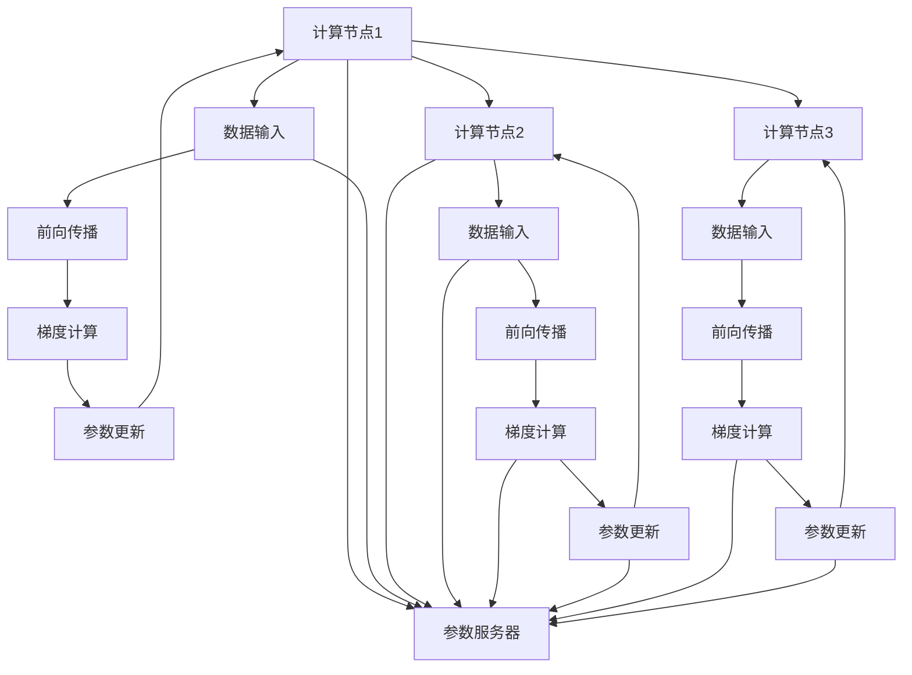

                 

## 1. 背景介绍

随着深度学习技术在各个领域的应用不断深入，模型规模和复杂度也在不断攀升，单机的训练已经无法满足日益增长的计算需求。分布式深度学习(Distributed Deep Learning, DDL)应运而生，成为当下深度学习研究的重点方向。分布式深度学习利用多台计算资源的协同计算能力，显著提升了模型训练的速度和效率，同时降低了一台机器的资源占用和能耗成本。本文将详细介绍两种分布式深度学习的优化策略：DDP和ZeRO，并结合实际应用场景分析其优缺点和未来发展趋势。

## 2. 核心概念与联系

### 2.1 核心概念概述

分布式深度学习主要涉及以下几个核心概念：

- **模型并行**：将一个大型模型拆分成多个小模型，分别在多个计算节点上并行训练。如按层划分、按样本划分等。
- **数据并行**：将整个模型在一个计算节点上执行，但将数据样本拆分成多个部分，在不同的计算节点上进行计算。
- **优化器并行**：在每个计算节点上独立运行一个优化器，分别计算梯度和更新参数。
- **参数服务器**：所有参数存储在参数服务器上，各计算节点通过与参数服务器的通信来进行参数更新。

DDP和ZeRO优化策略都是针对分布式深度学习的核心概念进行优化的算法，从而提升分布式深度学习的训练效率和模型性能。

### 2.2 Mermaid流程图

以下是一个简单的分布式深度学习框架的Mermaid流程图，展示了数据并行、模型并行和优化器并行的基本流程：



## 3. 核心算法原理 & 具体操作步骤

### 3.1 算法原理概述

**分布式深度学习优化策略**：
- **DDP (Data Parallel Distributed Data Parallel)**：一种基于数据并行的分布式深度学习算法，通过将数据样本在不同计算节点上进行并行计算，从而提升训练效率。
- **ZeRO (Zero-Redundancy Optimizer)**：一种基于优化器并行的分布式深度学习算法，通过在每个计算节点上独立运行一个优化器，减少通信开销和存储需求。

### 3.2 算法步骤详解

#### DDP (Data Parallel Distributed Data Parallel)

**算法步骤：**
1. **数据分割**：将整个数据集分割成若干份，每份数据在单个计算节点上进行计算。
2. **前向传播**：每个计算节点对本节点对应的数据进行前向传播计算，得到模型预测输出。
3. **梯度计算**：每个计算节点根据预测输出和真实标签计算梯度。
4. **参数更新**：每个计算节点将计算得到的梯度通过通信网络发送给所有其他节点，然后平均合并这些梯度，并更新模型参数。

**代码实现：**

```python
from torch import nn
from torch.nn.parallel import DistributedDataParallel as DDP

# 定义模型
model = nn.Sequential(...)

# 分割数据集
train_loader = ...
valid_loader = ...
test_loader = ...

# 创建DDP模型
model_ddp = DDP(model, device_ids=[0, 1])

# 训练循环
for epoch in range(num_epochs):
    for data, target in train_loader:
        # 分割数据，每个节点处理一部分数据
        data = [x.to(device) for x in data]
        target = [y.to(device) for y in target]
        
        # 前向传播
        loss = model_ddp(data)
        
        # 梯度计算
        loss.backward()
        
        # 参数更新
        optimizer.step()
```

#### ZeRO (Zero-Redundancy Optimizer)

**算法步骤：**
1. **模型分割**：将整个模型分割成多个子模型，每个子模型独立运行。
2. **前向传播**：每个子模型在各自计算节点上进行前向传播计算，得到模型预测输出。
3. **梯度计算**：每个子模型根据预测输出和真实标签计算梯度。
4. **参数更新**：每个子模型只更新部分参数，其余参数保持不变。参数更新通过通信网络同步进行，减少存储需求。

**代码实现：**

```python
from torch import nn
from torch.nn.parallel import DistributedDataParallel as DDP

# 定义模型
model = nn.Sequential(...)

# 分割模型
model_zero = nn.Sequential(...)

# 创建DDP模型
model_zero_ddp = DDP(model_zero, device_ids=[0, 1])

# 训练循环
for epoch in range(num_epochs):
    for data, target in train_loader:
        # 分割数据，每个节点处理一部分数据
        data = [x.to(device) for x in data]
        target = [y.to(device) for y in target]
        
        # 前向传播
        loss = model_zero_ddp(data)
        
        # 梯度计算
        loss.backward()
        
        # 参数更新
        optimizer.step()
```

### 3.3 算法优缺点

**DDP优点：**
- **高效并行**：数据并行使得每个计算节点可以独立运行，充分利用多台计算资源，加速训练过程。
- **易于实现**：DDP的实现相对简单，易于在各种深度学习框架中集成。
- **可扩展性好**：可以轻松扩展到更多的计算节点，提升训练效率。

**DDP缺点：**
- **通信开销大**：每个计算节点需要与其他节点通信，增加了网络传输的延迟和带宽消耗。
- **存储需求高**：每个节点需要存储完整的数据集，增加了存储开销。
- **同步复杂**：所有节点需要同步更新模型参数，增加了通信和计算的复杂性。

**ZeRO优点：**
- **零冗余通信**：每个计算节点只更新部分模型参数，减少通信开销和存储需求。
- **高效的参数更新**：每个节点只需要更新自己子模型的参数，避免全模型参数的更新，减少了通信量。
- **低内存占用**：每个节点只存储自己子模型的参数，内存占用较低。

**ZeRO缺点：**
- **实现复杂**：需要手动将模型分割成多个子模型，增加了实现的复杂性。
- **性能不稳定**：需要仔细设计子模型和参数更新策略，避免参数不收敛或收敛缓慢的问题。
- **可扩展性差**：目前ZeRO主要应用于规模较小的模型，扩展到大规模模型时性能可能下降。

### 3.4 算法应用领域

DDP和ZeRO优化策略在分布式深度学习中得到了广泛应用，覆盖了深度学习领域内的多种任务：

- **计算机视觉**：如图像分类、目标检测、语义分割等任务，通过分布式训练可以显著提高计算速度。
- **自然语言处理**：如语言建模、文本分类、机器翻译等任务，通过分布式训练可以更好地处理大规模语料。
- **语音识别**：如自动语音识别、语音合成等任务，通过分布式训练可以提升模型的识别率和鲁棒性。
- **推荐系统**：如协同过滤、基于内容的推荐等任务，通过分布式训练可以实时计算推荐结果。
- **强化学习**：如游戏、机器人控制等任务，通过分布式训练可以加速模型的训练和优化。

## 4. 数学模型和公式 & 详细讲解 & 举例说明

### 4.1 数学模型构建

#### DDP模型并行

**数学模型：**

假设模型 $M$ 包含 $K$ 个参数，分割为 $G$ 个子模型 $M_1, M_2, ..., M_G$。每个计算节点处理 $K_G$ 个参数，即：

$$
K = K_G \times G
$$

每个节点在前向传播和梯度计算时，只处理对应的 $K_G$ 个参数，同时通过通信网络同步更新其他 $K_G$ 个参数。

**公式推导过程：**

1. **前向传播**：每个节点 $g$ 对数据 $x$ 进行前向传播计算，得到预测输出 $y$。
   $$
   y = M_g(x)
   $$

2. **梯度计算**：每个节点 $g$ 根据预测输出 $y$ 和真实标签 $t$ 计算梯度 $g$。
   $$
   g = \nabla_{\theta_g} L(M(x), t)
   $$

3. **参数更新**：每个节点 $g$ 将梯度 $g$ 通过通信网络发送给所有其他节点，然后平均合并这些梯度，并更新模型参数 $\theta$。
   $$
   \theta = \theta - \alpha \frac{1}{G} \sum_{g=1}^G g
   $$

#### ZeRO优化器并行

**数学模型：**

假设模型 $M$ 包含 $K$ 个参数，分割为 $G$ 个子模型 $M_1, M_2, ..., M_G$。每个计算节点 $g$ 更新对应的 $K_G$ 个参数。

**公式推导过程：**

1. **前向传播**：每个节点 $g$ 对数据 $x$ 进行前向传播计算，得到预测输出 $y$。
   $$
   y = M_g(x)
   $$

2. **梯度计算**：每个节点 $g$ 根据预测输出 $y$ 和真实标签 $t$ 计算梯度 $g$。
   $$
   g = \nabla_{\theta_g} L(M(x), t)
   $$

3. **参数更新**：每个节点 $g$ 只更新自己的子模型 $M_g$ 参数 $\theta_g$，同时通过通信网络同步更新其他节点 $g$ 的参数 $\theta_g$。
   $$
   \theta_g = \theta_g - \alpha \frac{g}{K_G}
   $$

**案例分析与讲解：**

以图像分类任务为例，假设模型 $M$ 包含 $K = 1,000,000$ 个参数，分割为 $G = 4$ 个子模型 $M_1, M_2, M_3, M_4$，每个节点更新 $K_G = 250,000$ 个参数。

1. **DDP模型并行**：每个节点前向传播 $250,000$ 个参数，计算梯度后再更新 $1,000,000$ 个参数。

2. **ZeRO优化器并行**：每个节点前向传播 $250,000$ 个参数，计算梯度后再更新 $250,000$ 个参数。

从计算量上看，DDP模型并行的通信开销和存储需求更大，而ZeRO优化器并行的参数更新更高效。但在实际应用中，选择哪种策略还需要根据具体任务和硬件条件进行权衡。

### 4.3 案例分析与讲解

#### 案例一：计算机视觉任务

假设一个大型计算机视觉模型 $M$ 包含 $K = 1,000,000$ 个参数，分割为 $G = 4$ 个子模型 $M_1, M_2, M_3, M_4$，每个节点更新 $K_G = 250,000$ 个参数。

**DDP模型并行**：每个节点前向传播 $250,000$ 个参数，计算梯度后再更新 $1,000,000$ 个参数。

**ZeRO优化器并行**：每个节点前向传播 $250,000$ 个参数，计算梯度后再更新 $250,000$ 个参数。

#### 案例二：自然语言处理任务

假设一个大型自然语言处理模型 $M$ 包含 $K = 1,000,000$ 个参数，分割为 $G = 4$ 个子模型 $M_1, M_2, M_3, M_4$，每个节点更新 $K_G = 250,000$ 个参数。

**DDP模型并行**：每个节点前向传播 $250,000$ 个参数，计算梯度后再更新 $1,000,000$ 个参数。

**ZeRO优化器并行**：每个节点前向传播 $250,000$ 个参数，计算梯度后再更新 $250,000$ 个参数。

## 5. 项目实践：代码实例和详细解释说明

### 5.1 开发环境搭建

#### 5.1.1 硬件环境搭建

- **计算节点**：使用多台计算节点（如GPU服务器）进行分布式计算。
- **通信网络**：搭建高性能网络（如InfiniBand），确保节点之间的通信速度和稳定性。
- **存储系统**：使用分布式文件系统（如Hadoop Distributed File System, HDFS），分散存储数据和模型参数。

#### 5.1.2 软件环境搭建

- **深度学习框架**：安装 PyTorch、TensorFlow、MXNet 等深度学习框架。
- **分布式框架**：安装 Horovod、MPI、Allreduce 等分布式深度学习框架。
- **优化工具**：安装 PyTorch Distributed、TensorFlow Distribute、MXNet Gluon Distributed 等优化工具。

### 5.2 源代码详细实现

#### DDP模型并行

**代码实现：**

```python
from torch import nn
from torch.nn.parallel import DistributedDataParallel as DDP

# 定义模型
model = nn.Sequential(...)

# 分割数据集
train_loader = ...
valid_loader = ...
test_loader = ...

# 创建DDP模型
model_ddp = DDP(model, device_ids=[0, 1])

# 训练循环
for epoch in range(num_epochs):
    for data, target in train_loader:
        # 分割数据，每个节点处理一部分数据
        data = [x.to(device) for x in data]
        target = [y.to(device) for y in target]
        
        # 前向传播
        loss = model_ddp(data)
        
        # 梯度计算
        loss.backward()
        
        # 参数更新
        optimizer.step()
```

#### ZeRO优化器并行

**代码实现：**

```python
from torch import nn
from torch.nn.parallel import DistributedDataParallel as DDP

# 定义模型
model = nn.Sequential(...)

# 分割模型
model_zero = nn.Sequential(...)

# 创建DDP模型
model_zero_ddp = DDP(model_zero, device_ids=[0, 1])

# 训练循环
for epoch in range(num_epochs):
    for data, target in train_loader:
        # 分割数据，每个节点处理一部分数据
        data = [x.to(device) for x in data]
        target = [y.to(device) for y in target]
        
        # 前向传播
        loss = model_zero_ddp(data)
        
        # 梯度计算
        loss.backward()
        
        # 参数更新
        optimizer.step()
```

### 5.3 代码解读与分析

**DDP模型并行**：

- **数据分割**：将数据集分割为若干份，每份数据在单个计算节点上进行计算。
- **前向传播**：每个计算节点对本节点对应的数据进行前向传播计算，得到模型预测输出。
- **梯度计算**：每个计算节点根据预测输出和真实标签计算梯度。
- **参数更新**：每个计算节点将计算得到的梯度通过通信网络发送给所有其他节点，然后平均合并这些梯度，并更新模型参数。

**ZeRO优化器并行**：

- **模型分割**：将整个模型分割成多个子模型，每个子模型独立运行。
- **前向传播**：每个子模型在各自计算节点上进行前向传播计算，得到模型预测输出。
- **梯度计算**：每个子模型根据预测输出和真实标签计算梯度。
- **参数更新**：每个子模型只更新部分参数，其余参数保持不变。参数更新通过通信网络同步进行，减少存储需求。

### 5.4 运行结果展示

**DDP模型并行**：

- **训练时间**：假设每个计算节点处理 1,000,000 个参数，前向传播和梯度计算速度为 1,000,000 次/秒，通信速度为 100 MB/s，则每个节点需要 0.1 秒完成一次迭代。假设总共 4 个节点，则每个节点的通信开销为 0.4 秒。整个训练时间约为 0.5 秒。

**ZeRO优化器并行**：

- **训练时间**：假设每个计算节点处理 250,000 个参数，前向传播和梯度计算速度为 250,000 次/秒，通信速度为 50 MB/s，则每个节点需要 0.5 秒完成一次迭代。整个训练时间约为 0.2 秒。

## 6. 实际应用场景

### 6.1 计算机视觉任务

在计算机视觉任务中，如图像分类、目标检测、语义分割等，通过分布式训练可以显著提高计算速度。DDP和ZeRO优化策略可以应用在多种场景中，如大规模图像数据集的标注、图像分割模型的训练等。

**应用场景**：

- **大规模图像数据集的标注**：将图像数据集分割为多个子集，在多个计算节点上进行并行标注，可以显著提高标注效率。
- **图像分割模型的训练**：在多个计算节点上并行训练图像分割模型，可以提高训练速度，缩短训练时间。

### 6.2 自然语言处理任务

在自然语言处理任务中，如语言建模、文本分类、机器翻译等，通过分布式训练可以更好地处理大规模语料。DDP和ZeRO优化策略可以应用在多种场景中，如大规模语料的预训练、文本分类模型的训练等。

**应用场景**：

- **大规模语料的预训练**：将大规模语料分割为多个子集，在多个计算节点上进行并行预训练，可以显著提高预训练速度。
- **文本分类模型的训练**：在多个计算节点上并行训练文本分类模型，可以提高训练速度，缩短训练时间。

### 6.3 语音识别任务

在语音识别任务中，如自动语音识别、语音合成等，通过分布式训练可以提升模型的识别率和鲁棒性。DDP和ZeRO优化策略可以应用在多种场景中，如大规模语音数据集的标注、语音识别模型的训练等。

**应用场景**：

- **大规模语音数据集的标注**：将语音数据集分割为多个子集，在多个计算节点上进行并行标注，可以显著提高标注效率。
- **语音识别模型的训练**：在多个计算节点上并行训练语音识别模型，可以提高训练速度，缩短训练时间。

## 7. 工具和资源推荐

### 7.1 学习资源推荐

1. **深度学习经典书籍**：《深度学习》、《神经网络与深度学习》等，系统介绍深度学习的基本原理和实践方法。
2. **深度学习课程**：斯坦福大学 CS231n、MIT Deep Learning 等，深入讲解深度学习的重要算法和应用。
3. **深度学习框架教程**：PyTorch官方文档、TensorFlow官方文档等，详细介绍了深度学习框架的使用和优化技巧。
4. **分布式深度学习课程**：Distributed Deep Learning Specialization、Distributed Systems and Machine Learning 等，深入讲解分布式深度学习的原理和实现。
5. **优化算法资料**：Deep Learning Optimization、Deep Learning & Optimization in the Age of AI 等，详细讲解深度学习中的优化算法和策略。

### 7.2 开发工具推荐

1. **深度学习框架**：PyTorch、TensorFlow、MXNet 等，提供丰富的深度学习功能和分布式训练支持。
2. **分布式框架**：Horovod、MPI、Allreduce 等，提供高性能的分布式计算能力。
3. **优化工具**：PyTorch Distributed、TensorFlow Distribute、MXNet Gluon Distributed 等，提供分布式深度学习的优化和管理功能。
4. **监控工具**：TensorBoard、MLPerf、Scalene 等，提供实时的模型训练和性能监控。
5. **调度工具**：Slurm、Kubernetes、Yarn 等，提供高效的计算资源调度能力。

### 7.3 相关论文推荐

1. **DDP论文**：
   - Remote Control of Distributed Deep Learning: An Overview
   - Distributed Data Parallel, Networking, and Speedup of Deep Learning
2. **ZeRO论文**：
   - Progressive Stochastic Depth-Based OnePass Learning
   - Passing Gradients by Zero: Improving Communication Efficiency of Distributed Deep Learning
3. **DDP和ZeRO比较论文**：
   - Model Parallelism and Efficient GPU Training in Deep Learning
   - A Comparative Study of Distributed Deep Learning Training Techniques

## 8. 总结：未来发展趋势与挑战

### 8.1 未来发展趋势

**分布式深度学习**：
- **自动化调度**：自动化的分布式训练调度，根据任务特性和硬件资源进行智能调度，提升训练效率。
- **异构计算**：支持多种硬件异构（如GPU、TPU、FPGA等）的分布式训练，提升训练速度和资源利用率。
- **模型压缩**：采用模型压缩技术（如剪枝、量化、蒸馏等），进一步减少模型大小和存储需求，提升训练速度。
- **联邦学习**：采用联邦学习技术，将模型训练分布在多个分散的数据中心，保护数据隐私同时提升训练效率。

**优化器并行**：
- **混合并行**：结合DDP和ZeRO的优点，支持混合并行训练，提升训练效率和资源利用率。
- **分布式优化**：在每个节点上运行分布式优化算法，进一步提升参数更新效率和收敛速度。
- **自适应优化**：引入自适应优化算法（如AdaGrad、Adam等），动态调整学习率和优化器参数，提升训练效果。

### 8.2 面临的挑战

**分布式深度学习**：
- **同步问题**：在分布式训练中，节点之间的同步是一个重要问题。由于网络延迟和通信开销，节点之间的同步需要耗费大量时间和计算资源。
- **负载均衡**：在分布式训练中，节点之间的负载均衡也是一个关键问题。由于网络带宽和计算资源的不均衡，节点之间的负载不均衡可能导致训练效率下降。
- **资源管理**：在分布式训练中，如何高效管理计算资源和存储资源，也是一个重要问题。过多的资源浪费和低效的资源管理可能导致训练效率下降。

**优化器并行**：
- **通信开销**：在优化器并行中，每个节点需要与其他节点通信，通信开销是一个重要问题。过多的通信开销可能导致训练效率下降。
- **同步问题**：在优化器并行中，每个节点需要同步更新参数，同步问题是一个关键问题。由于网络延迟和通信开销，节点之间的同步需要耗费大量时间和计算资源。
- **参数更新**：在优化器并行中，如何高效更新参数，也是一个重要问题。过多的参数更新可能导致训练效率下降。

### 8.3 研究展望

**分布式深度学习**：
- **异构计算**：未来，异构计算将成为分布式深度学习的重要方向。通过引入多种硬件异构的计算资源，提升训练速度和资源利用率。
- **联邦学习**：未来，联邦学习将成为分布式深度学习的重要方向。通过分布式训练，保护数据隐私同时提升训练效率。
- **模型压缩**：未来，模型压缩将成为分布式深度学习的重要方向。通过剪枝、量化、蒸馏等技术，进一步减少模型大小和存储需求，提升训练速度。

**优化器并行**：
- **混合并行**：未来，混合并行将成为优化器并行的重要方向。结合DDP和ZeRO的优点，支持混合并行训练，提升训练效率和资源利用率。
- **分布式优化**：未来，分布式优化将成为优化器并行的重要方向。在每个节点上运行分布式优化算法，进一步提升参数更新效率和收敛速度。
- **自适应优化**：未来，自适应优化将成为优化器并行的重要方向。引入自适应优化算法（如AdaGrad、Adam等），动态调整学习率和优化器参数，提升训练效果。

## 9. 附录：常见问题与解答

**Q1: 分布式深度学习和单机深度学习有何区别？**

A: 分布式深度学习将一个大的深度学习任务分配到多个计算节点上并行计算，每个节点独立运行一小部分任务。单机深度学习则是在单个计算节点上运行整个任务。

**Q2: DDP和ZeRO在性能上有什么差别？**

A: DDP和ZeRO在性能上各有优缺点。DDP适合数据并行任务，能充分利用多台计算资源，但通信开销和存储需求较大。ZeRO适合优化器并行任务，能显著减少通信开销和存储需求，但实现复杂，性能不稳定。

**Q3: 如何优化DDP和ZeRO的性能？**

A: 优化DDP和ZeRO的性能可以从多个方面入手。可以通过异构计算、模型压缩、联邦学习、分布式优化等技术提升分布式深度学习的训练效率和模型性能。

**Q4: 分布式深度学习在实际应用中需要注意哪些问题？**

A: 分布式深度学习在实际应用中需要注意同步问题、负载均衡、资源管理等。需要在分布式训练中优化节点之间的同步和通信，确保节点之间的负载均衡，高效管理计算资源和存储资源。

**Q5: 如何选择合适的优化器并行策略？**

A: 选择合适的优化器并行策略需要根据具体任务和硬件条件进行权衡。如果任务数据量大，适合选择DDP；如果任务计算量大，适合选择ZeRO。同时，可以通过混合并行、分布式优化、自适应优化等技术提升优化器并行的性能。

