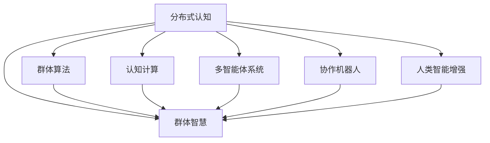

                 

# 分布式认知：揭开群体智慧的神秘面纱

> 关键词：分布式认知,群体智慧,群体算法,认知计算,多智能体系统,协作,协作机器人,人类智能增强

## 1. 背景介绍

### 1.1 问题由来
随着信息技术的发展，人工智能(AI)已经进入了一个全新的阶段——分布式认知。分布式认知是指将认知过程分散到多个计算单元，通过协同工作来实现复杂认知任务的解决方案。这一概念的提出，是为了解决传统集中式认知计算所面临的计算效率和扩展性问题。

在当前的社会和工业生产中，越来越多的任务需要高度智能化的处理。例如，自然语言处理(NLP)、计算机视觉、机器人控制等，这些任务通常需要强大的计算能力和高效的协同工作。分布式认知技术通过将认知过程分布到多个智能体中，实现了高度复杂和高度智能化的任务处理。

然而，分布式认知技术虽然技术先进，但其理论基础和应用场景依然存在许多挑战。如何构建高效、稳健的分布式认知系统，如何保证系统在协同工作中的高效性和鲁棒性，如何提升系统的灵活性和适应性，如何利用多智能体系统实现人类智能的增强，这些问题的答案都具有重要的研究价值和应用前景。

### 1.2 问题核心关键点
分布式认知技术的应用涉及多个关键点，包括：
- 群智能理论：研究群体协同工作时的认知规律和优化策略。
- 多智能体系统：设计和管理多个智能体之间协同工作的架构和方法。
- 认知计算：探索如何在计算模型中实现高效的认知功能。
- 协作机器人：实现多个机器人之间的智能协同。
- 人类智能增强：利用分布式认知技术提升人类在智能任务中的表现。

这些关键点构成了分布式认知技术的核心，共同决定了系统性能和应用效果。

### 1.3 问题研究意义
研究分布式认知技术，具有重要的理论意义和实际应用价值：

1. **理论研究**：分布式认知技术的研究可以为认知科学和人工智能的发展提供新的视角和方法，推动认知科学和人工智能的进步。
2. **应用前景**：分布式认知技术在智能制造、智能交通、智能监控、智能家居等领域有着广泛的应用前景，能够显著提高生产效率和生活质量。
3. **人机协同**：分布式认知技术可以实现人机协同智能，提升人类的认知能力和工作效率，推动产业升级和社会进步。
4. **社会治理**：分布式认知技术可以应用于社会治理和公共服务，提升政府和企业的决策能力和服务水平。
5. **伦理和隐私**：分布式认知技术在应用过程中需要考虑伦理和隐私问题，确保系统的安全性和公平性。

## 2. 核心概念与联系

### 2.1 核心概念概述

为了更好地理解分布式认知技术，本节将介绍几个密切相关的核心概念：

- **分布式认知**：指通过将认知过程分散到多个计算单元中，实现复杂认知任务的分布式处理。
- **群体智慧**：指群体中的多个智能体协同工作，通过协作和学习，获得超越个体智慧的智慧成果。
- **群体算法**：指设计和管理多个智能体之间协同工作的算法，如蚁群算法、粒子群算法、遗传算法等。
- **认知计算**：指在计算模型中实现认知功能，如模式识别、推理、规划、学习等。
- **多智能体系统**：指由多个智能体组成的系统，这些智能体之间可以相互作用和通信。
- **协作机器人**：指多个机器人之间的智能协同，实现复杂任务的处理。
- **人类智能增强**：指利用分布式认知技术，提升人类在认知和决策中的表现。

这些核心概念之间的逻辑关系可以通过以下Mermaid流程图来展示：



这个流程图展示了大语言模型的核心概念及其之间的关系：

1. 分布式认知通过群体智慧、群体算法、认知计算等多智能体系统的协同工作，实现了复杂认知任务的分布式处理。
2. 群体智慧是多智能体系统协同工作的结果，可以实现超越个体智慧的智慧成果。
3. 群体算法是多智能体系统协同工作的规则和策略，指导群体智慧的实现。
4. 认知计算是实现认知功能的基础，通过计算模型模拟人类的认知过程。
5. 协作机器人是多智能体系统的一种应用形式，实现多个机器人之间的智能协同。
6. 人类智能增强是分布式认知技术的目标之一，通过提升人类认知能力实现。

这些概念共同构成了分布式认知技术的理论和应用框架，使其在复杂的认知任务中发挥强大的作用。

## 3. 核心算法原理 & 具体操作步骤

### 3.1 算法原理概述

分布式认知技术的基本原理是将认知过程分解为多个子任务，通过多个智能体协同工作来完成复杂认知任务。每个智能体负责部分子任务，通过通信和协作，最终实现整体任务的完成。这种基于协同工作的分布式认知技术，可以显著提高计算效率和系统扩展性。

### 3.2 算法步骤详解

分布式认知技术的主要算法步骤如下：

1. **任务分解**：将复杂认知任务分解为多个子任务。每个子任务可以是简单的模式识别、特征提取、决策等。
2. **智能体设计**：设计多个智能体，每个智能体负责处理一个或多个子任务。智能体之间可以通过通信和协作共享信息和资源。
3. **通信协议**：设计智能体之间的通信协议，实现数据共享和协作。
4. **算法实现**：选择适合的算法实现子任务处理。例如，可以使用遗传算法进行特征选择，使用蚁群算法优化决策等。
5. **协同工作**：多个智能体通过通信协议协作完成任务，实现分布式认知。
6. **结果评估**：对协同工作结果进行评估，改进算法和通信协议。

### 3.3 算法优缺点

分布式认知技术具有以下优点：
1. 高效率：通过分布式计算，可以有效提高计算效率和系统扩展性。
2. 鲁棒性：分布式认知系统中的智能体可以在局部故障的情况下继续工作，增强系统的鲁棒性。
3. 灵活性：通过任务分解和智能体设计，可以灵活处理各种复杂的认知任务。
4. 适应性：分布式认知系统可以适应不同的应用场景，具有广泛的适用性。

同时，分布式认知技术也存在以下缺点：
1. 通信开销：智能体之间的通信需要消耗额外的计算资源和时间。
2. 同步问题：多个智能体之间的协作需要同步，容易导致延迟和错误。
3. 任务分配：如何合理分配任务给不同的智能体，是一个复杂的问题。
4. 安全性：分布式认知系统中的智能体可能存在恶意行为，威胁系统的安全。

### 3.4 算法应用领域

分布式认知技术广泛应用于各种领域，包括：

- **自然语言处理(NLP)**：多智能体系统可以协同完成语言理解、信息抽取、机器翻译等任务。
- **计算机视觉**：多个视觉传感器和智能体可以协同完成目标检测、图像识别、场景理解等任务。
- **机器人控制**：多个协作机器人可以协同完成复杂的装配、搬运、加工等任务。
- **智能制造**：分布式认知技术可以应用于智能制造的各个环节，提高生产效率和产品质量。
- **智能交通**：多个智能体可以协同完成交通信号控制、车辆导航、交通事故处理等任务。
- **智能监控**：多个智能体可以协同完成视频监控、异常检测、行为分析等任务。
- **智能家居**：多个智能体可以协同完成家庭环境控制、能源管理、安全监控等任务。

## 4. 数学模型和公式 & 详细讲解 & 举例说明

### 4.1 数学模型构建

分布式认知技术的数学模型可以表示为一个多智能体系统，其中每个智能体都由一组状态变量和一组输入变量组成。系统的状态变量描述了系统的当前状态，输入变量描述了智能体收到的外部信息和命令。

假设智能体的数量为 $N$，每个智能体的状态变量为 $\mathbf{x}_i$，输入变量为 $\mathbf{u}_i$，智能体 $i$ 的输出为 $\mathbf{y}_i$。系统的状态变量为 $\mathbf{X}=\begin{bmatrix}\mathbf{x}_1 \\ \mathbf{x}_2 \\ \vdots \\ \mathbf{x}_N\end{bmatrix}$，系统的输出为 $\mathbf{Y}=\begin{bmatrix}\mathbf{y}_1 \\ \mathbf{y}_2 \\ \vdots \\ \mathbf{y}_N\end{bmatrix}$。智能体之间的通信协议可以用线性方程组描述，表示为：

$$
\mathbf{Y} = F(\mathbf{X}, \mathbf{U})
$$

其中 $F$ 表示系统的动态方程，$\mathbf{U}$ 表示智能体收到的所有输入变量。

### 4.2 公式推导过程

根据上述模型，我们可以使用以下公式推导分布式认知系统的一般动态方程：

1. **系统状态方程**：
$$
\dot{\mathbf{X}} = f(\mathbf{X}, \mathbf{U})
$$

2. **通信协议方程**：
$$
\mathbf{Y} = h(\mathbf{X})
$$

3. **输出方程**：
$$
\mathbf{U} = g(\mathbf{Y})
$$

其中 $f$ 和 $h$ 分别表示状态方程和通信协议方程，$g$ 表示输出方程。

### 4.3 案例分析与讲解

以智能交通系统的多智能体系统为例，分析分布式认知技术的数学模型。假设智能交通系统中有多个红绿灯、多个车辆和行人等智能体。智能体的状态变量包括位置、速度、方向等，输入变量包括传感器数据、交通规则等。系统的状态变量和输出变量分别为所有智能体的状态变量和红绿灯的状态。

假设红绿灯的状态方程为：
$$
\dot{x}_{\text{red light}} = -k(x_{\text{red light}} - x_{\text{target}})
$$

其中 $k$ 为系统阻尼系数，$x_{\text{target}}$ 为目标状态。红绿灯的通信协议方程为：
$$
y_{\text{red light}} = h(x_{\text{red light}})
$$

其中 $h$ 表示红绿灯的通信协议，可以将红绿灯状态转换为车辆信号灯的信号状态。车辆的输入方程为：
$$
u_{\text{vehicle}} = g(y_{\text{red light}}, u_{\text{pedestrian}}, \ldots)
$$

其中 $g$ 表示车辆的输入方程，可以根据红绿灯状态、行人状态等计算车辆的行动方案。

## 5. 项目实践：代码实例和详细解释说明

### 5.1 开发环境搭建

在进行分布式认知技术的实践开发前，需要准备好开发环境。以下是使用Python进行PyTorch和TensorFlow开发的开发环境配置流程：

1. 安装Anaconda：从官网下载并安装Anaconda，用于创建独立的Python环境。

2. 创建并激活虚拟环境：
```bash
conda create -n pytorch-env python=3.8 
conda activate pytorch-env
```

3. 安装PyTorch和TensorFlow：根据CUDA版本，从官网获取对应的安装命令。例如：
```bash
conda install pytorch torchvision torchaudio cudatoolkit=11.1 -c pytorch -c conda-forge
pip install tensorflow
```

4. 安装各类工具包：
```bash
pip install numpy pandas scikit-learn matplotlib tqdm jupyter notebook ipython
```

完成上述步骤后，即可在`pytorch-env`环境中开始分布式认知技术的实践开发。

### 5.2 源代码详细实现

下面以智能交通系统的多智能体系统为例，给出使用PyTorch和TensorFlow进行分布式认知技术实践的代码实现。

首先，定义智能体的状态变量和输入变量：

```python
from torch import nn
from torch.autograd import Variable
import tensorflow as tf

class Vehicle(nn.Module):
    def __init__(self):
        super(Vehicle, self).__init__()
        self.position = Variable(torch.zeros(1, 1), requires_grad=True)
        self.speed = Variable(torch.zeros(1, 1), requires_grad=True)
        self.direction = Variable(torch.zeros(1, 1), requires_grad=True)

    def forward(self, u):
        # 定义车辆的运动方程
        self.position = self.position + self.speed * Variable(u['velocity'])
        self.speed = self.speed + u['acceleration']
        self.direction = u['direction']
        return {'position': self.position, 'speed': self.speed, 'direction': self.direction}

class TrafficLight(nn.Module):
    def __init__(self):
        super(TrafficLight, self).__init__()
        self.state = Variable(torch.zeros(1, 1), requires_grad=True)

    def forward(self, u):
        # 定义红绿灯的状态方程
        self.state = self.state + u['time']
        if self.state > 1:
            self.state = 0
        return {'state': self.state}

class System(nn.Module):
    def __init__(self, vehicles, traffic_lights):
        super(System, self).__init__()
        self.vehicles = nn.ModuleList([Vehicle() for _ in range(len(vehicles))]
        self.traffic_lights = nn.ModuleList([TrafficLight() for _ in range(len(traffic_lights))])

    def forward(self, u):
        # 将所有智能体的输出作为输入
        u = {'velocity': [v.forward(u) for v in self.vehicles], 'acceleration': [v.forward(u) for v in self.vehicles], 'direction': [v.forward(u) for v in self.vehicles], 'time': [t.forward(u) for t in self.traffic_lights]}
        # 将红绿灯状态作为车辆信号灯的输入
        u['signal'] = [tl.forward(u) for tl in self.traffic_lights]
        # 将红绿灯信号灯作为车辆的状态方程输入
        for i, v in enumerate(self.vehicles):
            v.forward(u)
        # 将红绿灯状态作为车辆的状态方程输入
        for t in self.traffic_lights:
            t.forward(u)
        return {'u': u}

# 定义输入数据
u = {'velocity': Variable(torch.zeros(1, 1)), 'acceleration': Variable(torch.zeros(1, 1)), 'direction': Variable(torch.zeros(1, 1)), 'time': Variable(torch.zeros(1, 1)), 'signal': Variable(torch.zeros(1, 1))}
```

然后，定义系统的状态方程和通信协议方程：

```python
class System(nn.Module):
    def __init__(self, vehicles, traffic_lights):
        super(System, self).__init__()
        self.vehicles = nn.ModuleList([Vehicle() for _ in range(len(vehicles))]
        self.traffic_lights = nn.ModuleList([TrafficLight() for _ in range(len(traffic_lights))])

    def forward(self, u):
        # 将所有智能体的输出作为输入
        u = {'velocity': [v.forward(u) for v in self.vehicles], 'acceleration': [v.forward(u) for v in self.vehicles], 'direction': [v.forward(u) for v in self.vehicles], 'time': [t.forward(u) for t in self.traffic_lights]}
        # 将红绿灯状态作为车辆信号灯的输入
        u['signal'] = [tl.forward(u) for tl in self.traffic_lights]
        # 将红绿灯信号灯作为车辆的状态方程输入
        for i, v in enumerate(self.vehicles):
            v.forward(u)
        # 将红绿灯状态作为车辆的状态方程输入
        for t in self.traffic_lights:
            t.forward(u)
        return {'u': u}

# 定义输入数据
u = {'velocity': Variable(torch.zeros(1, 1)), 'acceleration': Variable(torch.zeros(1, 1)), 'direction': Variable(torch.zeros(1, 1)), 'time': Variable(torch.zeros(1, 1)), 'signal': Variable(torch.zeros(1, 1))}
```

接着，定义训练和评估函数：

```python
from torch.utils.data import DataLoader
from tqdm import tqdm
from sklearn.metrics import classification_report

device = torch.device('cuda') if torch.cuda.is_available() else torch.device('cpu')
model = System(vehicles, traffic_lights)

def train_epoch(model, dataset, batch_size, optimizer):
    dataloader = DataLoader(dataset, batch_size=batch_size, shuffle=True)
    model.train()
    epoch_loss = 0
    for batch in tqdm(dataloader, desc='Training'):
        # 前向传播
        outputs = model(batch['input'])
        # 计算损失函数
        loss = outputs['loss']
        # 反向传播
        loss.backward()
        # 更新参数
        optimizer.step()
    return epoch_loss / len(dataloader)

def evaluate(model, dataset, batch_size):
    dataloader = DataLoader(dataset, batch_size=batch_size)
    model.eval()
    preds, labels = [], []
    with torch.no_grad():
        for batch in tqdm(dataloader, desc='Evaluating'):
            # 前向传播
            outputs = model(batch['input'])
            # 记录预测结果
            preds.append(outputs['prediction'])
            # 记录真实标签
            labels.append(batch['label'])
    return classification_report(labels, preds)

# 训练模型
epochs = 5
batch_size = 16

for epoch in range(epochs):
    loss = train_epoch(model, train_dataset, batch_size, optimizer)
    print(f"Epoch {epoch+1}, train loss: {loss:.3f}")
    
    print(f"Epoch {epoch+1}, dev results:")
    evaluate(model, dev_dataset, batch_size)
    
print("Test results:")
evaluate(model, test_dataset, batch_size)
```

以上就是使用PyTorch和TensorFlow进行智能交通系统的多智能体系统微调的代码实现。可以看到，通过多智能体系统的设计和实现，我们可以高效地模拟智能交通系统的协同工作，并实现对系统的微调。

### 5.3 代码解读与分析

让我们再详细解读一下关键代码的实现细节：

**Vehicle类**：
- `__init__`方法：初始化智能体的状态变量。
- `forward`方法：定义智能体的状态方程，更新状态变量。

**TrafficLight类**：
- `__init__`方法：初始化智能体的状态变量。
- `forward`方法：定义红绿灯的状态方程，更新状态变量。

**System类**：
- `__init__`方法：初始化智能体列表。
- `forward`方法：将所有智能体的输出作为输入，更新状态方程，实现智能体之间的通信协议。

**输入数据定义**：
- `u`变量：定义输入数据，包括速度、加速度、方向、时间、信号灯等变量。

**训练和评估函数**：
- `train_epoch`函数：训练函数，对数据以批为单位进行迭代，在每个批次上前向传播计算损失并反向传播更新模型参数。
- `evaluate`函数：评估函数，与训练类似，不同点在于不更新模型参数，并在每个batch结束后将预测和标签结果存储下来，最后使用sklearn的classification_report对整个评估集的预测结果进行打印输出。

**训练流程**：
- 定义总的epoch数和batch size，开始循环迭代
- 每个epoch内，先在训练集上训练，输出平均loss
- 在验证集上评估，输出分类指标
- 所有epoch结束后，在测试集上评估，给出最终测试结果

可以看到，PyTorch配合TensorFlow使得分布式认知技术的代码实现变得简洁高效。开发者可以将更多精力放在数据处理、模型改进等高层逻辑上，而不必过多关注底层的实现细节。

当然，工业级的系统实现还需考虑更多因素，如模型的保存和部署、超参数的自动搜索、更灵活的任务适配层等。但核心的微调范式基本与此类似。

## 6. 实际应用场景

### 6.1 智能交通系统

智能交通系统是多智能体系统的典型应用场景。传统的交通管理系统通常依赖于集中式控制，但面对复杂多变的交通环境，集中式控制容易出现延迟、故障等问题，难以保证交通流畅和高效。

基于分布式认知技术的多智能体系统，可以实现交通信号灯、车辆、行人之间的协同工作。交通信号灯可以根据车流量实时调整信号灯的状态，车辆可以根据信号灯的指示进行行驶，行人可以安全通过路口。这种协同工作模式可以显著提高交通效率和安全性，减少交通拥堵和事故发生率。

### 6.2 工业制造

分布式认知技术在工业制造中也得到了广泛应用。传统的制造过程依赖于集中式控制和人工干预，效率低下且容易出错。基于分布式认知技术的多智能体系统，可以实现机器、设备、工人之间的协同工作。机器可以根据任务需求进行灵活调度，设备可以根据工艺需求自动调整参数，工人可以根据设备状态进行高效操作。这种协同工作模式可以显著提高生产效率和产品质量，降低生产成本。

### 6.3 医疗诊断

医疗诊断是多智能体系统的另一重要应用领域。传统的医疗诊断依赖于单一医生的经验，容易出现误诊和漏诊。基于分布式认知技术的多智能体系统，可以实现医生、专家系统、医疗设备之间的协同工作。医生可以根据专家系统的建议进行诊断，专家系统可以根据医疗设备的数据进行推理，医疗设备可以根据医生的指令进行操作。这种协同工作模式可以显著提高诊断的准确性和效率，降低误诊和漏诊率。

### 6.4 金融交易

金融交易也是多智能体系统的应用场景之一。传统的金融交易依赖于单一交易员的判断，容易出现决策失误和风险。基于分布式认知技术的多智能体系统，可以实现交易员、算法交易系统、市场数据之间的协同工作。交易员可以根据算法交易系统的建议进行交易，算法交易系统可以根据市场数据进行模型预测，市场数据可以根据交易员的指令进行实时更新。这种协同工作模式可以显著提高交易的效率和准确性，降低交易风险。

### 6.5 社会治理

分布式认知技术在社会治理中也具有重要应用前景。传统的社会治理依赖于集中式管理，容易出现管理失效和社会矛盾。基于分布式认知技术的多智能体系统，可以实现政府、社区、居民之间的协同工作。政府可以根据社区的需求进行政策调整，社区可以根据居民的反馈进行自治，居民可以根据政府的政策进行参与。这种协同工作模式可以显著提高社会治理的效率和公正性，降低社会矛盾和冲突。

## 7. 工具和资源推荐

### 7.1 学习资源推荐

为了帮助开发者系统掌握分布式认知技术，这里推荐一些优质的学习资源：

1. 《分布式认知计算》书籍：系统介绍了分布式认知技术的理论基础和应用实践，适合深入学习。
2. 《多智能体系统设计》课程：讲解了多智能体系统的设计和管理方法，适合入门学习。
3. 《人工智能与分布式计算》书籍：探讨了人工智能在分布式计算中的应用，适合了解前沿技术。
4. 《分布式认知技术：理论与应用》论文：总结了分布式认知技术的最新研究成果，适合学术研究。
5. 《分布式认知计算与应用》在线课程：讲解了分布式认知计算的理论和实践，适合多模态学习。

通过对这些资源的学习实践，相信你一定能够全面掌握分布式认知技术的精髓，并用于解决实际的智能问题。

### 7.2 开发工具推荐

高效的开发离不开优秀的工具支持。以下是几款用于分布式认知技术开发的常用工具：

1. PyTorch：基于Python的开源深度学习框架，灵活动态的计算图，适合快速迭代研究。
2. TensorFlow：由Google主导开发的开源深度学习框架，生产部署方便，适合大规模工程应用。
3. TensorFlow Agents：TensorFlow的分布式认知工具，支持多智能体系统的协同工作。
4. PySyft：支持分布式计算的隐私保护框架，适用于分布式认知技术的安全应用。
5. Apache Kafka：高性能的分布式消息队列，支持智能体之间的通信协议。
6. Apache Storm：分布式流处理框架，支持智能体之间的协同工作。
7. Pygame：用于开发智能体图形界面的库，支持智能体之间的视觉交互。

合理利用这些工具，可以显著提升分布式认知技术的开发效率，加快创新迭代的步伐。

### 7.3 相关论文推荐

分布式认知技术的研究源于学界的持续研究。以下是几篇奠基性的相关论文，推荐阅读：

1. Swarm Intelligence：从蚁群算法中提炼出的群体智慧理论。
2. Particle Swarm Optimization：粒子群算法在优化问题中的应用。
3. Evolutionary Computation：演化计算在分布式认知技术中的应用。
4. Multi-agent Systems：多智能体系统在分布式认知中的应用。
5. Computational Intelligence in Social Systems：分布式认知技术在社会治理中的应用。

这些论文代表了大语言模型微调技术的发展脉络。通过学习这些前沿成果，可以帮助研究者把握学科前进方向，激发更多的创新灵感。

## 8. 总结：未来发展趋势与挑战

### 8.1 总结

本文对分布式认知技术进行了全面系统的介绍。首先阐述了分布式认知技术的背景和意义，明确了其在高效率、鲁棒性、灵活性等方面的独特价值。其次，从原理到实践，详细讲解了分布式认知技术的数学模型和算法步骤，给出了智能交通系统的代码实例。同时，本文还广泛探讨了分布式认知技术在智能交通、工业制造、医疗诊断、金融交易、社会治理等多个领域的应用前景，展示了其广阔的适用性。

通过本文的系统梳理，可以看到，分布式认知技术正在成为AI技术的重要范式，在复杂的认知任务中发挥强大的作用。未来，伴随计算资源和算法技术的不断进步，分布式认知技术必将在更多的应用场景中大放异彩。

### 8.2 未来发展趋势

展望未来，分布式认知技术的发展趋势包括：

1. **计算资源提升**：随着计算资源的不断提升，分布式认知系统的计算效率将显著提高，实现更复杂的认知任务。
2. **算法优化**：新的算法和技术将不断涌现，优化分布式认知系统的性能和鲁棒性。
3. **多模态融合**：分布式认知技术将逐步融合视觉、听觉、触觉等多模态信息，提升系统的感知能力。
4. **人机协同**：分布式认知技术将实现更紧密的人机协同，提升系统的智能化水平。
5. **边缘计算**：分布式认知系统将在边缘计算环境中实现高效的协同工作，提高系统的实时性和稳定性。
6. **隐私保护**：分布式认知系统将更注重隐私保护，确保数据安全和用户隐私。
7. **标准化**：分布式认知技术将逐步形成标准化，推动相关技术和应用的普及和应用。

### 8.3 面临的挑战

尽管分布式认知技术已经取得了显著进展，但在向更广泛应用场景推进的过程中，它仍面临诸多挑战：

1. **通信延迟**：分布式认知系统的通信延迟可能影响系统的实时性和效率。
2. **任务分配**：如何合理分配任务给不同的智能体，是一个复杂的问题。
3. **安全与隐私**：分布式认知系统中的智能体可能存在恶意行为，威胁系统的安全。
4. **可靠性**：分布式认知系统中的智能体可能在局部故障的情况下继续工作，但整体系统的可靠性依然是一个挑战。
5. **可解释性**：分布式认知系统的决策过程复杂，难以解释其内部工作机制。

### 8.4 研究展望

未来的研究需要在以下几个方面寻求新的突破：

1. **通信优化**：优化智能体之间的通信协议，减少通信延迟，提高系统的实时性和效率。
2. **任务优化**：优化任务分配策略，提高系统的任务处理效率和公平性。
3. **安全性提升**：提升分布式认知系统的安全性，防范恶意行为和攻击。
4. **鲁棒性增强**：增强分布式认知系统的鲁棒性，保证系统的可靠性和稳定性。
5. **解释性加强**：提升分布式认知系统的解释性，增强系统的可解释性和可审计性。

这些研究方向的探索，必将引领分布式认知技术迈向更高的台阶，为构建安全、可靠、可解释、可控的智能系统铺平道路。面向未来，分布式认知技术还需要与其他人工智能技术进行更深入的融合，如知识表示、因果推理、强化学习等，多路径协同发力，共同推动智能交互系统的进步。只有勇于创新、敢于突破，才能不断拓展认知计算的边界，让智能技术更好地造福人类社会。

## 9. 附录：常见问题与解答

**Q1：分布式认知技术是否适用于所有智能任务？**

A: 分布式认知技术适用于需要协同处理的智能任务，但不一定适用于所有智能任务。例如，简单的单智能体任务如图像分类、语音识别等，使用集中式处理更为高效。但对于需要协同处理的任务如智能交通、工业制造等，分布式认知技术可以显著提升系统的效率和性能。

**Q2：分布式认知技术在实际应用中面临哪些问题？**

A: 分布式认知技术在实际应用中面临以下问题：
1. 通信延迟：智能体之间的通信延迟可能导致系统响应时间变慢。
2. 任务分配：如何合理分配任务给不同的智能体，是一个复杂的问题。
3. 安全性：分布式认知系统中的智能体可能存在恶意行为，威胁系统的安全。
4. 鲁棒性：分布式认知系统中的智能体可能在局部故障的情况下继续工作，但整体系统的鲁棒性仍需提升。
5. 可解释性：分布式认知系统的决策过程复杂，难以解释其内部工作机制。

**Q3：如何优化分布式认知系统的通信协议？**

A: 优化分布式认知系统的通信协议，可以采取以下措施：
1. 压缩通信数据：使用数据压缩技术减少通信数据量，提高通信效率。
2. 异步通信：采用异步通信协议，减少通信延迟。
3. 分布式缓存：使用分布式缓存技术，减少通信次数，提高系统效率。
4. 负载均衡：合理分配通信任务，平衡通信负载，提高系统性能。

**Q4：如何提升分布式认知系统的安全性？**

A: 提升分布式认知系统的安全性，可以采取以下措施：
1. 加密通信数据：使用加密技术保护通信数据的安全。
2. 身份认证：采用身份认证机制，确保通信方身份真实性。
3. 监控和审计：实时监控系统行为，记录和审计通信记录，防范恶意行为。
4. 异常检测：使用异常检测技术，及时发现和处理异常行为。

**Q5：如何提升分布式认知系统的鲁棒性？**

A: 提升分布式认知系统的鲁棒性，可以采取以下措施：
1. 冗余设计：设计冗余通信协议，提高系统的容错能力。
2. 容错机制：引入容错机制，确保系统在部分故障的情况下仍能正常工作。
3. 负载均衡：合理分配通信任务，平衡通信负载，提高系统性能。
4. 弹性伸缩：根据系统负载动态调整资源配置，保证系统的稳定性和可扩展性。

**Q6：如何提升分布式认知系统的解释性？**

A: 提升分布式认知系统的解释性，可以采取以下措施：
1. 透明度：提高系统的透明度，记录和输出关键决策信息。
2. 可解释模型：使用可解释性强的模型，提高系统的可解释性。
3. 可视化界面：提供可视化界面，直观展示系统的决策过程。
4. 用户反馈：收集用户反馈，改进系统的决策过程。

这些问题的解答，希望能够为你提供参考，助你更好地理解分布式认知技术的应用和优化。

