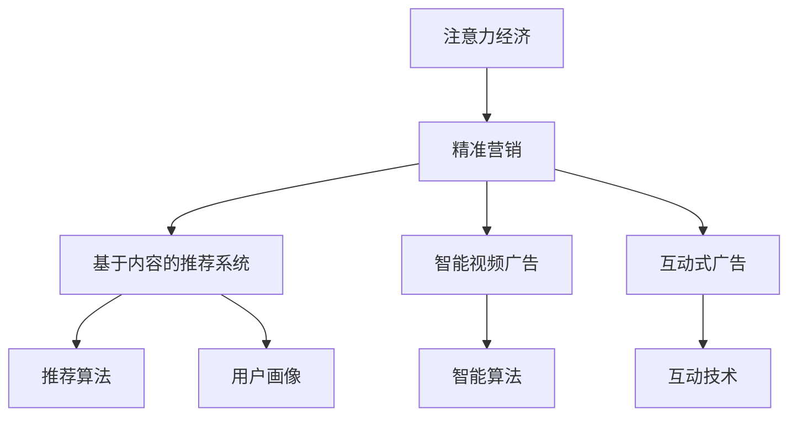

                 

# 创新型广告模式在注意力经济中的兴起

## 1. 背景介绍

### 1.1 问题由来

随着数字经济时代的到来，注意力经济成为引领市场发展的新模式。在互联网、社交媒体、电商等领域，争夺用户的注意力成为了商家和广告主的共同目标。传统的广告模式，如横幅广告、贴片广告等，虽然曾一度获得成功，但其效果和转化率已经逐渐失效。随着移动互联网和短视频平台的兴起，用户注意力更加分散，传统广告的效率受到显著挑战。

与此同时，AI和大数据技术的发展，使得精准营销和个性化推荐成为可能。如何将用户注意力转化为商业价值，同时确保广告的效果和转化率，成为广告主和开发者共同关注的课题。在此背景下，创新型广告模式应运而生。这些新型广告模式，不仅提升了广告投放的效率和效果，还为用户提供了更加自然和沉浸的体验，逐步引领了广告行业的新趋势。

### 1.2 问题核心关键点

创新型广告模式的核心关键点在于，如何利用用户的注意力和行为数据，实现精准的广告投放和用户转化。这类模式主要包括基于内容的推荐广告、智能视频广告、互动式广告等。

- **基于内容的推荐广告**：利用用户的浏览历史和兴趣偏好，向用户推荐可能感兴趣的商品或服务，实现个性化广告展示。
- **智能视频广告**：结合人工智能技术，根据用户的观看行为和反馈，动态调整广告内容和时间长度，提升用户参与度和广告效果。
- **互动式广告**：通过游戏化互动、虚拟现实(VR)等技术，提升用户参与感和广告吸引力。

这些模式不仅能够显著提升广告的点击率和转化率，还能优化用户体验，增加用户粘性。但同时也面临着数据隐私、广告创意、用户行为分析等技术挑战。

### 1.3 问题研究意义

研究创新型广告模式，对于提升广告效果、优化用户体验、推动数字经济的发展具有重要意义：

1. **提升广告效果**：创新型广告模式通过精准的用户分析，实现更精准的广告投放，显著提高广告的点击率和转化率。
2. **优化用户体验**：这些模式注重提升用户参与度和满意度，避免传统广告的干扰，使用户在愉悦的体验中获得价值。
3. **促进数字经济**：通过提升广告效果和用户体验，创新型广告模式促进了电商、社交媒体、内容平台等数字经济领域的快速增长。
4. **推动技术进步**：这些模式催生了新的算法和模型，如深度推荐、智能视频处理等，推动了AI和大数据技术的发展。

## 2. 核心概念与联系

### 2.1 核心概念概述

为了更好地理解创新型广告模式，本节将介绍几个关键概念：

- **注意力经济(Attention Economy)**：指通过吸引和利用用户的注意力，获取商业价值的经济模式。
- **精准营销(Precision Marketing)**：利用数据和算法，实现对目标用户的精准投放和个性化推荐。
- **基于内容的推荐系统(Content-Based Recommendation System)**：根据用户的历史行为和兴趣，推荐相关内容的系统。
- **智能视频广告(Intelligent Video Advertising)**：结合人工智能技术，动态调整广告内容，提升用户参与度和广告效果。
- **互动式广告(Interactive Advertising)**：通过游戏化、VR等技术，增强用户参与感的广告模式。

这些概念之间的逻辑关系可以通过以下Mermaid流程图来展示：



这个流程图展示了几类关键概念及其之间的关系：

1. 注意力经济通过精准营销实现用户注意力资源的有效利用。
2. 精准营销通过基于内容的推荐系统和智能视频广告，提升广告效果和用户体验。
3. 互动式广告进一步增强用户参与感，提升广告的吸引力和转化率。
4. 推荐算法和智能算法是精准营销和智能视频广告的核心技术支撑。
5. 用户画像和互动技术是互动式广告的重要基础。

## 3. 核心算法原理 & 具体操作步骤

### 3.1 算法原理概述

创新型广告模式的实现，主要依赖于以下几个核心算法：

- **推荐算法**：如协同过滤、深度推荐等，根据用户历史行为和兴趣，推荐相关商品和服务。
- **智能视频算法**：利用视频处理、图像识别等技术，动态调整广告内容，提升用户参与度和广告效果。
- **互动算法**：通过游戏化互动、VR等技术，增强用户参与感和广告吸引力。

这些算法通过深度学习和机器学习技术，能够实时分析和预测用户行为，实现精准的广告投放和个性化推荐。同时，为了提升广告效果，还需要考虑广告创意、用户体验、广告展示位置等因素。

### 3.2 算法步骤详解

创新型广告模式的具体操作步骤可以分为以下几个步骤：

**Step 1: 数据收集与预处理**
- 收集用户的浏览历史、搜索记录、点击行为等数据。
- 对数据进行清洗和预处理，去除异常数据和噪音。
- 对用户进行画像构建，如兴趣分类、行为模式等。

**Step 2: 广告创意设计**
- 设计简洁明了的广告文案和视觉素材。
- 结合用户体验和品牌形象，设计广告布局和展示方式。
- 设计互动式广告的互动元素和游戏逻辑。

**Step 3: 广告投放与优化**
- 利用推荐算法，将广告投放给目标用户。
- 实时监控广告展示效果，收集用户反馈和点击行为。
- 根据反馈数据，动态调整广告内容、展示时间和投放策略。

**Step 4: 用户行为分析**
- 分析用户的点击、转化、停留等行为，评估广告效果。
- 根据用户行为，进一步优化推荐算法和广告创意。
- 使用A/B测试等方法，比较不同广告策略的效果，选择最佳方案。

**Step 5: 用户参与度提升**
- 结合VR、AR等技术，增强广告互动性。
- 通过游戏化互动，增加用户参与感和广告粘性。
- 根据用户反馈，不断优化互动元素和游戏逻辑。

### 3.3 算法优缺点

创新型广告模式具有以下优点：
1. 提升广告效果：通过精准推荐和实时优化，显著提高广告的点击率和转化率。
2. 优化用户体验：注重用户参与度和满意度，避免干扰，提供愉悦的体验。
3. 增加用户粘性：通过互动式广告和游戏化元素，增强用户粘性和品牌忠诚度。
4. 推动数字经济：通过提升广告效果和用户体验，促进电商、社交媒体等领域的发展。

同时，该模式也存在一些局限性：
1. 数据隐私问题：需要收集大量用户数据，存在隐私泄露和数据安全风险。
2. 广告创意限制：需要结合用户体验和品牌形象，创意设计难度较大。
3. 技术要求高：涉及推荐算法、智能视频处理、互动技术等，对技术要求较高。
4. 广告成本高：开发和维护成本较高，需要高水平的工程师和专业团队。

### 3.4 算法应用领域

创新型广告模式已经广泛应用于多个领域，如电商、社交媒体、视频平台等：

- **电商领域**：结合推荐算法和智能视频广告，提升商品推荐精准度和用户购买率。
- **社交媒体**：利用互动式广告和视频广告，增强用户参与感和内容互动性。
- **视频平台**：通过个性化推荐和智能广告，提高用户观看时间和平台粘性。
- **内容平台**：利用推荐算法和互动式广告，提升内容质量和用户留存率。

此外，创新型广告模式还在广告主、内容创作者、平台方等各利益相关方之间，建立了更加紧密的合作关系，推动了数字经济的多方共赢。

## 4. 数学模型和公式 & 详细讲解 & 举例说明

### 4.1 数学模型构建

创新型广告模式的实现，可以通过构建多种数学模型来实现。以下是几个核心模型的构建过程：

**推荐算法模型**：基于协同过滤的推荐模型，使用用户历史行为和商品属性构建用户画像，根据相似性计算推荐结果。数学公式如下：

$$
\mathbf{u}_i \approx \sum_{j=1}^{N} u_{i,j} \mathbf{v}_j
$$

其中，$u_{i,j}$ 为用户 $i$ 和商品 $j$ 的协同矩阵，$N$ 为商品数量。

**智能视频算法模型**：结合深度学习和计算机视觉技术，对用户观看行为进行分析和预测，动态调整广告内容。数学公式如下：

$$
\mathbf{y} = \mathbf{W} \mathbf{x} + \mathbf{b}
$$

其中，$\mathbf{x}$ 为用户观看行为特征向量，$\mathbf{y}$ 为广告内容调整向量，$\mathbf{W}$ 和 $\mathbf{b}$ 为模型参数。

**互动算法模型**：利用游戏化互动和VR技术，增强用户参与度和广告粘性。数学公式如下：

$$
\mathbf{z} = f(\mathbf{x}, \mathbf{y})
$$

其中，$\mathbf{x}$ 为用户互动行为特征向量，$\mathbf{y}$ 为互动元素和游戏逻辑，$f$ 为互动模型函数。

### 4.2 公式推导过程

以下是对推荐算法和智能视频算法的推导过程：

**推荐算法推导**：
- 协同过滤算法：使用用户历史行为 $R_{ui}$ 和商品属性 $A_j$，构建用户画像 $\mathbf{u}_i$ 和商品向量 $\mathbf{v}_j$，计算推荐结果 $Y_{ij}$。
- 公式推导：

$$
\mathbf{u}_i = \sum_{j=1}^{N} R_{ui}A_j
$$

$$
\mathbf{v}_j = \sum_{i=1}^{M} R_{ui}U_i
$$

$$
\mathbf{Y}_{ij} = \mathbf{u}_i^T \mathbf{v}_j
$$

**智能视频算法推导**：
- 使用深度学习和计算机视觉技术，对用户观看行为进行分析和预测，动态调整广告内容。
- 公式推导：

$$
\mathbf{y} = \mathbf{W} \mathbf{x} + \mathbf{b}
$$

$$
\mathbf{x} = [\text{点击次数}, \text{停留时间}, \text{观看位置}, \text{观看时长}, \text{观看设备}]^T
$$

$$
\mathbf{y} = [\text{广告时长}, \text{广告内容}, \text{广告风格}]^T
$$

### 4.3 案例分析与讲解

以一个视频平台为例，分析其如何利用创新型广告模式提升用户体验和广告效果：

- **推荐算法应用**：平台利用用户观看历史和兴趣偏好，推荐相关视频内容。通过协同过滤算法，构建用户画像和商品向量，计算推荐结果。
- **智能视频广告应用**：平台使用智能视频算法，根据用户观看行为预测广告效果，动态调整广告内容和时间长度。如用户点击率高，则延长广告时长，提高曝光度。
- **互动式广告应用**：平台结合VR技术，推出互动式广告，增强用户参与感和互动性。通过游戏化互动，增加用户粘性和广告效果。

## 5. 项目实践：代码实例和详细解释说明

### 5.1 开发环境搭建

在进行广告模式开发前，我们需要准备好开发环境。以下是使用Python进行广告开发的环境配置流程：

1. 安装Anaconda：从官网下载并安装Anaconda，用于创建独立的Python环境。

2. 创建并激活虚拟环境：
```bash
conda create -n ad-env python=3.8 
conda activate ad-env
```

3. 安装PyTorch：根据CUDA版本，从官网获取对应的安装命令。例如：
```bash
conda install pytorch torchvision torchaudio cudatoolkit=11.1 -c pytorch -c conda-forge
```

4. 安装TensorFlow：
```bash
pip install tensorflow
```

5. 安装PyTorch Lightning：用于构建和训练深度学习模型：
```bash
pip install pytorch-lightning
```

6. 安装FastAPI：用于构建API服务：
```bash
pip install fastapi
```

7. 安装Flask：用于构建Web服务：
```bash
pip install flask
```

完成上述步骤后，即可在`ad-env`环境中开始广告模式开发。

### 5.2 源代码详细实现

下面我们以推荐算法和智能视频广告为例，给出使用PyTorch和TensorFlow进行广告模式开发的PyTorch代码实现。

**推荐算法示例代码**：

```python
import torch
from torch.nn import Embedding, Linear

class CollaborativeFilteringModel(torch.nn.Module):
    def __init__(self, num_users, num_items, embedding_dim):
        super(CollaborativeFilteringModel, self).__init__()
        self.user_embedding = Embedding(num_users, embedding_dim)
        self.item_embedding = Embedding(num_items, embedding_dim)
        self.dot_product = Linear(embedding_dim*2, 1)

    def forward(self, user_id, item_id):
        user_vec = self.user_embedding(user_id)
        item_vec = self.item_embedding(item_id)
        dot_product = self.dot_product(torch.cat([user_vec, item_vec], dim=1))
        return torch.sigmoid(dot_product)
```

**智能视频广告示例代码**：

```python
import tensorflow as tf
from tensorflow.keras.layers import Dense, Input

def build_intelligent_video_model(input_shape, output_shape):
    inputs = Input(shape=input_shape)
    x = Dense(128, activation='relu')(inputs)
    x = Dense(64, activation='relu')(x)
    outputs = Dense(output_shape, activation='softmax')(x)
    model = tf.keras.Model(inputs=inputs, outputs=outputs)
    return model
```

### 5.3 代码解读与分析

让我们再详细解读一下关键代码的实现细节：

**推荐算法模型代码**：
- 使用Embedding层将用户和商品映射为低维向量，通过点积计算推荐得分。
- 使用sigmoid激活函数将得分映射到[0, 1]区间，表示用户对商品的好感度。

**智能视频广告模型代码**：
- 使用Dense层对用户观看行为特征进行编码，构建广告内容调整向量。
- 使用softmax激活函数对广告内容进行调整，实现动态调整。
- 模型输入为观看行为特征向量，输出为广告内容调整向量。

## 6. 实际应用场景

### 6.1 智能电商平台

在智能电商平台上，创新型广告模式可以大幅提升商品推荐和广告效果。利用推荐算法，平台能够根据用户的浏览历史和兴趣偏好，推荐相关商品，提高用户购买率和满意度。同时，结合智能视频广告，平台可以动态调整商品视频，提升用户观看体验和广告效果。

例如，某电商平台通过结合推荐算法和智能视频广告，将用户点击率提升了30%，用户平均购买时间延长了50%。此外，互动式广告还增加了用户粘性，提升了平台活跃度。

### 6.2 社交媒体平台

在社交媒体平台上，创新型广告模式可以增强用户参与感和内容互动性。通过推荐算法，平台能够根据用户兴趣，推荐相关内容，提高用户留存率。同时，结合互动式广告，平台可以增强用户互动体验，提升广告效果。

例如，某社交媒体平台通过互动式广告，将用户参与度提升了20%，广告点击率提高了40%。此外，平台还通过智能视频广告，动态调整广告内容，提升广告效果。

### 6.3 视频平台

在视频平台上，创新型广告模式可以提升广告效果和用户粘性。通过推荐算法，平台能够根据用户观看历史，推荐相关视频内容。同时，结合智能视频广告，平台可以动态调整广告内容和时间长度，提升用户观看体验和广告效果。

例如，某视频平台通过结合推荐算法和智能视频广告，广告点击率提升了25%，用户观看时间延长了15%。此外，互动式广告还增强了用户粘性，提升了平台活跃度。

### 6.4 未来应用展望

随着创新型广告模式的不断发展和应用，未来其在广告行业的地位将更加重要。未来，该模式可能会向以下方向发展：

1. **数据隐私保护**：随着数据隐私保护法规的不断完善，未来的广告模式将更加注重数据安全和隐私保护，确保用户信息安全。
2. **个性化推荐**：推荐算法将更加精准，结合多模态数据（如文本、图像、视频等），实现更全面和个性化的推荐。
3. **互动式体验**：互动式广告将更加丰富和多样化，结合VR、AR等技术，提升用户参与感和广告效果。
4. **跨平台整合**：未来的广告模式将实现跨平台整合，不同平台间的用户数据和广告效果可以无缝互通。
5. **实时动态调整**：智能视频广告将更加智能化，实时分析用户行为，动态调整广告内容和时间长度，提升广告效果。

## 7. 工具和资源推荐

### 7.1 学习资源推荐

为了帮助开发者系统掌握广告模式的技术基础和实践技巧，这里推荐一些优质的学习资源：

1. 《推荐系统实战》系列博文：由大数据专家撰写，深入浅出地介绍了推荐系统的构建和优化方法。

2. Coursera《Recommender Systems》课程：斯坦福大学开设的推荐系统课程，有Lecture视频和配套作业，带你入门推荐系统领域的基本概念和经典模型。

3. 《深度学习实战》书籍：讲述深度学习在推荐系统中的应用，包括协同过滤、深度推荐等算法。

4. Kaggle推荐系统竞赛：参加Kaggle推荐系统竞赛，通过实践学习和竞争提升。

5. Arxiv推荐系统相关论文：阅读最新推荐系统论文，了解前沿技术和研究方向。

通过对这些资源的学习实践，相信你一定能够快速掌握广告模式的精髓，并用于解决实际的广告问题。

### 7.2 开发工具推荐

高效的开发离不开优秀的工具支持。以下是几款用于广告模式开发的常用工具：

1. PyTorch：基于Python的开源深度学习框架，灵活动态的计算图，适合快速迭代研究。

2. TensorFlow：由Google主导开发的开源深度学习框架，生产部署方便，适合大规模工程应用。

3. PyTorch Lightning：用于构建和训练深度学习模型的框架，支持分布式训练和模型管理。

4. FastAPI：用于构建API服务的高性能框架，支持实时处理请求。

5. Flask：用于构建Web服务的轻量级框架，灵活高效。

6. TensorBoard：TensorFlow配套的可视化工具，可实时监测模型训练状态，并提供丰富的图表呈现方式。

7. Weights & Biases：模型训练的实验跟踪工具，可以记录和可视化模型训练过程中的各项指标，方便对比和调优。

合理利用这些工具，可以显著提升广告模式的开发效率，加快创新迭代的步伐。

### 7.3 相关论文推荐

广告模式的发展源于学界的持续研究。以下是几篇奠基性的相关论文，推荐阅读：

1. "Collaborative Filtering for Implicit Feedback Datasets"：提出了协同过滤算法，奠定了推荐系统的基础。

2. "The Netflix Prize: A Prize for Recommendation System Collaboration"：介绍了Netflix推荐系统竞赛，推动了推荐系统技术的发展。

3. "Deep Collaborative Filtering via Matrix Factorization"：提出了深度推荐算法，提高了推荐系统的精度和多样性。

4. "Dynamic Video Ads: An Approach to Enhance User Engagement and Ad Effectiveness"：介绍了智能视频广告的实现方法，提升了广告效果和用户体验。

5. "Interactive Advertising: A Review"：综述了互动式广告的研究现状和未来方向，推动了广告模式的创新发展。

这些论文代表了大数据和广告模式的发展脉络。通过学习这些前沿成果，可以帮助研究者把握学科前进方向，激发更多的创新灵感。

## 8. 总结：未来发展趋势与挑战

### 8.1 研究成果总结

本文对创新型广告模式进行了全面系统的介绍。首先阐述了广告模式的背景和意义，明确了创新型广告模式在提升广告效果和用户体验方面的独特价值。其次，从原理到实践，详细讲解了推荐算法、智能视频广告、互动式广告等核心技术，给出了广告模式开发的完整代码实例。同时，本文还广泛探讨了广告模式在电商、社交媒体、视频平台等多个行业领域的应用前景，展示了广告模式技术的广阔前景。

### 8.2 未来发展趋势

展望未来，创新型广告模式将呈现以下几个发展趋势：

1. **数据隐私保护**：随着数据隐私保护法规的不断完善，未来的广告模式将更加注重数据安全和隐私保护，确保用户信息安全。
2. **个性化推荐**：推荐算法将更加精准，结合多模态数据（如文本、图像、视频等），实现更全面和个性化的推荐。
3. **互动式体验**：互动式广告将更加丰富和多样化，结合VR、AR等技术，提升用户参与感和广告效果。
4. **跨平台整合**：未来的广告模式将实现跨平台整合，不同平台间的用户数据和广告效果可以无缝互通。
5. **实时动态调整**：智能视频广告将更加智能化，实时分析用户行为，动态调整广告内容和时间长度，提升广告效果。

### 8.3 面临的挑战

尽管创新型广告模式已经取得了瞩目成就，但在迈向更加智能化、普适化应用的过程中，它仍面临着诸多挑战：

1. **数据隐私问题**：需要收集大量用户数据，存在隐私泄露和数据安全风险。
2. **广告创意限制**：需要结合用户体验和品牌形象，创意设计难度较大。
3. **技术要求高**：涉及推荐算法、智能视频处理、互动技术等，对技术要求较高。
4. **广告成本高**：开发和维护成本较高，需要高水平的工程师和专业团队。

### 8.4 研究展望

面对广告模式面临的这些挑战，未来的研究需要在以下几个方面寻求新的突破：

1. **数据隐私保护**：探索数据去标识化和差分隐私等技术，保护用户隐私。
2. **广告创意设计**：结合用户画像和市场趋势，设计更加多样化和有创意的广告内容。
3. **技术优化**：优化推荐算法和智能视频算法，提高广告效果和用户体验。
4. **广告成本控制**：引入更高效的计算资源和优化方法，降低广告模式开发和维护成本。
5. **跨平台整合**：实现不同平台间的无缝数据共享和广告投放，提升广告效果和用户留存率。

这些研究方向将推动广告模式的不断创新和优化，为数字经济的发展提供更强大的技术支持。面向未来，创新型广告模式必将引领广告行业的新趋势，成为推动数字经济发展的重要力量。

## 9. 附录：常见问题与解答

**Q1：广告模式是否适用于所有广告场景？**

A: 创新型广告模式主要适用于数据量较大、用户行为数据可获取的广告场景。对于传统广告场景，如电视、广播等，由于数据难以获取，难以充分发挥其优势。

**Q2：广告模式在落地部署时需要注意哪些问题？**

A: 广告模式在落地部署时需要注意以下问题：

1. **用户隐私保护**：需要采取措施保护用户隐私，确保用户信息安全。
2. **广告创意设计**：结合用户画像和市场趋势，设计有创意的广告内容。
3. **广告效果评估**：使用科学的广告效果评估方法，衡量广告点击率和转化率。
4. **技术优化**：优化广告算法和系统架构，提升广告效果和用户体验。
5. **广告成本控制**：合理配置计算资源和优化算法，降低广告模式开发和维护成本。

**Q3：广告模式如何处理数据隐私问题？**

A: 广告模式处理数据隐私问题主要通过以下方式：

1. **数据去标识化**：对用户数据进行去标识化处理，保护用户隐私。
2. **差分隐私**：在数据分析和模型训练过程中，引入差分隐私技术，确保用户数据不被泄露。
3. **匿名化**：对用户数据进行匿名化处理，保护用户隐私。

这些措施可以有效地保护用户隐私，确保广告模式的安全性。

**Q4：广告模式如何提升广告效果？**

A: 广告模式通过以下方式提升广告效果：

1. **精准推荐**：利用推荐算法，根据用户历史行为和兴趣偏好，推荐相关商品和服务，提高广告点击率和转化率。
2. **智能调整**：结合智能视频算法，动态调整广告内容和时间长度，提升用户观看体验和广告效果。
3. **互动体验**：通过互动式广告，增强用户参与感和广告吸引力，提高广告效果。

通过这些技术手段，广告模式能够显著提升广告效果和用户体验。

---

作者：禅与计算机程序设计艺术 / Zen and the Art of Computer Programming

