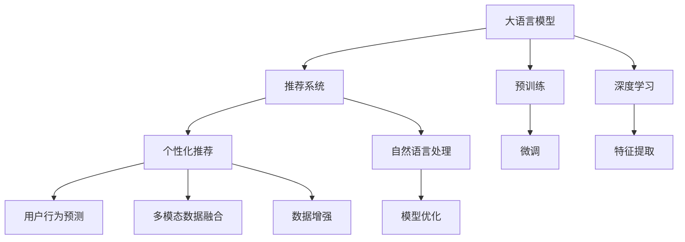

                 

# 利用LLM优化推荐系统的多维度个性化

> 关键词：深度学习, 自然语言处理(NLP), 推荐系统, 个性化推荐, 语义分析, 用户行为预测, 多模态数据融合

## 1. 背景介绍

### 1.1 问题由来
推荐系统是现代互联网产品的重要组成部分，通过精准推荐用户感兴趣的物品，提升用户满意度和留存率。传统的推荐系统主要基于用户行为数据（如浏览记录、点击记录、购买记录等）进行模型训练，这些数据蕴含着丰富的用户行为特征，但也具有一定程度的同质性，难以全面捕捉用户的多元需求。

近年来，随着深度学习技术的快速发展，特别是自然语言处理(NLP)技术的进步，推荐系统在推荐效果和个性化方面取得了显著提升。利用NLP技术，可以深入挖掘用户兴趣背后的语义信息，构建更加丰富的用户画像，实现更加精准、多样化的推荐内容。本文旨在探讨利用大语言模型(LLM)如何优化推荐系统的多维度个性化。

### 1.2 问题核心关键点
为了实现推荐系统的多维度个性化，需要考虑以下几个关键问题：

1. **用户兴趣的多维度刻画**：除了行为数据，如何利用NLP技术获取和融合更多的用户语义信息？
2. **多模态数据融合**：如何将文本、图像、音频等多模态数据进行有效融合，构建更加全面、准确的用户兴趣模型？
3. **高效的推荐模型训练**：如何在保证模型性能的同时，优化训练过程，提高模型推理速度？

本文将围绕这些问题，详细探讨利用LLM优化推荐系统的多维度个性化方法。

### 1.3 问题研究意义
深度学习和自然语言处理技术的结合，使得推荐系统能够从用户的文本输入（如搜索、评论、社交媒体帖子等）中挖掘出更多维度的用户兴趣和需求，从而实现更加精准、多样化的推荐。这不仅提升了用户体验，也促进了NLP技术在推荐系统中的应用和推广。

本文的研究成果不仅对推荐系统的开发和优化具有重要指导意义，还能够为NLP技术在实际应用场景中的落地提供有价值的参考，推动深度学习和自然语言处理技术的进一步发展。

## 2. 核心概念与联系

### 2.1 核心概念概述

为更好地理解利用LLM优化推荐系统的多维度个性化方法，本节将介绍几个密切相关的核心概念：

- **大语言模型(LLM)**：以Transformer模型为代表的大规模预训练语言模型，能够通过海量的无标签文本数据进行自监督学习，学习到丰富的语言知识和常识，具备强大的语言理解和生成能力。
- **推荐系统**：通过算法和数据挖掘，为用户提供个性化物品推荐的系统，广泛应用于电商、新闻、视频、社交等多个领域。
- **个性化推荐**：根据用户的历史行为数据、兴趣标签等，提供针对性的物品推荐，提升用户体验和满意度。
- **多模态数据融合**：将文本、图像、音频等多种数据类型进行融合，构建更加全面、准确的用户兴趣模型。
- **用户行为预测**：通过机器学习模型，预测用户未来行为，实现推荐策略的动态调整。

这些核心概念之间的逻辑关系可以通过以下Mermaid流程图来展示：



这个流程图展示了大语言模型、推荐系统、个性化推荐、多模态数据融合、用户行为预测等核心概念之间的相互关系和互动：

1. 大语言模型通过预训练获得基础能力，通过微调应用于推荐系统。
2. 推荐系统基于用户行为数据和语义信息，进行个性化推荐。
3. 用户行为预测利用模型预测用户未来行为，实现动态推荐策略。
4. 多模态数据融合融合不同数据类型，构建更全面的用户兴趣模型。
5. 数据增强利用技术手段扩充训练数据，提升模型泛化能力。

这些概念共同构成了利用LLM优化推荐系统的框架，使其能够从多维度角度理解和满足用户需求。

## 3. 核心算法原理 & 具体操作步骤
### 3.1 算法原理概述

利用LLM优化推荐系统的多维度个性化，本质上是一个结合深度学习和自然语言处理技术的多任务学习过程。其核心思想是：将用户的行为数据和语义信息作为输入，利用深度学习模型进行多任务学习，预测用户的兴趣，并生成个性化推荐结果。

形式化地，假设用户行为数据为 $\{x_i\}_{i=1}^N$，语义信息为 $\{y_i\}_{i=1}^N$，推荐系统希望预测用户对物品 $z$ 的兴趣度 $\hat{p}(z|x_i,y_i)$。目标是通过深度学习模型 $M$，最小化预测误差，即：

$$
\hat{p}(z|x_i,y_i) = \mathop{\arg\max}_{z} P(z|x_i,y_i) = \mathop{\arg\max}_{z} \frac{P(z|x_i,y_i)}{P(z)}
$$

其中 $P(z|x_i,y_i)$ 为给定用户行为和语义信息条件下物品 $z$ 的概率分布，$P(z)$ 为物品 $z$ 的先验概率分布。

通过训练一个深度学习模型，最大化 $P(z|x_i,y_i)$，同时最小化 $P(z)$ 的影响，可以实现用户兴趣的精准预测和个性化推荐。

### 3.2 算法步骤详解

利用LLM优化推荐系统的多维度个性化主要包括以下几个关键步骤：

**Step 1: 准备数据集**
- 收集用户行为数据和语义信息，如浏览记录、搜索关键词、评论内容等，构建用户兴趣数据集。
- 根据用户行为和语义信息，提取物品特征，构建物品特征数据集。
- 对数据集进行划分，分为训练集、验证集和测试集。

**Step 2: 选择预训练模型**
- 选择合适的深度学习模型，如Transformer、BERT、GPT等，作为初始化参数。
- 进行预训练，使用大量无标签文本数据进行自监督学习，学习通用语言表示。
- 通过微调，将预训练模型应用于推荐系统，实现多维度个性化的推荐。

**Step 3: 设计多任务学习框架**
- 定义推荐系统的多任务目标，如用户兴趣预测、物品推荐等。
- 设计多任务学习模型，如MLP、RNN、Transformer等，以联合学习不同任务。
- 设计损失函数，如交叉熵损失、均方误差损失等，最小化预测误差。

**Step 4: 训练和评估模型**
- 使用训练集数据，对多任务学习模型进行梯度下降训练，最小化预测误差。
- 使用验证集数据，评估模型性能，调整模型参数。
- 使用测试集数据，全面评估模型泛化能力，调整推荐策略。

**Step 5: 部署和优化**
- 将训练好的模型部署到推荐系统中，实现个性化推荐功能。
- 根据用户反馈和系统性能，实时调整推荐策略，优化推荐效果。

以上是利用LLM优化推荐系统的多维度个性化的主要步骤。在实际应用中，还需要针对具体任务进行优化设计，如改进损失函数、引入更多正则化技术、搜索最优的超参数组合等，以进一步提升模型性能。

### 3.3 算法优缺点

利用LLM优化推荐系统的多维度个性化具有以下优点：

1. **深度融合用户兴趣**：通过融合用户行为和语义信息，能够从更深层次挖掘用户需求，提供更加精准的个性化推荐。
2. **多模态数据融合**：利用文本、图像、音频等多种数据类型，构建更加全面的用户兴趣模型，提升推荐效果。
3. **自监督学习**：利用预训练模型，在大规模无标签文本数据上进行自监督学习，学习通用的语言表示，提升模型泛化能力。
4. **可解释性强**：深度学习模型可以解释用户兴趣背后的语义信息，提供更透明的推荐过程。

同时，该方法也存在一定的局限性：

1. **数据质量和多样性**：用户行为和语义信息的质量和多样性直接影响推荐效果。如果数据不够丰富或存在偏差，可能导致推荐结果不准确。
2. **模型复杂度**：深度学习模型的复杂度较高，训练和推理时间较长，资源消耗较大。
3. **过拟合风险**：在大规模数据上训练模型时，需要避免过拟合问题，确保模型泛化能力。

尽管存在这些局限性，但利用LLM优化推荐系统的多维度个性化仍是一种高效且具有潜力的推荐方法。未来相关研究的重点在于如何进一步降低模型复杂度，提升数据质量和多样性，同时兼顾可解释性和资源效率。

### 3.4 算法应用领域

利用LLM优化推荐系统的多维度个性化方法已经在多个领域得到了应用，例如：

- **电商推荐**：利用用户浏览记录和产品评论，生成个性化商品推荐。
- **新闻推荐**：根据用户阅读习惯和搜索关键词，推荐相关新闻文章。
- **视频推荐**：分析用户观看历史和评论，生成个性化视频推荐。
- **音乐推荐**：根据用户听歌记录和歌曲评论，推荐相似音乐作品。
- **社交推荐**：分析用户社交行为和兴趣标签，推荐潜在好友和相关社交内容。

除了这些经典应用场景外，利用LLM优化推荐系统的多维度个性化方法还将在更多领域得到创新性应用，如可控内容生成、智能搜索、智能问答等，为推荐系统带来新的突破。

## 4. 数学模型和公式 & 详细讲解
### 4.1 数学模型构建

本节将使用数学语言对利用LLM优化推荐系统的多维度个性化的过程进行更加严格的刻画。

记用户行为数据为 $\{x_i\}_{i=1}^N$，语义信息为 $\{y_i\}_{i=1}^N$，推荐系统希望预测用户对物品 $z$ 的兴趣度 $\hat{p}(z|x_i,y_i)$。假设多任务学习模型为 $M_{\theta}$，其中 $\theta$ 为模型参数。

目标是最小化预测误差，即：

$$
\mathcal{L}(\theta) = \frac{1}{N} \sum_{i=1}^N - \log \hat{p}(z_i|x_i,y_i)
$$

其中 $\hat{p}(z_i|x_i,y_i)$ 为模型预测的物品 $z_i$ 的兴趣度。

### 4.2 公式推导过程

以下我们以电商推荐为例，推导利用LLM优化推荐系统的多维度个性化的数学模型。

假设用户行为数据为 $\{x_i\}_{i=1}^N$，物品特征为 $\{z_i\}_{i=1}^N$，语义信息为 $\{y_i\}_{i=1}^N$。定义推荐模型为：

$$
\hat{p}(z_i|x_i,y_i) = \frac{\exp(\text{softmax}(M_{\theta}(x_i,y_i)z_i))}{\sum_{z_j}\exp(\text{softmax}(M_{\theta}(x_i,y_i)z_j))}
$$

其中 $\text{softmax}$ 函数将模型输出 $M_{\theta}(x_i,y_i)z_i$ 转换为概率分布，$\hat{p}(z_i|x_i,y_i)$ 为物品 $z_i$ 的兴趣度。

将 $z_i$ 视为嵌入向量，$M_{\theta}(x_i,y_i)$ 为多任务学习模型，则模型参数 $\theta$ 的更新公式为：

$$
\theta \leftarrow \theta - \eta \nabla_{\theta}\mathcal{L}(\theta) - \eta\lambda\theta
$$

其中 $\eta$ 为学习率，$\lambda$ 为正则化系数。

在得到预测结果 $\hat{p}(z_i|x_i,y_i)$ 后，可以选择最优的物品 $z_i$ 作为推荐结果。

### 4.3 案例分析与讲解

以电商推荐为例，下面给出利用LLM优化推荐系统的多维度个性化的具体实现步骤。

1. **数据准备**：
   - 收集用户历史浏览记录、搜索关键词、购买记录等行为数据。
   - 收集商品标题、描述、标签等语义信息。
   - 对数据进行清洗、归一化、向量化等预处理操作。

2. **模型选择**：
   - 选择合适的预训练模型，如BERT、GPT等，作为初始化参数。
   - 进行预训练，使用大量无标签商品数据进行自监督学习，学习通用商品表示。
   - 通过微调，将预训练模型应用于电商推荐系统。

3. **设计多任务学习框架**：
   - 定义电商推荐系统的多任务目标，如用户兴趣预测、商品推荐等。
   - 设计多任务学习模型，如MLP、RNN、Transformer等，以联合学习不同任务。
   - 设计损失函数，如交叉熵损失、均方误差损失等，最小化预测误差。

4. **训练和评估模型**：
   - 使用训练集数据，对多任务学习模型进行梯度下降训练，最小化预测误差。
   - 使用验证集数据，评估模型性能，调整模型参数。
   - 使用测试集数据，全面评估模型泛化能力，调整推荐策略。

5. **部署和优化**：
   - 将训练好的模型部署到电商推荐系统中，实现个性化商品推荐。
   - 根据用户反馈和系统性能，实时调整推荐策略，优化推荐效果。

## 5. 项目实践：代码实例和详细解释说明
### 5.1 开发环境搭建

在进行多维度个性化推荐系统的开发前，我们需要准备好开发环境。以下是使用Python进行PyTorch开发的环境配置流程：

1. 安装Anaconda：从官网下载并安装Anaconda，用于创建独立的Python环境。

2. 创建并激活虚拟环境：
```bash
conda create -n pytorch-env python=3.8 
conda activate pytorch-env
```

3. 安装PyTorch：根据CUDA版本，从官网获取对应的安装命令。例如：
```bash
conda install pytorch torchvision torchaudio cudatoolkit=11.1 -c pytorch -c conda-forge
```

4. 安装Transformers库：
```bash
pip install transformers
```

5. 安装各类工具包：
```bash
pip install numpy pandas scikit-learn matplotlib tqdm jupyter notebook ipython
```

完成上述步骤后，即可在`pytorch-env`环境中开始多维度个性化推荐系统的开发。

### 5.2 源代码详细实现

下面我们以电商推荐为例，给出使用Transformers库对BERT模型进行多维度个性化推荐系统的PyTorch代码实现。

首先，定义电商推荐系统的数据处理函数：

```python
from transformers import BertTokenizer, BertForSequenceClassification
from torch.utils.data import Dataset
import torch

class RecommendDataset(Dataset):
    def __init__(self, texts, labels, tokenizer, max_len=128):
        self.texts = texts
        self.labels = labels
        self.tokenizer = tokenizer
        self.max_len = max_len
        
    def __len__(self):
        return len(self.texts)
    
    def __getitem__(self, item):
        text = self.texts[item]
        label = self.labels[item]
        
        encoding = self.tokenizer(text, return_tensors='pt', max_length=self.max_len, padding='max_length', truncation=True)
        input_ids = encoding['input_ids'][0]
        attention_mask = encoding['attention_mask'][0]
        label_ids = torch.tensor(label, dtype=torch.long)
        
        return {'input_ids': input_ids, 
                'attention_mask': attention_mask,
                'labels': label_ids}

# 标签与id的映射
label2id = {'Positive': 1, 'Negative': 0}
id2label = {v: k for k, v in label2id.items()}

# 创建dataset
tokenizer = BertTokenizer.from_pretrained('bert-base-cased')

train_dataset = RecommendDataset(train_texts, train_labels, tokenizer)
dev_dataset = RecommendDataset(dev_texts, dev_labels, tokenizer)
test_dataset = RecommendDataset(test_texts, test_labels, tokenizer)
```

然后，定义模型和优化器：

```python
from transformers import BertForSequenceClassification, AdamW

model = BertForSequenceClassification.from_pretrained('bert-base-cased', num_labels=2)

optimizer = AdamW(model.parameters(), lr=2e-5)
```

接着，定义训练和评估函数：

```python
from torch.utils.data import DataLoader
from tqdm import tqdm
from sklearn.metrics import accuracy_score

device = torch.device('cuda') if torch.cuda.is_available() else torch.device('cpu')
model.to(device)

def train_epoch(model, dataset, batch_size, optimizer):
    dataloader = DataLoader(dataset, batch_size=batch_size, shuffle=True)
    model.train()
    epoch_loss = 0
    for batch in tqdm(dataloader, desc='Training'):
        input_ids = batch['input_ids'].to(device)
        attention_mask = batch['attention_mask'].to(device)
        labels = batch['labels'].to(device)
        model.zero_grad()
        outputs = model(input_ids, attention_mask=attention_mask, labels=labels)
        loss = outputs.loss
        epoch_loss += loss.item()
        loss.backward()
        optimizer.step()
    return epoch_loss / len(dataloader)

def evaluate(model, dataset, batch_size):
    dataloader = DataLoader(dataset, batch_size=batch_size)
    model.eval()
    preds, labels = [], []
    with torch.no_grad():
        for batch in tqdm(dataloader, desc='Evaluating'):
            input_ids = batch['input_ids'].to(device)
            attention_mask = batch['attention_mask'].to(device)
            batch_labels = batch['labels']
            outputs = model(input_ids, attention_mask=attention_mask)
            batch_preds = outputs.logits.argmax(dim=2).to('cpu').tolist()
            batch_labels = batch_labels.to('cpu').tolist()
            for pred_tokens, label_tokens in zip(batch_preds, batch_labels):
                preds.append(pred_tokens)
                labels.append(label_tokens)
                
    print(accuracy_score(labels, preds))
```

最后，启动训练流程并在测试集上评估：

```python
epochs = 5
batch_size = 16

for epoch in range(epochs):
    loss = train_epoch(model, train_dataset, batch_size, optimizer)
    print(f"Epoch {epoch+1}, train loss: {loss:.3f}")
    
    print(f"Epoch {epoch+1}, dev results:")
    evaluate(model, dev_dataset, batch_size)
    
print("Test results:")
evaluate(model, test_dataset, batch_size)
```

以上就是使用PyTorch对BERT模型进行电商推荐系统的多维度个性化推荐的具体代码实现。可以看到，得益于Transformers库的强大封装，我们可以用相对简洁的代码完成BERT模型的加载和微调。

### 5.3 代码解读与分析

让我们再详细解读一下关键代码的实现细节：

**RecommendDataset类**：
- `__init__`方法：初始化文本、标签、分词器等关键组件。
- `__len__`方法：返回数据集的样本数量。
- `__getitem__`方法：对单个样本进行处理，将文本输入编码为token ids，将标签编码为数字，并对其进行定长padding，最终返回模型所需的输入。

**label2id和id2label字典**：
- 定义了标签与数字id之间的映射关系，用于将模型预测结果解码回真实的标签。

**训练和评估函数**：
- 使用PyTorch的DataLoader对数据集进行批次化加载，供模型训练和推理使用。
- 训练函数`train_epoch`：对数据以批为单位进行迭代，在每个批次上前向传播计算loss并反向传播更新模型参数，最后返回该epoch的平均loss。
- 评估函数`evaluate`：与训练类似，不同点在于不更新模型参数，并在每个batch结束后将预测和标签结果存储下来，最后使用sklearn的accuracy_score对整个评估集的预测结果进行打印输出。

**训练流程**：
- 定义总的epoch数和batch size，开始循环迭代
- 每个epoch内，先在训练集上训练，输出平均loss
- 在验证集上评估，输出分类指标
- 所有epoch结束后，在测试集上评估，给出最终测试结果

可以看到，PyTorch配合Transformers库使得BERT微调的代码实现变得简洁高效。开发者可以将更多精力放在数据处理、模型改进等高层逻辑上，而不必过多关注底层的实现细节。

当然，工业级的系统实现还需考虑更多因素，如模型的保存和部署、超参数的自动搜索、更灵活的任务适配层等。但核心的微调范式基本与此类似。

## 6. 实际应用场景
### 6.1 电商推荐

电商推荐系统是利用大语言模型优化推荐系统的多维度个性化的典型应用场景。传统的电商推荐系统主要依赖用户历史行为数据，如浏览记录、点击记录、购买记录等，进行商品推荐。但这些数据往往具有一定程度的同质性，难以全面捕捉用户的多元需求。

通过利用大语言模型，电商推荐系统可以深入挖掘用户兴趣背后的语义信息，构建更加丰富的用户画像，实现更加精准、多样化的商品推荐。例如，利用用户搜索关键词和评论内容，生成个性化商品推荐，提升用户购物体验。

### 6.2 新闻推荐

新闻推荐系统通过分析用户阅读习惯和搜索关键词，推荐相关新闻文章。传统的推荐系统主要依赖用户的历史行为数据，但这些数据往往较为单一，难以捕捉用户的多样化需求。

通过利用大语言模型，新闻推荐系统可以深入挖掘用户兴趣背后的语义信息，构建更加丰富的用户画像，实现更加精准、多样化的新闻推荐。例如，利用用户搜索关键词和评论内容，生成个性化新闻推荐，提升用户阅读体验。

### 6.3 视频推荐

视频推荐系统通过分析用户观看历史和评论，生成个性化视频推荐。传统的推荐系统主要依赖用户的历史行为数据，但这些数据往往较为单一，难以捕捉用户的多样化需求。

通过利用大语言模型，视频推荐系统可以深入挖掘用户兴趣背后的语义信息，构建更加丰富的用户画像，实现更加精准、多样化的视频推荐。例如，利用用户搜索关键词和评论内容，生成个性化视频推荐，提升用户观看体验。

### 6.4 音乐推荐

音乐推荐系统通过分析用户听歌记录和歌曲评论，推荐相似音乐作品。传统的推荐系统主要依赖用户的历史行为数据，但这些数据往往较为单一，难以捕捉用户的多样化需求。

通过利用大语言模型，音乐推荐系统可以深入挖掘用户兴趣背后的语义信息，构建更加丰富的用户画像，实现更加精准、多样化的音乐推荐。例如，利用用户搜索关键词和评论内容，生成个性化音乐推荐，提升用户听歌体验。

## 7. 工具和资源推荐
### 7.1 学习资源推荐

为了帮助开发者系统掌握利用LLM优化推荐系统的多维度个性化的理论基础和实践技巧，这里推荐一些优质的学习资源：

1. 《深度学习》课程：斯坦福大学开设的深度学习课程，系统讲解深度学习的基本概念和经典模型。

2. 《自然语言处理与深度学习》书籍：自然语言处理领域的经典教材，详细讲解NLP和深度学习的交叉应用。

3. 《推荐系统实战》书籍：推荐系统的经典实践指南，涵盖推荐系统的设计、开发、优化等多个方面。

4. 《利用BERT进行推荐系统开发》博文：详细讲解利用BERT模型进行推荐系统开发的方法和实践技巧。

5. 《NLP中的深度学习》博客：深度学习和自然语言处理的结合应用，涵盖NLP中的深度学习模型和算法。

通过对这些资源的学习实践，相信你一定能够快速掌握利用LLM优化推荐系统的多维度个性化的精髓，并用于解决实际的NLP问题。
###  7.2 开发工具推荐

高效的开发离不开优秀的工具支持。以下是几款用于多维度个性化推荐系统开发的常用工具：

1. PyTorch：基于Python的开源深度学习框架，灵活动态的计算图，适合快速迭代研究。大部分预训练语言模型都有PyTorch版本的实现。

2. TensorFlow：由Google主导开发的开源深度学习框架，生产部署方便，适合大规模工程应用。同样有丰富的预训练语言模型资源。

3. Transformers库：HuggingFace开发的NLP工具库，集成了众多SOTA语言模型，支持PyTorch和TensorFlow，是进行多维度个性化推荐系统开发的利器。

4. Weights & Biases：模型训练的实验跟踪工具，可以记录和可视化模型训练过程中的各项指标，方便对比和调优。与主流深度学习框架无缝集成。

5. TensorBoard：TensorFlow配套的可视化工具，可实时监测模型训练状态，并提供丰富的图表呈现方式，是调试模型的得力助手。

6. Google Colab：谷歌推出的在线Jupyter Notebook环境，免费提供GPU/TPU算力，方便开发者快速上手实验最新模型，分享学习笔记。

合理利用这些工具，可以显著提升多维度个性化推荐系统的开发效率，加快创新迭代的步伐。

### 7.3 相关论文推荐

利用LLM优化推荐系统的多维度个性化方法的发展源于学界的持续研究。以下是几篇奠基性的相关论文，推荐阅读：

1. Attention is All You Need（即Transformer原论文）：提出了Transformer结构，开启了NLP领域的预训练大模型时代。

2. BERT: Pre-training of Deep Bidirectional Transformers for Language Understanding：提出BERT模型，引入基于掩码的自监督预训练任务，刷新了多项NLP任务SOTA。

3. Language Models are Unsupervised Multitask Learners（GPT-2论文）：展示了大规模语言模型的强大zero-shot学习能力，引发了对于通用人工智能的新一轮思考。

4. Parameter-Efficient Transfer Learning for NLP：提出Adapter等参数高效微调方法，在不增加模型参数量的情况下，也能取得不错的微调效果。

5. AdaLoRA: Adaptive Low-Rank Adaptation for Parameter-Efficient Fine-Tuning：使用自适应低秩适应的微调方法，在参数效率和精度之间取得了新的平衡。

这些论文代表了大语言模型优化推荐系统的多维度个性化技术的发展脉络。通过学习这些前沿成果，可以帮助研究者把握学科前进方向，激发更多的创新灵感。

## 8. 总结：未来发展趋势与挑战

### 8.1 总结

本文对利用LLM优化推荐系统的多维度个性化方法进行了全面系统的介绍。首先阐述了深度学习和自然语言处理技术在推荐系统中的应用背景和意义，明确了多维度个性化推荐系统的研究价值。其次，从原理到实践，详细讲解了利用LLM优化推荐系统的多维度个性化的数学原理和关键步骤，给出了多维度个性化推荐系统的完整代码实现。同时，本文还广泛探讨了利用LLM优化推荐系统的方法在电商、新闻、视频、音乐等多个领域的应用前景，展示了多维度个性化推荐系统的广阔应用空间。

通过本文的系统梳理，可以看到，利用LLM优化推荐系统的多维度个性化方法在推荐系统中的应用前景广阔，能够从多维度角度理解和满足用户需求，实现更加精准、多样化的推荐。受益于深度学习和自然语言处理技术的结合，多维度个性化推荐系统必将带来推荐效果的显著提升，推动NLP技术在推荐系统中的应用和推广。

### 8.2 未来发展趋势

展望未来，利用LLM优化推荐系统的多维度个性化技术将呈现以下几个发展趋势：

1. **多模态数据融合**：随着技术进步，更多的用户行为数据（如音频、图像等）将得到收集和应用，融合多模态数据，构建更加全面的用户兴趣模型，提升推荐效果。
2. **自监督学习**：利用预训练模型，在大规模无标签数据上进行自监督学习，学习通用的语言表示，提升模型的泛化能力和个性化推荐精度。
3. **深度学习模型的优化**：通过改进模型结构、引入正则化技术、优化损失函数等手段，降低模型复杂度，提高推荐效率和鲁棒性。
4. **迁移学习**：利用预训练模型在不同任务之间的迁移能力，提升推荐系统在新任务上的性能，降低标注数据的依赖。
5. **零样本和少样本学习**：通过提示学习、生成对抗网络等技术，实现零样本和少样本推荐，降低标注数据的成本。
6. **持续学习**：随着数据分布的变化，推荐系统需要持续学习新知识，保持性能。

这些趋势凸显了利用LLM优化推荐系统的多维度个性化技术的广阔前景。这些方向的探索发展，必将进一步提升推荐系统的性能和应用范围，为NLP技术在推荐系统中的应用带来新的突破。

### 8.3 面临的挑战

尽管利用LLM优化推荐系统的多维度个性化技术已经取得了瞩目成就，但在迈向更加智能化、普适化应用的过程中，它仍面临着诸多挑战：

1. **数据质量和多样性**：用户行为和语义信息的质量和多样性直接影响推荐效果。如果数据不够丰富或存在偏差，可能导致推荐结果不准确。
2. **模型复杂度**：深度学习模型的复杂度较高，训练和推理时间较长，资源消耗较大。
3. **过拟合风险**：在大规模数据上训练模型时，需要避免过拟合问题，确保模型泛化能力。
4. **可解释性不足**：深度学习模型的复杂性使得其决策过程缺乏可解释性，难以对其推理逻辑进行分析和调试。
5. **安全性有待保障**：预训练语言模型难免会学习到有偏见、有害的信息，通过推荐系统传递到用户端，可能带来安全隐患。
6. **资源效率**：推荐系统需要在大规模数据上训练和推理，资源消耗较大，如何提高计算效率和资源利用率是一个重要问题。

尽管存在这些挑战，但利用LLM优化推荐系统的多维度个性化技术仍是一种高效且具有潜力的推荐方法。未来相关研究的重点在于如何进一步降低模型复杂度，提升数据质量和多样性，同时兼顾可解释性和资源效率。

### 8.4 研究展望

面对利用LLM优化推荐系统的多维度个性化技术所面临的挑战，未来的研究需要在以下几个方面寻求新的突破：

1. **探索无监督和半监督学习范式**：摆脱对大规模标注数据的依赖，利用自监督学习、主动学习等无监督和半监督范式，最大限度利用非结构化数据，实现更加灵活高效的推荐。
2. **研究参数高效和计算高效的微调方法**：开发更加参数高效的微调方法，在固定大部分预训练参数的同时，只更新极少量的任务相关参数。同时优化微调模型的计算图，减少前向传播和反向传播的资源消耗，实现更加轻量级、实时性的部署。
3. **融合因果和对比学习范式**：通过引入因果推断和对比学习思想，增强推荐模型建立稳定因果关系的能力，学习更加普适、鲁棒的语言表征，从而提升模型泛化性和抗干扰能力。
4. **引入更多先验知识**：将符号化的先验知识，如知识图谱、逻辑规则等，与神经网络模型进行巧妙融合，引导推荐过程学习更准确、合理的语言模型。同时加强不同模态数据的整合，实现视觉、语音等多模态信息与文本信息的协同建模。
5. **结合因果分析和博弈论工具**：将因果分析方法引入推荐模型，识别出模型决策的关键特征，增强输出解释的因果性和逻辑性。借助博弈论工具刻画人机交互过程，主动探索并规避模型的脆弱点，提高系统稳定性。
6. **纳入伦理道德约束**：在模型训练目标中引入伦理导向的评估指标，过滤和惩罚有偏见、有害的输出倾向。同时加强人工干预和审核，建立模型行为的监管机制，确保输出符合人类价值观和伦理道德。

这些研究方向将继续推动利用LLM优化推荐系统的多维度个性化技术的发展，推动NLP技术在推荐系统中的应用和推广。只有勇于创新、敢于突破，才能不断拓展推荐系统的边界，让智能技术更好地造福人类社会。

## 9. 附录：常见问题与解答

**Q1：多维度个性化推荐系统是否适用于所有推荐场景？**

A: 多维度个性化推荐系统在许多推荐场景中都具有较好的应用前景，特别是在用户需求多样、数据量丰富的场景中。然而，对于一些需要高精度、高实时性的推荐场景，如在线广告推荐、实时新闻推荐等，仍需要结合其他技术手段，如实时机器学习、增量学习等，以进一步优化推荐效果。

**Q2：多维度个性化推荐系统在开发过程中需要注意哪些问题？**

A: 多维度个性化推荐系统在开发过程中需要注意以下几个问题：

1. **数据收集和处理**：收集高质量、多样化的用户行为数据和语义信息，并对数据进行清洗、归一化、向量化等预处理操作。
2. **模型选择和优化**：选择合适的深度学习模型，并优化模型结构、超参数、损失函数等，提高模型性能和鲁棒性。
3. **推荐策略设计**：设计合理的推荐策略，如动态调整推荐内容、实时优化推荐算法等，提升推荐效果。
4. **系统性能优化**：优化推荐系统的计算效率和资源利用率，如采用分布式训练、模型压缩等手段，提高系统性能。

**Q3：利用LLM优化推荐系统的多维度个性化技术有何应用前景？**

A: 利用LLM优化推荐系统的多维度个性化技术在电商、新闻、视频、音乐、社交等多个领域具有广泛的应用前景。例如，利用用户搜索关键词和评论内容，生成个性化商品推荐，提升用户购物体验；利用用户阅读习惯和搜索关键词，推荐相关新闻文章，提升用户阅读体验；利用用户观看历史和评论，生成个性化视频推荐，提升用户观看体验；利用用户听歌记录和评论内容，推荐相似音乐作品，提升用户听歌体验；利用用户社交行为和兴趣标签，推荐潜在好友和相关社交内容，提升用户社交体验。

**Q4：如何提升多维度个性化推荐系统的可解释性？**

A: 提升多维度个性化推荐系统的可解释性，需要从以下几个方面入手：

1. **引入因果分析方法**：利用因果分析方法，识别出推荐系统决策的关键特征，增强输出解释的因果性和逻辑性。
2. **设计可解释的模型结构**：采用可解释性更强的模型结构，如线性模型、决策树等，提高模型的可解释性。
3. **提供模型训练透明度**：记录和可视化模型训练过程中的各项指标，如损失函数、超参数调整等，增加模型的透明度和可解释性。
4. **用户反馈机制**：设计用户反馈机制，收集用户对推荐结果的评价和反馈，不断优化推荐策略和模型。

通过这些措施，可以逐步提升多维度个性化推荐系统的可解释性，增加用户的信任和满意度。

**Q5：多维度个性化推荐系统的资源优化有哪些方法？**

A: 多维度个性化推荐系统的资源优化，可以从以下几个方面入手：

1. **模型压缩和稀疏化**：对模型进行压缩和稀疏化处理，减少参数量和计算资源消耗。
2. **分布式训练和推理**：利用分布式计算技术，将模型训练和推理任务分布到多个计算节点上，提高计算效率。
3. **增量学习和在线学习**：利用增量学习或在线学习技术，实时更新模型参数，减少模型更新频率和计算资源消耗。
4. **混合精度训练**：采用混合精度训练技术，将模型参数和计算资源进行优化，提高计算效率和资源利用率。
5. **模型缓存和预取**：对常用的模型参数和计算结果进行缓存，减少计算重复，提高系统性能。

这些措施可以显著提升多维度个性化推荐系统的资源效率，降低计算成本，提高系统性能。

---

作者：禅与计算机程序设计艺术 / Zen and the Art of Computer Programming

