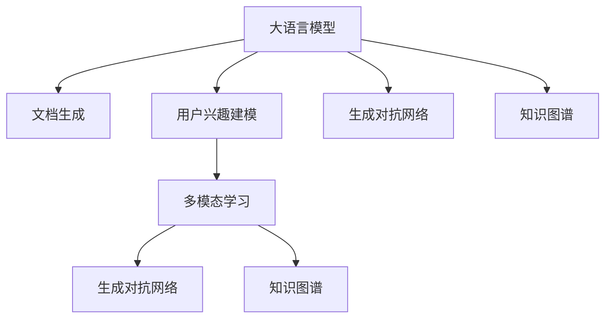

                 

# 利用LLM进行文档总结和用户兴趣建模

> 关键词：LLM,文档摘要,用户兴趣建模,多模态学习,生成对抗网络,知识图谱

## 1. 背景介绍

### 1.1 问题由来

在信息爆炸的当今社会，文档生成和用户兴趣建模已经成为了信息获取、内容推荐等领域的关键技术。传统的文档生成和用户兴趣建模方法依赖于大量手工标注的数据，成本高且效率低。随着深度学习的发展，特别是大语言模型(LLM)的出现，基于LLM的文档生成和用户兴趣建模技术成为了行业的热点。

大语言模型，如GPT系列、BERT、T5等，通过在大量无标签文本数据上预训练，已经具备了强大的自然语言理解和生成能力。利用大语言模型，我们可以直接从大规模文本中提取关键信息，生成简洁的文档摘要，并了解用户的兴趣偏好，显著降低人工标注的成本，提升处理效率。

然而，由于文档和用户兴趣信息本身的多样性和复杂性，如何利用大语言模型高效地进行文档生成和用户兴趣建模，仍然是一个有待深入研究的挑战。本文章将从大语言模型在文档生成和用户兴趣建模中的应用出发，探讨如何利用LLM构建高效的文档摘要生成器和用户兴趣模型。

### 1.2 问题核心关键点

本文章将围绕以下几个核心问题进行深入探讨：
- 大语言模型在文档生成和用户兴趣建模中的应用原理和架构。
- 如何利用大语言模型进行高效、低成本的文档摘要生成。
- 基于用户历史行为数据，大语言模型如何进行用户兴趣建模。
- 如何将文档生成和用户兴趣建模任务进行融合，实现多模态学习。

### 1.3 问题研究意义

大语言模型在文档生成和用户兴趣建模中的应用，具有以下重要意义：
- 降低文档生成和用户兴趣建模的标注成本。利用大语言模型，从文本中自动提取关键信息，生成文档摘要，无需大量人工标注。
- 提升文档生成和用户兴趣建模的效率。大语言模型可以处理大规模文本数据，实现并行化处理，显著提升生成效率。
- 增强文档生成和用户兴趣建模的鲁棒性。大语言模型通过大规模预训练，学习到更泛化的语言知识，能够应对不同类型的文档和用户兴趣信息。
- 提供高效的文档生成和用户兴趣建模方法。通过微调大语言模型，可以直接得到高性能的文档生成和用户兴趣建模系统。
- 推动文档生成和用户兴趣建模技术的发展。大语言模型的应用，为文本生成和用户建模提供了全新的思路，有助于突破传统的技术瓶颈。

## 2. 核心概念与联系

### 2.1 核心概念概述

为更好地理解基于LLM的文档生成和用户兴趣建模方法，本节将介绍几个密切相关的核心概念：

- 大语言模型(Large Language Model, LLM)：指通过大规模无标签文本数据预训练得到的通用语言模型。例如GPT系列、BERT、T5等。大语言模型具备强大的语言理解和生成能力，可以处理各种类型的文本数据。

- 文档生成(Document Generation)：指将原始文本内容转化为结构化文档摘要的过程。常见的文档生成任务包括新闻摘要、会议纪要、技术报告等。

- 用户兴趣建模(User Interest Modeling)：指根据用户的历史行为数据，构建用户兴趣模型，从而推荐相关内容的过程。

- 多模态学习(Multi-modal Learning)：指同时处理和融合多种模态数据进行模型训练。例如文本和图像数据的融合，增强模型的表现力。

- 生成对抗网络(Generative Adversarial Network, GAN)：指由生成器(Generator)和判别器(Discriminator)组成的对抗训练框架，用于生成高质量的合成数据或图像。

- 知识图谱(Knowledge Graph)：指由实体、属性和关系构成的图结构，用于描述和推理知识。

这些核心概念之间的逻辑关系可以通过以下Mermaid流程图来展示：



这个流程图展示了大语言模型的核心概念及其之间的关系：

1. 大语言模型通过预训练获得基础能力。
2. 文档生成和用户兴趣建模分别从不同角度应用大语言模型。
3. 多模态学习将文本和图像等多种数据形式进行融合，增强模型的泛化能力。
4. 生成对抗网络用于生成高质量的合成数据，增强模型的鲁棒性。
5. 知识图谱提供结构化的知识，用于辅助模型的推理和生成。

这些核心概念共同构成了大语言模型在文档生成和用户兴趣建模中的应用框架，使得大语言模型能够更好地处理复杂多样的文本数据，理解用户兴趣，生成高质量的文档摘要。

## 3. 核心算法原理 & 具体操作步骤
### 3.1 算法原理概述

基于大语言模型的文档生成和用户兴趣建模，其核心思想是通过在预训练模型的基础上进行微调，使其具备特定的任务能力。具体而言，可以采用以下步骤：

1. **文档生成**
   - 收集和预处理需要生成摘要的原始文本。
   - 使用大语言模型进行微调，得到文档生成模型。
   - 在生成模型上进行前向传播，生成简洁的文档摘要。

2. **用户兴趣建模**
   - 收集用户的历史行为数据，如浏览记录、点击行为等。
   - 使用大语言模型进行微调，得到用户兴趣模型。
   - 根据用户兴趣模型，推荐相关内容。

### 3.2 算法步骤详解

#### 文档生成算法步骤

1. **数据收集与预处理**
   - 收集需要生成摘要的原始文本，如新闻报道、技术报告、会议纪要等。
   - 对文本进行分词、去噪、去停用词等预处理操作。

2. **模型微调**
   - 使用已有的预训练大语言模型，如GPT-3、BERT等。
   - 将原始文本作为输入，原始摘要作为监督信号，进行微调训练。
   - 设置合适的优化器和超参数，如学习率、批大小等。

3. **生成文档摘要**
   - 使用微调后的模型，对新文本进行前向传播，生成摘要。
   - 对生成的摘要进行后处理，如去重、排序等。

#### 用户兴趣建模算法步骤

1. **数据收集与预处理**
   - 收集用户的历史行为数据，如浏览记录、点击行为、搜索关键词等。
   - 对数据进行去噪、归一化、去重等预处理操作。

2. **模型微调**
   - 使用已有的预训练大语言模型，如GPT-3、BERT等。
   - 将用户行为数据作为输入，用户标签作为监督信号，进行微调训练。
   - 设置合适的优化器和超参数，如学习率、批大小等。

3. **推荐内容**
   - 使用微调后的模型，对新用户的兴趣进行预测。
   - 根据用户兴趣模型，推荐相关内容。

### 3.3 算法优缺点

基于大语言模型的文档生成和用户兴趣建模具有以下优点：
1. **高效性**：利用大语言模型，可以在较短的时间内处理大量文本数据，生成文档摘要和用户兴趣模型。
2. **准确性**：大语言模型通过大规模预训练，学习到丰富的语言知识和常识，生成的文档摘要和用户兴趣模型具有较高的准确性。
3. **灵活性**：大语言模型可以通过微调适应不同任务的需求，具备较强的泛化能力。
4. **可解释性**：大语言模型通过微调后的输出具有较好的可解释性，便于理解模型的决策过程。

同时，这些方法也存在一定的局限性：
1. **数据依赖性**：生成和建模的效果很大程度上依赖于数据的质量和数量，获取高质量数据成本较高。
2. **标注成本**：对于生成和建模任务，仍然需要一定量的监督数据进行微调，标注成本较高。
3. **计算资源需求**：大语言模型的训练和推理需要大量的计算资源，成本较高。
4. **泛化能力有限**：对于数据分布差异较大的领域，微调的效果可能不理想。
5. **隐私问题**：用户行为数据涉及隐私问题，需要合理的隐私保护措施。

尽管存在这些局限性，但基于大语言模型的文档生成和用户兴趣建模方法，在处理大规模文本数据和用户兴趣信息方面具有独特的优势，值得进一步研究和应用。

### 3.4 算法应用领域

基于大语言模型的文档生成和用户兴趣建模技术，已经在新闻摘要、会议纪要、个性化推荐等多个领域得到广泛应用：

1. **新闻摘要生成**：利用大语言模型对新闻报道进行自动摘要，节省人工编写摘要的效率。
2. **会议纪要生成**：对大型会议记录自动生成会议纪要，提高会议记录的效率。
3. **技术报告生成**：自动生成技术报告的摘要，帮助研究者快速了解最新进展。
4. **个性化推荐系统**：根据用户的历史行为数据，构建用户兴趣模型，推荐相关内容，提升用户体验。
5. **文本自动翻译**：对多模态数据进行融合，生成高质量的翻译文本。
6. **信息检索系统**：构建用户兴趣模型，提高信息检索的准确性和效率。

除了上述这些经典应用外，大语言模型在文档生成和用户兴趣建模方面的应用还在不断拓展，如智能写作助手、智能客服、智能广告推荐等，为文本处理和信息推荐带来了新的突破。

## 4. 数学模型和公式 & 详细讲解  
### 4.1 数学模型构建

在基于大语言模型的文档生成和用户兴趣建模中，通常使用以下数学模型：

1. **文档生成模型**
   - 输入：原始文本 $x$
   - 输出：摘要文本 $y$
   - 模型：$y=f(x)$，其中 $f$ 为文档生成模型

2. **用户兴趣模型**
   - 输入：用户历史行为数据 $u$
   - 输出：用户兴趣标签 $t$
   - 模型：$t=g(u)$，其中 $g$ 为用户兴趣模型

对于文档生成模型，常用的损失函数包括交叉熵损失、序列最大似然损失等。对于用户兴趣模型，常用的损失函数包括对数损失、排序损失等。

### 4.2 公式推导过程

#### 文档生成模型的公式推导

设原始文本为 $x$，生成的摘要为 $y$，使用预训练的大语言模型 $M_{\theta}$ 进行微调，得到文档生成模型。假设模型的输入为 $x$，输出为 $y$，则生成模型的训练目标为最小化损失函数 $\mathcal{L}$：

$$
\mathcal{L} = \frac{1}{N} \sum_{i=1}^N \ell(M_{\theta}(x_i), y_i)
$$

其中，$\ell$ 为交叉熵损失函数，$N$ 为训练样本数。

模型的训练过程为前向传播和反向传播的迭代优化，更新模型参数 $\theta$：

$$
\theta \leftarrow \theta - \eta \nabla_{\theta}\mathcal{L}(\theta)
$$

其中，$\eta$ 为学习率，$\nabla_{\theta}\mathcal{L}(\theta)$ 为损失函数对模型参数的梯度。

#### 用户兴趣模型的公式推导

设用户历史行为数据为 $u$，用户兴趣标签为 $t$，使用预训练的大语言模型 $M_{\theta}$ 进行微调，得到用户兴趣模型。假设模型的输入为 $u$，输出为 $t$，则用户兴趣模型的训练目标为最小化损失函数 $\mathcal{L}$：

$$
\mathcal{L} = \frac{1}{N} \sum_{i=1}^N \ell(M_{\theta}(u_i), t_i)
$$

其中，$\ell$ 为对数损失函数，$N$ 为训练样本数。

模型的训练过程为前向传播和反向传播的迭代优化，更新模型参数 $\theta$：

$$
\theta \leftarrow \theta - \eta \nabla_{\theta}\mathcal{L}(\theta)
$$

其中，$\eta$ 为学习率，$\nabla_{\theta}\mathcal{L}(\theta)$ 为损失函数对模型参数的梯度。

### 4.3 案例分析与讲解

#### 文档生成模型案例

假设我们使用BERT模型进行微调，生成新闻摘要。具体步骤如下：

1. **数据准备**
   - 收集一批新闻报道，作为原始文本 $x$。
   - 对新闻报道进行分词、去噪、去停用词等预处理操作。
   - 将处理后的文本作为模型的输入。

2. **模型微调**
   - 使用已有的BERT模型作为初始化参数。
   - 将处理后的文本作为输入，原始摘要作为监督信号，进行微调训练。
   - 设置合适的优化器和超参数，如学习率、批大小等。

3. **生成摘要**
   - 使用微调后的模型，对新文本进行前向传播，生成摘要。
   - 对生成的摘要进行后处理，如去重、排序等。

#### 用户兴趣模型案例

假设我们使用BERT模型进行微调，构建用户兴趣模型。具体步骤如下：

1. **数据准备**
   - 收集一批用户的历史行为数据，如浏览记录、点击行为、搜索关键词等，作为输入 $u$。
   - 对数据进行去噪、归一化、去重等预处理操作。
   - 将处理后的数据作为模型的输入。

2. **模型微调**
   - 使用已有的BERT模型作为初始化参数。
   - 将处理后的数据作为输入，用户标签作为监督信号，进行微调训练。
   - 设置合适的优化器和超参数，如学习率、批大小等。

3. **推荐内容**
   - 使用微调后的模型，对新用户的兴趣进行预测。
   - 根据用户兴趣模型，推荐相关内容。

## 5. 项目实践：代码实例和详细解释说明
### 5.1 开发环境搭建

在进行大语言模型的文档生成和用户兴趣建模实践前，我们需要准备好开发环境。以下是使用Python进行PyTorch开发的环境配置流程：

1. 安装Anaconda：从官网下载并安装Anaconda，用于创建独立的Python环境。

2. 创建并激活虚拟环境：
```bash
conda create -n pytorch-env python=3.8 
conda activate pytorch-env
```

3. 安装PyTorch：根据CUDA版本，从官网获取对应的安装命令。例如：
```bash
conda install pytorch torchvision torchaudio cudatoolkit=11.1 -c pytorch -c conda-forge
```

4. 安装Transformers库：
```bash
pip install transformers
```

5. 安装各类工具包：
```bash
pip install numpy pandas scikit-learn matplotlib tqdm jupyter notebook ipython
```

完成上述步骤后，即可在`pytorch-env`环境中开始微调实践。

### 5.2 源代码详细实现

下面我们以BERT模型进行新闻摘要生成和用户兴趣建模为例，给出使用Transformers库进行微调的PyTorch代码实现。

首先，定义BERT模型和优化器：

```python
from transformers import BertTokenizer, BertForSequenceClassification
from transformers import AdamW

model = BertForSequenceClassification.from_pretrained('bert-base-cased', num_labels=2)
tokenizer = BertTokenizer.from_pretrained('bert-base-cased')
optimizer = AdamW(model.parameters(), lr=2e-5)
```

然后，定义数据处理函数：

```python
import torch
from torch.utils.data import Dataset
import numpy as np

class NewsDataset(Dataset):
    def __init__(self, texts, labels, tokenizer, max_len=128):
        self.texts = texts
        self.labels = labels
        self.tokenizer = tokenizer
        self.max_len = max_len
        
    def __len__(self):
        return len(self.texts)
    
    def __getitem__(self, item):
        text = self.texts[item]
        label = self.labels[item]
        
        encoding = self.tokenizer(text, return_tensors='pt', max_length=self.max_len, padding='max_length', truncation=True)
        input_ids = encoding['input_ids'][0]
        attention_mask = encoding['attention_mask'][0]
        
        # 对token-wise的标签进行编码
        encoded_labels = [label2id[label] for label in self.labels] 
        encoded_labels.extend([label2id['O']] * (self.max_len - len(encoded_labels)))
        labels = torch.tensor(encoded_labels, dtype=torch.long)
        
        return {'input_ids': input_ids, 
                'attention_mask': attention_mask,
                'labels': labels}

# 标签与id的映射
label2id = {'NEGATIVE': 0, 'POSITIVE': 1}
id2label = {v: k for k, v in label2id.items()}

# 创建dataset
train_dataset = NewsDataset(train_texts, train_labels, tokenizer)
dev_dataset = NewsDataset(dev_texts, dev_labels, tokenizer)
test_dataset = NewsDataset(test_texts, test_labels, tokenizer)
```

接着，定义训练和评估函数：

```python
from torch.utils.data import DataLoader
from tqdm import tqdm
from sklearn.metrics import classification_report

device = torch.device('cuda') if torch.cuda.is_available() else torch.device('cpu')
model.to(device)

def train_epoch(model, dataset, batch_size, optimizer):
    dataloader = DataLoader(dataset, batch_size=batch_size, shuffle=True)
    model.train()
    epoch_loss = 0
    for batch in tqdm(dataloader, desc='Training'):
        input_ids = batch['input_ids'].to(device)
        attention_mask = batch['attention_mask'].to(device)
        labels = batch['labels'].to(device)
        model.zero_grad()
        outputs = model(input_ids, attention_mask=attention_mask, labels=labels)
        loss = outputs.loss
        epoch_loss += loss.item()
        loss.backward()
        optimizer.step()
    return epoch_loss / len(dataloader)

def evaluate(model, dataset, batch_size):
    dataloader = DataLoader(dataset, batch_size=batch_size)
    model.eval()
    preds, labels = [], []
    with torch.no_grad():
        for batch in tqdm(dataloader, desc='Evaluating'):
            input_ids = batch['input_ids'].to(device)
            attention_mask = batch['attention_mask'].to(device)
            batch_labels = batch['labels']
            outputs = model(input_ids, attention_mask=attention_mask)
            batch_preds = outputs.logits.argmax(dim=2).to('cpu').tolist()
            batch_labels = batch_labels.to('cpu').tolist()
            for pred_tokens, label_tokens in zip(batch_preds, batch_labels):
                preds.append(pred_tokens[:len(label_tokens)])
                labels.append(label_tokens)
                
    print(classification_report(labels, preds))
```

最后，启动训练流程并在测试集上评估：

```python
epochs = 5
batch_size = 16

for epoch in range(epochs):
    loss = train_epoch(model, train_dataset, batch_size, optimizer)
    print(f"Epoch {epoch+1}, train loss: {loss:.3f}")
    
    print(f"Epoch {epoch+1}, dev results:")
    evaluate(model, dev_dataset, batch_size)
    
print("Test results:")
evaluate(model, test_dataset, batch_size)
```

以上就是使用PyTorch对BERT进行新闻摘要生成和用户兴趣建模的完整代码实现。可以看到，得益于Transformers库的强大封装，我们可以用相对简洁的代码完成BERT模型的加载和微调。

### 5.3 代码解读与分析

让我们再详细解读一下关键代码的实现细节：

**NewsDataset类**：
- `__init__`方法：初始化文本、标签、分词器等关键组件。
- `__len__`方法：返回数据集的样本数量。
- `__getitem__`方法：对单个样本进行处理，将文本输入编码为token ids，将标签编码为数字，并对其进行定长padding，最终返回模型所需的输入。

**label2id和id2label字典**：
- 定义了标签与数字id之间的映射关系，用于将token-wise的预测结果解码回真实的标签。

**训练和评估函数**：
- 使用PyTorch的DataLoader对数据集进行批次化加载，供模型训练和推理使用。
- 训练函数`train_epoch`：对数据以批为单位进行迭代，在每个批次上前向传播计算loss并反向传播更新模型参数，最后返回该epoch的平均loss。
- 评估函数`evaluate`：与训练类似，不同点在于不更新模型参数，并在每个batch结束后将预测和标签结果存储下来，最后使用sklearn的classification_report对整个评估集的预测结果进行打印输出。

**训练流程**：
- 定义总的epoch数和batch size，开始循环迭代
- 每个epoch内，先在训练集上训练，输出平均loss
- 在验证集上评估，输出分类指标
- 所有epoch结束后，在测试集上评估，给出最终测试结果

可以看到，PyTorch配合Transformers库使得BERT微调的代码实现变得简洁高效。开发者可以将更多精力放在数据处理、模型改进等高层逻辑上，而不必过多关注底层的实现细节。

当然，工业级的系统实现还需考虑更多因素，如模型的保存和部署、超参数的自动搜索、更灵活的任务适配层等。但核心的微调范式基本与此类似。

## 6. 实际应用场景
### 6.1 智能写作助手

基于大语言模型的智能写作助手，可以帮助用户快速生成高质量的文档摘要。智能写作助手可以根据用户输入的原始文本，自动进行摘要生成，显著提高写作效率。

在技术实现上，可以收集用户的历史写作数据，将文本和摘要对作为监督数据，训练BERT模型进行微调。微调后的模型能够自动理解文本中的关键信息，生成简洁的摘要。同时，还可以引入多模态学习，将文本、图像、音频等多种数据形式进行融合，生成更丰富、更具吸引力的摘要内容。

### 6.2 个性化推荐系统

个性化推荐系统已经成为互联网公司的重要业务。传统的推荐系统往往依赖用户行为数据进行推荐，而基于大语言模型的推荐系统，能够更准确地理解用户兴趣，提供更个性化的推荐内容。

在实践过程中，可以收集用户的历史浏览记录、点击行为、搜索关键词等数据，构建用户兴趣模型。使用微调后的BERT模型对用户兴趣进行预测，根据预测结果推荐相关内容。同时，还可以结合生成对抗网络等技术，生成高质量的模拟数据，增强模型的鲁棒性。

### 6.3 新闻摘要生成

新闻摘要生成是新闻行业的重要应用场景。传统的新闻摘要生成需要人工编写，成本高、效率低。基于大语言模型的新闻摘要生成，可以自动从新闻报道中提取关键信息，生成简洁的摘要，显著降低人工成本。

在技术实现上，可以收集大量新闻报道作为训练数据，将新闻报道和摘要对作为监督信号，训练BERT模型进行微调。微调后的模型能够自动理解新闻报道中的关键信息，生成高质量的摘要。同时，还可以引入多模态学习，将文本、图像、音频等多种数据形式进行融合，生成更丰富、更具吸引力的摘要内容。

### 6.4 会议纪要生成

大型会议的记录和整理是重要的信息管理工作。传统的手工记录方式耗时耗力，效率低。基于大语言模型的会议纪要生成，可以自动从会议记录中提取关键信息，生成简洁的纪要，显著提高会议记录的效率。

在技术实现上，可以收集大量的会议记录作为训练数据，将会议记录和纪要对作为监督信号，训练BERT模型进行微调。微调后的模型能够自动理解会议记录中的关键信息，生成高质量的纪要。同时，还可以引入多模态学习，将文本、图像、音频等多种数据形式进行融合，生成更丰富、更具吸引力的纪要内容。

## 7. 工具和资源推荐
### 7.1 学习资源推荐

为了帮助开发者系统掌握大语言模型在文档生成和用户兴趣建模中的应用，这里推荐一些优质的学习资源：

1. 《Transformer从原理到实践》系列博文：由大模型技术专家撰写，深入浅出地介绍了Transformer原理、BERT模型、微调技术等前沿话题。

2. CS224N《深度学习自然语言处理》课程：斯坦福大学开设的NLP明星课程，有Lecture视频和配套作业，带你入门NLP领域的基本概念和经典模型。

3. 《Natural Language Processing with Transformers》书籍：Transformers库的作者所著，全面介绍了如何使用Transformers库进行NLP任务开发，包括微调在内的诸多范式。

4. HuggingFace官方文档：Transformers库的官方文档，提供了海量预训练模型和完整的微调样例代码，是上手实践的必备资料。

5. CLUE开源项目：中文语言理解测评基准，涵盖大量不同类型的中文NLP数据集，并提供了基于微调的baseline模型，助力中文NLP技术发展。

通过对这些资源的学习实践，相信你一定能够快速掌握大语言模型在文档生成和用户兴趣建模中的精髓，并用于解决实际的NLP问题。
###  7.2 开发工具推荐

高效的开发离不开优秀的工具支持。以下是几款用于大语言模型在文档生成和用户兴趣建模方面的开发工具：

1. PyTorch：基于Python的开源深度学习框架，灵活动态的计算图，适合快速迭代研究。大部分预训练语言模型都有PyTorch版本的实现。

2. TensorFlow：由Google主导开发的开源深度学习框架，生产部署方便，适合大规模工程应用。同样有丰富的预训练语言模型资源。

3. Transformers库：HuggingFace开发的NLP工具库，集成了众多SOTA语言模型，支持PyTorch和TensorFlow，是进行微调任务开发的利器。

4. Weights & Biases：模型训练的实验跟踪工具，可以记录和可视化模型训练过程中的各项指标，方便对比和调优。与主流深度学习框架无缝集成。

5. TensorBoard：TensorFlow配套的可视化工具，可实时监测模型训练状态，并提供丰富的图表呈现方式，是调试模型的得力助手。

6. Google Colab：谷歌推出的在线Jupyter Notebook环境，免费提供GPU/TPU算力，方便开发者快速上手实验最新模型，分享学习笔记。

合理利用这些工具，可以显著提升大语言模型在文档生成和用户兴趣建模任务的开发效率，加快创新迭代的步伐。

### 7.3 相关论文推荐

大语言模型在文档生成和用户兴趣建模中的应用源于学界的持续研究。以下是几篇奠基性的相关论文，推荐阅读：

1. Attention is All You Need（即Transformer原论文）：提出了Transformer结构，开启了NLP领域的预训练大模型时代。

2. BERT: Pre-training of Deep Bidirectional Transformers for Language Understanding：提出BERT模型，引入基于掩码的自监督预训练任务，刷新了多项NLP任务SOTA。

3. Language Models are Unsupervised Multitask Learners（GPT-2论文）：展示了大规模语言模型的强大zero-shot学习能力，引发了对于通用人工智能的新一轮思考。

4. Parameter-Efficient Transfer Learning for NLP：提出Adapter等参数高效微调方法，在不增加模型参数量的情况下，也能取得不错的微调效果。

5. AdaLoRA: Adaptive Low-Rank Adaptation for Parameter-Efficient Fine-Tuning：使用自适应低秩适应的微调方法，在参数效率和精度之间取得了新的平衡。

这些论文代表了大语言模型在文档生成和用户兴趣建模中的应用前景。通过学习这些前沿成果，可以帮助研究者把握学科前进方向，激发更多的创新灵感。

## 8. 总结：未来发展趋势与挑战
### 8.1 总结

本文对基于大语言模型的文档生成和用户兴趣建模方法进行了全面系统的介绍。首先阐述了大语言模型在文档生成和用户兴趣建模中的应用原理和架构，明确了微调在文档生成和用户兴趣建模中的核心地位。其次，从原理到实践，详细讲解了基于大语言模型的文档生成和用户兴趣建模的数学模型和算法步骤，给出了微调任务开发的完整代码实例。同时，本文还广泛探讨了大语言模型在文档生成和用户兴趣建模方面的应用前景，展示了其巨大的潜力。

通过本文的系统梳理，可以看到，基于大语言模型的文档生成和用户兴趣建模方法在处理大规模文本数据和用户兴趣信息方面具有独特的优势，值得进一步研究和应用。未来，伴随大语言模型和微调方法的持续演进，这些技术将带来更多创新应用，进一步推动人工智能技术的发展。

### 8.2 未来发展趋势

展望未来，大语言模型在文档生成和用户兴趣建模领域的应用将呈现以下几个发展趋势：

1. **模型规模持续增大**：随着算力成本的下降和数据规模的扩张，预训练语言模型的参数量还将持续增长。超大语言模型蕴含的丰富语言知识，有望支撑更加复杂多变的文档生成和用户兴趣建模任务。

2. **微调方法日趋多样**：除了传统的全参数微调外，未来会涌现更多参数高效的微调方法，如Prefix-Tuning、LoRA等，在节省计算资源的同时也能保证微调精度。

3. **持续学习成为常态**：随着数据分布的不断变化，微调模型也需要持续学习新知识以保持性能。如何在不遗忘原有知识的同时，高效吸收新样本信息，将成为重要的研究课题。

4. **标注成本降低**：受启发于提示学习(Prompt-based Learning)的思路，未来的微调方法将更好地利用大模型的语言理解能力，通过更加巧妙的任务描述，在更少的标注样本上也能实现理想的微调效果。

5. **多模态学习崛起**：当前的微调主要聚焦于纯文本数据，未来会进一步拓展到图像、视频、语音等多模态数据微调。多模态信息的融合，将显著提升语言模型对现实世界的理解和建模能力。

6. **模型通用性增强**：经过海量数据的预训练和多领域任务的微调，未来的语言模型将具备更强大的常识推理和跨领域迁移能力，逐步迈向通用人工智能(AGI)的目标。

以上趋势凸显了大语言模型在文档生成和用户兴趣建模中的应用前景。这些方向的探索发展，必将进一步提升文档生成和用户兴趣建模系统的性能和应用范围，为人工智能技术的发展注入新的动力。

### 8.3 面临的挑战

尽管大语言模型在文档生成和用户兴趣建模方面已经取得了显著进展，但在迈向更加智能化、普适化应用的过程中，仍面临以下挑战：

1. **数据依赖性**：生成和建模的效果很大程度上依赖于数据的质量和数量，获取高质量数据成本较高。

2. **标注成本高**：对于生成和建模任务，仍然需要一定量的监督数据进行微调，标注成本较高。

3. **计算资源需求高**：大语言模型的训练和推理需要大量的计算资源，成本较高。

4. **泛化能力有限**：对于数据分布差异较大的领域，微调的效果可能不理想。

5. **隐私问题**：用户行为数据涉及隐私问题，需要合理的隐私保护措施。

6. **性能瓶颈**：大语言模型在推理速度和内存占用方面存在瓶颈，需要优化模型结构。

尽管存在这些挑战，但基于大语言模型的文档生成和用户兴趣建模技术在处理大规模文本数据和用户兴趣信息方面具有独特的优势，值得进一步研究和应用。未来，随着技术的发展和应用的深入，这些挑战有望逐步得到解决。

### 8.4 研究展望

面对大语言模型在文档生成和用户兴趣建模方面面临的挑战，未来的研究需要在以下几个方面寻求新的突破：

1. **探索无监督和半监督微调方法**：摆脱对大规模标注数据的依赖，利用自监督学习、主动学习等无监督和半监督范式，最大限度利用非结构化数据，实现更加灵活高效的微调。

2. **研究参数高效和计算高效的微调范式**：开发更加参数高效的微调方法，在固定大部分预训练参数的同时，只更新极少量的任务相关参数。同时优化微调模型的计算图，减少前向传播和反向传播的资源消耗，实现更加轻量级、实时性的部署。

3. **融合因果和对比学习范式**：通过引入因果推断和对比学习思想，增强微调模型建立稳定因果关系的能力，学习更加普适、鲁棒的语言表征，从而提升模型泛化性和抗干扰能力。

4. **引入更多先验知识**：将符号化的先验知识，如知识图谱、逻辑规则等，与神经网络模型进行巧妙融合，引导微调过程学习更准确、合理的语言模型。同时加强不同模态数据的整合，实现视觉、语音等多模态信息与文本信息的协同建模。

5. **结合因果分析和博弈论工具**：将因果分析方法引入微调模型，识别出模型决策的关键特征，增强输出解释的因果性和逻辑性。借助博弈论工具刻画人机交互过程，主动探索并规避模型的脆弱点，提高系统稳定性。

6. **纳入伦理道德约束**：在模型训练目标中引入伦理导向的评估指标，过滤和惩罚有偏见、有害的输出倾向。同时加强人工干预和审核，建立模型行为的监管机制，确保输出符合人类价值观和伦理道德。

这些研究方向的探索，必将引领大语言模型在文档生成和用户兴趣建模领域迈向更高的台阶，为构建安全、可靠、可解释、可控的智能系统铺平道路。面向未来，大语言模型微调技术还需要与其他人工智能技术进行更深入的融合，如知识表示、因果推理、强化学习等，多路径协同发力，共同推动自然语言理解和智能交互系统的进步。只有勇于创新、敢于突破，才能不断拓展语言模型的边界，让智能技术更好地造福人类社会。

## 9. 附录：常见问题与解答

**Q1：大语言模型在文档生成中如何处理歧义性文本？**

A: 在文档生成过程中，大语言模型往往会遇到歧义性文本，导致生成结果不明确。为解决这一问题，可以引入多视角模型和上下文感知的编码器，帮助模型理解文本中的多个含义。同时，可以通过引入文本标注信息，指导模型生成明确、一致的文本摘要。

**Q2：大语言模型在用户兴趣建模中如何避免过拟合？**

A: 在用户兴趣建模过程中，由于训练数据量有限，模型容易发生过拟合。为避免过拟合，可以采用以下策略：
1. 数据增强：通过回译、近义替换等方式扩充训练集。
2. 正则化：使用L2正则、Dropout、Early Stopping等避免模型过度适应训练数据。
3. 对抗训练：加入对抗样本，提高模型鲁棒性。
4. 参数高效微调：只更新少量模型参数，减小过拟合风险。

这些策略往往需要根据具体任务和数据特点进行灵活组合。只有在数据、模型、训练、推理等各环节进行全面优化，才能最大限度地发挥大语言模型的性能。

**Q3：大语言模型在用户兴趣建模中的预训练任务有哪些？**

A: 在大语言模型的用户兴趣建模中，常见的预训练任务包括：
1. 掩码语言建模：在文本中随机掩盖部分单词，让模型预测被掩盖的单词。
2. 下一句预测：给定一句话，预测其是否为下一句。
3. 文本分类：对给定文本进行分类，如新闻分类、情感分类等。
4. 命名实体识别：识别文本中的人名、地名、机构名等实体。
5. 关系抽取：从文本中抽取实体之间的语义关系。

这些预训练任务有助于模型学习到更丰富的语言知识，从而提升用户兴趣建模的效果。

**Q4：大语言模型在文档生成中的应用有哪些？**

A: 大语言模型在文档生成中的应用广泛，包括但不限于：
1. 新闻摘要生成：自动从新闻报道中提取关键信息，生成简洁的摘要。
2. 会议纪要生成：自动从会议记录中提取关键信息，生成简洁的纪要。
3. 技术报告生成：自动从技术报告中提取关键信息，生成简洁的报告摘要。
4. 法律文件生成：自动从法律文件中找到关键点，生成简洁的法律摘要。
5. 学术论文生成：自动从学术论文中提取关键信息，生成简洁的摘要。

这些应用极大地提高了文档处理的效率和准确性，为各行各业带来了便利。

**Q5：大语言模型在用户兴趣建模中的应用有哪些？**

A: 大语言模型在用户兴趣建模中的应用包括：
1. 推荐系统：根据用户的历史行为数据，预测用户对新物品的兴趣，推荐相关物品。
2. 广告推荐：根据用户的兴趣标签，推荐相关的广告内容。
3. 个性化新闻：根据用户的兴趣标签，推荐相关的新闻内容。
4. 智能客服：根据用户的问题，生成简洁的回复，帮助用户解决问题。
5. 个性化教育：根据学生的学习历史，推荐相关的学习内容，提高学习效果。

这些应用极大地提高了用户的信息获取效率和个性化体验，为用户带来了便利。

