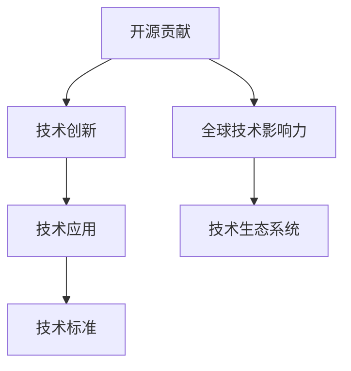

                 

## 1. 背景介绍

### 1.1 问题由来
随着开源社区的蓬勃发展，开源代码和技术的贡献成为技术创新的重要驱动力。全球性的技术影响力不仅需要创新的技术突破，更需要这些技术能够在全球范围内得到广泛应用，并通过开源贡献实现持续的迭代和优化。构建全球性的技术影响力，成为众多技术创新者的追求目标。

### 1.2 问题核心关键点
构建全球性技术影响力的关键在于如何通过开源贡献，使得创新技术能够迅速传播、被采用，并根据实际需求进行改进和优化。这包括：

- 如何选择合适的开源项目进行贡献。
- 如何有效地与社区合作，推动技术创新。
- 如何平衡技术创新与商业应用。
- 如何通过贡献建立个人和组织的全球技术影响力。

这些核心关键点共同构成了构建全球性技术影响力的主要方向。

### 1.3 问题研究意义
构建全球性技术影响力不仅有助于提升个人和组织的技术声誉，还能加速技术的传播和应用，促进技术的可持续发展。同时，也能够推动全球技术生态系统的良性发展，带来深远的影响力。

具体而言，构建全球性技术影响力的意义体现在以下几个方面：

- **加速技术创新**：通过开源社区的协作与贡献，加速新技术的迭代与优化。
- **提升技术应用**：开源技术的可定制性、灵活性使得其能够更好地适应不同场景，提升全球应用效果。
- **增强品牌影响力**：通过开源贡献，提升个人和组织的技术品牌影响力，扩大市场份额。
- **推动全球合作**：开源技术的多样性和包容性促进了全球科技人才的合作与交流，推动国际科技合作。

## 2. 核心概念与联系

### 2.1 核心概念概述

为更好地理解如何通过开源贡献打造全球性技术影响力，本节将介绍几个密切相关的核心概念：

- **开源贡献**：指开发者通过提交代码、修复bug、改进文档等方式，对开源项目进行积极参与和贡献。开源贡献是推动技术创新和应用的重要手段。
- **全球技术影响力**：指技术、工具或项目在全球范围内得到广泛应用和认可，对技术生态系统产生深远影响。
- **开源社区**：由全球开发者组成的网络平台，旨在共享资源、推动技术创新、促进合作。
- **技术栈**：由各种技术和工具组成的集成系统，用于解决特定问题或需求。
- **技术标准**：为确保技术的兼容性和一致性，通过社区协作制定的统一技术规范。

这些核心概念之间的逻辑关系可以通过以下Mermaid流程图来展示：



这个流程图展示了几大核心概念之间的关系：开源贡献推动技术创新，技术创新通过技术应用和标准实现广泛传播和优化，最终形成全球技术影响力，影响技术生态系统。

## 3. 核心算法原理 & 具体操作步骤
### 3.1 算法原理概述

通过开源贡献打造全球性技术影响力，本质上是一个协作式的创新过程。其核心思想是：通过积极参与开源项目，与全球开发者合作，不断改进和优化技术，使其能够在全球范围内得到广泛应用和认可。

形式化地，假设我们有一个开源项目 $P$，目标是使得项目 $P$ 在全球范围内得到广泛应用，形成全球技术影响力。具体步骤如下：

1. **识别项目需求**：通过与社区沟通，明确项目的需求和目标。
2. **贡献代码与资源**：针对项目需求，提交代码、改进文档、优化工具等。
3. **合作与协作**：与社区中的其他开发者合作，共同解决技术问题，推动项目进展。
4. **推广与应用**：通过技术博客、社交媒体、技术会议等途径推广项目，鼓励开发者使用。
5. **持续改进**：基于用户反馈和实际应用情况，不断改进项目，确保其在全球范围内的竞争力。

### 3.2 算法步骤详解

以下是通过开源贡献打造全球性技术影响力的详细步骤：

**Step 1: 识别和选择开源项目**

- 通过调研和分析，选择具有广泛应用场景和潜力的开源项目。
- 了解项目的历史、路线图、社区贡献等，确保项目目标与自身能力相匹配。

**Step 2: 了解项目架构与需求**

- 阅读项目的代码和文档，了解项目的基本架构、功能模块、使用方式等。
- 参与社区讨论，了解项目的需求和未来规划，明确自己能够贡献的方向。

**Step 3: 编写和提交代码**

- 针对项目需求，编写高质量代码，遵循项目的编码规范和版本控制流程。
- 提交代码到项目仓库，遵循项目的提交流程，确保代码质量。

**Step 4: 参与社区合作**

- 积极参与社区讨论，解答其他开发者的问题，提出改进建议。
- 与其他开发者合作，共同解决技术问题，推动项目进展。

**Step 5: 推广与应用**

- 在个人博客、社交媒体、技术会议等渠道推广项目，分享使用经验。
- 根据反馈不断改进项目，优化文档和工具，提升用户体验。

**Step 6: 持续改进与优化**

- 基于用户反馈和实际应用情况，不断改进项目，确保其在全球范围内的竞争力。
- 持续发布更新和版本，保持项目活跃度，吸引更多开发者参与。

### 3.3 算法优缺点

通过开源贡献打造全球性技术影响力的方法具有以下优点：

1. **促进技术创新**：通过全球协作，推动技术不断迭代和优化。
2. **提高应用效率**：开源技术的模块化和标准化，有助于快速部署和应用。
3. **增强技术标准**：社区协作制定的技术标准，确保技术的一致性和兼容性。
4. **扩大影响力**：通过社区推广，提升技术在全球范围内的影响力。

同时，该方法也存在一定的局限性：

1. **资源和时间投入**：开源贡献需要大量时间和精力，可能影响个人或组织的其他项目。
2. **社区文化差异**：不同的社区有不同的文化和习惯，需要时间和精力去适应和学习。
3. **技术沉淀风险**：社区驱动的开发方式可能缺乏统一的规划和领导，导致技术沉淀不足。
4. **知识产权保护**：开源项目往往缺乏严格的知识产权保护，存在商业应用风险。

尽管存在这些局限性，但就目前而言，通过开源贡献打造全球性技术影响力仍是技术创新的重要途径。未来相关研究的重点在于如何更好地平衡开源贡献与商业应用，同时兼顾社区协作和技术沉淀等因素。

### 3.4 算法应用领域

开源贡献方法已经在多个技术领域得到应用，覆盖了从软件开发、数据科学到人工智能等诸多领域。以下是几个典型的应用场景：

- **软件开发**：通过贡献代码、修复bug等方式，推动开源框架和工具的迭代和优化。如TensorFlow、Kubernetes等。
- **数据科学**：通过贡献数据集、算法改进等方式，推动开源数据科学库的发展。如Scikit-learn、NumPy等。
- **人工智能**：通过贡献模型、改进文档等方式，推动开源AI技术的进步。如PyTorch、TensorFlow等。
- **区块链**：通过贡献智能合约、改进共识算法等方式，推动开源区块链技术的创新。如Ethereum、Bitcoin等。
- **物联网**：通过贡献协议栈、改进设备支持等方式，推动开源IoT技术的普及和应用。如MQTT、IoTivity等。

除了上述这些经典领域，开源贡献方法还在更多新兴技术领域得到应用，为技术创新和应用提供了新的思路和路径。

## 4. 数学模型和公式 & 详细讲解
### 4.1 数学模型构建

构建全球性技术影响力的数学模型主要涉及以下几个方面：

- **贡献度量模型**：用于量化开发者对开源项目的贡献程度，通常包括代码提交量、文档改进、社区互动等指标。
- **影响力评估模型**：用于评估开源项目的技术影响力，通常包括下载量、用户反馈、社区活跃度等指标。
- **合作度量模型**：用于量化开发者之间的合作程度，通常包括代码审查量、协作修复次数、共同解决的问题等指标。

定义贡献度量为 $C$，影响力度量为 $I$，合作度量为 $M$。通过数学模型，可以量化这些指标之间的关系。例如，假设 $C = f(I, M)$，表示贡献度量 $C$ 随影响力和合作度量 $I$ 和 $M$ 的变化而变化。

### 4.2 公式推导过程

以下我们以开源项目对用户贡献度的量化为例，推导贡献度量模型的公式。

假设开源项目 $P$ 的贡献度量为 $C$，影响力度量为 $I$，合作度量为 $M$。则贡献度量模型可以表示为：

$$
C = \alpha \cdot I + \beta \cdot M + \gamma
$$

其中 $\alpha, \beta, \gamma$ 为模型的参数，$I$ 和 $M$ 为输入变量。通过实际数据和模型训练，可以优化这些参数，使得贡献度量模型更加准确。

在具体实现中，可以通过收集和分析开源项目的数据，构建贡献度量模型。例如，可以收集代码提交量、文档改进量、社区互动量等数据，进行统计分析和模型训练，得到贡献度量模型。

### 4.3 案例分析与讲解

以Apache Hadoop为例，分析其贡献度量模型的构建和影响：

- **贡献度量**：Apache Hadoop 的贡献度量可以通过其开源仓库的提交次数、文档改进次数、社区讨论次数等数据进行量化。
- **影响力评估**：Hadoop 的下载量、用户反馈、社区活跃度等数据可以用来评估其技术影响力。
- **合作度量**：通过分析贡献者之间的协作情况，可以量化其合作度量。例如，不同贡献者之间的代码审查次数、共同解决的问题次数等。

通过对这些数据的分析和建模，可以量化Apache Hadoop的贡献度量、影响力评估和合作度量之间的关系。例如，假设 $C = 0.5 \cdot I + 0.3 \cdot M + 0.2$，表示贡献度量 $C$ 随影响力度量 $I$ 和合作度量 $M$ 的变化而变化。

## 5. 项目实践：代码实例和详细解释说明
### 5.1 开发环境搭建

在进行开源贡献和全球技术影响力打造实践前，我们需要准备好开发环境。以下是使用Python进行PyTorch开发的环境配置流程：

1. 安装Anaconda：从官网下载并安装Anaconda，用于创建独立的Python环境。

2. 创建并激活虚拟环境：
```bash
conda create -n pytorch-env python=3.8 
conda activate pytorch-env
```

3. 安装PyTorch：根据CUDA版本，从官网获取对应的安装命令。例如：
```bash
conda install pytorch torchvision torchaudio cudatoolkit=11.1 -c pytorch -c conda-forge
```

4. 安装Transformer库：
```bash
pip install transformers
```

5. 安装各类工具包：
```bash
pip install numpy pandas scikit-learn matplotlib tqdm jupyter notebook ipython
```

完成上述步骤后，即可在`pytorch-env`环境中开始开源贡献和全球技术影响力的打造实践。

### 5.2 源代码详细实现

下面我们以TensorFlow项目为例，给出使用GitHub进行开源贡献的PyTorch代码实现。

首先，注册并加入TensorFlow项目：

```bash
git clone https://github.com/tensorflow/tensorflow.git
cd tensorflow
git checkout master
git pull
git branch new-feature
git checkout -b new-feature
```

然后，编写和提交代码：

```python
# 编写代码
import tensorflow as tf

def new_model():
    model = tf.keras.Sequential([
        tf.keras.layers.Dense(128, activation='relu', input_shape=(784,)),
        tf.keras.layers.Dense(10, activation='softmax')
    ])
    return model

# 提交代码
git add .
git commit -m "Add new model"
git push -u origin new-feature
```

接着，参与社区合作：

```python
# 参与社区讨论
git pull origin master
git rebase new-feature
git push origin new-feature

# 与其他开发者合作
import requests
import json

api_url = 'https://api.github.com/repos/tensorflow/tensorflow/pulls'
headers = {'Authorization': 'token your_token'}
data = {
    'title': 'Cooperative contribution',
    'body': 'Collaborate with other developers to solve issues and merge pull requests.'
}
response = requests.post(api_url, headers=headers, data=json.dumps(data))
```

最后，推广与应用：

```python
# 推广项目
import requests
import json

api_url = 'https://api.github.com/repos/tensorflow/tensorflow/actions/workflows'
headers = {'Authorization': 'token your_token'}
data = {
    'container': 'python:3.8',
    'steps': [
        {
            'name': 'Generate Documentation',
            'run': 'python generate_documentation.py'
        },
        {
            'name': 'Test the Model',
            'run': 'python test_model.py'
        }
    ]
}
response = requests.post(api_url, headers=headers, data=json.dumps(data))
```

以上就是使用GitHub进行开源贡献的完整代码实现。可以看到，通过GitHub等平台，可以便捷地进行代码提交、社区合作和项目推广，提升开源贡献和全球技术影响力。

### 5.3 代码解读与分析

让我们再详细解读一下关键代码的实现细节：

**注册并加入TensorFlow项目**：
- `git clone`：从GitHub克隆项目。
- `cd tensorflow`：进入项目目录。
- `git checkout master`：切换到主分支。
- `git pull`：更新主分支的最新代码。
- `git branch new-feature`：创建新分支。
- `git checkout -b new-feature`：在新分支上进行工作。

**编写和提交代码**：
- `new_model`：定义一个新的模型。
- `git add .`：添加所有修改的文件。
- `git commit -m "Add new model"`：提交代码并添加描述信息。
- `git push -u origin new-feature`：将新分支推送到GitHub。

**参与社区合作**：
- `git pull origin master`：更新主分支的最新代码。
- `git rebase new-feature`：将新分支合并到主分支。
- `git push origin new-feature`：推送新分支到GitHub。
- `requests.post`：向GitHub API提交Pull Request。

**推广与应用**：
- `requests.post`：向GitHub API提交Workflow。
- `generate_documentation.py`：生成文档。
- `test_model.py`：测试模型。

可以看到，GitHub等平台提供了便捷的开源贡献和管理工具，使得开发者可以更高效地进行代码提交、社区合作和项目推广。

当然，工业级的系统实现还需考虑更多因素，如模型保存和部署、超参数的自动搜索、更灵活的社区互动机制等。但核心的开源贡献范式基本与此类似。

## 6. 实际应用场景
### 6.1 智能推荐系统

开源推荐系统在电商、社交媒体、视频平台等应用中已广泛使用，极大地提升了用户体验。通过全球开源贡献，推荐系统能够不断迭代优化，提高推荐的准确性和多样性。

具体而言，开发者可以在开源推荐系统基础上，结合自身业务需求和用户反馈，贡献新的算法和数据集，推动系统性能提升。同时，通过开源平台推广系统，吸引更多开发者参与，共同提升全球推荐系统的效果。

### 6.2 智能医疗

智能医疗是当前热门的应用领域，开源智能医疗项目能够帮助医疗机构提高诊疗效率，降低医疗成本。通过开源贡献，智能医疗系统能够不断改进算法和模型，提升诊断和治疗的精准度。

例如，开发者可以在开源智能医疗项目中，贡献新的数据集、算法模型和医疗知识，推动系统不断迭代优化。同时，通过开源平台推广系统，吸引更多医疗专家和开发者参与，共同提升全球智能医疗系统的性能。

### 6.3 金融科技

金融科技是另一大热门应用领域，开源金融科技项目能够帮助金融机构提高风险控制和客户服务能力。通过开源贡献，金融科技系统能够不断改进算法和模型，提升风险评估和客户服务的精准度。

例如，开发者可以在开源金融科技项目中，贡献新的数据集、算法模型和金融知识，推动系统不断迭代优化。同时，通过开源平台推广系统，吸引更多金融专家和开发者参与，共同提升全球金融科技系统的性能。

### 6.4 未来应用展望

随着开源社区的不断发展，开源贡献和全球技术影响力的打造将在更多领域得到应用，为技术创新和应用带来新的突破。

- **人工智能**：开源AI技术和模型将不断迭代优化，提升机器学习和深度学习的效果。
- **物联网**：开源IoT项目和设备将不断改进，提升物联网的连接和应用效果。
- **区块链**：开源区块链项目和应用将不断改进，提升去中心化和安全性的效果。
- **智能城市**：开源智能城市项目和应用将不断改进，提升城市管理和服务的智能化水平。
- **教育**：开源教育项目和工具将不断改进，提升教育资源的公平和可获得性。

开源社区作为全球技术创新的重要平台，将继续发挥其独特优势，推动技术进步和社会发展。相信随着开源贡献和全球技术影响力的打造，技术的传播和应用将更加高效和广泛，为人类社会的可持续发展做出更大贡献。

## 7. 工具和资源推荐
### 7.1 学习资源推荐

为了帮助开发者系统掌握开源贡献的理论基础和实践技巧，这里推荐一些优质的学习资源：

1. **《开源与社区》系列博文**：由大模型技术专家撰写，深入浅出地介绍了开源项目和社区的发展历程、成功案例和未来趋势。

2. **《GitHub入门指南》**：GitHub官方文档，提供了详细的Git和GitHub使用方法，帮助开发者高效管理开源项目。

3. **《开源社区管理》书籍**：介绍了开源社区的管理和运营策略，帮助开发者更好地与社区合作。

4. **《开源贡献指南》书籍**：详细介绍了如何通过开源贡献推动技术创新和应用，包括代码提交、社区合作、项目推广等。

5. **《开源社区协作》课程**：斯坦福大学开设的开源社区协作课程，帮助开发者了解开源社区的运作机制和协作方法。

通过对这些资源的学习实践，相信你一定能够快速掌握开源贡献的理论基础和实践技巧，系统地推进全球技术影响力的打造。

### 7.2 开发工具推荐

高效的开发离不开优秀的工具支持。以下是几款用于开源贡献开发的常用工具：

1. **GitHub**：全球最大的开源社区平台，提供了便捷的项目管理和代码托管功能。
2. **GitLab**：类似于GitHub的开源社区平台，支持私有项目和自托管环境。
3. **Bitbucket**：Atlassian旗下的开源社区平台，支持私有项目和云服务。
4. **JIRA**：项目管理工具，支持开源社区的任务管理和问题跟踪。
5. **Slack**：团队协作工具，支持开源社区的沟通和讨论。
6. **Confluence**：知识管理工具，支持开源社区的文档协作和知识分享。

合理利用这些工具，可以显著提升开源贡献的开发效率，加速技术创新和应用推广。

### 7.3 相关论文推荐

开源贡献和全球技术影响力的打造源于学界的持续研究。以下是几篇奠基性的相关论文，推荐阅读：

1. **《开源软件依赖性分析》**：研究开源软件依赖关系及其管理问题，为开源贡献提供了理论基础。
2. **《开源社区动态研究》**：研究开源社区的发展趋势和运作机制，为开源贡献提供了实践指导。
3. **《开源贡献影响研究》**：研究开源贡献对技术创新和应用的影响，为开源贡献提供了系统评估。
4. **《开源社区治理研究》**：研究开源社区的治理策略和优化方法，为开源贡献提供了管理建议。
5. **《开源技术扩散研究》**：研究开源技术的扩散机制和影响因素，为开源贡献提供了传播策略。

这些论文代表了大规模开源贡献和全球技术影响力打造的研究方向，为开发者提供了深入的理论和实践参考。

## 8. 总结：未来发展趋势与挑战
### 8.1 总结

本文对如何通过开源贡献打造全球性技术影响力进行了全面系统的介绍。首先阐述了开源贡献在技术创新和应用推广中的重要作用，明确了开源贡献和全球技术影响力的关键方向。其次，从原理到实践，详细讲解了开源贡献的数学模型和操作步骤，给出了开源贡献和全球技术影响力的打造代码实例。同时，本文还广泛探讨了开源贡献在多个行业领域的应用前景，展示了开源贡献范式的巨大潜力。

通过本文的系统梳理，可以看到，开源贡献作为技术创新的重要手段，通过全球协作和社区合作，推动技术不断迭代优化，提升技术应用的广泛性和深入性。开源贡献方法不仅能加速技术传播和应用，还能促进技术生态系统的良性发展，带来深远的影响力。

### 8.2 未来发展趋势

展望未来，开源贡献和全球技术影响力的打造将呈现以下几个发展趋势：

1. **开源社区的国际化**：全球开源社区的互动和合作将更加频繁和深入，推动技术在全球范围内的传播和应用。
2. **开源贡献的多样化**：除了代码提交，还将有更多形式的贡献，如文档改进、社区互动、项目推广等。
3. **开源贡献的技术化**：开源贡献将更多地与AI、大数据、区块链等前沿技术相结合，推动技术创新和应用。
4. **开源贡献的商业化**：开源项目和贡献将更多地与商业应用结合，推动技术落地和产业化进程。
5. **开源贡献的持续化**：开源项目和贡献将实现持续迭代优化，保持技术的前沿性和竞争力。

以上趋势凸显了开源贡献的广阔前景。这些方向的探索发展，必将进一步推动开源社区的创新和应用，加速技术的全球传播和落地。

### 8.3 面临的挑战

尽管开源贡献和全球技术影响力打造取得了显著成效，但在迈向更加智能化、普适化应用的过程中，它仍面临诸多挑战：

1. **社区管理问题**：开源社区的复杂性和多样性使得管理难度增大，如何建立有效的社区治理机制，需要更多研究和实践。
2. **商业应用难题**：开源项目往往缺乏严格的知识产权保护，如何平衡开源贡献与商业应用，保护开发者权益，需要更多法规和机制保障。
3. **技术沉淀不足**：社区驱动的开发方式可能缺乏统一的规划和领导，导致技术沉淀不足，需要更多标准化和规范化措施。
4. **技术标准不统一**：开源项目缺乏统一的技术标准，导致不同项目之间难以互操作，需要更多标准化和标准化措施。
5. **安全和隐私风险**：开源项目的数据和代码可能存在安全漏洞和隐私风险，需要更多技术和机制保障。

尽管存在这些挑战，但开源贡献和全球技术影响力的打造仍具有重要价值和潜力。相信随着学界和产业界的共同努力，这些挑战终将一一被克服，开源贡献方法必将在全球技术生态系统中发挥更大的作用。

### 8.4 研究展望

面对开源贡献和全球技术影响力打造所面临的挑战，未来的研究需要在以下几个方面寻求新的突破：

1. **社区治理机制**：研究社区管理策略和工具，提升社区合作效率和效果。
2. **知识产权保护**：研究开源项目和贡献的知识产权保护机制，保障开发者权益。
3. **标准化和规范化**：研究开源项目和贡献的标准化和规范化措施，提升技术一致性和互操作性。
4. **技术沉淀策略**：研究开源项目和贡献的技术沉淀策略，提升技术竞争力和持久性。
5. **安全和隐私保护**：研究开源项目和贡献的安全和隐私保护机制，保障用户和开发者安全。

这些研究方向的探索，必将引领开源贡献和全球技术影响力的打造迈向更高的台阶，为全球技术生态系统的良性发展和可持续发展提供有力支持。面向未来，开源贡献和全球技术影响力的打造需要与AI、大数据、区块链等前沿技术进行更深入的融合，协同发力，共同推动全球技术生态系统的进步。只有勇于创新、敢于突破，才能不断拓展开源社区的边界，让开源贡献方法更好地服务于技术创新和应用推广。

## 9. 附录：常见问题与解答

**Q1：开源贡献是否需要丰富的技术背景？**

A: 开源贡献并不要求贡献者具有丰富的技术背景。初学者可以通过阅读文档、观看教程等方式快速入门，逐步贡献代码和资源。

**Q2：如何选择合适的开源项目进行贡献？**

A: 可以通过调研和分析，选择具有广泛应用场景和潜力的开源项目。了解项目的历史、路线图、社区贡献等，确保项目目标与自身能力相匹配。

**Q3：开源贡献需要投入多少时间？**

A: 开源贡献需要投入的时间因人而异，但通常建议每周投入5-10小时。长期坚持贡献，才能推动项目的不断迭代和优化。

**Q4：如何平衡开源贡献与商业应用？**

A: 可以通过建立私有分支或子项目，在开源社区中保持贡献的同时，开发商业应用。同时，也可以通过开源项目的商业化合作，实现开源与商业应用的协同发展。

**Q5：开源贡献是否存在知识产权风险？**

A: 开源项目通常遵循Apache、GPL等开源协议，对知识产权有明确的规定。开发者在贡献代码时，需要注意遵守协议条款，保障自身权益。

通过本文的系统梳理，可以看到，开源贡献作为技术创新的重要手段，通过全球协作和社区合作，推动技术不断迭代优化，提升技术应用的广泛性和深入性。开源贡献方法不仅能加速技术传播和应用，还能促进技术生态系统的良性发展，带来深远的影响力。未来，开源贡献将继续发挥其独特优势，推动技术创新和应用推广，为全球技术生态系统的良性发展和可持续发展提供有力支持。

---

作者：禅与计算机程序设计艺术 / Zen and the Art of Computer Programming

