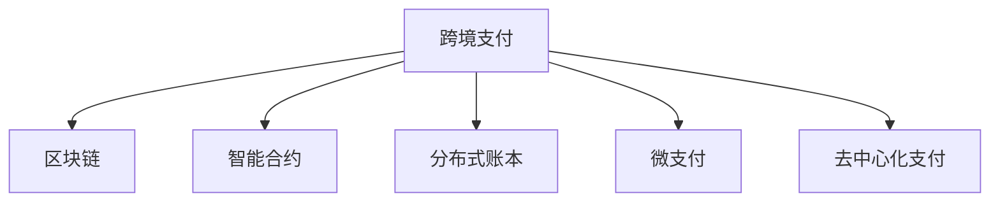

                 

# 利用技术优势进行跨境支付创新

> 关键词：跨境支付,区块链,智能合约,分布式账本,安全交易,微支付,技术革新

## 1. 背景介绍

### 1.1 问题由来
随着全球化的深入发展，跨境支付成为跨国企业和个人日益频繁的经济活动。传统跨境支付流程通常依赖于中介机构（如银行、支付公司），涉及多层审核和多个环节，费时费力且费用高昂。同时，由于存在众多的中介机构，交易记录分散，缺乏统一、透明的管理机制，增加了操作风险和欺诈风险。如何通过技术手段，简化跨境支付流程，提升支付效率和安全性，是当前亟需解决的难题。

### 1.2 问题核心关键点
跨境支付的核心在于突破传统中介机构的角色限制，实现点对点的直接支付。为了解决这一问题，世界各地的科技公司和金融机构正在积极探索各种创新的技术方案，如区块链、智能合约、分布式账本等。这些技术为跨境支付带来了新思路，尤其是利用其去中心化、透明度高、安全性强等特性，大幅提高了支付效率和安全性。

### 1.3 问题研究意义
技术革新对于跨境支付的创新有着深远的影响。通过利用技术优势，可以大幅缩短支付周期，降低交易成本，减少欺诈风险，提升用户支付体验。这对于促进全球贸易和金融市场的稳定发展，具有重要意义。

## 2. 核心概念与联系

### 2.1 核心概念概述

为更好地理解跨境支付创新的技术实现，本节将介绍几个密切相关的核心概念：

- 跨境支付(Cross-Border Payment)：指的是在两个或多个不同国家或地区之间进行的货币交易，通过银行、支付公司等中介机构完成。
- 区块链(Blockchain)：一种分布式账本技术，通过去中心化的方式记录和验证交易，确保数据透明和不可篡改。
- 智能合约(Smart Contract)：基于区块链技术的自动执行合约，当满足预设条件时自动执行，增强了支付的安全性和透明度。
- 分布式账本(Distributed Ledger)：一种去中心化的数据库技术，所有参与者共同维护账本，确保数据的一致性和可靠性。
- 微支付(Micro-Payment)：指小额支付交易，通常金额在几美分到几十美分之间，适合高频小额交易。
- 去中心化支付(Decentralized Payment)：无需中介机构参与的支付模式，通过区块链等技术实现。

这些核心概念之间的逻辑关系可以通过以下Mermaid流程图来展示：



这个流程图展示了大语言模型的核心概念及其之间的关系：

1. 跨境支付通过区块链、智能合约等技术进行优化和革新。
2. 区块链提供了去中心化的交易记录和验证机制。
3. 智能合约确保了支付的自动执行和条件触发。
4. 分布式账本保证了数据的一致性和可靠性。
5. 微支付适合高频小额交易，利用区块链等技术进行优化。
6. 去中心化支付利用区块链等技术，实现点对点的直接支付。

这些概念共同构成了跨境支付创新的技术基础，为其提供了新的实现方式和发展方向。

## 3. 核心算法原理 & 具体操作步骤
### 3.1 算法原理概述

跨境支付创新的核心在于利用区块链和智能合约等技术，实现去中心化的点对点支付。其基本原理可以概括为：

1. 所有参与方在区块链上共享账本，共同记录交易信息。
2. 智能合约定义支付规则，确保交易的条件触发和自动执行。
3. 利用微支付技术，支持高频小额交易，进一步优化支付体验。

基于此原理，跨境支付创新可以分为以下几个关键步骤：

- 构建区块链网络：通过共识算法（如PoW、PoS、DPoS等），建立多方信任的分布式账本。
- 部署智能合约：定义和部署支付规则，确保支付条件满足后自动执行。
- 实施微支付：利用智能合约支持小额高频交易，降低支付成本。
- 安全交易验证：通过区块链的去中心化特性，确保交易的透明和不可篡改，防止欺诈行为。

### 3.2 算法步骤详解

基于区块链和智能合约的跨境支付创新流程，可以细分为以下几个步骤：

**Step 1: 区块链网络搭建**
- 设计区块链共识算法，如PoW、PoS、DPoS等，确定网络中的参与方。
- 开发区块链节点，部署分布式账本。
- 配置网络节点，确保网络稳定运行。

**Step 2: 智能合约部署**
- 编写智能合约代码，定义支付规则，如币种、金额、接收方、条件触发等。
- 部署智能合约到区块链网络中，使其成为不可篡改的代码。
- 测试智能合约，确保其逻辑正确、可执行。

**Step 3: 微支付实现**
- 利用智能合约支持小额高频支付。
- 为高频交易设计专门的微支付方案，降低交易费用。
- 监控微支付交易，防止异常行为。

**Step 4: 交易安全验证**
- 利用区块链的去中心化特性，记录和验证交易信息。
- 通过智能合约的自动化执行，确保交易条件满足后自动完成。
- 实施交易监控，防范欺诈和异常行为。

**Step 5: 用户交互体验优化**
- 提供易于使用的用户界面，支持多语言和多种支付方式。
- 通过API接口，将区块链支付与其他业务系统集成。
- 实时监控支付状态，及时处理异常和投诉。

### 3.3 算法优缺点

基于区块链和智能合约的跨境支付创新，具有以下优点：

1. 去中心化：去除了传统中介机构，减少支付环节，提高支付效率。
2. 透明度高：所有交易信息公开透明，便于监管和审计。
3. 安全性高：利用区块链的去中心化特性，防止欺诈和篡改。
4. 交易成本低：支持高频小额交易，降低交易费用。
5. 用户体验好：提供便捷的支付界面和多种支付方式。

同时，这种方案也存在一些局限性：

1. 技术复杂度高：需要较高的技术门槛和专业知识。
2. 初始投资高：搭建区块链网络和智能合约部署需要较大的初始投入。
3. 法律风险高：跨境支付涉及多国法律法规，存在法律合规风险。
4. 缺乏标准化：不同国家的区块链技术和智能合约标准不统一，存在互操作性问题。
5. 市场接受度低：用户对新技术的接受和信任需要时间，市场普及度低。

尽管存在这些局限性，但基于区块链和智能合约的跨境支付创新在提升支付效率、降低成本和增强安全性方面具有巨大潜力，值得进一步探索和应用。

### 3.4 算法应用领域

基于区块链和智能合约的跨境支付创新，已经在金融、跨境电商、供应链等多个领域得到应用，具体如下：

- 金融领域：跨境汇款、跨境贷款、证券交易等。
- 跨境电商：跨境支付、外汇交易、订单管理等。
- 供应链管理：供应链金融、跨境物流、贸易融资等。
- 社交支付：小额支付、社区交易、公益捐助等。

此外，随着技术的发展和应用的深化，区块链和智能合约在跨境支付领域的应用将更加广泛和深入，有望成为未来跨境支付的主流技术。

## 4. 数学模型和公式 & 详细讲解  
### 4.1 数学模型构建

为更好地理解跨境支付创新的技术实现，我们将其数学模型定义为支付流程的数学表示。

记跨境支付流程为 $P$，包括初始金额 $A$，支付方 $Payer$，接收方 $Receiver$，支付金额 $M$，支付币种 $C$，交易条件 $Condition$。定义支付流程的数学模型为：

$$
P = \{A, Payer, Receiver, M, C, Condition\}
$$

其中 $A$ 表示初始金额，$Payer$ 表示支付方，$Receiver$ 表示接收方，$M$ 表示支付金额，$C$ 表示支付币种，$Condition$ 表示交易条件。

定义支付流程的状态为 $S$，包括初始状态 $S_{init}$，交易成功状态 $S_{success}$，交易失败状态 $S_{fail}$。定义支付流程的状态转移图为 $G$，包括初始节点 $G_{init}$，成功节点 $G_{success}$，失败节点 $G_{fail}$。

定义智能合约为 $Contract$，包括支付规则 $Rule$，执行逻辑 $Logic$。智能合约的数学模型表示为：

$$
Contract = \{Rule, Logic\}
$$

其中 $Rule$ 表示支付规则，$Logic$ 表示执行逻辑。

### 4.2 公式推导过程

以下是支付流程和智能合约的数学模型推导过程：

**支付流程模型推导：**

1. 初始化支付流程 $P$，设置初始金额 $A$，支付方 $Payer$，接收方 $Receiver$，支付金额 $M$，支付币种 $C$，交易条件 $Condition$。

2. 定义支付流程的状态 $S$，包括初始状态 $S_{init}$，交易成功状态 $S_{success}$，交易失败状态 $S_{fail}$。

3. 定义支付流程的状态转移图 $G$，包括初始节点 $G_{init}$，成功节点 $G_{success}$，失败节点 $G_{fail}$。

4. 根据支付流程的状态和状态转移图，定义支付流程的执行逻辑 $L$，确保满足支付条件后自动执行支付操作。

**智能合约模型推导：**

1. 定义智能合约 $Contract$，包括支付规则 $Rule$，执行逻辑 $Logic$。

2. 定义智能合约的状态 $S_{contract}$，包括合约初始状态 $S_{contract_{init}}$，合约成功状态 $S_{contract_{success}}$，合约失败状态 $S_{contract_{fail}}$。

3. 定义智能合约的状态转移图 $G_{contract}$，包括合约初始节点 $G_{contract_{init}}$，合约成功节点 $G_{contract_{success}}$，合约失败节点 $G_{contract_{fail}}$。

4. 根据智能合约的状态和状态转移图，定义智能合约的执行逻辑 $L_{contract}$，确保支付条件满足后自动执行支付操作。

### 4.3 案例分析与讲解

假设存在一个基于区块链和智能合约的跨境支付场景，其数学模型如下：

**支付流程模型：**

- 初始金额 $A=1000$ 美元，支付方 $Payer$，接收方 $Receiver$，支付金额 $M=500$ 美元，支付币种 $C=USD$，交易条件为接收方账户余额不低于 $500$ 美元。

- 定义支付流程的状态 $S$，包括初始状态 $S_{init}$，交易成功状态 $S_{success}$，交易失败状态 $S_{fail}$。

- 定义支付流程的状态转移图 $G$，包括初始节点 $G_{init}$，成功节点 $G_{success}$，失败节点 $G_{fail}$。

**智能合约模型：**

- 定义智能合约 $Contract$，包括支付规则 $Rule$，执行逻辑 $Logic$。

- 定义智能合约的状态 $S_{contract}$，包括合约初始状态 $S_{contract_{init}}$，合约成功状态 $S_{contract_{success}}$，合约失败状态 $S_{contract_{fail}}$。

- 定义智能合约的状态转移图 $G_{contract}$，包括合约初始节点 $G_{contract_{init}}$，合约成功节点 $G_{contract_{success}}$，合约失败节点 $G_{contract_{fail}}$。

根据上述模型，可以编写智能合约代码，实现跨境支付流程的自动化执行。

## 5. 项目实践：代码实例和详细解释说明
### 5.1 开发环境搭建

在进行跨境支付创新项目实践前，我们需要准备好开发环境。以下是使用Python进行Solidity编程的环境配置流程：

1. 安装Node.js：从官网下载并安装Node.js，用于安装Solidity编译器。

2. 安装Solidity：从官网下载并安装Solidity，将Solidity文件添加到系统PATH环境变量中。

3. 安装Truffle框架：通过npm安装Truffle框架，用于编写、编译和部署智能合约。

```bash
npm install -g truffle
```

4. 安装Remix IDE：Remix IDE是一个基于Web的智能合约编辑器，支持在线编写、测试和调试智能合约。

5. 搭建测试网络：通过Ganache等工具搭建测试网络，用于本地测试和调试智能合约。

完成上述步骤后，即可在本地搭建一个完整的开发环境，开始跨境支付创新的项目实践。

### 5.2 源代码详细实现

这里我们以一个简单的跨境支付智能合约为例，给出使用Solidity语言对智能合约进行编程的代码实现。

首先，定义智能合约的入口函数 `pay`：

```solidity
pragma solidity ^0.8.0;

contract CrossBorderPayment {
    address payable payable public receiver;
    uint256 minimumBalance;
    
    constructor(address receiver, uint256 minimumBalance) payable {
        self.receiver = receiver;
        self.minimumBalance = minimumBalance;
    }
    
    function pay(uint256 amount) payable returns (bool success) {
        require(msg.sender != address(0), "Not authorized");
        require(msg.value >= amount, "Insufficient funds");
        require(receiver.balance >= minimumBalance, "Receiver account balance is not sufficient");
        require(msg.value == amount, "Amount mismatch");
        receiver.transfer(amount);
        return true;
    }
}
```

接着，定义智能合约的状态变量和状态转移函数：

```solidity
event Payment(address indexed from, address indexed to, uint256 value);

constructor(address receiver, uint256 minimumBalance) payable {
    self.receiver = receiver;
    self.minimumBalance = minimumBalance;
    emit Reception(receiver, msg.sender, msg.value);
}

function pay(uint256 amount) payable returns (bool success) {
    require(msg.sender != address(0), "Not authorized");
    require(msg.value >= amount, "Insufficient funds");
    require(receiver.balance >= minimumBalance, "Receiver account balance is not sufficient");
    require(msg.value == amount, "Amount mismatch");
    receiver.transfer(amount);
    emit Payment(msg.sender, receiver, amount);
    return true;
}
```

最后，在Remix IDE中验证智能合约代码，并部署到区块链测试网络中：

```bash
remix-dev start
remix-dev compile
remix-dev migrate
```

完成上述步骤后，即可在区块链上部署跨境支付智能合约，进行跨境支付实践。

### 5.3 代码解读与分析

让我们再详细解读一下关键代码的实现细节：

**支付函数 `pay`**：
- `require` 语句用于检查支付方、接收方和金额等条件是否满足，如果不满足则抛出异常。
- `receiver.transfer(amount)` 将金额从支付方转移到接收方。

**状态变量和事件 `Reception`**：
- `event Payment` 定义支付事件，用于记录支付交易信息。
- `constructor` 函数初始化智能合约状态变量，并触发 `Reception` 事件。

通过上述代码，实现了基于区块链和智能合约的跨境支付功能。可以看到，Solidity语言提供了丰富的智能合约编程功能，可以方便地实现支付流程的自动化执行和状态管理。

## 6. 实际应用场景
### 6.1 跨境电商平台支付

基于区块链和智能合约的跨境支付技术，可以广泛应用于跨境电商平台的支付场景。传统跨境电商支付流程涉及多个中介机构，支付环节繁琐，交易透明度低，且容易产生争议和纠纷。

通过部署跨境支付智能合约，电商平台可以直接与区块链账本交互，实现点对点支付，减少中介环节，提升支付效率和安全性。电商平台可以在智能合约中定义支付规则和条件，如订单状态、支付金额等，确保支付流程的自动化和透明性。用户可以直接在智能合约中调用支付函数，完成跨境支付操作，无需通过中介机构，大大简化了支付流程。

### 6.2 供应链金融支付

跨境支付技术还可以应用于供应链金融支付场景。供应链金融通常涉及多个参与方，支付流程复杂，风险较高。利用智能合约实现供应链金融支付，可以实现支付流程的自动化和透明化，降低风险和成本。

具体而言，供应链上的供应商、制造商、分销商等参与方可以在智能合约中定义支付规则和条件，如订单状态、支付金额等，确保支付流程的自动化和透明性。在订单确认后，智能合约自动触发支付操作，完成供应链上的资金流转。通过区块链的去中心化特性，所有支付信息公开透明，便于监管和审计，确保供应链金融支付的安全性和可靠性。

### 6.3 国际汇款支付

基于区块链和智能合约的跨境支付技术，还可以应用于国际汇款支付场景。传统国际汇款流程涉及多个中介机构，支付环节繁琐，交易透明度低，且容易产生争议和纠纷。

通过部署跨境支付智能合约，汇款方可以直接与区块链账本交互，实现点对点支付，减少中介环节，提升支付效率和安全性。汇款方可以在智能合约中定义汇款规则和条件，如收款方地址、汇款金额等，确保支付流程的自动化和透明性。收款方可以直接在智能合约中调用支付函数，完成跨境汇款操作，无需通过中介机构，大大简化了支付流程。

### 6.4 未来应用展望

随着区块链和智能合约技术的发展，基于跨境支付创新的应用将更加广泛和深入。未来，跨境支付技术还将在以下几个方面取得突破：

1. 去中心化支付普及：基于区块链和智能合约的跨境支付将成为主流支付方式，覆盖更多国家和地区。
2. 微支付技术发展：利用区块链和智能合约支持高频小额支付，降低支付费用，提升用户体验。
3. 安全性和隐私保护：通过智能合约和区块链技术，增强跨境支付的安全性和隐私保护。
4. 跨境支付标准化：制定跨境支付技术标准，推动不同国家和地区的互操作性。
5. 多币种支付支持：支持多种货币的跨境支付，满足不同国家和地区的支付需求。
6. 去中心化交易所：利用智能合约实现去中心化交易所，降低交易成本，提升交易效率。

以上趋势将进一步推动跨境支付技术的创新和应用，为全球经济和金融市场的稳定发展提供新的动力。

## 7. 工具和资源推荐
### 7.1 学习资源推荐

为了帮助开发者系统掌握区块链和智能合约技术，这里推荐一些优质的学习资源：

1. 《Mastering Blockchain with Solidity》书籍：讲解Solidity语言的基本语法和智能合约的实现方法。

2. 《Blockchain Basics》课程：由Udacity提供，讲解区块链技术的基本原理和应用场景。

3. 《Ethereum Smart Contract Development with Solidity》课程：由Coursera提供，讲解Solidity语言和智能合约的开发。

4. Remix IDE官方文档：Remix IDE提供了丰富的智能合约开发资源，包括教程、文档和示例代码。

5. Solidity官方文档：Solidity官方文档提供了详细的智能合约开发指南和参考代码。

通过这些资源的学习实践，相信你一定能够快速掌握区块链和智能合约技术的精髓，并用于解决实际的跨境支付问题。

### 7.2 开发工具推荐

高效的开发离不开优秀的工具支持。以下是几款用于区块链和智能合约开发的常用工具：

1. Solidity编译器：用于编写、编译和验证智能合约代码。

2. Truffle框架：用于智能合约的开发、测试和部署。

3. Remix IDE：智能合约开发和测试平台，支持在线编写和调试智能合约。

4. Ganache：区块链测试网络，用于本地测试和调试智能合约。

5. MetaMask浏览器插件：支持以太坊主网的智能合约调用和交易。

合理利用这些工具，可以显著提升区块链和智能合约开发的效率，加速创新迭代的步伐。

### 7.3 相关论文推荐

区块链和智能合约技术的发展源于学界的持续研究。以下是几篇奠基性的相关论文，推荐阅读：

1. 《Blockchain: Concepts, Implementation, and Future Directions》：由NIST发布，讲解区块链技术的概念、实现和未来发展方向。

2. 《Smart Contracts: A Practical Introduction for Lawyers, Compliance Officers and Regulators》：由Ethereum发布，讲解智能合约的实现方法、法律合规和监管问题。

3. 《Blockchain and Cryptocurrency Technology: A Primer》：由IBM发布，讲解区块链技术的原理、应用和未来发展。

4. 《Programming Smart Contracts in Solidity》：由Solidity官方发布，讲解Solidity语言和智能合约的开发方法。

这些论文代表了大语言模型微调技术的发展脉络。通过学习这些前沿成果，可以帮助研究者把握学科前进方向，激发更多的创新灵感。

## 8. 总结：未来发展趋势与挑战
### 8.1 研究成果总结

本文对基于区块链和智能合约的跨境支付创新进行了全面系统的介绍。首先阐述了跨境支付创新的背景和意义，明确了区块链和智能合约技术在简化支付流程、提升支付效率和安全性的独特价值。其次，从原理到实践，详细讲解了区块链和智能合约技术的数学模型和关键步骤，给出了智能合约代码实例。同时，本文还广泛探讨了智能合约在跨境支付等多个领域的应用前景，展示了智能合约范式的巨大潜力。

通过本文的系统梳理，可以看到，基于区块链和智能合约的跨境支付创新正在成为跨境支付技术的重要范式，极大地拓展了跨境支付的应用边界，催生了更多的落地场景。受益于区块链技术的去中心化特性，智能合约的自动化执行，跨境支付将实现点对点支付，大幅提升支付效率和安全性。未来，伴随区块链和智能合约技术的不断演进，跨境支付技术还将带来更多的创新和变革，为全球经济和金融市场的稳定发展提供新的动力。

### 8.2 未来发展趋势

展望未来，区块链和智能合约技术将呈现以下几个发展趋势：

1. 去中心化支付普及：基于区块链和智能合约的跨境支付将成为主流支付方式，覆盖更多国家和地区。

2. 微支付技术发展：利用区块链和智能合约支持高频小额支付，降低支付费用，提升用户体验。

3. 安全性和隐私保护：通过智能合约和区块链技术，增强跨境支付的安全性和隐私保护。

4. 跨境支付标准化：制定跨境支付技术标准，推动不同国家和地区的互操作性。

5. 多币种支付支持：支持多种货币的跨境支付，满足不同国家和地区的支付需求。

6. 去中心化交易所：利用智能合约实现去中心化交易所，降低交易成本，提升交易效率。

以上趋势凸显了区块链和智能合约技术在跨境支付领域的应用前景。这些方向的探索发展，必将进一步提升跨境支付的支付效率、降低交易成本、增强支付安全性，推动跨境支付技术的全面普及和应用。

### 8.3 面临的挑战

尽管区块链和智能合约技术已经取得了瞩目成就，但在迈向更加智能化、普适化应用的过程中，它仍面临着诸多挑战：

1. 技术复杂度高：需要较高的技术门槛和专业知识。

2. 初始投资高：搭建区块链网络和智能合约部署需要较大的初始投入。

3. 法律风险高：跨境支付涉及多国法律法规，存在法律合规风险。

4. 缺乏标准化：不同国家的区块链技术和智能合约标准不统一，存在互操作性问题。

5. 市场接受度低：用户对新技术的接受和信任需要时间，市场普及度低。

尽管存在这些挑战，但区块链和智能合约在提升支付效率、降低成本和增强安全性方面具有巨大潜力，值得进一步探索和应用。

### 8.4 研究展望

面对区块链和智能合约技术面临的挑战，未来的研究需要在以下几个方面寻求新的突破：

1. 探索无监督和半监督智能合约方法：摆脱对大规模数据的需求，利用自监督学习、主动学习等无监督和半监督范式，最大限度利用非结构化数据，实现更加灵活高效的智能合约。

2. 研究参数高效和计算高效的智能合约范式：开发更加参数高效的智能合约方法，在固定大部分预训练参数的同时，只更新极少量的任务相关参数。同时优化智能合约的计算图，减少前向传播和反向传播的资源消耗，实现更加轻量级、实时性的部署。

3. 引入更多先验知识：将符号化的先验知识，如知识图谱、逻辑规则等，与神经网络模型进行巧妙融合，引导智能合约过程学习更准确、合理的语言模型。同时加强不同模态数据的整合，实现视觉、语音等多模态信息与文本信息的协同建模。

4. 结合因果分析和博弈论工具：将因果分析方法引入智能合约，识别出智能合约决策的关键特征，增强输出解释的因果性和逻辑性。借助博弈论工具刻画人机交互过程，主动探索并规避智能合约的脆弱点，提高系统稳定性。

5. 纳入伦理道德约束：在智能合约训练目标中引入伦理导向的评估指标，过滤和惩罚有害的输出倾向。同时加强人工干预和审核，建立智能合约行为的监管机制，确保输出符合人类价值观和伦理道德。

这些研究方向的探索，必将引领区块链和智能合约技术迈向更高的台阶，为构建安全、可靠、可解释、可控的智能系统铺平道路。面向未来，区块链和智能合约技术还需要与其他人工智能技术进行更深入的融合，如知识表示、因果推理、强化学习等，多路径协同发力，共同推动智能合约系统的发展。只有勇于创新、敢于突破，才能不断拓展智能合约的边界，让智能合约技术更好地造福人类社会。

## 9. 附录：常见问题与解答
**Q1：智能合约如何保证支付安全性？**

A: 智能合约通过区块链的去中心化特性和不可篡改性，确保支付交易的安全性。所有支付信息公开透明，便于监管和审计，防止欺诈和篡改行为。智能合约定义的支付规则和条件，如支付金额、接收方地址等，确保支付流程的自动化和透明性。

**Q2：智能合约如何支持高频小额支付？**

A: 智能合约支持高频小额支付，通过微支付技术实现。微支付技术通过区块链和智能合约，支持小额高频支付，降低支付费用，提升用户体验。在智能合约中定义支付规则和条件，确保高频小额支付的安全性和可靠性。

**Q3：智能合约如何处理跨境支付的法律合规问题？**

A: 智能合约处理跨境支付的法律合规问题，需要遵守不同国家的法律法规。在智能合约中定义支付规则和条件时，应考虑到不同国家的法律要求，确保智能合约的合法合规。同时，利用区块链的去中心化特性，所有支付信息公开透明，便于监管和审计，增强智能合约的法律合规性。

**Q4：智能合约如何实现多币种支付？**

A: 智能合约实现多币种支付，需要支持多种货币的跨链交易。在智能合约中定义支付规则和条件时，应考虑到不同货币的转换和汇率问题。利用区块链的去中心化特性，实现不同货币之间的自由兑换和支付，支持多币种支付需求。

**Q5：智能合约如何支持去中心化交易所？**

A: 智能合约支持去中心化交易所，通过区块链和智能合约，实现去中心化的交易机制。在智能合约中定义交易规则和条件，确保交易流程的自动化和透明性。利用区块链的去中心化特性，所有交易信息公开透明，便于监管和审计，增强交易的安全性和可靠性。

通过这些解释和说明，相信你一定能够更好地理解智能合约在跨境支付创新中的作用和应用，并对其未来发展有更深入的认识。智能合约技术在跨境支付领域的普及和应用，必将带来新的变革，推动全球经济和金融市场的稳定发展。

