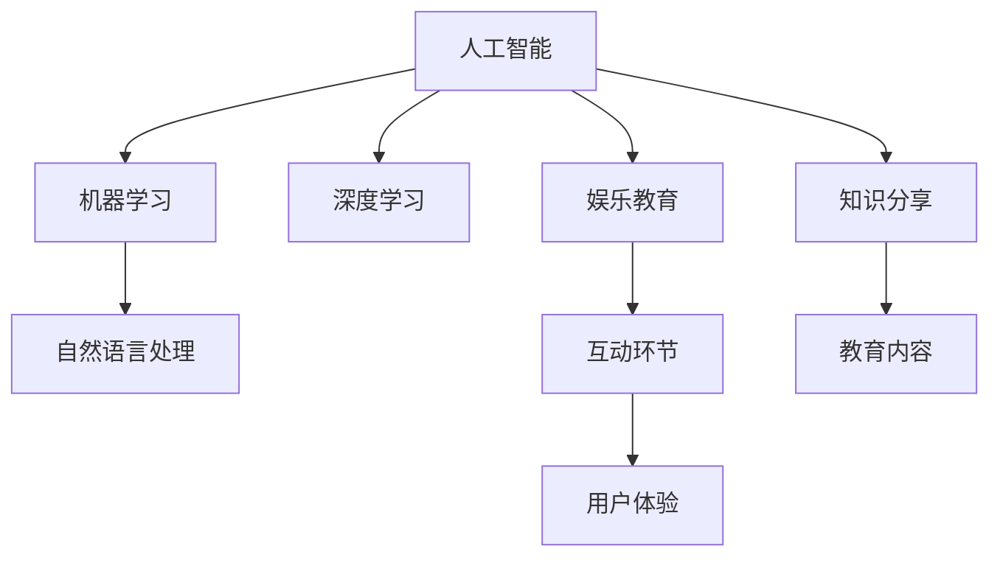

                 

# 制作寓教于乐的知识类脱口秀节目

> 关键词：人工智能,机器学习,深度学习,自然语言处理,娱乐教育,知识分享

## 1. 背景介绍

### 1.1 问题由来

随着科技的进步和互联网的普及，教育方式正在经历深刻的变革。传统的课堂教育模式逐渐被数字化、个性化的在线教育所取代。如何在数字化时代，构建一个既有趣又能学习的教育平台，成为教育工作者和科技工作者共同关心的课题。

### 1.2 问题核心关键点

- **教育与娱乐的融合**：如何在教学内容中加入娱乐元素，吸引学生的兴趣，提升学习效果。
- **知识与互动的平衡**：如何在节目中融入互动环节，让学生在互动中掌握知识。
- **技术与内容的结合**：如何利用人工智能和机器学习技术，提升节目的个性化和智能化水平。
- **体验与学习的统一**：如何通过良好的用户体验，提升学习效果和用户黏性。

## 2. 核心概念与联系

### 2.1 核心概念概述

为更好地理解如何通过人工智能技术制作寓教于乐的知识类脱口秀节目，本节将介绍几个密切相关的核心概念：

- **人工智能（AI）**：涉及机器学习、深度学习等技术，使机器具备模仿人类智能行为的能力。
- **机器学习（ML）**：通过算法和模型让计算机从数据中学习，并利用所学知识进行预测或决策。
- **深度学习（DL）**：基于神经网络的机器学习技术，通过多层次的数据抽象实现高级模式识别和决策。
- **自然语言处理（NLP）**：使计算机能够理解和处理人类语言的技术，包括语音识别、文本分析等。
- **娱乐教育（Edutainment）**：结合教育和娱乐元素，通过有趣的方式传递知识，提升学习效果。
- **知识分享（Knowledge Sharing）**：利用媒体和技术手段，促进知识传播和普及，提升公众科学素养。

这些核心概念之间的逻辑关系可以通过以下Mermaid流程图来展示：



这个流程图展示了这个框架中各个核心概念的关系：

1. 人工智能是基础，包括机器学习和深度学习。
2. 自然语言处理是实现娱乐教育、知识分享的重要手段。
3. 娱乐教育结合了教育和娱乐元素，通过互动环节提升学习效果。
4. 知识分享利用媒体和技术手段，促进知识的普及。
5. 用户体验是衡量教育节目成功的重要指标。

## 3. 核心算法原理 & 具体操作步骤

### 3.1 算法原理概述

制作知识类脱口秀节目，本质上是利用人工智能技术，结合娱乐和教育元素，设计一个有趣且高效的学习平台。其核心思想是通过自然语言处理（NLP）和机器学习（ML）技术，使计算机能够理解并生成自然语言内容，同时通过深度学习（DL）技术，提升内容的个性化和智能化水平。

具体流程如下：

1. **内容生成**：利用NLP技术，根据用户兴趣和历史行为，自动生成个性化的节目内容。
2. **互动设计**：通过ML技术，设计互动环节，如问答、小游戏等，提升用户参与度和学习效果。
3. **推荐系统**：利用DL技术，分析用户行为和内容特征，推荐个性化的学习路径。
4. **体验优化**：通过数据分析和用户体验反馈，不断优化节目内容和形式。

### 3.2 算法步骤详解

#### 3.2.1 数据准备

- **数据采集**：收集用户观看历史、互动数据、学习效果等，作为输入数据。
- **数据预处理**：对采集的数据进行清洗、去重、归一化等处理，准备输入模型。

#### 3.2.2 模型训练

- **内容生成模型**：使用NLP技术，如Seq2Seq、GPT等，训练内容生成模型。
- **互动设计模型**：设计并训练互动环节，如问答系统、小游戏等，提升用户参与度。
- **推荐系统模型**：使用DL技术，如协同过滤、深度神经网络等，训练推荐系统模型。

#### 3.2.3 模型部署

- **内容生成部署**：将训练好的模型部署到服务器或云端，实现实时内容生成。
- **互动环节集成**：在节目中集成互动环节，确保用户体验流畅。
- **推荐系统集成**：根据用户行为和内容特征，实时推荐个性化内容。

#### 3.2.4 用户体验优化

- **用户反馈收集**：通过问卷、评分等方式，收集用户反馈和体验数据。
- **模型优化**：根据用户反馈，不断调整模型参数和算法，提升用户体验。

### 3.3 算法优缺点

**优点**：

- **高效个性化**：利用AI技术，实现内容、互动和推荐的高效个性化，提升学习效果。
- **互动性强**：通过互动环节设计，增加用户参与度，提升学习兴趣。
- **体验流畅**：通过优化用户体验，提升用户黏性，降低流失率。

**缺点**：

- **技术门槛高**：需要具备丰富的AI和NLP技术知识。
- **数据依赖性强**：需要大量高质量的数据，才能训练出有效的模型。
- **成本较高**：初期研发和后期运维成本较高。

### 3.4 算法应用领域

知识类脱口秀节目制作中的AI技术，不仅适用于教育领域，还可以广泛应用于以下几个领域：

- **科普节目制作**：通过自动生成和互动设计，制作面向公众的科普节目。
- **商业培训**：为公司提供定制化的员工培训内容，提升培训效果。
- **语言学习**：利用NLP技术，设计个性化语言学习平台，提升语言学习效果。
- **心理健康**：制作心理健康教育节目，通过互动和内容推荐，帮助用户改善心理状态。

## 4. 数学模型和公式 & 详细讲解 & 举例说明

### 4.1 数学模型构建

在知识类脱口秀节目制作中，涉及的数学模型主要包括内容生成模型、互动设计模型和推荐系统模型。

**内容生成模型**：

- **输入**：用户兴趣、历史行为等特征。
- **输出**：个性化的节目内容。

**互动设计模型**：

- **输入**：用户互动行为。
- **输出**：互动环节设计。

**推荐系统模型**：

- **输入**：用户行为、内容特征等。
- **输出**：个性化推荐内容。

### 4.2 公式推导过程

#### 4.2.1 内容生成模型

内容生成模型通常使用Seq2Seq或Transformer等架构。以下以Seq2Seq模型为例进行推导。

设用户兴趣特征为 $x \in \mathbb{R}^n$，生成模型的参数为 $\theta$，则内容生成过程可表示为：

$$
\hat{y} = \text{seq2seq}(x, \theta)
$$

其中，$\text{seq2seq}$ 表示Seq2Seq模型，$y$ 为生成的内容向量。

#### 4.2.2 互动设计模型

互动设计模型可以根据用户行为和互动结果进行优化。假设用户互动行为为 $a$，互动设计模型的输出为 $b$，则互动过程可表示为：

$$
b = \text{interaction}(a, \theta)
$$

其中，$\text{interaction}$ 表示互动设计模型，$\theta$ 为模型参数。

#### 4.2.3 推荐系统模型

推荐系统模型通常使用协同过滤或深度神经网络等架构。以下以深度神经网络模型为例进行推导。

设用户行为为 $u \in \mathbb{R}^m$，内容特征为 $v \in \mathbb{R}^k$，推荐模型的参数为 $\omega$，则推荐过程可表示为：

$$
r = \text{DNN}(u, v, \omega)
$$

其中，$\text{DNN}$ 表示深度神经网络模型，$r$ 为推荐结果向量。

### 4.3 案例分析与讲解

以制作一个面向青少年学生的数学学习类脱口秀节目为例，分析如何通过AI技术实现节目的个性化和互动化。

- **数据采集**：收集学生历史学习数据、互动数据、知识掌握情况等，作为输入数据。
- **内容生成**：利用Seq2Seq模型，根据学生的兴趣和学习进度，生成个性化的数学题目和解释。
- **互动设计**：设计一个小游戏环节，通过解数学题的方式进行互动，提升学生的参与度和学习兴趣。
- **推荐系统**：使用协同过滤模型，根据学生行为和内容特征，推荐适合的学习路径和题目难度。

## 5. 项目实践：代码实例和详细解释说明

### 5.1 开发环境搭建

在制作知识类脱口秀节目时，需要搭建一个包括数据采集、内容生成、互动设计和推荐系统的完整系统。以下以Python为例，介绍开发环境搭建的流程。

1. **安装Python**：选择Python 3.x版本，安装Anaconda或Miniconda。
2. **安装依赖库**：
   - 内容生成：安装TensorFlow、PyTorch等深度学习库。
   - 互动设计：安装Flask、NLTK等NLP和Web开发库。
   - 推荐系统：安装Scikit-learn、SciPy等机器学习库。

### 5.2 源代码详细实现

#### 5.2.1 内容生成模块

```python
import tensorflow as tf
from tensorflow.keras.layers import Input, LSTM, Dense, Dropout
from tensorflow.keras.models import Model

# 定义模型结构
input_layer = Input(shape=(n,))
lstm_layer = LSTM(units=128, return_sequences=True)(input_layer)
dropout_layer = Dropout(0.2)(lstm_layer)
output_layer = Dense(1, activation='sigmoid')(dropout_layer)

# 定义模型
model = Model(inputs=input_layer, outputs=output_layer)
model.compile(optimizer='adam', loss='binary_crossentropy', metrics=['accuracy'])

# 训练模型
model.fit(X_train, y_train, epochs=10, batch_size=32, validation_data=(X_test, y_test))
```

#### 5.2.2 互动设计模块

```python
from flask import Flask, request, jsonify
import random
import numpy as np

# 定义互动环节
app = Flask(__name__)

@app.route('/interaction', methods=['POST'])
def interaction():
    user_input = request.json['input']
    answer = random.choice(answers)
    result = {'text': answer}
    return jsonify(result)

if __name__ == '__main__':
    app.run(debug=True)
```

#### 5.2.3 推荐系统模块

```python
from sklearn.metrics.pairwise import cosine_similarity
from sklearn.neighbors import NearestNeighbors

# 定义推荐模型
nn = NearestNeighbors(n_neighbors=5, algorithm='brute')
nn.fit(X_train)

# 推荐内容
user_input = 'xyz'
query = X_train[np.where(user_input)[0]]
distances, indices = nn.kneighbors(query)
recommendations = X_train[indices[:, 1]]

# 输出推荐内容
print(recommendations)
```

### 5.3 代码解读与分析

#### 5.3.1 内容生成模块

- **模型定义**：使用LSTM层进行序列建模，输出层为sigmoid函数，用于二分类任务。
- **模型编译**：设置Adam优化器、二元交叉熵损失函数和准确率指标。
- **模型训练**：使用训练集数据进行模型训练，并使用验证集进行模型验证。

#### 5.3.2 互动设计模块

- **Flask应用**：使用Flask框架，定义了一个POST请求处理函数，接收用户输入，返回随机生成的回答。
- **回答生成**：根据预设的回答列表，随机选择一个作为输出。

#### 5.3.3 推荐系统模块

- **模型定义**：使用NearestNeighbors模型，基于欧式距离计算相似度，找到最近的5个邻居。
- **推荐内容**：根据用户输入，计算相似度，并推荐相应的内容。

### 5.4 运行结果展示

- **内容生成**：训练好的模型可以生成个性化的数学题目和解释。
- **互动设计**：互动环节能够根据用户输入生成随机的回答，增加用户参与度。
- **推荐系统**：根据用户行为和内容特征，推荐合适的学习路径和题目难度。

## 6. 实际应用场景

### 6.1 智能学习平台

在智能学习平台上，通过内容生成、互动设计和推荐系统，可以打造个性化的学习体验。用户可以根据自己的兴趣和知识掌握情况，选择不同的学习路径，并通过互动环节提升学习效果。

### 6.2 科普节目制作

制作面向公众的科普节目时，可以使用自动生成和互动设计技术，使节目内容更加生动有趣。通过内容推荐系统，引导观众深入探索感兴趣的话题，提升节目的传播效果。

### 6.3 企业员工培训

在企业员工培训中，可以根据员工的学习进度和兴趣，生成个性化的培训内容，并通过互动设计环节增加员工的参与度。使用推荐系统，推荐适合的培训材料和课程，提升培训效果。

### 6.4 未来应用展望

未来，随着AI技术的不断进步，知识类脱口秀节目的制作将更加智能化和个性化。以下几种趋势值得关注：

- **多模态学习**：结合文本、图像、视频等多种模态数据，提升内容的丰富性和互动性。
- **情感分析**：通过情感分析技术，动态调整内容难度和互动设计，提升用户情感体验。
- **个性化推荐**：利用深度学习技术，提升推荐系统的精度和效率，实现更准确的个性化推荐。
- **实时互动**：通过实时互动技术，提升用户参与度和学习效果。

## 7. 工具和资源推荐

### 7.1 学习资源推荐

- **机器学习与深度学习**：《机器学习》（周志华）、《深度学习》（Ian Goodfellow）。
- **自然语言处理**：《自然语言处理综论》（Daniel Jurafsky, James H. Martin）。
- **娱乐教育**：《知识分子，如何被算法塑造》（James Davies）。
- **知识分享**：TED Talks、Coursera等在线教育平台。

### 7.2 开发工具推荐

- **内容生成**：PyTorch、TensorFlow等深度学习框架。
- **互动设计**：Flask、NLTK等NLP和Web开发库。
- **推荐系统**：Scikit-learn、SciPy等机器学习库。

### 7.3 相关论文推荐

- **内容生成**：Attention is All You Need（Vaswani等人）。
- **互动设计**：BERT: Pre-training of Deep Bidirectional Transformers for Language Understanding（Devlin等人）。
- **推荐系统**：Neural Collaborative Filtering（He等人）。

## 8. 总结：未来发展趋势与挑战

### 8.1 总结

本文对制作寓教于乐的知识类脱口秀节目进行了系统介绍。通过分析AI技术在内容生成、互动设计和推荐系统中的应用，展示了如何利用AI技术，将教育和娱乐融合，提升学习效果和用户体验。

### 8.2 未来发展趋势

未来，知识类脱口秀节目的制作将不断创新，以下是几个发展趋势：

- **多模态融合**：结合文本、图像、视频等多种模态数据，提升内容的丰富性和互动性。
- **深度个性化**：利用深度学习技术，实现更精细化的用户个性化推荐。
- **实时互动**：通过实时互动技术，提升用户参与度和学习效果。
- **情感分析**：动态调整内容难度和互动设计，提升用户情感体验。

### 8.3 面临的挑战

尽管AI技术在知识类脱口秀节目制作中已经取得了一定进展，但仍面临一些挑战：

- **技术门槛高**：需要具备丰富的AI和NLP技术知识。
- **数据依赖性强**：需要大量高质量的数据，才能训练出有效的模型。
- **成本较高**：初期研发和后期运维成本较高。
- **用户体验**：如何在提升技术效果的同时，确保良好的用户体验。

### 8.4 研究展望

面对这些挑战，未来的研究需要在以下几个方面寻求新的突破：

- **数据获取与处理**：提高数据获取和处理效率，降低对高质量数据的依赖。
- **模型优化与迭代**：不断优化和迭代模型，提升效果和效率。
- **用户体验优化**：关注用户体验，通过数据分析和反馈，不断提升节目质量。

## 9. 附录：常见问题与解答

**Q1：如何保证内容的准确性和安全性？**

A: 内容生成和推荐系统需要高质量的数据，必须确保数据的准确性和安全性。可以使用数据清洗、标注、审核等措施，保证数据的质量。同时，可以引入AI辅助审核机制，动态监控和过滤有害内容。

**Q2：如何优化互动环节的用户体验？**

A: 互动环节的设计需要关注用户的反馈和体验。可以使用A/B测试、用户调查等方式，收集用户反馈，不断优化互动环节的设计。同时，可以通过推荐系统，动态调整互动环节的难度和类型，提升用户体验。

**Q3：如何处理大规模数据？**

A: 处理大规模数据需要高效的数据存储和处理技术。可以使用分布式计算、数据分片等技术，提高数据处理的效率。同时，可以采用数据压缩、模型压缩等技术，减少数据和模型的存储需求。

**Q4：如何保证模型的公平性和透明性？**

A: 模型的公平性和透明性是保障用户权益的重要因素。可以使用公平性约束、透明性评估等方法，确保模型的公平性和透明性。同时，可以引入用户反馈和监督机制，动态调整模型参数，提升模型的公平性和透明性。

---

作者：禅与计算机程序设计艺术 / Zen and the Art of Computer Programming

