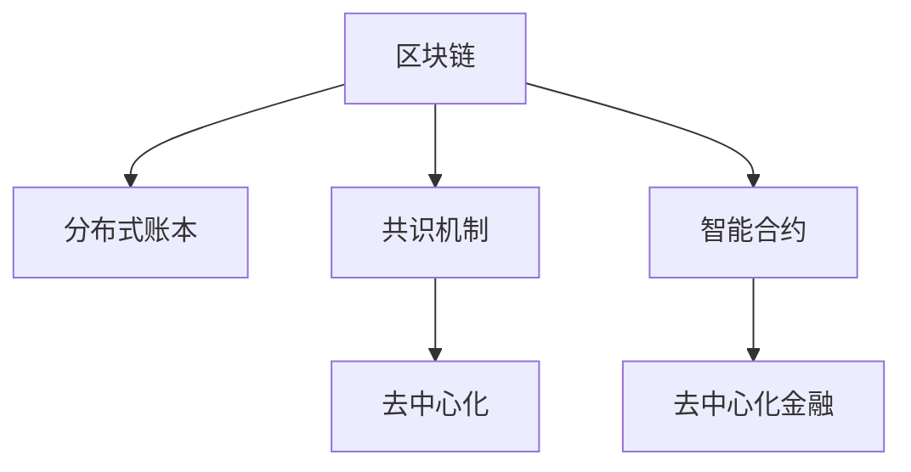

                 

# 区块链创业：去中心化的商业新范式

## 1. 背景介绍

### 1.1 问题由来
区块链技术的诞生，标志着人类经济社会进入了一个全新的阶段——去中心化的数字经济时代。随着比特币的横空出世，人们对去中心化金融（DeFi）的愿景越来越清晰。然而，当前区块链生态系统中的痛点问题，如低交易吞吐量、高成本、复杂的共识机制、治理难题等，限制了区块链技术的普及和应用。

### 1.2 问题核心关键点
去中心化并不是简单的去中心，而是通过技术手段构建一种无需中介、人人参与的信任网络。区块链正是通过去中心化技术，实现了一种全新的信任机制。然而，区块链创业的实质是将这种技术应用到具体业务场景，并解决传统系统无法解决的痛点。

## 2. 核心概念与联系

### 2.1 核心概念概述

为更好地理解区块链创业的方法，本节将介绍几个密切相关的核心概念：

- 区块链(Blockchain)：一种去中心化的分布式账本技术，通过共识机制实现数据的去中心化存储和验证，保证数据的不可篡改和透明性。

- 去中心化(Decentralization)：构建一种无需中心化的信任网络，通过智能合约等机制实现点对点的信任和自治。

- 分布式账本(Distributed Ledger)：区块链中的核心数据结构，记录了所有交易和状态更新的历史记录，并按时间顺序链接在一起，确保数据的一致性和完整性。

- 共识机制(Consensus Algorithm)：区块链中达成共识的算法机制，通过算法保证网络中所有节点对账本状态的统一和正确。

- 智能合约(Smart Contract)：运行在区块链上的代码，通过自动执行合约条款实现信任和自治。

- 去中心化金融(DeFi)：利用区块链技术，构建去中心化的金融应用和服务，实现金融活动的自治和智能化。

这些核心概念之间的逻辑关系可以通过以下Mermaid流程图来展示：



这个流程图展示了几大核心概念之间的关系：

1. 区块链是分布式账本技术的一种实现，核心是保证数据的一致性和完整性。
2. 共识机制确保所有节点对账本状态达成一致。
3. 智能合约是区块链上的一种自治机制，通过代码执行保证合约条款的自动执行。
4. 去中心化金融则是利用区块链技术，构建去中心化的金融应用和服务。

这些概念共同构成了区块链技术的基本框架，为其应用场景提供了强大的技术支撑。通过理解这些核心概念，我们可以更好地把握区块链创业的方法和思路。

## 3. 核心算法原理 & 具体操作步骤

### 3.1 算法原理概述

区块链创业的核心在于利用区块链技术，构建一种无需中介、人人参与的信任网络。具体而言，区块链创业通常包括如下几个关键步骤：

1. **项目构思**：确定区块链项目的具体应用场景和业务需求。
2. **技术选型**：选择合适的区块链平台和技术栈，如以太坊、EOS、Hyperledger等。
3. **智能合约设计**：设计符合业务需求的智能合约，实现自治和自动化。
4. **共识机制选择**：根据项目需求和网络规模，选择合适的共识算法。
5. **开发和测试**：实现智能合约和共识算法，并进行充分的测试和验证。
6. **部署和上链**：将智能合约和共识机制部署到区块链网络，实现上链。
7. **市场推广**：通过市场营销和社区建设，吸引用户和投资者，推广项目。

### 3.2 算法步骤详解

以下以智能合约贷款平台为例，详细介绍区块链创业的详细步骤：

**Step 1: 项目构思**
- 确定项目目标：构建一个基于区块链的去中心化贷款平台，让用户自主申请、审批和放贷。
- 明确业务需求：支持多种资产抵押、自动利息计算、贷款审批自动化等功能。

**Step 2: 技术选型**
- 选择区块链平台：选择以太坊作为项目的技术平台，因为它具备完善的生态系统和丰富的开发工具。
- 确定智能合约语言：使用Solidity语言实现智能合约，这是以太坊的官方合约编程语言。

**Step 3: 智能合约设计**
- 设计贷款合约：包括贷款申请、审批、放贷、还款等步骤，通过智能合约自动化执行。
- 设计抵押合约：支持多种资产抵押，包括以太币、ERC-20代币等，并设置自动清算机制。
- 设计利息合约：自动计算利息，并支持自动计息、复利等不同计息方式。

**Step 4: 共识机制选择**
- 选择共识算法：选择PoA(私有链共识算法)，以减少网络交易量，提高交易速度。
- 配置网络参数：设置网络的区块间隔、交易费用等参数，确保网络稳定运行。

**Step 5: 开发和测试**
- 实现智能合约：使用Solidity语言编写贷款合约、抵押合约和利息合约，并进行单元测试。
- 实现共识机制：编写私有链的共识算法，确保网络中所有节点对账本状态的一致性。
- 集成测试：在模拟环境中集成所有合约和共识算法，进行充分的测试和验证，确保系统的稳定性和安全性。

**Step 6: 部署和上链**
- 部署智能合约：将编写好的合约部署到以太坊区块链上。
- 配置网络参数：设置网络的节点数量、区块间隔等参数，确保网络稳定运行。
- 测试网络：在真实环境中测试网络，确保合约和共识机制的正常运行。

**Step 7: 市场推广**
- 建立社区：通过社交媒体、邮件列表等方式，建立项目社区，吸引用户和开发者。
- 进行市场营销：通过各种渠道推广项目，吸引用户和投资者，提升项目的知名度。
- 上线交易：将项目上线交易所，接受用户的交易和投资，加速项目的发展。

### 3.3 算法优缺点

区块链创业具有以下优点：
1. **去中心化**：通过区块链技术，去除中介机构，实现点对点信任，降低运营成本。
2. **透明度**：所有交易和操作都公开透明，能够有效防止欺诈和舞弊行为。
3. **智能合约**：通过代码实现合约条款，提高自动化和效率。
4. **不可篡改**：所有交易和状态更新都是不可篡改的，保证数据的完整性和一致性。

同时，区块链创业也存在一些缺点：
1. **高门槛**：区块链创业需要较高的技术门槛，需要具备区块链开发和治理经验。
2. **高成本**：区块链网络的高交易成本和运营成本，可能限制一些场景的应用。
3. **复杂性**：区块链共识机制和智能合约的实现复杂性较高，需要深厚的技术积累。
4. **安全性**：区块链网络的安全性依赖于共识机制和智能合约的可靠性，一旦出现漏洞可能带来重大风险。

尽管存在这些缺点，但区块链创业仍是大势所趋，尤其在金融、供应链、医疗等行业中，具有广阔的应用前景。

### 3.4 算法应用领域

区块链创业已经在金融、供应链、医疗等多个领域得到了广泛应用，具体包括：

- 去中心化金融(DeFi)：构建去中心化的借贷、交易、资产管理等金融应用。
- 供应链金融：通过区块链实现供应链的透明化、智能化和去中介化。
- 医疗数据共享：利用区块链技术，实现医疗数据的去中心化存储和共享。
- 版权保护：通过区块链技术，实现数字版权的自动登记、确权和流转。
- 数字身份认证：利用区块链技术，实现数字身份的去中心化认证和隐私保护。
- 物联网(IoT)：通过区块链技术，实现物联网设备的去中心化管理和安全认证。

区块链创业的应用场景还在不断拓展，未来将会有更多的领域受益于去中心化技术。

## 4. 数学模型和公式 & 详细讲解 & 举例说明

### 4.1 数学模型构建

区块链创业的核心在于通过智能合约实现去中心化的信任和自治。以下以智能合约贷款平台为例，构建数学模型：

假设贷款合约为 $C$，抵押资产为 $A$，借款金额为 $L$，借款期限为 $T$，利息率为 $r$。设贷款合约的状态为 $s \in \{0, 1\}$，其中 $s=0$ 表示贷款未放贷，$s=1$ 表示贷款已放贷。

设智能合约的规则如下：
- 贷款申请：用户提交申请，并支付抵押资产。
- 贷款审批：由管理员审批申请，并将贷款状态更新为 $s=1$。
- 自动放贷：贷款状态为 $s=1$ 时，自动放贷。
- 自动利息计算：在每个时间点 $t$，计算利息 $I(t)=L\times r\times t$。
- 自动计息：将利息添加到贷款金额 $L$ 中，并将状态更新为 $s=2$。
- 自动还款：用户按时还款，并更新贷款状态为 $s=0$。

设智能合约的状态转移函数为 $f(s, A, L, t)$，具体如下：
- $f(0, A, L, 0) = (0, A, L)$：初始状态，抵押资产为 $A$，贷款金额为 $L$。
- $f(0, A, L, t) = (0, A, L+r\times L\times t)$：自动计息。
- $f(1, A, L, t) = (1, A, L+r\times L\times t)$：自动放贷。
- $f(1, A, L, T) = (0, A-\frac{A}{L/T}, L+r\times L\times T)$：自动还款。

### 4.2 公式推导过程

智能合约的状态转移函数 $f$ 可表示为：
$$
f(s, A, L, t) = \begin{cases}
(0, A, L), & \text{if } t=0 \\
(0, A, L+r\times L\times t), & \text{if } s=1 \text{ and } t<T \\
(1, A, L+r\times L\times t), & \text{if } s=0 \text{ and } t<T \\
(0, A-\frac{A}{L/T}, L+r\times L\times T), & \text{if } s=1 \text{ and } t=T \\
\end{cases}
$$

通过上述数学模型，可以准确计算贷款合约的状态变化，确保合约的自动化和自治性。

### 4.3 案例分析与讲解

假设有一个智能合约贷款平台，用户小王想要申请一笔10个以太币的贷款，期限为1年，年利率为5%。抵押资产为10个以太币。

**Step 1: 贷款申请**
- 小王提交申请，并支付10个以太币作为抵押。

**Step 2: 贷款审批**
- 管理员审批通过，并将贷款状态更新为 $s=1$。

**Step 3: 自动放贷**
- 贷款状态为 $s=1$ 时，自动放贷10个以太币。

**Step 4: 自动计息**
- 每个月自动计息，第1个月利息为 $10\times 0.05 = 0.5$ 以太币，贷款金额更新为 $10+0.5=10.5$ 以太币。
- 第2个月自动计息，利息为 $10.5\times 0.05 = 0.525$ 以太币，贷款金额更新为 $10.5+0.525=10.025$ 以太币。
- 以此类推，计算至第12个月，利息总额为 $10+0.5\times 12=13$ 以太币。

**Step 5: 自动还款**
- 一年后，小王按时还款，贷款状态更新为 $s=0$。

## 5. 项目实践：代码实例和详细解释说明

### 5.1 开发环境搭建

在进行区块链创业的实践前，我们需要准备好开发环境。以下是使用Python进行Solidity开发的环境配置流程：

1. 安装Node.js：从官网下载并安装Node.js，用于运行Solidity编译器。

2. 安装Truffle：通过npm安装Truffle框架，用于创建和管理区块链项目。

3. 安装Web3.js：通过npm安装Web3.js库，用于与区块链网络进行交互。

4. 搭建智能合约测试网络：使用Truffle框架搭建测试网络，并进行初始化。

完成上述步骤后，即可在测试网络上进行智能合约的开发和测试。

### 5.2 源代码详细实现

下面我们以智能合约贷款平台为例，给出使用Solidity和Truffle框架进行智能合约开发的Python代码实现。

首先，定义贷款合约的Solidity代码：

```solidity
pragma solidity ^0.8.0;

contract Lending {
    uint256 public loanAmount;
    uint256 public interestRate;
    uint256 public loanTerm;
    uint256 public totalInterest;
    uint256 public totalAmount;
    uint256 public totalPaid;
    address public lender;
    uint256 public state;

    constructor(uint256 _lender) public {
        lender = msg.sender;
        loanAmount = 0;
        interestRate = 0.05;
        loanTerm = 365;
        totalInterest = 0;
        totalAmount = 0;
        totalPaid = 0;
        state = 0;
    }

    function applyLoan(uint256 _amount, uint256 _principal, uint256 _period) public {
        if (msg.sender != lender) {
            return;
        }
        totalAmount = _amount;
        totalPaid = 0;
        totalInterest = 0;
        state = 1;
        emit LoanEvent(true);
    }

    function repayLoan(uint256 _paid) public {
        if (msg.sender != lender) {
            return;
        }
        if (totalPaid + _paid > totalAmount) {
            totalPaid = totalAmount;
        } else {
            totalPaid += _paid;
        }
        state = 0;
        emit LoanEvent(false);
    }

    function calculateInterest() public {
        if (state != 1) {
            return;
        }
        totalInterest += totalAmount * totalPaid * interestRate * loanTerm / 100 / 365;
    }

    event LoanEvent(bool _isPaid);
}
```

然后，定义智能合约的Python代码：

```python
from eth_truffle菱到 import Contract, TruffleEnvironment

# 连接测试网络
environment = TruffleEnvironment("http://localhost:8545", "ethTest", "0x1234567890abcdef", "0xabcdef1234567890")

# 创建贷款合约
contract = Contract(environment, 'Lending', '0xabcdef1234567890')

# 应用贷款
contract.applyLoan(10, 10, 365)

# 还款
contract.repayLoan(10)

# 计算利息
contract.calculateInterest()
```

在上述代码中，Solidity合约定义了贷款的各项参数和状态，通过函数实现申请贷款、还款和利息计算等操作。Python代码则通过Truffle框架和Web3.js库，与智能合约进行交互，完成各项操作。

### 5.3 代码解读与分析

让我们再详细解读一下关键代码的实现细节：

**贷款合约代码**：
- 定义了贷款合约的各类参数和状态变量，如贷款金额、利率、期限、利息、总额、已还款、发放者地址和状态。
- 定义了构造函数，初始化各类参数和状态。
- 定义了申请贷款函数，判断申请者是否为发放者，并设置贷款总额和状态。
- 定义了还款函数，判断申请者是否为发放者，并更新已还款总额和状态。
- 定义了计算利息函数，判断当前状态是否为放贷中，并计算利息。

**Python代码**：
- 使用Truffle框架创建贷款合约实例。
- 应用贷款函数，并设置贷款金额和期限。
- 还款函数，设置已还款总额。
- 计算利息函数，更新利息总额。

可以看到，Solidity和Python的结合使用，使得智能合约的开发和测试变得简洁高效。通过Solidity，开发者可以方便地定义合约逻辑和状态，通过Python，开发者可以轻松地与智能合约进行交互。

当然，工业级的系统实现还需考虑更多因素，如多节点部署、共识机制的实现、分布式应用的架构设计等。但核心的区块链创业流程基本与此类似。

## 6. 实际应用场景

### 6.1 供应链金融

区块链技术在供应链金融领域有着广泛的应用。传统供应链金融中，由于信息不对称和信用问题，企业间的资金流动和账款结算往往存在较高的交易成本和风险。利用区块链技术，可以实现供应链的透明化、智能化和去中介化，降低交易成本和风险，提高资金流动效率。

具体而言，供应链上的所有参与者可以使用区块链平台，共享供应链数据，实现信息的去中介化和透明化。基于智能合约，可以实现供应链上的自动计账、自动结算和自动赔付等操作，提高供应链的自动化和智能化水平。此外，区块链平台还可以通过抵押和信用评级机制，提供去中心化的信用担保和金融服务，解决传统供应链金融中的信任问题。

### 6.2 医疗数据共享

医疗数据共享是区块链在医疗领域的重要应用场景。传统医疗数据共享存在数据孤岛、数据泄露和数据滥用等问题，严重制约了医疗数据的价值发挥。利用区块链技术，可以实现医疗数据的分布式存储和去中介化，确保数据的安全性和隐私保护。

具体而言，医院和医疗机构可以使用区块链平台，共享病历、影像、基因数据等医疗信息，确保数据的完整性和安全性。基于智能合约，可以实现数据的自动审批、自动授权和自动审计等操作，确保数据的合法合规使用。此外，区块链平台还可以通过身份认证和隐私保护机制，确保用户的医疗数据不被滥用和泄露，保护用户的隐私权。

### 6.3 版权保护

区块链技术在版权保护领域也有着广泛的应用。传统版权保护存在盗版严重、维权困难等问题，版权方无法有效保护自己的权益。利用区块链技术，可以实现版权的自动登记、确权和流转，确保版权的安全和保护。

具体而言，版权方可以使用区块链平台，自动登记和确权版权，确保版权的唯一性和不可篡改性。基于智能合约，可以实现版权的自动授权和自动转让，确保版权流转的合法合规性。此外，区块链平台还可以通过去中心化的版权确权机制，确保版权方能够及时发现和打击盗版行为，保护版权方的合法权益。

## 7. 工具和资源推荐

### 7.1 学习资源推荐

为了帮助开发者系统掌握区块链创业的理论基础和实践技巧，这里推荐一些优质的学习资源：

1. 《区块链技术指南》：比特币白皮书的作者中本聪所写的区块链技术入门书籍，全面介绍了区块链技术的基本原理和应用场景。

2. 《以太坊黄皮书》：以太坊官方文档，详细介绍了以太坊的技术细节和开发实践，是学习以太坊开发的重要资源。

3. 《智能合约：构建去中心化应用》：这是一本全面介绍智能合约开发和应用的书，适合初学者和开发者阅读。

4. ConsenSys Academy：由ConsenSys提供的区块链教育平台，提供丰富的在线课程和实战项目，帮助开发者掌握区块链技术。

5. Truffle框架官方文档：Truffle框架的官方文档，提供了详细的开发指南和示例代码，是学习区块链开发的重要资源。

通过对这些资源的学习实践，相信你一定能够快速掌握区块链创业的技术和方法，并用于解决实际的业务问题。

### 7.2 开发工具推荐

高效的开发离不开优秀的工具支持。以下是几款用于区块链创业开发的常用工具：

1. Solidity IDE：如Remix，提供了Solidity代码的编写、编译和调试功能，适合开发和测试智能合约。

2. Truffle框架：Truffle是区块链开发的主流框架，提供了完整的开发环境和管理工具，适合大型区块链项目开发。

3. Web3.js库：Web3.js是Web3开发者常用的库，用于与区块链网络进行交互，支持以太坊、EOS等多种区块链平台。

4. MetaMask浏览器插件：MetaMask是一个以太坊浏览器插件，支持用户进行以太币交易、智能合约交互等操作，是以太坊开发的必备工具。

5. Geth客户端：Geth是以太坊官方的客户端，支持以太坊网络的本地测试和开发，适合进行以太坊智能合约的调试和测试。

合理利用这些工具，可以显著提升区块链创业的开发效率，加快创新迭代的步伐。

### 7.3 相关论文推荐

区块链技术的发展源于学界的持续研究。以下是几篇奠基性的相关论文，推荐阅读：

1. "Bitcoin: A Peer-to-Peer Electronic Cash System"：中本聪撰写的比特币白皮书，详细介绍了区块链技术的原理和应用。

2. "Ethereum: Yellow Paper"：以太坊官方文档，详细介绍了以太坊的技术架构和开发实践。

3. "Blockchain: Distributed Ledger Technology for Secure Digital Transactions"：Bitcointalk论坛上的经典论文，详细介绍了区块链技术的定义和应用场景。

4. "Smart Contract: An Introduction to the Blockchain Technology"：比特币开发者Vitalik Buterin撰写的区块链技术入门文章，详细介绍了智能合约和区块链技术的基本原理。

5. "Decentralizing the Web: A Manifesto"：以太坊创始人Vitalik Buterin撰写的区块链技术白皮书，详细介绍了区块链技术在去中心化互联网中的应用前景。

这些论文代表了大区块链技术的发展脉络。通过学习这些前沿成果，可以帮助研究者把握学科前进方向，激发更多的创新灵感。

## 8. 总结：未来发展趋势与挑战

### 8.1 总结

本文对区块链创业的方法进行了全面系统的介绍。首先阐述了区块链创业的背景和意义，明确了区块链创业在去中心化金融、供应链金融、医疗数据共享、版权保护等领域的广泛应用。其次，从原理到实践，详细讲解了区块链创业的数学模型和核心算法，给出了完整的智能合约代码实现。同时，本文还广泛探讨了区块链创业的未来趋势和面临的挑战，为区块链创业提供了全面的理论和方法指导。

通过本文的系统梳理，可以看到，区块链创业是利用区块链技术解决传统问题的重要手段，能够显著降低交易成本，提高自动化和智能化水平。未来，随着区块链技术的发展和应用场景的拓展，区块链创业必将在更多行业领域大放异彩。

### 8.2 未来发展趋势

展望未来，区块链创业将呈现以下几个发展趋势：

1. **技术成熟度提升**：随着区块链技术的不断成熟，区块链创业的技术门槛将逐步降低，更多开发者能够参与到区块链创业中来。

2. **应用场景拓展**：区块链技术将逐步应用于更多垂直行业，如医疗、保险、政府等，形成更广泛的区块链生态系统。

3. **去中心化金融蓬勃发展**：DeFi将逐步实现去中心化金融服务的普及，实现金融活动的自治和智能化。

4. **跨链技术发展**：跨链技术将打破区块链之间的壁垒，实现不同区块链之间的互操作性，形成更广泛的区块链网络。

5. **共识机制优化**：新的共识机制将逐步优化，提高区块链网络的性能和安全性，如DPoS、PoW等。

6. **去中心化自治组织兴起**：DAO将逐步兴起，形成更广泛的去中心化自治网络，实现区块链应用的民主化和公平化。

以上趋势凸显了区块链创业的广阔前景。这些方向的探索发展，必将进一步推动区块链技术的普及和应用，为传统行业带来变革性影响。

### 8.3 面临的挑战

尽管区块链创业具有广阔的前景，但在迈向更加智能化、普适化应用的过程中，它仍面临着诸多挑战：

1. **技术复杂性**：区块链技术复杂，涉及密码学、共识机制、智能合约等多个领域的知识，需要深厚的技术积累。

2. **高门槛**：区块链创业需要较高的技术门槛，需要具备区块链开发和治理经验。

3. **成本高昂**：区块链网络的高交易成本和运营成本，可能限制一些场景的应用。

4. **安全性**：区块链网络的安全性依赖于共识机制和智能合约的可靠性，一旦出现漏洞可能带来重大风险。

5. **扩展性**：当前区块链网络的扩展性不足，无法支持大规模交易和应用。

6. **监管难题**：不同国家的监管政策不同，区块链创业需要考虑复杂的监管环境，可能面临合规风险。

尽管存在这些挑战，但区块链创业仍是大势所趋，尤其在金融、供应链、医疗等行业中，具有广阔的应用前景。

### 8.4 研究展望

面对区块链创业所面临的挑战，未来的研究需要在以下几个方面寻求新的突破：

1. **技术优化**：优化区块链网络的扩展性和安全性，提高交易速度和交易吞吐量。

2. **跨链技术**：研究跨链技术，实现不同区块链之间的互操作性，形成更广泛的区块链网络。

3. **去中心化自治组织**：研究DAO的治理机制，确保自治组织的透明性和公平性。

4. **共识机制**：研究新的共识机制，提高区块链网络的性能和安全性。

5. **隐私保护**：研究区块链的隐私保护技术，确保用户数据的隐私性和安全性。

6. **监管合规**：研究区块链的监管合规技术，确保区块链应用的合法合规性。

这些研究方向将引领区块链创业技术迈向更高的台阶，为构建安全、可靠、可解释、可控的智能系统铺平道路。面向未来，区块链创业技术还需要与其他人工智能技术进行更深入的融合，如知识表示、因果推理、强化学习等，多路径协同发力，共同推动区块链技术的进步。

## 9. 附录：常见问题与解答

**Q1：什么是区块链创业？**

A: 区块链创业是指利用区块链技术，构建去中心化的业务应用和服务，实现业务活动的自治和智能化。

**Q2：区块链创业与传统创业有何不同？**

A: 区块链创业不同于传统的中心化创业，它通过去中心化技术，去除中介机构，实现点对点信任，降低运营成本，提高自动化和智能化水平。

**Q3：区块链创业有哪些关键技术？**

A: 区块链创业的关键技术包括区块链平台选择、智能合约设计、共识机制选择、去中心化自治组织治理等。

**Q4：如何进行区块链创业的实践？**

A: 区块链创业的实践过程包括项目构思、技术选型、智能合约设计、共识机制选择、开发和测试、部署和上链、市场推广等关键步骤。

**Q5：区块链创业有哪些应用场景？**

A: 区块链创业的应用场景包括去中心化金融、供应链金融、医疗数据共享、版权保护、数字身份认证、物联网等。

通过对这些问题的解答，相信你能够更好地理解区块链创业的方法和思路，并用于解决实际的业务问题。

---

作者：禅与计算机程序设计艺术 / Zen and the Art of Computer Programming

