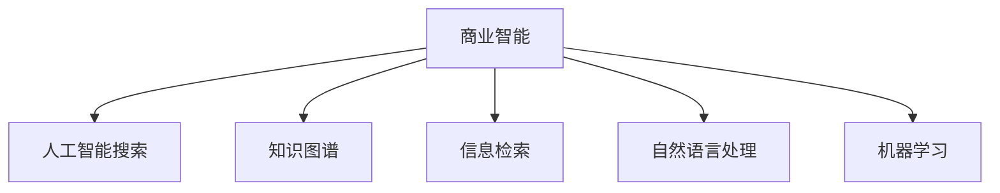

                 

## 1. 背景介绍

随着数据量的爆炸性增长，商业智能（BI）系统必须能够高效地处理和分析这些数据，以提供有价值的洞察。AI搜索技术作为一种强大且灵活的工具，在BI系统中扮演着重要角色。本文将探讨AI搜索在商业智能中的应用，并阐述其原理、技术和应用场景。

### 1.1 问题由来

商业智能（BI）系统的核心任务是帮助企业决策者从大量数据中提取有价值的信息，以便做出更加明智的决策。传统的BI系统主要依赖于统计分析和报告，但随着数据量的增加和数据源的多样化，传统方法已经难以满足需求。

### 1.2 问题核心关键点

商业智能中的AI搜索应用，即利用AI技术进行高效数据检索和信息获取，已经成为BI系统不可或缺的一部分。其关键点包括：

- **数据量巨大**：商业领域的数据量往往非常大，传统搜索方法无法有效处理。
- **多源异构数据**：商业数据来自不同系统，格式各异，需要统一处理。
- **查询复杂度高**：商业用户往往需要复杂的查询逻辑，传统搜索难以实现。
- **实时响应需求**：商业决策需要快速响应，搜索系统必须具备实时查询能力。

通过AI搜索技术，可以克服这些挑战，提高BI系统的效率和灵活性。

## 2. 核心概念与联系

### 2.1 核心概念概述

为更好地理解AI搜索在商业智能中的应用，本节将介绍几个关键概念：

- **商业智能（BI）**：利用数据分析和可视化技术，帮助企业决策者从大量数据中提取有价值的信息，以支持商业决策。
- **人工智能搜索（AI Search）**：利用AI技术进行数据检索和信息获取，通过自然语言处理、机器学习等技术，提升搜索效率和准确性。
- **知识图谱（Knowledge Graph）**：用于表示实体、关系和属性的图结构，帮助构建知识网络，支持高级搜索和推理。
- **信息检索（IR）**：利用算法和模型，从大量数据中快速检索相关信息。
- **自然语言处理（NLP）**：使计算机理解和处理人类语言的技术，支持语义理解和知识抽取。
- **机器学习（ML）**：利用数据训练模型，使其能够自主学习和改进。

这些概念之间的关系可以通过以下Mermaid流程图来展示：



这个流程图展示了大语言模型的核心概念及其之间的关系：

1. 商业智能通过AI搜索技术进行数据处理和分析，以提取有价值的信息。
2. 知识图谱提供结构化知识，支持高级搜索和推理。
3. 信息检索从大量数据中快速检索相关信息。
4. 自然语言处理使计算机理解和处理人类语言。
5. 机器学习利用数据训练模型，提升搜索效率和准确性。

## 3. 核心算法原理 & 具体操作步骤

### 3.1 算法原理概述

商业智能中的AI搜索主要基于信息检索（IR）和自然语言处理（NLP）技术。信息检索算法主要关注如何高效地从大量数据中检索相关信息，而NLP技术则用于理解和处理用户的自然语言查询。

### 3.2 算法步骤详解

AI搜索在商业智能中的应用，主要包括以下几个关键步骤：

**Step 1: 数据准备**
- 收集和整合来自不同系统的数据。
- 清洗和标准化数据，消除噪音和不一致性。
- 构建知识图谱，将数据转换为结构化的知识。

**Step 2: 自然语言理解**
- 通过NLP技术解析用户的自然语言查询。
- 识别查询中的实体、关系和属性，构建查询向量。

**Step 3: 知识图谱检索**
- 在知识图谱中搜索与查询向量最匹配的实体和关系。
- 利用图谱推理技术，扩展搜索范围，找到更多相关信息。

**Step 4: 信息检索**
- 在数据集中检索与查询向量最匹配的文档或记录。
- 根据查询要求，选择最相关的文档进行展示。

**Step 5: 结果排序与展示**
- 利用机器学习模型对检索结果进行排序。
- 展示最相关的搜索结果，并提供必要的元数据和上下文信息。

### 3.3 算法优缺点

AI搜索在商业智能中的优点包括：

- **高效性**：利用NLP和IR技术，可以快速处理大量数据。
- **灵活性**：能够处理复杂的查询逻辑，支持多种查询形式。
- **智能性**：利用机器学习模型，能够自主学习和改进。

同时，AI搜索也存在一些缺点：

- **计算复杂**：构建和维护知识图谱需要大量计算资源。
- **数据隐私**：大规模数据处理可能涉及隐私问题，需严格保护。
- **查询准确性**：复杂查询的准确性可能受到NLP和IR技术的影响。

### 3.4 算法应用领域

AI搜索在商业智能中的应用领域非常广泛，涵盖多个方面：

- **市场分析**：通过搜索和分析市场数据，帮助企业制定市场策略。
- **客户关系管理（CRM）**：搜索客户信息，支持客户细分和个性化营销。
- **运营分析**：搜索和分析运营数据，优化业务流程和资源配置。
- **财务分析**：搜索和分析财务数据，支持财务报告和预算管理。
- **供应链管理**：搜索和分析供应链数据，优化供应链管理。

## 4. 数学模型和公式 & 详细讲解 & 举例说明

### 4.1 数学模型构建

在商业智能中，AI搜索的数学模型主要基于信息检索和自然语言处理技术。以下以信息检索为例，介绍常见的数学模型。

**倒排索引模型**：
倒排索引是一种常用的IR模型，将文档内容映射为单词或短语的逆向索引。其数学模型为：

$$
\text{Inverted Index} = \{ (w, \{d_1, d_2, ..., d_n\}) \mid w \in \text{words} \}
$$

其中，$w$表示单词，$d$表示包含该单词的文档集合。

**向量空间模型**：
向量空间模型（VSM）是一种将文本转换为向量，用于计算相似度的模型。其数学模型为：

$$
\text{Doc} = \{ \text{words}, \text{tf-idf}\}
$$

其中，$\text{Doc}$表示文档，$\text{words}$表示文档中的单词，$\text{tf-idf}$表示单词的TF-IDF值。

### 4.2 公式推导过程

**TF-IDF计算公式**：
TF-IDF是向量空间模型中的关键指标，用于衡量单词在文档中的重要程度。其计算公式为：

$$
\text{TF-IDF}(w, d) = \text{TF}(w, d) \times \text{IDF}(w)
$$

其中，$\text{TF}(w, d)$表示单词$w$在文档$d$中的词频，$\text{IDF}(w)$表示单词$w$在语料库中的逆文档频率。

### 4.3 案例分析与讲解

**市场分析应用**：
在市场分析中，AI搜索可以帮助企业快速查找市场数据，分析市场趋势。假设企业需要分析某地区市场销售数据，AI搜索可以通过以下步骤实现：

1. **数据收集**：从不同系统（如ERP、CRM）中收集销售数据。
2. **数据清洗**：清洗数据，消除噪音和不一致性。
3. **构建知识图谱**：将销售数据转换为结构化的知识图谱。
4. **自然语言理解**：解析用户查询，构建查询向量。
5. **知识图谱检索**：在知识图谱中搜索与查询向量最匹配的实体和关系。
6. **信息检索**：在销售数据集中检索与查询向量最匹配的文档。
7. **结果展示**：展示最相关的搜索结果，并提供必要的元数据和上下文信息。

## 5. 项目实践：代码实例和详细解释说明

### 5.1 开发环境搭建

在进行AI搜索实践前，我们需要准备好开发环境。以下是使用Python进行ELK Stack开发的环境配置流程：

1. 安装Elasticsearch和Logstash：
   ```bash
   wget https://artifacts.elastic.co/downloads/elasticsearch/elasticsearch-7.10.1-amd64.deb
   sudo dpkg -i elasticsearch-7.10.1-amd64.deb
   sudo apt-get update && sudo apt-get install logstash
   ```

2. 安装Kibana：
   ```bash
   wget https://artifacts.elastic.co/downloads/kibana/kibana-7.10.1-x64.deb
   sudo dpkg -i kibana-7.10.1-x64.deb
   ```

3. 配置环境变量：
   ```bash
   export ELASTICSEARCH_HOME=/usr/share/elasticsearch
   export PATH=$PATH:$ELASTICSEARCH_HOME/bin
   ```

### 5.2 源代码详细实现

这里我们以Elasticsearch为例，展示如何进行AI搜索实践。

**安装Elasticsearch**
```bash
cd /usr/share/elasticsearch
./bin/elasticsearch
```

**创建索引**
```bash
curl -X PUT 'http://localhost:9200/my_index'
```

**插入数据**
```bash
curl -X POST 'http://localhost:9200/my_index/_doc/1' -H 'Content-Type: application/json' -d '{"name": "John Smith", "age": 30}'
```

**查询数据**
```bash
curl -X GET 'http://localhost:9200/my_index/_search?q="John Smith"'
```

### 5.3 代码解读与分析

**Elasticsearch使用**
- **创建索引**：使用`PUT`方法创建索引。
- **插入数据**：使用`POST`方法向索引插入文档。
- **查询数据**：使用`GET`方法查询数据。

**查询优化**
- **分页查询**：使用`size`参数设置分页大小。
- **排序查询**：使用`sort`参数指定排序规则。
- **过滤查询**：使用`filter`参数过滤不相关的数据。

**分析器**
- **标准分析器**：对文本进行分词、词形还原等处理。
- **自定义分析器**：根据需求自定义分析器，如分词、标记、停用词等。

**查询 DSL**
- **布尔查询**：使用`bool`查询构造复杂的布尔逻辑。
- **全文查询**：使用`match`或`match_phrase`查询全文匹配。
- **字段查询**：使用`term`或`range`查询特定字段。

## 6. 实际应用场景

### 6.1 智能客户服务

在智能客户服务中，AI搜索技术可以用于自动回复客户查询，提供实时支持。例如，通过搜索和分析客户历史数据，AI系统可以快速响应客户的常见问题，提供个性化服务。

### 6.2 供应链管理

在供应链管理中，AI搜索技术可以用于监控供应链数据，及时发现异常和风险。例如，通过搜索和分析供应链数据，AI系统可以预测库存需求，优化供应链配置。

### 6.3 市场分析

在市场分析中，AI搜索技术可以用于快速检索和分析市场数据，支持企业制定市场策略。例如，通过搜索和分析市场数据，AI系统可以发现市场趋势，优化产品定位。

## 7. 工具和资源推荐

### 7.1 学习资源推荐

为了帮助开发者系统掌握AI搜索的理论基础和实践技巧，这里推荐一些优质的学习资源：

1. **《搜索引擎原理与实践》**：介绍了搜索引擎的核心技术和应用，涵盖了信息检索和自然语言处理等方面。
2. **《自然语言处理与深度学习》**：详细介绍了NLP技术的原理和应用，包括词向量、序列模型、神经网络等。
3. **Elasticsearch官方文档**：提供了ELK Stack的详细配置和使用方法，是学习和实践Elasticsearch的必备资料。
4. **Apache Solr**：提供了一套强大的IR系统，支持多种查询形式和索引管理。
5. **NLP工具库**：如NLTK、spaCy等，提供了丰富的NLP功能和模型。

### 7.2 开发工具推荐

高效的开发离不开优秀的工具支持。以下是几款用于AI搜索开发的常用工具：

1. **Elasticsearch**：一种流行的搜索引擎，支持分布式部署和高级查询功能。
2. **Logstash**：一种数据管道工具，用于收集、处理和分析日志数据。
3. **Kibana**：一种可视化工具，用于探索和展示Elasticsearch中的数据。
4. **Spark SQL**：一种用于处理大规模数据的SQL引擎，支持复杂的查询和数据分析。
5. **Amazon Athena**：一种基于云的数据仓库服务，支持大规模数据分析和查询。

### 7.3 相关论文推荐

AI搜索技术的发展得益于学界的持续研究。以下是几篇奠基性的相关论文，推荐阅读：

1. **《ElasticSearch: A Real-time Search Engine》**：介绍Elasticsearch的核心原理和应用。
2. **《An In-Depth Look at Logstash》**：详细介绍Logstash的配置和使用方法。
3. **《Kibana: The Visualization Engine for Elasticsearch》**：介绍Kibana的核心功能和使用方法。
4. **《Search-Based Analytics for Databases》**：讨论了基于搜索的数据分析技术。
5. **《Natural Language Processing in Industry》**：讨论了NLP在实际应用中的技术和方法。

## 8. 总结：未来发展趋势与挑战

### 8.1 总结

本文对AI搜索在商业智能中的应用进行了全面系统的介绍。首先阐述了AI搜索技术在商业智能中的重要作用，并详细讲解了其原理、技术和应用场景。通过系统的梳理，可以看出，AI搜索技术已经成为BI系统不可或缺的一部分，极大地提高了数据检索和信息获取的效率和准确性。

### 8.2 未来发展趋势

展望未来，AI搜索技术将呈现以下几个发展趋势：

1. **智能化提升**：随着深度学习和大数据技术的发展，AI搜索将更加智能，能够更好地理解和处理复杂查询。
2. **多模态融合**：未来的AI搜索将更多地融合多模态数据，支持图像、语音、文本等多种形式的信息检索。
3. **实时性增强**：实时数据流的处理将成为AI搜索的重要应用场景，如智能客服、实时监控等。
4. **隐私保护**：数据隐私问题将受到更多关注，未来的AI搜索技术将更加注重隐私保护和数据安全。
5. **自动化优化**：未来的AI搜索将更多地采用自动化方法，如自动化索引构建、查询优化等。

### 8.3 面临的挑战

尽管AI搜索技术在商业智能中的应用已经取得了一定的成果，但在迈向更加智能化、普适化应用的过程中，它仍面临着诸多挑战：

1. **计算资源瓶颈**：大规模数据处理需要强大的计算资源，如何优化算法和系统架构，提高处理效率，是一个重要问题。
2. **数据质量问题**：数据源的多样性和不一致性可能导致数据质量问题，如何处理和清洗数据，是一个重要挑战。
3. **查询准确性**：复杂查询的准确性可能受到NLP和IR技术的影响，如何提升查询准确性，是一个重要问题。
4. **隐私和安全问题**：数据隐私和安全问题将受到更多关注，如何保护用户隐私和数据安全，是一个重要挑战。

### 8.4 研究展望

未来的研究需要在以下几个方面寻求新的突破：

1. **多模态融合技术**：融合图像、语音、文本等多种形式的信息，提升AI搜索的智能化水平。
2. **自动化优化技术**：采用自动化方法，如自动化索引构建、查询优化等，提升AI搜索的效率和准确性。
3. **隐私保护技术**：采用隐私保护技术，如数据匿名化、差分隐私等，保障用户隐私和安全。
4. **智能查询技术**：采用智能查询技术，如自然语言理解和知识图谱推理，提升查询的灵活性和准确性。
5. **实时处理技术**：采用实时处理技术，如流式处理、分布式计算等，支持实时数据流的处理。

这些研究方向的探索，将引领AI搜索技术迈向更高的台阶，为商业智能系统带来更大的价值。

## 9. 附录：常见问题与解答

**Q1：AI搜索在商业智能中主要解决哪些问题？**

A: AI搜索在商业智能中主要解决以下几个问题：

1. **数据量大**：AI搜索能够高效处理和分析大量数据。
2. **查询复杂**：AI搜索能够处理复杂的查询逻辑，支持多种查询形式。
3. **实时性要求**：AI搜索能够提供实时查询和分析。

**Q2：AI搜索在商业智能中如何保证查询的准确性？**

A: AI搜索在商业智能中保证查询的准确性主要通过以下几个方面：

1. **分词技术**：使用分词技术将文本分割成单词或短语，提高查询的准确性。
2. **TF-IDF计算**：使用TF-IDF计算单词在文档中的重要程度，提升查询的相关性。
3. **布尔查询**：使用布尔查询构造复杂的查询逻辑，提高查询的准确性。
4. **自然语言处理**：使用自然语言处理技术，理解用户查询的语义，提高查询的准确性。

**Q3：AI搜索在商业智能中如何保证数据的安全和隐私？**

A: AI搜索在商业智能中保证数据的安全和隐私主要通过以下几个方面：

1. **数据匿名化**：对敏感数据进行匿名化处理，保护用户隐私。
2. **访问控制**：使用访问控制技术，限制对敏感数据的访问。
3. **数据加密**：对数据进行加密存储和传输，保护数据安全。
4. **隐私保护算法**：使用隐私保护算法，如差分隐私、联邦学习等，保护数据隐私。

**Q4：AI搜索在商业智能中如何优化查询效率？**

A: AI搜索在商业智能中优化查询效率主要通过以下几个方面：

1. **倒排索引**：使用倒排索引技术，快速检索相关文档。
2. **分页查询**：使用分页查询技术，提高查询效率。
3. **缓存技术**：使用缓存技术，提高查询响应速度。
4. **分布式查询**：使用分布式查询技术，提高查询性能。

---

作者：禅与计算机程序设计艺术 / Zen and the Art of Computer Programming

