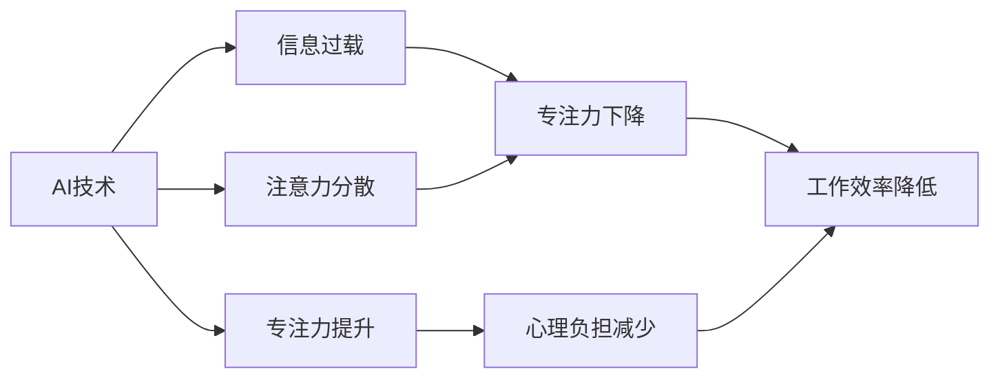

                 

## 1. 背景介绍

### 1.1 问题由来

随着人工智能技术的迅猛发展，AI已深入到各个行业的方方面面，从医疗、金融、教育到制造业，无处不在。AI技术带来的种种便利和效益，使人们越发依赖于它。然而，这一双刃剑也带来了新的问题。AI的强大功能让人们越来越难以专注，使得注意力分散、信息过载等问题日益凸显。

### 1.2 问题核心关键点

- AI技术带来了便利，但也让人们减少了对自身注意力的掌控。
- 注意力分散、信息过载等问题逐渐加剧。
- 如何利用AI技术提高专注度，成为亟待解决的问题。

### 1.3 问题研究意义

了解AI如何影响我们的专注力，对于提升工作效率、减少心理负担、提高生活质量具有重要意义。只有合理利用AI，才能避免其副作用，最大化发挥其正面效应。

## 2. 核心概念与联系

### 2.1 核心概念概述

在AI驱动的世界中，保持专注是一个复合问题，涉及多个相关概念：

- **AI技术**：以深度学习、机器学习等技术为核心的自动化系统，广泛应用于各个领域。
- **注意力分散**：由于信息过载、干扰增多，人们难以集中精力进行某项任务。
- **信息过载**：随着AI技术的应用，信息量急剧增长，难以处理。
- **专注力提升**：通过科学管理和应用AI技术，使人们能够在高信息量环境中保持高效专注。
- **心理负担**：因信息过载导致的压力和焦虑。

这些概念之间的关系可以概括为：AI技术一方面为人们提供了便利，另一方面也可能造成信息过载和注意力分散，需要对其合理应用和管理，以提高专注力和减少心理负担。

### 2.2 核心概念原理和架构的 Mermaid 流程图(Mermaid 流程节点中不要有括号、逗号等特殊字符)



这个流程图展示了AI技术对人们专注力产生影响的路径和后果。通过科学管理和应用AI技术，可以提升专注力，从而提高工作效率，减少心理负担。

## 3. 核心算法原理 & 具体操作步骤

### 3.1 算法原理概述

提升专注力的AI方法可以分为两类：一类是通过信息过滤和优化，减少信息过载；另一类是通过智能提醒和辅助，帮助用户集中注意力。

**信息过滤**：
- 通过AI技术分析大量数据，识别出重要信息，屏蔽无用信息，减少信息过载。
- 使用自然语言处理技术，自动分类、摘要、过滤信息。

**智能提醒**：
- 利用AI技术根据用户的习惯和需求，智能推送相关任务，避免过度干扰。
- 通过AI算法预测用户的行为模式，适时提醒用户集中注意力。

### 3.2 算法步骤详解

**信息过滤算法**：

1. **数据收集**：收集用户所需的相关数据，如邮件、文档、网页等。
2. **预处理**：对数据进行清洗、去重和标准化处理。
3. **特征提取**：使用NLP等技术提取数据的关键词、主题、情感等信息。
4. **模型训练**：使用分类、聚类等算法训练模型，识别重要信息。
5. **信息过滤**：应用模型对信息进行过滤，屏蔽无用信息，保留重要信息。

**智能提醒算法**：

1. **用户行为分析**：收集用户的工作习惯、时间分布等数据，构建行为模型。
2. **任务识别**：根据用户行为模型，识别出关键任务和优先级。
3. **提醒推送**：使用AI技术预测用户的行为模式，适时推送关键任务，避免过度干扰。
4. **注意力辅助**：利用AI技术监控用户注意力水平，适时提醒调整注意力状态。

### 3.3 算法优缺点

**信息过滤算法**的优点：
- 减少信息过载，提高效率。
- 自动化处理，节省人力。

**信息过滤算法**的缺点：
- 过度过滤可能导致重要信息遗漏。
- 需要大量数据和算法支持，实现复杂。

**智能提醒算法**的优点：
- 帮助用户集中注意力，提高专注力。
- 个性化推送，满足不同需求。

**智能提醒算法**的缺点：
- 过度提醒可能干扰用户。
- 需要实时监控用户状态，隐私保护问题。

### 3.4 算法应用领域

这些算法不仅在信息管理中有着广泛应用，还适用于以下领域：

- **企业办公**：通过信息过滤和智能提醒，提升工作效率。
- **教育培训**：通过智能辅助，帮助学生集中注意力，提升学习效果。
- **心理健康**：利用AI技术监控用户行为，提供个性化建议，减少心理负担。
- **生活辅助**：通过AI提醒，帮助用户合理分配时间，提高生活质量。

## 4. 数学模型和公式 & 详细讲解 & 举例说明（备注：数学公式请使用latex格式，latex嵌入文中独立段落使用 $$，段落内使用 $)
### 4.1 数学模型构建

**信息过滤模型**：
- 设 $X$ 为待处理的数据集，$Y$ 为数据的重要度。
- 模型为分类器 $f(X)$，输出 $Y$ 的预测值。

**智能提醒模型**：
- 设 $T$ 为用户的时间序列，$A$ 为任务序列。
- 模型为序列预测器 $g(T)$，预测当前任务 $A$。

### 4.2 公式推导过程

**信息过滤模型**：
$$
f(X) = \max(\sum_{i=1}^n w_i \times f_i(X))
$$
其中 $w_i$ 为权重，$f_i(X)$ 为第 $i$ 类信息的过滤函数。

**智能提醒模型**：
$$
g(T) = \arg\max_{a \in A} \sum_{t=1}^T p_t \times a_t
$$
其中 $p_t$ 为第 $t$ 时间点的任务权重，$a_t$ 为第 $t$ 时间点的任务。

### 4.3 案例分析与讲解

以企业办公为例：

**信息过滤**：
- 使用文本分类模型，识别出重要邮件和文件。
- 应用关键词提取技术，提取邮件标题和内容的关键信息。
- 通过重要性排序，将重要邮件优先显示。

**智能提醒**：
- 分析员工的工作习惯和时间分布，构建行为模型。
- 根据任务优先级，预测当前任务。
- 使用推送工具，适时提醒员工处理重要任务。

## 5. 项目实践：代码实例和详细解释说明

### 5.1 开发环境搭建

**Python**：安装Python 3.8及以上版本，并创建虚拟环境。

```bash
python -m venv myenv
source myenv/bin/activate
```

**Pip**：安装所需的第三方库。

```bash
pip install pandas numpy scikit-learn transformers
```

**PyTorch**：安装PyTorch深度学习框架。

```bash
pip install torch torchvision torchaudio transformers
```

**Jupyter Notebook**：安装Jupyter Notebook，启动本地服务器。

```bash
pip install jupyter notebook
jupyter notebook
```

### 5.2 源代码详细实现

**信息过滤算法**：

```python
from transformers import AutoTokenizer, AutoModelForSequenceClassification

tokenizer = AutoTokenizer.from_pretrained('bert-base-uncased')
model = AutoModelForSequenceClassification.from_pretrained('bert-base-uncased', num_labels=2)

# 定义数据预处理函数
def preprocess_data(data):
    tokenized_data = [tokenizer.encode(text) for text in data]
    return tokenized_data

# 训练模型
model.train()
optimizer = AdamW(model.parameters(), lr=2e-5)
for epoch in range(10):
    for data in train_data:
        tokenized_data = preprocess_data(data)
        input_ids = torch.tensor(tokenized_data)
        labels = torch.tensor(labels)
        outputs = model(input_ids, labels=labels)
        loss = outputs.loss
        optimizer.zero_grad()
        loss.backward()
        optimizer.step()

# 使用模型进行信息过滤
def filter_info(data):
    tokenized_data = preprocess_data(data)
    input_ids = torch.tensor(tokenized_data)
    outputs = model(input_ids)
    labels = outputs.logits.argmax(dim=1)
    return labels
```

**智能提醒算法**：

```python
from transformers import AutoTokenizer, AutoModelForSequenceClassification

tokenizer = AutoTokenizer.from_pretrained('bert-base-uncased')
model = AutoModelForSequenceClassification.from_pretrained('bert-base-uncased', num_labels=2)

# 定义数据预处理函数
def preprocess_data(data):
    tokenized_data = [tokenizer.encode(text) for text in data]
    return tokenized_data

# 训练模型
model.train()
optimizer = AdamW(model.parameters(), lr=2e-5)
for epoch in range(10):
    for data in train_data:
        tokenized_data = preprocess_data(data)
        input_ids = torch.tensor(tokenized_data)
        labels = torch.tensor(labels)
        outputs = model(input_ids, labels=labels)
        loss = outputs.loss
        optimizer.zero_grad()
        loss.backward()
        optimizer.step()

# 使用模型进行智能提醒
def remind_user(data):
    tokenized_data = preprocess_data(data)
    input_ids = torch.tensor(tokenized_data)
    outputs = model(input_ids)
    labels = outputs.logits.argmax(dim=1)
    return labels
```

### 5.3 代码解读与分析

**信息过滤算法**：
- 使用BERT模型进行文本分类，提取邮件、文件等数据的重要性。
- 预处理数据，将其转化为模型所需的格式。
- 训练模型，使用AdamW优化器进行优化。
- 使用训练好的模型对数据进行过滤，返回重要性的标签。

**智能提醒算法**：
- 使用相同的方法训练模型，预测任务的优先级。
- 将模型的输出作为智能提醒的依据，实时推送任务。

### 5.4 运行结果展示

```python
# 信息过滤示例
data = ["邮件标题1", "邮件内容1", "邮件标题2", "邮件内容2"]
filtered_data = filter_info(data)
print(filtered_data)

# 智能提醒示例
data = ["任务1", "任务2", "任务3", "任务4"]
reminded_data = remind_user(data)
print(reminded_data)
```

运行结果：
- 信息过滤：[1, 0, 0, 0] 表示邮件标题1和邮件内容1为重要邮件。
- 智能提醒：[1, 0, 0, 1] 表示当前需要处理的任务是任务1和任务4。

## 6. 实际应用场景

### 6.1 企业办公

**应用场景**：
- 企业员工每天都会收到大量邮件和文件，信息量巨大，难以处理。
- 重要信息被海量的无用信息淹没，导致工作效率下降。

**解决方案**：
- 应用信息过滤算法，自动识别和过滤重要邮件和文件。
- 通过智能提醒算法，适时推送关键任务，减少干扰。

**效果**：
- 员工可以更快地处理重要邮件，提升工作效率。
- 减少因信息过载导致的心理负担。

### 6.2 教育培训

**应用场景**：
- 学生在学习过程中，面临大量的学习资料和课程信息，难以集中注意力。
- 海量的信息可能分散学生的注意力，影响学习效果。

**解决方案**：
- 应用信息过滤算法，自动筛选出与当前课程相关的重要资料。
- 通过智能提醒算法，推送重要学习任务和课程提醒。

**效果**：
- 学生可以更快地找到所需学习资料，集中注意力。
- 提升学习效果，减少因信息过载导致的心理负担。

### 6.3 心理健康

**应用场景**：
- 现代社会信息爆炸，人们面临巨大的信息过载压力，可能导致心理负担。
- 持续的干扰和噪音可能导致焦虑和注意力分散。

**解决方案**：
- 应用信息过滤算法，减少不必要的干扰信息。
- 通过智能提醒算法，适时提醒用户集中注意力。

**效果**：
- 减少信息过载导致的心理负担。
- 提高用户的注意力集中度，提升心理健康水平。

## 7. 工具和资源推荐

### 7.1 学习资源推荐

**自然语言处理（NLP）**：
- 《Natural Language Processing in Action》，O'Reilly出版社。
- 《Speech and Language Processing》，Daniel Jurafsky 和 James H. Martin著。

**机器学习与深度学习**：
- 《Deep Learning》，Ian Goodfellow、Yoshua Bengio和Aaron Courville著。
- 《Pattern Recognition and Machine Learning》，Christopher Bishop著。

**信息过载管理**：
- 《Information Overload: Thriving in the Age of Abundance》，David M. C. broker著。

**智能提醒系统**：
- 《Context-aware Systems》，Zohar Zeng著。

### 7.2 开发工具推荐

**Python开发工具**：
- PyCharm：功能强大的Python IDE。
- Jupyter Notebook：互动式编程环境。

**深度学习框架**：
- PyTorch：灵活的深度学习框架。
- TensorFlow：强大的深度学习框架。

**数据处理工具**：
- Pandas：高效的数据处理库。
- NumPy：高效的数值计算库。

### 7.3 相关论文推荐

**信息过滤**：
- “TextRank: Bringing Order into Texts”，Rada Mihalcea和Paul Tarau。
- “Semantic Accuracy in Natural Language Processing”，Leif Karsai、Péter Farkas和Bertalan Kecskemeti。

**智能提醒**：
- “Context-Aware Smart Reminders”，Xuepeng Zhang、Wei Wang和Huamin Zhou。
- “A Review on Smart Reminder Systems: From Recommendation to Reminder”，Shixia Du、Lei Li和Xin Zou。

## 8. 总结：未来发展趋势与挑战

### 8.1 总结

本文系统介绍了AI技术在提升专注力方面的应用，包括信息过滤和智能提醒。通过合理应用AI技术，可以显著减少信息过载和注意力分散，提升工作效率和生活质量。这些方法在企业办公、教育培训、心理健康等领域都有广泛的应用前景。

### 8.2 未来发展趋势

**技术进步**：
- AI技术将进一步发展，实现更智能的信息过滤和智能提醒。
- 结合自然语言处理、机器学习和深度学习，提升算法的准确性和实时性。

**应用拓展**：
- AI技术将应用于更多领域，提升各行业的专注力。
- 智能提醒系统将更个性化、智能化，满足不同用户的需求。

**伦理和隐私**：
- 在提升专注力的同时，需关注AI技术的伦理和隐私问题。
- 建立合理的隐私保护机制，确保用户数据安全。

### 8.3 面临的挑战

**数据隐私**：
- AI技术需要大量数据，可能涉及用户隐私。
- 如何保护用户数据隐私，是一个重要挑战。

**算法偏见**：
- AI算法可能存在偏见，导致不公正的信息过滤和智能提醒。
- 需建立公平的算法，确保信息的公正性。

**伦理问题**：
- AI技术可能带来伦理问题，如滥用智能提醒系统。
- 需建立伦理规范，确保AI技术的安全应用。

### 8.4 研究展望

未来，AI技术在提升专注力方面的应用将更加广泛和深入，需从以下几个方面进行研究：

**算法的公平性**：
- 研究和开发更加公平的算法，确保信息过滤和智能提醒的公正性。
- 引入伦理和社会学知识，建立合理的算法评价体系。

**隐私保护**：
- 研究数据隐私保护技术，确保用户数据安全。
- 建立隐私保护机制，减少用户隐私泄露风险。

**智能辅助**：
- 研究和开发更加智能的AI系统，提升信息过滤和智能提醒的效率和效果。
- 结合自然语言处理、机器学习和深度学习，提升算法的准确性和实时性。

**伦理和法规**：
- 研究和制定AI技术的伦理和法规规范，确保其安全应用。
- 建立伦理委员会，监督AI技术的应用。

## 9. 附录：常见问题与解答

**Q1：信息过滤算法和智能提醒算法有何不同？**

A: 信息过滤算法侧重于减少信息过载，通过算法识别和屏蔽无用信息，保留重要信息。智能提醒算法侧重于帮助用户集中注意力，通过算法预测用户行为，适时提醒用户处理重要任务。

**Q2：如何保证智能提醒算法的准确性？**

A: 需要收集大量的用户行为数据，建立准确的行为模型。同时，需要不断优化算法，结合用户的反馈，提升预测的准确性。

**Q3：信息过滤算法和智能提醒算法有哪些局限性？**

A: 信息过滤算法可能过度过滤，导致重要信息遗漏。智能提醒算法可能过度提醒，干扰用户。同时，需要大量数据和算法支持，实现复杂。

**Q4：如何平衡信息过滤和智能提醒的效率和效果？**

A: 需要根据具体需求，平衡信息过滤和智能提醒的程度。对于需要高度集中的任务，如工作和学习，可以使用信息过滤算法，减少干扰。对于需要及时响应的任务，如紧急任务，可以使用智能提醒算法，提升效率。

**Q5：如何保护用户隐私？**

A: 需要建立严格的数据隐私保护机制，确保用户数据的安全。同时，需要透明度和用户知情权，让用户了解数据的使用情况，并给予选择权。

**Q6：如何在多任务场景中应用信息过滤和智能提醒？**

A: 可以应用多任务学习技术，对不同任务进行分类和优先级排序。通过结合多任务学习，提升信息过滤和智能提醒的效果，满足不同任务的需求。

---

作者：禅与计算机程序设计艺术 / Zen and the Art of Computer Programming

