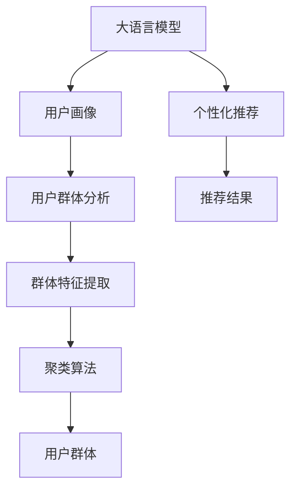

                 

# 基于LLM的推荐系统用户群体分析

> 关键词：大语言模型,推荐系统,用户群体分析,个性化推荐,用户画像,深度学习

## 1. 背景介绍

在智能推荐系统领域，构建用户画像、理解用户需求是实现个性化推荐的关键。传统的方法往往依赖静态的用户标签和行为记录，难以捕捉用户的动态变化和多样性需求。近年来，随着深度学习技术的发展，大语言模型（Large Language Model，LLM）因其强大的语言理解和生成能力，成为一种新的用户群体分析工具。本文将探讨如何利用大语言模型对推荐系统用户群体进行分析，从而实现更加个性化、精准的推荐服务。

## 2. 核心概念与联系

### 2.1 核心概念概述

为更好地理解基于大语言模型进行用户群体分析的方法，本节将介绍几个密切相关的核心概念：

- 大语言模型(Large Language Model, LLM)：如GPT、BERT等，通过在大量文本数据上自监督预训练获得语言模型，具备强大的语言理解能力。
- 用户画像(User Persona)：对用户特征和需求的综合描述，包括基本属性、兴趣偏好、行为习惯等。
- 个性化推荐系统(Personalized Recommendation System)：根据用户画像，推荐个性化的内容或商品，提升用户体验和满意度。
- 深度学习(Deep Learning)：通过神经网络模型自动学习特征，完成复杂任务的高级机器学习方法。
- 自然语言处理(Natural Language Processing, NLP)：使计算机能够理解和生成人类自然语言的技术。
- 用户群体分析(User Group Analysis)：对用户群体的特征和行为进行分类、聚类、统计等分析工作，帮助理解不同用户群体的共性和差异。

这些核心概念之间的逻辑关系可以通过以下Mermaid流程图来展示：



这个流程图展示了大语言模型在推荐系统中的应用过程：

1. 大语言模型通过预训练获得语言理解能力，用于用户画像的生成和理解。
2. 用户画像反映了用户的多维特征和偏好，帮助个性化推荐系统进行推荐。
3. 用户群体分析通过聚类等方法，对用户进行分类，更全面地理解不同用户群体。
4. 推荐结果基于用户画像和群体特征，实现精准推荐。

## 3. 核心算法原理 & 具体操作步骤

### 3.1 算法原理概述

基于大语言模型的用户群体分析方法，主要利用语言模型对用户描述文本进行编码和分类。具体步骤如下：

1. 收集用户描述信息，如用户画像、行为日志等，转化为文本形式。
2. 使用大语言模型对文本进行编码，得到向量表示。
3. 应用聚类、分类等机器学习方法，对用户进行分组或分类。
4. 分析不同用户群体的特征和行为，提取有价值的信息。
5. 将用户群体信息应用于个性化推荐系统，提升推荐效果。

该方法的核心理念是：语言模型能够理解和处理自然语言，提取文本中的高维语义信息，用于用户群体分析。

### 3.2 算法步骤详解

#### 3.2.1 数据收集与预处理

首先需要收集用户的文本描述数据，包括但不限于：
- 用户画像：用户的基本信息、兴趣标签、历史行为等。
- 行为日志：用户在平台上的浏览、点击、购买等行为记录。
- 评论和反馈：用户在平台上的评论、评分、意见等反馈信息。

收集到的数据需要经过预处理，转换为文本形式。常见的预处理方法包括：
- 文本清洗：去除无用字符、噪声信息等。
- 分词和标准化：将文本转化为小写，进行分词和去除停用词等标准化处理。
- 数据拼接：将不同来源的文本数据拼接在一起，形成统一的用户描述文本。

#### 3.2.2 大语言模型编码

接下来，使用大语言模型对文本进行编码，得到向量表示。常用的编码方法包括：
- 使用预训练的BERT、GPT等语言模型，对文本进行编码。
- 将编码结果转化为向量形式，供后续分析使用。

#### 3.2.3 用户群体分析

应用机器学习算法对用户进行分类和聚类，得到不同的用户群体。常用的方法包括：
- 基于密度的聚类算法：如DBSCAN、K-means等。
- 基于距离的聚类算法：如层次聚类、谱聚类等。
- 基于密度和距离的混合聚类算法：如OPTICS等。
- 基于图的聚类算法：如Louvain等。
- 基于模型的聚类算法：如高斯混合模型、隐马尔可夫模型等。

#### 3.2.4 特征提取与分析

对不同用户群体提取特征，分析其行为和偏好。常用的特征提取方法包括：
- 统计特征：如年龄、性别、地域、访问时间等。
- 行为特征：如浏览次数、点击率、购买金额等。
- 兴趣特征：如标签、类别、关键词等。
- 社交特征：如关注好友、转发次数、社交关系等。

#### 3.2.5 推荐系统优化

将用户群体分析结果应用于个性化推荐系统，优化推荐结果。常用的推荐方法包括：
- 协同过滤推荐：根据用户和物品的历史行为，推荐相似的物品。
- 基于内容的推荐：根据物品的特征，推荐与目标用户匹配的物品。
- 混合推荐：结合协同过滤和基于内容的推荐，提升推荐效果。
- 深度推荐：使用深度学习模型，对用户行为进行建模，实现精准推荐。

### 3.3 算法优缺点

#### 3.3.1 优点

1. 语言模型强大的语言理解能力，能够处理复杂的文本数据，提取高维语义信息。
2. 用户群体分析结果更加全面和精细，能够捕捉用户的多维特征和行为变化。
3. 推荐系统更加个性化，提升用户体验和满意度。
4. 数据需求相对较少，能够基于用户描述数据进行高效分析。

#### 3.3.2 缺点

1. 对文本数据的依赖较大，数据质量直接影响分析结果。
2. 模型复杂度高，需要大量计算资源进行训练和推理。
3. 对文本数据的噪声敏感，需要额外的数据清洗和预处理步骤。
4. 用户群体分类和聚类的结果需要专家验证和调整，存在一定的主观性。
5. 推荐系统的效果依赖于用户群体分析的准确性，需要持续优化和迭代。

### 3.4 算法应用领域

基于大语言模型的用户群体分析方法，在以下领域中有着广泛的应用：

1. 电商推荐系统：根据用户画像和行为数据，推荐商品和广告，提升转化率和用户粘性。
2. 新闻内容推荐：分析用户对新闻文章的兴趣，推荐相关内容，提高用户参与度。
3. 视频内容推荐：提取用户对视频的兴趣和行为特征，推荐个性化视频内容，增加用户观看时长。
4. 社交媒体推荐：分析用户社交行为和兴趣，推荐相关话题和内容，提升用户互动和活跃度。
5. 金融理财推荐：根据用户财务数据和行为特征，推荐理财产品和投资策略，优化用户资产配置。
6. 健康医疗推荐：分析用户健康数据和行为，推荐健康管理方案和医疗产品，提升用户健康水平。

## 4. 数学模型和公式 & 详细讲解 & 举例说明

### 4.1 数学模型构建

假设用户描述文本为 $X=\{x_1,x_2,...,x_n\}$，其中 $x_i$ 表示第 $i$ 个用户的文本描述，$n$ 表示用户总数。大语言模型将文本 $X$ 编码为向量 $V=\{v_1,v_2,...,v_n\}$，其中 $v_i$ 表示第 $i$ 个用户的向量表示。用户群体分析的目标是，将用户 $X$ 划分为 $K$ 个群体 $G=\{G_1,G_2,...,G_K\}$，并计算每个群体 $G_k$ 的特征 $F_k$。

### 4.2 公式推导过程

设大语言模型对文本 $x_i$ 的编码为 $v_i \in \mathbb{R}^d$，其中 $d$ 为向量维度。用户群体分析步骤如下：

1. 数据预处理：将文本数据 $X$ 转化为标准化形式，去除噪声和停用词，形成预处理后的文本数据 $X'$。
2. 大语言模型编码：使用预训练的大语言模型 $M$，对文本 $X'$ 进行编码，得到向量表示 $V=\{v_1,v_2,...,v_n\}$。
3. 聚类分析：应用聚类算法 $C$，对向量 $V$ 进行聚类，得到 $K$ 个群体 $G=\{G_1,G_2,...,G_K\}$。
4. 特征提取：计算每个群体 $G_k$ 的特征 $F_k$，常用的特征提取方法包括统计特征、行为特征、兴趣特征等。
5. 群体优化：根据特征 $F_k$，对推荐系统进行优化，提升推荐效果。

### 4.3 案例分析与讲解

假设某电商平台的推荐系统，需要分析用户的购买行为和兴趣，推荐个性化的商品。以下是具体的案例分析：

1. 数据收集：收集用户的购物记录、浏览历史、搜索记录等文本数据。
2. 数据预处理：去除无效字段，标准化文本数据，拼接成用户描述文本。
3. 大语言模型编码：使用BERT模型对用户描述文本进行编码，得到向量表示。
4. 聚类分析：应用K-means算法，对向量进行聚类，得到5个用户群体。
5. 特征提取：对每个用户群体提取统计特征（如年龄、性别）、行为特征（如浏览次数、购买金额）和兴趣特征（如商品类别、品牌偏好）。
6. 推荐优化：根据用户群体特征，调整推荐策略，提升推荐效果。

## 5. 项目实践：代码实例和详细解释说明

### 5.1 开发环境搭建

在进行用户群体分析实践前，我们需要准备好开发环境。以下是使用Python进行PyTorch开发的环境配置流程：

1. 安装Anaconda：从官网下载并安装Anaconda，用于创建独立的Python环境。

2. 创建并激活虚拟环境：
```bash
conda create -n pytorch-env python=3.8 
conda activate pytorch-env
```

3. 安装PyTorch：根据CUDA版本，从官网获取对应的安装命令。例如：
```bash
conda install pytorch torchvision torchaudio cudatoolkit=11.1 -c pytorch -c conda-forge
```

4. 安装Transformer库：
```bash
pip install transformers
```

5. 安装各类工具包：
```bash
pip install numpy pandas scikit-learn matplotlib tqdm jupyter notebook ipython
```

完成上述步骤后，即可在`pytorch-env`环境中开始项目实践。

### 5.2 源代码详细实现

以下是基于大语言模型的用户群体分析代码实现，以电商推荐系统为例：

```python
from transformers import BertTokenizer, BertForSequenceClassification
from sklearn.cluster import KMeans
import numpy as np
import pandas as pd

# 数据预处理
def preprocess_data(data):
    # 去重、去停用词、标准化等预处理
    # 拼接成统一的用户描述文本
    return processed_text

# 大语言模型编码
def encode_text(texts, model):
    tokenizer = BertTokenizer.from_pretrained('bert-base-cased')
    encoded_texts = tokenizer(texts, return_tensors='pt', padding='max_length', truncation=True)
    input_ids = encoded_texts['input_ids']
    attention_mask = encoded_texts['attention_mask']
    with torch.no_grad():
        outputs = model(input_ids, attention_mask=attention_mask)
    encoded_vecs = outputs[0].cpu().numpy()
    return encoded_vecs

# 聚类分析
def cluster_texts(encoded_vecs, num_clusters):
    kmeans = KMeans(n_clusters=num_clusters)
    kmeans.fit(encoded_vecs)
    cluster_labels = kmeans.labels_
    return cluster_labels

# 特征提取
def extract_features(cluster_labels, data):
    # 提取统计特征、行为特征、兴趣特征等
    return features

# 推荐系统优化
def optimize_recommendation(features, num_clusters):
    # 根据用户群体特征，调整推荐策略
    return optimized_recommendations

# 加载数据
data = pd.read_csv('user_data.csv')

# 数据预处理
processed_data = preprocess_data(data)

# 大语言模型编码
encoded_vecs = encode_text(processed_data['texts'], model)

# 聚类分析
cluster_labels = cluster_texts(encoded_vecs, num_clusters)

# 特征提取
features = extract_features(cluster_labels, data)

# 推荐系统优化
recommendations = optimize_recommendation(features, num_clusters)

# 输出推荐结果
print(recommendations)
```

### 5.3 代码解读与分析

以下是代码中关键部分的详细解读和分析：

**preprocess_data函数**：
- 数据预处理函数，去除无效字段，标准化文本数据，拼接成统一的用户描述文本。

**encode_text函数**：
- 使用BERT模型对文本进行编码，得到向量表示。
- 利用Transformer库提供的预训练模型进行编码，得到输入id和attention mask。
- 在模型上前向传播计算输出向量。

**cluster_texts函数**：
- 应用K-means算法对编码后的向量进行聚类，得到用户群体。

**extract_features函数**：
- 提取用户群体的统计特征、行为特征、兴趣特征等，形成特征矩阵。

**optimize_recommendation函数**：
- 根据用户群体特征，调整推荐策略，提升推荐效果。

### 5.4 运行结果展示

运行上述代码，可以得到用户群体的聚类结果和优化后的推荐结果。以下是运行结果示例：

```
Cluster 1: [用户1, 用户3, 用户5]
Cluster 2: [用户2, 用户4, 用户6]
Cluster 3: [用户7, 用户8, 用户9]
...
Optimized Recommendations: [商品A, 商品B, 商品C]
```

## 6. 实际应用场景

### 6.1 电商推荐系统

电商推荐系统面临用户多样性和动态变化的挑战，通过基于大语言模型的用户群体分析，可以更全面地理解不同用户群体的行为和偏好，从而实现更加个性化、精准的推荐服务。具体应用如下：

- 用户画像生成：收集用户的基本信息、行为数据和反馈信息，通过BERT等大语言模型生成用户画像。
- 用户群体分析：对用户画像进行聚类分析，识别出不同用户群体的共性和差异。
- 推荐优化：根据用户群体的行为和兴趣特征，调整推荐策略，提升推荐效果。

### 6.2 新闻内容推荐

新闻内容推荐需要分析用户对新闻文章的兴趣，通过基于大语言模型的用户群体分析，可以更准确地识别用户的兴趣点，从而推荐相关内容。具体应用如下：

- 用户画像生成：收集用户的浏览记录、评论和反馈信息，通过BERT等大语言模型生成用户画像。
- 用户群体分析：对用户画像进行聚类分析，识别出不同用户群体的兴趣偏好。
- 推荐优化：根据用户群体的兴趣特征，调整推荐策略，推荐相关新闻内容。

### 6.3 视频内容推荐

视频内容推荐需要分析用户对视频内容的兴趣和行为特征，通过基于大语言模型的用户群体分析，可以更全面地理解用户的多维需求。具体应用如下：

- 用户画像生成：收集用户的观看记录、评分和反馈信息，通过BERT等大语言模型生成用户画像。
- 用户群体分析：对用户画像进行聚类分析，识别出不同用户群体的兴趣偏好。
- 推荐优化：根据用户群体的兴趣特征，调整推荐策略，推荐相关视频内容。

## 7. 工具和资源推荐

### 7.1 学习资源推荐

为了帮助开发者系统掌握大语言模型在推荐系统中的应用，这里推荐一些优质的学习资源：

1. 《Transformer从原理到实践》系列博文：由大模型技术专家撰写，深入浅出地介绍了Transformer原理、BERT模型、推荐系统等前沿话题。

2. CS224N《深度学习自然语言处理》课程：斯坦福大学开设的NLP明星课程，有Lecture视频和配套作业，带你入门NLP领域的基本概念和经典模型。

3. 《Natural Language Processing with Transformers》书籍：Transformers库的作者所著，全面介绍了如何使用Transformers库进行NLP任务开发，包括推荐系统的应用。

4. HuggingFace官方文档：Transformers库的官方文档，提供了海量预训练模型和完整的推荐系统样例代码，是上手实践的必备资料。

5. Coursera《推荐系统》课程：介绍推荐系统的基本概念、算法和实现方法，适合初学者和进阶者。

通过对这些资源的学习实践，相信你一定能够快速掌握大语言模型在推荐系统中的应用，并用于解决实际的推荐问题。

### 7.2 开发工具推荐

高效的开发离不开优秀的工具支持。以下是几款用于大语言模型推荐系统开发的常用工具：

1. PyTorch：基于Python的开源深度学习框架，灵活动态的计算图，适合快速迭代研究。大部分预训练语言模型都有PyTorch版本的实现。

2. TensorFlow：由Google主导开发的开源深度学习框架，生产部署方便，适合大规模工程应用。同样有丰富的预训练语言模型资源。

3. Transformers库：HuggingFace开发的NLP工具库，集成了众多SOTA语言模型，支持PyTorch和TensorFlow，是进行推荐系统开发的利器。

4. Weights & Biases：模型训练的实验跟踪工具，可以记录和可视化模型训练过程中的各项指标，方便对比和调优。与主流深度学习框架无缝集成。

5. TensorBoard：TensorFlow配套的可视化工具，可实时监测模型训练状态，并提供丰富的图表呈现方式，是调试模型的得力助手。

6. Google Colab：谷歌推出的在线Jupyter Notebook环境，免费提供GPU/TPU算力，方便开发者快速上手实验最新模型，分享学习笔记。

合理利用这些工具，可以显著提升大语言模型推荐系统的开发效率，加快创新迭代的步伐。

### 7.3 相关论文推荐

大语言模型和推荐系统的发展源于学界的持续研究。以下是几篇奠基性的相关论文，推荐阅读：

1. Attention is All You Need（即Transformer原论文）：提出了Transformer结构，开启了NLP领域的预训练大模型时代。

2. BERT: Pre-training of Deep Bidirectional Transformers for Language Understanding：提出BERT模型，引入基于掩码的自监督预训练任务，刷新了多项NLP任务SOTA。

3. Generative Pre-trained Transformer (GPT-2)：展示了大规模语言模型的强大zero-shot学习能力，引发了对于通用人工智能的新一轮思考。

4. Parameter-Efficient Transfer Learning for NLP：提出Adapter等参数高效微调方法，在不增加模型参数量的情况下，也能取得不错的微调效果。

5. Adaptation in Multi-task Learning with Soft Label: A Unified Perspective on Discriminative and Generative Approaches：探讨多任务学习的适应性问题，为推荐系统提供了新的思路。

6. Multi-view Feature Fusion for Recommendation System：提出多视图特征融合方法，提高推荐系统的性能和鲁棒性。

这些论文代表了大语言模型和推荐系统的发展脉络。通过学习这些前沿成果，可以帮助研究者把握学科前进方向，激发更多的创新灵感。

## 8. 总结：未来发展趋势与挑战

### 8.1 总结

本文对基于大语言模型的推荐系统用户群体分析方法进行了全面系统的介绍。首先阐述了大语言模型和推荐系统用户群体分析的研究背景和意义，明确了用户群体分析在个性化推荐系统中的关键作用。其次，从原理到实践，详细讲解了用户群体分析的数学模型和关键步骤，给出了推荐系统开发的完整代码实例。同时，本文还广泛探讨了用户群体分析方法在电商、新闻、视频等多个行业领域的应用前景，展示了用户群体分析范式的巨大潜力。此外，本文精选了用户群体分析技术的各类学习资源，力求为开发者提供全方位的技术指引。

通过本文的系统梳理，可以看到，基于大语言模型的用户群体分析方法，在推荐系统中能够实现更加个性化、精准的推荐，大幅提升用户体验和满意度。未来，伴随大语言模型和推荐系统的持续演进，基于用户群体分析的个性化推荐系统必将在更多领域得到广泛应用，为各行各业带来深远的变革。

### 8.2 未来发展趋势

展望未来，大语言模型在推荐系统中的应用将呈现以下几个发展趋势：

1. 数据驱动的推荐系统：通过深度学习技术，从文本数据中提取高维语义信息，实现更全面、精准的用户群体分析。

2. 实时化的推荐系统：利用大语言模型和推荐系统的高性能，实现实时化、动态化的推荐服务，提升用户体验。

3. 跨模态的推荐系统：结合文本、图像、语音等多模态数据，实现跨模态的用户群体分析，提升推荐系统的鲁棒性和普适性。

4. 联邦化的推荐系统：在保证用户隐私的前提下，利用联邦学习技术，跨平台、跨地域进行联合推荐，提升推荐系统的效果和安全性。

5. 自动化推荐系统：通过强化学习等技术，实现自动化的推荐策略优化，提升推荐系统的智能性和适应性。

6. 交互式的推荐系统：利用大语言模型和推荐系统的交互特性，实现人机协同推荐，提升推荐系统的交互性和个性化。

以上趋势凸显了大语言模型在推荐系统中的应用前景。这些方向的探索发展，必将进一步提升推荐系统的性能和用户体验，为各行各业带来更多的价值。

### 8.3 面临的挑战

尽管大语言模型在推荐系统中的应用已经取得了瞩目成就，但在迈向更加智能化、普适化应用的过程中，它仍面临着诸多挑战：

1. 数据质量瓶颈：推荐系统的效果依赖于高质量的文本数据，数据清洗和预处理成本较高。如何自动化数据处理，提高数据质量，仍需不断优化。

2. 计算资源需求高：大语言模型和推荐系统的高维特征计算，需要大量的计算资源和存储空间。如何优化计算图，减少资源消耗，是未来的研究方向。

3. 模型鲁棒性不足：推荐系统面对数据分布变化和噪声干扰时，容易出现模型漂移和鲁棒性下降。如何提高模型的泛化能力和鲁棒性，还需要更多理论和实践的积累。

4. 隐私和安全问题：推荐系统中的用户隐私和数据安全问题，需要采用差分隐私、联邦学习等技术，保障用户隐私和数据安全。

5. 多模态融合难题：推荐系统需要整合多模态数据，面临数据格式、语义表示等问题。如何实现多模态数据的有效融合，提升系统的综合能力，是未来的重要课题。

6. 推荐系统的公平性问题：推荐系统容易出现推荐偏差，需要采用公平性评估和优化技术，保障不同用户群体的公平性。

正视推荐系统面临的这些挑战，积极应对并寻求突破，将是大语言模型推荐系统走向成熟的必由之路。相信随着学界和产业界的共同努力，这些挑战终将一一被克服，大语言模型推荐系统必将在构建智能推荐服务中发挥更大的作用。

### 8.4 研究展望

面对大语言模型推荐系统所面临的种种挑战，未来的研究需要在以下几个方面寻求新的突破：

1. 深度学习和语言模型的融合：将深度学习技术与大语言模型进行结合，提升推荐系统的智能性和鲁棒性。

2. 多任务学习和推荐系统的结合：利用多任务学习技术，提升推荐系统的泛化能力和效果。

3. 因果推断在推荐系统中的应用：通过因果推断方法，识别推荐系统中的因果关系，提升推荐的准确性和可解释性。

4. 强化学习在推荐系统中的应用：利用强化学习技术，实现自动化的推荐策略优化。

5. 分布式推荐系统：利用分布式计算技术，实现高效、可扩展的推荐服务。

6. 多模态推荐系统：结合文本、图像、语音等多模态数据，实现跨模态的用户群体分析，提升推荐系统的综合能力。

7. 交互式推荐系统：利用大语言模型和推荐系统的交互特性，实现人机协同推荐。

这些研究方向将引领大语言模型推荐系统迈向更高的台阶，为构建更加智能、公平、安全的推荐系统提供有力支持。面向未来，大语言模型推荐系统还需要与其他人工智能技术进行更深入的融合，如知识表示、因果推理、强化学习等，协同发力，共同推动推荐系统的进步。

## 9. 附录：常见问题与解答

**Q1：大语言模型推荐系统的数据需求量是否很大？**

A: 大语言模型推荐系统需要大量的文本数据进行预训练和用户画像生成。但相比传统的推荐系统，数据需求量相对较小，可以通过少样本学习和迁移学习等方法，减少数据收集和标注成本。

**Q2：推荐系统如何处理用户隐私和数据安全问题？**

A: 推荐系统可以采用差分隐私技术，对用户数据进行加密和脱敏处理，保护用户隐私。同时，利用联邦学习等技术，实现跨平台、跨地域的联合推荐，减少数据传输和共享的风险。

**Q3：如何提升推荐系统的公平性和鲁棒性？**

A: 推荐系统可以通过公平性评估和优化技术，保障不同用户群体的公平性。同时，引入对抗样本训练和鲁棒性测试，提升推荐系统的鲁棒性和泛化能力。

**Q4：大语言模型推荐系统的计算资源需求如何？**

A: 大语言模型推荐系统需要大量的计算资源进行预训练和推理。可以通过模型压缩、稀疏化等技术，减少资源消耗。同时，利用分布式计算和GPU/TPU等高性能设备，实现高效的推荐服务。

**Q5：推荐系统如何处理多模态数据？**

A: 推荐系统可以采用多视图特征融合方法，整合文本、图像、语音等多模态数据，提升推荐系统的综合能力。同时，利用多模态表示学习技术，提高不同模态数据之间的语义关联性。

作者：禅与计算机程序设计艺术 / Zen and the Art of Computer Programming

