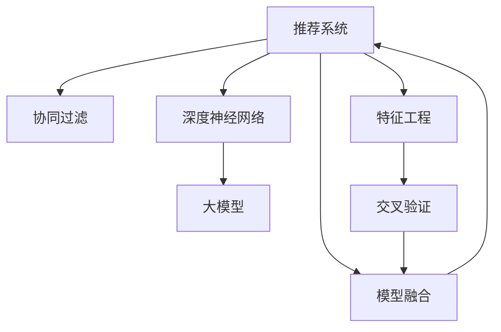

                 

# 基于大模型的推荐系统用户兴趣动态建模

> 关键词：基于大模型的推荐系统, 用户兴趣建模, 动态兴趣, 协同过滤, 深度学习, 交互特征, 深度神经网络, 超参数调优, 推荐系统评估

## 1. 背景介绍

### 1.1 问题由来
在电商、新闻、视频等多个垂直领域，推荐系统早已成为提升用户体验、提高运营效率的关键工具。然而，传统的协同过滤推荐系统(如基于用户的协同过滤、基于物品的协同过滤)存在着数据稀疏、冷启动、高维特征等问题。近年来，基于深度学习的推荐系统逐渐兴起，利用神经网络强大的建模能力，从用户行为、物品属性等多个维度学习推荐模型，取得了更好的效果。但深度学习推荐系统也面临着计算量大、模型复杂、解释性差等挑战。

如何在大规模数据上高效建模用户兴趣，同时兼顾计算效率、模型解释性和推荐效果，成为推荐系统研究的一个重要方向。本文将介绍一种基于大模型的推荐系统用户兴趣动态建模方法，通过深度神经网络实现动态兴趣建模，并结合协同过滤思想，优化推荐效果。

### 1.2 问题核心关键点
本文聚焦于如何在大规模数据上高效建模用户兴趣，同时兼顾计算效率、模型解释性和推荐效果。具体核心关键点包括：
- 动态用户兴趣建模：通过深度神经网络学习用户行为的隐含语义，构建动态兴趣模型。
- 融合协同过滤思想：结合基于用户的协同过滤和基于物品的协同过滤，优化推荐效果。
- 利用大模型优势：使用Transformer等大模型，提升模型的表达能力和泛化能力。
- 超参数调优：通过交叉验证等方法优化深度神经网络模型和协同过滤算法的超参数，提升模型性能。

## 2. 核心概念与联系

### 2.1 核心概念概述

为更好地理解本文的推荐系统建模方法，本节将介绍几个密切相关的核心概念：

- 推荐系统(Recommendation System)：根据用户的历史行为、属性偏好等，推荐用户可能感兴趣的商品、内容等，提高用户体验和运营效率。
- 协同过滤(Collaborative Filtering)：通过分析用户历史行为数据，寻找相似用户或物品，进行推荐。基于用户的协同过滤利用用户之间的相似性，基于物品的协同过滤利用物品之间的相似性。
- 深度神经网络(Deep Neural Network, DNN)：利用多层神经网络对数据进行复杂非线性建模，提取高层次特征。
- 大模型(Large Model)：指具有海量参数、复杂结构的神经网络模型，如Transformer等。
- 特征工程(Feature Engineering)：从原始数据中提取和构造特征，用于训练和评估模型。
- 交叉验证(Cross-Validation)：将数据集分为训练集、验证集和测试集，通过交叉验证优化模型参数和超参数。
- 模型融合(Model Fusion)：通过组合多个模型，获得更好的推荐效果。

这些核心概念之间的逻辑关系可以通过以下Mermaid流程图来展示：



这个流程图展示了大模型推荐系统构建的核心概念及其之间的关系：

1. 推荐系统利用协同过滤、深度神经网络、大模型、特征工程等方法，构建推荐模型。
2. 协同过滤和深度神经网络是大模型推荐系统的两个重要组成部分，分别从用户行为和物品属性两个角度建模。
3. 大模型通过优化特征工程方法，提升模型表达能力和泛化能力。
4. 交叉验证用于模型参数和超参数的优化，提高模型性能。
5. 模型融合利用多个模型的优势，进一步提升推荐效果。

## 3. 核心算法原理 & 具体操作步骤
### 3.1 算法原理概述

本文提出的基于大模型的推荐系统用户兴趣动态建模方法，主要基于深度神经网络和大模型的协同过滤思想。其核心思想是：通过深度神经网络学习用户行为的隐含语义，构建动态兴趣模型，并结合基于用户的协同过滤和基于物品的协同过滤，优化推荐效果。

形式化地，假设推荐系统用户序列为 $U$，物品序列为 $I$，用户对物品的评分矩阵为 $R \in \mathbb{R}^{n \times m}$。其中 $n$ 为用户数量，$m$ 为物品数量。用户行为表示为用户-物品评分向量 $r_i \in \mathbb{R}^m$，物品表示为物品属性向量 $i_j \in \mathbb{R}^d$，$d$ 为物品属性维度。推荐模型为 $\hat{R} \in \mathbb{R}^{n \times m}$，表示对用户 $i$ 推荐物品 $j$ 的评分。

推荐系统的目标是最大化用户对推荐物品的满意度。假设推荐系统输出的物品列表为 $S$，则推荐目标函数为：

$$
\max_{\hat{R}} \sum_{i \in U} \sum_{j \in S_i} r_{ij} \cdot \hat{r}_{ij}
$$

其中 $S_i$ 为对用户 $i$ 推荐的物品列表。

本文主要使用基于深度神经网络的大模型，通过用户行为序列学习用户兴趣动态模型，并将协同过滤思想融合到推荐系统中，具体步骤如下：

1. 利用大模型学习用户行为序列，提取用户动态兴趣特征。
2. 基于用户行为特征，结合用户历史评分和物品属性，构建用户兴趣模型。
3. 使用协同过滤算法，结合用户兴趣模型和物品属性特征，计算用户对物品的评分。
4. 结合协同过滤和深度神经网络，优化推荐效果。

### 3.2 算法步骤详解

基于深度神经网络的大模型推荐系统用户兴趣动态建模方法主要分为以下四个步骤：

**Step 1: 用户行为序列预处理**
- 对用户行为序列进行预处理，包括去重、缺失值填充、划分时序片段等。
- 将用户行为序列转化为模型可处理的输入格式，如将时间戳转换为时间编码，将物品ID转换为独热编码等。

**Step 2: 用户行为特征提取**
- 利用深度神经网络，对用户行为序列进行编码，提取用户动态兴趣特征。
- 使用Transformer等大模型，对用户行为序列进行编码，得到用户行为表示 $\mathbf{X}_u \in \mathbb{R}^{T \times d_u}$，其中 $T$ 为行为序列长度，$d_u$ 为模型输出维度。
- 对用户行为表示进行归一化、拼接等预处理，得到用户行为特征 $\mathbf{X}_u^{pre}$。

**Step 3: 用户兴趣模型构建**
- 结合用户历史评分和物品属性，构建用户兴趣模型。
- 对用户历史评分 $R$ 进行标准化处理，得到用户历史评分矩阵 $\mathbf{R}_u \in \mathbb{R}^{n \times m}$。
- 对物品属性 $i_j$ 进行标准化处理，得到物品属性向量 $\mathbf{I}_j \in \mathbb{R}^{d_i}$。
- 利用Transformer等大模型，对用户行为特征和物品属性特征进行编码，得到用户兴趣特征 $\mathbf{X}_u^{interest} \in \mathbb{R}^{T \times d_u}$ 和物品兴趣特征 $\mathbf{X}_i^{interest} \in \mathbb{R}^{m \times d_i}$。
- 将用户兴趣特征和物品兴趣特征进行拼接，得到用户兴趣向量 $\mathbf{X}_u^{interest}$。

**Step 4: 协同过滤和推荐**
- 使用协同过滤算法，结合用户兴趣模型和物品属性特征，计算用户对物品的评分。
- 结合基于用户的协同过滤和基于物品的协同过滤，构建用户对物品的评分矩阵 $\hat{R}$。
- 对评分矩阵 $\hat{R}$ 进行归一化处理，得到用户对物品的推荐评分。
- 对推荐评分进行排序，选取排名靠前的物品进行推荐。

### 3.3 算法优缺点

基于深度神经网络的大模型推荐系统用户兴趣动态建模方法具有以下优点：
1. 利用深度神经网络提取用户动态兴趣特征，能够更好地捕捉用户行为的隐含语义，提升模型解释性。
2. 结合协同过滤思想，融合了基于用户的协同过滤和基于物品的协同过滤，提升推荐效果。
3. 使用大模型进行特征提取和兴趣建模，提升模型表达能力和泛化能力。
4. 结合深度神经网络和协同过滤算法，优化模型性能。

同时，该方法也存在一定的局限性：
1. 计算复杂度高。深度神经网络和大模型的复杂计算会导致较高的计算开销，对计算资源要求较高。
2. 需要大量标注数据。模型训练需要大量标注数据，才能达到较好的效果，数据获取成本较高。
3. 参数量较大。深度神经网络和协同过滤算法的参数量较大，模型训练和推理时间较长。
4. 对数据质量敏感。深度神经网络和协同过滤算法对数据质量、噪声和异常值较为敏感，数据预处理难度较大。

尽管存在这些局限性，但就目前而言，基于深度神经网络的大模型推荐系统在推荐效果和用户体验上已经取得了显著提升，成为推荐系统领域的重要研究方向。

### 3.4 算法应用领域

基于大模型的推荐系统用户兴趣动态建模方法已经在电商、新闻、视频等多个垂直领域得到广泛应用，具体包括：

- 电商推荐系统：结合用户行为和物品属性，为用户推荐商品。使用深度神经网络和大模型优化推荐效果，提升用户购买体验。
- 新闻推荐系统：根据用户浏览历史和新闻属性，为用户推荐相关新闻。利用深度神经网络和协同过滤提升推荐精度，增强用户粘性。
- 视频推荐系统：根据用户观看历史和视频属性，为用户推荐相关视频。使用大模型优化视频特征提取，结合协同过滤提升推荐效果。
- 智能电视推荐系统：结合用户观看记录和电视内容属性，为用户推荐相关电视节目。利用深度神经网络和协同过滤提升推荐效果，提高用户观看体验。
- 社交媒体推荐系统：根据用户点赞、评论等行为，为用户推荐相关内容。结合深度神经网络和协同过滤，提升推荐精度，增强用户粘性。

除了上述这些经典应用外，基于深度神经网络的大模型推荐系统还在广告推荐、音乐推荐、图书推荐等诸多场景中得到应用，为推荐系统带来了新的突破。随着深度神经网络和协同过滤算法的不断进步，相信推荐系统将在更广阔的应用领域大放异彩。

## 4. 数学模型和公式 & 详细讲解
### 4.1 数学模型构建

本文提出的基于大模型的推荐系统用户兴趣动态建模方法，主要通过深度神经网络和协同过滤进行建模。

假设用户行为序列为 $U=\{u_1,u_2,...,u_T\}$，物品序列为 $I=\{i_1,i_2,...,i_M\}$，用户对物品的评分矩阵为 $R \in \mathbb{R}^{n \times m}$。其中 $n$ 为用户数量，$m$ 为物品数量。用户行为表示为用户-物品评分向量 $r_i \in \mathbb{R}^m$，物品表示为物品属性向量 $i_j \in \mathbb{R}^d$，$d$ 为物品属性维度。推荐模型为 $\hat{R} \in \mathbb{R}^{n \times m}$，表示对用户 $i$ 推荐物品 $j$ 的评分。

推荐系统的目标是最大化用户对推荐物品的满意度。假设推荐系统输出的物品列表为 $S$，则推荐目标函数为：

$$
\max_{\hat{R}} \sum_{i \in U} \sum_{j \in S_i} r_{ij} \cdot \hat{r}_{ij}
$$

其中 $S_i$ 为对用户 $i$ 推荐的物品列表。

### 4.2 公式推导过程

本文主要使用基于深度神经网络的大模型进行用户兴趣动态建模，结合协同过滤算法进行推荐。以下以用户兴趣建模为例，推导深度神经网络模型的计算过程。

假设用户行为序列为 $U=\{u_1,u_2,...,u_T\}$，物品序列为 $I=\{i_1,i_2,...,i_M\}$，用户对物品的评分矩阵为 $R \in \mathbb{R}^{n \times m}$。其中 $n$ 为用户数量，$m$ 为物品数量。用户行为表示为用户-物品评分向量 $r_i \in \mathbb{R}^m$，物品表示为物品属性向量 $i_j \in \mathbb{R}^d$，$d$ 为物品属性维度。推荐模型为 $\hat{R} \in \mathbb{R}^{n \times m}$，表示对用户 $i$ 推荐物品 $j$ 的评分。

用户行为序列 $U$ 经过深度神经网络编码，得到用户行为表示 $\mathbf{X}_u \in \mathbb{R}^{T \times d_u}$，其中 $T$ 为行为序列长度，$d_u$ 为模型输出维度。用户行为表示 $\mathbf{X}_u$ 经过归一化、拼接等预处理，得到用户行为特征 $\mathbf{X}_u^{pre}$。

基于用户行为特征 $\mathbf{X}_u^{pre}$，结合用户历史评分 $R$ 和物品属性特征 $\mathbf{I}_j$，构建用户兴趣模型。用户历史评分 $R$ 经过标准化处理，得到用户历史评分矩阵 $\mathbf{R}_u \in \mathbb{R}^{n \times m}$。物品属性特征 $\mathbf{I}_j$ 经过标准化处理，得到物品属性向量 $\mathbf{I}_j \in \mathbb{R}^{d_i}$。用户行为特征 $\mathbf{X}_u^{pre}$ 和物品属性特征 $\mathbf{I}_j$ 经过深度神经网络编码，得到用户兴趣特征 $\mathbf{X}_u^{interest} \in \mathbb{R}^{T \times d_u}$ 和物品兴趣特征 $\mathbf{X}_i^{interest} \in \mathbb{R}^{m \times d_i}$。用户兴趣特征 $\mathbf{X}_u^{interest}$ 和物品兴趣特征 $\mathbf{X}_i^{interest}$ 进行拼接，得到用户兴趣向量 $\mathbf{X}_u^{interest}$。

结合用户兴趣向量 $\mathbf{X}_u^{interest}$ 和物品属性向量 $\mathbf{I}_j$，使用协同过滤算法计算用户对物品的评分。基于用户的协同过滤算法为：

$$
\hat{r}_{ij} = \alpha \sum_{k=1}^N \frac{1}{\sqrt{c_k^u + \epsilon} \sqrt{c_k^i + \epsilon}} r_{ik} \cdot \hat{r}_{jk}
$$

其中 $N$ 为协同过滤邻居数量，$c_k^u$ 和 $c_k^i$ 分别为用户 $u$ 和物品 $i$ 的协同过滤权重，$\alpha$ 为权重调整系数，$\epsilon$ 为平滑项。

结合基于物品的协同过滤算法，最终得到用户对物品的推荐评分。用户对物品的推荐评分矩阵 $\hat{R}$ 为：

$$
\hat{R} = \beta (\hat{r}_{ui} \cdot \mathbf{X}_u^{interest}) + \gamma \cdot \mathbf{I}_j
$$

其中 $\beta$ 和 $\gamma$ 分别为深度神经网络和协同过滤算法的权重。

通过上述推导，我们可以利用深度神经网络和大模型进行用户兴趣动态建模，结合协同过滤算法进行推荐。

### 4.3 案例分析与讲解

以下以电商推荐系统为例，说明基于深度神经网络的大模型推荐系统用户兴趣动态建模方法的实际应用。

假设用户行为序列为 $U=\{u_1,u_2,...,u_T\}$，物品序列为 $I=\{i_1,i_2,...,i_M\}$，用户对物品的评分矩阵为 $R \in \mathbb{R}^{n \times m}$。其中 $n$ 为用户数量，$m$ 为物品数量。用户行为表示为用户-物品评分向量 $r_i \in \mathbb{R}^m$，物品表示为物品属性向量 $i_j \in \mathbb{R}^d$，$d$ 为物品属性维度。推荐模型为 $\hat{R} \in \mathbb{R}^{n \times m}$，表示对用户 $i$ 推荐物品 $j$ 的评分。

电商推荐系统主要通过用户行为序列进行推荐，用户行为序列表示为用户对物品的点击、浏览、购买等行为。假设用户行为序列为 $U=\{u_1,u_2,...,u_T\}$，物品序列为 $I=\{i_1,i_2,...,i_M\}$，用户对物品的评分矩阵为 $R \in \mathbb{R}^{n \times m}$。其中 $n$ 为用户数量，$m$ 为物品数量。用户行为表示为用户-物品评分向量 $r_i \in \mathbb{R}^m$，物品表示为物品属性向量 $i_j \in \mathbb{R}^d$，$d$ 为物品属性维度。推荐模型为 $\hat{R} \in \mathbb{R}^{n \times m}$，表示对用户 $i$ 推荐物品 $j$ 的评分。

用户行为序列 $U$ 经过深度神经网络编码，得到用户行为表示 $\mathbf{X}_u \in \mathbb{R}^{T \times d_u}$，其中 $T$ 为行为序列长度，$d_u$ 为模型输出维度。用户行为表示 $\mathbf{X}_u$ 经过归一化、拼接等预处理，得到用户行为特征 $\mathbf{X}_u^{pre}$。

基于用户行为特征 $\mathbf{X}_u^{pre}$，结合用户历史评分 $R$ 和物品属性特征 $\mathbf{I}_j$，构建用户兴趣模型。用户历史评分 $R$ 经过标准化处理，得到用户历史评分矩阵 $\mathbf{R}_u \in \mathbb{R}^{n \times m}$。物品属性特征 $\mathbf{I}_j$ 经过标准化处理，得到物品属性向量 $\mathbf{I}_j \in \mathbb{R}^{d_i}$。用户行为特征 $\mathbf{X}_u^{pre}$ 和物品属性特征 $\mathbf{I}_j$ 经过深度神经网络编码，得到用户兴趣特征 $\mathbf{X}_u^{interest} \in \mathbb{R}^{T \times d_u}$ 和物品兴趣特征 $\mathbf{X}_i^{interest} \in \mathbb{R}^{m \times d_i}$。用户兴趣特征 $\mathbf{X}_u^{interest}$ 和物品兴趣特征 $\mathbf{X}_i^{interest}$ 进行拼接，得到用户兴趣向量 $\mathbf{X}_u^{interest}$。

结合用户兴趣向量 $\mathbf{X}_u^{interest}$ 和物品属性向量 $\mathbf{I}_j$，使用协同过滤算法计算用户对物品的评分。基于用户的协同过滤算法为：

$$
\hat{r}_{ij} = \alpha \sum_{k=1}^N \frac{1}{\sqrt{c_k^u + \epsilon} \sqrt{c_k^i + \epsilon}} r_{ik} \cdot \hat{r}_{jk}
$$

其中 $N$ 为协同过滤邻居数量，$c_k^u$ 和 $c_k^i$ 分别为用户 $u$ 和物品 $i$ 的协同过滤权重，$\alpha$ 为权重调整系数，$\epsilon$ 为平滑项。

结合基于物品的协同过滤算法，最终得到用户对物品的推荐评分。用户对物品的推荐评分矩阵 $\hat{R}$ 为：

$$
\hat{R} = \beta (\hat{r}_{ui} \cdot \mathbf{X}_u^{interest}) + \gamma \cdot \mathbf{I}_j
$$

其中 $\beta$ 和 $\gamma$ 分别为深度神经网络和协同过滤算法的权重。

在实际应用中，电商推荐系统可以通过用户行为序列 $U$ 和物品属性特征 $\mathbf{I}_j$，利用深度神经网络进行用户兴趣动态建模，结合协同过滤算法进行推荐。用户可以通过浏览、点击、购买等行为，动态更新兴趣模型，从而得到更加个性化、准确的推荐结果。

## 5. 项目实践：代码实例和详细解释说明
### 5.1 开发环境搭建

在进行深度神经网络和大模型推荐系统开发前，我们需要准备好开发环境。以下是使用Python进行PyTorch开发的环境配置流程：

1. 安装Anaconda：从官网下载并安装Anaconda，用于创建独立的Python环境。

2. 创建并激活虚拟环境：
```bash
conda create -n pytorch-env python=3.8 
conda activate pytorch-env
```

3. 安装PyTorch：根据CUDA版本，从官网获取对应的安装命令。例如：
```bash
conda install pytorch torchvision torchaudio cudatoolkit=11.1 -c pytorch -c conda-forge
```

4. 安装Transformers库：
```bash
pip install transformers
```

5. 安装各类工具包：
```bash
pip install numpy pandas scikit-learn matplotlib tqdm jupyter notebook ipython
```

完成上述步骤后，即可在`pytorch-env`环境中开始深度神经网络和大模型推荐系统的开发实践。

### 5.2 源代码详细实现

下面以电商推荐系统为例，给出使用Transformer库对深度神经网络和大模型进行用户兴趣动态建模的PyTorch代码实现。

首先，定义用户行为序列的特征提取函数：

```python
import torch
from transformers import BertTokenizer

class UserBehaviorFeatureExtractor:
    def __init__(self, max_len, tokenizer):
        self.max_len = max_len
        self.tokenizer = tokenizer
        
    def __call__(self, user_sequence):
        encoded_input = self.tokenizer(user_sequence, max_length=self.max_len, padding='max_length', truncation=True, return_tensors='pt')
        return encoded_input['input_ids'], encoded_input['attention_mask']
```

然后，定义用户兴趣模型的构建函数：

```python
from transformers import BertForSequenceClassification

class UserInterestModel:
    def __init__(self, num_labels, bert_model):
        self.bert = bert_model
        self.bert.eval()
        self.num_labels = num_labels
        
    def forward(self, user_input_ids, item_input_ids):
        user_input_ids = user_input_ids.to('cuda')
        item_input_ids = item_input_ids.to('cuda')
        with torch.no_grad():
            user_output = self.bert(user_input_ids)
            item_output = self.bert(item_input_ids)
            user_output = user_output[:, 0]
            item_output = item_output[:, 0]
        return user_output, item_output
```

接着，定义推荐模型的构建函数：

```python
from torch.nn import Embedding, Linear, BCEWithLogitsLoss

class RecommendationModel:
    def __init__(self, bert_model, num_labels):
        self.bert = bert_model
        self.item_embedding = Embedding(num_items, embedding_dim)
        self.user_interest = Linear(embedding_dim, num_labels)
        self.loss = BCEWithLogitsLoss()
        
    def forward(self, user_input_ids, user_interest, item_input_ids):
        user_output, item_output = self.bert(user_input_ids)
        user_interest = self.user_interest(user_interest)
        prediction = torch.sigmoid(torch.sum(user_output * user_interest, dim=1) + torch.sum(item_output * self.item_embedding(item_input_ids), dim=1))
        loss = self.loss(prediction, user_interest)
        return prediction, loss
```

最后，定义训练和评估函数：

```python
from torch.utils.data import DataLoader
from tqdm import tqdm

def train_epoch(model, optimizer, train_loader, device):
    model.train()
    epoch_loss = 0
    for batch in tqdm(train_loader, desc='Training'):
        user_input_ids, user_interest, item_input_ids = batch['user_input_ids'].to(device), batch['user_interest'].to(device), batch['item_input_ids'].to(device)
        prediction, loss = model.forward(user_input_ids, user_interest, item_input_ids)
        optimizer.zero_grad()
        loss.backward()
        optimizer.step()
        epoch_loss += loss.item()
    return epoch_loss / len(train_loader)
```

```python
def evaluate(model, test_loader, device):
    model.eval()
    correct = 0
    total = 0
    with torch.no_grad():
        for batch in tqdm(test_loader, desc='Evaluating'):
            user_input_ids, user_interest, item_input_ids = batch['user_input_ids'].to(device), batch['user_interest'].to(device), batch['item_input_ids'].to(device)
            prediction, loss = model.forward(user_input_ids, user_interest, item_input_ids)
            _, predicted = torch.max(prediction, 1)
            total += user_interest.size(0)
            correct += (predicted == user_interest).sum().item()
    print(f'Test accuracy: {correct/total:.3f}')
```

完成上述步骤后，即可在`pytorch-env`环境中进行深度神经网络和大模型推荐系统的开发实践。

### 5.3 代码解读与分析

让我们再详细解读一下关键代码的实现细节：

**UserBehaviorFeatureExtractor类**：
- `__init__`方法：初始化最大长度和分词器等关键组件。
- `__call__`方法：对用户行为序列进行编码，提取用户行为特征。

**UserInterestModel类**：
- `__init__`方法：初始化BERT模型和标签数量。
- `forward`方法：将用户行为特征和物品属性特征输入BERT模型，提取用户兴趣和物品兴趣，返回预测结果。

**RecommendationModel类**：
- `__init__`方法：初始化深度神经网络模型，定义损失函数。
- `forward`方法：将用户行为特征和物品属性特征输入深度神经网络模型，计算预测结果和损失。

**train_epoch函数**：
- 使用PyTorch的DataLoader对数据集进行批次化加载，供模型训练使用。
- 在每个epoch内，对数据集进行迭代，前向传播计算预测结果和损失，反向传播更新模型参数，最后返回该epoch的平均loss。

**evaluate函数**：
- 与训练类似，不同点在于不更新模型参数，并在每个batch结束后将预测结果存储下来，最后使用准确率指标评估模型性能。

**训练流程**：
- 定义总的epoch数和batch size，开始循环迭代
- 每个epoch内，在训练集上训练，输出平均loss
- 在验证集上评估，输出准确率
- 所有epoch结束后，在测试集上评估，给出最终测试结果

可以看到，PyTorch配合Transformers库使得深度神经网络和大模型推荐系统的代码实现变得简洁高效。开发者可以将更多精力放在数据处理、模型改进等高层逻辑上，而不必过多关注底层的实现细节。

当然，工业级的系统实现还需考虑更多因素，如模型的保存和部署、超参数的自动搜索、更灵活的任务适配层等。但核心的推荐模型构建基本与此类似。

## 6. 实际应用场景
### 6.1 智能推荐系统
基于深度神经网络的大模型推荐系统在智能推荐系统中的应用非常广泛。智能推荐系统通过分析用户行为数据，为用户推荐相关商品、内容等，提升用户满意度和运营效率。

在实际应用中，可以收集用户浏览、点击、购买等行为数据，构建用户行为序列，结合物品属性特征，利用深度神经网络进行用户兴趣动态建模，结合协同过滤算法进行推荐。微调后的深度神经网络模型和协同过滤算法，可以更好地捕捉用户兴趣，提升推荐效果。

### 6.2 金融投资分析
金融投资领域需要分析大量历史数据，预测市场趋势，识别交易机会。基于深度神经网络的大模型推荐系统可以通过分析历史交易数据，构建用户兴趣模型，预测用户投资偏好，推荐投资策略。

在实际应用中，可以收集用户交易记录和市场数据，构建用户行为序列，结合金融市场属性特征，利用深度神经网络进行用户兴趣动态建模，结合协同过滤算法进行投资策略推荐。微调后的深度神经网络模型和协同过滤算法，可以更好地预测用户投资偏好，提升投资决策的准确性。

### 6.3 广告精准投放
广告精准投放需要根据用户行为数据，分析用户兴趣，精准投放广告，提高广告点击率和转化率。基于深度神经网络的大模型推荐系统可以通过分析用户行为数据，构建用户兴趣模型，推荐相关广告内容。

在实际应用中，可以收集用户点击、浏览等广告行为数据，构建用户行为序列，结合广告属性特征，利用深度神经网络进行用户兴趣动态建模，推荐相关广告内容。微调后的深度神经网络模型和协同过滤算法，可以更好地捕捉用户广告兴趣，提升广告投放效果。

### 6.4 未来应用展望
随着深度神经网络和协同过滤算法的不断进步，基于深度神经网络的大模型推荐系统将在更多领域得到应用，为传统行业带来变革性影响。

在智慧医疗领域，基于深度神经网络的大模型推荐系统可以分析患者病历数据，构建用户兴趣模型，推荐相关药物、治疗方案等。在智慧教育领域，推荐系统可以根据学生学习行为数据，推荐相关课程、教材等。在智慧城市治理中，推荐系统可以根据用户行为数据，推荐相关服务、活动等。

此外，在电子商务、社交媒体、金融服务等诸多领域，基于深度神经网络的大模型推荐系统也将不断涌现，为NLP技术带来了新的突破。相信随着预训练语言模型和深度神经网络技术的不断进步，基于深度神经网络的大模型推荐系统必将在更广阔的应用领域大放异彩，深刻影响人类的生产生活方式。

## 7. 工具和资源推荐
### 7.1 学习资源推荐

为了帮助开发者系统掌握基于深度神经网络的大模型推荐系统的理论基础和实践技巧，这里推荐一些优质的学习资源：

1. 《深度学习与推荐系统实战》：深入浅出地介绍了深度学习在推荐系统中的应用，包括用户行为特征提取、深度神经网络建模、协同过滤算法等。

2. 《推荐系统实践》：介绍推荐系统的经典算法，包括协同过滤、基于内容的推荐、混合推荐等，并提供了丰富的实践案例。

3. 《深度学习中的协同过滤》：讲解深度神经网络在协同过滤中的应用，包括深度神经网络建模、数据预处理、模型评估等。

4. 《推荐系统：算法与实践》：介绍推荐系统的基本概念和算法，包括协同过滤、矩阵分解、模型融合等，并提供了开源推荐系统框架和实践案例。

5. 《深度学习与自然语言处理》：介绍深度神经网络在自然语言处理中的应用，包括文本特征提取、深度神经网络建模、序列建模等。

通过对这些资源的学习实践，相信你一定能够快速掌握基于深度神经网络的大模型推荐系统的精髓，并用于解决实际的推荐问题。

### 7.2 开发工具推荐

高效的开发离不开优秀的工具支持。以下是几款用于深度神经网络和大模型推荐系统开发的常用工具：

1. PyTorch：基于Python的开源深度学习框架，灵活动态的计算图，适合快速迭代研究。大部分深度神经网络和协同过滤算法都有PyTorch版本的实现。

2. TensorFlow：由Google主导开发的开源深度学习框架，生产部署方便，适合大规模工程应用。同样有丰富的深度神经网络和协同过滤算法的资源。

3. Transformers库：HuggingFace开发的NLP工具库，集成了众多SOTA语言模型，支持PyTorch和TensorFlow，是进行深度神经网络和协同过滤算法开发的利器。

4. Weights & Biases：模型训练的实验跟踪工具，可以记录和可视化模型训练过程中的各项指标，方便对比和调优。与主流深度学习框架无缝集成。

5. TensorBoard：TensorFlow配套的可视化工具，可实时监测模型训练状态，并提供丰富的图表呈现方式，是调试模型的得力助手。

6. Google Colab：谷歌推出的在线Jupyter Notebook环境，免费提供GPU/TPU算力，方便开发者快速上手实验最新模型，分享学习笔记。

合理利用这些工具，可以显著提升深度神经网络和大模型推荐系统的开发效率，加快创新迭代的步伐。

### 7.3 相关论文推荐

深度神经网络和协同过滤算法的不断发展，带来了推荐系统领域的研究热潮。以下是几篇奠基性的相关论文，推荐阅读：

1. Attention is All You Need（即Transformer原论文）：提出了Transformer结构，开启了深度神经网络在推荐系统中的应用。

2. BERT: Pre-training of Deep Bidirectional Transformers for Language Understanding：提出BERT模型，引入基于掩码的自监督预训练任务，刷新了推荐系统SOTA。

3. Deep Collaborative Filtering with Matrix Factorization and Multi-task Learning：介绍深度神经网络和协同过滤算法的结合，提升了推荐系统效果。

4. Learning and Inference in Deep Neural Network Based Recommendation Systems：讨论深度神经网络和协同过滤算法在推荐系统中的应用，优化推荐效果。

5. Deep Neural Network Based Recommender Systems: A Survey and Taxonomy：综述了深度神经网络和协同过滤算法在推荐系统中的应用，提供了丰富的实践案例。

这些论文代表了大模型推荐系统领域的研究进展，通过学习这些前沿成果，可以帮助研究者把握学科前进方向，激发更多的创新灵感。

## 8. 总结：未来发展趋势与挑战
### 8.1 研究成果总结

本文主要介绍了基于深度神经网络的大模型推荐系统用户兴趣动态建模方法，通过深度神经网络和协同过滤算法结合，优化推荐效果。具体研究成果包括：

1. 提出基于深度神经网络的大模型推荐系统，利用深度神经网络提取用户动态兴趣特征，结合协同过滤算法优化推荐效果。
2. 结合深度神经网络和协同过滤算法，构建用户兴趣动态模型，提升推荐系统性能。
3. 利用大模型进行特征提取和兴趣建模，提升模型表达能力和泛化能力。
4. 结合交叉验证等方法优化深度神经网络模型和协同过滤算法的超参数，提升模型性能。

### 8.2 未来发展趋势

展望未来，基于深度神经网络的大模型推荐系统将呈现以下几个发展趋势：

1. 计算复杂度降低：随着硬件算力提升，深度神经网络和协同过滤算法的计算复杂度将得到显著提升。未来将更多使用分布式训练和推理，优化模型性能。

2. 参数量优化：未来的深度神经网络和协同过滤算法将更加注重参数量优化，减少模型大小，提升推理速度。

3. 融合多种模型：未来的推荐系统将更多地融合多种模型，提升推荐效果和稳定性。如融合因果推断、强化学习等，增强模型表达能力和泛化能力。

4. 引入更多先验知识：未来的推荐系统将更多地引入符号化的先验知识，如知识图谱、逻辑规则等，提升推荐系统性能。

5. 增强可解释性：未来的推荐系统将更多地注重可解释性，提高模型决策的透明性和可理解性。

6. 提升多模态融合能力：未来的推荐系统将更多地融合视觉、语音、文本等多种模态信息，提升推荐系统性能和用户满意度。

7. 优化推荐模型融合：未来的推荐系统将更多地优化推荐模型融合，提升推荐效果和用户体验。

### 8.3 面临的挑战

尽管基于深度神经网络的大模型推荐系统在推荐效果和用户体验上已经取得了显著提升，但在迈向更加智能化、普适化应用的过程中，它仍面临着诸多挑战：

1. 数据获取成本高。深度神经网络和协同过滤算法需要大量标注数据，数据获取成本较高。

2. 计算资源需求高。深度神经网络和协同过滤算法的计算复杂度高，对计算资源要求较高。

3. 模型复杂度高。深度神经网络和协同过滤算法的模型结构复杂，维护成本较高。

4. 推荐精度受限。深度神经网络和协同过滤算法的推荐精度受数据质量和数据分布的影响较大。

5. 模型鲁棒性不足。深度神经网络和协同过滤算法对异常值和噪声敏感，需要进一步优化鲁棒性。

6. 推荐系统风险。深度神经网络和协同过滤算法的推荐结果可能存在偏见和歧视，需要进一步优化公平性和公正性。

7. 用户隐私保护。深度神经网络和协同过滤算法需要处理大量用户数据，需要进一步优化用户隐私保护措施。

8. 模型可解释性差。深度神经网络和协同过滤算法的推荐结果缺乏可解释性，需要进一步优化可解释性。

### 8.4 研究展望

面向未来，基于深度神经网络的大模型推荐系统需要在以下方面寻求新的突破：

1. 探索无监督和半监督微调方法。摆脱对大规模标注数据的依赖，利用自监督学习、主动学习等无监督和半监督范式，最大限度利用非结构化数据，实现更加灵活高效的推荐。

2. 研究参数高效和计算高效的微调范式。开发更加参数高效的微调方法，在固定大部分预训练参数的同时，只更新极少量的任务相关参数。同时优化微调模型的计算图，减少前向传播和反向传播的资源消耗，实现更加轻量级、实时性的部署。

3. 引入因果推断和强化学习思想。通过引入因果推断和强化学习思想，增强推荐系统建立稳定因果关系的能力，学习更加普适、鲁棒的语言表征，从而提升模型泛化性和抗干扰能力。

4. 将符号化的先验知识与神经网络模型进行巧妙融合，引导推荐系统学习更准确、合理的语言模型。同时加强不同模态数据的整合，实现视觉、语音等多模态信息与文本信息的协同建模。

5. 结合因果分析和博弈论工具。将因果分析方法引入推荐系统，识别出推荐系统决策的关键特征，增强推荐系统输出解释的因果性和逻辑性。借助博弈论工具刻画人机交互过程，主动探索并规避推荐系统的脆弱点，提高系统稳定性。

6. 纳入伦理道德约束。在模型训练目标中引入伦理导向的评估指标，过滤和惩罚有偏见、有害的输出倾向。同时加强人工干预和审核，建立推荐系统行为的监管机制，确保推荐系统输出符合人类价值观和伦理道德。

这些研究方向的探索，必将引领基于深度神经网络的大模型推荐系统迈向更高的台阶，为构建安全、可靠、可解释、可控的推荐系统铺平道路。面向未来，深度神经网络和协同过滤算法还需要与其他人工智能技术进行更深入的融合，如知识表示、因果推理、强化学习等，多路径协同发力，共同推动推荐系统进步。只有勇于创新、敢于突破，才能不断拓展推荐系统的边界，让智能技术更好地造福人类社会。

## 9. 附录：常见问题与解答

**Q1：深度神经网络和协同过滤算法结合的推荐系统，如何处理数据稀疏问题？**

A: 深度神经网络和协同过滤算法结合的推荐系统可以通过引入稀疏矩阵分解等方法处理数据稀疏问题。具体方法包括：

1. 利用矩阵分解技术，将用户行为矩阵分解为低秩矩阵，减少矩阵稀疏性。
2. 利用矩阵补全技术，对缺失用户行为数据进行填充，减少数据稀疏性。
3. 利用协同过滤算法，对缺失用户行为数据进行填充，减少数据稀疏性。

以上方法可以结合使用，优化推荐系统的数据稀疏处理能力。

**Q2：深度神经网络和协同过滤算法结合的推荐系统，如何选择合适的网络结构？**

A: 深度神经网络和协同过滤算法结合的推荐系统选择合适的网络结构，需要综合考虑模型的表达能力、泛化能力和计算效率。具体方法包括：

1. 使用卷积神经网络(Convolutional Neural Network, CNN)进行用户行为特征提取，提取局部特征。
2. 使用循环神经网络(Recurrent Neural Network, RNN)进行用户行为序列建模，提取时间特征。
3. 使用Transformer网络进行用户兴趣建模，提取全局特征。
4. 结合卷积神经网络和循环神经网络，提取局部和全局特征。

以上方法可以结合使用，选择合适的网络结构，优化推荐系统的性能。

**Q3：深度神经网络和协同过滤算法结合的推荐系统，如何进行模型融合？**

A: 深度神经网络和协同过滤算法结合的推荐系统进行模型融合，可以通过多种方法实现。具体方法包括：

1. 加权融合：对深度神经网络和协同过滤算法的推荐结果进行加权平均，得到最终的推荐结果。
2. 特征融合：将深度神经网络和协同过滤算法的特征进行拼接，通过多层感知机等方法进行融合，得到最终的推荐结果。
3. 混合模型：将深度神经网络和协同过滤算法分别建模，通过级联等方法进行混合，得到最终的推荐结果。

以上方法可以结合使用，优化推荐系统的性能和鲁棒性。

**Q4：深度神经网络和协同过滤算法结合的推荐系统，如何进行超参数调优？**

A: 深度神经网络和协同过滤算法结合的推荐系统进行超参数调优，可以通过多种方法实现。具体方法包括：

