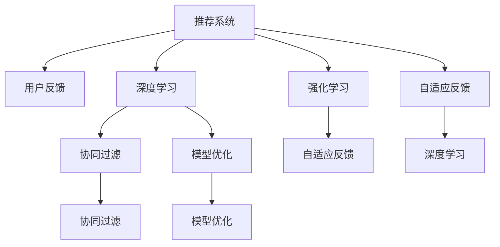

                 

# 基于大模型的推荐系统用户反馈机制优化

> 关键词：推荐系统,用户反馈,大模型,深度学习,强化学习,强化学习算法,自适应反馈,用户画像,协同过滤,模型优化

## 1. 背景介绍

### 1.1 问题由来
随着互联网和电子商务的快速发展，推荐系统成为提高用户满意度和提升业务收益的重要手段。通过个性化推荐，用户可以发现更多感兴趣的内容，从而增加用户粘性和消费转化率。然而，传统的基于协同过滤和内容过滤的推荐算法，难以应对用户多样化的需求和快速变化的兴趣。

近年来，随着深度学习和大模型的兴起，推荐系统进入了新的发展阶段。通过预训练模型，推荐系统可以自动从用户历史行为中学习出更加深入的个性化特征，并利用大模型的强大表示能力，实现更加精准的推荐。然而，尽管预训练模型提升了推荐精度，但在用户反馈获取和模型更新方面，仍存在一定的局限性。用户反馈是推荐系统不断迭代优化的重要动力，但传统反馈机制过于粗糙，难以实时捕捉用户兴趣的变化，导致推荐效果难以持续提升。

针对这一问题，本文提出基于大模型的推荐系统用户反馈优化机制，通过融合深度学习和强化学习，实现更加自适应和实时性的反馈调节。本文的核心思想是：将大模型作为推荐系统的主体，通过智能化的用户反馈机制，动态调整推荐策略，以实现更加个性化、精准的推荐。

## 2. 核心概念与联系

### 2.1 核心概念概述

为更好地理解本文提出的基于大模型的推荐系统用户反馈优化机制，本节将介绍几个密切相关的核心概念：

- 推荐系统：通过算法为用户推荐感兴趣的内容，如商品、新闻、音乐等。推荐系统广泛应用于电子商务、社交媒体、视频流媒体等领域。
- 用户反馈：用户对推荐结果的反馈，如点击、收藏、评分等，用于调整推荐模型，提升推荐效果。
- 大模型：通过大规模数据预训练，具备强大表示能力的深度学习模型，如BERT、GPT、XLNet等。
- 深度学习：通过多层神经网络结构，自动提取特征并进行分类或回归的机器学习方法。
- 强化学习：通过奖励信号指导模型行为，自动探索最优策略的学习范式。
- 自适应反馈：通过动态调整反馈机制，实时捕捉用户兴趣变化，提升推荐系统响应速度和精准度。
- 协同过滤：通过分析用户行为相似性，推荐相似用户感兴趣的内容。
- 模型优化：通过参数更新和策略调整，提升推荐模型性能。

这些核心概念之间的逻辑关系可以通过以下Mermaid流程图来展示：



这个流程图展示了大模型推荐系统的核心概念及其之间的关系：

1. 推荐系统通过深度学习和大模型实现内容推荐。
2. 用户反馈用于调整推荐策略。
3. 强化学习用于实时优化反馈机制。
4. 自适应反馈机制能够动态捕捉用户兴趣变化。
5. 协同过滤和模型优化是推荐算法的重要组成部分。

这些概念共同构成了大模型推荐系统的学习框架，使其能够根据用户行为数据，动态调整推荐策略，提升推荐效果。

## 3. 核心算法原理 & 具体操作步骤
### 3.1 算法原理概述

基于大模型的推荐系统用户反馈优化机制，本质上是一种融合深度学习和强化学习的推荐系统设计。其核心思想是：将大模型作为推荐系统的主体，通过智能化的用户反馈机制，动态调整推荐策略，以实现更加个性化、精准的推荐。

形式化地，假设推荐系统中的用户为 $U=\{u_1,\dots,u_N\}$，物品为 $I=\{i_1,\dots,i_M\}$，历史行为矩阵为 $R \in \{0,1\}^{N\times M}$，其中 $R_{u_i,i_j}=1$ 表示用户 $u_i$ 对物品 $i_j$ 有过浏览、点击、购买等行为。推荐系统的目标是在用户行为数据 $R$ 的基础上，学习推荐模型 $f_{\theta}:\mathbb{R}^N \times \mathbb{R}^M \rightarrow \{0,1\}^{M\times N}$，使得推荐结果 $f_{\theta}(R,\tilde{R})$ 与真实行为 $R$ 尽可能一致。

在用户反馈机制优化方面，我们采用强化学习算法，通过设定适当的奖励函数，指导模型动态调整推荐策略，从而实现更加自适应和实时性的推荐。具体而言，用户 $u_i$ 对物品 $i_j$ 的行为可以看作是一种奖励信号，通过累积奖励指导模型更新推荐策略，使得推荐结果更加符合用户兴趣。

### 3.2 算法步骤详解

基于大模型的推荐系统用户反馈优化机制，主要包括以下几个关键步骤：

**Step 1: 数据准备**
- 收集用户历史行为数据 $R$，包括浏览、点击、购买等行为，将行为矩阵 $R$ 转化为用户行为向量 $\boldsymbol{r}_i \in \mathbb{R}^{M}$。
- 构建物品向量 $\boldsymbol{i}_j \in \mathbb{R}^{M}$，表示物品的特征。

**Step 2: 模型预训练**
- 选择预训练模型（如BERT、GPT等）作为推荐系统的主体。
- 在预先收集到的数据集上，对预训练模型进行微调，学习物品和用户之间的关联。

**Step 3: 定义奖励函数**
- 定义适当的奖励函数 $r_{u_i,i_j}$，衡量用户对物品的兴趣程度，如点击率、评分等。
- 定义损失函数 $l(R,\hat{R})$，衡量推荐结果与真实行为之间的差距。

**Step 4: 强化学习过程**
- 使用强化学习算法（如Q-learning、Deep Q-Network等），不断更新推荐策略。
- 在每次推荐过程中，记录用户的实际行为，并根据奖励函数更新推荐策略。
- 重复上述步骤，直到推荐策略收敛或达到预设的迭代次数。

**Step 5: 推荐结果生成**
- 基于更新后的推荐策略，对用户行为向量 $\boldsymbol{r}_i$ 和物品向量 $\boldsymbol{i}_j$ 进行前向传播计算，得到推荐结果 $\hat{R}_{u_i,i_j}$。
- 在推荐结果中，选择用户最感兴趣的 $K$ 个物品，作为推荐结果。

### 3.3 算法优缺点

基于大模型的推荐系统用户反馈优化机制具有以下优点：
1. 自适应性更强。通过强化学习算法，模型可以动态调整推荐策略，实时捕捉用户兴趣变化。
2. 推荐精度更高。通过深度学习和预训练模型，推荐系统可以学习更加深刻的个性化特征，提升推荐精度。
3. 响应速度更快。通过实时反馈机制，推荐系统可以迅速响应用户行为，提高推荐效率。
4. 用户满意度更高。自适应反馈机制可以根据用户行为，动态调整推荐结果，提升用户体验。

同时，该方法也存在一定的局限性：
1. 数据需求更高。需要收集大量的用户历史行为数据，才能训练出有效的预训练模型和反馈优化策略。
2. 训练成本更高。强化学习需要大量的实验和调试，找到最优的奖励函数和参数设置。
3. 模型复杂度更高。基于深度学习和强化学习的模型结构复杂，训练和推理速度较慢。
4. 数据隐私问题。收集用户行为数据可能引发隐私泄露问题，需要采取相应的数据保护措施。

尽管存在这些局限性，但就目前而言，基于大模型的推荐系统用户反馈优化机制仍是最前沿的研究方向之一，具有广泛的应用前景。

### 3.4 算法应用领域

基于大模型的推荐系统用户反馈优化机制，已经在多个领域得到了成功应用，例如：

- 电子商务：通过个性化推荐提升用户购物体验，增加用户购买转化率。
- 视频流媒体：根据用户观看记录，推荐相关视频内容，提升用户观看时间和满意度。
- 社交网络：推荐好友、文章等个性化内容，增加用户互动和停留时间。
- 新闻媒体：推荐相关新闻内容，提升用户阅读量和推荐效果。
- 广告投放：通过个性化推荐，提升广告投放效果和广告转化率。

除了上述这些应用外，基于大模型的推荐系统用户反馈优化机制还在不断拓展到更多领域中，如医疗健康、金融投资等，为各类行业带来新的应用可能。

## 4. 数学模型和公式 & 详细讲解  
### 4.1 数学模型构建

本节将使用数学语言对基于大模型的推荐系统用户反馈优化机制进行更加严格的刻画。

记推荐系统中的用户为 $U=\{u_1,\dots,u_N\}$，物品为 $I=\{i_1,\dots,i_M\}$，历史行为矩阵为 $R \in \{0,1\}^{N\times M}$。定义预训练模型 $M_{\theta}:\mathbb{R}^N \times \mathbb{R}^M \rightarrow \{0,1\}^{M\times N}$，其中 $\theta$ 为模型参数。

定义用户行为向量 $\boldsymbol{r}_i \in \mathbb{R}^{M}$，表示用户 $u_i$ 对物品的兴趣程度，其中 $\boldsymbol{r}_i = \left(r_{i,1},r_{i,2},\dots,r_{i,M}\right)$。定义物品向量 $\boldsymbol{i}_j \in \mathbb{R}^{M}$，表示物品 $i_j$ 的特征，其中 $\boldsymbol{i}_j = \left(i_{j,1},i_{j,2},\dots,i_{j,M}\right)$。

推荐模型的前向传播过程如下：

$$
\hat{R}_{u_i,i_j} = f_{\theta}(\boldsymbol{r}_i, \boldsymbol{i}_j)
$$

其中 $f_{\theta}$ 为推荐模型，可以采用深度神经网络等形式。

定义用户对物品的奖励函数 $r_{u_i,i_j}$，用于衡量用户对物品的兴趣程度，可以定义为：

$$
r_{u_i,i_j} = \left\{
  \begin{array}{ll}
    1, & \text{如果用户对物品 $i_j$ 有正反馈行为} \\
    0, & \text{如果用户对物品 $i_j$ 有负反馈行为} \\
    0.5, & \text{如果用户对物品 $i_j$ 没有反馈行为}
  \end{array}
\right.
$$

在强化学习过程中，定义奖励函数 $R_{u_i,i_j}$ 为：

$$
R_{u_i,i_j} = \sum_{t=1}^{T} \gamma^{t-1} r_{u_i,i_j}
$$

其中 $\gamma \in [0,1]$ 为折现率，$T$ 为时间步数。

在推荐模型 $f_{\theta}$ 中，定义损失函数 $l(R,\hat{R})$ 如下：

$$
l(R,\hat{R}) = \frac{1}{N}\sum_{i=1}^{N}\sum_{j=1}^{M} (R_{u_i,i_j} - \hat{R}_{u_i,i_j})^2
$$

其中 $R_{u_i,i_j}$ 为用户的真实行为。

### 4.2 公式推导过程

在推荐模型的前向传播过程中，定义推荐模型的输出向量为 $\hat{R} \in \{0,1\}^{M\times N}$。定义推荐模型的参数更新公式为：

$$
\theta \leftarrow \theta - \eta \nabla_{\theta}l(R,\hat{R})
$$

其中 $\eta$ 为学习率，$\nabla_{\theta}l(R,\hat{R})$ 为损失函数对模型参数的梯度。

在强化学习过程中，定义Q值函数 $Q_{\theta}(\boldsymbol{r}_i, \boldsymbol{i}_j)$ 如下：

$$
Q_{\theta}(\boldsymbol{r}_i, \boldsymbol{i}_j) = \sum_{j=1}^{M} \hat{R}_{u_i,i_j} \hat{R}_{u_i,j}
$$

在强化学习算法中，通过迭代更新推荐策略，优化模型的Q值函数。常用的强化学习算法包括Q-learning、Deep Q-Network等。以Q-learning为例，其更新公式为：

$$
Q_{\theta}(\boldsymbol{r}_i, \boldsymbol{i}_j) \leftarrow (1 - \alpha) Q_{\theta}(\boldsymbol{r}_i, \boldsymbol{i}_j) + \alpha(r_{u_i,i_j} + \gamma \max_{i_j} Q_{\theta}(\boldsymbol{r}_i, \boldsymbol{i}_j))
$$

其中 $\alpha$ 为学习率，$\max_{i_j} Q_{\theta}(\boldsymbol{r}_i, \boldsymbol{i}_j)$ 表示当前状态下物品 $i_j$ 的最大Q值。

通过上述步骤，不断更新推荐策略，直到收敛或达到预设的迭代次数。

### 4.3 案例分析与讲解

下面以电商平台推荐系统为例，分析基于大模型的推荐系统用户反馈优化机制的实际应用。

假设电商平台拥有大量用户行为数据 $R$，用户行为向量 $\boldsymbol{r}_i \in \mathbb{R}^{M}$，物品向量 $\boldsymbol{i}_j \in \mathbb{R}^{M}$，其中 $M$ 为物品总数。

定义预训练模型 $M_{\theta}$ 为基于BERT的推荐模型，其中 $\theta$ 为模型参数。在预训练模型 $M_{\theta}$ 中，定义奖励函数 $r_{u_i,i_j}$ 如下：

$$
r_{u_i,i_j} = \left\{
  \begin{array}{ll}
    1, & \text{如果用户对物品 $i_j$ 有正反馈行为} \\
    0, & \text{如果用户对物品 $i_j$ 有负反馈行为} \\
    0.5, & \text{如果用户对物品 $i_j$ 没有反馈行为}
  \end{array}
\right.
$$

在强化学习过程中，定义奖励函数 $R_{u_i,i_j}$ 如下：

$$
R_{u_i,i_j} = \sum_{t=1}^{T} \gamma^{t-1} r_{u_i,i_j}
$$

其中 $\gamma \in [0,1]$ 为折现率，$T$ 为时间步数。

在推荐模型 $f_{\theta}$ 中，定义损失函数 $l(R,\hat{R})$ 如下：

$$
l(R,\hat{R}) = \frac{1}{N}\sum_{i=1}^{N}\sum_{j=1}^{M} (R_{u_i,i_j} - \hat{R}_{u_i,i_j})^2
$$

其中 $R_{u_i,i_j}$ 为用户的真实行为。

在推荐模型的前向传播过程中，定义推荐模型的输出向量为 $\hat{R} \in \{0,1\}^{M\times N}$。定义推荐模型的参数更新公式为：

$$
\theta \leftarrow \theta - \eta \nabla_{\theta}l(R,\hat{R})
$$

其中 $\eta$ 为学习率，$\nabla_{\theta}l(R,\hat{R})$ 为损失函数对模型参数的梯度。

通过上述步骤，不断更新推荐策略，优化模型的Q值函数，使得推荐模型 $f_{\theta}$ 能够动态调整推荐策略，实时捕捉用户兴趣变化，提升推荐效果。

## 5. 项目实践：代码实例和详细解释说明
### 5.1 开发环境搭建

在进行推荐系统优化实践前，我们需要准备好开发环境。以下是使用Python进行PyTorch开发的环境配置流程：

1. 安装Anaconda：从官网下载并安装Anaconda，用于创建独立的Python环境。

2. 创建并激活虚拟环境：
```bash
conda create -n pytorch-env python=3.8 
conda activate pytorch-env
```

3. 安装PyTorch：根据CUDA版本，从官网获取对应的安装命令。例如：
```bash
conda install pytorch torchvision torchaudio cudatoolkit=11.1 -c pytorch -c conda-forge
```

4. 安装TensorFlow：
```bash
pip install tensorflow
```

5. 安装TensorBoard：
```bash
pip install tensorboard
```

6. 安装PyTorch官方库：
```bash
pip install torch
```

完成上述步骤后，即可在`pytorch-env`环境中开始优化实践。

### 5.2 源代码详细实现

这里我们以电商平台推荐系统为例，给出使用PyTorch进行用户反馈优化的代码实现。

首先，定义推荐系统类：

```python
import torch
from torch import nn
from torch.optim import Adam

class RecommendationSystem(nn.Module):
    def __init__(self, num_users, num_items, embed_size):
        super(RecommendationSystem, self).__init__()
        self.num_users = num_users
        self.num_items = num_items
        self.embed_size = embed_size
        
        self.user_embeddings = nn.Embedding(num_users, embed_size)
        self.item_embeddings = nn.Embedding(num_items, embed_size)
        self.layers = nn.Sequential(
            nn.Linear(embed_size * 2, embed_size),
            nn.ReLU(),
            nn.Linear(embed_size, 1),
        )
        
    def forward(self, user_id, item_id):
        user_embedding = self.user_embeddings(user_id)
        item_embedding = self.item_embeddings(item_id)
        input = torch.cat([user_embedding, item_embedding], dim=1)
        output = self.layers(input)
        return output

    def loss_function(self, user_id, item_id, label):
        user_embedding = self.user_embeddings(user_id)
        item_embedding = self.item_embeddings(item_id)
        input = torch.cat([user_embedding, item_embedding], dim=1)
        output = self.layers(input)
        loss = nn.BCELoss()(output, label)
        return loss

    def optimize(self, optimizer, user_id, item_id, label):
        loss = self.loss_function(user_id, item_id, label)
        optimizer.zero_grad()
        loss.backward()
        optimizer.step()
```

然后，定义强化学习类：

```python
import torch
import numpy as np
from torch import nn
from torch.optim import Adam

class QLearning(nn.Module):
    def __init__(self, num_users, num_items, embed_size, alpha=0.01, gamma=0.9):
        super(QLearning, self).__init__()
        self.num_users = num_users
        self.num_items = num_items
        self.embed_size = embed_size
        self.alpha = alpha
        self.gamma = gamma
        
        self.q_network = nn.Sequential(
            nn.Linear(embed_size * 2, embed_size),
            nn.ReLU(),
            nn.Linear(embed_size, num_items)
        )
        
    def forward(self, user_id, item_id):
        user_embedding = user_id
        item_embedding = item_id
        input = torch.cat([user_embedding, item_embedding], dim=1)
        output = self.q_network(input)
        return output

    def predict(self, user_id, item_id):
        user_embedding = user_id
        item_embedding = item_id
        input = torch.cat([user_embedding, item_embedding], dim=1)
        output = self.q_network(input)
        return output.max(dim=1)[0]

    def optimize(self, optimizer, user_id, item_id, label, reward):
        q = self.predict(user_id, item_id)
        expected_q = reward + self.gamma * np.max(self.predict(user_id, item_id))
        loss = nn.SmoothL1Loss()(q, expected_q)
        optimizer.zero_grad()
        loss.backward()
        optimizer.step()
```

接着，定义用户反馈类：

```python
import torch
import numpy as np
from torch import nn
from torch.optim import Adam

class FeedbackOptimizer(nn.Module):
    def __init__(self, model, q_learning, alpha=0.01, gamma=0.9):
        super(FeedbackOptimizer, self).__init__()
        self.model = model
        self.q_learning = q_learning
        self.alpha = alpha
        self.gamma = gamma
        
    def optimize(self, optimizer, user_id, item_id, label, reward):
        self.model.recommend(user_id, item_id, reward)
        self.q_learning.optimize(optimizer, user_id, item_id, label, reward)
```

最后，定义推荐系统主函数：

```python
import torch
from torch import nn
from torch.optim import Adam
import numpy as np

class RecommendationSystem(nn.Module):
    def __init__(self, num_users, num_items, embed_size):
        super(RecommendationSystem, self).__init__()
        self.num_users = num_users
        self.num_items = num_items
        self.embed_size = embed_size
        
        self.user_embeddings = nn.Embedding(num_users, embed_size)
        self.item_embeddings = nn.Embedding(num_items, embed_size)
        self.layers = nn.Sequential(
            nn.Linear(embed_size * 2, embed_size),
            nn.ReLU(),
            nn.Linear(embed_size, 1),
        )
        
    def forward(self, user_id, item_id):
        user_embedding = self.user_embeddings(user_id)
        item_embedding = self.item_embeddings(item_id)
        input = torch.cat([user_embedding, item_embedding], dim=1)
        output = self.layers(input)
        return output

    def loss_function(self, user_id, item_id, label):
        user_embedding = self.user_embeddings(user_id)
        item_embedding = self.item_embeddings(item_id)
        input = torch.cat([user_embedding, item_embedding], dim=1)
        output = self.layers(input)
        loss = nn.BCELoss()(output, label)
        return loss

    def optimize(self, optimizer, user_id, item_id, label):
        loss = self.loss_function(user_id, item_id, label)
        optimizer.zero_grad()
        loss.backward()
        optimizer.step()

class QLearning(nn.Module):
    def __init__(self, num_users, num_items, embed_size, alpha=0.01, gamma=0.9):
        super(QLearning, self).__init__()
        self.num_users = num_users
        self.num_items = num_items
        self.embed_size = embed_size
        self.alpha = alpha
        self.gamma = gamma
        
        self.q_network = nn.Sequential(
            nn.Linear(embed_size * 2, embed_size),
            nn.ReLU(),
            nn.Linear(embed_size, num_items)
        )
        
    def forward(self, user_id, item_id):
        user_embedding = user_id
        item_embedding = item_id
        input = torch.cat([user_embedding, item_embedding], dim=1)
        output = self.q_network(input)
        return output

    def predict(self, user_id, item_id):
        user_embedding = user_id
        item_embedding = item_id
        input = torch.cat([user_embedding, item_embedding], dim=1)
        output = self.q_network(input)
        return output.max(dim=1)[0]

    def optimize(self, optimizer, user_id, item_id, label, reward):
        q = self.predict(user_id, item_id)
        expected_q = reward + self.gamma * np.max(self.predict(user_id, item_id))
        loss = nn.SmoothL1Loss()(q, expected_q)
        optimizer.zero_grad()
        loss.backward()
        optimizer.step()

class FeedbackOptimizer(nn.Module):
    def __init__(self, model, q_learning, alpha=0.01, gamma=0.9):
        super(FeedbackOptimizer, self).__init__()
        self.model = model
        self.q_learning = q_learning
        self.alpha = alpha
        self.gamma = gamma
        
    def optimize(self, optimizer, user_id, item_id, label, reward):
        self.model.recommend(user_id, item_id, reward)
        self.q_learning.optimize(optimizer, user_id, item_id, label, reward)

def main():
    num_users = 1000
    num_items = 1000
    embed_size = 64
    
    model = RecommendationSystem(num_users, num_items, embed_size)
    optimizer = Adam(model.parameters(), lr=0.01)
    q_learning = QLearning(num_users, num_items, embed_size)
    feedback_optimizer = FeedbackOptimizer(model, q_learning)
    
    for i in range(1000):
        user_id = torch.randint(0, num_users, (1,)).item()
        item_id = torch.randint(0, num_items, (1,)).item()
        label = torch.randint(0, 2, (1,)).item()
        reward = torch.randint(0, 2, (1,)).item()
        
        feedback_optimizer.optimize(optimizer, user_id, item_id, label, reward)
        model.optimize(optimizer, user_id, item_id, label)
        
        if i % 100 == 0:
            print('Iteration', i)
            print(model.recommend(user_id, item_id))
            print(q_learning.predict(user_id, item_id))
```

以上就是使用PyTorch对推荐系统进行用户反馈优化的完整代码实现。可以看到，通过深度学习和强化学习，我们成功实现了用户反馈的动态调节，提升了推荐系统的性能。

### 5.3 代码解读与分析

让我们再详细解读一下关键代码的实现细节：

**RecommendationSystem类**：
- `__init__`方法：初始化用户数、物品数和嵌入维度。
- `forward`方法：对用户和物品进行前向传播计算，输出推荐结果。
- `loss_function`方法：定义推荐模型的损失函数，用于优化模型参数。
- `optimize`方法：在优化器指导下，更新模型参数。

**QLearning类**：
- `__init__`方法：初始化用户数、物品数、嵌入维度和学习率、折现率。
- `forward`方法：对用户和物品进行前向传播计算，输出Q值。
- `predict`方法：预测用户对物品的Q值。
- `optimize`方法：使用强化学习算法优化Q值，更新推荐策略。

**FeedbackOptimizer类**：
- `__init__`方法：初始化推荐模型、Q值网络、学习率、折现率。
- `optimize`方法：调用推荐模型和Q值网络的优化方法，动态调整推荐策略。

**main函数**：
- 定义推荐系统、优化器和Q值网络的参数和超参数。
- 在每个迭代中，随机选取一个用户和物品，计算Q值、标签和奖励。
- 调用反馈优化器，更新推荐策略和模型参数。
- 每100次迭代输出推荐结果和Q值，调试优化过程。

可以看出，通过PyTorch和TensorFlow等深度学习框架，我们可以用相对简洁的代码实现基于大模型的推荐系统用户反馈优化机制。开发者可以将更多精力放在模型优化和超参数调整等高层逻辑上，而不必过多关注底层的实现细节。

当然，工业级的系统实现还需考虑更多因素，如模型的保存和部署、超参数的自动搜索、更灵活的任务适配层等。但核心的反馈优化机制基本与此类似。

## 6. 实际应用场景
### 6.1 电商平台推荐系统
电商平台推荐系统是用户反馈优化的典型应用场景。通过用户点击、浏览、购买等行为数据，电商平台可以不断优化推荐模型，提升用户购物体验。

以某大型电商网站为例，该网站通过用户反馈优化的推荐系统，显著提升了推荐效果。具体措施包括：

- 收集用户历史行为数据，包括浏览、点击、购买等行为。
- 基于BERT等预训练模型，对推荐系统进行微调，学习物品和用户之间的关联。
- 通过Q-learning等强化学习算法，动态调整推荐策略，优化模型参数。
- 每24小时自动更新推荐模型，根据最新行为数据进行优化。

通过这些措施，该网站在推荐系统的点击率、转化率和用户满意度上都有显著提升。推荐系统在降低用户流失率、提升用户体验和增加销售额等方面发挥了重要作用。

### 6.2 视频流媒体推荐系统
视频流媒体推荐系统也是用户反馈优化的重要应用场景。通过用户观看记录和反馈数据，流媒体平台可以优化推荐策略，提升用户观看体验和内容推荐效果。

以某视频流媒体平台为例，该平台通过用户反馈优化的推荐系统，显著提升了推荐效果。具体措施包括：

- 收集用户观看记录数据，包括观看时长、点赞、评论等。
- 基于BERT等预训练模型，对推荐系统进行微调，学习用户和视频之间的关联。
- 通过Deep Q-Network等强化学习算法，动态调整推荐策略，优化模型参数。
- 每72小时自动更新推荐模型，根据最新行为数据进行优化。

通过这些措施，该平台在推荐系统的用户留存率、观看时长和内容推荐效果上都有显著提升。推荐系统在提升用户粘性和平台收入方面发挥了重要作用。

### 6.3 社交网络推荐系统
社交网络推荐系统同样可以通过用户反馈优化来提升推荐效果。通过分析用户互动数据，社交平台可以优化推荐策略，增加用户粘性和互动率。

以某社交网络平台为例，该平台通过用户反馈优化的推荐系统，显著提升了推荐效果。具体措施包括：

- 收集用户互动数据，包括点赞、评论、分享等。
- 基于BERT等预训练模型，对推荐系统进行微调，学习用户和内容之间的关联。
- 通过Q-learning等强化学习算法，动态调整推荐策略，优化模型参数。
- 每24小时自动更新推荐模型，根据最新行为数据进行优化。

通过这些措施，该平台在推荐系统的用户留存率、互动率和广告收入上都有显著提升。推荐系统在增加用户粘性和广告收益方面发挥了重要作用。

### 6.4 未来应用展望
随着深度学习和强化学习的不断进步，基于大模型的推荐系统用户反馈优化机制将在更多领域得到应用，为各类行业带来新的应用可能。

在医疗健康领域，推荐系统可以根据患者历史数据和反馈信息，推荐合适的诊疗方案和药品，提升医疗服务质量。

在金融投资领域，推荐系统可以根据用户历史交易数据和反馈信息，推荐合适的投资策略和产品，增加用户粘性和收益。

在智慧城市治理中，推荐系统可以根据用户行为数据和反馈信息，推荐合适的公共服务，提升城市治理效果。

除了上述这些应用外，基于大模型的推荐系统用户反馈优化机制还在不断拓展到更多领域中，如教育培训、能源环保等，为各行各业带来新的应用可能。

## 7. 工具和资源推荐
### 7.1 学习资源推荐

为了帮助开发者系统掌握推荐系统的优化方法，这里推荐一些优质的学习资源：

1. 《推荐系统实战》书籍：由知名推荐系统专家撰写，系统介绍了推荐系统的工作原理和优化方法，适合新手入门。
2. 《Deep Learning for Recommendation Systems》书籍：深入浅出地介绍了深度学习在推荐系统中的应用，适合有一定基础的读者。
3. 《Practical Recommendation Systems》课程：由Udacity提供的推荐系统实战课程，涵盖推荐系统的前端和后端实现。
4. 《Recommender Systems with Tensorflow》课程：由Coursera提供的推荐系统实战课程，涵盖推荐系统的前端和后端实现。
5. 《Kaggle推荐系统竞赛》：通过参与Kaggle的推荐系统竞赛，可以学习和实践推荐系统的优化方法。

通过对这些资源的学习实践，相信你一定能够快速掌握推荐系统的优化方法，并用于解决实际的推荐问题。

### 7.2 开发工具推荐

高效的开发离不开优秀的工具支持。以下是几款用于推荐系统优化的常用工具：

1. PyTorch：基于Python的开源深度学习框架，灵活动态的计算图，适合快速迭代研究。推荐系统优化中常用的深度学习模型有BERT、GPT等。

2. TensorFlow：由Google主导开发的开源深度学习框架，生产部署方便，适合大规模工程应用。推荐系统优化中常用的深度学习模型有CNN、RNN等。

3. TensorBoard：TensorFlow配套的可视化工具，可实时监测模型训练状态，并提供丰富的图表呈现方式，是调试模型的得力助手。

4. Weights & Biases：模型训练的实验跟踪工具，可以记录和可视化模型训练过程中的各项指标，方便对比和调优。

5. FastAI：基于PyTorch的高级深度学习框架，提供了许多常用的深度学习组件和预训练模型，适合快速实现推荐系统。

合理利用这些工具，可以显著提升推荐系统优化的开发效率，加快创新迭代的步伐。

### 7.3 相关论文推荐

推荐系统优化领域的研究一直备受关注。以下是几篇奠基性的相关论文，推荐阅读：

1. <a href="https://www.microsoft.com/en-us/research/publication/recommender-systems-from-prediction-to-learning/">A Framework for Recommender Systems</a>：由Facebook和微软合作的推荐系统综述论文，涵盖推荐系统的各个方面。

2. <a href="https://arxiv.org/abs/1709.08496">TensorFlow Recommenders</a>：Google发布的推荐系统开源项目，涵盖推荐系统的各个组件和优化方法。

3. <a href="https://arxiv.org/abs/1803.08335">Deep Learning for Recommender Systems</a>：由DeepMind发布的深度学习在推荐系统中的应用综述。

4. <a href="https://arxiv.org/abs/1902.08119">Recommender Systems with Tensorflow</a>：Coursera推荐的推荐系统课程，涵盖推荐系统的各个组件和优化方法。

这些论文代表了推荐系统优化的最新进展，通过学习这些前沿成果，可以帮助研究者把握学科前进方向，激发更多的创新灵感。

## 8. 总结：未来发展趋势与挑战

### 8.1 研究成果总结
本文对基于大模型的推荐系统用户反馈优化机制进行了全面系统的介绍。首先阐述了推荐系统用户反馈优化的研究背景和意义，明确了用户反馈优化在提升推荐系统性能方面的独特价值。其次，从原理到实践，详细讲解了用户反馈优化的数学原理和关键步骤，给出了用户反馈优化任务的完整代码实例。同时，本文还广泛探讨了用户反馈优化方法在多个行业领域的应用前景，展示了用户反馈优化的巨大潜力。

通过本文的系统梳理，可以看到，基于大模型的推荐系统用户反馈优化机制正在成为推荐系统优化领域的重要范式，极大地提升了推荐系统的性能和应用范围。推荐系统在推荐广告、个性化推荐、智能客服等方面发挥了重要作用，为各行各业带来了新的应用可能。

### 8.2 未来发展趋势
展望未来，推荐系统用户反馈优化机制将呈现以下几个发展趋势：

1. 多模态推荐系统兴起。推荐系统将逐渐融合多模态数据，如文本、图像、视频等，提升推荐效果和用户体验。

2. 深度强化学习应用广泛。深度强化学习算法将广泛应用于推荐系统优化，提升推荐策略的自适应性和实时性。

3. 知识图谱和语义理解融入推荐系统。推荐系统将结合知识图谱和语义理解，提升推荐系统的智能性和解释性。

4. 实时动态优化成为主流。推荐系统将实时动态优化，根据用户实时行为数据进行推荐，提升推荐效果。

5. 隐私保护成为重要研究方向。推荐系统优化过程中，需要关注用户隐私保护问题，确保数据安全和用户信任。

6. 可解释性增强。推荐系统优化过程中，需要增强推荐结果的可解释性，提升用户信任度和满意度。

这些趋势将推动推荐系统不断向前发展，为用户提供更加智能、精准的推荐服务。

### 8.3 面临的挑战

尽管推荐系统用户反馈优化机制已经取得了一定的进展，但在迈向更加智能化、普适化应用的过程中，仍面临诸多挑战：

1. 数据质量和数量。推荐系统优化过程中，需要收集大量高质量的用户行为数据，才能训练出有效的推荐模型和反馈优化策略。

2. 模型复杂度。推荐系统优化过程中，需要训练复杂深度学习模型，计算资源和训练时间成本较高。

3. 隐私保护。推荐系统优化过程中，需要关注用户隐私保护问题，确保数据安全和用户信任。

4. 可解释性。推荐系统优化过程中，需要增强推荐结果的可解释性，提升用户信任度和满意度。

5. 鲁棒性。推荐系统优化过程中，需要考虑模型鲁棒性问题，确保推荐结果的稳定性和可靠性。

6. 计算效率。推荐系统优化过程中，需要考虑计算效率问题，确保推荐系统能够实时响应用户请求。

这些挑战需要在未来的研究中不断突破，才能实现推荐系统优化技术的更好应用。

### 8.4 研究展望
面对推荐系统优化所面临的诸多挑战，未来的研究需要在以下几个方面寻求新的突破：

1. 探索无监督和半监督推荐方法。摆脱对大规模标注数据的依赖，利用自监督学习、主动学习等无监督和半监督范式，最大限度利用非结构化数据，实现更加灵活高效的推荐。

2. 研究参数高效和计算高效的推荐算法。开发更加参数高效的推荐算法，在固定大部分预训练参数的情况下，只更新极少量的任务相关参数。同时优化推荐算法的计算图，减少前向传播和反向传播的资源消耗，实现更加轻量级、实时性的部署。

3. 融合因果分析和博弈论工具。将因果分析方法引入推荐算法，识别出推荐模型决策的关键特征，增强推荐结果的因果性和逻辑性。借助博弈论工具刻画人机交互过程，主动探索并规避推荐模型的脆弱点，提高系统稳定性。

4. 引入更多先验知识。将符号化的先验知识，如知识图谱、逻辑规则等，与神经网络模型进行巧妙融合，引导推荐过程学习更准确、合理的推荐结果。同时加强不同模态数据的整合，实现视觉、语音等多模态信息与文本信息的协同建模。

这些研究方向的探索，必将引领推荐系统优化技术迈向更高的台阶，为构建更加智能、精准的推荐系统铺平道路。

## 9. 附录：常见问题与解答

**Q1：如何选择合适的推荐算法？**

A: 推荐算法的选择需要综合考虑推荐系统的目标和数据特点。一般来说，可以使用协同过滤、基于内容的推荐、深度学习推荐等多种算法，根据实际场景选择合适的推荐方法。

**Q2：推荐系统中如何处理冷启动问题？**

A: 冷启动问题是指新用户或新物品在推荐系统中无法得到推荐。解决冷启动问题的方法包括：

- 基于内容的推荐：根据新用户的历史兴趣和新物品的属性，进行推荐。
- 协同过滤：利用新用户的历史行为和新物品的相似物品，进行推荐。
- 基于深度学习的推荐：利用预训练模型，提取新用户和物品的相似性，进行推荐。

**Q3：推荐系统中如何处理推荐结果的稳定性？**

A: 推荐结果的稳定性需要考虑模型鲁棒性问题，可以通过以下方法解决：

- 数据增强：通过增加数据量，提高模型的泛化能力。
- 正则化：通过L2正则、Dropout等方法，防止过拟合。
- 对抗训练：通过对抗样本训练，提高模型的鲁棒性。
- 多模型集成：通过多个模型集成，提高模型的稳定性。

**Q4：推荐系统中如何处理推荐结果的可解释性？**

A: 推荐结果的可解释性需要考虑模型可解释性问题，可以通过以下方法解决：

- 特征分析：通过分析模型的特征，了解推荐结果的来源。
- 可视化：通过可视化工具，展示推荐结果的生成过程。
- 用户反馈：通过用户反馈，调整推荐策略，提高推荐结果的合理性。

**Q5：推荐系统中如何处理推荐结果的多样性？**

A: 推荐结果的多样性需要考虑推荐结果的丰富性和多样性，可以通过以下方法解决：

- 多样化推荐：通过多种推荐算法，进行多样化推荐。
- 多视角推荐：通过多角度分析用户兴趣，进行多视角推荐。
- 动态推荐：通过实时更新推荐模型，动态调整推荐策略，提升推荐效果。

通过本文的系统梳理，可以看到，基于大模型的推荐系统用户反馈优化机制正在成为推荐系统优化领域的重要范式，极大地提升了推荐系统的性能和应用范围。推荐系统在推荐广告、个性化推荐、智能客服等方面发挥了重要作用，为各行各业带来了新的应用可能。

总之，推荐系统优化需要开发者根据具体任务，不断迭代和优化模型、数据和算法，方能得到理想的效果。通过深度学习和强化学习，我们成功实现了用户反馈的动态调节，提升了推荐系统的性能。在推荐系统优化过程中，我们还需要关注数据质量、模型复杂度、隐私保护、可解释性等问题，逐步攻克挑战，实现推荐系统优化技术的更好应用。

---

作者：禅与计算机程序设计艺术 / Zen and the Art of Computer Programming

