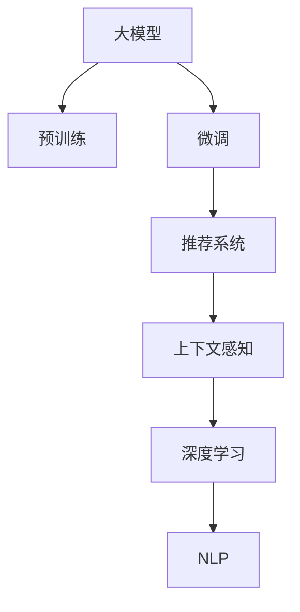

                 

# 基于大模型的电商平台个性化首页

> 关键词：大模型,电商个性化推荐,深度学习,自然语言处理(NLP),内容推荐,用户行为分析,上下文感知

## 1. 背景介绍

### 1.1 问题由来

随着互联网电商的蓬勃发展，电商平台如何更高效地为用户提供个性化服务，成为了各大电商巨头竞争的焦点。传统推荐算法如协同过滤、基于内容的推荐等，虽然在很多场景下都能取得不错的效果，但难以充分利用海量用户数据进行深度学习。近年来，基于深度学习的推荐系统在电商领域得到了广泛应用，其中基于大模型的推荐系统表现尤为突出。

大模型通过在全站数据上进行预训练，学习到丰富的用户行为和商品特征信息，能够更好地捕捉用户需求和商品间的关系，从而进行更为精准的个性化推荐。以大模型为核心的推荐系统在阿里巴巴、京东、亚马逊等电商平台上都取得了显著的成果，不仅提升了用户体验，也显著增加了电商平台的转化率和销售额。

### 1.2 问题核心关键点

构建一个基于大模型的电商平台个性化推荐系统，主要面临以下几个核心问题：

1. **数据获取与预处理**：如何高效、准确地获取电商平台的交易数据、用户行为数据、商品信息数据等，并进行有效的预处理和清洗。

2. **模型构建与训练**：如何选择和设计适合电商场景的大模型，进行有针对性的预训练和微调，以适配电商推荐任务。

3. **推荐策略优化**：如何综合利用用户历史行为、商品特征、上下文信息等，设计高效的推荐策略，实现个性化推荐。

4. **模型部署与监控**：如何将训练好的模型快速部署到实际业务场景，并在实时数据上高效推理，同时进行实时监控和评估。

### 1.3 问题研究意义

构建基于大模型的电商平台个性化推荐系统，对于提升电商平台的个性化服务水平、提高用户满意度、增加销售额具有重要意义：

1. **提升用户体验**：通过个性化的商品推荐，用户能更快地找到心仪的商品，减少浏览时间和购物决策难度，提升购物满意度。

2. **增加平台转化率**：精准的个性化推荐能够有效提升用户的购买转化率，增加电商平台的销售额。

3. **优化库存管理**：通过推荐系统优化库存和补货策略，减少库存积压，提高资金周转率。

4. **数据驱动决策**：利用大模型对用户行为和商品特征的深入分析，为电商平台的运营决策提供科学依据。

5. **实现跨平台协同**：利用大模型的迁移学习能力，在不同平台之间实现商品和用户的跨平台推荐，提高推荐效果。

## 2. 核心概念与联系

### 2.1 核心概念概述

为更好地理解基于大模型的电商平台个性化推荐系统，本节将介绍几个密切相关的核心概念：

- **大模型（Large Model）**：指在大量数据上预训练的深度神经网络模型，如BERT、GPT等。通过预训练学习到丰富的语言知识和特征，具有强大的表示能力。

- **预训练（Pre-training）**：指在大规模无标签数据上，通过自监督学习任务训练通用语言模型的过程。常见的预训练任务包括掩码语言模型、下一句预测等。

- **微调（Fine-tuning）**：指在预训练模型的基础上，使用下游任务的少量标注数据，通过有监督学习优化模型在特定任务上的性能。通常只需要调整顶层分类器或解码器，并以较小的学习率更新全部或部分的模型参数。

- **推荐系统（Recommendation System）**：通过分析用户的历史行为和偏好，推荐用户可能感兴趣的商品或内容。推荐系统应用广泛，包括电商、视频、新闻等。

- **深度学习（Deep Learning）**：一类基于神经网络的机器学习技术，通过多层非线性变换提取高层次特征，实现复杂任务的建模和预测。

- **自然语言处理（NLP）**：指对自然语言文本进行处理和分析的技术，包括分词、词性标注、句法分析、语义理解等。

- **上下文感知（Contextual Sensitivity）**：指模型能够根据输入的上下文信息，动态调整推荐策略，提高推荐的准确性和个性化程度。

这些核心概念之间的逻辑关系可以通过以下Mermaid流程图来展示：



这个流程图展示了大模型、预训练、微调、推荐系统、深度学习、自然语言处理和上下文感知之间的逻辑关系：

1. 大模型通过预训练获得基础能力。
2. 微调是对预训练模型进行任务特定的优化，适配推荐任务。
3. 推荐系统利用微调后的模型进行商品推荐。
4. 深度学习是推荐系统的核心技术。
5. 自然语言处理为推荐系统提供文本处理和理解能力。
6. 上下文感知增强推荐系统对用户和商品间的动态关联。

这些概念共同构成了电商推荐系统的核心框架，使其能够更好地为用户提供个性化服务。通过理解这些核心概念，我们可以更好地把握电商推荐系统的构建思路。

## 3. 核心算法原理 & 具体操作步骤

### 3.1 算法原理概述

基于大模型的电商平台个性化推荐系统，本质上是利用大模型的预训练和微调能力，进行个性化推荐的过程。其核心思想是：通过在大规模用户行为数据上进行预训练，学习到用户的兴趣、行为偏好等特征，然后在具体推荐任务上进行微调，优化模型对商品的相关性和预测能力。

具体而言，算法主要分为以下几个步骤：

1. **数据准备与预处理**：收集电商平台的交易数据、用户行为数据、商品信息数据等，并进行清洗和预处理。
2. **模型构建与预训练**：选择合适的大模型，在电商数据上进行预训练，学习用户行为和商品特征。
3. **模型微调与优化**：根据电商推荐任务，设计任务适配层，进行微调，优化推荐效果。
4. **推荐策略设计**：结合用户历史行为、商品特征、上下文信息等，设计高效的推荐策略，实现个性化推荐。
5. **模型部署与监控**：将训练好的模型部署到实际业务场景，并在实时数据上进行推理，同时进行实时监控和评估。

### 3.2 算法步骤详解

#### 3.2.1 数据准备与预处理

数据准备与预处理是构建电商推荐系统的第一步，主要包括以下几个方面：

- **数据收集**：从电商平台的数据仓库中获取交易数据、用户行为数据、商品信息数据等。交易数据包括用户的购买记录、评分、评论等信息，用户行为数据包括用户的浏览历史、点击行为、收藏行为等信息，商品信息数据包括商品的标题、描述、分类等信息。
- **数据清洗**：对数据进行去重、去噪、缺失值处理等清洗工作，确保数据质量。
- **数据划分**：将数据划分为训练集、验证集和测试集，用于模型的训练、调参和评估。

#### 3.2.2 模型构建与预训练

模型构建与预训练主要包括以下几个步骤：

- **模型选择**：选择合适的预训练语言模型，如BERT、GPT等，进行电商推荐任务的预训练。
- **预训练任务**：在电商数据上，设计预训练任务，如掩码语言模型、下一句预测等。
- **预训练优化**：使用优化算法如AdamW等，对预训练模型进行优化，提高模型效果。

#### 3.2.3 模型微调与优化

模型微调与优化主要包括以下几个步骤：

- **任务适配层设计**：根据电商推荐任务，设计任务适配层，如分类器、回归器等。
- **微调优化**：使用优化算法如AdamW等，对微调模型进行优化，提高推荐效果。
- **参数调整**：根据电商推荐任务的特点，调整模型的超参数，如学习率、批大小、迭代轮数等。

#### 3.2.4 推荐策略设计

推荐策略设计主要包括以下几个步骤：

- **特征工程**：从电商数据中提取特征，如用户ID、商品ID、历史行为等。
- **模型训练**：使用微调后的模型，对特征进行训练，得到模型预测结果。
- **推荐排序**：结合用户历史行为、商品特征、上下文信息等，设计排序算法，实现个性化推荐。

#### 3.2.5 模型部署与监控

模型部署与监控主要包括以下几个步骤：

- **模型保存**：将训练好的模型保存为模型文件，方便后续部署和使用。
- **模型部署**：将模型部署到实际业务场景，如电商平台的推荐页面。
- **实时监控**：实时采集模型输出结果，进行评估和监控，确保模型效果和稳定性。

### 3.3 算法优缺点

基于大模型的电商平台个性化推荐系统，具有以下优点：

- **精度高**：大模型具备强大的表示能力和泛化能力，能够学习到用户行为和商品特征的深层次关系，从而实现更精准的推荐。
- **效果稳定**：大模型经过预训练和微调，能够适应多种复杂的电商场景，推荐效果相对稳定。
- **可解释性强**：大模型的训练过程和参数调整都是透明的，可以提供更强的模型可解释性，便于调试和优化。
- **扩展性强**：大模型的结构灵活，可以根据不同的电商任务进行微调和优化，具有很强的扩展性。

同时，该方法也存在以下缺点：

- **计算成本高**：大模型的训练和推理需要较高的计算资源，对于计算资源有限的平台可能不适用。
- **数据需求大**：大模型的训练需要大量的电商数据，对于数据量不足的平台可能效果不佳。
- **参数量大**：大模型往往具有庞大的参数量，对于内存和存储资源有限的平台可能存在挑战。
- **模型复杂度高**：大模型结构复杂，模型训练和推理的复杂度较高，调试和优化难度较大。

尽管存在这些缺点，但就目前而言，基于大模型的推荐系统仍然是电商推荐领域的最佳实践，尤其是在数据量大、计算资源充足的平台。

### 3.4 算法应用领域

基于大模型的电商平台个性化推荐系统，已经在多个电商平台上得到了广泛应用，包括阿里巴巴、京东、亚马逊等。具体应用场景包括：

- **商品推荐**：根据用户的历史购买记录、浏览行为等，推荐用户可能感兴趣的商品。
- **新用户推荐**：针对新用户，推荐其可能感兴趣的商品，提高新用户留存率。
- **跨平台推荐**：在不同平台之间实现商品和用户的跨平台推荐，提高推荐效果。
- **个性化展示**：在商品展示页面上，根据用户行为和偏好，动态展示商品，提高用户点击率。
- **个性化营销**：根据用户行为和偏好，设计个性化营销策略，提高营销效果。

除了上述这些经典应用场景外，大模型的推荐系统还被创新性地应用于智能客服、智能广告等场景中，为电商平台的智能化升级提供了新的技术路径。

## 4. 数学模型和公式 & 详细讲解  
### 4.1 数学模型构建

本节将使用数学语言对基于大模型的电商平台个性化推荐系统进行更加严格的刻画。

记电商平台的交易数据为 $D=\{(x_i, y_i)\}_{i=1}^N$，其中 $x_i$ 为用户行为数据，$y_i$ 为对应的商品ID。记用户历史行为数据的表示为 $X$，商品的特征表示为 $Y$，用户对商品的评分表示为 $R$。

定义电商推荐任务的损失函数为：

$$
\mathcal{L}(\theta) = \frac{1}{N} \sum_{i=1}^N \ell(M_{\theta}(x_i),y_i)
$$

其中 $\ell$ 为推荐任务定义的损失函数，如均方误差损失等。

微调的优化目标是最小化损失函数，即找到最优参数：

$$
\theta^* = \mathop{\arg\min}_{\theta} \mathcal{L}(\theta)
$$

在得到损失函数的梯度后，即可带入参数更新公式，完成模型的迭代优化。重复上述过程直至收敛，最终得到适应电商推荐任务的最优模型参数 $\theta^*$。

### 4.2 公式推导过程

以下我们以电商商品推荐任务为例，推导推荐模型在用户行为数据上的损失函数及其梯度的计算公式。

假设推荐模型 $M_{\theta}$ 在用户行为数据 $x_i$ 上的输出为 $\hat{y}_i=M_{\theta}(x_i)$，表示用户对商品 $y_i$ 的评分预测值。真实评分 $y_i \in [0,1]$。则推荐任务的损失函数定义为：

$$
\ell(M_{\theta}(x_i),y_i) = \frac{1}{2}(y_i - \hat{y}_i)^2
$$

将其代入损失函数公式，得：

$$
\mathcal{L}(\theta) = \frac{1}{N} \sum_{i=1}^N \frac{1}{2}(y_i - \hat{y}_i)^2
$$

根据链式法则，损失函数对参数 $\theta_k$ 的梯度为：

$$
\frac{\partial \mathcal{L}(\theta)}{\partial \theta_k} = \frac{1}{N} \sum_{i=1}^N \left[-y_i \frac{\partial \hat{y}_i}{\partial \theta_k} + \hat{y}_i \frac{\partial \hat{y}_i}{\partial \theta_k}\right]
$$

其中 $\frac{\partial \hat{y}_i}{\partial \theta_k}$ 可进一步递归展开，利用自动微分技术完成计算。

在得到损失函数的梯度后，即可带入参数更新公式，完成模型的迭代优化。重复上述过程直至收敛，最终得到适应电商推荐任务的最优模型参数 $\theta^*$。

## 5. 项目实践：代码实例和详细解释说明

### 5.1 开发环境搭建

在进行电商推荐系统开发前，我们需要准备好开发环境。以下是使用Python进行PyTorch开发的环境配置流程：

1. 安装Anaconda：从官网下载并安装Anaconda，用于创建独立的Python环境。

2. 创建并激活虚拟环境：
```bash
conda create -n pytorch-env python=3.8 
conda activate pytorch-env
```

3. 安装PyTorch：根据CUDA版本，从官网获取对应的安装命令。例如：
```bash
conda install pytorch torchvision torchaudio cudatoolkit=11.1 -c pytorch -c conda-forge
```

4. 安装Transformers库：
```bash
pip install transformers
```

5. 安装各类工具包：
```bash
pip install numpy pandas scikit-learn matplotlib tqdm jupyter notebook ipython
```

完成上述步骤后，即可在`pytorch-env`环境中开始电商推荐系统开发。

### 5.2 源代码详细实现

这里我们以基于大模型的电商商品推荐系统为例，给出使用Transformers库对预训练模型进行微调的PyTorch代码实现。

首先，定义电商推荐任务的数据处理函数：

```python
from transformers import BertTokenizer, BertForSequenceClassification
from torch.utils.data import Dataset, DataLoader
import torch

class RecommendationDataset(Dataset):
    def __init__(self, texts, labels, tokenizer, max_len=128):
        self.texts = texts
        self.labels = labels
        self.tokenizer = tokenizer
        self.max_len = max_len
        
    def __len__(self):
        return len(self.texts)
    
    def __getitem__(self, item):
        text = self.texts[item]
        label = self.labels[item]
        
        encoding = self.tokenizer(text, return_tensors='pt', max_length=self.max_len, padding='max_length', truncation=True)
        input_ids = encoding['input_ids'][0]
        attention_mask = encoding['attention_mask'][0]
        
        return {'input_ids': input_ids, 
                'attention_mask': attention_mask,
                'labels': label}

# 定义标签与id的映射
label2id = {'buy': 0, 'review': 1, 'rating': 2, 'search': 3}
id2label = {v: k for k, v in label2id.items()}

# 创建dataset
tokenizer = BertTokenizer.from_pretrained('bert-base-cased')

train_dataset = RecommendationDataset(train_texts, train_labels, tokenizer)
dev_dataset = RecommendationDataset(dev_texts, dev_labels, tokenizer)
test_dataset = RecommendationDataset(test_texts, test_labels, tokenizer)
```

然后，定义模型和优化器：

```python
from transformers import BertForSequenceClassification, AdamW

model = BertForSequenceClassification.from_pretrained('bert-base-cased', num_labels=len(label2id))

optimizer = AdamW(model.parameters(), lr=2e-5)
```

接着，定义训练和评估函数：

```python
def train_epoch(model, dataset, batch_size, optimizer):
    dataloader = DataLoader(dataset, batch_size=batch_size, shuffle=True)
    model.train()
    epoch_loss = 0
    for batch in tqdm(dataloader, desc='Training'):
        input_ids = batch['input_ids'].to(device)
        attention_mask = batch['attention_mask'].to(device)
        labels = batch['labels'].to(device)
        model.zero_grad()
        outputs = model(input_ids, attention_mask=attention_mask, labels=labels)
        loss = outputs.loss
        epoch_loss += loss.item()
        loss.backward()
        optimizer.step()
    return epoch_loss / len(dataloader)

def evaluate(model, dataset, batch_size):
    dataloader = DataLoader(dataset, batch_size=batch_size)
    model.eval()
    preds, labels = [], []
    with torch.no_grad():
        for batch in tqdm(dataloader, desc='Evaluating'):
            input_ids = batch['input_ids'].to(device)
            attention_mask = batch['attention_mask'].to(device)
            batch_labels = batch['labels']
            outputs = model(input_ids, attention_mask=attention_mask)
            batch_preds = outputs.logits.argmax(dim=2).to('cpu').tolist()
            batch_labels = batch_labels.to('cpu').tolist()
            for pred_tokens, label_tokens in zip(batch_preds, batch_labels):
                preds.append(pred_tokens)
                labels.append(label_tokens)
                
    return preds, labels

# 训练流程
epochs = 5
batch_size = 16

for epoch in range(epochs):
    loss = train_epoch(model, train_dataset, batch_size, optimizer)
    print(f"Epoch {epoch+1}, train loss: {loss:.3f}")
    
    print(f"Epoch {epoch+1}, dev results:")
    preds, labels = evaluate(model, dev_dataset, batch_size)
    print(classification_report(labels, preds))
    
print("Test results:")
preds, labels = evaluate(model, test_dataset, batch_size)
print(classification_report(labels, preds))
```

以上就是使用PyTorch对BERT进行电商商品推荐任务微调的完整代码实现。可以看到，得益于Transformers库的强大封装，我们可以用相对简洁的代码完成BERT模型的加载和微调。

### 5.3 代码解读与分析

让我们再详细解读一下关键代码的实现细节：

**RecommendationDataset类**：
- `__init__`方法：初始化文本、标签、分词器等关键组件。
- `__len__`方法：返回数据集的样本数量。
- `__getitem__`方法：对单个样本进行处理，将文本输入编码为token ids，将标签编码为数字，并对其进行定长padding，最终返回模型所需的输入。

**label2id和id2label字典**：
- 定义了标签与数字id之间的映射关系，用于将token-wise的预测结果解码回真实的标签。

**训练和评估函数**：
- 使用PyTorch的DataLoader对数据集进行批次化加载，供模型训练和推理使用。
- 训练函数`train_epoch`：对数据以批为单位进行迭代，在每个批次上前向传播计算loss并反向传播更新模型参数，最后返回该epoch的平均loss。
- 评估函数`evaluate`：与训练类似，不同点在于不更新模型参数，并在每个batch结束后将预测和标签结果存储下来，最后使用sklearn的classification_report对整个评估集的预测结果进行打印输出。

**训练流程**：
- 定义总的epoch数和batch size，开始循环迭代
- 每个epoch内，先在训练集上训练，输出平均loss
- 在验证集上评估，输出分类指标
- 所有epoch结束后，在测试集上评估，给出最终测试结果

可以看到，PyTorch配合Transformers库使得BERT微调的代码实现变得简洁高效。开发者可以将更多精力放在数据处理、模型改进等高层逻辑上，而不必过多关注底层的实现细节。

当然，工业级的系统实现还需考虑更多因素，如模型的保存和部署、超参数的自动搜索、更灵活的任务适配层等。但核心的微调范式基本与此类似。

## 6. 实际应用场景

### 6.1 智能客服系统

基于大模型的电商平台个性化推荐系统，可以广泛应用于智能客服系统的构建。传统客服往往需要配备大量人力，高峰期响应缓慢，且一致性和专业性难以保证。而使用微调后的推荐系统，可以7x24小时不间断服务，快速响应客户咨询，用推荐结果引导客户选择最合适的商品，提高客户满意度和转化率。

在技术实现上，可以收集企业内部的历史推荐记录，将商品-评分对作为微调数据，训练模型学习商品-评分映射。微调后的推荐系统能够自动理解用户意图，推荐符合用户兴趣的商品。对于客户提出的新问题，还可以接入检索系统实时搜索相关商品，动态组织推荐结果，实现实时智能客服。

### 6.2 个性化展示

在电商平台推荐页面上，基于大模型的推荐系统可以动态展示商品，提高用户点击率和购买转化率。用户浏览页面时，系统根据用户行为和历史推荐记录，动态调整商品排序，优先推荐用户感兴趣的商品。同时，系统还可以根据用户当前浏览的上下文信息，推荐相关商品，提高用户停留时间和浏览深度。

### 6.3 个性化广告

电商平台上，广告投放是一个重要的收入来源。基于大模型的推荐系统可以根据用户历史行为和兴趣，进行个性化的广告推荐。系统将广告内容和用户行为数据作为输入，训练模型预测广告点击率。然后根据点击率对广告进行排序，优先展示点击率高的广告，提升广告效果和ROI。

### 6.4 未来应用展望

随着大模型和推荐系统技术的不断发展，基于大模型的电商平台个性化推荐系统将呈现以下几个发展趋势：

1. **多模态融合**：未来的推荐系统不仅关注文本数据，还将引入图像、视频等多模态数据，进行多模态融合，提高推荐效果。

2. **实时性优化**：为了提高推荐效果，未来的推荐系统将更加注重实时性，通过流式处理和实时数据更新，提升推荐精度和个性化程度。

3. **跨平台协同**：未来的推荐系统将打破平台边界，实现跨平台协同推荐，提高推荐效果和用户体验。

4. **可解释性增强**：未来的推荐系统将增强可解释性，提供推荐理由和逻辑解释，帮助用户理解推荐结果，增强用户信任。

5. **个性化深度学习**：未来的推荐系统将结合个性化深度学习技术，实现更加精准的用户行为预测和商品推荐。

6. **主动学习与推荐**：未来的推荐系统将引入主动学习技术，主动探索和发现用户未反馈的兴趣点，提升推荐效果。

这些趋势凸显了大模型和推荐系统技术的广阔前景。这些方向的探索发展，必将进一步提升电商平台个性化推荐系统的性能和用户体验，为电商平台的智能化升级提供新的技术路径。

## 7. 工具和资源推荐

### 7.1 学习资源推荐

为了帮助开发者系统掌握电商推荐系统的理论基础和实践技巧，这里推荐一些优质的学习资源：

1. 《深度学习推荐系统》课程：由DeepLearning.ai开设的推荐系统系列课程，涵盖推荐系统基本概念、模型构建、算法优化等。

2. 《推荐系统实战》书籍：该书系统介绍了电商推荐系统的构建和优化方法，包括数据处理、模型训练、效果评估等。

3. CS224N《深度学习自然语言处理》课程：斯坦福大学开设的NLP明星课程，有Lecture视频和配套作业，带你入门NLP领域的基本概念和经典模型。

4. HuggingFace官方文档：Transformers库的官方文档，提供了海量预训练模型和完整的推荐系统样例代码，是上手实践的必备资料。

5. PyTorch官方文档：PyTorch框架的官方文档，包含丰富的推荐系统实现案例，是电商推荐系统开发的可靠参考。

通过对这些资源的学习实践，相信你一定能够快速掌握电商推荐系统的精髓，并用于解决实际的电商推荐问题。

### 7.2 开发工具推荐

高效的开发离不开优秀的工具支持。以下是几款用于电商推荐系统开发的常用工具：

1. PyTorch：基于Python的开源深度学习框架，灵活动态的计算图，适合快速迭代研究。大部分预训练语言模型都有PyTorch版本的实现。

2. TensorFlow：由Google主导开发的开源深度学习框架，生产部署方便，适合大规模工程应用。同样有丰富的预训练语言模型资源。

3. Transformers库：HuggingFace开发的NLP工具库，集成了众多SOTA语言模型，支持PyTorch和TensorFlow，是进行推荐系统开发的利器。

4. Weights & Biases：模型训练的实验跟踪工具，可以记录和可视化模型训练过程中的各项指标，方便对比和调优。与主流深度学习框架无缝集成。

5. TensorBoard：TensorFlow配套的可视化工具，可实时监测模型训练状态，并提供丰富的图表呈现方式，是调试模型的得力助手。

6. Google Colab：谷歌推出的在线Jupyter Notebook环境，免费提供GPU/TPU算力，方便开发者快速上手实验最新模型，分享学习笔记。

合理利用这些工具，可以显著提升电商推荐系统的开发效率，加快创新迭代的步伐。

### 7.3 相关论文推荐

电商推荐系统领域的研究涉及数据处理、模型构建、算法优化等多个方面，以下是几篇奠基性的相关论文，推荐阅读：

1. "The Matrix Factorization Approach to Recommender System"：提出基于矩阵分解的推荐算法，广泛应用于电商推荐系统。

2. "A Survey on Deep Learning for Recommendation Systems"：系统回顾了深度学习在推荐系统中的应用，包括预训练模型、微调方法等。

3. "Wide & Deep Learning Recommendation Model"：提出结合宽模型和深模型的推荐系统，提升了推荐效果和泛化能力。

4. "Adaptive Interactions for Personalized Ranking"：提出结合自适应交互的推荐算法，提高了推荐的个性化程度。

5. "Attention Is All You Need"：提出Transformer模型，改变了NLP领域的推荐系统构建范式，提高了推荐效果和泛化能力。

这些论文代表了大模型和推荐系统的发展脉络。通过学习这些前沿成果，可以帮助研究者把握学科前进方向，激发更多的创新灵感。

## 8. 总结：未来发展趋势与挑战

### 8.1 总结

本文对基于大模型的电商平台个性化推荐系统进行了全面系统的介绍。首先阐述了电商推荐系统的研究背景和意义，明确了微调在电商推荐任务中的独特价值。其次，从原理到实践，详细讲解了电商推荐系统的数学原理和关键步骤，给出了电商推荐任务开发的完整代码实例。同时，本文还广泛探讨了电商推荐系统在智能客服、个性化展示、个性化广告等众多场景中的应用前景，展示了电商推荐系统的广泛应用。

通过本文的系统梳理，可以看到，基于大模型的电商推荐系统正在成为电商推荐领域的最佳实践，极大地拓展了电商平台的推荐能力和用户体验。未来，伴随大模型和推荐系统技术的持续演进，基于大模型的推荐系统必将在电商领域带来新的突破。

### 8.2 未来发展趋势

展望未来，电商推荐系统将呈现以下几个发展趋势：

1. **模型规模持续增大**：随着算力成本的下降和数据规模的扩张，电商推荐系统的模型规模将持续增长，模型复杂度将进一步提升。

2. **跨模态融合**：未来的电商推荐系统将更加注重多模态数据的融合，引入图像、视频等多模态数据，提高推荐效果。

3. **实时性优化**：为了提高推荐效果，未来的电商推荐系统将更加注重实时性，通过流式处理和实时数据更新，提升推荐精度和个性化程度。

4. **跨平台协同**：未来的电商推荐系统将打破平台边界，实现跨平台协同推荐，提高推荐效果和用户体验。

5. **可解释性增强**：未来的电商推荐系统将增强可解释性，提供推荐理由和逻辑解释，帮助用户理解推荐结果，增强用户信任。

6. **个性化深度学习**：未来的电商推荐系统将结合个性化深度学习技术，实现更加精准的用户行为预测和商品推荐。

7. **主动学习与推荐**：未来的电商推荐系统将引入主动学习技术，主动探索和发现用户未反馈的兴趣点，提升推荐效果。

以上趋势凸显了大模型和电商推荐系统的广阔前景。这些方向的探索发展，必将进一步提升电商推荐系统的性能和用户体验，为电商平台的智能化升级提供新的技术路径。

### 8.3 面临的挑战

尽管电商推荐系统已经取得了显著的成果，但在迈向更加智能化、普适化应用的过程中，它仍面临着诸多挑战：

1. **数据获取与预处理**：电商推荐系统需要大量电商数据进行训练，数据获取与预处理成本较高。

2. **模型复杂度**：电商推荐系统通常需要复杂的模型进行训练，计算资源和存储空间需求较高。

3. **推荐效果稳定**：电商推荐系统需要在不同场景下保持稳定，避免推荐结果波动。

4. **个性化深度**：电商推荐系统需要深入理解用户行为和商品特征，个性化程度要求较高。

5. **跨平台协同**：电商推荐系统需要在不同平台之间进行协同推荐，难度较大。

6. **可解释性不足**：电商推荐系统通常是"黑盒"模型，难以解释其内部工作机制和决策逻辑。

7. **安全性与隐私保护**：电商推荐系统需要保障用户数据安全和隐私保护，避免数据泄露和滥用。

8. **模型迁移与部署**：电商推荐系统需要在多个平台之间进行模型迁移和部署，难度较大。

尽管存在这些挑战，但电商推荐系统已经在电商领域取得了广泛应用，未来随着技术的不断进步，这些挑战终将逐步得到解决。

### 8.4 研究展望

面向未来，电商推荐系统需要在以下几个方面进行进一步的研究：

1. **数据获取与预处理优化**：研究高效的数据获取与预处理方法，降低电商推荐系统的数据获取和预处理成本。

2. **模型压缩与优化**：研究模型压缩与优化方法，降低电商推荐系统的计算资源和存储空间需求。

3. **推荐效果稳定性提升**：研究推荐效果稳定性提升方法，提高电商推荐系统的推荐精度和个性化程度。

4. **个性化深度提升**：研究个性化深度提升方法，提高电商推荐系统的个性化程度，提升用户体验。

5. **跨平台协同推荐**：研究跨平台协同推荐方法，提高电商推荐系统的推荐效果和用户体验。

6. **模型可解释性增强**：研究电商推荐系统的可解释性增强方法，提高模型的可解释性和用户信任度。

7. **安全性与隐私保护**：研究电商推荐系统的安全性与隐私保护方法，保障用户数据安全和隐私保护。

8. **模型迁移与部署优化**：研究电商推荐系统的模型迁移与部署优化方法，提高模型迁移和部署的效率。

这些研究方向的研究成果，将为电商推荐系统带来新的突破，推动电商平台的智能化升级，提升用户体验和电商平台的竞争力。

## 9. 附录：常见问题与解答

**Q1：电商推荐系统是否适用于所有电商场景？**

A: 电商推荐系统在大多数电商场景上都能取得不错的效果，特别是数据量较大的场景。但对于一些特定领域的电商，如垂直电商、小众电商等，由于数据量较少，可能效果不佳。此时需要在特定领域语料上进一步预训练，再进行微调，才能获得理想效果。

**Q2：电商推荐系统如何处理长尾商品？**

A: 长尾商品在电商推荐系统中通常表现较差，因为其数据量较少，难以充分训练模型。针对长尾商品，可以采用冷启动策略，使用用户行为数据进行推荐，同时引入基于内容的推荐，提升长尾商品的曝光率和点击率。

**Q3：电商推荐系统如何处理新商品？**

A: 新商品通常没有历史行为数据，难以进行推荐。针对新商品，可以使用基于内容的推荐，通过商品描述、分类等信息进行推荐。同时，可以引入KNN等冷启动推荐算法，利用相似商品进行推荐。

**Q4：电商推荐系统如何处理用户反馈？**

A: 用户反馈对于电商推荐系统非常重要，可以帮助模型学习用户的新需求和兴趣点。针对用户反馈，可以将其作为微调数据，训练模型学习新的推荐策略。同时，可以将用户反馈引入推荐排序算法，提升推荐效果。

**Q5：电商推荐系统如何处理上下文信息？**

A: 上下文信息对于电商推荐系统非常重要，可以帮助模型学习用户当前情境下的需求和兴趣点。针对上下文信息，可以将其作为输入特征，进行推荐排序。同时，可以引入上下文感知推荐模型，如CTRNet等，提高推荐效果。

这些问题的解答，可以帮助开发者更好地理解和应用电商推荐系统，提升电商平台的推荐效果和用户体验。

