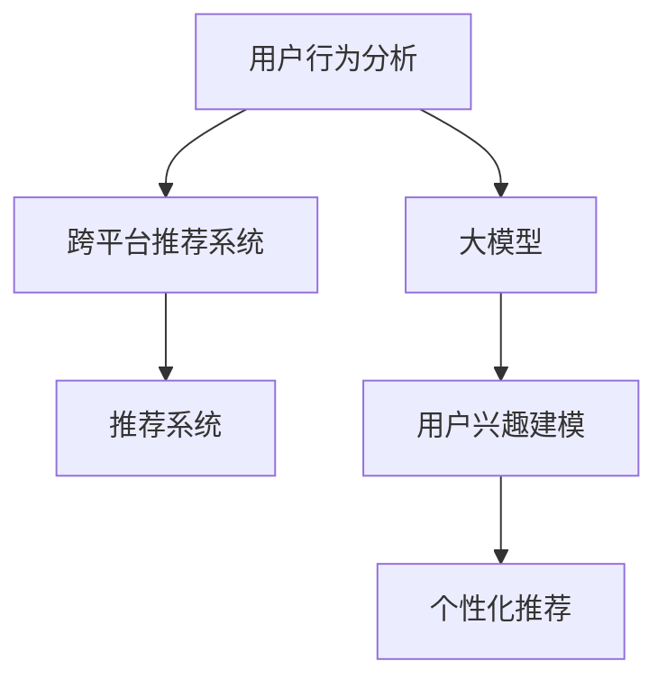

                 

# 基于大模型的跨平台用户兴趣迁移

> 关键词：用户行为分析,跨平台迁移,大模型,推荐系统,个性化推荐,用户兴趣建模

## 1. 背景介绍

### 1.1 问题由来

随着互联网的普及，用户的行为数据愈发丰富。社交媒体、电商、视频网站等各类平台上的行为数据交织在一起，形成了海量的、多维度的大数据池。然而，用户在不同的平台上产生的数据往往是孤立的，导致用户兴趣的跨平台迁移分析难以实现。如何有效整合多平台数据，构建统一的跨平台用户画像，是当下热门的研究课题。

在推荐系统中，跨平台的用户兴趣迁移尤为重要。不同平台上的数据分布存在差异，单一平台的用户行为数据难以全面反映用户的真实兴趣和偏好。通过整合跨平台数据，可以得到更全面、更精准的用户画像，从而提升推荐系统的个性化和相关性，增强用户体验，推动行业发展。

### 1.2 问题核心关键点

为了解决跨平台用户兴趣迁移问题，当前主要采用了以下几种方法：

- 用户行为数据融合：整合不同平台的用户行为数据，构建统一的用户行为序列。
- 用户兴趣建模：构建多维度、多层次的用户兴趣模型，更好地反映用户的多样化需求。
- 跨平台推荐系统：结合不同平台的用户画像，实现跨平台的个性化推荐。

本文聚焦于如何通过大模型实现跨平台用户兴趣迁移。大模型通常具有强大的自适应能力和泛化能力，通过预训练学习到的知识可以迁移到新的场景中。本文旨在探索大模型在跨平台用户兴趣迁移中的潜力，并通过具体案例展示其实际应用效果。

### 1.3 问题研究意义

跨平台用户兴趣迁移是推荐系统中的重要研究方向。良好的跨平台迁移能力，可以使推荐系统更全面地理解用户需求，提供个性化推荐服务，提升用户满意度，推动行业升级。

研究大模型在跨平台用户兴趣迁移中的应用，具有以下重要意义：

1. 降低迁移成本。通过大模型学习到的跨平台知识，可以在新平台快速应用，避免从头开发。
2. 提升迁移效果。大模型具备泛化能力，可以在保持原有模型能力的同时，学习新平台的特性。
3. 提高迁移速度。大模型在迁移过程中，可以自动化地对参数进行微调，缩短迁移时间。
4. 增强迁移泛化。大模型可以在不同的数据分布上学习用户兴趣，适应更广泛的数据环境。

总之，基于大模型的跨平台用户兴趣迁移，能够显著提升推荐系统的性能和覆盖范围，推动人工智能技术的落地应用。

## 2. 核心概念与联系

### 2.1 核心概念概述

为更好地理解基于大模型的跨平台用户兴趣迁移，本节将介绍几个密切相关的核心概念：

- 用户行为分析(User Behavior Analysis, UBA)：通过对用户在不同平台上的行为数据进行分析，挖掘用户兴趣和行为模式。
- 跨平台推荐系统(Cross-Platform Recommendation System)：结合不同平台的用户画像，提供个性化推荐服务。
- 大模型(Large Model)：如BERT、GPT等，具有大规模参数量和大容量数据的深度学习模型。
- 推荐系统(Recommendation System)：通过学习用户兴趣和物品属性，提供个性化物品推荐服务。
- 用户兴趣建模(User Interest Modeling)：通过聚类、分类、关联规则等方法，从用户行为数据中挖掘出用户兴趣特征。

这些概念之间的逻辑关系可以通过以下Mermaid流程图来展示：



这个流程图展示了用户行为分析、跨平台推荐系统、大模型和推荐系统之间的关系：

1. 用户行为分析通过整合多平台数据，构建用户行为序列。
2. 跨平台推荐系统结合不同平台的用户画像，提供个性化推荐。
3. 大模型通过预训练学习跨平台知识，帮助推荐系统更好地理解用户需求。
4. 用户兴趣建模从用户行为数据中挖掘兴趣特征，增强推荐系统的相关性。

这些概念共同构成了跨平台用户兴趣迁移的基础，使得推荐系统能够实现更全面的个性化服务。

## 3. 核心算法原理 & 具体操作步骤
### 3.1 算法原理概述

基于大模型的跨平台用户兴趣迁移，本质上是一个迁移学习过程。其核心思想是：将预训练大模型应用于新平台的推荐任务，利用大模型在通用领域学到的知识，在新领域进行迁移学习，以获得最佳的个性化推荐效果。

具体地，假设新平台的推荐数据集为 $D=\{(x_i,y_i)\}_{i=1}^N$，其中 $x_i$ 为输入特征向量，$y_i$ 为输出标签（推荐结果）。我们将大模型 $M_{\theta}$ 作为初始化参数，通过在新数据集上进行有监督学习，优化模型参数 $\theta$，使得模型在新任务上获得最优的推荐效果。

形式化地，假设目标任务为多标签分类，目标函数为交叉熵损失函数，则优化目标为：

$$
\theta^* = \mathop{\arg\min}_{\theta} \mathcal{L}(M_{\theta},D) = \mathop{\arg\min}_{\theta} -\frac{1}{N}\sum_{i=1}^N \sum_{j=1}^{K} y_{ij}\log M_{\theta}(x_i, j)
$$

其中 $K$ 表示标签数，$y_{ij}$ 表示样本 $i$ 在第 $j$ 个标签上的真实标签，$M_{\theta}(x_i, j)$ 表示模型在输入 $x_i$ 下对标签 $j$ 的预测概率。

通过梯度下降等优化算法，不断更新模型参数 $\theta$，最小化损失函数 $\mathcal{L}$，使模型在目标任务上获得最优的推荐效果。

### 3.2 算法步骤详解

基于大模型的跨平台用户兴趣迁移一般包括以下几个关键步骤：

**Step 1: 准备预训练模型和数据集**
- 选择合适的预训练模型 $M_{\theta}$ 作为初始化参数，如 BERT、GPT等。
- 收集新平台的推荐数据集 $D$，划分为训练集、验证集和测试集。

**Step 2: 迁移学习模型设计**
- 设计一个跨平台推荐系统，将不同平台的用户行为数据进行整合，生成统一的输入特征。
- 将整合后的数据集输入大模型 $M_{\theta}$，通过多标签分类任务进行迁移学习，生成跨平台推荐模型 $M_{\hat{\theta}}$。

**Step 3: 设定模型优化超参数**
- 选择合适的优化算法及其参数，如 Adam、SGD 等，设置学习率、批大小、迭代轮数等。
- 设置正则化技术及强度，包括权重衰减、Dropout、Early Stopping 等。

**Step 4: 执行梯度训练**
- 将训练集数据分批次输入模型，前向传播计算损失函数。
- 反向传播计算参数梯度，根据设定的优化算法和学习率更新模型参数。
- 周期性在验证集上评估模型性能，根据性能指标决定是否触发 Early Stopping。
- 重复上述步骤直到满足预设的迭代轮数或 Early Stopping 条件。

**Step 5: 测试和部署**
- 在测试集上评估迁移后模型 $M_{\hat{\theta}}$ 的性能，对比迁移前后的精度提升。
- 使用迁移后的模型对新样本进行推荐，集成到实际的应用系统中。
- 持续收集新的数据，定期重新迁移模型，以适应数据分布的变化。

以上是基于大模型的跨平台用户兴趣迁移的一般流程。在实际应用中，还需要针对具体任务的特点，对迁移过程的各个环节进行优化设计，如改进输入特征生成方法，引入更多的正则化技术，搜索最优的超参数组合等，以进一步提升模型性能。

### 3.3 算法优缺点

基于大模型的跨平台用户兴趣迁移方法具有以下优点：
1. 迁移速度快。大模型已经在大规模数据上进行了预训练，可以快速适应新平台，减少迁移所需的时间和资源。
2. 迁移效果好。大模型具有强大的泛化能力，能够在不同的数据分布上学习用户兴趣，适应新平台的特点。
3. 模型可解释性强。大模型通常采用可解释性更强的架构，如Transformer，能够提供更好的特征解释。
4. 适应性强。大模型可以在多种任务上进行迁移学习，灵活应用在推荐系统、自然语言处理等领域。

同时，该方法也存在一定的局限性：
1. 数据依赖性强。迁移学习的效果很大程度上取决于新平台的数据质量，收集高质量标注数据成本较高。
2. 模型可塑性有限。当新平台的数据分布与预训练数据差异较大时，迁移效果可能不理想。
3. 泛化能力不足。不同平台的数据分布存在差异，大模型在新平台上的泛化能力可能受限。
4. 计算资源需求高。大模型通常具有大规模参数量，对计算资源的需求较高。

尽管存在这些局限性，但就目前而言，基于大模型的跨平台用户兴趣迁移方法仍然是大规模数据迁移的强有力手段。未来相关研究的重点在于如何进一步降低迁移对标注数据的依赖，提高模型的泛化能力和适应性，同时兼顾可解释性和计算效率等因素。

### 3.4 算法应用领域

基于大模型的跨平台用户兴趣迁移方法，在推荐系统、自然语言处理、智能客服等多个领域得到广泛应用：

- 推荐系统：将多平台用户行为数据整合后，通过大模型进行迁移学习，生成跨平台的推荐模型。
- 自然语言处理：将不同平台的用户评论、文章整合后，通过大模型学习用户语义，生成跨平台的语义模型。
- 智能客服：将不同平台的用户咨询记录整合后，通过大模型学习用户意图，生成跨平台的智能客服模型。
- 金融风控：将不同平台的用户交易记录整合后，通过大模型学习用户行为，生成跨平台的金融风控模型。
- 电商广告：将不同平台的用户浏览记录整合后，通过大模型学习用户兴趣，生成跨平台的电商广告推荐模型。

除了上述这些应用外，大模型的跨平台迁移能力还能被创新性地应用到更多场景中，如广告投放、社交网络、在线教育等，为不同领域的智能化升级提供新的技术手段。

## 4. 数学模型和公式 & 详细讲解  
### 4.1 数学模型构建

本节将使用数学语言对基于大模型的跨平台用户兴趣迁移过程进行更加严格的刻画。

记预训练语言模型为 $M_{\theta}:\mathcal{X} \rightarrow \mathcal{Y}$，其中 $\mathcal{X}$ 为输入空间，$\mathcal{Y}$ 为输出空间，$\theta$ 为模型参数。假设目标任务为多标签分类，目标数据集为 $D=\{(x_i,y_i)\}_{i=1}^N, x_i \in \mathcal{X}, y_i \in \{0,1\}^K$。

定义模型 $M_{\theta}$ 在输入 $x$ 上的输出为 $\hat{y}=M_{\theta}(x) \in [0,1]^K$，表示样本属于各标签的概率向量。目标函数为交叉熵损失函数，则迁移学习的目标为：

$$
\theta^* = \mathop{\arg\min}_{\theta} -\frac{1}{N}\sum_{i=1}^N \sum_{j=1}^{K} y_{ij}\log M_{\theta}(x_i, j)
$$

其中 $K$ 表示标签数，$y_{ij}$ 表示样本 $i$ 在第 $j$ 个标签上的真实标签。

根据链式法则，损失函数对参数 $\theta_k$ 的梯度为：

$$
\frac{\partial \mathcal{L}(\theta)}{\partial \theta_k} = -\frac{1}{N}\sum_{i=1}^N \sum_{j=1}^{K} y_{ij}(\frac{\partial M_{\theta}(x_i, j)}{\partial \theta_k})
$$

其中 $\frac{\partial M_{\theta}(x_i, j)}{\partial \theta_k}$ 可进一步递归展开，利用自动微分技术完成计算。

### 4.2 公式推导过程

以下我们以多标签分类任务为例，推导交叉熵损失函数及其梯度的计算公式。

假设模型 $M_{\theta}$ 在输入 $x$ 上的输出为 $\hat{y}=M_{\theta}(x) \in [0,1]^K$，表示样本属于各标签的概率向量。真实标签 $y_i$ 为二进制向量，其中 $y_{ij}=1$ 表示样本 $i$ 在第 $j$ 个标签上为正类，$y_{ij}=0$ 表示为负类。则多标签分类任务中的交叉熵损失函数定义为：

$$
\ell(M_{\theta}(x),y) = -\frac{1}{N}\sum_{i=1}^N \sum_{j=1}^{K} y_{ij}\log M_{\theta}(x_i, j)
$$

将其代入迁移学习目标公式，得：

$$
\mathcal{L}(\theta) = -\frac{1}{N}\sum_{i=1}^N \sum_{j=1}^{K} y_{ij}\log M_{\theta}(x_i, j)
$$

根据链式法则，损失函数对参数 $\theta_k$ 的梯度为：

$$
\frac{\partial \mathcal{L}(\theta)}{\partial \theta_k} = -\frac{1}{N}\sum_{i=1}^N \sum_{j=1}^{K} y_{ij}(\frac{\partial M_{\theta}(x_i, j)}{\partial \theta_k})
$$

其中 $\frac{\partial M_{\theta}(x_i, j)}{\partial \theta_k}$ 可进一步递归展开，利用自动微分技术完成计算。

在得到损失函数的梯度后，即可带入参数更新公式，完成模型的迭代优化。重复上述过程直至收敛，最终得到适应新平台的多标签分类模型 $\theta^*$。

## 5. 项目实践：代码实例和详细解释说明
### 5.1 开发环境搭建

在进行跨平台用户兴趣迁移实践前，我们需要准备好开发环境。以下是使用Python进行PyTorch开发的环境配置流程：

1. 安装Anaconda：从官网下载并安装Anaconda，用于创建独立的Python环境。

2. 创建并激活虚拟环境：
```bash
conda create -n pytorch-env python=3.8 
conda activate pytorch-env
```

3. 安装PyTorch：根据CUDA版本，从官网获取对应的安装命令。例如：
```bash
conda install pytorch torchvision torchaudio cudatoolkit=11.1 -c pytorch -c conda-forge
```

4. 安装Transformers库：
```bash
pip install transformers
```

5. 安装各类工具包：
```bash
pip install numpy pandas scikit-learn matplotlib tqdm jupyter notebook ipython
```

完成上述步骤后，即可在`pytorch-env`环境中开始跨平台用户兴趣迁移实践。

### 5.2 源代码详细实现

这里我们以多标签分类任务为例，给出使用Transformers库对BERT模型进行跨平台用户兴趣迁移的PyTorch代码实现。

首先，定义多标签分类任务的数据处理函数：

```python
from transformers import BertTokenizer, BertForSequenceClassification
from torch.utils.data import Dataset
import torch

class MultilabelDataset(Dataset):
    def __init__(self, texts, labels, tokenizer, max_len=128):
        self.texts = texts
        self.labels = labels
        self.tokenizer = tokenizer
        self.max_len = max_len
        
    def __len__(self):
        return len(self.texts)
    
    def __getitem__(self, item):
        text = self.texts[item]
        labels = self.labels[item]
        
        encoding = self.tokenizer(text, return_tensors='pt', max_length=self.max_len, padding='max_length', truncation=True)
        input_ids = encoding['input_ids'][0]
        attention_mask = encoding['attention_mask'][0]
        
        # 对token-wise的标签进行编码
        encoded_labels = [[int(l) for l in label] for label in labels] 
        encoded_labels.extend([0] * (self.max_len - len(encoded_labels[0])))
        labels = torch.tensor(encoded_labels, dtype=torch.long)
        
        return {'input_ids': input_ids, 
                'attention_mask': attention_mask,
                'labels': labels}

# 标签与id的映射
label2id = {0: 0, 1: 1, 2: 2}
id2label = {v: k for k, v in label2id.items()}

# 创建dataset
tokenizer = BertTokenizer.from_pretrained('bert-base-cased')

train_dataset = MultilabelDataset(train_texts, train_labels, tokenizer)
dev_dataset = MultilabelDataset(dev_texts, dev_labels, tokenizer)
test_dataset = MultilabelDataset(test_texts, test_labels, tokenizer)
```

然后，定义模型和优化器：

```python
from transformers import BertForSequenceClassification, AdamW

model = BertForSequenceClassification.from_pretrained('bert-base-cased', num_labels=len(label2id))

optimizer = AdamW(model.parameters(), lr=2e-5)
```

接着，定义训练和评估函数：

```python
from torch.utils.data import DataLoader
from tqdm import tqdm
from sklearn.metrics import f1_score

device = torch.device('cuda') if torch.cuda.is_available() else torch.device('cpu')
model.to(device)

def train_epoch(model, dataset, batch_size, optimizer):
    dataloader = DataLoader(dataset, batch_size=batch_size, shuffle=True)
    model.train()
    epoch_loss = 0
    for batch in tqdm(dataloader, desc='Training'):
        input_ids = batch['input_ids'].to(device)
        attention_mask = batch['attention_mask'].to(device)
        labels = batch['labels'].to(device)
        model.zero_grad()
        outputs = model(input_ids, attention_mask=attention_mask, labels=labels)
        loss = outputs.loss
        epoch_loss += loss.item()
        loss.backward()
        optimizer.step()
    return epoch_loss / len(dataloader)

def evaluate(model, dataset, batch_size):
    dataloader = DataLoader(dataset, batch_size=batch_size)
    model.eval()
    preds, labels = [], []
    with torch.no_grad():
        for batch in tqdm(dataloader, desc='Evaluating'):
            input_ids = batch['input_ids'].to(device)
            attention_mask = batch['attention_mask'].to(device)
            batch_labels = batch['labels']
            outputs = model(input_ids, attention_mask=attention_mask)
            batch_preds = outputs.logits.argmax(dim=2).to('cpu').tolist()
            batch_labels = batch_labels.to('cpu').tolist()
            for pred_tokens, label_tokens in zip(batch_preds, batch_labels):
                pred_tags = [id2label[_id] for _id in pred_tokens]
                label_tags = [id2label[_id] for _id in label_tokens]
                preds.append(pred_tags[:len(label_tokens)])
                labels.append(label_tags)
                
    print(f1_score(labels, preds))
```

最后，启动训练流程并在测试集上评估：

```python
epochs = 5
batch_size = 16

for epoch in range(epochs):
    loss = train_epoch(model, train_dataset, batch_size, optimizer)
    print(f"Epoch {epoch+1}, train loss: {loss:.3f}")
    
    print(f"Epoch {epoch+1}, dev f1-score:")
    evaluate(model, dev_dataset, batch_size)
    
print("Test f1-score:")
evaluate(model, test_dataset, batch_size)
```

以上就是使用PyTorch对BERT进行多标签分类任务迁移的完整代码实现。可以看到，得益于Transformers库的强大封装，我们可以用相对简洁的代码完成BERT模型的加载和迁移学习。

### 5.3 代码解读与分析

让我们再详细解读一下关键代码的实现细节：

**MultilabelDataset类**：
- `__init__`方法：初始化文本、标签、分词器等关键组件。
- `__len__`方法：返回数据集的样本数量。
- `__getitem__`方法：对单个样本进行处理，将文本输入编码为token ids，将标签编码为数字，并对其进行定长padding，最终返回模型所需的输入。

**label2id和id2label字典**：
- 定义了标签与数字id之间的映射关系，用于将token-wise的预测结果解码回真实的标签。

**训练和评估函数**：
- 使用PyTorch的DataLoader对数据集进行批次化加载，供模型训练和推理使用。
- 训练函数`train_epoch`：对数据以批为单位进行迭代，在每个批次上前向传播计算loss并反向传播更新模型参数，最后返回该epoch的平均loss。
- 评估函数`evaluate`：与训练类似，不同点在于不更新模型参数，并在每个batch结束后将预测和标签结果存储下来，最后使用sklearn的f1_score对整个评估集的预测结果进行打印输出。

**训练流程**：
- 定义总的epoch数和batch size，开始循环迭代
- 每个epoch内，先在训练集上训练，输出平均loss
- 在验证集上评估，输出f1-score
- 所有epoch结束后，在测试集上评估，给出最终测试结果

可以看到，PyTorch配合Transformers库使得BERT迁移学习的代码实现变得简洁高效。开发者可以将更多精力放在数据处理、模型改进等高层逻辑上，而不必过多关注底层的实现细节。

当然，工业级的系统实现还需考虑更多因素，如模型的保存和部署、超参数的自动搜索、更灵活的任务适配层等。但核心的迁移学习范式基本与此类似。

## 6. 实际应用场景
### 6.1 智能推荐系统

跨平台用户兴趣迁移技术，在智能推荐系统中得到了广泛应用。用户在不同的平台上有不同的行为习惯和偏好，单一平台的数据难以全面反映用户需求。通过整合多平台数据，可以实现跨平台的用户画像，生成个性化的推荐结果，提升推荐系统的效果和覆盖范围。

在实际应用中，可以收集用户在电商、社交、视频等多个平台的行为数据，通过跨平台用户兴趣迁移技术，学习用户的多样化需求。在生成推荐列表时，综合多平台的用户画像，可以更全面地理解用户的兴趣，提高推荐的个性化程度和相关性。

### 6.2 社交网络分析

社交网络分析中，用户的兴趣和行为往往是跨平台的。通过整合用户在多个平台上的行为数据，可以构建更全面的用户画像。这对于社交网络中的信息传播、社交关系挖掘等任务具有重要意义。

例如，通过跨平台用户兴趣迁移，可以识别出用户在不同平台上的共同兴趣点，预测用户可能的互动行为，从而优化社交网络的推荐算法，增强用户的社交粘性。

### 6.3 电商广告定向

在电商广告定向中，用户在不同平台上的行为数据往往是孤立的。通过跨平台用户兴趣迁移，可以将用户在电商平台的浏览记录和在社交平台上的兴趣偏好进行整合，生成更精准的广告定向策略，提高广告投放的转化率。

例如，对于某一广告位，根据用户在电商和社交平台上的行为数据，生成多标签分类任务，通过跨平台用户兴趣迁移，学习用户的综合兴趣特征，生成多平台的广告定向策略。

### 6.4 金融风控预测

金融风控预测中，用户的信用行为是跨平台的。通过整合用户在多个平台上的行为数据，可以构建更全面的用户画像，生成更准确的信用评估模型，降低风险。

例如，对于某一用户，通过跨平台用户兴趣迁移，可以将用户在电商平台的交易记录和在社交平台上的行为数据进行整合，生成多标签分类任务，通过跨平台用户兴趣迁移，学习用户的综合信用特征，生成多平台的信用评估模型。

### 6.5 视频推荐系统

视频推荐系统中，用户在不同平台上的行为数据往往是孤立的。通过跨平台用户兴趣迁移，可以将用户在视频平台和社交平台上的行为数据进行整合，生成更精准的视频推荐策略，提升用户体验。

例如，对于某一用户，通过跨平台用户兴趣迁移，可以将用户在视频平台上的浏览记录和在社交平台上的兴趣偏好进行整合，生成多标签分类任务，通过跨平台用户兴趣迁移，学习用户的综合兴趣特征，生成多平台的视频推荐策略。

### 6.6 智能客服系统

智能客服系统中，用户的咨询记录是跨平台的。通过跨平台用户兴趣迁移，可以将用户在不同平台上的咨询记录进行整合，生成更精准的客户画像，提升智能客服系统的服务质量。

例如，对于某一客户，通过跨平台用户兴趣迁移，可以将客户在不同平台上的咨询记录进行整合，生成多标签分类任务，通过跨平台用户兴趣迁移，学习客户的综合兴趣特征，生成多平台的智能客服策略。

### 6.7 社交媒体情感分析

社交媒体情感分析中，用户在不同平台上的评论和点赞行为往往是孤立的。通过跨平台用户兴趣迁移，可以将用户在不同平台上的情感倾向进行整合，生成更精准的情感分析模型，提高社交媒体舆情的监测效果。

例如，对于某一用户，通过跨平台用户兴趣迁移，可以将用户在不同平台上的评论和点赞记录进行整合，生成多标签分类任务，通过跨平台用户兴趣迁移，学习用户的综合情感特征，生成多平台的情感分析模型。

### 6.8 医疗健康分析

医疗健康分析中，患者的症状记录和疾病诊断往往是跨平台的。通过跨平台用户兴趣迁移，可以将患者在不同平台上的症状记录和诊断记录进行整合，生成更准确的医疗健康模型，提升医疗服务的效果。

例如，对于某一患者，通过跨平台用户兴趣迁移，可以将患者在不同平台上的症状记录和诊断记录进行整合，生成多标签分类任务，通过跨平台用户兴趣迁移，学习患者的综合健康特征，生成多平台的医疗健康模型。

## 7. 工具和资源推荐
### 7.1 学习资源推荐

为了帮助开发者系统掌握跨平台用户兴趣迁移的理论基础和实践技巧，这里推荐一些优质的学习资源：

1. 《Transformers从原理到实践》系列博文：由大模型技术专家撰写，深入浅出地介绍了Transformer原理、BERT模型、迁移学习等前沿话题。

2. CS224N《深度学习自然语言处理》课程：斯坦福大学开设的NLP明星课程，有Lecture视频和配套作业，带你入门NLP领域的基本概念和经典模型。

3. 《Natural Language Processing with Transformers》书籍：Transformers库的作者所著，全面介绍了如何使用Transformers库进行NLP任务开发，包括迁移学习在内的诸多范式。

4. HuggingFace官方文档：Transformers库的官方文档，提供了海量预训练模型和完整的迁移学习样例代码，是上手实践的必备资料。

5. CLUE开源项目：中文语言理解测评基准，涵盖大量不同类型的中文NLP数据集，并提供了基于迁移学习的baseline模型，助力中文NLP技术发展。

通过对这些资源的学习实践，相信你一定能够快速掌握跨平台用户兴趣迁移的精髓，并用于解决实际的NLP问题。
###  7.2 开发工具推荐

高效的开发离不开优秀的工具支持。以下是几款用于跨平台用户兴趣迁移开发的常用工具：

1. PyTorch：基于Python的开源深度学习框架，灵活动态的计算图，适合快速迭代研究。大部分预训练语言模型都有PyTorch版本的实现。

2. TensorFlow：由Google主导开发的开源深度学习框架，生产部署方便，适合大规模工程应用。同样有丰富的预训练语言模型资源。

3. Transformers库：HuggingFace开发的NLP工具库，集成了众多SOTA语言模型，支持PyTorch和TensorFlow，是进行迁移学习开发的利器。

4. Weights & Biases：模型训练的实验跟踪工具，可以记录和可视化模型训练过程中的各项指标，方便对比和调优。与主流深度学习框架无缝集成。

5. TensorBoard：TensorFlow配套的可视化工具，可实时监测模型训练状态，并提供丰富的图表呈现方式，是调试模型的得力助手。

6. Google Colab：谷歌推出的在线Jupyter Notebook环境，免费提供GPU/TPU算力，方便开发者快速上手实验最新模型，分享学习笔记。

合理利用这些工具，可以显著提升跨平台用户兴趣迁移任务的开发效率，加快创新迭代的步伐。

### 7.3 相关论文推荐

跨平台用户兴趣迁移是推荐系统中的重要研究方向。以下是几篇奠基性的相关论文，推荐阅读：

1. Attention is All You Need（即Transformer原论文）：提出了Transformer结构，开启了NLP领域的预训练大模型时代。

2. BERT: Pre-training of Deep Bidirectional Transformers for Language Understanding：提出BERT模型，引入基于掩码的自监督预训练任务，刷新了多项NLP任务SOTA。

3. Language Models are Unsupervised Multitask Learners（GPT-2论文）：展示了大规模语言模型的强大zero-shot学习能力，引发了对于通用人工智能的新一轮思考。

4. Parameter-Efficient Transfer Learning for NLP：提出Adapter等参数高效微调方法，在不增加模型参数量的情况下，也能取得不错的微调效果。

5. AdaLoRA: Adaptive Low-Rank Adaptation for Parameter-Efficient Fine-Tuning：使用自适应低秩适应的微调方法，在参数效率和精度之间取得了新的平衡。

这些论文代表了大模型迁移学习的发展脉络。通过学习这些前沿成果，可以帮助研究者把握学科前进方向，激发更多的创新灵感。

## 8. 总结：未来发展趋势与挑战

### 8.1 总结

本文对基于大模型的跨平台用户兴趣迁移方法进行了全面系统的介绍。首先阐述了跨平台用户兴趣迁移的背景和意义，明确了迁移在大规模数据迁移中的重要作用。其次，从原理到实践，详细讲解了迁移学习的数学原理和关键步骤，给出了迁移任务开发的完整代码实例。同时，本文还广泛探讨了迁移方法在智能推荐、社交网络、电商广告等领域的应用前景，展示了迁移技术的广泛应用价值。此外，本文精选了迁移技术的各类学习资源，力求为读者提供全方位的技术指引。

通过本文的系统梳理，可以看到，基于大模型的跨平台用户兴趣迁移方法，正在成为推荐系统中的重要手段。该方法不仅能够显著提升推荐系统的个性化和相关性，还能拓展数据迁移的边界，推动人工智能技术的落地应用。

### 8.2 未来发展趋势

展望未来，跨平台用户兴趣迁移技术将呈现以下几个发展趋势：

1. 迁移速度更快。随着模型压缩和加速技术的进步，迁移学习将变得更加高效，可以在更短的时间内完成跨平台用户兴趣迁移。

2. 迁移效果更佳。新出现的参数高效迁移方法（如Prefix-Tuning、LoRA等）将进一步提升迁移学习的效果，减少迁移对标注数据的依赖。

3. 迁移泛化更强。新模型和数据分布融合技术的出现，将使迁移学习更具有泛化能力，能够在不同的数据环境下取得更优的迁移效果。

4. 迁移场景更广。跨平台用户兴趣迁移不仅限于推荐系统，将在更多领域得到应用，如社交网络、医疗健康等。

5. 迁移方法多样化。未来的迁移学习将引入更多的理论和方法，如自监督学习、半监督学习、零样本学习等，提供更丰富的迁移选择。

以上趋势凸显了跨平台用户兴趣迁移技术的广阔前景。这些方向的探索发展，必将进一步提升推荐系统的性能和覆盖范围，推动人工智能技术的广泛应用。

### 8.3 面临的挑战

尽管跨平台用户兴趣迁移技术已经取得了瞩目成就，但在迈向更加智能化、普适化应用的过程中，它仍面临着诸多挑战：

1. 数据依赖性强。迁移学习的效果很大程度上取决于新平台的数据质量，收集高质量标注数据成本较高。

2. 模型可塑性有限。当新平台的数据分布与预训练数据差异较大时，迁移效果可能不理想。

3. 泛化能力不足。不同平台的数据分布存在差异，大模型在新平台上的泛化能力可能受限。

4. 计算资源需求高。大模型通常具有大规模参数量，对计算资源的需求较高。

尽管存在这些局限性，但就目前而言，基于大模型的跨平台用户兴趣迁移方法仍然是大规模数据迁移的强有力手段。未来相关研究的重点在于如何进一步降低迁移对标注数据的依赖，提高模型的泛化能力和适应性，同时兼顾可解释性和计算效率等因素。

### 8.4 研究展望

面对跨平台用户兴趣迁移所面临的种种挑战，未来的研究需要在以下几个方面寻求新的突破：

1. 探索无监督和半监督迁移方法。摆脱对大规模标注数据的依赖，利用自监督学习、主动学习等无监督和半监督范式，最大限度利用非结构化数据，实现更加灵活高效的迁移。

2. 研究参数高效和计算高效的迁移范式。开发更加参数高效的迁移方法，在固定大部分预训练参数的同时，只更新极少量的任务相关参数。同时优化迁移模型的计算图，减少前向传播和反向传播的资源消耗，实现更加轻量级、实时性的部署。

3. 融合因果和对比学习范式。通过引入因果推断和对比学习思想，增强迁移学习建立稳定因果关系的能力，学习更加普适、鲁棒的语言表征，从而提升模型泛化性和抗干扰能力。

4. 引入更多先验知识。将符号化的先验知识，如知识图谱、逻辑规则等，与神经网络模型进行巧妙融合，引导迁移过程学习更准确、合理的语言模型。同时加强不同模态数据的整合，实现视觉、语音等多模态信息与文本信息的协同建模。

5. 结合因果分析和博弈论工具。将因果分析方法引入迁移学习模型，识别出模型决策的关键特征，增强输出解释的因果性和逻辑性。借助博弈论工具刻画人机交互过程，主动探索并规避模型的脆弱点，提高系统稳定性。

6. 纳入伦理道德约束。在迁移学习目标中引入伦理导向的评估指标，过滤和惩罚有偏见、有害的输出倾向。同时加强人工干预和审核，建立模型行为的监管机制，确保输出符合人类价值观和伦理道德。

这些研究方向的探索，必将引领跨平台用户兴趣迁移技术迈向更高的台阶，为构建安全、可靠、可解释、可控的智能系统铺平道路。面向未来，跨平台用户兴趣迁移技术还需要与其他人工智能技术进行更深入的融合，如知识表示、因果推理、强化学习等，多路径协同发力，共同推动自然语言理解和智能交互系统的进步。只有勇于创新、敢于突破，才能不断拓展数据迁移的边界，让智能技术更好地造福人类社会。

## 9. 附录：常见问题与解答

**Q1：大模型迁移学习是否适用于所有NLP任务？**

A: 大模型迁移学习在大多数NLP任务上都能取得不错的效果，特别是对于数据量较小的任务。但对于一些特定领域的任务，如医学、法律等，仅仅依靠通用语料预训练的模型可能难以很好地适应。此时需要在特定领域语料上进一步预训练，再进行迁移学习，才能获得理想效果。

**Q2：迁移学习过程中如何选择合适的学习率？**

A: 迁移学习的学习率一般要比预训练时小1-2个数量级，如果使用过大的学习率，容易破坏预训练权重，导致过拟合。一般建议从1e-5开始调参，逐步减小学习率，直至收敛。也可以使用warmup策略，在开始阶段使用较小的学习率，再逐渐过渡到预设值。需要注意的是，不同的优化器(如Adam、Adafactor等)以及不同的学习率调度策略，可能需要设置不同的学习率阈值。

**Q3：大模型迁移学习面临哪些资源瓶颈？**

A: 大模型通常具有大规模参数量，对计算资源的需求较高。GPU/TPU等高性能设备是必不可少的，但即便如此，超大批次的训练和推理也可能遇到显存不足的问题。因此需要采用一些资源优化技术，如梯度积累、混合精度训练、模型并行等，来突破硬件瓶颈。同时，模型的存储和读取也可能占用大量时间和空间，需要采用模型压缩、稀疏化存储等方法进行优化。

**Q4：如何缓解迁移学习过程中的过拟合问题？**

A: 过拟合是迁移学习面临的主要挑战，尤其是在标注数据不足的情况下。常见的缓解策略包括：
1. 数据增强：通过回译、近义替换等方式扩充训练集
2. 正则化：使用L2正则、Dropout、Early Stopping等避免过拟合
3. 对抗训练：引入对抗样本，提高模型鲁棒性
4. 参数高效迁移：只调整少量参数(如Adapter、Prefix等)，减小过拟合风险
5. 多模型集成：训练多个迁移模型，取平均输出，抑制过拟合

这些策略往往需要根据具体任务和数据特点进行灵活组合。只有在数据、模型、训练、推理等各环节进行全面优化，才能最大限度地发挥大模型迁移学习的威力。

**Q5：迁移学习模型在落地部署时需要注意哪些问题？**

A: 将迁移学习模型转化为实际应用，还需要考虑以下因素：
1. 模型裁剪：去除不必要的层和参数，减小模型尺寸，加快推理速度
2. 量化加速：将浮点模型转为定点模型，压缩存储空间，提高计算效率
3. 服务化封装：将模型封装为标准化服务接口，便于集成调用
4. 弹性伸缩：根据请求流量动态调整资源配置，平衡服务质量和成本
5. 监控告警：实时采集系统指标，设置异常告警阈值，确保服务稳定性
6. 安全防护：采用访问鉴权、数据脱敏等措施，保障数据和模型安全

大模型迁移学习为NLP应用开启了广阔的想象空间，但如何将强大的性能转化为稳定、高效、安全的业务价值，还需要工程实践的不断打磨。唯有从数据、算法、工程、业务等多个维度协同发力，才能真正实现人工智能技术在垂直行业的规模化落地。总之，迁移学习需要开发者根据具体任务，不断迭代和优化模型、数据和算法，方能得到理想的效果。

---

作者：禅与计算机程序设计艺术 / Zen and the Art of Computer Programming

