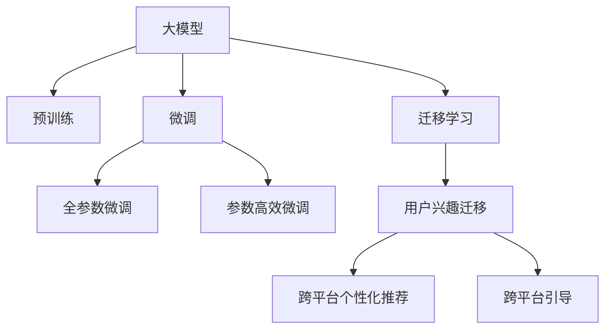

                 

# 基于大模型的跨平台用户兴趣迁移

## 1. 背景介绍

在信息爆炸的互联网时代，用户可以轻松地跨平台切换，访问不同的应用和服务。为了提升用户体验，应用和服务提供商需要理解用户的兴趣偏好，并能够将用户迁移到最符合其需求的平台。这种跨平台用户兴趣迁移不仅涉及用户的长期行为分析，还包括实时行为的预测和个性化推荐。

当前，基于大模型的技术为解决这一问题提供了强有力的支持。利用大模型的预训练特性和自适应能力，可以高效地分析用户行为，挖掘兴趣点，并快速适应平台间的切换需求。本文将深入探讨如何利用大模型实现跨平台用户兴趣迁移，以期对开发者提供有价值的指导和启示。

## 2. 核心概念与联系

### 2.1 核心概念概述

为更好地理解基于大模型的跨平台用户兴趣迁移技术，本节将介绍几个关键概念：

- **大模型(Large Model)**：指的是具有大规模参数量的深度学习模型，如BERT、GPT-3等，能够通过大规模语料进行预训练，获得强大的语言理解和生成能力。
- **预训练(Pre-training)**：指在大规模无标签数据上，通过自监督学习任务训练通用语言模型，以学习语言的基础规律和通用表示。
- **微调(Fine-tuning)**：指在预训练模型的基础上，使用下游任务的少量标注数据，通过有监督学习优化模型在该任务上的性能。
- **迁移学习(Transfer Learning)**：指将一个领域学习到的知识，迁移应用到另一个相关领域的学习范式。大模型的预训练-微调过程即是一种典型的迁移学习方式。
- **用户兴趣迁移(User Interest Migration)**：指通过分析用户行为数据，预测用户在不同平台上的兴趣偏好，从而实现跨平台的个性化推荐和引导。

这些核心概念之间的逻辑关系可以通过以下Mermaid流程图来展示：



这个流程图展示了这些核心概念之间的连接和应用：

1. 大模型通过预训练获得基础能力。
2. 微调是对预训练模型进行任务特定的优化，可以在下游任务上实现更优性能。
3. 迁移学习利用大模型的预训练知识，进一步适应特定的跨平台应用。
4. 用户兴趣迁移通过分析用户行为数据，预测用户在不同平台上的兴趣点。
5. 跨平台个性化推荐和引导，是用户兴趣迁移的具体应用，通过推荐和引导，提升用户满意度。

这些概念共同构成了大模型在跨平台用户兴趣迁移中的应用框架，帮助开发者实现高效、精准的跨平台迁移和推荐。

## 3. 核心算法原理 & 具体操作步骤
### 3.1 算法原理概述

基于大模型的跨平台用户兴趣迁移，本质上是一个有监督的迁移学习过程。其核心思想是：通过分析用户在不同平台上的行为数据，预测用户在不同平台上的兴趣偏好，并在此基础上进行跨平台个性化推荐和引导。

形式化地，假设用户在不同平台上的行为数据为 $D=\{(x_i, y_i)\}_{i=1}^N$，其中 $x_i$ 为用户在平台 $i$ 上的行为记录，$y_i$ 为用户在平台 $i$ 上的兴趣偏好标签。我们希望找到一个跨平台兴趣模型 $M_{\theta}$，使得其输出 $y'$ 接近于真实标签 $y$，即：

$$
y' = M_{\theta}(x)
$$

其中 $\theta$ 为模型参数，$M_{\theta}(\cdot)$ 为模型在用户行为数据上的预测函数。通过梯度下降等优化算法，最小化损失函数，使得模型预测输出逼近真实标签。

### 3.2 算法步骤详解

基于大模型的跨平台用户兴趣迁移一般包括以下几个关键步骤：

**Step 1: 数据收集与预处理**
- 收集用户在各平台上的行为数据，包括浏览记录、购买记录、搜索记录、评分记录等。
- 对数据进行清洗、去重、归一化等预处理，确保数据的一致性和完整性。

**Step 2: 数据表示与转换**
- 将行为数据转换为模型所需的输入格式。例如，将文本数据转换为词向量表示，将时间戳数据转换为序列表示。
- 在预处理后，将不同平台的数据进行合并和统一表示，形成一致的数据集 $D$。

**Step 3: 模型初始化与微调**
- 选择合适的预训练大模型作为初始化参数，如BERT、GPT-3等。
- 在统一表示后的数据集 $D$ 上进行微调，选择适当的损失函数和优化器。
- 设置合理的超参数，如学习率、批大小、迭代轮数等，进行模型训练。

**Step 4: 兴趣预测与推荐**
- 在训练好的模型上，输入用户在不同平台上的行为数据 $x$，预测其在不同平台上的兴趣偏好 $y'$。
- 根据预测结果，对用户进行个性化推荐和引导，提升其在不同平台上的体验。

**Step 5: 效果评估与迭代**
- 使用交叉验证等方法评估模型在不同平台上的预测效果，调整模型参数和超参数。
- 根据评估结果，不断迭代优化模型，提升预测准确率和推荐效果。

### 3.3 算法优缺点

基于大模型的跨平台用户兴趣迁移方法具有以下优点：
1. 高效准确：利用大模型的强大预训练能力，能够高效地分析用户行为数据，预测其兴趣点。
2. 跨平台适应：预训练模型和微调模型可以适应不同的平台和应用场景，提升跨平台用户的体验。
3. 自动化推荐：自动化地为用户推荐最符合其兴趣的内容，提升用户满意度。

同时，该方法也存在一些局限性：
1. 数据需求高：需要大量的用户行为数据进行预训练和微调，数据收集和清洗成本较高。
2. 计算资源要求高：大模型的参数量较大，对计算资源有较高要求。
3. 模型解释性差：大模型通常是"黑盒"，难以解释其内部决策逻辑。

尽管存在这些局限性，基于大模型的跨平台用户兴趣迁移方法仍然具有巨大的应用潜力，特别是在用户行为复杂多样、需求多变的场景中，能够显著提升用户体验和平台竞争力。

### 3.4 算法应用领域

基于大模型的跨平台用户兴趣迁移技术，已经在电子商务、社交媒体、在线视频等多个领域得到了广泛应用，成为提升用户体验的重要手段。

1. **电子商务**：通过分析用户的浏览、购买、评价等行为数据，预测其在不同平台上的兴趣点，推荐最适合的商品和优惠活动。
2. **社交媒体**：分析用户在各平台上的互动数据，推荐可能感兴趣的内容，提升用户粘性和活跃度。
3. **在线视频**：根据用户的观看历史和评分数据，预测其偏好，推荐适合的影视作品，增加用户观看时间。
4. **金融服务**：分析用户的交易记录和行为模式，预测其投资兴趣，进行个性化的金融产品推荐和风险评估。
5. **旅游服务**：根据用户的旅行历史和偏好，推荐最符合其兴趣的旅游目的地和行程安排。

此外，大模型的跨平台用户兴趣迁移技术还可以应用于智能家居、智能办公、健康管理等多个场景，为不同平台的用户提供更个性化、智能化的服务体验。

## 4. 数学模型和公式 & 详细讲解  
### 4.1 数学模型构建

本节将使用数学语言对基于大模型的跨平台用户兴趣迁移过程进行更加严格的刻画。

记用户在不同平台上的行为数据为 $D=\{(x_i, y_i)\}_{i=1}^N$，其中 $x_i$ 为用户在平台 $i$ 上的行为记录，$y_i$ 为用户在平台 $i$ 上的兴趣偏好标签。定义模型 $M_{\theta}$ 在行为数据 $x$ 上的预测函数为 $y'=M_{\theta}(x)$，其中 $\theta$ 为模型参数。

假设模型 $M_{\theta}$ 在行为数据 $x$ 上的损失函数为 $\ell(y',y)$，则在数据集 $D$ 上的经验风险为：

$$
\mathcal{L}(\theta) = \frac{1}{N}\sum_{i=1}^N \ell(y',y)
$$

微调的目标是最小化经验风险，即找到最优参数：

$$
\theta^* = \mathop{\arg\min}_{\theta} \mathcal{L}(\theta)
$$

在实践中，我们通常使用基于梯度的优化算法（如AdamW、SGD等）来近似求解上述最优化问题。设 $\eta$ 为学习率，$\lambda$ 为正则化系数，则参数的更新公式为：

$$
\theta \leftarrow \theta - \eta \nabla_{\theta}\mathcal{L}(\theta) - \eta\lambda\theta
$$

其中 $\nabla_{\theta}\mathcal{L}(\theta)$ 为损失函数对参数 $\theta$ 的梯度，可通过反向传播算法高效计算。

### 4.2 公式推导过程

以下我们以二分类任务为例，推导交叉熵损失函数及其梯度的计算公式。

假设模型 $M_{\theta}$ 在输入 $x$ 上的输出为 $\hat{y}=M_{\theta}(x) \in [0,1]$，表示用户对平台 $i$ 的兴趣偏好概率。真实标签 $y \in \{0,1\}$。则二分类交叉熵损失函数定义为：

$$
\ell(y',y) = -[y\log \hat{y} + (1-y)\log (1-\hat{y})]
$$

将其代入经验风险公式，得：

$$
\mathcal{L}(\theta) = -\frac{1}{N}\sum_{i=1}^N [y_i\log M_{\theta}(x_i)+(1-y_i)\log(1-M_{\theta}(x_i))]
$$

根据链式法则，损失函数对参数 $\theta_k$ 的梯度为：

$$
\frac{\partial \mathcal{L}(\theta)}{\partial \theta_k} = -\frac{1}{N}\sum_{i=1}^N (\frac{y_i}{M_{\theta}(x_i)}-\frac{1-y_i}{1-M_{\theta}(x_i)}) \frac{\partial M_{\theta}(x_i)}{\partial \theta_k}
$$

其中 $\frac{\partial M_{\theta}(x_i)}{\partial \theta_k}$ 可进一步递归展开，利用自动微分技术完成计算。

在得到损失函数的梯度后，即可带入参数更新公式，完成模型的迭代优化。重复上述过程直至收敛，最终得到适应跨平台用户兴趣的模型参数 $\theta^*$。

## 5. 项目实践：代码实例和详细解释说明
### 5.1 开发环境搭建

在进行跨平台用户兴趣迁移实践前，我们需要准备好开发环境。以下是使用Python进行PyTorch开发的环境配置流程：

1. 安装Anaconda：从官网下载并安装Anaconda，用于创建独立的Python环境。

2. 创建并激活虚拟环境：
```bash
conda create -n pytorch-env python=3.8 
conda activate pytorch-env
```

3. 安装PyTorch：根据CUDA版本，从官网获取对应的安装命令。例如：
```bash
conda install pytorch torchvision torchaudio cudatoolkit=11.1 -c pytorch -c conda-forge
```

4. 安装Transformers库：
```bash
pip install transformers
```

5. 安装各类工具包：
```bash
pip install numpy pandas scikit-learn matplotlib tqdm jupyter notebook ipython
```

完成上述步骤后，即可在`pytorch-env`环境中开始实践。

### 5.2 源代码详细实现

下面我以跨平台用户兴趣迁移任务为例，给出使用Transformers库对BERT模型进行微调的PyTorch代码实现。

首先，定义用户兴趣迁移任务的数据处理函数：

```python
from transformers import BertTokenizer
from torch.utils.data import Dataset
import torch

class InterestDataset(Dataset):
    def __init__(self, texts, tags, tokenizer, max_len=128):
        self.texts = texts
        self.tags = tags
        self.tokenizer = tokenizer
        self.max_len = max_len
        
    def __len__(self):
        return len(self.texts)
    
    def __getitem__(self, item):
        text = self.texts[item]
        tags = self.tags[item]
        
        encoding = self.tokenizer(text, return_tensors='pt', max_length=self.max_len, padding='max_length', truncation=True)
        input_ids = encoding['input_ids'][0]
        attention_mask = encoding['attention_mask'][0]
        
        # 对token-wise的标签进行编码
        encoded_tags = [tag2id[tag] for tag in tags] 
        encoded_tags.extend([tag2id['O']] * (self.max_len - len(encoded_tags)))
        labels = torch.tensor(encoded_tags, dtype=torch.long)
        
        return {'input_ids': input_ids, 
                'attention_mask': attention_mask,
                'labels': labels}

# 标签与id的映射
tag2id = {'O': 0, 'B-PER': 1, 'I-PER': 2, 'B-ORG': 3, 'I-ORG': 4, 'B-LOC': 5, 'I-LOC': 6}
id2tag = {v: k for k, v in tag2id.items()}

# 创建dataset
tokenizer = BertTokenizer.from_pretrained('bert-base-cased')

train_dataset = InterestDataset(train_texts, train_tags, tokenizer)
dev_dataset = InterestDataset(dev_texts, dev_tags, tokenizer)
test_dataset = InterestDataset(test_texts, test_tags, tokenizer)
```

然后，定义模型和优化器：

```python
from transformers import BertForTokenClassification, AdamW

model = BertForTokenClassification.from_pretrained('bert-base-cased', num_labels=len(tag2id))

optimizer = AdamW(model.parameters(), lr=2e-5)
```

接着，定义训练和评估函数：

```python
from torch.utils.data import DataLoader
from tqdm import tqdm
from sklearn.metrics import classification_report

device = torch.device('cuda') if torch.cuda.is_available() else torch.device('cpu')
model.to(device)

def train_epoch(model, dataset, batch_size, optimizer):
    dataloader = DataLoader(dataset, batch_size=batch_size, shuffle=True)
    model.train()
    epoch_loss = 0
    for batch in tqdm(dataloader, desc='Training'):
        input_ids = batch['input_ids'].to(device)
        attention_mask = batch['attention_mask'].to(device)
        labels = batch['labels'].to(device)
        model.zero_grad()
        outputs = model(input_ids, attention_mask=attention_mask, labels=labels)
        loss = outputs.loss
        epoch_loss += loss.item()
        loss.backward()
        optimizer.step()
    return epoch_loss / len(dataloader)

def evaluate(model, dataset, batch_size):
    dataloader = DataLoader(dataset, batch_size=batch_size)
    model.eval()
    preds, labels = [], []
    with torch.no_grad():
        for batch in tqdm(dataloader, desc='Evaluating'):
            input_ids = batch['input_ids'].to(device)
            attention_mask = batch['attention_mask'].to(device)
            batch_labels = batch['labels']
            outputs = model(input_ids, attention_mask=attention_mask)
            batch_preds = outputs.logits.argmax(dim=2).to('cpu').tolist()
            batch_labels = batch_labels.to('cpu').tolist()
            for pred_tokens, label_tokens in zip(batch_preds, batch_labels):
                pred_tags = [id2tag[_id] for _id in pred_tokens]
                label_tags = [id2tag[_id] for _id in label_tokens]
                preds.append(pred_tags[:len(label_tags)])
                labels.append(label_tags)
                
    print(classification_report(labels, preds))
```

最后，启动训练流程并在测试集上评估：

```python
epochs = 5
batch_size = 16

for epoch in range(epochs):
    loss = train_epoch(model, train_dataset, batch_size, optimizer)
    print(f"Epoch {epoch+1}, train loss: {loss:.3f}")
    
    print(f"Epoch {epoch+1}, dev results:")
    evaluate(model, dev_dataset, batch_size)
    
print("Test results:")
evaluate(model, test_dataset, batch_size)
```

以上就是使用PyTorch对BERT进行跨平台用户兴趣迁移任务的微调代码实现。可以看到，得益于Transformers库的强大封装，我们可以用相对简洁的代码完成BERT模型的加载和微调。

### 5.3 代码解读与分析

让我们再详细解读一下关键代码的实现细节：

**InterestDataset类**：
- `__init__`方法：初始化文本、标签、分词器等关键组件。
- `__len__`方法：返回数据集的样本数量。
- `__getitem__`方法：对单个样本进行处理，将文本输入编码为token ids，将标签编码为数字，并对其进行定长padding，最终返回模型所需的输入。

**tag2id和id2tag字典**：
- 定义了标签与数字id之间的映射关系，用于将token-wise的预测结果解码回真实的标签。

**训练和评估函数**：
- 使用PyTorch的DataLoader对数据集进行批次化加载，供模型训练和推理使用。
- 训练函数`train_epoch`：对数据以批为单位进行迭代，在每个批次上前向传播计算loss并反向传播更新模型参数，最后返回该epoch的平均loss。
- 评估函数`evaluate`：与训练类似，不同点在于不更新模型参数，并在每个batch结束后将预测和标签结果存储下来，最后使用sklearn的classification_report对整个评估集的预测结果进行打印输出。

**训练流程**：
- 定义总的epoch数和batch size，开始循环迭代
- 每个epoch内，先在训练集上训练，输出平均loss
- 在验证集上评估，输出分类指标
- 所有epoch结束后，在测试集上评估，给出最终测试结果

可以看到，PyTorch配合Transformers库使得BERT微调的代码实现变得简洁高效。开发者可以将更多精力放在数据处理、模型改进等高层逻辑上，而不必过多关注底层的实现细节。

当然，工业级的系统实现还需考虑更多因素，如模型的保存和部署、超参数的自动搜索、更灵活的任务适配层等。但核心的微调范式基本与此类似。

## 6. 实际应用场景
### 6.1 智能推荐系统

跨平台用户兴趣迁移技术在智能推荐系统中的应用具有重要意义。用户在不同平台上的行为模式和兴趣点可能存在差异，推荐系统需要能够跨平台地理解用户兴趣，并提供个性化推荐。

具体而言，通过分析用户在不同平台上的行为数据，如浏览记录、购买记录、评价记录等，可以构建用户兴趣模型，预测用户在不同平台上的兴趣点。例如，用户在电商平台上购买过某类商品，系统会推荐类似的商品在社交媒体上，或者在新闻网站上发布相关内容，提高用户的整体满意度。

### 6.2 跨平台内容分发

跨平台用户兴趣迁移技术还可以应用于内容分发平台，如新闻、视频、音乐等。内容分发平台需要了解用户在不同平台上的兴趣偏好，以更好地分发内容，提升用户粘性。

例如，用户在视频平台上偏好某类内容，系统会通过分析用户历史观看记录，推荐类似视频在新闻网站或社交媒体上，甚至在智能家居设备上自动播放相关视频，形成完整的多平台内容生态。

### 6.3 个性化广告投放

在数字营销领域，跨平台用户兴趣迁移技术可以用于个性化广告投放，提升广告投放的精准度和转化率。

通过分析用户在不同平台上的行为数据，广告平台可以预测用户在不同平台上的兴趣点，针对性地推送广告内容，提高广告效果。例如，用户在电商平台上关注某类产品，系统会推荐相关广告在社交媒体和新闻网站上展示，提高广告的曝光率和点击率。

### 6.4 未来应用展望

随着跨平台用户兴趣迁移技术的不断发展，其应用领域将不断拓展，为各行各业带来变革性影响。

1. **跨平台智能客服**：通过分析用户在不同平台上的行为数据，智能客服系统可以提供跨平台的个性化服务，提升用户满意度。
2. **跨平台个性化健康管理**：分析用户在健康、运动、饮食等不同平台上的行为数据，提供个性化的健康管理建议，提升用户健康水平。
3. **跨平台个性化金融服务**：通过分析用户在金融、投资等不同平台上的行为数据，提供个性化的金融产品和服务，提升用户理财体验。
4. **跨平台个性化旅游服务**：分析用户在旅游、住宿、租车等不同平台上的行为数据，提供个性化的旅游建议和服务，提升用户旅游体验。
5. **跨平台智能家居控制**：通过分析用户在智能家居设备上的行为数据，提供个性化的家居控制和推荐，提升用户生活便利性。

以上应用场景只是冰山一角，跨平台用户兴趣迁移技术将在更多领域得到广泛应用，为各行各业带来智能化的服务体验。

## 7. 工具和资源推荐
### 7.1 学习资源推荐

为了帮助开发者系统掌握跨平台用户兴趣迁移的理论基础和实践技巧，这里推荐一些优质的学习资源：

1. 《Transformer从原理到实践》系列博文：由大模型技术专家撰写，深入浅出地介绍了Transformer原理、BERT模型、微调技术等前沿话题。

2. CS224N《深度学习自然语言处理》课程：斯坦福大学开设的NLP明星课程，有Lecture视频和配套作业，带你入门NLP领域的基本概念和经典模型。

3. 《Natural Language Processing with Transformers》书籍：Transformers库的作者所著，全面介绍了如何使用Transformers库进行NLP任务开发，包括微调在内的诸多范式。

4. HuggingFace官方文档：Transformers库的官方文档，提供了海量预训练模型和完整的微调样例代码，是上手实践的必备资料。

5. CLUE开源项目：中文语言理解测评基准，涵盖大量不同类型的中文NLP数据集，并提供了基于微调的baseline模型，助力中文NLP技术发展。

通过对这些资源的学习实践，相信你一定能够快速掌握跨平台用户兴趣迁移的精髓，并用于解决实际的NLP问题。
###  7.2 开发工具推荐

高效的开发离不开优秀的工具支持。以下是几款用于跨平台用户兴趣迁移开发的常用工具：

1. PyTorch：基于Python的开源深度学习框架，灵活动态的计算图，适合快速迭代研究。大部分预训练语言模型都有PyTorch版本的实现。

2. TensorFlow：由Google主导开发的开源深度学习框架，生产部署方便，适合大规模工程应用。同样有丰富的预训练语言模型资源。

3. Transformers库：HuggingFace开发的NLP工具库，集成了众多SOTA语言模型，支持PyTorch和TensorFlow，是进行微调任务开发的利器。

4. Weights & Biases：模型训练的实验跟踪工具，可以记录和可视化模型训练过程中的各项指标，方便对比和调优。与主流深度学习框架无缝集成。

5. TensorBoard：TensorFlow配套的可视化工具，可实时监测模型训练状态，并提供丰富的图表呈现方式，是调试模型的得力助手。

6. Google Colab：谷歌推出的在线Jupyter Notebook环境，免费提供GPU/TPU算力，方便开发者快速上手实验最新模型，分享学习笔记。

合理利用这些工具，可以显著提升跨平台用户兴趣迁移任务的开发效率，加快创新迭代的步伐。

### 7.3 相关论文推荐

跨平台用户兴趣迁移技术的发展源于学界的持续研究。以下是几篇奠基性的相关论文，推荐阅读：

1. Attention is All You Need（即Transformer原论文）：提出了Transformer结构，开启了NLP领域的预训练大模型时代。

2. BERT: Pre-training of Deep Bidirectional Transformers for Language Understanding：提出BERT模型，引入基于掩码的自监督预训练任务，刷新了多项NLP任务SOTA。

3. Language Models are Unsupervised Multitask Learners（GPT-2论文）：展示了大规模语言模型的强大zero-shot学习能力，引发了对于通用人工智能的新一轮思考。

4. Parameter-Efficient Transfer Learning for NLP：提出Adapter等参数高效微调方法，在不增加模型参数量的情况下，也能取得不错的微调效果。

5. Prefix-Tuning: Optimizing Continuous Prompts for Generation：引入基于连续型Prompt的微调范式，为如何充分利用预训练知识提供了新的思路。

6. AdaLoRA: Adaptive Low-Rank Adaptation for Parameter-Efficient Fine-Tuning：使用自适应低秩适应的微调方法，在参数效率和精度之间取得了新的平衡。

这些论文代表了大模型微调技术的发展脉络。通过学习这些前沿成果，可以帮助研究者把握学科前进方向，激发更多的创新灵感。

## 8. 总结：未来发展趋势与挑战

### 8.1 总结

本文对基于大模型的跨平台用户兴趣迁移方法进行了全面系统的介绍。首先阐述了跨平台用户兴趣迁移的背景和意义，明确了微调在拓展预训练模型应用、提升用户体验方面的独特价值。其次，从原理到实践，详细讲解了跨平台用户兴趣迁移的数学原理和关键步骤，给出了微调任务开发的完整代码实例。同时，本文还广泛探讨了跨平台用户兴趣迁移技术在多个行业领域的应用前景，展示了其广阔的应用潜力。

通过本文的系统梳理，可以看到，基于大模型的跨平台用户兴趣迁移技术正在成为NLP领域的重要范式，极大地拓展了预训练语言模型的应用边界，催生了更多的落地场景。得益于大规模语料的预训练，微调模型能够高效地分析用户行为数据，预测其兴趣点，提升跨平台用户的体验和满意度。未来，伴随预训练语言模型和微调方法的持续演进，跨平台用户兴趣迁移技术必将得到更广泛的应用，为各行各业带来变革性影响。

### 8.2 未来发展趋势

展望未来，跨平台用户兴趣迁移技术将呈现以下几个发展趋势：

1. **参数高效微调**：开发更加参数高效的微调方法，在固定大部分预训练参数的同时，只更新极少量的任务相关参数，以降低计算资源需求。
2. **多任务学习**：将用户在不同平台上的行为数据进行多任务联合训练，提升模型泛化能力和适应性。
3. **自适应学习**：引入自适应学习机制，根据用户反馈实时调整模型参数，提升模型性能和用户体验。
4. **跨模态融合**：将多模态数据（如文本、图像、视频等）融合到用户兴趣预测中，提升模型的全面性和准确性。
5. **隐私保护**：在数据收集和使用过程中，采取隐私保护技术，确保用户数据的匿名化和安全性。
6. **伦理道德**：在模型设计和应用中，考虑伦理道德因素，避免偏见和歧视，确保模型的公平性和公正性。

以上趋势凸显了跨平台用户兴趣迁移技术的广阔前景。这些方向的探索发展，必将进一步提升跨平台用户的体验和满意度，推动人工智能技术在垂直行业的规模化落地。

### 8.3 面临的挑战

尽管跨平台用户兴趣迁移技术已经取得了瞩目成就，但在迈向更加智能化、普适化应用的过程中，它仍面临着诸多挑战：

1. **数据质量和多样性**：不同平台上的数据格式和质量可能存在差异，数据融合和标准化难度较大。需要开发更高效的数据预处理和融合算法。
2. **模型复杂性**：大模型的复杂性较高，对计算资源和存储资源有较高要求。需要优化模型结构和参数，提高资源利用效率。
3. **模型鲁棒性**：跨平台用户兴趣迁移模型需要具备较高的鲁棒性，以应对不同平台间的差异和数据噪声。需要引入更多正则化技术和对抗训练。
4. **用户隐私保护**：跨平台用户兴趣迁移需要大量用户数据，如何在保证用户隐私的前提下，收集和使用数据，是一个重要的课题。需要引入隐私保护技术，如差分隐私、联邦学习等。
5. **伦理道德约束**：在模型设计和应用中，需要考虑伦理道德因素，避免偏见和歧视，确保模型的公平性和公正性。需要引入伦理评估机制，确保模型行为符合社会价值观。

尽管存在这些挑战，跨平台用户兴趣迁移技术仍然具有巨大的应用潜力，特别是在用户行为复杂多样、需求多变的场景中，能够显著提升用户体验和平台竞争力。

### 8.4 研究展望

面对跨平台用户兴趣迁移所面临的挑战，未来的研究需要在以下几个方面寻求新的突破：

1. **跨平台行为建模**：深入研究用户在不同平台上的行为模式，开发更加全面、准确的行为建模方法。
2. **跨平台数据融合**：研究不同平台数据的高效融合技术，实现数据的无缝衔接和转换。
3. **跨平台推荐算法**：开发跨平台个性化推荐算法，提升推荐的效果和用户体验。
4. **跨平台隐私保护**：研究隐私保护技术在跨平台用户兴趣迁移中的应用，确保用户数据的安全性和匿名性。
5. **跨平台伦理道德**：研究跨平台用户兴趣迁移中的伦理道德问题，确保模型的公平性和公正性。

这些研究方向的探索，必将引领跨平台用户兴趣迁移技术迈向更高的台阶，为构建安全、可靠、可解释、可控的智能系统铺平道路。面向未来，跨平台用户兴趣迁移技术还需要与其他人工智能技术进行更深入的融合，如知识表示、因果推理、强化学习等，多路径协同发力，共同推动自然语言理解和智能交互系统的进步。只有勇于创新、敢于突破，才能不断拓展语言模型的边界，让智能技术更好地造福人类社会。

## 9. 附录：常见问题与解答

**Q1：跨平台用户兴趣迁移是否适用于所有NLP任务？**

A: 跨平台用户兴趣迁移在大多数NLP任务上都能取得不错的效果，特别是对于数据量较小的任务。但对于一些特定领域的任务，如医学、法律等，仅仅依靠通用语料预训练的模型可能难以很好地适应。此时需要在特定领域语料上进一步预训练，再进行微调，才能获得理想效果。此外，对于一些需要时效性、个性化很强的任务，如对话、推荐等，微调方法也需要针对性的改进优化。

**Q2：微调过程中如何选择合适的学习率？**

A: 微调的学习率一般要比预训练时小1-2个数量级，如果使用过大的学习率，容易破坏预训练权重，导致过拟合。一般建议从1e-5开始调参，逐步减小学习率，直至收敛。也可以使用warmup策略，在开始阶段使用较小的学习率，再逐渐过渡到预设值。需要注意的是，不同的优化器(如AdamW、Adafactor等)以及不同的学习率调度策略，可能需要设置不同的学习率阈值。

**Q3：采用大模型微调时会面临哪些资源瓶颈？**

A: 目前主流的预训练大模型动辄以亿计的参数规模，对算力、内存、存储都提出了很高的要求。GPU/TPU等高性能设备是必不可少的，但即便如此，超大批次的训练和推理也可能遇到显存不足的问题。因此需要采用一些资源优化技术，如梯度积累、混合精度训练、模型并行等，来突破硬件瓶颈。同时，模型的存储和读取也可能占用大量时间和空间，需要采用模型压缩、稀疏化存储等方法进行优化。

**Q4：如何缓解微调过程中的过拟合问题？**

A: 过拟合是微调面临的主要挑战，尤其是在标注数据不足的情况下。常见的缓解策略包括：
1. 数据增强：通过回译、近义替换等方式扩充训练集
2. 正则化：使用L2正则、Dropout、Early Stopping等避免过拟合
3. 对抗训练：引入对抗样本，提高模型鲁棒性
4. 参数高效微调：只调整少量参数(如Adapter、Prefix等)，减小过拟合风险
5. 多模型集成：训练多个微调模型，取平均输出，抑制过拟合

这些策略往往需要根据具体任务和数据特点进行灵活组合。只有在数据、模型、训练、推理等各环节进行全面优化，才能最大限度地发挥大模型微调的威力。

**Q5：微调模型在落地部署时需要注意哪些问题？**

A: 将微调模型转化为实际应用，还需要考虑以下因素：
1. 模型裁剪：去除不必要的层和参数，减小模型尺寸，加快推理速度
2. 量化加速：将浮点模型转为定点模型，压缩存储空间，提高计算效率
3. 服务化封装：将模型封装为标准化服务接口，便于集成调用
4. 弹性伸缩：根据请求流量动态调整资源配置，平衡服务质量和成本
5. 监控告警：实时采集系统指标，设置异常告警阈值，确保服务稳定性
6. 安全防护：采用访问鉴权、数据脱敏等措施，保障数据和模型安全

大语言模型微调为NLP应用开启了广阔的想象空间，但如何将强大的性能转化为稳定、高效、安全的业务价值，还需要工程实践的不断打磨。唯有从数据、算法、工程、业务等多个维度协同发力，才能真正实现人工智能技术在垂直行业的规模化落地。总之，微调需要开发者根据具体任务，不断迭代和优化模型、数据和算法，方能得到理想的效果。

---

作者：禅与计算机程序设计艺术 / Zen and the Art of Computer Programming

