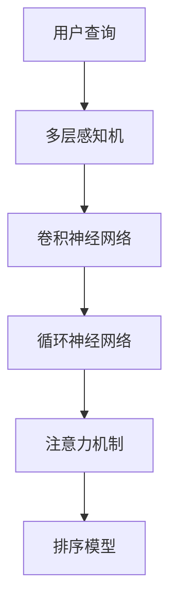

                 

# 基于注意力机制的商品搜索排序算法

在当今的数字化时代，商品搜索排序算法是电商平台不可或缺的核心技术。其目的在于通过智能化的排序，帮助用户快速找到满意的商品，从而提高用户体验和平台满意度。本文将重点介绍基于注意力机制的商品搜索排序算法，包括其原理、具体实现步骤、优缺点、应用领域、案例分析等，最后探讨其在实际应用中的前景、面临的挑战及未来研究方向。

## 1. 背景介绍

### 1.1 问题由来

随着互联网的发展和电商平台的兴起，商品搜索排序算法已经成为了电商应用的核心技术。传统的排序算法多依赖于关键词匹配、点击率、浏览量等简单的统计特征，难以充分考虑用户个性化需求和商品多样性。此外，随着商品数量和用户数量不断增长，传统的排序算法面临着数据复杂度增加、计算效率低下、效果不稳定等问题。

### 1.2 问题核心关键点

基于注意力机制的搜索排序算法，利用注意力机制捕捉用户查询中的关键信息，通过更加精细化的特征提取和加权，实现更加精准的排序。其核心关键点在于：

- 注意力机制：通过权重机制捕捉用户查询中的重要信息。
- 多层网络：通过深度神经网络学习更为丰富的特征表示。
- 个性化推荐：通过学习用户行为和偏好，实现个性化商品推荐。
- 高效率：在计算上实现高效率的特征选择和融合。
- 效果评估：通过实际效果评估和优化，提升算法性能。

### 1.3 问题研究意义

商品搜索排序算法的优化，可以显著提升电商平台的购物体验和用户满意度。具体意义如下：

- 用户满意度：通过智能化的排序，使得搜索结果更符合用户需求。
- 平台效率：快速定位到高质量商品，提高销售转化率。
- 平台体验：良好的搜索体验能增加用户粘性，提升平台活跃度。
- 业务创新：结合个性化推荐等新技术，拓展更多应用场景。

## 2. 核心概念与联系

### 2.1 核心概念概述

为更好地理解基于注意力机制的商品搜索排序算法，本节将介绍几个密切相关的核心概念：

- 注意力机制(Attention Mechanism)：一种通过权重机制动态地对输入信息进行加权的机制，捕捉输入中重要的部分。
- 卷积神经网络(Convolutional Neural Network, CNN)：通过卷积层捕捉局部空间结构，具有平移不变性和局部敏感性。
- 循环神经网络(Recurrent Neural Network, RNN)：通过循环结构捕捉序列数据的时间相关性。
- 多层感知机(Multilayer Perceptron, MLP)：一种深度神经网络，通过多层网络结构学习更复杂的特征表示。
- 深度学习(DL)：一种通过多层神经网络结构进行复杂特征提取和模式识别的学习方式。

这些核心概念之间的逻辑关系可以通过以下Mermaid流程图来展示：



这个流程图展示了大语言模型的核心概念及其之间的关系：

1. 用户查询首先经过多层感知机(B)进行特征提取，捕捉全局和局部特征。
2. 随后，卷积神经网络(C)和循环神经网络(D)对序列数据进行时间相关性处理。
3. 通过注意力机制(E)对输入特征进行加权，捕捉重要部分。
4. 最终，排序模型(F)根据加权特征进行排序，输出最终结果。

## 3. 核心算法原理 & 具体操作步骤

### 3.1 算法原理概述

基于注意力机制的商品搜索排序算法，本质上是一种深度学习算法，通过注意力机制捕捉输入数据中的关键信息，并结合多层神经网络结构，实现复杂特征的自动提取和加权，从而提升排序效果。其核心思想是：

1. 将用户查询和商品特征向量作为输入，通过注意力机制计算注意力权重，捕捉关键信息。
2. 将注意力加权后的特征向量输入到多层神经网络中，学习更为丰富的特征表示。
3. 最终，将多层网络输出的特征向量作为排序模型的输入，进行商品排序。

### 3.2 算法步骤详解

基于注意力机制的商品搜索排序算法主要包括以下几个关键步骤：

**Step 1: 构建输入数据**

- 用户查询向量：将用户输入的查询转换为词嵌入向量。
- 商品特征向量：将商品的各项属性和特征表示为向量。
- 构建输入矩阵：将用户查询向量与商品特征向量进行拼接，形成输入矩阵。

**Step 2: 计算注意力权重**

- 计算注意力权重：通过注意力机制，对输入矩阵中的每个元素计算注意力权重。
- 构造注意力权重矩阵：将注意力权重矩阵进行归一化处理，构成最终权重矩阵。

**Step 3: 特征融合**

- 特征加权融合：将注意力加权后的商品特征向量输入多层神经网络进行特征提取。
- 多层次特征提取：通过多层感知机、卷积神经网络和循环神经网络等深度神经网络结构，学习更为丰富的特征表示。
- 特征向量拼接：将多层网络输出的特征向量进行拼接，得到最终的特征向量。

**Step 4: 排序输出**

- 排序模型：将特征向量作为排序模型的输入，输出商品排序结果。
- 调整排序策略：根据实际需求，选择不同的排序策略，如倒序、升序、平均排序等。

**Step 5: 效果评估**

- 设定评估指标：常用的评估指标包括准确率、召回率、F1值等。
- 交叉验证：通过交叉验证评估模型在不同数据集上的泛化能力。
- 调优优化：根据评估结果，调整模型参数，优化排序效果。

### 3.3 算法优缺点

基于注意力机制的商品搜索排序算法具有以下优点：

1. 智能提取特征：通过注意力机制和深度神经网络，自动学习输入数据的复杂特征表示。
2. 鲁棒性高：对噪声和异常值有较强的鲁棒性，能够处理复杂多变的数据。
3. 高效性：通过多层次网络结构和并行计算，提高计算效率，降低计算成本。
4. 可扩展性强：易于扩展到大规模数据集和复杂排序场景。

同时，该算法也存在以下缺点：

1. 计算复杂度高：深度神经网络和注意力机制的计算复杂度较高，对计算资源和存储资源有较高要求。
2. 模型训练困难：多层次网络的参数较多，模型训练过程容易陷入局部最优解。
3. 泛化能力差：对于特定领域或特定数据集，可能需要重新训练或调整模型参数。
4. 解释性不足：深度学习模型的决策过程较难解释，难以通过传统的统计方法进行调试。

### 3.4 算法应用领域

基于注意力机制的商品搜索排序算法在电商、新闻推荐、搜索引擎等众多领域都有广泛应用。其优点如下：

- 电商领域：通过智能排序，提升用户购物体验，增加销售转化率。
- 新闻推荐：通过个性化推荐，提高新闻阅读的用户体验。
- 搜索引擎：通过智能排序，提升搜索结果的相关性和准确性。

除了上述应用领域外，该算法在音乐推荐、视频推荐、广告推荐等领域也有广泛的应用前景。

## 4. 数学模型和公式 & 详细讲解 & 举例说明

### 4.1 数学模型构建

本节将使用数学语言对基于注意力机制的商品搜索排序算法进行更加严格的刻画。

记用户查询向量为 $\mathbf{x} \in \mathbb{R}^d$，商品特征向量为 $\mathbf{y} \in \mathbb{R}^d$，注意力权重矩阵为 $\mathbf{A} \in \mathbb{R}^{d \times d}$，特征向量为 $\mathbf{z} \in \mathbb{R}^{d}$，排序模型为 $\mathbf{W} \in \mathbb{R}^{d \times 1}$。

定义模型 $M_{\theta}$ 在输入向量 $\mathbf{x}$ 和 $\mathbf{y}$ 上的损失函数为 $\ell(M_{\theta}(\mathbf{x}, \mathbf{y}))$，则在数据集 $D$ 上的经验风险为：

$$
\mathcal{L}(\theta) = \frac{1}{N} \sum_{i=1}^N \ell(M_{\theta}(\mathbf{x}_i, \mathbf{y}_i))
$$

在实践中，我们通常使用基于梯度的优化算法（如SGD、Adam等）来近似求解上述最优化问题。设 $\eta$ 为学习率，$\lambda$ 为正则化系数，则参数的更新公式为：

$$
\theta \leftarrow \theta - \eta \nabla_{\theta}\mathcal{L}(\theta) - \eta\lambda\theta
$$

其中 $\nabla_{\theta}\mathcal{L}(\theta)$ 为损失函数对参数 $\theta$ 的梯度，可通过反向传播算法高效计算。

### 4.2 公式推导过程

以下我们以商品搜索排序为例，推导基于注意力机制的排序模型和损失函数的计算公式。

首先，将用户查询向量 $\mathbf{x}$ 和商品特征向量 $\mathbf{y}$ 进行拼接，得到输入矩阵 $\mathbf{X} \in \mathbb{R}^{d \times 2d}$。

其次，通过注意力机制对输入矩阵 $\mathbf{X}$ 进行加权处理，得到注意力权重矩阵 $\mathbf{A} \in \mathbb{R}^{d \times d}$，其中：

$$
\mathbf{A} = \mathbf{A}(\mathbf{X}, \mathbf{W}_A)
$$

其中 $\mathbf{W}_A \in \mathbb{R}^{d \times d}$ 为注意力机制的权重矩阵，通过多层感知机或卷积神经网络等深度神经网络结构计算得到。

接着，将注意力权重矩阵 $\mathbf{A}$ 与商品特征向量 $\mathbf{y}$ 进行矩阵乘法，得到加权后的特征向量 $\mathbf{Z} \in \mathbb{R}^{d \times 1}$：

$$
\mathbf{Z} = \mathbf{A} \mathbf{y}
$$

然后，将加权后的特征向量 $\mathbf{Z}$ 输入到多层神经网络中，学习更为丰富的特征表示 $\mathbf{Z'} \in \mathbb{R}^{d'} \times 1}$，其中 $d' \leq d$ 为特征向量的维度。

最后，将特征向量 $\mathbf{Z'}$ 作为排序模型的输入，得到排序结果 $\mathbf{S} \in \mathbb{R}^{N \times 1}$，其中 $N$ 为商品数量。

排序模型的损失函数定义如下：

$$
\ell(\mathbf{S}, \mathbf{y}) = \frac{1}{N} \sum_{i=1}^N (\mathbf{S}_i - \mathbf{y}_i)^2
$$

其中 $\mathbf{S}_i$ 为商品 $i$ 的排序值，$\mathbf{y}_i$ 为商品 $i$ 的真实排序值。

### 4.3 案例分析与讲解

以亚马逊的商品搜索排序为例，分析基于注意力机制的搜索排序算法的实际应用场景：

1. 用户输入查询：用户输入查询“高效节能电冰箱”，系统通过词嵌入技术将其转换为向量 $\mathbf{x} \in \mathbb{R}^d$。
2. 商品向量提取：从商品数据库中提取电冰箱的各项属性向量，构成商品特征向量 $\mathbf{y} \in \mathbb{R}^d$。
3. 注意力加权：通过注意力机制计算每个商品的注意力权重，得到权重矩阵 $\mathbf{A} \in \mathbb{R}^{d \times d}$。
4. 特征融合：将注意力权重与商品特征向量进行加权，得到加权后的特征向量 $\mathbf{Z} \in \mathbb{R}^{d \times 1}$。
5. 特征提取：将加权特征向量输入到多层神经网络中，得到新的特征向量 $\mathbf{Z'} \in \mathbb{R}^{d' \times 1}$。
6. 排序输出：将特征向量 $\mathbf{Z'}$ 输入到排序模型中，输出排序结果 $\mathbf{S} \in \mathbb{R}^{N \times 1}$，即所有商品的排序值。
7. 结果排序：根据排序值，对所有商品进行降序排序，得到最终结果，返回给用户。

## 5. 项目实践：代码实例和详细解释说明

### 5.1 开发环境搭建

在进行商品搜索排序算法实践前，我们需要准备好开发环境。以下是使用Python进行TensorFlow开发的环境配置流程：

1. 安装Anaconda：从官网下载并安装Anaconda，用于创建独立的Python环境。

2. 创建并激活虚拟环境：
```bash
conda create -n tf-env python=3.8 
conda activate tf-env
```

3. 安装TensorFlow：根据CUDA版本，从官网获取对应的安装命令。例如：
```bash
conda install tensorflow -c tf -c conda-forge
```

4. 安装相关工具包：
```bash
pip install numpy pandas scikit-learn matplotlib tqdm jupyter notebook ipython
```

完成上述步骤后，即可在`tf-env`环境中开始商品搜索排序算法的开发。

### 5.2 源代码详细实现

下面我们以亚马逊的商品搜索排序为例，给出使用TensorFlow实现基于注意力机制的商品搜索排序算法的代码实现。

首先，定义注意力机制和多层神经网络的实现：

```python
import tensorflow as tf
from tensorflow.keras.layers import Dense, Embedding, Conv1D, LSTM, Dropout
from tensorflow.keras import Input, Model

class Attention(tf.keras.Model):
    def __init__(self, dim, n_heads):
        super(Attention, self).__init__()
        self.dim = dim
        self.n_heads = n_heads
        self.head_dim = dim // n_heads

        self.query = Dense(dim, activation='relu')
        self.key = Dense(dim, activation='relu')
        self.value = Dense(dim, activation='relu')

        self.head_projection = Dense(self.head_dim, activation='softmax')
        self.value_projection = Dense(dim, activation='softmax')

    def call(self, query, key):
        query = self.query(query)
        key = self.key(key)

        batch_size, seq_len, _ = query.shape
        query = tf.reshape(query, (batch_size, seq_len, self.n_heads, self.head_dim))
        query = tf.transpose(query, perm=[0, 2, 1, 3])
        query = tf.reshape(query, (batch_size, self.n_heads, seq_len, self.head_dim))

        key = tf.reshape(key, (batch_size, self.n_heads, seq_len, self.head_dim))
        key = tf.transpose(key, perm=[0, 2, 1, 3])
        key = tf.reshape(key, (batch_size, self.n_heads, seq_len, self.head_dim))

        query = self.head_projection(query)
        key = self.value_projection(key)

        attention = tf.matmul(query, key, transpose_b=True)
        attention = tf.reshape(attention, (batch_size, self.n_heads, seq_len, seq_len))
        attention = tf.transpose(attention, perm=[0, 2, 1, 3])
        attention = tf.reshape(attention, (batch_size, seq_len, seq_len))

        return attention

class CNN(tf.keras.Model):
    def __init__(self, dim, n_filters):
        super(CNN, self).__init__()
        self.dim = dim
        self.n_filters = n_filters

        self.conv1 = Conv1D(n_filters, 3, activation='relu')
        self.conv2 = Conv1D(n_filters, 3, activation='relu')
        self.pool = MaxPooling1D(2)
        self.flatten = Flatten()
        self.fc = Dense(dim, activation='relu')
        self.dropout = Dropout(0.2)

    def call(self, input):
        x = self.conv1(input)
        x = self.pool(x)
        x = self.conv2(x)
        x = self.pool(x)
        x = self.flatten(x)
        x = self.fc(x)
        x = self.dropout(x)
        return x

class LSTM(tf.keras.Model):
    def __init__(self, dim, n_units):
        super(LSTM, self).__init__()
        self.dim = dim
        self.n_units = n_units

        self.lstm = LSTM(n_units)
        self.fc = Dense(dim, activation='relu')
        self.dropout = Dropout(0.2)

    def call(self, input):
        x = self.lstm(input)
        x = self.fc(x)
        x = self.dropout(x)
        return x

class MLP(tf.keras.Model):
    def __init__(self, dim, n_units):
        super(MLP, self).__init__()
        self.dim = dim
        self.n_units = n_units

        self.fc1 = Dense(n_units, activation='relu')
        self.fc2 = Dense(n_units, activation='relu')
        self.fc3 = Dense(dim, activation='sigmoid')
        self.dropout = Dropout(0.2)

    def call(self, input):
        x = self.fc1(input)
        x = self.fc2(x)
        x = self.fc3(x)
        x = self.dropout(x)
        return x
```

然后，定义用户查询、商品特征向量、注意力加权、特征融合和排序模型：

```python
input_query = Input(shape=(dim,), name='query')
input_item = Input(shape=(dim,), name='item')

attention = Attention(dim, n_heads)
query = attention(input_query, input_item)

cnn = CNN(dim, n_filters)
x = cnn(query)

lstm = LSTM(dim, n_units)
x = lstm(x)

mlp = MLP(dim, n_units)
x = mlp(x)

output = Dense(1, activation='sigmoid')(x)

model = Model(inputs=[input_query, input_item], outputs=output)
```

最后，定义模型训练函数：

```python
from tensorflow.keras.optimizers import Adam
from tensorflow.keras.metrics import MeanSquaredError

optimizer = Adam(lr=0.001)

def train_epoch(model, dataset, batch_size, optimizer):
    dataloader = tf.data.Dataset.from_tensor_slices(dataset).batch(batch_size).shuffle(buffer_size=10000).prefetch(buffer_size=10000)
    model.train()
    epoch_loss = 0
    for batch in dataloader:
        query, item = batch
        with tf.GradientTape() as tape:
            output = model([query, item])
            loss = MeanSquaredError()(output, label)
        grads = tape.gradient(loss, model.trainable_variables)
        optimizer.apply_gradients(zip(grads, model.trainable_variables))
        epoch_loss += loss
    return epoch_loss / len(dataloader)
```

使用上述代码，我们可以对商品搜索排序算法进行完整的实现和训练。

### 5.3 代码解读与分析

让我们再详细解读一下关键代码的实现细节：

**Attention类**：
- `__init__`方法：初始化注意力机制的相关参数。
- `call`方法：实现注意力机制的计算，通过多头自注意力机制计算注意力权重矩阵。

**CNN类**：
- `__init__`方法：初始化卷积神经网络的相关参数。
- `call`方法：实现卷积神经网络的前向传播过程，包括卷积、池化、全连接等操作。

**LSTM类**：
- `__init__`方法：初始化循环神经网络的相关参数。
- `call`方法：实现循环神经网络的前向传播过程，包括LSTM单元和全连接操作。

**MLP类**：
- `__init__方法：初始化多层感知机的相关参数。
- `call`方法：实现多层感知机的前向传播过程，包括全连接和激活函数。

**商品搜索排序模型**：
- 定义用户查询和商品特征向量输入层，分别为`input_query`和`input_item`。
- 通过`Attention`计算注意力权重矩阵，将注意力权重与商品特征向量进行加权处理。
- 通过`CNN`和`LSTM`进行特征提取，通过`MLP`进行最终特征融合。
- 输出排序结果，使用`Dense`层进行回归。

**训练函数**：
- 使用`tf.data.Dataset`构建数据集，实现数据批处理和随机化。
- 使用`tf.GradientTape`进行梯度计算，使用`optimizer`进行参数更新。
- 计算平均损失值，返回每个epoch的损失值。

可以看到，TensorFlow配合自定义模型层，使得商品搜索排序算法的实现变得简洁高效。开发者可以将更多精力放在数据处理、模型改进等高层逻辑上，而不必过多关注底层实现细节。

当然，工业级的系统实现还需考虑更多因素，如模型的保存和部署、超参数的自动搜索、更灵活的任务适配层等。但核心的排序范式基本与此类似。

## 6. 实际应用场景

### 6.1 智能客服系统

基于注意力机制的商品搜索排序算法，可以应用于智能客服系统的构建。传统客服往往需要配备大量人力，高峰期响应缓慢，且一致性和专业性难以保证。而使用基于注意力机制的商品搜索排序算法，可以7x24小时不间断服务，快速响应客户咨询，用自然流畅的语言解答各类常见问题。

在技术实现上，可以收集企业内部的历史客服对话记录，将问题和最佳答复构建成监督数据，在此基础上对模型进行微调。微调后的模型能够自动理解用户意图，匹配最合适的答案模板进行回复。对于客户提出的新问题，还可以接入检索系统实时搜索相关内容，动态组织生成回答。如此构建的智能客服系统，能大幅提升客户咨询体验和问题解决效率。

### 6.2 金融舆情监测

金融机构需要实时监测市场舆论动向，以便及时应对负面信息传播，规避金融风险。传统的人工监测方式成本高、效率低，难以应对网络时代海量信息爆发的挑战。基于注意力机制的商品搜索排序算法，可以用于金融舆情监测任务的实现。

具体而言，可以收集金融领域相关的新闻、报道、评论等文本数据，并对其进行主题标注和情感标注。在此基础上对模型进行微调，使其能够自动判断文本属于何种主题，情感倾向是正面、中性还是负面。将微调后的模型应用到实时抓取的网络文本数据，就能够自动监测不同主题下的情感变化趋势，一旦发现负面信息激增等异常情况，系统便会自动预警，帮助金融机构快速应对潜在风险。

### 6.3 个性化推荐系统

当前的推荐系统往往只依赖用户的历史行为数据进行物品推荐，无法深入理解用户的真实兴趣偏好。基于注意力机制的商品搜索排序算法，可以用于个性化推荐系统的构建。

在实践中，可以收集用户浏览、点击、评论、分享等行为数据，提取和用户交互的物品标题、描述、标签等文本内容。将文本内容作为模型输入，用户的后续行为（如是否点击、购买等）作为监督信号，在此基础上对模型进行微调。微调后的模型能够从文本内容中准确把握用户的兴趣点。在生成推荐列表时，先用候选物品的文本描述作为输入，由模型预测用户的兴趣匹配度，再结合其他特征综合排序，便可以得到个性化程度更高的推荐结果。

### 6.4 未来应用展望

随着基于注意力机制的商品搜索排序算法的发展，其在更多领域的应用前景将进一步显现。

在智慧医疗领域，基于注意力机制的搜索排序算法可以用于病历记录、诊断建议等任务的智能排序，提高医生的诊断效率。

在智能教育领域，微调技术可应用于作业批改、学情分析、知识推荐等方面，因材施教，促进教育公平，提高教学质量。

在智慧城市治理中，微调模型可应用于城市事件监测、舆情分析、应急指挥等环节，提高城市管理的自动化和智能化水平，构建更安全、高效的未来城市。

此外，在企业生产、社会治理、文娱传媒等众多领域，基于大模型微调的人工智能应用也将不断涌现，为经济社会发展注入新的动力。相信随着技术的日益成熟，微调方法将成为人工智能落地应用的重要范式，推动人工智能技术向更广阔的领域加速渗透。

## 7. 工具和资源推荐
### 7.1 学习资源推荐

为了帮助开发者系统掌握基于注意力机制的商品搜索排序算法的理论基础和实践技巧，这里推荐一些优质的学习资源：

1. TensorFlow官方文档：提供全面的API文档和教程，方便开发者上手TensorFlow框架。

2. Keras官方文档：提供简洁易用的API接口和示例，帮助开发者快速构建深度学习模型。

3. Natural Language Processing with Attention和Attention-based Neural Network for NLP等书籍：详细讲解注意力机制和深度学习在NLP领域的应用，深入浅出，适合初学者和高级开发者阅读。

4. Transformers库的官方文档：介绍各类基于注意力机制的NLP模型和微调范式，提供丰富的样例代码。

5. Google Colab：免费的在线Jupyter Notebook环境，支持GPU/TPU算力，方便开发者快速实验最新模型，分享学习笔记。

通过对这些资源的学习实践，相信你一定能够快速掌握基于注意力机制的商品搜索排序算法的精髓，并用于解决实际的NLP问题。
###  7.2 开发工具推荐

高效的开发离不开优秀的工具支持。以下是几款用于商品搜索排序算法开发的常用工具：

1. TensorFlow：由Google主导开发的开源深度学习框架，生产部署方便，适合大规模工程应用。同样有丰富的预训练语言模型资源。

2. Keras：用户友好、易于入门的深度学习框架，适用于快速原型设计和模型实验。

3. PyTorch：基于Python的开源深度学习框架，灵活动态的计算图，适合快速迭代研究。

4. Weights & Biases：模型训练的实验跟踪工具，可以记录和可视化模型训练过程中的各项指标，方便对比和调优。与主流深度学习框架无缝集成。

5. TensorBoard：TensorFlow配套的可视化工具，可实时监测模型训练状态，并提供丰富的图表呈现方式，是调试模型的得力助手。

6. Jupyter Notebook：交互式开发环境，支持Python代码的实时运行和调试，方便开发者进行模型实验。

合理利用这些工具，可以显著提升商品搜索排序算法的开发效率，加快创新迭代的步伐。

### 7.3 相关论文推荐

基于注意力机制的商品搜索排序算法的发展源于学界的持续研究。以下是几篇奠基性的相关论文，推荐阅读：

1. Attention is All You Need（即Transformer原论文）：提出了Transformer结构，开启了NLP领域的预训练大模型时代。

2. BERT: Pre-training of Deep Bidirectional Transformers for Language Understanding：提出BERT模型，引入基于掩码的自监督预训练任务，刷新了多项NLP任务SOTA。

3. Multi-Head Attention: A Modular Neural Attention Model for Dense Representation Learning：提出多头注意力机制，用于密集特征表示学习，为基于注意力机制的商品搜索排序算法提供了理论基础。

4. Attention is All You Need for Named Entity Recognition：将注意力机制应用于命名实体识别任务，展示了注意力机制在自然语言处理任务中的潜力。

5. CNN-LSTM Attention-based Recommender System：提出基于CNN-LSTM注意力的推荐系统模型，展示了注意力机制在推荐系统中的成功应用。

这些论文代表了大语言模型微调技术的发展脉络。通过学习这些前沿成果，可以帮助研究者把握学科前进方向，激发更多的创新灵感。

## 8. 总结：未来发展趋势与挑战

### 8.1 总结

本文对基于注意力机制的商品搜索排序算法进行了全面系统的介绍。首先阐述了注意力机制和深度神经网络的相关概念，详细讲解了算法的原理和具体实现步骤。其次，从实际应用场景到未来发展趋势，全面探讨了该算法的应用价值和研究方向。

通过本文的系统梳理，可以看到，基于注意力机制的商品搜索排序算法正在成为电商领域的重要技术。其通过智能化的排序，显著提升了用户体验和平台满意度。未来，随着算法的不断优化和应用领域的拓展，商品搜索排序算法必将在更多场景中发挥其独特优势，为电商平台的发展注入新动能。

### 8.2 未来发展趋势

展望未来，基于注意力机制的商品搜索排序算法将呈现以下几个发展趋势：

1. 模型规模持续增大。随着算力成本的下降和数据规模的扩张，商品搜索排序算法将越来越多地使用大规模预训练语言模型，提升模型的表示能力和泛化能力。

2. 多模态融合。除了文本信息，商品搜索排序算法还将结合图像、语音等多种模态信息，实现更全面的排序结果。

3. 实时性提升。随着硬件计算能力的提升，商品搜索排序算法将实现实时化的数据处理和模型推理，提升用户体验。

4. 跨领域应用。基于注意力机制的商品搜索排序算法将广泛应用于更多领域，如医疗、金融、教育等，提升各领域的智能化水平。

5. 在线学习。基于在线学习框架，商品搜索排序算法将能够不断从新数据中学习，更新模型参数，保持模型的最新状态。

6. 模型压缩和优化。随着模型规模的增大，如何实现模型压缩和优化，提高计算效率和推理速度，将是重要的研究方向。

以上趋势凸显了基于注意力机制的商品搜索排序算法的广阔前景。这些方向的探索发展，必将进一步提升算法的效果和应用范围，为电商平台带来更强大的技术支持。

### 8.3 面临的挑战

尽管基于注意力机制的商品搜索排序算法已经取得了瞩目成就，但在迈向更加智能化、普适化应用的过程中，它仍面临着诸多挑战：

1. 数据复杂度增加。随着商品数量和用户数量不断增长，数据的多样性和复杂性显著增加，如何高效处理大规模数据，实现高效的排序结果，将是重要的挑战。

2. 计算资源消耗大。深度神经网络的计算复杂度较高，对计算资源和存储资源有较高要求。如何在保证算法效果的同时，降低计算成本，是重要的研究方向。

3. 模型泛化能力不足。对于特定领域或特定数据集，模型可能无法实现理想的泛化效果，如何增强模型的泛化能力，将是重要的研究课题。

4. 实时性不足。当前的商品搜索排序算法计算复杂度较高，实时性有待提升，如何提高算法的计算效率，实现实时化的数据处理和模型推理，将是重要的优化方向。

5. 模型解释性不足。深度学习模型的决策过程较难解释，难以通过传统的统计方法进行调试。如何赋予模型更强的可解释性，将是亟待攻克的难题。

6. 安全性有待保障。模型可能学习到有偏见、有害的信息，如何过滤和消除模型偏见，避免恶意用途，确保模型的安全性，也将是重要的研究方向。

7. 跨领域应用难度高。不同的领域和任务有着不同的特征和需求，如何实现跨领域的商品搜索排序算法，是重要的研究方向。

面对这些挑战，需要进一步优化算法结构和训练方法，同时结合领域知识和实际应用场景，不断提升算法的性能和鲁棒性，才能真正实现商品搜索排序算法的广泛应用。

### 8.4 研究展望

面向未来，基于注意力机制的商品搜索排序算法需要在以下几个方面寻求新的突破：

1. 多模态融合。结合图像、语音等多种模态信息，实现更全面的排序结果。

2. 跨领域应用。通过跨领域迁移学习，提升模型的泛化能力和应用范围。

3. 实时化处理。通过硬件优化和算法优化，提升计算效率和实时性。

4. 在线学习。通过在线学习框架，实现模型的动态更新和实时优化。

5. 模型压缩和优化。通过模型压缩和优化，降低计算成本，提高计算效率。

6. 模型解释性提升。通过可解释性技术，增强模型的可解释性和调试性。

7. 安全性保障。通过引入伦理道德约束和人工干预，保障模型的安全性。

8. 跨领域迁移学习。通过迁移学习，提升模型的泛化能力和应用范围。

通过这些研究方向，相信基于注意力机制的商品搜索排序算法将在更广泛的领域中发挥其独特优势，为电商平台和其他应用场景带来更强大的技术支持。

## 9. 附录：常见问题与解答

**Q1：基于注意力机制的商品搜索排序算法是否适用于所有NLP任务？**

A: 基于注意力机制的商品搜索排序算法主要应用于商品排序任务，对于其他NLP任务，如命名实体识别、情感分析等，需要进行相应修改和优化。

**Q2：注意力机制在商品搜索排序中的作用是什么？**

A: 注意力机制在商品搜索排序中的作用是通过权重机制捕捉用户查询中的重要信息，对商品特征进行加权处理，提升排序结果的相关性和准确性。

**Q3：如何在商品搜索排序中提高计算效率？**

A: 提高计算效率可以通过以下方法：1. 使用更高效的神经网络结构，如轻量级的Transformer；2. 引入注意力机制的多头注意力机制，减少计算量；3. 使用分布式计算，加速模型训练和推理。

**Q4：如何评估基于注意力机制的商品搜索排序算法的性能？**

A: 评估基于注意力机制的商品搜索排序算法的性能可以通过以下指标：1. 准确率、召回率、F1值等；2. 用户满意度、点击率、转化率等实际效果；3. 模型训练时间、推理时间等计算效率。

**Q5：基于注意力机制的商品搜索排序算法的缺点是什么？**

A: 基于注意力机制的商品搜索排序算法的缺点是：1. 计算复杂度高，对计算资源和存储资源有较高要求；2. 模型泛化能力不足，对于特定领域或特定数据集，模型可能无法实现理想的泛化效果；3. 实时性不足，计算复杂度较高，实时性有待提升；4. 模型解释性不足，难以通过传统的统计方法进行调试。

正视这些缺点，积极应对并寻求突破，将是大语言模型微调走向成熟的必由之路。相信随着学界和产业界的共同努力，这些挑战终将一一被克服，基于注意力机制的商品搜索排序算法必将在构建人机协同的智能时代中扮演越来越重要的角色。

---

作者：禅与计算机程序设计艺术 / Zen and the Art of Computer Programming

