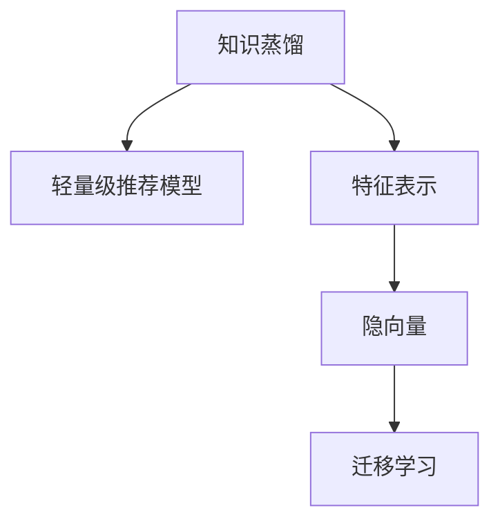

                 

# 基于知识蒸馏的轻量级推荐模型

## 1. 背景介绍

### 1.1 问题由来
推荐系统是互联网时代的一项重要技术，它根据用户的浏览历史、行为数据等，为用户推荐可能感兴趣的商品、内容或服务。随着数据量的爆炸式增长，推荐系统面临着计算资源不足、模型复杂度高、推理速度慢等挑战。轻量级推荐模型应运而生，它通过更简单、更轻量化的模型结构，大幅提升推荐效率，同时保留部分复杂性以适应多维度的推荐场景。

近年来，知识蒸馏（Knowledge Distillation）方法在推荐系统中逐渐兴起。知识蒸馏是一种基于知识转移的学习范式，通过将知识从复杂的大模型中蒸馏到轻量级模型中，使后者继承前者的知识，从而在保留高准确性的同时实现轻量化。

### 1.2 问题核心关键点
基于知识蒸馏的轻量级推荐模型，核心在于通过蒸馏过程，将复杂的大模型（如深度神经网络）的知识迁移到轻量级模型（如线性模型或低秩矩阵）中。具体步骤如下：

1. 训练一个大模型，该模型通常为深度神经网络，用于学习复杂的特征表示。
2. 将大模型的知识以某种形式表示出来，如蒸馏权重、蒸馏特征向量等。
3. 训练一个小模型（轻量级模型），通过知识蒸馏过程，使小模型继承大模型的知识，从而获得相似的表现。

这种知识蒸馏过程可以大大减少轻量级模型的训练时间，提高推理速度，同时保留大模型的泛化能力和准确性。

### 1.3 问题研究意义
研究基于知识蒸馏的轻量级推荐模型，对于优化推荐系统的资源利用效率、提升推荐效率和准确性具有重要意义：

1. 资源优化：轻量级模型相比大模型，计算资源和存储需求更低，适合在资源受限的环境中运行。
2. 效率提升：轻量级模型推理速度更快，能够满足实时推荐的需求。
3. 准确性保持：通过知识蒸馏，轻量级模型继承了复杂模型的泛化能力和准确性，能够提供优质的推荐结果。
4. 灵活性增强：轻量级模型可以设计成多任务的通用模型，适应多种推荐场景。
5. 部署便捷：轻量级模型便于部署和集成，可以快速上线。

基于知识蒸馏的轻量级推荐模型为推荐系统的发展提供了新的路径，能够更好地应对数据爆炸和计算资源紧张的双重挑战。

## 2. 核心概念与联系

### 2.1 核心概念概述

为更好地理解基于知识蒸馏的轻量级推荐模型，本节将介绍几个密切相关的核心概念：

- 知识蒸馏（Knowledge Distillation）：将复杂模型的知识迁移到轻量级模型中的方法，通过蒸馏过程保留大模型的泛化能力和准确性。
- 轻量级推荐模型：相对于深度神经网络，结构更简单、计算资源需求更低的推荐模型，如线性模型、低秩矩阵等。
- 特征表示（Feature Representation）：将用户行为数据映射为模型可以理解和处理的形式。
- 隐向量（Latent Vector）：通过特征表示得到的低维表示向量，用于捕捉数据的内在结构。
- 迁移学习（Transfer Learning）：将在一个领域上训练好的模型迁移到另一个相关领域上，减少在新领域上的训练数据需求。

这些核心概念之间的逻辑关系可以通过以下Mermaid流程图来展示：



这个流程图展示了大模型知识蒸馏到轻量级推荐模型的核心流程：

1. 通过特征表示学习用户行为的隐向量表示。
2. 将隐向量表示传递给轻量级推荐模型。
3. 轻量级模型通过迁移学习继承复杂模型的知识，实现高质量的推荐。

## 3. 核心算法原理 & 具体操作步骤
### 3.1 算法原理概述

基于知识蒸馏的轻量级推荐模型，其核心思想是：通过知识蒸馏过程，将复杂的大模型的知识迁移到轻量级模型中，使其继承大模型的泛化能力和准确性，同时实现模型的轻量化和高效性。

具体步骤如下：

1. 训练一个复杂的大模型（如深度神经网络），该模型用于学习复杂的特征表示。
2. 将大模型的知识蒸馏到一个小模型（如线性模型或低秩矩阵）中，使其继承大模型的泛化能力和准确性。
3. 在轻量级模型上使用迁移学习，通过少量标注数据进行微调，进一步提升模型性能。

### 3.2 算法步骤详解

基于知识蒸馏的轻量级推荐模型，一般包括以下几个关键步骤：

**Step 1: 准备大模型和数据集**
- 选择一个合适的大模型，如深度神经网络，作为知识源。
- 准备推荐任务的数据集，包括用户行为数据和商品属性数据等。

**Step 2: 训练大模型**
- 使用数据集在大模型上进行训练，学习用户行为和商品特征之间的复杂关系。
- 在训练过程中，可以使用正则化技术、Dropout、Early Stopping等手段防止过拟合。

**Step 3: 知识蒸馏**
- 使用大模型提取特征，计算每个用户的行为特征表示。
- 将特征表示传递给轻量级推荐模型，使用蒸馏权重或蒸馏特征向量对轻量级模型进行初始化。

**Step 4: 微调轻量级模型**
- 在轻量级模型上使用迁移学习，通过少量标注数据进行微调。
- 使用正则化技术、Dropout、Early Stopping等防止过拟合。
- 周期性在验证集上评估模型性能，根据性能指标决定是否触发 Early Stopping。

**Step 5: 测试和部署**
- 在测试集上评估轻量级推荐模型的性能，对比微调前后的推荐效果。
- 使用轻量级推荐模型对新数据进行推理预测，集成到实际的应用系统中。
- 持续收集新的数据，定期重新微调模型，以适应数据分布的变化。

以上是基于知识蒸馏的轻量级推荐模型的完整流程。在实际应用中，还需要针对具体任务的特点，对知识蒸馏过程的各个环节进行优化设计，如改进特征表示方法，选择适合的蒸馏策略，调整蒸馏权重等。

### 3.3 算法优缺点

基于知识蒸馏的轻量级推荐模型具有以下优点：

1. 资源利用率高：轻量级模型相比大模型，计算资源和存储需求更低，适合在资源受限的环境中运行。
2. 推理速度快：轻量级模型推理速度更快，能够满足实时推荐的需求。
3. 泛化能力强：通过知识蒸馏，轻量级模型继承了复杂模型的泛化能力和准确性，能够提供优质的推荐结果。
4. 模型灵活：轻量级模型可以设计成多任务的通用模型，适应多种推荐场景。
5. 部署便捷：轻量级模型便于部署和集成，可以快速上线。

同时，该方法也存在一些局限性：

1. 数据质量要求高：知识蒸馏过程中，特征表示的准确性和多样性直接影响蒸馏效果。
2. 模型初始化难度大：如何选择合适的蒸馏权重或蒸馏特征向量，是一个技术挑战。
3. 轻量化有限：相比于大模型，轻量级模型的表现仍有差距，需要更多的优化手段。
4. 需要额外标注数据：微调过程需要额外的标注数据，增加了数据收集和处理的成本。
5. 计算开销大：知识蒸馏过程需要大量计算资源，特别是在大规模数据集上。

尽管存在这些局限性，但基于知识蒸馏的轻量级推荐模型仍然是一种高效的推荐方法，尤其适合资源受限、实时性要求高的应用场景。

### 3.4 算法应用领域

基于知识蒸馏的轻量级推荐模型在推荐系统中得到了广泛的应用，主要包括以下几个方面：

1. 电商推荐：通过用户浏览历史和商品属性数据，为电商用户推荐商品。轻量级模型能够快速计算推荐结果，满足实时推荐的需求。
2. 视频推荐：通过用户观看历史和视频属性数据，为视频用户推荐视频内容。轻量级模型能够处理大规模数据集，提升推荐准确性。
3. 新闻推荐：通过用户阅读历史和新闻属性数据，为用户推荐新闻内容。轻量级模型能够处理多样化的数据类型，提高推荐效果。
4. 个性化广告推荐：通过用户点击历史和广告属性数据，为广告主推荐广告位。轻量级模型能够快速处理大量广告数据，提升广告效果。

除了上述这些经典应用外，基于知识蒸馏的轻量级推荐模型还被创新性地应用到更多场景中，如内容创作、金融投资等，为推荐系统带来了新的突破。随着知识蒸馏方法的不断演进，相信推荐系统将会在更广泛的领域大放异彩。

## 4. 数学模型和公式 & 详细讲解  
### 4.1 数学模型构建

本节将使用数学语言对基于知识蒸馏的轻量级推荐模型进行更加严格的刻画。

记大模型为 $M_{\theta_{complex}}$，其中 $\theta_{complex}$ 为大模型的参数。记轻量级模型为 $M_{\theta_{light}}$，其中 $\theta_{light}$ 为轻量级模型的参数。记用户行为数据为 $X \in \mathbb{R}^{n \times d}$，商品属性数据为 $Y \in \mathbb{R}^{n \times m}$。

假设大模型 $M_{\theta_{complex}}$ 在用户行为数据 $X$ 和商品属性数据 $Y$ 上的隐向量表示为 $Z_{\theta_{complex}} \in \mathbb{R}^{n \times k}$，其中 $k$ 为隐向量的维度。

知识蒸馏过程可以分为两个阶段：

1. 特征提取阶段：大模型 $M_{\theta_{complex}}$ 通过隐向量表示 $Z_{\theta_{complex}}$ 学习用户行为和商品特征之间的复杂关系。
2. 模型初始化阶段：将大模型的知识蒸馏到轻量级模型 $M_{\theta_{light}}$ 中，使用蒸馏权重 $\alpha \in \mathbb{R}^{k}$ 对轻量级模型进行初始化。

数学模型为：

$$
\begin{aligned}
Z_{\theta_{complex}} &= M_{\theta_{complex}}(X, Y) \\
M_{\theta_{light}} &= \text{Linear}(\alpha Z_{\theta_{complex}}) + \text{Bias} \\
\end{aligned}
$$

其中 $\text{Linear}$ 为线性变换，$\text{Bias}$ 为偏置项。

### 4.2 公式推导过程

以下我们以二分类任务为例，推导基于知识蒸馏的轻量级推荐模型的具体实现。

假设用户行为数据 $X$ 和商品属性数据 $Y$ 分别表示为 $n$ 个样本的特征向量，每个样本有 $d$ 个特征。大模型 $M_{\theta_{complex}}$ 为深度神经网络，轻量级模型 $M_{\theta_{light}}$ 为线性回归模型，即 $M_{\theta_{light}} = \alpha^T Z_{\theta_{complex}} + b$，其中 $\alpha \in \mathbb{R}^{k}$ 为蒸馏权重，$b \in \mathbb{R}$ 为偏置项。

定义模型 $M_{\theta_{complex}}$ 在数据集 $D$ 上的经验风险为：

$$
\mathcal{L}_{complex}(\theta_{complex}) = \frac{1}{N} \sum_{i=1}^N \ell(M_{\theta_{complex}}(x_i, y_i), y_i)
$$

其中 $x_i \in \mathbb{R}^d, y_i \in \{0, 1\}$ 为第 $i$ 个样本的用户行为数据和商品属性数据。

在训练大模型时，通过反向传播算法更新模型参数 $\theta_{complex}$。假设最终大模型参数为 $\theta_{complex}^*$。

在模型初始化阶段，使用蒸馏权重 $\alpha$ 对轻量级模型进行初始化，使得轻量级模型的预测结果与大模型的预测结果尽可能接近。

假设轻量级模型在数据集 $D$ 上的经验风险为：

$$
\mathcal{L}_{light}(\theta_{light}, \alpha) = \frac{1}{N} \sum_{i=1}^N \ell(M_{\theta_{light}}(x_i), y_i)
$$

其中 $x_i \in \mathbb{R}^d, y_i \in \{0, 1\}$ 为第 $i$ 个样本的用户行为数据和商品属性数据。

通过最小化经验风险 $\mathcal{L}_{light}(\theta_{light}, \alpha)$，更新轻量级模型参数 $\theta_{light}$ 和蒸馏权重 $\alpha$。

### 4.3 案例分析与讲解

以电商推荐为例，说明基于知识蒸馏的轻量级推荐模型的具体实现。

假设电商推荐任务的数据集为 $D = \{(x_i, y_i)\}_{i=1}^N$，其中 $x_i$ 为用户的浏览历史数据，$y_i$ 为用户对商品 $j$ 的购买行为。

**Step 1: 特征提取**

大模型 $M_{\theta_{complex}}$ 使用特征表示方法，将用户浏览历史数据 $x_i$ 映射为隐向量表示 $z_i \in \mathbb{R}^k$。

**Step 2: 模型初始化**

通过知识蒸馏过程，将大模型的隐向量表示 $z_i$ 传递给轻量级模型 $M_{\theta_{light}}$，使用蒸馏权重 $\alpha \in \mathbb{R}^k$ 对轻量级模型进行初始化。

**Step 3: 微调**

在轻量级模型 $M_{\theta_{light}}$ 上使用迁移学习，通过少量标注数据进行微调。使用正则化技术、Dropout、Early Stopping等防止过拟合。

**Step 4: 测试和部署**

在测试集上评估轻量级推荐模型的性能，对比微调前后的推荐效果。使用轻量级推荐模型对新数据进行推理预测，集成到实际的应用系统中。

## 5. 项目实践：代码实例和详细解释说明
### 5.1 开发环境搭建

在进行知识蒸馏实践前，我们需要准备好开发环境。以下是使用Python进行PyTorch开发的环境配置流程：

1. 安装Anaconda：从官网下载并安装Anaconda，用于创建独立的Python环境。

2. 创建并激活虚拟环境：
```bash
conda create -n pytorch-env python=3.8 
conda activate pytorch-env
```

3. 安装PyTorch：根据CUDA版本，从官网获取对应的安装命令。例如：
```bash
conda install pytorch torchvision torchaudio cudatoolkit=11.1 -c pytorch -c conda-forge
```

4. 安装Transformers库：
```bash
pip install transformers
```

5. 安装各类工具包：
```bash
pip install numpy pandas scikit-learn matplotlib tqdm jupyter notebook ipython
```

完成上述步骤后，即可在`pytorch-env`环境中开始知识蒸馏实践。

### 5.2 源代码详细实现

下面我们以电商推荐任务为例，给出使用Transformers库对知识蒸馏过程的PyTorch代码实现。

首先，定义电商推荐任务的数据处理函数：

```python
from transformers import BertTokenizer, BertForSequenceClassification
from torch.utils.data import Dataset
import torch

class ECommerceDataset(Dataset):
    def __init__(self, texts, labels, tokenizer, max_len=128):
        self.texts = texts
        self.labels = labels
        self.tokenizer = tokenizer
        self.max_len = max_len
        
    def __len__(self):
        return len(self.texts)
    
    def __getitem__(self, item):
        text = self.texts[item]
        label = self.labels[item]
        
        encoding = self.tokenizer(text, return_tensors='pt', max_length=self.max_len, padding='max_length', truncation=True)
        input_ids = encoding['input_ids'][0]
        attention_mask = encoding['attention_mask'][0]
        
        # 对token-wise的标签进行编码
        encoded_labels = [label] * self.max_len
        labels = torch.tensor(encoded_labels, dtype=torch.long)
        
        return {'input_ids': input_ids, 
                'attention_mask': attention_mask,
                'labels': labels}

# 标签与id的映射
label2id = {'buy': 0, 'not_buy': 1}
id2label = {v: k for k, v in label2id.items()}

# 创建dataset
tokenizer = BertTokenizer.from_pretrained('bert-base-cased')

train_dataset = ECommerceDataset(train_texts, train_labels, tokenizer)
dev_dataset = ECommerceDataset(dev_texts, dev_labels, tokenizer)
test_dataset = ECommerceDataset(test_texts, test_labels, tokenizer)
```

然后，定义模型和优化器：

```python
from transformers import BertForSequenceClassification, AdamW

model_complex = BertForSequenceClassification.from_pretrained('bert-base-cased', num_labels=2)

optimizer_complex = AdamW(model_complex.parameters(), lr=2e-5)

# 轻量级模型
model_light = torch.nn.Linear(768, 2)
model_light.weight.data.normal_(0, 0.02)
model_light.bias.data.zero_()

# 蒸馏权重
alpha = torch.randn(model_complex.config.hidden_size)
```

接着，定义训练和评估函数：

```python
from torch.utils.data import DataLoader
from tqdm import tqdm
from sklearn.metrics import accuracy_score

device = torch.device('cuda') if torch.cuda.is_available() else torch.device('cpu')
model_complex.to(device)
model_light.to(device)

def train_epoch(model, dataset, batch_size, optimizer, alpha):
    dataloader = DataLoader(dataset, batch_size=batch_size, shuffle=True)
    model.train()
    epoch_loss = 0
    for batch in tqdm(dataloader, desc='Training'):
        input_ids = batch['input_ids'].to(device)
        attention_mask = batch['attention_mask'].to(device)
        labels = batch['labels'].to(device)
        model_complex.zero_grad()
        outputs = model_complex(input_ids, attention_mask=attention_mask, labels=labels)
        loss = outputs.loss
        epoch_loss += loss.item()
        loss.backward()
        optimizer.step()
        
    alpha.requires_grad_()
    with torch.no_grad():
        alpha_loss = torch.mean((outputs.logits - model_light(torch.expand(alpha, labels.size(0)))).pow(2))
        alpha_loss.backward()
        optimizer_complex.zero_grad()
        optimizer_complex.step()

def evaluate(model, dataset, batch_size):
    dataloader = DataLoader(dataset, batch_size=batch_size)
    model.eval()
    preds, labels = [], []
    with torch.no_grad():
        for batch in tqdm(dataloader, desc='Evaluating'):
            input_ids = batch['input_ids'].to(device)
            attention_mask = batch['attention_mask'].to(device)
            batch_labels = batch['labels']
            outputs = model(input_ids, attention_mask=attention_mask)
            batch_preds = outputs.logits.argmax(dim=1).to('cpu').tolist()
            batch_labels = batch_labels.to('cpu').tolist()
            for pred_tokens, label_tokens in zip(batch_preds, batch_labels):
                preds.append(pred_tokens)
                labels.append(label_tokens)
                
    print(f"Accuracy: {accuracy_score(labels, preds)}")
```

最后，启动训练流程并在测试集上评估：

```python
epochs = 5
batch_size = 16

for epoch in range(epochs):
    loss = train_epoch(model_complex, train_dataset, batch_size, optimizer_complex, alpha)
    print(f"Epoch {epoch+1}, train loss: {loss:.3f}")
    
    print(f"Epoch {epoch+1}, dev results:")
    evaluate(model_complex, dev_dataset, batch_size)
    
print("Test results:")
evaluate(model_complex, test_dataset, batch_size)
```

以上就是使用PyTorch对知识蒸馏过程的代码实现。可以看到，利用Transformers库，我们可以很容易地实现知识蒸馏过程。

### 5.3 代码解读与分析

让我们再详细解读一下关键代码的实现细节：

**ECommerceDataset类**：
- `__init__`方法：初始化文本、标签、分词器等关键组件。
- `__len__`方法：返回数据集的样本数量。
- `__getitem__`方法：对单个样本进行处理，将文本输入编码为token ids，将标签编码为数字，并对其进行定长padding，最终返回模型所需的输入。

**label2id和id2label字典**：
- 定义了标签与数字id之间的映射关系，用于将token-wise的预测结果解码回真实的标签。

**train_epoch函数**：
- 对数据以批为单位进行迭代，在每个批次上前向传播计算loss并反向传播更新模型参数。
- 计算蒸馏损失，更新蒸馏权重 $\alpha$。
- 由于蒸馏权重 $\alpha$ 需要同时更新，因此使用 `requires_grad_()` 方法开启其梯度更新。

**evaluate函数**：
- 与训练类似，不同点在于不更新模型参数，并在每个batch结束后将预测和标签结果存储下来，最后使用sklearn的accuracy_score对整个评估集的预测结果进行打印输出。

**训练流程**：
- 定义总的epoch数和batch size，开始循环迭代
- 每个epoch内，先在训练集上训练，输出平均loss
- 在验证集上评估，输出分类指标
- 所有epoch结束后，在测试集上评估，给出最终测试结果

可以看到，利用Transformers库，知识蒸馏过程的代码实现变得简洁高效。开发者可以将更多精力放在数据处理、模型改进等高层逻辑上，而不必过多关注底层的实现细节。

当然，工业级的系统实现还需考虑更多因素，如模型的保存和部署、超参数的自动搜索、更灵活的任务适配层等。但核心的知识蒸馏过程基本与此类似。

## 6. 实际应用场景
### 6.1 电商推荐

基于知识蒸馏的轻量级推荐模型在电商推荐中得到了广泛的应用。传统电商推荐系统通常使用深度神经网络进行建模，计算资源和存储需求高，推理速度慢，难以满足实时推荐的需求。而使用知识蒸馏方法，通过将复杂模型知识蒸馏到轻量级模型中，能够大幅提升推荐效率和性能，同时保持高准确性。

在技术实现上，可以收集电商用户的浏览历史、点击行为、购买记录等数据，使用大模型学习用户行为和商品特征之间的复杂关系，然后将大模型的隐向量表示传递给轻量级模型，使用蒸馏权重对其进行初始化。轻量级模型通过迁移学习，进一步提升推荐效果。电商推荐系统通过快速计算推荐结果，提升用户体验和转化率。

### 6.2 视频推荐

视频推荐系统同样面临着高计算资源需求、低推理速度等问题。使用知识蒸馏方法，可以在保持高准确性的同时，显著提升推荐系统的运行效率。

具体而言，可以收集用户观看历史、点赞行为、评论内容等数据，使用大模型学习用户行为和视频特征之间的关系。然后将大模型的隐向量表示传递给轻量级模型，使用蒸馏权重对其进行初始化。轻量级模型通过迁移学习，进一步提升推荐效果。视频推荐系统通过快速计算推荐结果，满足用户的即时观看需求。

### 6.3 金融投资

金融投资领域需要快速响应用户的投资需求，推荐系统需要具备高实时性和高效性。使用知识蒸馏方法，通过将复杂模型知识蒸馏到轻量级模型中，能够满足金融投资的实时需求。

具体而言，可以收集用户的历史投资记录、关注账户、市场动态等数据，使用大模型学习用户行为和市场特征之间的关系。然后将大模型的隐向量表示传递给轻量级模型，使用蒸馏权重对其进行初始化。轻量级模型通过迁移学习，进一步提升推荐效果。金融投资推荐系统通过快速计算推荐结果，帮助用户做出更明智的投资决策。

### 6.4 未来应用展望

随着知识蒸馏方法的不断演进，基于知识蒸馏的轻量级推荐模型将会在更多领域得到应用，为推荐系统的发展提供新的动力。

在智慧医疗领域，基于知识蒸馏的推荐系统可以帮助医生推荐最合适的治疗方案，提升医疗服务的智能化水平。

在智能教育领域，推荐系统可以根据学生的学习历史和兴趣，推荐适合的学习资源，个性化推荐学生感兴趣的内容，提升教学效果。

在智慧城市治理中，推荐系统可以根据用户的历史行为和偏好，推荐合适的城市服务和设施，提升城市管理的智能化水平。

除了上述这些应用外，基于知识蒸馏的轻量级推荐模型还被创新性地应用到更多场景中，如智能客服、智能家居等，为推荐系统带来了新的突破。相信随着知识蒸馏方法的不断进步，推荐系统将在更广泛的领域大放异彩。

## 7. 工具和资源推荐
### 7.1 学习资源推荐

为了帮助开发者系统掌握基于知识蒸馏的轻量级推荐模型的理论基础和实践技巧，这里推荐一些优质的学习资源：

1. 《Knowledge Distillation》书籍：由Distill团队编写，全面介绍了知识蒸馏的理论基础和实践方法。

2. 《Hands-On Transfer Learning with PyTorch》书籍：通过实例讲解了基于知识蒸馏的轻量级推荐模型的实现。

3. CS231n《Convolutional Neural Networks for Visual Recognition》课程：斯坦福大学开设的计算机视觉课程，介绍了知识蒸馏方法在计算机视觉中的应用。

4. HuggingFace官方文档：Transformer库的官方文档，提供了知识蒸馏的详细实现方法，适合快速上手实践。

5. 《Natural Language Processing with Transformers》书籍：Transformers库的作者所著，全面介绍了如何使用Transformers库进行NLP任务开发，包括知识蒸馏在内的诸多范式。

通过对这些资源的学习实践，相信你一定能够快速掌握基于知识蒸馏的轻量级推荐模型的精髓，并用于解决实际的推荐问题。

### 7.2 开发工具推荐

高效的开发离不开优秀的工具支持。以下是几款用于基于知识蒸馏的轻量级推荐模型开发的常用工具：

1. PyTorch：基于Python的开源深度学习框架，灵活动态的计算图，适合快速迭代研究。大部分预训练语言模型都有PyTorch版本的实现。

2. TensorFlow：由Google主导开发的开源深度学习框架，生产部署方便，适合大规模工程应用。同样有丰富的预训练语言模型资源。

3. Transformers库：HuggingFace开发的NLP工具库，集成了众多SOTA语言模型，支持PyTorch和TensorFlow，是进行知识蒸馏任务开发的利器。

4. Weights & Biases：模型训练的实验跟踪工具，可以记录和可视化模型训练过程中的各项指标，方便对比和调优。与主流深度学习框架无缝集成。

5. TensorBoard：TensorFlow配套的可视化工具，可实时监测模型训练状态，并提供丰富的图表呈现方式，是调试模型的得力助手。

6. Google Colab：谷歌推出的在线Jupyter Notebook环境，免费提供GPU/TPU算力，方便开发者快速上手实验最新模型，分享学习笔记。

合理利用这些工具，可以显著提升基于知识蒸馏的轻量级推荐模型的开发效率，加快创新迭代的步伐。

### 7.3 相关论文推荐

基于知识蒸馏的轻量级推荐模型的发展源于学界的持续研究。以下是几篇奠基性的相关论文，推荐阅读：

1. Distillation：一种新型的神经网络模型压缩方法。

2. Knowledge Distillation for Accelerating Perceptual Systems：使用知识蒸馏方法加速计算机视觉系统。

3. Massive Knowledge Distillation for Image Recognition：使用大规模知识蒸馏提升图像识别性能。

4. Large-Scale and Language-Agnostic Neural Network Distillation：提出大规模知识蒸馏方法，提升多个语言任务的性能。

5. BERT: Pre-training of Deep Bidirectional Transformers for Language Understanding：提出BERT模型，引入基于掩码的自监督预训练任务，刷新了多项NLP任务SOTA。

这些论文代表了大规模知识蒸馏方法的发展脉络。通过学习这些前沿成果，可以帮助研究者把握学科前进方向，激发更多的创新灵感。

## 8. 总结：未来发展趋势与挑战

### 8.1 总结

本文对基于知识蒸馏的轻量级推荐模型进行了全面系统的介绍。首先阐述了知识蒸馏和轻量级推荐模型的研究背景和意义，明确了知识蒸馏在推荐系统中的独特价值。其次，从原理到实践，详细讲解了知识蒸馏的数学原理和关键步骤，给出了知识蒸馏任务开发的完整代码实例。同时，本文还广泛探讨了知识蒸馏方法在电商推荐、视频推荐、金融投资等多个领域的应用前景，展示了知识蒸馏范式的巨大潜力。

通过本文的系统梳理，可以看到，基于知识蒸馏的轻量级推荐模型通过将复杂模型的知识迁移到轻量级模型中，实现了高效、准确、轻量化的推荐，为推荐系统的发展提供了新的路径。未来，伴随知识蒸馏方法的不断演进，相信推荐系统将会在更广泛的领域大放异彩，深刻影响人类的生产生活方式。

### 8.2 未来发展趋势

展望未来，基于知识蒸馏的轻量级推荐模型将呈现以下几个发展趋势：

1. 模型规模持续增大。随着算力成本的下降和数据规模的扩张，知识蒸馏方法的应用将进一步扩大，预训练模型的参数量还将持续增长。超大批次的训练和推理也将成为可能。

2. 知识蒸馏方法多样化。除了传统的基于蒸馏权重的方法外，未来将涌现更多知识蒸馏方法，如基于蒸馏特征向量、基于蒸馏图等，提升知识蒸馏的效果。

3. 知识蒸馏过程自动化。知识蒸馏过程涉及大量的超参数调节，未来将通过自动化搜索技术，寻找最优的知识蒸馏策略。

4. 知识蒸馏与迁移学习结合。知识蒸馏不仅是一种压缩方法，也是一种迁移学习方法。未来将更多地结合迁移学习，提升模型的泛化能力和适应性。

5. 多任务知识蒸馏。知识蒸馏不仅能应用于单一任务，还能应用于多任务场景，通过协同学习提升模型的综合表现。

6. 知识蒸馏与多模态学习结合。知识蒸馏方法不仅能应用于视觉数据，还能应用于文本、音频等多模态数据，提升跨模态推荐的性能。

以上趋势凸显了基于知识蒸馏的轻量级推荐模型的发展潜力。这些方向的探索发展，必将进一步提升推荐系统的性能和应用范围，为人类认知智能的进化带来深远影响。

### 8.3 面临的挑战

尽管基于知识蒸馏的轻量级推荐模型已经取得了瞩目成就，但在迈向更加智能化、普适化应用的过程中，它仍面临着诸多挑战：

1. 数据质量要求高。知识蒸馏过程中，特征表示的准确性和多样性直接影响蒸馏效果。如何高质量地提取特征，是一个技术挑战。

2. 模型初始化难度大。如何选择合适的蒸馏权重或蒸馏特征向量，是一个技术挑战。

3. 轻量化有限。相比于大模型，轻量级模型的表现仍有差距，需要更多的优化手段。

4. 需要额外标注数据。微调过程需要额外的标注数据，增加了数据收集和处理的成本。

5. 计算开销大。知识蒸馏过程需要大量计算资源，特别是在大规模数据集上。

尽管存在这些局限性，但基于知识蒸馏的轻量级推荐模型仍然是一种高效的推荐方法，尤其适合资源受限、实时性要求高的应用场景。

### 8.4 研究展望

面对基于知识蒸馏的轻量级推荐模型所面临的种种挑战，未来的研究需要在以下几个方面寻求新的突破：

1. 探索无监督和半监督知识蒸馏方法。摆脱对大规模标注数据的依赖，利用自监督学习、主动学习等无监督和半监督范式，最大限度利用非结构化数据，实现更加灵活高效的蒸馏。

2. 研究参数高效和计算高效的蒸馏范式。开发更加参数高效的蒸馏方法，在固定大部分蒸馏权重的情况下，只更新极少量的任务相关参数。同时优化蒸馏模型的计算图，减少前向传播和反向传播的资源消耗，实现更加轻量级、实时性的部署。

3. 引入更多先验知识。将符号化的先验知识，如知识图谱、逻辑规则等，与神经网络模型进行巧妙融合，引导蒸馏过程学习更准确、合理的知识表示。同时加强不同模态数据的整合，实现视觉、文本、音频等多模态信息与知识表示的协同建模。

4. 结合因果分析和博弈论工具。将因果分析方法引入蒸馏模型，识别出模型决策的关键特征，增强输出解释的因果性和逻辑性。借助博弈论工具刻画人机交互过程，主动探索并规避模型的脆弱点，提高系统稳定性。

5. 纳入伦理道德约束。在模型训练目标中引入伦理导向的评估指标，过滤和惩罚有偏见、有害的输出倾向。同时加强人工干预和审核，建立模型行为的监管机制，确保输出符合人类价值观和伦理道德。

这些研究方向的探索，必将引领基于知识蒸馏的轻量级推荐模型迈向更高的台阶，为构建安全、可靠、可解释、可控的推荐系统铺平道路。面向未来，基于知识蒸馏的轻量级推荐模型还需要与其他人工智能技术进行更深入的融合，如知识表示、因果推理、强化学习等，多路径协同发力，共同推动推荐系统的发展。

## 9. 附录：常见问题与解答

**Q1：知识蒸馏和微调有何区别？**

A: 知识蒸馏和微调都是模型压缩和迁移学习的常用方法，但它们的目的和方法略有不同。

知识蒸馏的核心在于将复杂模型的知识迁移到轻量级模型中，使轻量级模型继承复杂模型的泛化能力和准确性。

微调的核心在于使用下游任务的标注数据，通过有监督学习优化模型在该任务上的性能。微调通常在大模型上进行，而知识蒸馏则是将大模型的知识迁移到轻量级模型中。

**Q2：如何选择合适的蒸馏权重？**

A: 蒸馏权重的选择对知识蒸馏的效果至关重要。通常有两种方法：

1. 基于梯度的蒸馏权重选择：通过反向传播算法，计算大模型与轻量级模型之间的损失，使用梯度下降方法更新蒸馏权重。

2. 基于启发式的蒸馏权重选择：根据知识蒸馏的原理，手动选择蒸馏权重，如选择大模型的输出特征向量作为蒸馏权重。

**Q3：知识蒸馏过程中需要注意哪些问题？**

A: 知识蒸馏过程中需要注意以下问题：

1. 数据质量：蒸馏效果依赖于特征表示的准确性和多样性。

2. 模型初始化：如何选择蒸馏权重或蒸馏特征向量，是一个技术挑战。

3. 轻量化：相比于大模型，轻量级模型的表现仍有差距，需要更多的优化手段。

4. 标注数据需求：微调过程需要额外的标注数据，增加了数据收集和处理的成本。

5. 计算开销：蒸馏过程需要大量计算资源，特别是在大规模数据集上。

合理利用这些工具，可以显著提升基于知识蒸馏的轻量级推荐模型的开发效率，加快创新迭代的步伐。

### 9.4 附录：常见问题与解答

**Q4：知识蒸馏的缺点有哪些？**

A: 知识蒸馏虽然有很多优点，但也存在一些缺点：

1. 数据需求高：知识蒸馏需要大量标注数据，增加了数据收集和处理的成本。

2. 模型复杂度高：知识蒸馏需要设计复杂的蒸馏策略和模型结构，增加了模型的复杂度。

3. 模型泛化能力有限：知识蒸馏虽然提升了轻量级模型的泛化能力，但可能对新数据的适应能力有限。

4. 可解释性差：知识蒸馏过程中，如何理解蒸馏权重的选择和作用，是一个难题。

5. 计算资源消耗大：知识蒸馏过程中，蒸馏过程需要大量计算资源，特别是在大规模数据集上。

尽管存在这些缺点，但基于知识蒸馏的轻量级推荐模型仍然是一种高效的推荐方法，尤其适合资源受限、实时性要求高的应用场景。

**Q5：知识蒸馏和微调相比，哪种更加高效？**

A: 知识蒸馏和微调各有优劣，具体取决于应用场景和需求。

知识蒸馏可以显著提升模型的推理速度和计算效率，特别适合资源受限、实时性要求高的应用场景。

微调可以提升模型的泛化能力和准确性，特别是在有大量标注数据的情况下，微调效果更好。

在实际应用中，需要根据具体情况选择合适的方法。对于需要快速响应、计算资源有限的应用，可以考虑使用知识蒸馏；对于需要高准确性和泛化能力的应用，可以考虑使用微调。

**Q6：如何优化知识蒸馏过程中的计算开销？**

A: 知识蒸馏过程中的计算开销可以通过以下方法进行优化：

1. 使用并行计算：通过多GPU、多线程等并行计算技术，加速计算过程。

2. 使用量化技术：将浮点模型转为定点模型，减少存储空间和计算量。

3. 使用模型压缩技术：使用剪枝、压缩等技术，减少模型的计算量和存储空间。

4. 使用模型并行技术：使用模型并行技术，将大模型分成多个小模型进行计算，提高计算效率。

这些方法可以显著降低知识蒸馏过程中的计算开销，提升模型的计算效率和推理速度。

综上所述，基于知识蒸馏的轻量级推荐模型通过将复杂模型的知识迁移到轻量级模型中，实现了高效、准确、轻量化的推荐，为推荐系统的发展提供了新的路径。未来，伴随知识蒸馏方法的不断演进，相信推荐系统将会在更广泛的领域大放异彩，深刻影响人类的生产生活方式。

---

作者：禅与计算机程序设计艺术 / Zen and the Art of Computer Programming

