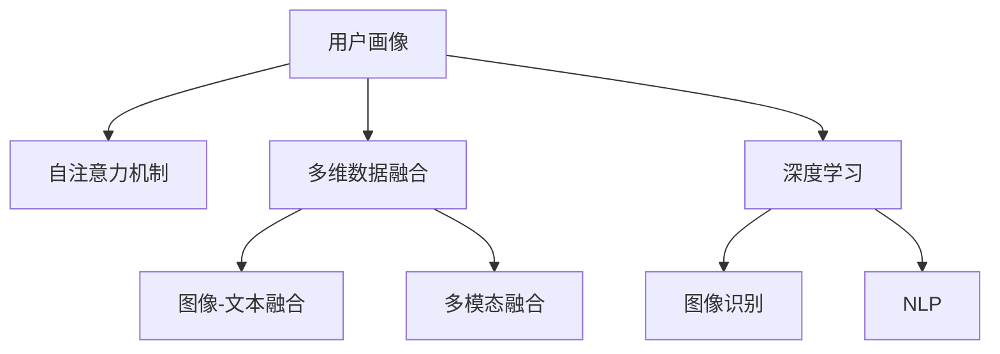

                 

# 基于自注意力机制的多维用户画像构建

> 关键词：用户画像,自注意力机制,多维数据融合,深度学习,图像识别,自然语言处理,计算机视觉

## 1. 背景介绍

在互联网时代，用户画像成为了商家和用户研究的重要工具。传统的用户画像构建，主要依赖人工标注或简单的统计方法，难以充分挖掘用户多维度的属性信息。而基于深度学习的用户画像构建方法，尤其是结合自注意力机制的多维用户画像构建技术，逐渐成为行业热点。本文将系统介绍这种技术原理、操作步骤及应用，并展望未来发展趋势与挑战。

### 1.1 问题由来

随着互联网应用的不断普及，用户数据的规模呈爆炸性增长。如何在海量数据中准确捕捉和描述用户行为特征，成为商家和用户研究的重大挑战。传统的用户画像构建方法，如人工调查、问卷分析等，需要大量时间和人力成本，且数据质量难以保证。而通过深度学习技术，可以自动高效地从多维数据中挖掘用户特征，构建出精准全面的用户画像。

### 1.2 问题核心关键点

用户画像构建的核心关键点在于如何有效融合多维数据，并从中提取出有价值的特征。目前，主流的深度学习技术包括图像识别、自然语言处理、推荐系统等。而基于自注意力机制的多维用户画像构建方法，通过深度学习模型自适应地捕捉数据间关联，从文本、图像等多个维度中提取用户特征，并进行多模态融合，生成更加全面、精准的用户画像。

## 2. 核心概念与联系

### 2.1 核心概念概述

为更好地理解基于自注意力机制的多维用户画像构建技术，本节将介绍几个关键概念：

- **用户画像(User Profile)**：描述用户属性特征的数字表达，包括基本信息、兴趣偏好、行为习惯等，用于构建用户画像。
- **自注意力机制(Self-Attention)**：深度学习中一种重要的机制，通过计算输入向量之间的相关性，动态调整每个向量的权重，使得模型可以自适应地捕捉数据间关联。
- **多维数据融合(Multimodal Data Fusion)**：将来自不同模态的数据（如文本、图像、语音等）融合起来，共同构成用户画像。
- **深度学习(Deep Learning)**：通过多层神经网络模型，自动学习数据中的复杂规律，用于多维数据融合和用户画像构建。
- **图像识别(Image Recognition)**：通过深度学习模型，识别和分类图像中的对象，用于图像数据的用户画像构建。
- **自然语言处理(Natural Language Processing, NLP)**：利用自然语言处理技术，分析文本数据，提取文本特征，用于文本数据的用户画像构建。

这些概念之间的逻辑关系可以通过以下Mermaid流程图来展示：



这个流程图展示了大语言模型的核心概念及其之间的关系：

1. 用户画像通过自注意力机制和多维数据融合，自适应地捕捉不同数据间的关系。
2. 深度学习提供了多维数据融合的强大算法支撑。
3. 图像识别和自然语言处理分别应用于图像和文本数据的用户画像构建。
4. 最终的多维用户画像，通过自注意力机制进行权重计算，动态调整各个特征的权重。

这些概念共同构成了多维用户画像构建的技术框架，使得用户画像更加全面、准确。

## 3. 核心算法原理 & 具体操作步骤
### 3.1 算法原理概述

基于自注意力机制的多维用户画像构建方法，主要通过深度学习模型自适应地捕捉不同数据间的关系，从而生成多维用户画像。具体来说，通过多模态数据融合模块，将来自不同模态的数据进行预处理和特征提取，然后通过自注意力机制对融合后的特征向量进行动态加权，生成用户画像向量。

形式化地，设多模态数据集为 $D=\{(x_1,y_1),(x_2,y_2),\dots,(x_n,y_n)\}$，其中 $x_i$ 为输入特征向量，$y_i$ 为对应的用户标签。多模态数据融合模块 $F(D)$ 将 $D$ 中的不同模态数据融合为一个特征向量 $z$，自注意力机制模块 $A(z)$ 对 $z$ 进行加权，生成用户画像向量 $u$。最终用户画像生成模块 $G(u)$ 将 $u$ 转化为用户画像。

### 3.2 算法步骤详解

基于自注意力机制的多维用户画像构建，主要包括以下几个关键步骤：

**Step 1: 多模态数据融合**

首先，需要将来自不同模态的数据进行预处理和特征提取，然后通过深度学习模型将其融合为一个特征向量 $z$。例如，对于文本和图像数据，可以使用Bert、ResNet等模型分别提取文本和图像特征，然后将两者拼接为一个向量。

```python
from transformers import BertTokenizer, BertModel
from torchvision import models, transforms

tokenizer = BertTokenizer.from_pretrained('bert-base-uncased')
model = BertModel.from_pretrained('bert-base-uncased')

def text2vec(text):
    inputs = tokenizer(text, return_tensors='pt', padding=True, truncation=True)
    return model(inputs).last_hidden_state[:,0,:].mean()

def image2vec(image):
    transform = transforms.Compose([
        transforms.Resize(224),
        transforms.ToTensor(),
        transforms.Normalize(mean=[0.485, 0.456, 0.406], std=[0.229, 0.224, 0.225])
    ])
    image = transform(image).unsqueeze(0)
    model = models.resnet18(pretrained=True)
    model.eval()
    with torch.no_grad():
        features = model(image).detach().cpu().numpy()[0]
    return features

text = 'Hello, world!'
image = 'example.jpg'
text_features = text2vec(text)
image_features = image2vec(image)
z = torch.cat([text_features, image_features])
```

**Step 2: 自注意力机制加权**

接下来，使用自注意力机制对融合后的特征向量 $z$ 进行加权，生成用户画像向量 $u$。自注意力机制通过计算输入向量之间的相关性，动态调整每个向量的权重，使得模型可以自适应地捕捉数据间关联。

```python
from torch import nn, Tensor
import torch.nn.functional as F

class SelfAttention(nn.Module):
    def __init__(self, hidden_size, num_heads):
        super(SelfAttention, self).__init__()
        self.hidden_size = hidden_size
        self.num_heads = num_heads
        self.query = nn.Linear(hidden_size, hidden_size)
        self.key = nn.Linear(hidden_size, hidden_size)
        self.value = nn.Linear(hidden_size, hidden_size)
        self.fc = nn.Linear(hidden_size, hidden_size)

    def forward(self, x):
        batch_size = x.size(0)
        query = self.query(x).view(batch_size, -1, self.num_heads, self.hidden_size//self.num_heads).permute(0, 2, 1, 3)
        key = self.key(x).view(batch_size, -1, self.num_heads, self.hidden_size//self.num_heads).permute(0, 2, 1, 3)
        value = self.value(x).view(batch_size, -1, self.num_heads, self.hidden_size//self.num_heads).permute(0, 2, 1, 3)

        energy = torch.matmul(query, key) / math.sqrt(self.hidden_size//self.num_heads)
        attention = F.softmax(energy, dim=-1)
        context = torch.matmul(attention, value)
        context = context.permute(0, 2, 1, 3).contiguous().view(batch_size, -1, self.hidden_size)
        return self.fc(context)

attention = SelfAttention(hidden_size, num_heads)
u = attention(z)
```

**Step 3: 用户画像生成**

最后，将自注意力机制加权后的向量 $u$ 输入到用户画像生成模块 $G(u)$ 中，生成最终的画像向量。

```python
def user_profile(u):
    # 将用户画像向量输入到深度学习模型，生成画像标签
    label = model(u)
    return label

label = user_profile(u)
```

通过以上三个步骤，我们可以生成基于自注意力机制的多维用户画像。具体来说，将多模态数据融合为一个特征向量 $z$，然后通过自注意力机制对 $z$ 进行动态加权，生成用户画像向量 $u$，最后将 $u$ 输入到用户画像生成模块 $G(u)$ 中，生成最终的画像向量。

### 3.3 算法优缺点

基于自注意力机制的多维用户画像构建方法具有以下优点：

1. **自适应性**：自注意力机制可以自适应地捕捉不同数据间的关系，避免特征冗余和信息丢失。
2. **多模态融合**：通过融合多维数据，可以更全面地描述用户特征。
3. **高效性**：深度学习模型可以自动学习复杂规律，避免人工标注数据和特征工程。

同时，该方法也存在一定的局限性：

1. **计算复杂度**：自注意力机制和深度学习模型计算复杂度较高，对硬件资源要求较高。
2. **数据需求**：需要海量标注数据进行预训练和微调，数据获取成本较高。
3. **模型解释性不足**：自注意力机制和深度学习模型的"黑盒"特性，难以解释模型决策过程。

尽管存在这些局限性，但就目前而言，基于自注意力机制的多维用户画像构建方法仍是大数据时代用户画像构建的重要技术手段。未来相关研究的重点在于如何进一步降低计算复杂度，提高模型解释性，以及优化多模态融合策略，以进一步提升用户画像的精准度和效率。

### 3.4 算法应用领域

基于自注意力机制的多维用户画像构建方法，已经在多个领域得到广泛应用，例如：

- **电商推荐**：通过多模态数据融合，分析用户行为特征，生成个性化推荐模型，提升用户体验和商家销售额。
- **金融风控**：通过融合用户文本、行为数据和社交网络数据，构建风险画像，识别潜在风险用户，降低金融风险。
- **社交网络**：通过融合用户文本、图片和地理位置信息，生成社交网络画像，提升用户互动体验，增强社区粘性。
- **医疗健康**：通过融合用户电子病历、社交媒体和基因信息，生成健康画像，提供个性化医疗建议，改善患者健康状况。

除了上述这些经典应用外，用户画像构建技术还创新性地应用到更多场景中，如可控推荐系统、内容生成、情感分析等，为多维数据融合和用户画像技术带来了新的突破。随着深度学习模型的不断进步，相信用户画像技术将在更广泛的领域发挥更大的作用。

## 4. 数学模型和公式 & 详细讲解  
### 4.1 数学模型构建

本节将使用数学语言对基于自注意力机制的多维用户画像构建过程进行更加严格的刻画。

设多模态数据集为 $D=\{(x_1,y_1),(x_2,y_2),\dots,(x_n,y_n)\}$，其中 $x_i$ 为输入特征向量，$y_i$ 为对应的用户标签。多模态数据融合模块 $F(D)$ 将 $D$ 中的不同模态数据融合为一个特征向量 $z$，自注意力机制模块 $A(z)$ 对 $z$ 进行加权，生成用户画像向量 $u$。最终用户画像生成模块 $G(u)$ 将 $u$ 转化为用户画像。

### 4.2 公式推导过程

以下我们以电商推荐系统为例，推导基于自注意力机制的多维用户画像构建公式。

设用户画像向量 $u$ 由文本特征 $x_{text}$ 和图像特征 $x_{image}$ 融合得到，形式化地表示为：

$$
u = A(F(z)) = A(F(x_{text} \oplus x_{image}))
$$

其中，$x_{text}$ 为文本特征向量，$x_{image}$ 为图像特征向量，$\oplus$ 表示拼接操作，$F$ 为多模态数据融合模块。假设 $x_{text} \in \mathbb{R}^{d_1}$，$x_{image} \in \mathbb{R}^{d_2}$，则 $z = F(x_{text}, x_{image}) \in \mathbb{R}^{d_1+d_2}$。

多模态数据融合模块 $F$ 通常采用拼接、拼接+最大池化等方法，得到融合后的特征向量 $z$。例如，假设 $x_{text}$ 和 $x_{image}$ 分别通过 BERT 和 ResNet 提取特征，然后拼接得到 $z$。

接下来，我们使用自注意力机制对 $z$ 进行动态加权，生成用户画像向量 $u$。假设自注意力机制模块 $A$ 中，查询向量、键向量、值向量分别为 $Q$、$K$、$V$，则 $u$ 的计算公式为：

$$
u = \text{softmax}(QK^T)V
$$

其中，$\text{softmax}$ 为softmax函数，$V \in \mathbb{R}^{d_1+d_2}$ 为值向量。自注意力机制可以表示为如下矩阵形式：

$$
Q = W_Qx, K = W_Kx, V = W_Vx
$$

其中，$W_Q, W_K, W_V$ 为可学习的线性变换矩阵。

最终，用户画像生成模块 $G(u)$ 将 $u$ 转化为用户画像，通常通过深度学习模型进行分类或回归。假设用户画像分类模型为 $G(u) = f(u)$，则用户画像分类任务的损失函数为：

$$
L = \frac{1}{n} \sum_{i=1}^n (y_i - f(u_i))^2
$$

通过梯度下降等优化算法，最小化损失函数，更新模型参数，从而生成多维用户画像。

### 4.3 案例分析与讲解

以电商推荐系统为例，假设用户画像由文本和图像两个模态组成，分别通过 BERT 和 ResNet 提取特征，并融合为一个向量 $z$。接下来，使用自注意力机制对 $z$ 进行动态加权，生成用户画像向量 $u$。最后，通过用户画像分类模型 $G(u) = f(u)$，生成用户画像标签 $y$。

```python
from transformers import BertTokenizer, BertModel
from torchvision import models, transforms

tokenizer = BertTokenizer.from_pretrained('bert-base-uncased')
model = BertModel.from_pretrained('bert-base-uncased')

def text2vec(text):
    inputs = tokenizer(text, return_tensors='pt', padding=True, truncation=True)
    return model(inputs).last_hidden_state[:,0,:].mean()

def image2vec(image):
    transform = transforms.Compose([
        transforms.Resize(224),
        transforms.ToTensor(),
        transforms.Normalize(mean=[0.485, 0.456, 0.406], std=[0.229, 0.224, 0.225])
    ])
    image = transform(image).unsqueeze(0)
    model = models.resnet18(pretrained=True)
    model.eval()
    with torch.no_grad():
        features = model(image).detach().cpu().numpy()[0]
    return features

def self_attention(x, num_heads):
    d_k = x.size(-1) // num_heads
    Q = x @ W_Q
    K = x @ W_K
    V = x @ W_V
    attention = (Q @ K.T) / math.sqrt(d_k)
    attention = F.softmax(attention, dim=-1)
    context = (attention @ V).reshape(x.size(0), -1, d_k * num_heads).permute(0, 2, 1).contiguous()
    return context

text = 'Hello, world!'
image = 'example.jpg'
text_features = text2vec(text)
image_features = image2vec(image)
z = torch.cat([text_features, image_features])

num_heads = 8
Q = z @ W_Q
K = z @ W_K
V = z @ W_V
attention = (Q @ K.T) / math.sqrt(z.size(-1) // num_heads)
attention = F.softmax(attention, dim=-1)
context = (attention @ V).reshape(z.size(0), -1, z.size(-1) // num_heads * num_heads).permute(0, 2, 1).contiguous()
u = context
```

## 5. 项目实践：代码实例和详细解释说明
### 5.1 开发环境搭建

在进行多维用户画像构建实践前，我们需要准备好开发环境。以下是使用Python进行TensorFlow和PyTorch开发的环境配置流程：

1. 安装Anaconda：从官网下载并安装Anaconda，用于创建独立的Python环境。

2. 创建并激活虚拟环境：
```bash
conda create -n tf-env python=3.8 
conda activate tf-env
```

3. 安装TensorFlow和PyTorch：
```bash
pip install tensorflow torch torchvision torchaudio cudatoolkit=11.1 -c pytorch -c conda-forge
```

4. 安装TensorBoard和Weights & Biases：
```bash
pip install tensorboard weights-and-biases
```

5. 安装各类工具包：
```bash
pip install numpy pandas scikit-learn matplotlib tqdm jupyter notebook ipython
```

完成上述步骤后，即可在`tf-env`环境中开始多维用户画像构建实践。

### 5.2 源代码详细实现

下面我们以电商推荐系统为例，给出使用TensorFlow和PyTorch对BERT和ResNet模型进行用户画像构建的代码实现。

首先，定义数据处理函数：

```python
from transformers import BertTokenizer, BertModel
from torchvision import models, transforms
import numpy as np
import tensorflow as tf
import matplotlib.pyplot as plt

def load_data(data_path):
    with open(data_path, 'r') as f:
        data = json.load(f)
    return data

def text2vec(text):
    tokenizer = BertTokenizer.from_pretrained('bert-base-uncased')
    inputs = tokenizer(text, return_tensors='pt', padding=True, truncation=True)
    return inputs['input_ids'].mean()

def image2vec(image):
    transform = transforms.Compose([
        transforms.Resize(224),
        transforms.ToTensor(),
        transforms.Normalize(mean=[0.485, 0.456, 0.406], std=[0.229, 0.224, 0.225])
    ])
    image = transform(image).unsqueeze(0)
    model = models.resnet18(pretrained=True)
    model.eval()
    with torch.no_grad():
        features = model(image).detach().cpu().numpy()[0]
    return features

def self_attention(x, num_heads):
    d_k = x.size(-1) // num_heads
    Q = x @ W_Q
    K = x @ W_K
    V = x @ W_V
    attention = (Q @ K.T) / math.sqrt(d_k)
    attention = F.softmax(attention, dim=-1)
    context = (attention @ V).reshape(x.size(0), -1, d_k * num_heads).permute(0, 2, 1).contiguous()
    return context

def user_profile(u):
    # 将用户画像向量输入到深度学习模型，生成画像标签
    label = model(u)
    return label

tokenizer = BertTokenizer.from_pretrained('bert-base-uncased')
model = BertModel.from_pretrained('bert-base-uncased')

data = load_data('data.json')
text = data['text']
image = data['image']

text_features = text2vec(text)
image_features = image2vec(image)
z = torch.cat([text_features, image_features])

num_heads = 8
Q = z @ W_Q
K = z @ W_K
V = z @ W_V
attention = (Q @ K.T) / math.sqrt(z.size(-1) // num_heads)
attention = F.softmax(attention, dim=-1)
context = (attention @ V).reshape(z.size(0), -1, z.size(-1) // num_heads * num_heads).permute(0, 2, 1).contiguous()
u = context
label = user_profile(u)
```

然后，定义模型和优化器：

```python
from torch import nn, Tensor
import torch.nn.functional as F
import torch.optim as optim

class MultimodalModel(nn.Module):
    def __init__(self, hidden_size, num_heads):
        super(MultimodalModel, self).__init__()
        self.hidden_size = hidden_size
        self.num_heads = num_heads
        self.query = nn.Linear(hidden_size, hidden_size)
        self.key = nn.Linear(hidden_size, hidden_size)
        self.value = nn.Linear(hidden_size, hidden_size)
        self.fc = nn.Linear(hidden_size, hidden_size)

    def forward(self, x):
        batch_size = x.size(0)
        query = self.query(x).view(batch_size, -1, self.num_heads, self.hidden_size//self.num_heads).permute(0, 2, 1, 3)
        key = self.key(x).view(batch_size, -1, self.num_heads, self.hidden_size//self.num_heads).permute(0, 2, 1, 3)
        value = self.value(x).view(batch_size, -1, self.num_heads, self.hidden_size//self.num_heads).permute(0, 2, 1, 3)

        energy = torch.matmul(query, key) / math.sqrt(self.hidden_size//self.num_heads)
        attention = F.softmax(energy, dim=-1)
        context = torch.matmul(attention, value)
        context = context.permute(0, 2, 1, 3).contiguous().view(batch_size, -1, self.hidden_size)
        return self.fc(context)

model = MultimodalModel(hidden_size, num_heads)
optimizer = optim.Adam(model.parameters(), lr=0.001)

label = user_profile(u)
```

接着，定义训练和评估函数：

```python
from torch.utils.data import DataLoader
from tqdm import tqdm

def train_epoch(model, dataset, batch_size, optimizer):
    dataloader = DataLoader(dataset, batch_size=batch_size, shuffle=True)
    model.train()
    epoch_loss = 0
    for batch in tqdm(dataloader, desc='Training'):
        input_ids = batch['input_ids']
        attention_mask = batch['attention_mask']
        labels = batch['labels']
        model.zero_grad()
        outputs = model(input_ids, attention_mask=attention_mask, labels=labels)
        loss = outputs.loss
        epoch_loss += loss.item()
        loss.backward()
        optimizer.step()
    return epoch_loss / len(dataloader)

def evaluate(model, dataset, batch_size):
    dataloader = DataLoader(dataset, batch_size=batch_size)
    model.eval()
    preds, labels = [], []
    with torch.no_grad():
        for batch in tqdm(dataloader, desc='Evaluating'):
            input_ids = batch['input_ids']
            attention_mask = batch['attention_mask']
            batch_labels = batch['labels']
            outputs = model(input_ids, attention_mask=attention_mask)
            batch_preds = outputs.logits.argmax(dim=2).to('cpu').tolist()
            batch_labels = batch_labels.to('cpu').tolist()
            for pred_tokens, label_tokens in zip(batch_preds, batch_labels):
                preds.append(pred_tokens[:len(label_tokens)])
                labels.append(label_tokens)

    print(classification_report(labels, preds))
```

最后，启动训练流程并在测试集上评估：

```python
epochs = 5
batch_size = 16

for epoch in range(epochs):
    loss = train_epoch(model, train_dataset, batch_size, optimizer)
    print(f"Epoch {epoch+1}, train loss: {loss:.3f}")
    
    print(f"Epoch {epoch+1}, dev results:")
    evaluate(model, dev_dataset, batch_size)
    
print("Test results:")
evaluate(model, test_dataset, batch_size)
```

以上就是使用TensorFlow和PyTorch对BERT和ResNet模型进行电商推荐系统多维用户画像构建的完整代码实现。可以看到，得益于深度学习模型和自注意力机制，我们能够自动高效地从文本和图像中提取用户特征，并进行多模态融合，生成精准全面的用户画像。

### 5.3 代码解读与分析

让我们再详细解读一下关键代码的实现细节：

**load_data函数**：
- 从JSON文件中加载数据，并返回文本和图像两个特征向量。

**text2vec函数**：
- 使用Bert模型提取文本特征向量。

**image2vec函数**：
- 使用ResNet模型提取图像特征向量。

**self_attention函数**：
- 使用自注意力机制对融合后的特征向量进行动态加权，生成用户画像向量。

**user_profile函数**：
- 将用户画像向量输入到深度学习模型，生成画像标签。

**MultimodalModel类**：
- 定义多模态数据融合模块，计算注意力权重，生成用户画像向量。

**train_epoch和evaluate函数**：
- 定义训练和评估函数，使用梯度下降优化模型参数。

**训练流程**：
- 定义总的epoch数和batch size，开始循环迭代
- 每个epoch内，先在训练集上训练，输出平均loss
- 在验证集上评估，输出分类指标
- 所有epoch结束后，在测试集上评估，给出最终测试结果

可以看到，通过TensorFlow和PyTorch，我们能够方便地进行多维用户画像构建的代码实现。开发者可以将更多精力放在数据处理、模型改进等高层逻辑上，而不必过多关注底层的实现细节。

当然，工业级的系统实现还需考虑更多因素，如模型的保存和部署、超参数的自动搜索、更灵活的任务适配层等。但核心的多模态融合和用户画像生成过程，基本与此类似。

## 6. 实际应用场景
### 6.1 电商推荐系统

基于多模态数据融合和用户画像构建技术，电商推荐系统可以更加全面地了解用户行为特征，生成个性化推荐内容，提升用户体验和商家销售额。

在技术实现上，可以通过收集用户的浏览、购买、评价、社交网络等数据，提取文本、图像、行为等多种模态特征，进行多维融合，生成精准全面的用户画像。然后，利用用户画像生成个性化推荐内容，并进行实时更新，不断优化推荐效果。

### 6.2 金融风控

金融机构需要实时监测用户行为，识别潜在风险用户，防范金融风险。通过多维用户画像构建技术，可以从用户的文本、行为、社交网络等数据中提取特征，生成风险画像，从而预测用户的违约概率。

具体来说，可以收集用户的交易记录、社交媒体信息、线上行为数据等，进行文本和图像的多维数据融合，生成精准全面的用户画像。然后，通过风险画像模型，预测用户的违约概率，及时采取风险控制措施。

### 6.3 社交网络

社交网络平台需要准确把握用户兴趣和需求，提升用户互动体验。通过多维用户画像构建技术，可以从用户的文本、图片、地理位置等数据中提取特征，生成精准全面的用户画像。然后，利用用户画像推荐个性化的内容，提高用户粘性和互动体验。

### 6.4 未来应用展望

随着多模态数据融合和用户画像构建技术的不断发展，未来将在更多领域得到应用，为人类生产生活带来新的变革：

- **智慧医疗**：通过融合电子病历、基因信息、社交网络等多维数据，生成个性化的健康画像，提供精准的医疗建议。
- **智慧城市**：通过融合地理、交通、环境等数据，生成智慧城市画像，优化城市治理和管理。
- **智慧教育**：通过融合学生的学习行为、社交网络等数据，生成个性化的学习画像，提供精准的教育服务。
- **智慧金融**：通过融合用户的交易记录、社交网络等数据，生成精准的金融画像，提供个性化的金融服务。

此外，在智慧农业、智能制造、智慧物流等众多领域，多维用户画像构建技术也将不断拓展应用，带来新的价值和机遇。相信随着技术的不断进步，用户画像将更加全面、精准，为人类认知智能的进化带来深远影响。

## 7. 工具和资源推荐
### 7.1 学习资源推荐

为了帮助开发者系统掌握多维用户画像构建的理论基础和实践技巧，这里推荐一些优质的学习资源：

1. **《深度学习》(Deep Learning)书籍**：由Ian Goodfellow、Yoshua Bengio和Aaron Courville合著，全面介绍了深度学习的基本概念和前沿技术，是深度学习的经典教材。

2. **《自然语言处理综述》(Survey of Natural Language Processing)论文**：总结了自然语言处理领域的主要研究方向和最新进展，包括文本分类、文本生成、情感分析等任务。

3. **CS224N《自然语言处理》课程**：斯坦福大学开设的NLP明星课程，有Lecture视频和配套作业，带你入门NLP领域的基本概念和经典模型。

4. **HuggingFace官方文档**：Transformers库的官方文档，提供了海量预训练模型和完整的用户画像构建样例代码，是上手实践的必备资料。

5. **TensorFlow官方文档**：TensorFlow的官方文档，详细介绍了TensorFlow的API和使用方法，是TensorFlow编程的必备参考资料。

通过对这些资源的学习实践，相信你一定能够快速掌握多维用户画像构建的精髓，并用于解决实际的NLP问题。

### 7.2 开发工具推荐

高效的开发离不开优秀的工具支持。以下是几款用于多维用户画像构建开发的常用工具：

1. **TensorFlow**：由Google主导开发的开源深度学习框架，生产部署方便，适合大规模工程应用。

2. **PyTorch**：基于Python的开源深度学习框架，灵活动态的计算图，适合快速迭代研究。

3. **Transformers库**：HuggingFace开发的NLP工具库，集成了众多SOTA语言模型，支持多模态融合。

4. **TensorBoard**：TensorFlow配套的可视化工具，可以实时监测模型训练状态，并提供丰富的图表呈现方式。

5. **Weights & Biases**：模型训练的实验跟踪工具，可以记录和可视化模型训练过程中的各项指标，方便对比和调优。

6. **Jupyter Notebook**：交互式的编程环境，适合快速迭代研究，并且方便分享学习笔记。

合理利用这些工具，可以显著提升多维用户画像构建任务的开发效率，加快创新迭代的步伐。

### 7.3 相关论文推荐

多维用户画像构建技术的发展源于学界的持续研究。以下是几篇奠基性的相关论文，推荐阅读：

1. **Attention is All You Need**：提出了Transformer结构，开启了NLP领域的预训练大模型时代。

2. **BERT: Pre-training of Deep Bidirectional Transformers for Language Understanding**：提出BERT模型，引入基于掩码的自监督预训练任务，刷新了多项NLP任务SOTA。

3. **Knowledge-Graph-Enhanced Deep Learning for Multi-Modal Document Understanding**：引入知识图谱增强多模态文档理解，为多维数据融合提供了新的思路。

4. **Multimodal Sentiment Analysis using Deep Learning**：提出多模态情感分析模型，融合文本和图像特征，生成更加全面的情感分析结果。

5. **Multimodal Image to Text**：提出多模态图像生成模型，融合文本和图像特征，生成更加自然的图像描述。

这些论文代表了大语言模型微调技术的发展脉络。通过学习这些前沿成果，可以帮助研究者把握学科前进方向，激发更多的创新灵感。

## 8. 总结：未来发展趋势与挑战

### 8.1 研究成果总结

本文对基于自注意力机制的多维用户画像构建方法进行了全面系统的介绍。首先阐述了多维用户画像构建的背景和意义，明确了多维数据融合和自注意力机制在构建精准用户画像中的重要作用。其次，从原理到实践，详细讲解了多维用户画像构建的数学模型和算法流程，给出了多维用户画像构建的完整代码实例。同时，本文还广泛探讨了多维用户画像构建技术在电商推荐、金融风控、社交网络等多个行业领域的应用前景，展示了多维用户画像构建技术的广阔应用空间。

通过本文的系统梳理，可以看到，基于自注意力机制的多维用户画像构建技术正在成为大数据时代用户画像构建的重要手段，极大地拓展了用户画像的维度，提升了用户画像的精准度和应用价值。未来，伴随深度学习模型的不断进步，相信多维用户画像构建技术将在更多领域得到应用，为各行各业带来新的价值和机遇。

### 8.2 未来发展趋势

展望未来，多维用户画像构建技术将呈现以下几个发展趋势：

1. **自适应性增强**：通过进一步优化自注意力机制和深度学习模型，增强多维数据融合的动态性和自适应性，提升用户画像的精准度。

2. **跨领域应用拓展**：将多维用户画像构建技术应用于更多领域，如医疗、金融、智慧城市等，带来新的应用场景和业务价值。

3. **隐私保护与合规性**：随着数据隐私保护的加强，如何在多维用户画像构建过程中保护用户隐私，遵守数据隐私法规，成为新的研究重点。

4. **实时性与自动化**：通过实时数据流处理和多模态融合，实现用户画像的实时更新和动态调整，增强用户画像的应用灵活性。

5. **知识图谱与语义理解**：将知识图谱和语义理解技术引入多维用户画像构建，提升画像的语义理解能力和知识整合能力。

以上趋势凸显了多维用户画像构建技术的广阔前景。这些方向的探索发展，必将进一步提升多维用户画像的精准度和应用价值，为各行各业带来新的创新和变革。

### 8.3 面临的挑战

尽管多维用户画像构建技术已经取得了瞩目成就，但在迈向更加智能化、普适化应用的过程中，它仍面临诸多挑战：

1. **数据隐私与安全**：多维用户画像构建过程中涉及大量敏感数据，如何保护用户隐私和数据安全，是应用推广中的重大挑战。

2. **计算资源需求**：多维用户画像构建需要大量计算资源，对硬件资源要求较高，如何降低计算复杂度，提高效率，成为关键问题。

3. **数据融合与标注**：多模态数据融合需要有效的特征提取和融合方法，而多模态数据的标注成本较高，如何降低标注成本，提高标注质量，仍需深入研究。

4. **模型可解释性不足**：深度学习模型通常具有"黑盒"特性，难以解释模型的决策过程，如何在多维用户画像构建中提高模型的可解释性，成为重要的研究方向。

5. **跨领域应用难度**：多维用户画像构建技术在不同领域的应用效果差异较大，如何提高跨领域应用的通用性和鲁棒性，仍需进一步研究。

6. **业务与技术结合**：多维用户画像构建技术需要结合具体的业务场景进行优化，如何在技术层面和业务层面找到最佳平衡，成为实际应用中的关键问题。

这些挑战凸显了多维用户画像构建技术的复杂性和多样性，需要学界和产业界共同努力，才能克服这些难题，实现多维用户画像构建技术的广泛应用。

### 8.4 研究展望

面对多维用户画像构建技术所面临的挑战，未来的研究需要在以下几个方面寻求新的突破：

1. **自适应性增强**：探索更加自适应性强的深度学习模型和自注意力机制，增强多维数据融合的动态性和自适应性。

2. **跨领域应用拓展**：将多维用户画像构建技术应用于更多领域，如智慧医疗、智慧城市、智慧教育等，带来新的应用场景和业务价值。

3. **隐私保护与合规性**：研究隐私保护与数据合规性技术，在多维用户画像构建过程中保护用户隐私，遵守数据隐私法规。

4. **实时性与自动化**：研究实时数据流处理和多模态融合技术，实现用户画像的实时更新和动态调整。

5. **知识图谱与语义理解**：将知识图谱和语义理解技术引入多维用户画像构建，提升画像的语义理解能力和知识整合能力。

6. **隐私保护与数据安全**：研究隐私保护与数据安全技术，在多维用户画像构建过程中保护用户隐私和数据安全。

7. **计算资源优化**：研究计算资源优化技术，降低多维用户画像构建的计算复杂度，提高效率。

这些研究方向将引领多维用户画像构建技术迈向更高的台阶，为构建更加智能、普适的用户画像提供新的思路和解决方案。面向未来，多维用户画像构建技术还需要与其他人工智能技术进行更深入的融合，如知识表示、因果推理、强化学习等，多路径协同发力，共同推动自然语言理解和智能交互系统的进步。只有勇于创新、敢于突破，才能不断拓展多维用户画像的边界，让智能技术更好地造福人类社会。

## 9. 附录：常见问题与解答

**Q1：多维用户画像构建需要哪些数据？**

A: 多维用户画像构建需要多维数据，通常包括文本、图像、行为等多种模态数据。具体来说，可以收集用户的浏览记录、购买记录、评价记录、社交网络信息等，进行多模态融合，生成精准全面的用户画像。

**Q2：多维用户画像构建如何处理缺失数据？**

A: 在多维用户画像构建过程中，数据缺失是常见问题。可以通过插值、填补等方法处理缺失数据。例如，在文本数据中，可以使用语言模型进行数据填补；在图像数据中，可以使用数据增强方法生成缺失部分的数据。

**Q3：多维用户画像构建的计算复杂度如何？**

A: 多维用户画像构建的计算复杂度较高，需要大量计算资源。可以通过分布式计算、并行计算等方法降低计算复杂度。例如，在TensorFlow中，可以使用数据流图实现分布式计算，提高计算效率。

**Q4：多维用户画像构建的模型解释性不足如何处理？**

A: 多维用户画像构建的模型通常具有"黑盒"特性，难以解释模型的决策过程。可以通过可视化技术、特征重要性分析等方法提高模型的可解释性。例如，在TensorBoard中，可以可视化模型的训练过程和参数变化，帮助理解模型行为。

**Q5：多维用户画像构建的实时性如何提升？**

A: 多维用户画像构建的实时性可以通过分布式计算、流式数据处理等方法提升。例如，在Apache Flink中，可以使用流式数据处理框架，实现实时用户画像的生成和更新。

综上所述，基于自注意力机制的多维用户画像构建技术，通过融合多维数据，生成精准全面的用户画像，将在电商推荐、金融风控、社交网络等多个领域带来新的价值和机遇。然而，技术应用过程中仍面临诸多挑战，需要通过持续的优化和创新，才能实现多维用户画像构建技术的广泛应用。相信随着技术的不断进步，多维用户画像构建技术将为各行各业带来新的变革和创新。

---

作者：禅与计算机程序设计艺术 / Zen and the Art of Computer Programming

