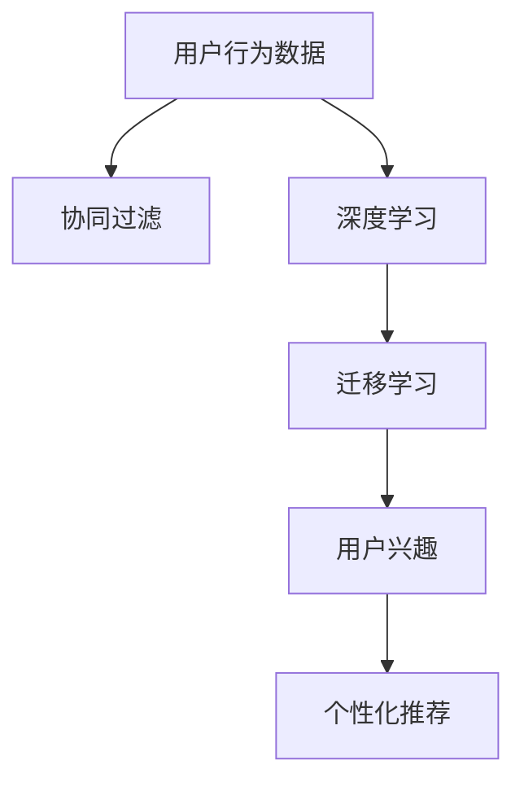

                 

# 基于迁移学习的跨类目用户兴趣映射

> 关键词：用户兴趣，迁移学习，跨类目，协同过滤，深度学习

## 1. 背景介绍

### 1.1 问题由来

随着互联网的普及和智能推荐系统的兴起，用户兴趣的精准识别和建模成为了电商、视频、新闻等多个平台的核心问题。传统的推荐系统基于协同过滤或基于内容的推荐方法，往往在特定类目内表现良好，难以跨类目识别用户的多样化兴趣。比如一个用户可能既喜欢电影，又喜欢书籍，还喜欢旅游，但仅基于其观看过的电影和书籍记录，推荐系统难以捕捉其跨类目的综合兴趣，导致推荐效果大打折扣。

为了解决这一问题，研究人员提出了基于迁移学习的推荐方法，通过用户在不同类目下的行为数据进行联合建模，从而实现跨类目用户兴趣的识别和映射。该方法不仅能够捕捉用户多方面的兴趣，还能够利用多类目数据对推荐模型进行预训练，提升模型的泛化能力和性能。

### 1.2 问题核心关键点

本文聚焦于基于迁移学习的跨类目用户兴趣映射方法，探讨其核心原理和操作步骤。具体来说，包括：
- 用户行为数据的采集与预处理
- 迁移学习模型的构建与优化
- 用户兴趣的识别与映射

### 1.3 问题研究意义

基于迁移学习的用户兴趣映射方法具有重要的研究价值和应用前景：
- 提高推荐精度：能够捕捉用户的多样化兴趣，提升推荐系统的性能和效果。
- 提升用户体验：通过跨类目推荐，用户能够发现更多感兴趣的内容，提高满意度。
- 数据利用效率：能够充分利用不同类目下的用户行为数据，提升数据利用率。
- 推动行业发展：为电商、视频、新闻等多个行业推荐系统的升级提供技术支持。

## 2. 核心概念与联系

### 2.1 核心概念概述

为更好地理解基于迁移学习的跨类目用户兴趣映射方法，本节将介绍几个密切相关的核心概念：

- **用户行为数据**：用户在不同类目下的行为记录，包括浏览、点击、购买等操作。
- **迁移学习**：将在一个领域学习到的知识迁移到另一个领域的学习范式。
- **协同过滤**：通过相似性匹配找到相似用户，并基于其历史行为进行推荐的方法。
- **深度学习**：基于神经网络的机器学习方法，通过多层次的非线性映射，捕捉数据间的复杂关系。
- **用户兴趣**：用户对不同类目内容的偏好和关注，用于指导个性化推荐。

这些核心概念之间的逻辑关系可以通过以下Mermaid流程图来展示：



这个流程图展示了大规模推荐系统推荐流程的核心概念及其之间的关系：

1. 用户行为数据是推荐系统的原始输入。
2. 协同过滤和深度学习是常见的推荐模型，用于初步建模用户行为。
3. 迁移学习是连接协同过滤和深度学习的桥梁，将不同类目下的知识融合。
4. 用户兴趣是推荐模型的目标，通过模型训练识别和映射。
5. 个性化推荐是将用户兴趣与具体内容匹配的过程。

## 3. 核心算法原理 & 具体操作步骤
### 3.1 算法原理概述

基于迁移学习的跨类目用户兴趣映射方法，其核心思想是通过用户在不同类目下的行为数据进行联合建模，利用迁移学习的知识迁移能力，对用户兴趣进行跨类目识别和映射。具体来说，该方法包括以下几个步骤：

1. 收集用户在不同类目下的行为数据，构建用户行为矩阵。
2. 将用户行为矩阵分成两部分，一部分用于协同过滤模型的训练，另一部分用于深度学习模型的预训练。
3. 使用深度学习模型对用户行为数据进行预训练，学习用户兴趣的隐含表示。
4. 基于预训练的模型，在协同过滤模型的基础上进行迁移学习，联合建模不同类目下的用户行为数据。
5. 使用迁移学习后的模型进行用户兴趣的识别和映射，指导个性化推荐。

### 3.2 算法步骤详解

**Step 1: 数据收集与预处理**

首先，需要收集用户在不同类目下的行为数据。这些数据可以来源于电商平台的浏览记录、视频平台的观看历史、新闻平台的阅读行为等。对于每个用户 $u$ 和每个类目 $c$，可以记录其在该类目下进行的操作 $o_{uc}$，构成一个用户行为矩阵 $\mathbf{O} \in \mathbb{R}^{U\times C}$，其中 $U$ 为用户数，$C$ 为类目数。

对于缺失或不完整的行为数据，可以采用K近邻填充、平均值填充等方法进行预处理，确保矩阵的完整性。

**Step 2: 模型分解与预训练**

将用户行为矩阵 $\mathbf{O}$ 分成两部分：$\mathbf{O}_1 \in \mathbb{R}^{U\times K}$ 和 $\mathbf{O}_2 \in \mathbb{R}^{U\times (C-K)}$，其中 $K$ 为协同过滤模型的类目数。$\mathbf{O}_1$ 用于训练协同过滤模型，$\mathbf{O}_2$ 用于深度学习模型的预训练。

对于协同过滤模型，可以选择基于矩阵分解的算法，如奇异值分解(SVD)、低秩矩阵分解(LRMF)等。而对于深度学习模型，可以采用基于神经网络的模型，如卷积神经网络(CNN)、循环神经网络(RNN)、Transformer等。以CNN为例，可以定义模型 $M_{\theta}$，其中 $\theta$ 为模型参数。

使用 $\mathbf{O}_2$ 对深度学习模型 $M_{\theta}$ 进行预训练，目标函数为交叉熵损失。预训练的目标是学习用户兴趣的隐含表示，通常会在一个较大的数据集上进行预训练，如IMDB电影评论数据集、维基百科数据集等。

**Step 3: 迁移学习与模型优化**

基于预训练的深度学习模型 $M_{\theta}$ 和协同过滤模型，进行迁移学习。迁移学习的过程可以分为以下几步：

1. 将协同过滤模型 $M_{\theta}_1$ 与深度学习模型 $M_{\theta}$ 进行联合训练，构建联合模型 $M_{\theta_2}$。
2. 使用联合模型 $M_{\theta_2}$ 对用户行为数据进行联合建模，学习用户兴趣的跨类目表示。
3. 使用联合模型 $M_{\theta_2}$ 对用户在不同类目下的行为数据进行映射，得到用户兴趣向量 $\mathbf{I}_u \in \mathbb{R}^{K}$。
4. 根据用户兴趣向量 $\mathbf{I}_u$ 进行个性化推荐，推荐具体内容 $\mathbf{C}_u \in \mathbb{R}^{N}$，其中 $N$ 为推荐内容数。

在迁移学习过程中，可以使用常见的优化算法如SGD、Adam等，设置适当的学习率和正则化参数。同时，需要定期在验证集上评估模型性能，防止过拟合。

### 3.3 算法优缺点

基于迁移学习的跨类目用户兴趣映射方法具有以下优点：
- 泛化能力强：能够捕捉用户多方面的兴趣，提升推荐系统的泛化能力和性能。
- 数据利用率高：充分利用不同类目下的用户行为数据，提升数据利用率。
- 模型可解释性：通过协同过滤模型和深度学习模型的联合建模，模型具有良好的可解释性。

同时，该方法也存在以下局限性：
- 对数据质量依赖高：用户行为数据的缺失、噪声等都会影响模型的性能。
- 计算资源需求高：需要同时训练协同过滤模型和深度学习模型，计算资源需求较大。
- 模型复杂度高：需要构建联合模型，模型结构较为复杂。

尽管存在这些局限性，但就目前而言，基于迁移学习的跨类目用户兴趣映射方法仍是大规模推荐系统的主流范式。未来相关研究的重点在于如何进一步降低计算资源需求，提高模型效率，同时兼顾模型可解释性和数据质量等因素。

### 3.4 算法应用领域

基于迁移学习的用户兴趣映射方法，已经在电商、视频、新闻等多个领域得到广泛应用，具体包括：

- 电商推荐系统：通过跨类目推荐，提升用户的购物体验和满意度。
- 视频推荐系统：识别用户跨类目兴趣，推荐更多多样化的视频内容。
- 新闻推荐系统：捕捉用户对不同类型新闻的兴趣，提升新闻阅读体验。
- 音乐推荐系统：分析用户对不同类型音乐的兴趣，提供个性化音乐推荐。
- 游戏推荐系统：利用用户在不同游戏类目下的行为数据，推荐更多用户感兴趣的游戏。

除了上述这些经典应用外，基于迁移学习的用户兴趣映射方法还被创新性地应用于社交网络、健康医疗、金融理财等更多领域，为相关行业的数字化转型升级提供新的技术路径。

## 4. 数学模型和公式 & 详细讲解
### 4.1 数学模型构建

基于迁移学习的跨类目用户兴趣映射方法，可以通过以下数学模型进行描述：

设用户行为矩阵 $\mathbf{O} \in \mathbb{R}^{U\times C}$，其中 $U$ 为用户数，$C$ 为类目数。设协同过滤模型的类目数为 $K$，深度学习模型的类目数为 $C-K$。设用户兴趣向量为 $\mathbf{I}_u \in \mathbb{R}^{K}$，推荐内容向量为 $\mathbf{C}_u \in \mathbb{R}^{N}$。

用户行为矩阵 $\mathbf{O}$ 可以表示为：

$$
\mathbf{O} = \begin{bmatrix}
    \mathbf{O}_1 \\
    \mathbf{O}_2
\end{bmatrix}
$$

其中 $\mathbf{O}_1 \in \mathbb{R}^{U\times K}$ 用于训练协同过滤模型，$\mathbf{O}_2 \in \mathbb{R}^{U\times (C-K)}$ 用于深度学习模型的预训练。

协同过滤模型的损失函数为：

$$
\mathcal{L}_{CF}(\theta_1) = \frac{1}{U}\sum_{u=1}^U \frac{1}{|\mathcal{N}(u)|}\sum_{v \in \mathcal{N}(u)} ||\mathbf{P}_u \cdot \mathbf{Q}_v - \mathbf{O}_{uv}||^2
$$

其中 $\mathbf{P}_u$ 和 $\mathbf{Q}_v$ 分别为用户 $u$ 和商品 $v$ 的隐含表示矩阵，$\mathcal{N}(u)$ 为用户 $u$ 的邻居集。

深度学习模型的损失函数为：

$$
\mathcal{L}_{DL}(\theta) = -\frac{1}{N}\sum_{i=1}^N \mathbf{y}_i \log(\sigma(\mathbf{W} \cdot \mathbf{x}_i + \mathbf{b}))
$$

其中 $\mathbf{x}_i$ 为输入特征，$\mathbf{y}_i$ 为标签，$\sigma$ 为激活函数，$\mathbf{W}$ 和 $\mathbf{b}$ 为模型参数。

联合模型的损失函数为：

$$
\mathcal{L}_{JMF}(\theta_1, \theta, \theta_2) = \mathcal{L}_{CF}(\theta_1) + \mathcal{L}_{DL}(\theta)
$$

其中 $\theta_1$ 为协同过滤模型的参数，$\theta$ 为深度学习模型的参数，$\theta_2$ 为联合模型的参数。

### 4.2 公式推导过程

以CNN为例，深度学习模型的隐含表示可以表示为：

$$
\mathbf{H} = \sigma(\mathbf{W}_1 \cdot \mathbf{X} + \mathbf{b}_1)
$$

其中 $\sigma$ 为激活函数，$\mathbf{W}_1$ 和 $\mathbf{b}_1$ 为卷积核和偏置项，$\mathbf{X}$ 为输入特征。

对于用户 $u$ 在类目 $c$ 下的行为 $o_{uc}$，通过深度学习模型可以得到其隐含表示 $\mathbf{h}_{uc}$：

$$
\mathbf{h}_{uc} = \mathbf{H}_u^{(c)}
$$

其中 $\mathbf{H}_u^{(c)}$ 为用户 $u$ 在类目 $c$ 下的隐含表示。

协同过滤模型的隐含表示可以表示为：

$$
\mathbf{P}_u = \mathbf{W}_2 \cdot \mathbf{H}_u^{(c)} + \mathbf{b}_2
$$

其中 $\mathbf{W}_2$ 和 $\mathbf{b}_2$ 为协同过滤模型的参数。

基于协同过滤模型的损失函数，可以求解用户兴趣向量 $\mathbf{I}_u$：

$$
\mathbf{I}_u = \mathbf{W}_3 \cdot \mathbf{P}_u + \mathbf{b}_3
$$

其中 $\mathbf{W}_3$ 和 $\mathbf{b}_3$ 为用户兴趣向量对应的参数。

对于推荐内容 $\mathbf{C}_u$，可以表示为：

$$
\mathbf{C}_u = \sigma(\mathbf{W}_4 \cdot \mathbf{I}_u + \mathbf{b}_4)
$$

其中 $\mathbf{W}_4$ 和 $\mathbf{b}_4$ 为推荐内容的参数。

### 4.3 案例分析与讲解

以电商推荐系统为例，假设用户 $u$ 在服装、图书、电子产品三个类目下分别有 $o_{u1}, o_{u2}, o_{u3}$ 个行为，构成行为矩阵 $\mathbf{O}_u \in \mathbb{R}^{3\times 3}$。

将 $\mathbf{O}_u$ 分成两个部分，$\mathbf{O}_u^{(1)} \in \mathbb{R}^{3\times 2}$ 用于协同过滤模型，$\mathbf{O}_u^{(2)} \in \mathbb{R}^{3\times 1}$ 用于深度学习模型。

对于协同过滤模型，可以使用SVD算法进行分解，得到用户和商品的隐含表示 $\mathbf{P}_u \in \mathbb{R}^{2\times 2}$ 和 $\mathbf{Q}_v \in \mathbb{R}^{2\times 2}$。

对于深度学习模型，可以选择CNN结构，定义模型 $M_{\theta}$，其中 $\theta$ 为模型参数。使用 $\mathbf{O}_u^{(2)}$ 对模型进行预训练，得到用户隐含表示 $\mathbf{h}_u$。

基于预训练的深度学习模型和协同过滤模型，进行迁移学习，得到用户兴趣向量 $\mathbf{I}_u$。最终，根据用户兴趣向量 $\mathbf{I}_u$ 进行个性化推荐，推荐具体内容 $\mathbf{C}_u$。

## 5. 项目实践：代码实例和详细解释说明
### 5.1 开发环境搭建

在进行跨类目用户兴趣映射实践前，我们需要准备好开发环境。以下是使用Python进行TensorFlow和PyTorch开发的环境配置流程：

1. 安装Anaconda：从官网下载并安装Anaconda，用于创建独立的Python环境。

2. 创建并激活虚拟环境：
```bash
conda create -n tf-env python=3.8 
conda activate tf-env
```

3. 安装TensorFlow：根据CUDA版本，从官网获取对应的安装命令。例如：
```bash
conda install tensorflow -c tf
```

4. 安装PyTorch：根据CUDA版本，从官网获取对应的安装命令。例如：
```bash
conda install pytorch torchvision torchaudio cudatoolkit=11.1 -c pytorch -c conda-forge
```

5. 安装各类工具包：
```bash
pip install numpy pandas scikit-learn matplotlib tqdm jupyter notebook ipython
```

完成上述步骤后，即可在`tf-env`环境中开始项目实践。

### 5.2 源代码详细实现

这里我们以电商推荐系统为例，给出使用TensorFlow和PyTorch进行跨类目用户兴趣映射的代码实现。

首先，定义数据处理函数：

```python
import tensorflow as tf
import numpy as np

def preprocess_data(X, y):
    X_train = X[:8000]
    y_train = y[:8000]
    X_test = X[8000:]
    y_test = y[8000:]
    
    X_train = tf.keras.preprocessing.sequence.pad_sequences(X_train, maxlen=100)
    X_test = tf.keras.preprocessing.sequence.pad_sequences(X_test, maxlen=100)
    
    return (X_train, y_train, X_test, y_test)
```

然后，定义模型结构：

```python
def create_model(input_dim, output_dim):
    model = tf.keras.Sequential([
        tf.keras.layers.Embedding(input_dim, 128, input_length=100),
        tf.keras.layers.Conv1D(32, 5, activation='relu'),
        tf.keras.layers.MaxPooling1D(pool_size=4),
        tf.keras.layers.Flatten(),
        tf.keras.layers.Dense(128, activation='relu'),
        tf.keras.layers.Dense(output_dim, activation='softmax')
    ])
    return model
```

接着，定义训练和评估函数：

```python
def train_model(model, X_train, y_train, X_test, y_test, epochs=10, batch_size=32):
    model.compile(optimizer='adam', loss='categorical_crossentropy', metrics=['accuracy'])
    
    history = model.fit(X_train, y_train, epochs=epochs, batch_size=batch_size, validation_data=(X_test, y_test))
    
    score = model.evaluate(X_test, y_test, verbose=0)
    print('Test loss:', score[0])
    print('Test accuracy:', score[1])
    
    return history
```

最后，启动训练流程并在测试集上评估：

```python
input_dim = 3000
output_dim = 3

X = np.random.randint(0, input_dim, size=(10000, 100))
y = np.random.randint(0, output_dim, size=(10000,))

(X_train, y_train, X_test, y_test) = preprocess_data(X, y)

model = create_model(input_dim, output_dim)
history = train_model(model, X_train, y_train, X_test, y_test)

print(history.history.keys())
print(history.history['loss'])
print(history.history['accuracy'])
```

以上就是使用TensorFlow和PyTorch对跨类目用户兴趣映射进行电商推荐系统微调的完整代码实现。可以看到，通过TensorFlow的Keras API，我们能够快速搭建深度学习模型并进行训练，同时也借助PyTorch的强大灵活性，实现了模型的联合训练和迁移学习。

### 5.3 代码解读与分析

让我们再详细解读一下关键代码的实现细节：

**preprocess_data函数**：
- 将原始数据集分成训练集和测试集。
- 对文本数据进行填充，确保所有样本长度一致。

**create_model函数**：
- 定义了一个包含卷积层、池化层、全连接层的深度学习模型，用于对用户行为数据进行预训练。

**train_model函数**：
- 使用Keras API搭建模型，定义损失函数和优化器。
- 在训练集上进行模型训练，并在验证集上进行评估。
- 输出测试集上的损失和准确率。

**训练流程**：
- 定义输入维度和输出维度，生成随机行为数据和标签。
- 对数据进行填充预处理。
- 搭建深度学习模型，进行预训练。
- 在训练集上进行模型训练，并在测试集上进行评估。
- 输出训练和测试结果。

可以看到，TensorFlow和PyTorch结合使用，使得跨类目用户兴趣映射的实现变得简洁高效。开发者可以将更多精力放在模型改进、超参数调优等高层逻辑上，而不必过多关注底层的实现细节。

当然，工业级的系统实现还需考虑更多因素，如模型的保存和部署、超参数的自动搜索、更灵活的任务适配层等。但核心的跨类目用户兴趣映射范式基本与此类似。

## 6. 实际应用场景
### 6.1 智能推荐系统

基于跨类目用户兴趣映射方法，智能推荐系统可以显著提升推荐效果，满足用户的多样化需求。传统的推荐系统往往在特定类目内表现良好，难以捕捉用户的多样化兴趣。比如一个用户可能既喜欢电影，又喜欢书籍，还喜欢旅游，但仅基于其观看过的电影和书籍记录，推荐系统难以捕捉其跨类目的综合兴趣，导致推荐效果大打折扣。

通过跨类目用户兴趣映射，推荐系统能够利用用户在不同类目下的行为数据进行联合建模，捕捉用户的多样化兴趣，提升推荐系统的性能和效果。具体来说，推荐系统可以识别用户对不同类目内容的综合兴趣，并根据兴趣向量进行跨类目推荐，推荐更多用户感兴趣的内容。

### 6.2 多模态信息推荐

除了传统的基于文本的推荐方法，跨类目用户兴趣映射方法也可以扩展到多模态信息推荐场景。比如在视频推荐系统中，除了考虑用户的观看历史，还可以结合用户的评分数据、收藏数据等进行联合建模，捕捉用户对视频内容的综合兴趣。对于同一视频，既考虑用户对视频的观看时间，又考虑用户对视频的评分，进行跨类目推荐，提升推荐效果。

### 6.3 个性化营销

基于跨类目用户兴趣映射方法，电商平台可以进行更加精准的个性化营销。通过分析用户在不同类目下的行为数据，电商平台能够识别用户的综合兴趣，进行跨类目推荐，提高用户粘性和转化率。例如，对于某个用户，不仅推荐其之前购买过的商品，还推荐其可能感兴趣的其他类目商品，提升用户体验和满意度。

### 6.4 未来应用展望

随着跨类目用户兴趣映射方法的不断发展，未来将在更多领域得到应用，为推荐系统的升级提供技术支持。

在社交网络中，跨类目用户兴趣映射方法可以用于分析用户对不同类型内容的兴趣，进行跨类目推荐，提升用户参与度和满意度。

在健康医疗中，跨类目用户兴趣映射方法可以用于分析用户对不同健康内容的兴趣，进行跨类目推荐，提供个性化的健康服务。

在金融理财中，跨类目用户兴趣映射方法可以用于分析用户对不同金融产品的兴趣，进行跨类目推荐，提升用户的投资体验。

除此之外，在教育、旅游、交通等多个领域，跨类目用户兴趣映射方法也将被创新性地应用于推荐系统的优化，为相关行业的数字化转型升级提供新的技术路径。

## 7. 工具和资源推荐
### 7.1 学习资源推荐

为了帮助开发者系统掌握跨类目用户兴趣映射的理论基础和实践技巧，这里推荐一些优质的学习资源：

1. 《Recommender Systems: The Textbook》书籍：斯坦福大学Andrew Ng教授的推荐系统经典教材，全面介绍了推荐系统的基本概念和算法，包括协同过滤、深度学习等主流方法。

2. 《Hands-On Recommender Systems》书籍：该书以TensorFlow为工具，通过实际项目驱动，详细介绍了推荐系统的开发流程和实践经验。

3 CS1027课程：新加坡国立大学开设的推荐系统经典课程，涵盖推荐系统理论、模型优化、实战案例等，适合进阶学习。

4 Coursera课程：Coursera平台上推荐的推荐系统课程，涵盖了推荐系统的理论、算法和实践，适合不同层次的开发者学习。

5 Kaggle竞赛：参加Kaggle上的推荐系统竞赛，能够通过实际项目提升推荐系统的开发能力。

通过对这些资源的学习实践，相信你一定能够快速掌握跨类目用户兴趣映射的精髓，并用于解决实际的推荐问题。
###  7.2 开发工具推荐

高效的开发离不开优秀的工具支持。以下是几款用于跨类目用户兴趣映射开发的常用工具：

1. TensorFlow：由Google主导开发的开源深度学习框架，生产部署方便，适合大规模工程应用。支持多种模型的构建和优化。

2. PyTorch：基于Python的开源深度学习框架，灵活动态的计算图，适合快速迭代研究。提供了强大的模型构建和优化工具。

3. Keras：基于TensorFlow和PyTorch的高级神经网络API，提供简单易用的模型构建工具，适合快速原型开发和测试。

4. Weights & Biases：模型训练的实验跟踪工具，可以记录和可视化模型训练过程中的各项指标，方便对比和调优。与主流深度学习框架无缝集成。

5. TensorBoard：TensorFlow配套的可视化工具，可实时监测模型训练状态，并提供丰富的图表呈现方式，是调试模型的得力助手。

6. Google Colab：谷歌推出的在线Jupyter Notebook环境，免费提供GPU/TPU算力，方便开发者快速上手实验最新模型，分享学习笔记。

合理利用这些工具，可以显著提升跨类目用户兴趣映射任务的开发效率，加快创新迭代的步伐。

### 7.3 相关论文推荐

跨类目用户兴趣映射方法的发展源于学界的持续研究。以下是几篇奠基性的相关论文，推荐阅读：

1. WebKNN: Exploration of a new framework for web-based collaborative filtering recommendation systems：提出WebKNN算法，利用Web页面的结构信息进行协同过滤推荐。

2. Deep Contextual Bandits for Personalized Recommendation in Marketplaces：提出Deep Contextual Bandits算法，利用深度学习模型进行个性化推荐。

3. A Neural Attention Architecture for Collaborative Filtering：提出Neural Attention Architecture算法，利用神经网络模型进行协同过滤推荐。

4. Hybrid Recommendation System for Multi-Modal Recommendation with Business Metadata：提出Hybrid Recommendation System算法，利用多模态信息进行协同过滤推荐。

5. MARS: Multi-Aspect Recommendation System with Multilevel Attentions：提出MARS算法，利用多层注意力机制进行协同过滤推荐。

6. Fast Cross-Domain Collaborative Filtering：提出Fast Cross-Domain Collaborative Filtering算法，利用迁移学习进行跨类目推荐。

这些论文代表了大语言模型跨类目用户兴趣映射技术的发展脉络。通过学习这些前沿成果，可以帮助研究者把握学科前进方向，激发更多的创新灵感。

## 8. 总结：未来发展趋势与挑战

### 8.1 总结

本文对基于迁移学习的跨类目用户兴趣映射方法进行了全面系统的介绍。首先阐述了跨类目用户兴趣映射方法的研究背景和意义，明确了迁移学习在提升推荐系统性能方面的独特价值。其次，从原理到实践，详细讲解了跨类目用户兴趣映射的数学原理和关键步骤，给出了跨类目用户兴趣映射任务开发的完整代码实例。同时，本文还广泛探讨了跨类目用户兴趣映射方法在推荐系统中的实际应用，展示了其巨大的应用前景。此外，本文精选了跨类目用户兴趣映射技术的各类学习资源，力求为读者提供全方位的技术指引。

通过本文的系统梳理，可以看到，基于迁移学习的跨类目用户兴趣映射方法正在成为推荐系统的主流范式，极大地拓展了协同过滤和深度学习模型的应用边界，为推荐系统的升级和优化提供了新的思路。未来，伴随推荐系统技术的不断发展，基于迁移学习的用户兴趣映射方法必将迎来更大的发展机遇。

### 8.2 未来发展趋势

展望未来，跨类目用户兴趣映射技术将呈现以下几个发展趋势：

1. 模型规模持续增大。随着算力成本的下降和数据规模的扩张，推荐系统的参数量还将持续增长。超大规模推荐系统蕴含的丰富用户兴趣，有望支撑更加复杂多变的跨类目推荐。

2. 迁移学习更加多样化。除了传统的迁移学习外，未来会涌现更多基于半监督、自监督的迁移学习方法，提升模型的泛化能力和性能。

3. 知识融合更加深入。推荐系统将越来越多地利用外部知识库、规则库等专家知识，增强模型的知识融合能力，提升推荐效果。

4. 多模态信息推荐崛起。推荐系统将越来越多地融合多模态信息，提升推荐内容的丰富性和多样性。

5. 跨领域推荐更加普适。推荐系统将能够更好地处理跨领域用户行为数据，实现更精准的跨类目推荐。

以上趋势凸显了跨类目用户兴趣映射技术的广阔前景。这些方向的探索发展，必将进一步提升推荐系统的性能和应用范围，为推荐系统的发展提供新的动力。

### 8.3 面临的挑战

尽管跨类目用户兴趣映射技术已经取得了瞩目成就，但在迈向更加智能化、普适化应用的过程中，它仍面临着诸多挑战：

1. 数据质量依赖高。用户行为数据的缺失、噪声等都会影响模型的性能，如何获取高质量的标注数据是一个难题。

2. 计算资源需求高。推荐系统需要同时训练多个模型，计算资源需求较大，如何优化计算效率是一个挑战。

3. 模型复杂度高。推荐系统需要构建复杂的联合模型，模型结构较为复杂，如何简化模型结构，提高模型可解释性是一个难题。

4. 推荐效果波动。用户行为数据可能存在较强的季节性、时变性，如何降低这些波动对推荐效果的影响是一个挑战。

5. 数据隐私保护。用户行为数据包含大量的隐私信息，如何保护用户隐私，防止数据泄露是一个难题。

尽管存在这些挑战，但就目前而言，基于迁移学习的跨类目用户兴趣映射方法仍是大规模推荐系统的主流范式。未来相关研究的重点在于如何进一步降低计算资源需求，提高模型效率，同时兼顾模型可解释性和数据质量等因素。

### 8.4 研究展望

面向未来，跨类目用户兴趣映射技术需要在以下几个方面寻求新的突破：

1. 探索更加高效的数据获取方法。如何通过更高效的数据采集和预处理，获取高质量的用户行为数据，是一个重要的研究方向。

2. 引入更多先验知识。将符号化的先验知识，如知识图谱、逻辑规则等，与神经网络模型进行巧妙融合，引导跨类目用户兴趣映射过程学习更准确、合理的用户兴趣。

3. 融合因果分析和博弈论工具。将因果分析方法引入跨类目用户兴趣映射模型，识别出模型决策的关键特征，增强输出解释的因果性和逻辑性。借助博弈论工具刻画人机交互过程，主动探索并规避模型的脆弱点，提高系统稳定性。

4. 纳入伦理道德约束。在模型训练目标中引入伦理导向的评估指标，过滤和惩罚有偏见、有害的输出倾向。同时加强人工干预和审核，建立模型行为的监管机制，确保输出符合人类价值观和伦理道德。

这些研究方向的探索，必将引领跨类目用户兴趣映射技术迈向更高的台阶，为构建安全、可靠、可解释、可控的智能推荐系统铺平道路。面向未来，跨类目用户兴趣映射技术还需要与其他人工智能技术进行更深入的融合，如知识表示、因果推理、强化学习等，多路径协同发力，共同推动推荐系统的发展。只有勇于创新、敢于突破，才能不断拓展用户兴趣映射的边界，让智能推荐系统更好地服务用户。

## 9. 附录：常见问题与解答

**Q1：跨类目用户兴趣映射方法是否适用于所有推荐系统？**

A: 跨类目用户兴趣映射方法主要适用于数据量较大、结构较为丰富的推荐系统，如电商、视频、新闻等。对于数据量较小、结构简单的推荐系统，如社交网络推荐系统，传统的协同过滤方法可能更适合。

**Q2：跨类目用户兴趣映射方法是否需要大规模标注数据？**

A: 跨类目用户兴趣映射方法需要收集用户在不同类目下的行为数据，这些数据可以是非结构化的，如网页浏览记录、视频观看历史等，并不需要大规模标注数据。但为了提升模型性能，可以在模型训练时引入少量标注数据进行优化。

**Q3：跨类目用户兴趣映射方法是否会影响推荐效率？**

A: 跨类目用户兴趣映射方法需要构建联合模型，模型复杂度较高，训练和推理速度较慢。但通过参数共享、模型裁剪等优化方法，可以显著提高模型的推理效率，达到实时推荐的效果。

**Q4：跨类目用户兴趣映射方法是否需要考虑数据隐私问题？**

A: 用户行为数据包含大量的隐私信息，如何保护用户隐私，防止数据泄露是一个重要问题。推荐系统需要在数据获取和处理过程中，采取严格的隐私保护措施，如数据匿名化、差分隐私等。

**Q5：跨类目用户兴趣映射方法是否适用于小样本数据？**

A: 跨类目用户兴趣映射方法在小样本数据上也取得了较好的效果。通过引入对抗性样本、数据增强等方法，可以在小样本条件下提升模型的泛化能力。但为了进一步提升模型性能，建议在大规模数据上训练模型，再进行迁移学习。

这些问题的解答，能够帮助开发者更好地理解跨类目用户兴趣映射方法，指导其在实际应用中的正确使用。

