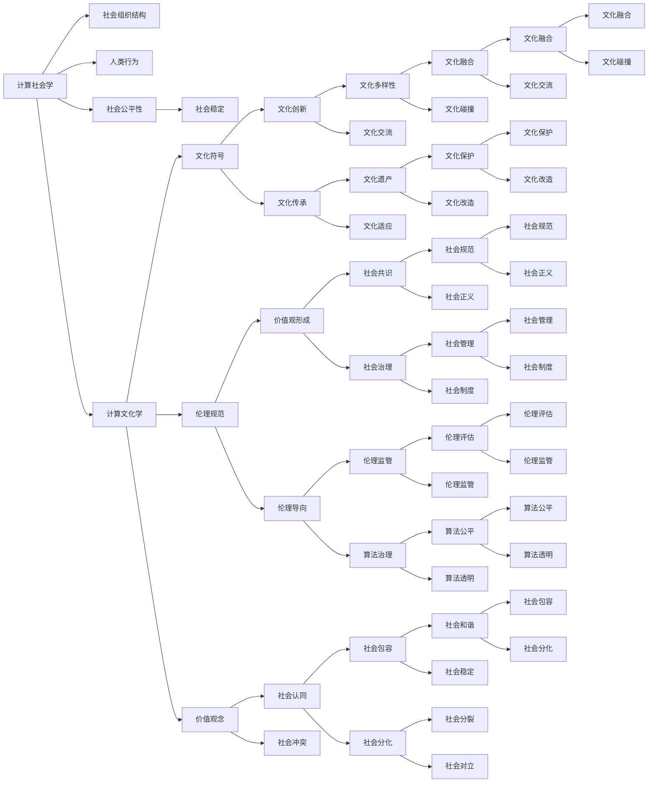

                 

# 塑造未来社会：人类计算的深远意义

> 关键词：计算社会学, 计算文化学, 数字公民, 社会算法, 算法治理, 人类计算, 计算伦理学

## 1. 背景介绍

### 1.1 问题由来
随着信息技术的飞速发展，计算已经成为现代社会不可或缺的重要组成部分。从传统的机械计算到今天的人工智能，计算技术的进步正在以几何级数的速度改变着我们的生产生活方式。然而，这种变革带来的不仅是效率和便利，也引发了诸多社会问题。从数字鸿沟到信息过载，从隐私泄露到算法偏见，计算技术的进步在为我们带来诸多便利的同时，也带来了深刻的伦理挑战。

在这样一个背景下，计算社会学和计算文化学的兴起成为了学术界和产业界关注的焦点。它们不仅关注计算技术如何影响社会结构，还关注计算如何塑造和改变我们的文化、伦理和行为模式。计算社会学和计算文化学强调，计算不仅仅是一种技术手段，更是一种社会力量，它正在塑造着我们的未来社会。

本文将从计算社会学和计算文化学的视角，探讨计算对人类社会的影响，以及人类如何计算地掌握未来社会的命运。

### 1.2 问题核心关键点
本文将聚焦于以下几个关键问题：

- 计算社会学和计算文化学的定义、范围和研究方法
- 计算对社会结构、文化、伦理和行为模式的影响
- 计算技术在公共治理、健康、教育等领域的应用及其影响
- 计算伦理和算法治理的重要性和实现路径
- 计算未来社会的挑战和机遇

这些问题构成了我们理解计算对现代社会深远影响的基础，也是本文展开讨论的核心。

## 2. 核心概念与联系

### 2.1 核心概念概述

计算社会学和计算文化学是两个紧密相关的概念，它们共同探讨计算技术如何影响社会结构和行为模式。

**计算社会学(Sociology of Computing)**：主要关注计算技术如何改变社会的组织结构和人类行为，研究计算技术在社会中的广泛应用及其对社会稳定性和公平性的影响。

**计算文化学(Computational Cultural Studies)**：主要关注计算技术如何塑造文化符号、伦理规范和价值观念，研究计算技术对文化创新和价值观形成的影响。

这两个领域的研究范围涵盖了从技术发展、社会变革到文化创新等多个层面，它们的交集在于计算技术对人类社会的深远影响。

### 2.2 核心概念原理和架构的 Mermaid 流程图



这个图展示了计算社会学和计算文化学的主要概念和它们之间的联系。计算社会学关注计算对社会结构、公平性、稳定性和行为模式的影响，而计算文化学则关注计算对文化符号、伦理规范、价值观、文化创新和价值观形成的影响。两者之间的交互则体现在计算如何影响社会的公平性和正义，以及如何塑造社会的伦理规范和价值观。

## 3. 核心算法原理 & 具体操作步骤

### 3.1 算法原理概述

计算社会学和计算文化学的研究离不开算法。在这里，算法不仅仅是一种技术手段，更是一种社会力量，它通过计算和数据分析，揭示社会现象背后的规律，指导社会政策的制定和调整。

从社会结构分析到行为模式预测，从文化符号生成到伦理规范评估，算法在其中扮演着至关重要的角色。这些算法的核心原理包括：

- 数据驱动：通过收集和分析海量社会数据，揭示社会现象的规律和趋势。
- 模型学习：使用机器学习、深度学习等算法，建立社会现象的数学模型。
- 伦理约束：在算法设计中引入伦理导向，避免算法偏见和歧视。

### 3.2 算法步骤详解

计算社会学和计算文化学的算法设计一般包括以下几个步骤：

**Step 1: 数据收集与处理**
- 收集与研究对象相关的社会数据，包括人口统计、经济活动、社会事件等。
- 对数据进行清洗、去噪和标准化处理，保证数据的质量和一致性。

**Step 2: 数据建模与训练**
- 根据研究需求，选择合适的算法模型，如回归模型、分类模型、聚类模型等。
- 使用训练数据集对模型进行训练，优化模型参数，确保模型的准确性和泛化能力。

**Step 3: 模型评估与验证**
- 在验证数据集上对模型进行评估，衡量模型的预测准确性和稳定性。
- 根据评估结果调整模型参数，确保模型的泛化能力。

**Step 4: 应用与优化**
- 将模型应用到实际社会问题中，如社会治理、健康、教育等领域。
- 根据应用效果进行模型优化，提升模型的实用性和可靠性。

### 3.3 算法优缺点

计算社会学和计算文化学的算法设计具有以下优点：

- 数据驱动：通过大数据分析揭示社会现象的规律和趋势，提供客观准确的决策依据。
- 模型学习：使用先进算法，如深度学习，提升模型的准确性和泛化能力。
- 应用广泛：可以应用于社会治理、公共健康、教育等多个领域，提升社会治理的效率和公平性。

同时，这些算法也存在一些缺点：

- 数据依赖：算法的效果依赖于数据的完整性和质量，数据缺失或不准确可能导致模型失效。
- 算法偏见：如果训练数据存在偏见，模型也会继承这些偏见，导致算法歧视。
- 复杂度高：复杂模型可能需要大量的计算资源和数据，难以在资源有限的环境中部署。

### 3.4 算法应用领域

计算社会学和计算文化学的算法设计在多个领域都有广泛应用：

- **社会治理**：通过大数据分析，揭示社会问题背后的规律，为政策制定提供科学依据。如社会稳定预警、公共危机应对等。
- **公共健康**：通过计算模型，预测疾病传播趋势，指导公共卫生政策的制定和调整。如流行病预测、疫情控制等。
- **教育**：通过计算分析，了解学生的学习行为和认知特点，优化教学方法和教育资源配置。如个性化推荐、智能评估等。
- **文化创新**：通过计算模型，生成新的文化符号和价值观念，推动文化创新和发展。如文化大数据分析、文化创意生成等。

## 4. 数学模型和公式 & 详细讲解 & 举例说明

### 4.1 数学模型构建

计算社会学和计算文化学的数学模型构建通常包括以下几个方面：

- **数据分布假设**：假设数据遵循一定的概率分布，如正态分布、泊松分布等。
- **模型参数优化**：通过最小化损失函数，优化模型参数，确保模型的准确性和泛化能力。
- **模型验证与评估**：使用交叉验证等技术，评估模型的性能和泛化能力。

### 4.2 公式推导过程

以下是一个简单的回归模型公式推导过程：

假设我们有一组社会数据集 $(x_i,y_i)$，其中 $x_i$ 表示独立变量，$y_i$ 表示依赖变量。我们的目标是建立一个回归模型 $y = f(x)$，通过最小化预测误差 $e = y - f(x)$ 来优化模型参数 $\theta$。

根据最小二乘法的原理，我们有：

$$
\theta = \arg\min_{\theta} \sum_{i=1}^N (y_i - f(x_i,\theta))^2
$$

对于线性回归模型，我们有 $f(x) = \theta_0 + \theta_1 x_1 + \ldots + \theta_n x_n$，则上式可以进一步展开为：

$$
\theta = \arg\min_{\theta} \sum_{i=1}^N (y_i - \theta_0 - \theta_1 x_{1,i} - \ldots - \theta_n x_{n,i})^2
$$

通过求解上述最小二乘问题，可以得到最优的模型参数 $\theta$。

### 4.3 案例分析与讲解

以公共健康领域的流行病预测为例，我们如何利用计算社会学和计算文化学的算法进行建模？

首先，我们需要收集相关的社会数据，如人口统计、地理位置、医疗资源分布等。这些数据将被用于训练预测模型。

假设我们有一个简单的回归模型，用于预测某地区疫情的发生概率 $y$，其中 $x_1$ 表示人口密度，$x_2$ 表示医疗资源分布。我们的目标是建立模型 $y = f(x_1,x_2)$，通过最小化预测误差 $e = y - f(x_1,x_2)$ 来优化模型参数 $\theta$。

通过最小二乘法，我们可以得到最优的模型参数 $\theta$，然后将其应用于新的数据，预测疫情的发生概率。这样，我们就可以根据预测结果，制定相应的公共卫生政策，控制疫情的传播。

## 5. 项目实践：代码实例和详细解释说明

### 5.1 开发环境搭建

在进行计算社会学和计算文化学的项目实践前，我们需要准备好开发环境。以下是使用Python进行数据分析和机器学习的开发环境配置流程：

1. 安装Anaconda：从官网下载并安装Anaconda，用于创建独立的Python环境。

2. 创建并激活虚拟环境：
```bash
conda create -n ml-env python=3.8 
conda activate ml-env
```

3. 安装必要的Python库：
```bash
conda install numpy pandas matplotlib scikit-learn scikit-health statsmodels
```

4. 安装Jupyter Notebook：
```bash
pip install jupyterlab
```

完成上述步骤后，即可在`ml-env`环境中开始项目实践。

### 5.2 源代码详细实现

下面我们以公共健康领域的流行病预测为例，给出使用Python进行机器学习建模的代码实现。

```python
import numpy as np
import pandas as pd
from sklearn.linear_model import LinearRegression

# 准备数据
data = pd.read_csv('epidemic_data.csv')

# 数据预处理
X = data[['population', 'medical_resources']]
y = data['cases']
X = (X - X.mean()) / X.std()

# 训练模型
model = LinearRegression()
model.fit(X, y)

# 预测新数据
new_data = pd.read_csv('new_epidemic_data.csv')
new_data = (new_data - new_data.mean()) / new_data.std()
predictions = model.predict(new_data)
```

这个代码实现展示了如何使用Python和Scikit-learn库，进行线性回归模型的建立和预测。

### 5.3 代码解读与分析

让我们再详细解读一下关键代码的实现细节：

**数据预处理**：
- 首先，我们读取数据集，并进行标准化处理，确保数据的分布一致性。

**模型训练**：
- 使用线性回归模型，通过最小二乘法，训练模型参数。

**数据预测**：
- 对新的数据集进行标准化处理，并使用训练好的模型进行预测。

通过这个简单的代码实现，我们可以看到计算社会学和计算文化学的算法如何在实际项目中应用。

## 6. 实际应用场景

### 6.1 社会治理

计算社会学和计算文化学在社会治理中的应用广泛，以下是几个典型的应用场景：

- **社会稳定预警**：通过大数据分析，预测可能引发社会动荡的事件，提前采取措施进行干预。如社交媒体舆情分析、犯罪行为预测等。
- **公共危机应对**：通过计算模型，评估公共危机的影响范围和严重程度，指导应急资源的分配和调度。如自然灾害预警、突发事件应急响应等。
- **社会政策优化**：通过数据分析，揭示社会政策的效果和影响，指导政策的调整和优化。如教育政策、就业政策等。

### 6.2 公共健康

计算社会学和计算文化学在公共健康领域的应用同样重要，以下是几个典型的应用场景：

- **疾病预测与预防**：通过计算模型，预测疾病的传播趋势，指导公共卫生政策的制定和调整。如流感预测、疫情控制等。
- **健康管理与个性化医疗**：通过计算分析，了解个体的健康状况和行为模式，提供个性化的健康管理方案和医疗建议。如电子健康档案、个性化治疗方案等。

### 6.3 教育

计算社会学和计算文化学在教育领域的应用也正在逐渐展开，以下是几个典型的应用场景：

- **学生行为分析**：通过计算模型，分析学生的学习行为和认知特点，优化教学方法和教育资源配置。如个性化推荐、智能评估等。
- **教育资源配置**：通过数据分析，了解教育资源的分布和需求，优化教育资源的配置。如教育公平评估、教育政策优化等。

### 6.4 文化创新

计算社会学和计算文化学在文化创新领域的应用前景广阔，以下是几个典型的应用场景：

- **文化符号生成**：通过计算模型，生成新的文化符号和价值观念，推动文化创新和发展。如文化大数据分析、文化创意生成等。
- **文化传承与保护**：通过计算分析，保护和传承文化遗产，推动文化多样性和文化交流。如文化遗产数字化、文化传承教育等。

## 7. 工具和资源推荐

### 7.1 学习资源推荐

为了帮助开发者系统掌握计算社会学和计算文化学的理论基础和实践技巧，这里推荐一些优质的学习资源：

1. 《计算社会学》系列书籍：由计算社会学领域的知名学者撰写，全面介绍了计算社会学的基础理论、方法和应用案例。
2. 《计算文化学》系列书籍：由计算文化学领域的学者撰写，介绍了计算文化学的基本概念、方法和应用案例。
3. 《数据科学与计算社会科学》课程：斯坦福大学开设的课程，涵盖数据科学和计算社会科学的基本概念和实践技能。
4. 《计算伦理学》系列书籍：由计算伦理学领域的学者撰写，介绍了计算伦理学的基本概念、方法和应用案例。
5. 《社会算法》系列书籍：介绍了社会算法的基础理论、方法和应用案例，特别是如何利用算法优化社会治理。

通过对这些资源的学习实践，相信你一定能够快速掌握计算社会学和计算文化学的精髓，并用于解决实际的计算问题。

### 7.2 开发工具推荐

高效的开发离不开优秀的工具支持。以下是几款用于计算社会学和计算文化学开发的常用工具：

1. Jupyter Notebook：免费且功能强大的Python开发环境，支持代码块、图表和数学公式的嵌入，是进行数据分析和机器学习实践的最佳选择。
2. Python：高效且灵活的编程语言，拥有丰富的第三方库和框架，是进行数据分析和机器学习实践的首选。
3. Scikit-learn：基于Python的开源机器学习库，提供了丰富的算法实现和工具函数，是进行数据分析和机器学习实践的必备工具。
4. Pandas：基于Python的数据分析库，提供了高效的数据处理和分析工具，是进行数据分析和机器学习实践的必备工具。
5. Statsmodels：基于Python的统计分析库，提供了丰富的统计模型和工具函数，是进行数据分析和机器学习实践的必备工具。

合理利用这些工具，可以显著提升计算社会学和计算文化学的开发效率，加快创新迭代的步伐。

### 7.3 相关论文推荐

计算社会学和计算文化学的发展离不开学界的持续研究。以下是几篇奠基性的相关论文，推荐阅读：

1. 《计算社会学：数据科学与社会科学的融合》：介绍了计算社会学的基础理论、方法和应用案例。
2. 《计算文化学：文化符号与数据科学的融合》：介绍了计算文化学的基础理论、方法和应用案例。
3. 《数据科学与社会治理的融合》：介绍了数据科学在社会治理中的应用，提供了丰富的案例分析。
4. 《计算伦理学：伦理规范与数据科学的融合》：介绍了计算伦理学的基础理论、方法和应用案例。
5. 《社会算法与政策优化的融合》：介绍了社会算法的基础理论、方法和应用案例，特别是如何利用算法优化社会治理。

这些论文代表了大计算社会学和计算文化学的发展脉络。通过学习这些前沿成果，可以帮助研究者把握学科前进方向，激发更多的创新灵感。

## 8. 总结：未来发展趋势与挑战

### 8.1 总结

本文对计算社会学和计算文化学的研究背景和应用进行了全面系统的介绍。首先阐述了计算社会学和计算文化学的定义、范围和研究方法，明确了计算技术如何影响社会结构和行为模式。其次，从原理到实践，详细讲解了计算社会学和计算文化学的数学模型和算法步骤，给出了计算社会学和计算文化学的代码实现。同时，本文还探讨了计算社会学和计算文化学在社会治理、公共健康、教育、文化创新等多个领域的应用前景，展示了计算社会学和计算文化学的巨大潜力。此外，本文精选了计算社会学和计算文化学的学习资源和开发工具，力求为读者提供全方位的技术指引。

通过本文的系统梳理，可以看到，计算社会学和计算文化学正在成为研究计算技术对人类社会深远影响的重要范式，极大地拓展了计算技术的社会应用边界，催生了更多的落地场景。计算社会学和计算文化学的发展方向，将是未来计算技术演进的重要趋势，其影响深远，值得我们持续关注和深入研究。

### 8.2 未来发展趋势

展望未来，计算社会学和计算文化学的发展趋势将呈现出以下几个方向：

1. **数据驱动**：随着大数据技术的不断发展，计算社会学和计算文化学将更加依赖于数据驱动，通过大数据分析揭示社会现象的规律和趋势。
2. **算法创新**：新的算法模型和优化技术将继续推动计算社会学和计算文化学的进步，提高模型的准确性和泛化能力。
3. **伦理导向**：计算社会学和计算文化学将更加注重伦理导向，避免算法偏见和歧视，确保算法的公平性和透明性。
4. **跨学科融合**：计算社会学和计算文化学将与更多学科进行跨学科融合，推动计算技术的广泛应用和社会科学的发展。
5. **全球治理**：计算社会学和计算文化学将更多地关注全球治理，推动国际社会合作，解决全球性社会问题。

这些趋势将进一步推动计算社会学和计算文化学的进步，为计算技术在社会中的应用提供更广阔的想象空间。

### 8.3 面临的挑战

尽管计算社会学和计算文化学取得了一定的进展，但在迈向更加智能化、普适化应用的过程中，它们仍面临诸多挑战：

1. **数据隐私与安全**：计算社会学和计算文化学依赖于大量数据的收集和分析，如何保护数据的隐私和安全成为重要问题。
2. **算法透明与可解释性**：计算社会学和计算文化学的算法模型通常较为复杂，如何提高算法的透明性和可解释性成为重要问题。
3. **算法偏见与公平性**：计算社会学和计算文化学的算法模型容易继承数据中的偏见，如何消除算法偏见，确保算法的公平性成为重要问题。
4. **计算资源与效率**：计算社会学和计算文化学需要大量的计算资源和存储空间，如何提高计算效率，优化计算资源成为重要问题。
5. **社会伦理与规范**：计算社会学和计算文化学将对社会伦理和规范产生重要影响，如何制定合理的社会伦理规范成为重要问题。

这些挑战将伴随着计算社会学和计算文化学的发展持续存在，需要通过不断的技术创新和政策调整来克服。

### 8.4 研究展望

面对计算社会学和计算文化学所面临的挑战，未来的研究需要在以下几个方面寻求新的突破：

1. **数据隐私与安全技术**：开发新的数据隐私和安全技术，保护数据的隐私和安全，确保数据使用的合规性。
2. **算法透明性与可解释性**：引入新的算法透明性和可解释性技术，提高算法的透明性和可解释性，增强用户信任。
3. **算法偏见与公平性研究**：深入研究算法偏见与公平性的问题，提出新的算法设计方法，消除算法偏见，确保算法的公平性。
4. **计算资源与效率优化**：开发新的计算资源与效率优化技术，提高计算效率，优化计算资源，确保计算社会学和计算文化学的广泛应用。
5. **社会伦理与规范制定**：制定合理的社会伦理规范，确保计算社会学和计算文化学的发展符合伦理和社会规范。

这些研究方向的探索，将引领计算社会学和计算文化学的进步，为构建安全、可靠、可解释、可控的智能系统铺平道路。面向未来，计算社会学和计算文化学需要在技术、伦理、社会等多个维度协同发力，才能实现其深远的社会影响。

## 9. 附录：常见问题与解答

**Q1：计算社会学和计算文化学的研究对象是什么？**

A: 计算社会学和计算文化学的研究对象是社会现象及其背后的规律和模式。计算社会学主要关注社会组织结构、人类行为和社会公平性，而计算文化学则主要关注文化符号、伦理规范和价值观的形成和演变。

**Q2：计算社会学和计算文化学有哪些应用场景？**

A: 计算社会学和计算文化学在社会治理、公共健康、教育、文化创新等多个领域都有广泛应用。例如，在社会治理中，通过大数据分析，预测可能引发社会动荡的事件，提前采取措施进行干预；在公共健康领域，通过计算模型，预测疾病的传播趋势，指导公共卫生政策的制定和调整；在教育领域，通过数据分析，了解学生的学习行为和认知特点，优化教学方法和教育资源配置；在文化创新领域，通过计算模型，生成新的文化符号和价值观念，推动文化创新和发展。

**Q3：如何评估计算社会学和计算文化学算法的性能？**

A: 评估计算社会学和计算文化学算法的性能，通常需要关注以下几个指标：

- 预测准确性：衡量模型预测结果与真实结果之间的差异，常用指标包括均方误差、相对误差等。
- 泛化能力：衡量模型在新数据上的表现，常用指标包括留一法交叉验证、K折交叉验证等。
- 模型复杂度：衡量模型的复杂度和可解释性，常用指标包括模型参数个数、模型复杂度等。
- 社会影响：衡量模型对社会的影响，需要综合考虑模型公平性、透明性、可解释性等因素。

通过对这些指标的综合评估，可以全面了解计算社会学和计算文化学算法的性能和应用效果。

**Q4：如何应对计算社会学和计算文化学面临的挑战？**

A: 应对计算社会学和计算文化学面临的挑战，可以从以下几个方面入手：

- 数据隐私与安全：采用数据加密、匿名化处理等技术，保护数据的隐私和安全。
- 算法透明性与可解释性：引入新的算法透明性和可解释性技术，提高算法的透明性和可解释性，增强用户信任。
- 算法偏见与公平性：深入研究算法偏见与公平性的问题，提出新的算法设计方法，消除算法偏见，确保算法的公平性。
- 计算资源与效率优化：开发新的计算资源与效率优化技术，提高计算效率，优化计算资源，确保计算社会学和计算文化学的广泛应用。
- 社会伦理与规范制定：制定合理的社会伦理规范，确保计算社会学和计算文化学的发展符合伦理和社会规范。

通过对这些挑战的综合应对，可以进一步推动计算社会学和计算文化学的进步，为构建安全、可靠、可解释、可控的智能系统提供有力支持。

**Q5：计算社会学和计算文化学的未来发展方向是什么？**

A: 计算社会学和计算文化学的未来发展方向包括：

- 数据驱动：随着大数据技术的不断发展，计算社会学和计算文化学将更加依赖于数据驱动，通过大数据分析揭示社会现象的规律和趋势。
- 算法创新：新的算法模型和优化技术将继续推动计算社会学和计算文化学的进步，提高模型的准确性和泛化能力。
- 伦理导向：计算社会学和计算文化学将更加注重伦理导向，避免算法偏见和歧视，确保算法的公平性和透明性。
- 跨学科融合：计算社会学和计算文化学将与更多学科进行跨学科融合，推动计算技术的广泛应用和社会科学的发展。
- 全球治理：计算社会学和计算文化学将更多地关注全球治理，推动国际社会合作，解决全球性社会问题。

这些方向将进一步推动计算社会学和计算文化学的进步，为计算技术在社会中的应用提供更广阔的想象空间。

