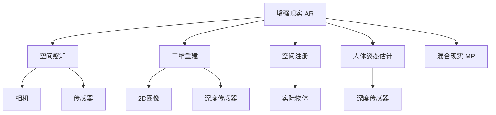

                 

# 增强现实（AR）应用：现实与虚拟的融合

## 1. 背景介绍

### 1.1 问题由来
增强现实（AR）技术融合了虚拟信息和现实世界的感知与交互，正在迅速改变我们的生活方式和工作方式。从教育、娱乐到工业制造，AR技术以其独特的沉浸式体验和互动性，在各行各业展现出广泛的应用前景。然而，如何更好地融合虚拟与现实，提升AR系统的性能和用户体验，仍是当前技术研究和应用开发中的核心挑战。

### 1.2 问题核心关键点
AR技术的关键在于如何高效地融合数字内容与物理世界，实现“无缝”的交互体验。主要包括：

- **数据融合**：如何准确感知现实环境中的物体、场景和动作，以及如何将虚拟内容正确投影到现实世界中。
- **用户交互**：如何设计自然流畅的交互方式，使虚拟信息与用户行为无缝结合。
- **环境感知**：如何构建鲁棒的环境感知系统，适应各种复杂的场景和变化条件。
- **动态更新**：如何在实时场景中动态更新虚拟内容，保持信息的最新性。
- **安全和隐私**：如何在享受AR带来的便利的同时，确保数据安全和用户隐私不受侵犯。

## 2. 核心概念与联系

### 2.1 核心概念概述

为更好地理解AR技术的应用原理，本节将介绍几个密切相关的核心概念：

- **增强现实（AR）**：将虚拟数字信息叠加在现实世界之上，提供丰富直观的交互体验。
- **空间感知**：通过相机、传感器等设备感知用户和环境的空间信息，实现虚拟物体在现实世界中的准确定位。
- **三维重建**：从2D图像或深度传感器中，重建出三维模型的过程，是AR中的核心技术之一。
- **空间注册**：将虚拟物体与现实环境中的实际物体对齐，实现无缝融合。
- **人体姿态估计**：通过深度传感器或摄像头捕捉人体骨骼和关节信息，实现自然交互。
- **混合现实（MR）**：AR与虚拟现实（VR）的结合，同时包含真实和虚拟环境的信息，更具沉浸感。

这些核心概念之间的逻辑关系可以通过以下Mermaid流程图来展示：



这个流程图展示了她增强现实的核心概念及其之间的关系：

1. AR通过相机、传感器等设备感知现实世界。
2. 通过三维重建技术将2D图像或深度数据转换为三维模型。
3. 空间注册将虚拟物体对齐现实世界物体，实现无缝融合。
4. 人体姿态估计捕捉人体信息，实现自然交互。
5. AR与VR结合形成混合现实，提升沉浸感。

## 3. 核心算法原理 & 具体操作步骤
### 3.1 算法原理概述

增强现实技术的基本原理是通过计算机视觉和图形处理技术，将虚拟信息与现实世界中的物体、场景等进行融合。其核心流程包括：

- **数据采集**：通过相机、传感器等设备，采集现实世界的环境信息。
- **三维重建**：将采集到的信息转换为三维模型，以便于后续处理。
- **空间感知**：通过相机位置和姿态，确定虚拟物体在现实世界中的位置和方向。
- **空间注册**：将虚拟物体与现实物体对齐，实现融合。
- **图像渲染**：将虚拟物体渲染到真实场景中，展示给用户。

### 3.2 算法步骤详解

增强现实系统的实现步骤如下：

**Step 1: 数据采集**
- 使用相机或深度传感器采集现实世界的图像或深度数据。
- 将采集到的数据进行预处理，包括去噪、归一化、拼接等，以提高后续处理的准确性。

**Step 2: 三维重建**
- 利用2D图像或深度传感器数据，进行三维模型的重建。
- 常用的算法包括结构光、激光雷达等，根据不同的设备和应用场景选择适合的算法。

**Step 3: 空间感知**
- 通过相机位置和姿态的估计，确定虚拟物体在现实世界中的位置和方向。
- 常用算法包括视觉SLAM（Simultaneous Localization and Mapping）和IMU+视觉融合。

**Step 4: 空间注册**
- 将虚拟物体与现实物体对齐，实现虚拟信息在现实世界中的无缝融合。
- 常用的技术包括基于特征点的匹配、基于模型的对齐等。

**Step 5: 图像渲染**
- 将虚拟物体渲染到真实场景中，展示给用户。
- 常用的渲染算法包括基于图像的空间混合和基于体积的光线追踪等。

### 3.3 算法优缺点

增强现实技术具有以下优点：

- **沉浸感强**：通过将虚拟信息与现实世界融合，提供更丰富直观的体验。
- **互动性好**：用户可以通过自然交互方式与虚拟信息互动，提升参与感。
- **应用广泛**：广泛应用于教育、娱乐、工业制造等领域，具有广阔的市场前景。

同时，该技术也存在一些缺点：

- **硬件成本高**：高性能相机、深度传感器等硬件设备价格较高，普及性受限。
- **环境适应性差**：复杂环境中的光照、遮挡等因素可能影响感知和融合效果。
- **实时性要求高**：实时渲染和空间感知需要高性能计算，对设备要求高。
- **隐私和安全风险**：用户行为和环境信息的采集可能导致隐私泄露和安全问题。

## 4. 数学模型和公式 & 详细讲解

### 4.1 数学模型构建

增强现实技术的核心在于计算机视觉和图形处理，其数学模型主要包括以下几个方面：

- **三维重建**：使用结构光或激光雷达数据，重建出三维模型。
- **空间感知**：通过相机位置和姿态的估计，确定物体在空间中的位置和方向。
- **空间注册**：通过特征点的匹配或模型的对齐，将虚拟物体与现实物体对齐。
- **图像渲染**：将虚拟物体渲染到真实场景中，展示给用户。

### 4.2 公式推导过程

以下以结构光三维重建为例，推导其基本公式。

假设结构光光源发出的光束与图像平面垂直，光源位置为 $(x_s, y_s, z_s)$，光源到图像平面的距离为 $d$。设图像平面上的任意点为 $(x, y, 0)$，则光线在图像平面上的投影点为 $(x_p, y_p)$。根据结构光原理，可以得到：

$$
\frac{(x-x_s)^2+(y-y_s)^2}{(x_p-x_s)^2+(y_p-y_s)^2} = \left(\frac{z}{d}\right)^2
$$

将上式展开并整理，得到：

$$
\frac{x^2+y^2}{x_p^2+y_p^2} = \left(\frac{z}{d}\right)^2
$$

进一步推导可得到：

$$
x_p = \frac{x}{\frac{z}{d}}
$$

$$
y_p = \frac{y}{\frac{z}{d}}
$$

通过计算得到图像平面上的投影点坐标，即可进行三维重建。

## 5. 项目实践：代码实例和详细解释说明
### 5.1 开发环境搭建

在进行AR系统开发前，我们需要准备好开发环境。以下是使用Python进行OpenCV和Pygame开发的环境配置流程：

1. 安装Anaconda：从官网下载并安装Anaconda，用于创建独立的Python环境。

2. 创建并激活虚拟环境：
```bash
conda create -n ar-env python=3.8 
conda activate ar-env
```

3. 安装相关库：
```bash
pip install opencv-python pygame
```

4. 安装GPU加速库（可选）：
```bash
conda install -c pytorch nvidia-cuda cudatoolkit=11.1
```

5. 安装TensorFlow（可选）：
```bash
pip install tensorflow
```

完成上述步骤后，即可在`ar-env`环境中开始AR系统的开发。

### 5.2 源代码详细实现

下面以使用OpenCV和Pygame实现的简单AR应用为例，给出完整的代码实现：

```python
import cv2
import pygame
import numpy as np

# 设置相机参数
cam = cv2.VideoCapture(0)

# 设置显示窗口大小
width, height = 640, 480

# 设置纹理缓存
surface = pygame.display.set_mode((width, height), pygame.SRCALPHA)

def draw_rect(surface, rect):
    pygame.draw.rect(surface, (255, 0, 0), rect, 2)

def draw_circle(surface, center, radius):
    pygame.draw.circle(surface, (0, 255, 0), center, radius)

def draw_text(surface, text, pos):
    font = pygame.font.Font(None, 36)
    text_surf = font.render(text, True, (0, 0, 0))
    surface.blit(text_surf, pos)

def run():
    while True:
        # 读取相机数据
        ret, frame = cam.read()
        if not ret:
            break
        
        # 处理图像数据
        gray = cv2.cvtColor(frame, cv2.COLOR_BGR2GRAY)
        cv2.imwrite('frame.png', gray)
        
        # 加载纹理图像
        texture = pygame.image.load('frame.png').convert_alpha()
        
        # 渲染虚拟物体
        surface.fill((255, 255, 255, 0))
        draw_rect(surface, (200, 200, 200, 100))
        draw_circle(surface, (400, 300), 50)
        draw_text(surface, 'Hello, AR!', (50, 50))
        pygame.display.flip()
        
        # 显示结果
        for event in pygame.event.get():
            if event.type == pygame.QUIT:
                pygame.quit()
                cv2.destroyAllWindows()

run()
```

在代码中，我们通过OpenCV读取相机数据，并使用Pygame显示渲染结果。运行结果将显示一个带有矩形、圆形和文本的虚拟物体。

### 5.3 代码解读与分析

让我们再详细解读一下关键代码的实现细节：

**cam = cv2.VideoCapture(0)**：
- 通过OpenCV的VideoCapture函数打开摄像头设备。

**surface = pygame.display.set_mode((width, height), pygame.SRCALPHA)**：
- 使用Pygame创建显示窗口，并设置透明度为0。

**gray = cv2.cvtColor(frame, cv2.COLOR_BGR2GRAY)**：
- 将BGR图像转换为灰度图像。

**texture = pygame.image.load('frame.png').convert_alpha()**：
- 加载存储为PNG格式的图像，并设置透明度为0。

**draw_rect(surface, (200, 200, 200, 100))**：
- 绘制矩形，左上角坐标为(200, 200)，宽度和高度均为100。

**draw_circle(surface, (400, 300), 50)**：
- 绘制圆形，中心坐标为(400, 300)，半径为50。

**draw_text(surface, 'Hello, AR!', (50, 50))**：
- 绘制文本，文本内容为'Hello, AR!'，左上角坐标为(50, 50)。

**pygame.display.flip()**：
- 刷新显示窗口。

通过以上代码，我们可以看到，使用OpenCV和Pygame可以较为轻松地实现一个简单的AR应用，展示虚拟物体到真实相机图像的融合效果。

## 6. 实际应用场景
### 6.1 智能制造

增强现实技术在智能制造中的应用，可以实现设备的远程监控和维护，提升生产效率和设备利用率。例如，通过AR眼镜，工人可以实时查看设备的运行状态，快速定位和解决问题。

在技术实现上，可以在生产现场安装深度相机和标志点，将设备的运行数据和状态信息传输到AR系统中，通过特征点匹配算法，将虚拟信息叠加到现实场景中，展示给工人。工人在AR系统中可以直观地了解设备状态，快速进行维护操作，减少停机时间。

### 6.2 医疗手术

增强现实技术在医疗手术中的应用，可以提供实时的导航和辅助，提升手术的精准度和安全性。例如，通过AR眼镜，医生可以实时查看手术部位的3D模型和解剖结构，进行精准操作。

在技术实现上，可以使用CT、MRI等医学图像数据，结合三维重建技术，生成手术部位的3D模型。医生通过AR眼镜，可以实时查看手术部位的3D模型和解剖结构，进行精准操作。AR系统还可以提供实时的影像增强和导航功能，辅助医生进行手术。

### 6.3 教育培训

增强现实技术在教育培训中的应用，可以提供互动式学习体验，提升学习效果和参与感。例如，通过AR技术，学生可以体验历史事件、科学实验等，获得身临其境的体验。

在技术实现上，可以使用虚拟现实技术，结合增强现实技术，构建虚拟的学习场景。学生通过AR眼镜，可以实时查看虚拟的学习场景，与虚拟人物互动，进行知识点的学习和复习。AR系统还可以提供实时的反馈和评测，帮助学生掌握知识点。

### 6.4 未来应用展望

随着增强现实技术的不断成熟，其在更多领域的应用前景将更加广阔。

在智慧城市治理中，增强现实技术可以实现公共安全的实时监控和预警，提升城市管理的自动化和智能化水平。例如，通过AR眼镜，安保人员可以实时查看监控画面和异常情况，快速响应突发事件。

在娱乐和游戏领域，增强现实技术可以提供更加沉浸式的互动体验。例如，通过AR技术，用户可以与虚拟角色互动，进行游戏和社交活动。AR游戏还可以利用现实环境中的物体和场景，增加游戏趣味性和互动性。

在智慧零售领域，增强现实技术可以实现商品展示和互动，提升用户体验和销售转化率。例如，通过AR技术，用户可以实时查看商品的3D模型和动态演示，了解商品特性和使用方法，进行购买决策。

此外，增强现实技术还可以应用于培训模拟、建筑设计、房地产展示等领域，为各行各业带来变革性影响。相信随着技术的日益成熟和应用场景的不断扩展，增强现实技术必将在更多领域大放异彩，深刻影响人类的生产生活方式。

## 7. 工具和资源推荐
### 7.1 学习资源推荐

为了帮助开发者系统掌握增强现实技术的基础知识和应用技巧，这里推荐一些优质的学习资源：

1. **《增强现实技术与开发》**：由知名专家撰写的技术书籍，全面介绍了AR技术的基本原理、核心算法和开发实践。

2. **Coursera《增强现实技术》课程**：由斯坦福大学开设的AR技术课程，涵盖AR技术的基础知识、核心算法和开发实践，适合入门学习。

3. **Unity AR开发教程**：Unity引擎提供的AR开发教程，结合Unity的AR扩展，提供详细的AR开发案例和代码实例，适合实战学习。

4. **ARKit和ARCore文档**：苹果和谷歌提供的AR开发框架文档，提供丰富的API和示例代码，适合深入学习。

5. **ARToolKit**：开源的AR开发框架，提供多平台的AR开发支持，适合跨平台开发学习。

通过对这些资源的学习实践，相信你一定能够快速掌握增强现实技术的基础知识和应用技巧，并将其应用到实际项目中。

### 7.2 开发工具推荐

高效的开发离不开优秀的工具支持。以下是几款用于增强现实开发的工具：

1. **Unity**：由Unity Technologies开发的集成开发环境，提供强大的AR开发支持，适合游戏和应用开发。

2. **Unreal Engine**：由Epic Games开发的实时3D渲染引擎，提供丰富的AR开发支持，适合影视和游戏开发。

3. **ARKit**：苹果提供的AR开发框架，提供跨平台支持，适合iOS平台开发。

4. **ARCore**：谷歌提供的AR开发框架，提供跨平台支持，适合Android平台开发。

5. **ARToolKit**：开源的AR开发框架，提供跨平台支持，适合多种平台开发。

合理利用这些工具，可以显著提升增强现实系统的开发效率，加速创新迭代的步伐。

### 7.3 相关论文推荐

增强现实技术的发展源于学界的持续研究。以下是几篇奠基性的相关论文，推荐阅读：

1. **“Real-time 3D registration of AR content in outdoor environment”**：提出了基于特征点的AR系统实现方法，适用于复杂环境下的实时融合。

2. **“A Survey on Augmented Reality for Medical Applications”**：综述了增强现实在医疗手术中的应用，提供了丰富的案例和分析。

3. **“AR-based Augmentation System for Real-time Navigation and Navigation Planning”**：提出了基于AR的导航系统实现方法，适用于智能制造和智慧交通等领域。

4. **“AR Toolkit for Smartphones: Implementation and Applications”**：介绍了ARToolKit的实现方法和应用案例，提供了AR技术在智能终端设备上的实现路径。

这些论文代表了她增强现实技术的发展脉络。通过学习这些前沿成果，可以帮助研究者把握学科前进方向，激发更多的创新灵感。

## 8. 总结：未来发展趋势与挑战

### 8.1 总结

本文对增强现实技术的应用原理和开发实践进行了全面系统的介绍。首先阐述了增强现实技术的基本原理和关键组件，明确了AR技术在多个领域的应用前景和挑战。其次，从原理到实践，详细讲解了增强现实技术的核心算法和具体操作步骤，给出了完整的代码实例。同时，本文还探讨了增强现实技术在多个领域的应用案例，展示了其在各行各业中的广阔前景。最后，本文精选了增强现实技术的各类学习资源，力求为读者提供全方位的技术指引。

通过本文的系统梳理，可以看到，增强现实技术在现实与虚拟的融合中，展示出了强大的应用潜力。未来，伴随技术的不断进步和应用场景的持续扩展，增强现实技术必将在更多领域大放异彩，深刻影响人类的生产生活方式。

### 8.2 未来发展趋势

展望未来，增强现实技术的发展趋势将体现在以下几个方面：

1. **硬件设备普及化**：随着硬件技术的不断进步，高性能相机、深度传感器等设备的价格将进一步降低，增强现实技术的普及将更加广泛。

2. **实时性能提升**：通过优化算法和硬件加速，增强现实系统的实时性能将进一步提升，支持更复杂的应用场景和更高的刷新率。

3. **跨平台协作**：增强现实技术将进一步突破平台限制，实现跨平台协作和数据共享，提升系统的灵活性和可扩展性。

4. **融合VR和MR**：增强现实技术将与虚拟现实和混合现实技术进一步融合，提供更加丰富多样的体验和应用场景。

5. **AI与AR结合**：增强现实技术将与人工智能技术进一步融合，提升系统的智能水平和自适应能力，实现更自然的交互体验。

6. **跨领域应用拓展**：增强现实技术将拓展到更多领域，如智慧交通、智慧旅游、智慧教育等，带来更广泛的应用价值。

以上趋势凸显了增强现实技术的广阔前景。这些方向的探索发展，必将进一步提升增强现实系统的性能和用户体验，为各行各业带来变革性影响。

### 8.3 面临的挑战

尽管增强现实技术已经取得了瞩目成就，但在迈向更加智能化、普适化应用的过程中，它仍面临着诸多挑战：

1. **硬件成本高**：高性能相机、深度传感器等设备价格较高，普及性受限。
2. **环境适应性差**：复杂环境中的光照、遮挡等因素可能影响感知和融合效果。
3. **实时性要求高**：实时渲染和空间感知需要高性能计算，对设备要求高。
4. **隐私和安全风险**：用户行为和环境信息的采集可能导致隐私泄露和安全问题。

### 8.4 研究展望

面对增强现实技术面临的挑战，未来的研究需要在以下几个方面寻求新的突破：

1. **降低硬件成本**：开发更高效、更经济的硬件设备，降低增强现实系统的门槛。
2. **提升环境适应性**：研究在复杂环境中的感知和融合技术，提升系统的鲁棒性。
3. **优化实时性能**：开发更高效的算法和优化技术，提升系统的实时性能和稳定性。
4. **增强隐私保护**：设计更加安全的隐私保护机制，保障用户数据安全。
5. **提升智能化水平**：研究AI与AR的融合技术，提升系统的智能水平和自适应能力。

这些研究方向的探索，必将引领增强现实技术迈向更高的台阶，为构建智能化的未来社会铺平道路。

## 9. 附录：常见问题与解答

**Q1：增强现实技术是否仅适用于虚拟物品的叠加？**

A: 增强现实技术不仅限于虚拟物品的叠加，还可以展示实物的详细信息、三维模型等。例如，通过AR技术，用户可以实时查看设备的运行状态，进行设备维护。

**Q2：增强现实技术是否仅适用于智能手机和平板等设备？**

A: 增强现实技术不仅限于智能手机和平板等设备，还可以应用于AR眼镜、头显等设备。例如，通过AR眼镜，医生可以实时查看手术部位的3D模型和解剖结构，进行精准操作。

**Q3：增强现实技术是否仅适用于娱乐和游戏领域？**

A: 增强现实技术不仅限于娱乐和游戏领域，还可以应用于教育、医疗、智能制造等多个领域。例如，通过AR技术，学生可以体验历史事件、科学实验等，获得身临其境的体验。

**Q4：增强现实技术是否仅适用于室内环境？**

A: 增强现实技术不仅限于室内环境，还可以应用于室外和复杂环境。例如，通过AR技术，安保人员可以实时查看监控画面和异常情况，快速响应突发事件。

**Q5：增强现实技术是否仅适用于静态场景？**

A: 增强现实技术不仅限于静态场景，还可以应用于动态和实时场景。例如，通过AR技术，用户可以实时查看商品的3D模型和动态演示，了解商品特性和使用方法，进行购买决策。

通过以上解答，可以更全面地了解增强现实技术的实际应用和潜在价值。相信随着技术的不断发展和应用的不断深化，增强现实技术必将在更多领域大放异彩，深刻影响人类的生产生活方式。

---

作者：禅与计算机程序设计艺术 / Zen and the Art of Computer Programming

