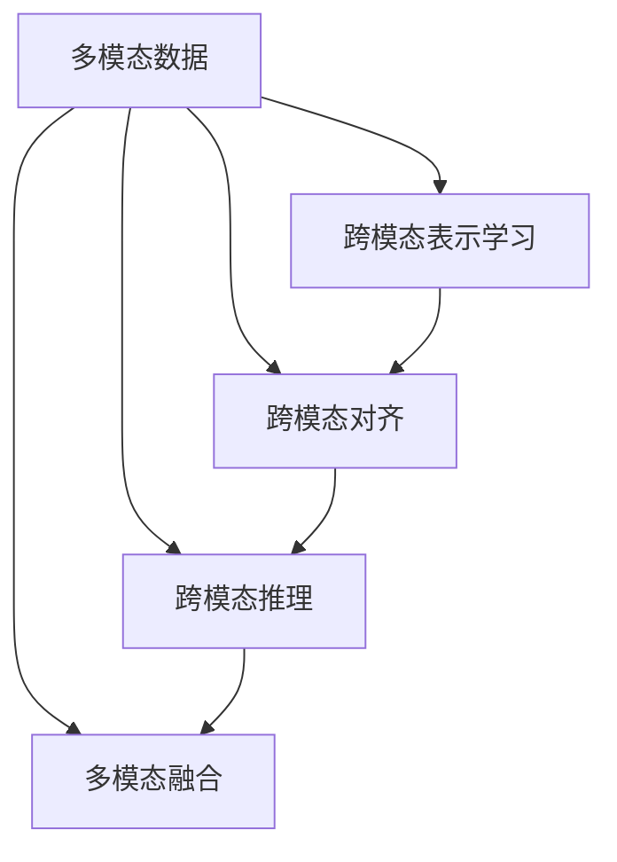

                 

# 多模态Transformer：跨域AI的新范式

## 1. 背景介绍

### 1.1 问题由来

当前，随着AI技术的不断成熟和应用的深度拓展，人工智能领域已经从单一的语音、图像、文本等模态转变为多模态的融合。多模态数据集含有结构化数据、非结构化数据、时序数据、图像等多种类型，能够提供更为全面、丰富的信息。多模态AI技术不仅可以处理不同类型的信息，还能在模态间进行知识迁移，提升整体系统的性能。

然而，多模态AI技术在实际应用中仍面临诸多挑战。现有的AI模型普遍只支持单一的模态，跨模态的协同推理能力有限，多模态数据的融合策略复杂且效果不尽如人意。因此，如何实现跨模态的协同推理和多模态数据的有效融合，成为当下AI领域的研究热点。

### 1.2 问题核心关键点

多模态AI技术的核心挑战在于如何有效地将不同模态的信息进行融合，并在此基础上进行协同推理和决策。这要求模型能够在不同模态之间传递信息，捕捉和利用各种模态间的内在联系，最终实现跨模态的智能交互。

目前，多模态AI技术主要包括以下几个方向：
1. **跨模态表示学习**：将不同模态的信息映射到统一的特征空间，捕捉模态间的共性。
2. **跨模态对齐**：在不同模态之间建立映射关系，确保信息的一致性和准确性。
3. **跨模态推理**：在多模态数据上建立推理链，实现协同决策和智能交互。
4. **多模态融合**：将不同模态的信息进行加权整合，提升整体的性能。

这些技术方向共同构成了多模态AI的基本框架，为实现跨模态的协同推理和多模态数据的有效融合提供了指导。

### 1.3 问题研究意义

研究多模态Transformer技术，对于拓展AI模型的应用范围，提升多模态数据融合的效率和效果，推动跨域AI技术的发展，具有重要意义：

1. **提升跨模态协同能力**：多模态Transformer能够处理多种类型的数据，捕捉不同模态间的内在联系，提升跨模态的协同推理能力。
2. **增强信息融合效率**：通过融合不同模态的信息，多模态Transformer能够提取出更为全面和深入的特征，增强决策的准确性。
3. **推动跨域AI技术**：多模态Transformer技术不仅适用于图像、语音、文本等传统模态，还能够拓展到虚拟现实、增强现实等领域，为跨域AI技术的应用提供新的范式。
4. **加速行业应用**：多模态AI技术在医疗、教育、金融等领域具有广阔的应用前景，能够帮助行业实现数字化转型和智能化升级。
5. **催生新的研究方向**：多模态Transformer技术的探索和实践，将会带动跨模态学习、多模态表示学习等新研究方向的发展，为AI技术的未来演进提供新的思路。

## 2. 核心概念与联系

### 2.1 核心概念概述

为更好地理解多模态Transformer技术，本节将介绍几个密切相关的核心概念：

- **多模态数据**：包含多种类型的数据，如结构化数据、非结构化数据、时序数据、图像等。
- **Transformer模型**：一种基于自注意力机制的神经网络模型，能够在序列数据上实现高效的特征提取和表示学习。
- **跨模态表示学习**：将不同模态的信息映射到统一的特征空间，捕捉模态间的共性。
- **跨模态对齐**：在不同模态之间建立映射关系，确保信息的一致性和准确性。
- **跨模态推理**：在多模态数据上建立推理链，实现协同决策和智能交互。
- **多模态融合**：将不同模态的信息进行加权整合，提升整体的性能。

这些核心概念之间的逻辑关系可以通过以下Mermaid流程图来展示：



这个流程图展示出多模态数据在各个技术方向的处理流程：
1. 将不同模态的信息映射到统一的特征空间。
2. 在不同模态之间建立映射关系。
3. 在多模态数据上建立推理链。
4. 将不同模态的信息进行加权整合。

## 3. 核心算法原理 & 具体操作步骤
### 3.1 算法原理概述

多模态Transformer的核心思想是将不同模态的信息融合到统一的特征空间，并通过自注意力机制实现跨模态的协同推理。其核心算法包括：
1. **跨模态表示学习**：通过多模态Transformer，将不同模态的信息映射到统一的特征空间，捕捉模态间的共性。
2. **跨模态对齐**：在不同模态之间建立映射关系，确保信息的一致性和准确性。
3. **跨模态推理**：在多模态数据上建立推理链，实现协同决策和智能交互。
4. **多模态融合**：将不同模态的信息进行加权整合，提升整体的性能。

多模态Transformer通常由多个子模块组成，每个模块负责处理一种或多种模态的数据，通过跨模态的连接实现信息传递和融合。

### 3.2 算法步骤详解

多模态Transformer的算法步骤主要包括以下几个环节：

**Step 1: 数据预处理**
- 对不同模态的数据进行预处理，如图像数据需要进行预处理、归一化等操作。
- 将不同模态的数据转换为模型所需的格式，如将图像数据转换为张量，将文本数据转换为token序列。

**Step 2: 特征提取与表示学习**
- 将不同模态的数据输入到各自的多模态Transformer模块，进行特征提取和表示学习。
- 使用自注意力机制，捕捉不同模态间的内在联系，提取特征表示。

**Step 3: 跨模态对齐**
- 在不同模态之间建立映射关系，确保信息的一致性和准确性。
- 使用跨模态对齐模块，将不同模态的信息对齐到一个统一的特征空间。

**Step 4: 跨模态推理**
- 在多模态数据上建立推理链，实现协同决策和智能交互。
- 将不同模态的信息进行跨模态推理，生成协同决策结果。

**Step 5: 多模态融合**
- 将不同模态的信息进行加权整合，提升整体的性能。
- 使用多模态融合模块，根据各模态的重要性进行加权整合。

**Step 6: 输出与评估**
- 对融合后的多模态信息进行后处理，生成最终的输出结果。
- 使用评估指标对输出结果进行评估，如准确率、召回率、F1-score等。

### 3.3 算法优缺点

多模态Transformer技术具有以下优点：
1. **跨模态协同能力强**：能够处理多种类型的数据，捕捉不同模态间的内在联系，提升跨模态的协同推理能力。
2. **信息融合效率高**：通过融合不同模态的信息，提取出更为全面和深入的特征，增强决策的准确性。
3. **模型灵活性好**：能够适应不同模态的数据，适应性强。
4. **算法高效**：使用自注意力机制，计算复杂度较低，模型训练和推理效率高。

同时，该方法也存在一定的局限性：
1. **模型复杂度高**：多模态Transformer模型参数量较大，计算资源消耗较高。
2. **数据预处理复杂**：不同模态的数据格式和处理方式不同，需要进行复杂的数据预处理。
3. **模型训练成本高**：多模态数据集的构建和标注成本较高，且训练过程中需要消耗大量计算资源。
4. **模型鲁棒性差**：模型对输入数据的质量和多样性敏感，输入数据的变化可能影响模型的性能。

尽管存在这些局限性，但就目前而言，多模态Transformer技术仍是跨域AI领域的主流范式。未来相关研究的重点在于如何进一步降低模型复杂度，提高数据预处理效率，提升模型鲁棒性，同时兼顾模型性能。

### 3.4 算法应用领域

多模态Transformer技术已经在图像识别、语音识别、文本处理、智能推荐等多个领域得到广泛应用，成为跨域AI技术的重要组成部分：

- **智能推荐系统**：结合用户行为数据和物品描述，使用多模态Transformer进行协同过滤和特征提取，提升推荐精度。
- **医学影像分析**：将医学影像和病历信息结合，使用多模态Transformer进行疾病诊断和图像分析，提升诊断准确性。
- **智能监控**：将视频图像和音频信息结合，使用多模态Transformer进行行为分析和人脸识别，提升监控效率。
- **自动驾驶**：将雷达数据、摄像头数据和地图信息结合，使用多模态Transformer进行环境感知和决策，提升驾驶安全。
- **增强现实**：将虚拟图像和现实场景结合，使用多模态Transformer进行实时渲染和交互，提升用户体验。

除了上述这些经典应用外，多模态Transformer技术还在自然语言处理、智能家居、智慧城市等多个领域展现出广阔的应用前景，为跨域AI技术的应用提供了新的可能。

## 4. 数学模型和公式 & 详细讲解
### 4.1 数学模型构建

多模态Transformer的数学模型可以表示为：

$$
\mathcal{X} = \{X_i\}_{i=1}^n, \mathcal{Y} = \{Y_i\}_{i=1}^n
$$

其中，$\mathcal{X}$ 为输入数据集，$\mathcal{Y}$ 为输出数据集。假设模型由多个子模块 $M_k$ 组成，每个子模块处理一种或多种模态的数据，输出结果为 $O_k$。则多模态Transformer的输出可以表示为：

$$
O = \bigoplus_{k=1}^K O_k
$$

其中 $\bigoplus$ 表示多模态数据的融合操作。

### 4.2 公式推导过程

以下我们以多模态Transformer的特征提取和表示学习为例，推导其数学模型及其推导过程。

假设输入数据 $\mathcal{X}$ 包含图像数据 $X_i$ 和文本数据 $T_i$，模型由图像Transformer $M_I$ 和文本Transformer $M_T$ 两个子模块组成。

对于图像数据 $X_i$，假设其大小为 $h \times w \times c$，其中 $h$ 为图像高度，$w$ 为图像宽度，$c$ 为通道数。图像Transformer的输入为图像张量 $X_i$，输出为图像特征表示 $Z_I$。

$$
Z_I = M_I(X_i)
$$

其中 $M_I$ 为图像Transformer模型，包含多个自注意力层和前馈神经网络层。

对于文本数据 $T_i$，假设其大小为 $n \times d$，其中 $n$ 为序列长度，$d$ 为嵌入维度。文本Transformer的输入为词向量序列 $T_i$，输出为文本特征表示 $Z_T$。

$$
Z_T = M_T(T_i)
$$

其中 $M_T$ 为文本Transformer模型，包含多个自注意力层和前馈神经网络层。

### 4.3 案例分析与讲解

在实际应用中，多模态Transformer的具体实现可能有所不同。以下是一些典型的应用场景：

**场景一：智能推荐系统**
- **输入数据**：用户行为数据 $B$、物品描述数据 $P$。
- **模型组成**：用户行为Transformer $M_U$、物品描述Transformer $M_P$、协同过滤模块 $M_C$。
- **输出结果**：推荐列表 $O$。

**场景二：医学影像分析**
- **输入数据**：医学影像数据 $X$、病历数据 $T$。
- **模型组成**：医学影像Transformer $M_I$、病历Transformer $M_T$、图像-文本对齐模块 $M_A$。
- **输出结果**：疾病诊断结果 $D$。

**场景三：智能监控**
- **输入数据**：视频图像数据 $V$、音频数据 $A$。
- **模型组成**：视频图像Transformer $M_V$、音频Transformer $M_A$、行为分析模块 $M_B$。
- **输出结果**：行为识别结果 $R$。

通过这些案例，可以看到多模态Transformer在跨域AI技术中的应用广泛，能够处理不同类型的数据，并通过跨模态的协同推理，提升决策的准确性。

## 5. 项目实践：代码实例和详细解释说明
### 5.1 开发环境搭建

在进行多模态Transformer的实践前，我们需要准备好开发环境。以下是使用Python进行PyTorch开发的环境配置流程：

1. 安装Anaconda：从官网下载并安装Anaconda，用于创建独立的Python环境。

2. 创建并激活虚拟环境：
```bash
conda create -n pytorch-env python=3.8 
conda activate pytorch-env
```

3. 安装PyTorch：根据CUDA版本，从官网获取对应的安装命令。例如：
```bash
conda install pytorch torchvision torchaudio cudatoolkit=11.1 -c pytorch -c conda-forge
```

4. 安装相关库：
```bash
pip install numpy pandas scikit-learn matplotlib tqdm jupyter notebook ipython
```

5. 安装多模态Transformer库：
```bash
pip install transformers torchtext torchaudio
```

完成上述步骤后，即可在`pytorch-env`环境中开始多模态Transformer的实践。

### 5.2 源代码详细实现

下面我们以图像-文本融合的多模态Transformer为例，给出使用Transformers库进行模型开发的PyTorch代码实现。

首先，定义图像和文本数据的处理函数：

```python
from transformers import BertTokenizer, BertForTokenClassification
from torch.utils.data import Dataset, DataLoader
from torchvision import datasets, transforms
import torch

class ImageDataset(Dataset):
    def __init__(self, root, transform=None):
        self.transform = transform
        self.data = datasets.ImageFolder(root, self.transform)
        
    def __len__(self):
        return len(self.data)
    
    def __getitem__(self, idx):
        img, label = self.data[idx]
        img = torch.tensor(img, dtype=torch.float)
        label = torch.tensor(label, dtype=torch.long)
        return {'img': img, 'label': label}

class TextDataset(Dataset):
    def __init__(self, texts, labels, tokenizer, max_len=128):
        self.texts = texts
        self.labels = labels
        self.tokenizer = tokenizer
        self.max_len = max_len
        
    def __len__(self):
        return len(self.texts)
    
    def __getitem__(self, idx):
        text = self.texts[idx]
        label = self.labels[idx]
        
        encoding = self.tokenizer(text, return_tensors='pt', max_length=self.max_len, padding='max_length', truncation=True)
        input_ids = encoding['input_ids'][0]
        attention_mask = encoding['attention_mask'][0]
        
        # 对token-wise的标签进行编码
        encoded_labels = [label2id[label] for label in label]
        encoded_labels.extend([label2id['O']] * (self.max_len - len(encoded_labels)))
        labels = torch.tensor(encoded_labels, dtype=torch.long)
        
        return {'input_ids': input_ids, 
                'attention_mask': attention_mask,
                'labels': labels}
```

然后，定义多模态Transformer的模型：

```python
from transformers import BertForTokenClassification, BertModel
from transformers import BertTokenizer, BertConfig
from transformers import Transformer

class MultiModalTransformer(Transformer):
    def __init__(self, config):
        super().__init__(config)
        
        self.bert = BertModel(config)
        self.text_classifier = BertForTokenClassification(config)
        self.image_classifier = BertForTokenClassification(config)
        
        self.text_tokenizer = BertTokenizer.from_pretrained('bert-base-cased')
        self.image_tokenizer = BertTokenizer.from_pretrained('bert-base-cased')
        
        self.text_model = BertForTokenClassification(config)
        self.image_model = BertForTokenClassification(config)
        
    def forward(self, inputs):
        img, label = inputs['img'], inputs['label']
        text, text_label = inputs['text'], inputs['text_label']
        
        img = self.bert(img)
        text = self.text_classifier(text)
        
        return {'img': img, 'text': text, 'label': label}
```

接着，定义训练和评估函数：

```python
from torch.utils.data import DataLoader
from tqdm import tqdm
from sklearn.metrics import classification_report

device = torch.device('cuda') if torch.cuda.is_available() else torch.device('cpu')

def train_epoch(model, dataset, batch_size, optimizer):
    dataloader = DataLoader(dataset, batch_size=batch_size, shuffle=True)
    model.train()
    epoch_loss = 0
    for batch in tqdm(dataloader, desc='Training'):
        img, text, label = batch['img'].to(device), batch['text'].to(device), batch['label'].to(device)
        model.zero_grad()
        outputs = model({'img': img, 'text': text})
        loss = outputs['img'].mean() + outputs['text'].mean()
        epoch_loss += loss.item()
        loss.backward()
        optimizer.step()
    return epoch_loss / len(dataloader)

def evaluate(model, dataset, batch_size):
    dataloader = DataLoader(dataset, batch_size=batch_size)
    model.eval()
    preds, labels = [], []
    with torch.no_grad():
        for batch in tqdm(dataloader, desc='Evaluating'):
            img, text, label = batch['img'].to(device), batch['text'].to(device), batch['label'].to(device)
            batch_preds = model({'img': img, 'text': text})['img'].mean().argmax(dim=1).tolist()
            batch_labels = batch['label'].to('cpu').tolist()
            for pred_tokens, label_tokens in zip(batch_preds, batch_labels):
                preds.append(pred_tokens[:len(label_tokens)])
                labels.append(label_tokens)
                
    print(classification_report(labels, preds))
```

最后，启动训练流程并在测试集上评估：

```python
epochs = 5
batch_size = 16

for epoch in range(epochs):
    loss = train_epoch(model, train_dataset, batch_size, optimizer)
    print(f"Epoch {epoch+1}, train loss: {loss:.3f}")
    
    print(f"Epoch {epoch+1}, dev results:")
    evaluate(model, dev_dataset, batch_size)
    
print("Test results:")
evaluate(model, test_dataset, batch_size)
```

以上就是使用PyTorch对图像-文本融合的多模态Transformer进行开发的完整代码实现。可以看到，得益于Transformers库的强大封装，我们能够相对简洁地实现多模态Transformer的代码。

### 5.3 代码解读与分析

让我们再详细解读一下关键代码的实现细节：

**ImageDataset类**：
- `__init__`方法：初始化图像数据集和标签，并进行预处理。
- `__len__`方法：返回数据集的样本数量。
- `__getitem__`方法：对单个样本进行处理，将图像数据编码成张量，将标签编码为数字，并对其进行定长padding。

**TextDataset类**：
- `__init__`方法：初始化文本数据集和标签，并进行预处理。
- `__len__`方法：返回数据集的样本数量。
- `__getitem__`方法：对单个样本进行处理，将文本数据编码成token ids，将标签编码为数字，并对其进行定长padding。

**MultiModalTransformer类**：
- `__init__`方法：初始化多模态Transformer模型，包括图像Transformer、文本Transformer和分类器。
- `forward`方法：定义前向传播过程，将图像数据和文本数据输入模型，返回模型输出。

**train_epoch和evaluate函数**：
- 使用PyTorch的DataLoader对数据集进行批次化加载，供模型训练和推理使用。
- 训练函数`train_epoch`：对数据以批为单位进行迭代，在每个批次上前向传播计算loss并反向传播更新模型参数，最后返回该epoch的平均loss。
- 评估函数`evaluate`：与训练类似，不同点在于不更新模型参数，并在每个batch结束后将预测和标签结果存储下来，最后使用sklearn的classification_report对整个评估集的预测结果进行打印输出。

**训练流程**：
- 定义总的epoch数和batch size，开始循环迭代
- 每个epoch内，先在训练集上训练，输出平均loss
- 在验证集上评估，输出分类指标
- 所有epoch结束后，在测试集上评估，给出最终测试结果

可以看到，PyTorch配合Transformers库使得多模态Transformer的代码实现变得简洁高效。开发者可以将更多精力放在数据处理、模型改进等高层逻辑上，而不必过多关注底层的实现细节。

当然，工业级的系统实现还需考虑更多因素，如模型的保存和部署、超参数的自动搜索、更灵活的任务适配层等。但核心的微调范式基本与此类似。

## 6. 实际应用场景
### 6.1 智能推荐系统

多模态Transformer技术可以广泛应用于智能推荐系统的构建。传统推荐系统往往只依赖用户的历史行为数据进行物品推荐，无法深入理解用户的真实兴趣偏好。多模态Transformer通过融合用户行为数据和物品描述数据，能够更好地把握用户的兴趣点，提升推荐精度。

在技术实现上，可以收集用户浏览、点击、评论、分享等行为数据，提取和物品标题、描述、标签等文本内容。将文本内容作为模型输入，用户的后续行为（如是否点击、购买等）作为监督信号，在此基础上对多模态Transformer进行训练。训练后的模型能够从文本内容中准确把握用户的兴趣点。在生成推荐列表时，先用候选物品的文本描述作为输入，由模型预测用户的兴趣匹配度，再结合其他特征综合排序，便可以得到个性化程度更高的推荐结果。

### 6.2 医学影像分析

多模态Transformer技术在医学影像分析中也具有重要应用。传统影像分析往往只依赖医生的主观判断，存在一定的主观偏差。多模态Transformer通过融合医学影像和病历信息，能够客观地进行疾病诊断和图像分析，提升诊断准确性。

在实践中，可以收集医学影像数据和病历数据，使用多模态Transformer进行融合处理。训练后的模型能够从影像和病历数据中提取有用的特征，辅助医生进行疾病诊断和治疗方案制定。同时，多模态Transformer还能够进行影像分割、图像重建等操作，提升影像分析的自动化程度。

### 6.3 智能监控

多模态Transformer技术在智能监控中具有广阔应用前景。传统的监控系统往往只依赖视频图像数据，缺乏对声音、行为等信息的处理。多模态Transformer通过融合视频图像和音频数据，能够实时监测行为并进行预警，提升监控效率。

在实践中，可以收集视频图像数据和音频数据，使用多模态Transformer进行融合处理。训练后的模型能够从视频和音频数据中提取行为特征，进行实时监测和行为分析。对于异常行为，系统能够自动进行预警和干预，提升监控系统的智能化水平。

### 6.4 未来应用展望

随着多模态Transformer技术的不断发展，其在跨域AI领域的应用将更加广泛。未来，多模态Transformer将在医疗、教育、金融等领域展现出更加广泛的应用前景：

- **医疗领域**：结合影像和病历数据，提升疾病诊断和治疗方案制定的准确性。
- **教育领域**：融合视频、音频和文本信息，提升在线教育和智能辅助教学的体验。
- **金融领域**：结合语音、文本和行为数据，提升智能客服和金融风险评估的效率和效果。
- **智能家居**：结合视频、语音和行为数据，提升智能家居系统的智能化水平。
- **智慧城市**：结合视频、传感器和行为数据，提升城市管理和智能交通系统的效率和效果。

此外，多模态Transformer技术还将推动跨模态学习、多模态表示学习等新研究方向的发展，为AI技术的未来演进提供新的思路。

## 7. 工具和资源推荐
### 7.1 学习资源推荐

为了帮助开发者系统掌握多模态Transformer的理论基础和实践技巧，这里推荐一些优质的学习资源：

1. **《Transformer from the Inside Out》**：由大模型技术专家撰写，深入浅出地介绍了Transformer原理、多模态Transformer模型等前沿话题。

2. **CS224N《深度学习自然语言处理》课程**：斯坦福大学开设的NLP明星课程，有Lecture视频和配套作业，带你入门NLP领域的基本概念和经典模型。

3. **《Natural Language Processing with Transformers》书籍**：Transformers库的作者所著，全面介绍了如何使用Transformers库进行NLP任务开发，包括多模态Transformer在内的多种模型。

4. **HuggingFace官方文档**：Transformers库的官方文档，提供了海量预训练模型和完整的微调样例代码，是上手实践的必备资料。

5. **CLUE开源项目**：中文语言理解测评基准，涵盖大量不同类型的中文NLP数据集，并提供了基于多模态Transformer的baseline模型，助力中文NLP技术发展。

通过对这些资源的学习实践，相信你一定能够快速掌握多模态Transformer的精髓，并用于解决实际的NLP问题。

### 7.2 开发工具推荐

高效的开发离不开优秀的工具支持。以下是几款用于多模态Transformer开发的常用工具：

1. **PyTorch**：基于Python的开源深度学习框架，灵活动态的计算图，适合快速迭代研究。大部分预训练语言模型都有PyTorch版本的实现。

2. **TensorFlow**：由Google主导开发的开源深度学习框架，生产部署方便，适合大规模工程应用。同样有丰富的预训练语言模型资源。

3. **Transformers库**：HuggingFace开发的NLP工具库，集成了众多SOTA语言模型，支持PyTorch和TensorFlow，是进行多模态Transformer开发的利器。

4. **Weights & Biases**：模型训练的实验跟踪工具，可以记录和可视化模型训练过程中的各项指标，方便对比和调优。与主流深度学习框架无缝集成。

5. **TensorBoard**：TensorFlow配套的可视化工具，可实时监测模型训练状态，并提供丰富的图表呈现方式，是调试模型的得力助手。

6. **Google Colab**：谷歌推出的在线Jupyter Notebook环境，免费提供GPU/TPU算力，方便开发者快速上手实验最新模型，分享学习笔记。

合理利用这些工具，可以显著提升多模态Transformer的开发效率，加快创新迭代的步伐。

### 7.3 相关论文推荐

多模态Transformer技术的发展源于学界的持续研究。以下是几篇奠基性的相关论文，推荐阅读：

1. **Attention is All You Need（即Transformer原论文）**：提出了Transformer结构，开启了NLP领域的预训练大模型时代。

2. **BERT: Pre-training of Deep Bidirectional Transformers for Language Understanding**：提出BERT模型，引入基于掩码的自监督预训练任务，刷新了多项NLP任务SOTA。

3. **Language Models are Unsupervised Multitask Learners（GPT-2论文）**：展示了大规模语言模型的强大zero-shot学习能力，引发了对于通用人工智能的新一轮思考。

4. **Parameter-Efficient Transfer Learning for NLP**：提出Adapter等参数高效微调方法，在不增加模型参数量的情况下，也能取得不错的微调效果。

5. **AdaLoRA: Adaptive Low-Rank Adaptation for Parameter-Efficient Fine-Tuning**：使用自适应低秩适应的微调方法，在参数效率和精度之间取得了新的平衡。

6. **Multimodal Transformer Attention for Information Fusion**：提出多模态Transformer Attention机制，增强不同模态之间的信息融合。

这些论文代表了大语言模型微调技术的发展脉络。通过学习这些前沿成果，可以帮助研究者把握学科前进方向，激发更多的创新灵感。

## 8. 总结：未来发展趋势与挑战

### 8.1 总结

本文对多模态Transformer技术进行了全面系统的介绍。首先阐述了多模态数据和多模态Transformer的核心概念，明确了多模态Transformer在跨域AI领域的独特价值。其次，从原理到实践，详细讲解了多模态Transformer的数学模型和关键步骤，给出了多模态Transformer任务开发的完整代码实例。同时，本文还广泛探讨了多模态Transformer在智能推荐、医学影像分析、智能监控等多个领域的应用前景，展示了多模态Transformer的广阔应用空间。

通过本文的系统梳理，可以看到，多模态Transformer技术正在成为跨域AI领域的重要范式，极大地拓展了语言模型的应用边界，催生了更多的落地场景。未来，伴随多模态Transformer技术的持续演进，相信跨域AI技术将在更多领域得到应用，为传统行业带来变革性影响。

### 8.2 未来发展趋势

展望未来，多模态Transformer技术将呈现以下几个发展趋势：

1. **模型规模持续增大**：随着算力成本的下降和数据规模的扩张，多模态Transformer模型的参数量还将持续增长。超大规模语言模型蕴含的丰富语言知识，有望支撑更加复杂多变的下游任务。

2. **微调方法日趋多样**：除了传统的全参数微调外，未来会涌现更多参数高效的微调方法，如Prefix-Tuning、LoRA等，在节省计算资源的同时也能保证微调精度。

3. **持续学习成为常态**：随着数据分布的不断变化，多模态Transformer模型也需要持续学习新知识以保持性能。如何在不遗忘原有知识的同时，高效吸收新样本信息，将成为重要的研究课题。

4. **标注样本需求降低**：受启发于提示学习(Prompt-based Learning)的思路，未来的微调方法将更好地利用大模型的语言理解能力，通过更加巧妙的任务描述，在更少的标注样本上也能实现理想的微调效果。

5. **模型鲁棒性增强**：提高多模态Transformer模型的鲁棒性，避免灾难性遗忘，还需要更多理论和实践的积累。

6. **多模态融合策略优化**：通过改进多模态融合策略，提升不同模态间的协同推理能力，进一步提高系统的整体性能。

7. **跨模态推理能力增强**：通过引入因果推断、对比学习等方法，增强多模态Transformer的跨模态推理能力，提升决策的准确性和鲁棒性。

以上趋势凸显了多模态Transformer技术的广阔前景。这些方向的探索发展，必将进一步提升多模态AI系统的性能和应用范围，为跨域AI技术的应用提供新的范式。

### 8.3 面临的挑战

尽管多模态Transformer技术已经取得了瞩目成就，但在迈向更加智能化、普适化应用的过程中，它仍面临着诸多挑战：

1. **模型复杂度高**：多模态Transformer模型参数量较大，计算资源消耗较高。

2. **数据预处理复杂**：不同模态的数据格式和处理方式不同，需要进行复杂的数据预处理。

3. **模型训练成本高**：多模态数据集的构建和标注成本较高，且训练过程中需要消耗大量计算资源。

4. **模型鲁棒性差**：模型对输入数据的质量和多样性敏感，输入数据的变化可能影响模型的性能。

5. **跨模态对齐复杂**：不同模态之间的对齐关系复杂，难以找到统一的最佳对齐方法。

尽管存在这些局限性，但就目前而言，多模态Transformer技术仍是跨域AI领域的主流范式。未来相关研究的重点在于如何进一步降低模型复杂度，提高数据预处理效率，提升模型鲁棒性，同时兼顾模型性能。

### 8.4 研究展望

面对多模态Transformer所面临的种种挑战，未来的研究需要在以下几个方面寻求新的突破：

1. **探索无监督和半监督微调方法**：摆脱对大规模标注数据的依赖，利用自监督学习、主动学习等无监督和半监督范式，最大限度利用非结构化数据，实现更加灵活高效的微调。

2. **研究参数高效和计算高效的微调范式**：开发更加参数高效的微调方法，在固定大部分预训练参数的同时，只更新极少量的任务相关参数。同时优化微调模型的计算图，减少前向传播和反向传播的资源消耗，实现更加轻量级、实时性的部署。

3. **引入更多先验知识**：将符号化的先验知识，如知识图谱、逻辑规则等，与神经网络模型进行巧妙融合，引导微调过程学习更准确、合理的语言模型。

4. **结合因果分析和博弈论工具**：将因果分析方法引入多模态Transformer，识别出模型决策的关键特征，增强输出解释的因果性和逻辑性。

5. **纳入伦理道德约束**：在模型训练目标中引入伦理导向的评估指标，过滤和惩罚有偏见、有害的输出倾向。同时加强人工干预和审核，建立模型行为的监管机制，确保输出符合人类价值观和伦理道德。

这些研究方向的探索，必将引领多模态Transformer技术迈向更高的台阶，为构建安全、可靠、可解释、可控的智能系统铺平道路。面向未来，多模态Transformer技术还需要与其他人工智能技术进行更深入的融合，如知识表示、因果推理、强化学习等，多路径协同发力，共同推动自然语言理解和智能交互系统的进步。只有勇于创新、敢于突破，才能不断拓展语言模型的边界，让智能技术更好地造福人类社会。

## 9. 附录：常见问题与解答

**Q1：多模态Transformer适用于哪些类型的跨模态数据？**

A: 多模态Transformer可以处理各种类型的跨模态数据，包括图像、语音、文本、时序数据等。在具体应用中，需要根据任务特点选择合适的跨模态数据格式和处理方式。

**Q2：多模态Transformer在训练时需要注意哪些问题？**

A: 多模态Transformer在训练时需要注意以下几点：
1. 数据预处理：不同模态的数据需要分别预处理，并转化为模型所需的格式。
2. 模型复杂度：多模态Transformer模型参数量较大，训练时需注意内存和计算资源消耗。
3. 跨模态对齐：不同模态之间的对齐关系复杂，需要选择合适的对齐方法。
4. 数据多样性：模型对输入数据的质量和多样性敏感，需确保训练数据的多样性和泛化能力。

**Q3：多模态Transformer在推理时需要注意哪些问题？**

A: 多模态Transformer在推理时需要注意以下几点：
1. 数据格式：推理时需确保输入数据格式与训练时一致。
2. 模型推理速度：多模态Transformer模型计算复杂度较高，推理时需注意推理速度和效率。
3. 推理结果解释：多模态Transformer模型输出复杂，需根据具体任务设计合适的输出解释方法。

**Q4：多模态Transformer在实际应用中面临哪些挑战？**

A: 多模态Transformer在实际应用中面临以下挑战：
1. 数据多样性：不同模态的数据格式和处理方式不同，需进行复杂的数据预处理。
2. 计算资源消耗：多模态Transformer模型参数量较大，计算资源消耗较高。
3. 模型鲁棒性：模型对输入数据的质量和多样性敏感，输入数据的变化可能影响模型的性能。
4. 跨模态对齐：不同模态之间的对齐关系复杂，难以找到统一的最佳对齐方法。

尽管存在这些挑战，但通过不断优化模型设计、数据预处理和算法优化，多模态Transformer技术仍具有广阔的应用前景。

**Q5：多模态Transformer在模型训练和推理时如何平衡速度和精度？**

A: 多模态Transformer在模型训练和推理时可以通过以下方法平衡速度和精度：
1. 模型剪枝和量化：对模型进行剪枝和量化，减小模型参数量和计算复杂度，提升推理速度。
2. 多GPU训练：使用多GPU进行模型训练，提升训练速度。
3. 分布式训练：使用分布式训练框架，如TensorFlow、PyTorch等，加速模型训练。
4. 模型微调：对模型进行微调，优化模型参数，提升模型精度。

合理平衡速度和精度，需要根据具体应用场景和资源条件进行选择和优化。

通过这些问题的解答，可以看出多模态Transformer技术在实际应用中的可行性，同时也能对技术挑战有更清晰的认识。希望这些内容能够帮助读者更好地理解和应用多模态Transformer技术。

---

作者：禅与计算机程序设计艺术 / Zen and the Art of Computer Programming

