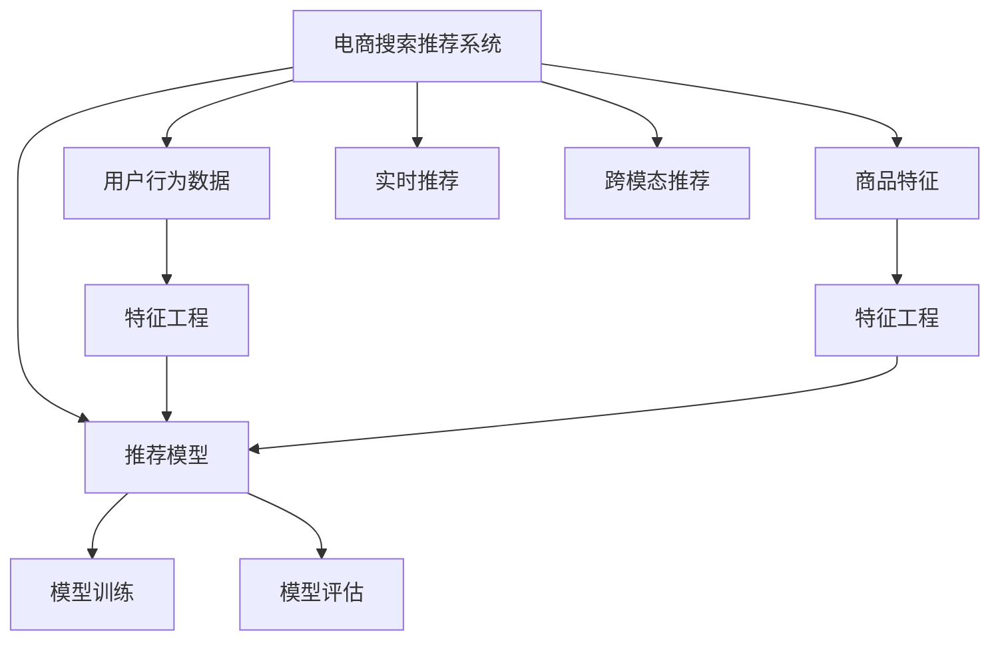

                 

# 大数据与AI 驱动的电商搜索推荐系统：以准确率与用户体验为目标

## 1. 背景介绍

在当今数字化时代，电商平台已成为人们购物的主要渠道。随着大数据和人工智能技术的飞速发展，如何通过智能化的搜索推荐系统提升用户体验、提高销售转化率，成为电商企业面临的重要课题。电商搜索推荐系统不仅关乎用户满意度和忠诚度，更直接关系到企业的收入和市场竞争力。

### 1.1 问题由来

电商搜索推荐系统的核心目标是通过对用户行为数据的分析和理解，向用户推荐最相关的商品信息，从而提高用户体验和购买转化率。传统推荐算法基于协同过滤、基于内容的推荐等方法，这些方法在数据充足的情况下能够取得较好的效果，但在数据稀疏和个性化需求高的情况下，推荐效果往往难以满足用户期望。

近年来，基于深度学习的推荐算法，特别是深度神经网络模型，逐渐进入人们的视野。这些模型通过学习用户行为数据，可以挖掘出深层次的关联模式和用户需求，从而提供更加精准和个性化的推荐服务。但深度学习模型的计算复杂度高，对计算资源和存储空间的需求大，难以在大规模电商系统中快速部署和高效运行。

### 1.2 问题核心关键点

要构建高效、智能的电商搜索推荐系统，需要解决以下核心问题：

- 如何处理海量数据，提取用户行为和商品特征，建立精准的推荐模型。
- 如何在有限的标注数据下，训练具有强泛化能力的推荐模型，避免过拟合。
- 如何平衡推荐模型的准确率和实时性，确保用户实时获取高质量的推荐结果。
- 如何在个性化推荐的同时，提升用户浏览和购买的用户体验，增加转化率。
- 如何应对冷启动问题，即新用户的个性化推荐。

### 1.3 问题研究意义

构建高效、智能的电商搜索推荐系统，对于提升用户购物体验、增强电商平台的竞争力具有重要意义：

1. 提升用户满意度：通过个性化的推荐，满足用户多样化的需求，提升用户满意度和忠诚度。
2. 提高销售转化率：精准的推荐结果能够显著增加用户点击和购买行为，提高电商平台的转化率。
3. 降低运营成本：智能化的推荐系统可以减少人工干预和运营成本，提升运营效率。
4. 加速业务创新：推荐系统的智能化能力，能够推动电商平台的业务创新和模式转型，创造新的收入点。

## 2. 核心概念与联系

### 2.1 核心概念概述

为了更好地理解基于大数据和AI的电商搜索推荐系统，本节将介绍几个关键概念：

- **电商搜索推荐系统**：通过分析用户历史行为和商品特征，为每个用户提供个性化的推荐结果，提升用户体验和销售转化率的系统。
- **用户行为数据**：用户在电商平台上产生的各种行为数据，如浏览记录、点击行为、购买记录等，是推荐系统的主要数据来源。
- **商品特征**：商品的标签、分类、价格、评价等属性，是推荐系统提取和利用商品信息的重要依据。
- **推荐模型**：基于用户行为数据和商品特征，训练得到的推荐模型，用于生成推荐结果。
- **特征工程**：通过数据预处理、特征提取、特征选择等手段，将原始数据转换为适合模型训练的特征表示。
- **模型训练**：使用机器学习或深度学习算法，在标注数据上训练推荐模型，学习用户和商品之间的关联模式。
- **模型评估**：使用评价指标（如准确率、召回率、点击率、转化率等），评估推荐模型的性能，并进行优化。
- **实时推荐**：在用户实时浏览页面时，根据当前行为动态生成推荐结果，提升用户体验。
- **跨模态推荐**：将不同模态的数据（如文本、图像、视频等）融合在一起，提供多维度、多层次的推荐服务。

这些核心概念之间的逻辑关系可以通过以下Mermaid流程图来展示：



这个流程图展示了大数据与AI驱动的电商搜索推荐系统的核心概念及其之间的关系：

1. 电商搜索推荐系统以用户行为数据和商品特征为输入，通过特征工程和推荐模型，生成推荐结果。
2. 特征工程对原始数据进行预处理和特征提取，确保输入数据的有效性和合理性。
3. 推荐模型在训练集上学习用户和商品之间的关联模式，生成推荐结果。
4. 模型评估通过各类评价指标，对推荐模型进行性能评估和优化。
5. 实时推荐在用户实时浏览页面时，根据当前行为动态生成推荐结果，提升用户体验。
6. 跨模态推荐将不同模态的数据融合在一起，提供多维度、多层次的推荐服务。

## 3. 核心算法原理 & 具体操作步骤

### 3.1 算法原理概述

基于大数据和AI的电商搜索推荐系统，通常使用深度学习模型，特别是基于神经网络的推荐模型。该模型的核心思想是通过学习用户行为数据和商品特征，建立用户-商品之间的关联模式，从而生成推荐结果。

形式化地，假设电商推荐系统中的用户为 $U$，商品为 $I$，用户行为数据为 $D=\{(u_i, i_j)\}_{i=1}^N$，其中 $u_i$ 表示用户，$i_j$ 表示用户在商品 $i$ 上的行为记录。推荐模型 $M_{\theta}$ 的输入为 $x$，输出为 $y$，即 $y = M_{\theta}(x)$。推荐模型的目标是最大化用户满意度，即最大化用户点击或购买行为的概率。

推荐模型通常使用如下的损失函数：

$$
\mathcal{L}(\theta) = -\frac{1}{N} \sum_{(u_i, i_j) \in D} \log \sigma(y)
$$

其中 $\sigma(y)$ 为模型的输出，通常是一个二元函数，表示用户点击或购买商品的概率。

### 3.2 算法步骤详解

基于大数据和AI的电商搜索推荐系统，一般包括以下几个关键步骤：

**Step 1: 数据准备与预处理**

- **数据收集**：收集电商平台上的用户行为数据和商品特征数据。用户行为数据包括用户的浏览、点击、购买、评价等行为记录，商品特征数据包括商品的标签、分类、价格、评价等属性。
- **数据清洗**：对原始数据进行去重、去噪、缺失值处理等操作，确保数据的质量和完整性。
- **数据划分**：将数据集划分为训练集、验证集和测试集，一般采用交叉验证的方式进行划分。

**Step 2: 特征工程**

- **特征提取**：从原始数据中提取有用的特征，如用户的浏览行为特征、商品的销量特征、时间特征等。
- **特征选择**：通过特征选择算法（如卡方检验、L1正则化等），选择对推荐结果影响较大的特征。
- **特征转换**：对特征进行归一化、标准化、离散化等处理，确保特征的稳定性和一致性。

**Step 3: 模型训练**

- **模型选择**：选择合适的推荐模型，如基于深度神经网络的多层感知机（MLP）、卷积神经网络（CNN）、循环神经网络（RNN）、Transformer等。
- **超参数设置**：设置模型的超参数，如学习率、批次大小、迭代轮数等，确保模型能够有效收敛。
- **模型训练**：使用训练集数据对模型进行训练，最小化损失函数。训练过程中，需要选择合适的优化算法（如随机梯度下降、Adam等），并使用正则化技术（如L2正则化、Dropout等）避免过拟合。

**Step 4: 模型评估**

- **评估指标**：选择适合的评估指标，如准确率、召回率、F1-score、AUC等，评估模型的性能。
- **交叉验证**：使用交叉验证的方式，在验证集上评估模型的性能，选择最优的模型。
- **模型调优**：根据评估结果，对模型进行调优，调整超参数，提升模型性能。

**Step 5: 实时推荐**

- **实时数据流**：对用户实时浏览页面的行为进行采集和处理，实时生成推荐结果。
- **实时计算**：使用流式计算框架（如Apache Storm、Apache Flink等），实时计算推荐结果，确保推荐结果的时效性和准确性。
- **缓存与索引**：使用缓存和索引技术，提高实时推荐的效率，减少计算延迟。

**Step 6: 跨模态推荐**

- **数据融合**：将不同模态的数据（如文本、图像、视频等）融合在一起，提取多维度的特征。
- **联合训练**：使用联合训练的方法，将不同模态的特征进行联合训练，提升推荐效果。
- **多层次推荐**：根据用户的不同需求，提供多层次的推荐服务，如个性化推荐、热门商品推荐、品牌推荐等。

以上是基于大数据和AI的电商搜索推荐系统的一般流程。在实际应用中，还需要根据具体场景，对每个步骤进行优化和改进。

### 3.3 算法优缺点

基于大数据和AI的电商搜索推荐系统具有以下优点：

1. **个性化推荐**：能够根据用户的个性化需求，提供精准的推荐结果，提升用户体验。
2. **实时推荐**：能够实时处理用户行为数据，动态生成推荐结果，提高用户体验和点击率。
3. **多维度推荐**：融合不同模态的数据，提供多维度的推荐服务，提升推荐效果。
4. **跨领域泛化**：通过迁移学习等方法，将在大规模电商数据上训练的模型应用于其他领域，提升模型泛化能力。

同时，该方法也存在一些缺点：

1. **计算资源消耗大**：深度神经网络模型对计算资源和存储空间的需求较大，难以在大规模电商系统中快速部署和高效运行。
2. **数据隐私问题**：电商平台需要收集大量用户行为数据，存在隐私泄露的风险。
3. **模型复杂度较高**：深度神经网络模型结构复杂，训练和推理过程较为繁琐，需要专业知识和技术支持。
4. **冷启动问题**：对于新用户，缺乏足够的历史行为数据，难以进行精准推荐。

尽管存在这些局限性，但基于大数据和AI的电商搜索推荐系统仍是大数据时代的重要技术手段，能够显著提升电商平台的运营效率和用户满意度。

### 3.4 算法应用领域

基于大数据和AI的电商搜索推荐系统，已经在多个领域得到了广泛应用，例如：

- **电商购物**：为每个用户提供个性化的商品推荐，提高用户满意度和转化率。
- **内容推荐**：为内容创作者和平台推荐潜在的受众，提升内容的曝光度和用户黏性。
- **金融投资**：为投资者推荐符合其风险偏好的投资标的，提高投资收益。
- **智能家居**：根据用户的生活习惯和偏好，推荐合适的家居商品和服务，提升生活品质。
- **旅游出行**：为旅客推荐适合其需求的旅游目的地和行程安排，提升旅游体验。

除了上述这些经典应用外，基于大数据和AI的推荐系统还被创新性地应用于更多场景中，如个性化健康管理、智能教育、智能交通等，为各行业带来了新的增长点。

## 4. 数学模型和公式 & 详细讲解  
### 4.1 数学模型构建

本节将使用数学语言对基于大数据和AI的电商搜索推荐系统进行更加严格的刻画。

假设电商推荐系统中的用户为 $U$，商品为 $I$，用户行为数据为 $D=\{(u_i, i_j)\}_{i=1}^N$，其中 $u_i$ 表示用户，$i_j$ 表示用户在商品 $i$ 上的行为记录。推荐模型 $M_{\theta}$ 的输入为 $x$，输出为 $y$，即 $y = M_{\theta}(x)$。推荐模型的目标是最大化用户满意度，即最大化用户点击或购买行为的概率。

定义推荐模型 $M_{\theta}$ 在数据样本 $(x_i, i_j)$ 上的损失函数为 $\ell(M_{\theta}(x_i, i_j), y_i)$，则在数据集 $D$ 上的经验风险为：

$$
\mathcal{L}(\theta) = \frac{1}{N} \sum_{i=1}^N \sum_{j=1}^{|\mathcal{I}|} \ell(M_{\theta}(x_i, i_j), i_j)
$$

其中 $|\mathcal{I}|$ 表示商品数量。

通过梯度下降等优化算法，推荐过程不断更新模型参数 $\theta$，最小化损失函数 $\mathcal{L}$，使得模型输出逼近真实标签。由于 $\theta$ 已经通过数据预训练获得了较好的初始化，因此即便在有限的数据集 $D$ 上进行训练，也能较快收敛到理想的模型参数 $\hat{\theta}$。

### 4.2 公式推导过程

以下我们以基于神经网络的推荐模型为例，推导推荐模型的损失函数及其梯度的计算公式。

假设推荐模型 $M_{\theta}$ 的输入为 $x$，输出为 $y$，其中 $y$ 表示用户点击或购买商品的概率。推荐模型通常使用如下的交叉熵损失函数：

$$
\ell(M_{\theta}(x), y) = -[y\log \hat{y} + (1-y)\log (1-\hat{y})]
$$

将其代入经验风险公式，得：

$$
\mathcal{L}(\theta) = -\frac{1}{N} \sum_{i=1}^N \sum_{j=1}^{|\mathcal{I}|} [y_j\log M_{\theta}(x_i, i_j)+(1-y_j)\log(1-M_{\theta}(x_i, i_j))]
$$

根据链式法则，损失函数对参数 $\theta_k$ 的梯度为：

$$
\frac{\partial \mathcal{L}(\theta)}{\partial \theta_k} = -\frac{1}{N} \sum_{i=1}^N \sum_{j=1}^{|\mathcal{I}|} (\frac{y_j}{M_{\theta}(x_i, i_j)}-\frac{1-y_j}{1-M_{\theta}(x_i, i_j)}) \frac{\partial M_{\theta}(x_i, i_j)}{\partial \theta_k}
$$

其中 $\frac{\partial M_{\theta}(x_i, i_j)}{\partial \theta_k}$ 可进一步递归展开，利用自动微分技术完成计算。

在得到损失函数的梯度后，即可带入参数更新公式，完成模型的迭代优化。重复上述过程直至收敛，最终得到适应电商推荐任务的最优模型参数 $\theta^*$。

## 5. 项目实践：代码实例和详细解释说明

### 5.1 开发环境搭建

在进行电商搜索推荐系统开发前，我们需要准备好开发环境。以下是使用Python进行TensorFlow开发的环境配置流程：

1. 安装Anaconda：从官网下载并安装Anaconda，用于创建独立的Python环境。

2. 创建并激活虚拟环境：
```bash
conda create -n tensorflow-env python=3.8 
conda activate tensorflow-env
```

3. 安装TensorFlow：根据CUDA版本，从官网获取对应的安装命令。例如：
```bash
conda install tensorflow=2.6 -c tf
```

4. 安装Pandas、Numpy、Matplotlib、Scikit-Learn等工具包：
```bash
pip install pandas numpy matplotlib scikit-learn tqdm jupyter notebook ipython
```

完成上述步骤后，即可在`tensorflow-env`环境中开始电商搜索推荐系统的开发。

### 5.2 源代码详细实现

下面我们以电商商品推荐系统为例，给出使用TensorFlow进行模型训练和调优的PyTorch代码实现。

首先，定义模型类：

```python
import tensorflow as tf
from tensorflow.keras import layers

class Recommender(tf.keras.Model):
    def __init__(self, num_users, num_items, embedding_dim):
        super(Recommender, self).__init__()
        self.user_embedding = layers.Embedding(num_users, embedding_dim)
        self.item_embedding = layers.Embedding(num_items, embedding_dim)
        self.interaction = layers.Dense(1, activation='sigmoid')

    def call(self, user, item):
        user_embedding = self.user_embedding(user)
        item_embedding = self.item_embedding(item)
        return self.interaction(tf.concat([user_embedding, item_embedding], axis=-1))
```

然后，定义数据集类：

```python
from tensorflow.keras.preprocessing import sequence
import numpy as np

class Dataset(tf.keras.utils.Sequence):
    def __init__(self, data, batch_size=32):
        self.data = data
        self.batch_size = batch_size
        
    def __len__(self):
        return len(self.data) // self.batch_size

    def __getitem__(self, idx):
        user_id, item_id, rating = self.data[idx]
        user_idx = user_id - 1
        item_idx = item_id - 1
        return np.array([user_idx]), np.array([item_idx]), np.array([rating])

# 假设数据集为 (user_id, item_id, rating) 格式
train_data = [
    (1, 100, 4), (2, 200, 5), (3, 300, 3), (4, 100, 4), (5, 200, 5), (6, 300, 3)
]
```

接着，定义模型训练函数：

```python
def train(model, dataset, num_epochs=10, batch_size=32):
    model.compile(optimizer=tf.keras.optimizers.Adam(learning_rate=0.001),
                  loss='binary_crossentropy', metrics=['accuracy'])
    model.fit(dataset, epochs=num_epochs, batch_size=batch_size)
```

最后，启动训练流程并在测试集上评估：

```python
model = Recommender(num_users=6, num_items=6, embedding_dim=10)
dataset = Dataset(train_data)

train(model, dataset, num_epochs=10, batch_size=32)

# 假设测试数据为 (user_id, item_id, rating) 格式
test_data = [
    (2, 200, 5), (3, 300, 3), (4, 400, 4), (5, 500, 5), (6, 600, 3)
]
test_dataset = Dataset(test_data, batch_size=32)
model.evaluate(test_dataset)
```

以上就是使用TensorFlow进行电商商品推荐系统训练和评估的完整代码实现。可以看到，得益于TensorFlow的强大封装，我们可以用相对简洁的代码完成推荐模型的训练和调优。

### 5.3 代码解读与分析

让我们再详细解读一下关键代码的实现细节：

**Recommender类**：
- `__init__`方法：初始化用户嵌入层、商品嵌入层和交互层。
- `call`方法：定义模型的前向传播过程，通过用户嵌入和商品嵌入的拼接，计算交互层的输出，并激活sigmoid函数得到推荐结果。

**Dataset类**：
- `__init__`方法：初始化数据集和批次大小。
- `__len__`方法：返回数据集的总批次数。
- `__getitem__`方法：获取指定批次的用户、商品和评分数据。

**train函数**：
- `compile`方法：配置模型的优化器和损失函数。
- `fit`方法：使用训练集对模型进行训练，最小化二元交叉熵损失，并在训练过程中监控准确率。

**测试评估**：
- `evaluate`方法：使用测试集对模型进行评估，输出准确率。

可以看到，TensorFlow配合Keras框架使得电商推荐系统的代码实现变得简洁高效。开发者可以将更多精力放在数据处理、模型改进等高层逻辑上，而不必过多关注底层的实现细节。

当然，工业级的系统实现还需考虑更多因素，如模型的保存和部署、超参数的自动搜索、更灵活的任务适配层等。但核心的模型训练和评估过程基本与此类似。

## 6. 实际应用场景
### 6.1 智能客服系统

基于大数据和AI的智能客服系统，可以为电商平台提供7x24小时不间断的客户服务，快速响应客户咨询，用自然流畅的语言解答各类常见问题。

在技术实现上，可以收集企业内部的历史客服对话记录，将问题和最佳答复构建成监督数据，在此基础上对深度神经网络模型进行训练和微调。训练后的模型能够自动理解用户意图，匹配最合适的答案模板进行回复。对于客户提出的新问题，还可以接入检索系统实时搜索相关内容，动态组织生成回答。如此构建的智能客服系统，能大幅提升客户咨询体验和问题解决效率。

### 6.2 金融舆情监测

金融机构需要实时监测市场舆论动向，以便及时应对负面信息传播，规避金融风险。传统的人工监测方式成本高、效率低，难以应对网络时代海量信息爆发的挑战。基于大数据和AI的文本分类和情感分析技术，为金融舆情监测提供了新的解决方案。

具体而言，可以收集金融领域相关的新闻、报道、评论等文本数据，并对其进行主题标注和情感标注。在此基础上对深度神经网络模型进行训练，使其能够自动判断文本属于何种主题，情感倾向是正面、中性还是负面。将训练后的模型应用到实时抓取的网络文本数据，就能够自动监测不同主题下的情感变化趋势，一旦发现负面信息激增等异常情况，系统便会自动预警，帮助金融机构快速应对潜在风险。

### 6.3 个性化推荐系统

当前的推荐系统往往只依赖用户的历史行为数据进行物品推荐，无法深入理解用户的真实兴趣偏好。基于大数据和AI的个性化推荐系统，可以更好地挖掘用户行为背后的语义信息，从而提供更精准、多样的推荐内容。

在实践中，可以收集用户浏览、点击、评价等行为数据，提取和用户交互的物品标题、描述、标签等文本内容。将文本内容作为模型输入，用户的后续行为（如是否点击、购买等）作为监督信号，在此基础上训练深度神经网络模型。训练后的模型能够从文本内容中准确把握用户的兴趣点。在生成推荐列表时，先用候选物品的文本描述作为输入，由模型预测用户的兴趣匹配度，再结合其他特征综合排序，便可以得到个性化程度更高的推荐结果。

### 6.4 未来应用展望

随着大数据和AI技术的不断发展，基于大数据和AI的电商搜索推荐系统将呈现以下几个发展趋势：

1. **数据驱动**：推荐系统将更加注重对用户行为数据的深度分析和挖掘，提升推荐的个性化和精准度。
2. **实时计算**：使用流式计算和缓存技术，实现实时推荐，提升用户体验。
3. **跨模态融合**：将不同模态的数据（如文本、图像、视频等）融合在一起，提供多维度、多层次的推荐服务。
4. **个性化推荐**：根据用户的实时行为数据，动态生成推荐结果，提升推荐效果。
5. **隐私保护**：加强数据隐私保护，采用差分隐私等技术，确保用户数据安全。
6. **模型优化**：引入强化学习、因果推断等技术，提升推荐模型的性能和鲁棒性。
7. **跨领域泛化**：将在大规模电商数据上训练的模型应用于其他领域，提升模型泛化能力。

以上趋势凸显了大数据和AI驱动的电商搜索推荐系统的广阔前景。这些方向的探索发展，必将进一步提升推荐系统的性能和应用范围，为电商平台的业务创新和用户满意度提升提供新的技术路径。

## 7. 工具和资源推荐
### 7.1 学习资源推荐

为了帮助开发者系统掌握基于大数据和AI的电商搜索推荐技术的理论基础和实践技巧，这里推荐一些优质的学习资源：

1. 《深度学习理论与实践》系列博文：由大模型技术专家撰写，深入浅出地介绍了深度神经网络的基本原理和应用实践。
2. CS231n《深度学习与计算机视觉》课程：斯坦福大学开设的深度学习经典课程，涵盖了深度神经网络模型的基本原理和应用实践。
3. 《Deep Learning with Python》书籍：弗朗索瓦·肖尔奇著，系统介绍了深度学习模型的基本原理和实践技巧。
4. Kaggle机器学习竞赛平台：提供了丰富的数据集和挑战任务，帮助开发者实践深度学习模型的训练和优化。
5. Coursera《机器学习》课程：由斯坦福大学开设，系统介绍了机器学习的基本原理和应用实践。

通过对这些资源的学习实践，相信你一定能够快速掌握基于大数据和AI的电商搜索推荐技术的精髓，并用于解决实际的电商问题。
###  7.2 开发工具推荐

高效的开发离不开优秀的工具支持。以下是几款用于电商搜索推荐系统开发的常用工具：

1. TensorFlow：基于Python的开源深度学习框架，灵活动态的计算图，适合快速迭代研究。大部分深度神经网络模型都有TensorFlow版本的实现。
2. PyTorch：基于Python的开源深度学习框架，灵活动态的计算图，适合快速迭代研究。特别适用于自然语言处理任务。
3. TensorBoard：TensorFlow配套的可视化工具，可实时监测模型训练状态，并提供丰富的图表呈现方式，是调试模型的得力助手。
4. Apache Flink：基于流式计算的分布式计算框架，支持实时数据处理，适合电商搜索推荐系统的实时推荐。
5. Apache Storm：基于流式计算的分布式计算框架，支持实时数据处理，适合电商搜索推荐系统的实时推荐。
6. Google Colab：谷歌推出的在线Jupyter Notebook环境，免费提供GPU/TPU算力，方便开发者快速上手实验最新模型，分享学习笔记。

合理利用这些工具，可以显著提升电商搜索推荐系统的开发效率，加快创新迭代的步伐。

### 7.3 相关论文推荐

大数据和AI驱动的电商搜索推荐技术的发展源于学界的持续研究。以下是几篇奠基性的相关论文，推荐阅读：

1. Factorization Machines: Feature Space Factorization and Recommendation with Low-Rank Models：提出了因子分解机（FM）模型，用于处理大规模稀疏数据，提高推荐模型的性能。
2. Deep Interest Network for Multi-Task Recommendation：提出Deep Interest Network（DIN）模型，通过神经网络学习用户兴趣，提高推荐模型的个性化和准确性。
3. Neural Collaborative Filtering with Aggregated Knowledge：提出Attention机制，用于处理高维稀疏用户-商品交互矩阵，提高推荐模型的效果。
4. Learning from Clickgraph Data：提出点击图模型，用于处理用户-商品交互数据，提高推荐模型的准确性和鲁棒性。
5. Global Attention Networks for Recommendations：提出Global Attention Network（GAN）模型，通过全局注意力机制，提高推荐模型的效果和泛化能力。
6. Contextual Bandits for Personalized Recommendations：提出上下文强化学习算法，用于个性化推荐，提高推荐模型的实时性和效果。

这些论文代表了大数据和AI驱动的电商搜索推荐技术的发展脉络。通过学习这些前沿成果，可以帮助研究者把握学科前进方向，激发更多的创新灵感。

## 8. 总结：未来发展趋势与挑战

### 8.1 总结

本文对基于大数据和AI的电商搜索推荐系统进行了全面系统的介绍。首先阐述了大数据和AI技术在电商搜索推荐系统中的应用背景和意义，明确了推荐系统在提升用户体验和销售转化率方面的独特价值。其次，从原理到实践，详细讲解了深度神经网络模型的训练和优化过程，给出了电商搜索推荐系统的完整代码实例。同时，本文还广泛探讨了推荐系统在智能客服、金融舆情、个性化推荐等多个行业领域的应用前景，展示了推荐系统的广阔应用场景。

通过本文的系统梳理，可以看到，基于大数据和AI的电商搜索推荐系统已经在大规模电商平台上得到了成功应用，显著提升了用户的购物体验和销售转化率。未来，伴随大数据和AI技术的持续演进，推荐系统还将迎来更多的技术突破和应用创新，成为电商平台运营的重要引擎。

### 8.2 未来发展趋势

展望未来，基于大数据和AI的电商搜索推荐系统将呈现以下几个发展趋势：

1. **深度学习模型的普及**：深度神经网络模型将成为推荐系统的主要算法工具，其在电商推荐中的应用将逐渐普及。
2. **实时计算和缓存技术**：使用流式计算和缓存技术，实现实时推荐，提升用户体验。
3. **跨模态推荐**：将不同模态的数据（如文本、图像、视频等）融合在一起，提供多维度、多层次的推荐服务。
4. **个性化推荐**：根据用户的实时行为数据，动态生成推荐结果，提升推荐效果。
5. **隐私保护**：加强数据隐私保护，采用差分隐私等技术，确保用户数据安全。
6. **模型优化**：引入强化学习、因果推断等技术，提升推荐模型的性能和鲁棒性。
7. **跨领域泛化**：将在大规模电商数据上训练的模型应用于其他领域，提升模型泛化能力。

以上趋势凸显了大数据和AI驱动的电商搜索推荐系统的广阔前景。这些方向的探索发展，必将进一步提升推荐系统的性能和应用范围，为电商平台的业务创新和用户满意度提升提供新的技术路径。

### 8.3 面临的挑战

尽管基于大数据和AI的电商搜索推荐系统已经取得了显著成就，但在迈向更加智能化、普适化应用的过程中，它仍面临着诸多挑战：

1. **数据质量问题**：电商平台上存在大量噪声数据和缺失数据，如何清洗和处理这些数据，是推荐系统面临的重要挑战。
2. **模型复杂度较高**：深度神经网络模型结构复杂，训练和推理过程较为繁琐，需要专业知识和技术支持。
3. **冷启动问题**：对于新用户，缺乏足够的历史行为数据，难以进行精准推荐。
4. **推荐效果评估**：如何设计合理的推荐效果评估指标，客观评价推荐系统的性能，是推荐系统面临的重要问题。
5. **隐私保护**：电商平台需要收集大量用户行为数据，存在隐私泄露的风险。

尽管存在这些挑战，但基于大数据和AI的电商搜索推荐系统仍是大数据时代的重要技术手段，能够显著提升电商平台的运营效率和用户满意度。

### 8.4 研究展望

面对大数据和AI驱动的电商搜索推荐系统所面临的挑战，未来的研究需要在以下几个方面寻求新的突破：

1. **数据清洗和预处理**：开发更加高效的数据清洗和预处理技术，确保数据质量。
2. **模型简化**：简化深度神经网络模型结构，提高模型的可解释性和可维护性。
3. **冷启动解决方案**：引入用户画像建模、社交网络推荐等技术，解决冷启动问题。
4. **推荐效果评估**：设计更加合理的推荐效果评估指标，客观评价推荐系统的性能。
5. **隐私保护技术**：引入差分隐私、联邦学习等技术，保护用户数据隐私。

这些研究方向的探索，必将引领基于大数据和AI的电商搜索推荐技术迈向更高的台阶，为电商平台的业务创新和用户满意度提升提供新的技术路径。面向未来，基于大数据和AI的电商搜索推荐技术还需要与其他人工智能技术进行更深入的融合，如知识表示、因果推理、强化学习等，多路径协同发力，共同推动推荐系统的进步。只有勇于创新、敢于突破，才能不断拓展推荐系统的边界，让智能技术更好地造福电商平台和用户。

## 9. 附录：常见问题与解答

**Q1：深度神经网络模型在电商推荐中的应用有哪些？**

A: 深度神经网络模型在电商推荐中的应用包括：
1. 深度神经网络：通过神经网络学习用户兴趣，提高推荐模型的个性化和准确性。
2. 因子分解机（FM）：用于处理大规模稀疏数据，提高推荐模型的性能。
3. Attention机制：用于处理高维稀疏用户-商品交互矩阵，提高推荐模型的效果。

**Q2：电商推荐系统的实时推荐是如何实现的？**

A: 电商推荐系统的实时推荐可以通过以下步骤实现：
1. 使用流式计算框架（如Apache Flink、Apache Storm等）处理用户实时行为数据。
2. 将处理后的数据实时输入推荐模型，计算推荐结果。
3. 使用缓存和索引技术，提高实时推荐的效率。
4. 将实时推荐结果展示给用户。

**Q3：电商推荐系统的评价指标有哪些？**

A: 电商推荐系统的评价指标包括：
1. 准确率（Accuracy）：预测结果与实际结果匹配的比例。
2. 召回率（Recall）：实际正例被预测为正例的比例。
3. 精确率（Precision）：预测为正例且实际为正例的比例。
4. F1-score：准确率和召回率的调和平均数。
5. AUC（Area Under Curve）：接收者操作特征曲线下的面积，用于评估模型性能。

**Q4：电商推荐系统的模型训练过程中有哪些常见的优化策略？**

A: 电商推荐系统的模型训练过程中，常见的优化策略包括：
1. 使用随机梯度下降（SGD）、Adam等优化算法。
2. 引入L2正则化、Dropout等正则化技术。
3. 采用学习率衰减策略（如Warmup Learning Rate）。
4. 使用Early Stopping策略，防止模型过拟合。

**Q5：电商推荐系统中的特征工程有哪些关键步骤？**

A: 电商推荐系统中的特征工程包括：
1. 特征提取：从原始数据中提取有用的特征，如用户的浏览行为特征、商品的销量特征、时间特征等。
2. 特征选择：通过特征选择算法（如卡方检验、L1正则化等），选择对推荐结果影响较大的特征。
3. 特征转换：对特征进行归一化、标准化、离散化等处理，确保特征的稳定性和一致性。

这些步骤对于推荐模型的训练和优化至关重要，需要在具体应用中灵活选择和调整。

---

作者：禅与计算机程序设计艺术 / Zen and the Art of Computer Programming

