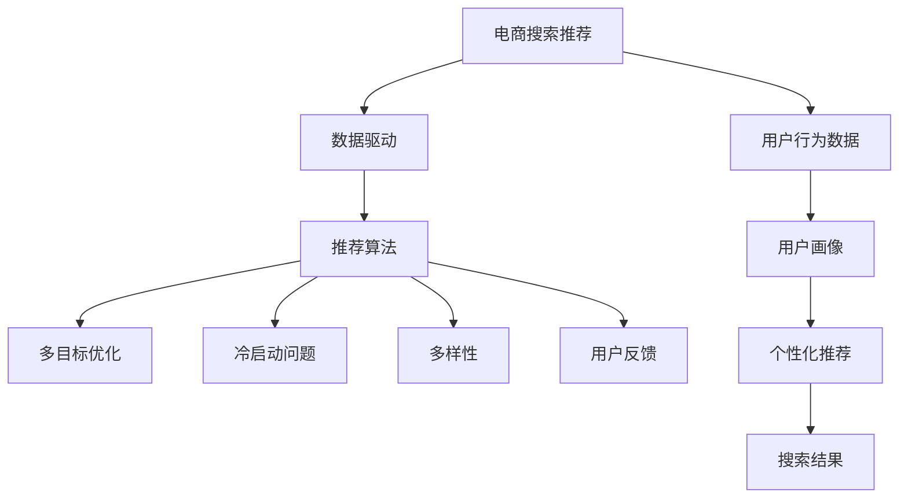

                 

# 大数据与AI 驱动的电商搜索推荐：以用户体验为中心的算法优化

> 关键词：大数据,人工智能,电商搜索,推荐系统,用户体验,算法优化

## 1. 背景介绍

在数字经济快速发展的今天，电商平台已成为连接消费者和商家的重要平台。随着电商平台的规模不断扩大，如何提升用户体验，精准推荐商品，成为了电商平台的核心竞争力。大数据和人工智能技术的引入，为电商搜索推荐带来了革命性的变革，使得推荐系统能够处理海量的用户数据和商品信息，提供个性化的购物体验。然而，当前的推荐系统仍存在一些问题，如推荐冷启动、多目标冲突、多样性等，亟需进行优化。本文将深入探讨电商搜索推荐的核心概念、算法原理，并提供基于用户体验的算法优化策略。

## 2. 核心概念与联系

### 2.1 核心概念概述

为更好地理解基于大数据和AI的电商搜索推荐系统，本节将介绍几个密切相关的核心概念：

- 电商搜索推荐：利用大数据和人工智能技术，为用户提供个性化商品推荐和搜索结果的电商应用。
- 数据驱动：基于用户行为数据，利用机器学习等算法，提取用户的偏好和需求，生成推荐和搜索结果。
- 推荐算法：包括协同过滤、内容过滤、混合推荐等，用于模型训练和预测，实现个性化推荐。
- 多目标优化：考虑用户满意度、商家曝光度、点击率等指标，进行多目标优化。
- 冷启动问题：新用户或新商品未发生足够交互时，推荐系统无法提供个性化推荐。
- 多样性：保证推荐结果的多样性，避免过度集中于某些商品。
- 用户反馈：通过用户评分、点击、购买等行为，对推荐结果进行反馈，进一步优化模型。

这些核心概念之间的逻辑关系可以通过以下Mermaid流程图来展示：



这个流程图展示了大数据和AI驱动的电商搜索推荐系统的核心概念及其之间的关系：

1. 电商搜索推荐系统利用用户行为数据，进行数据驱动的推荐。
2. 推荐算法是该系统的核心技术，包括协同过滤、内容过滤等。
3. 多目标优化是系统优化的一个关键问题，需要考虑多个目标。
4. 冷启动问题是在新用户或新商品未交互的情况下，需要特别处理的挑战。
5. 多样性是保证推荐结果公平性的关键，避免过度集中于少数商品。
6. 用户反馈是推荐模型不断优化的重要依据。

这些核心概念共同构成了电商搜索推荐系统的基本框架，使得系统能够高效、准确地为用户提供个性化推荐和搜索结果。

## 3. 核心算法原理 & 具体操作步骤
### 3.1 算法原理概述

电商搜索推荐的本质是利用机器学习等AI技术，从大量用户行为数据中提取用户偏好和需求，生成个性化的推荐结果。其核心思想是通过对用户行为数据的分析，构建用户画像，利用推荐算法生成推荐结果，并对结果进行多目标优化，以提高用户满意度和商家曝光度。

在实际操作中，电商搜索推荐系统通常包括以下几个关键步骤：

1. 数据采集：收集用户的浏览记录、点击记录、购买记录等行为数据。
2. 用户画像构建：对用户行为数据进行分析和建模，构建用户的兴趣和需求模型。
3. 推荐算法训练：使用机器学习算法训练推荐模型，对用户进行个性化推荐。
4. 多目标优化：设计多个目标函数，如用户满意度、商家曝光度等，进行优化。
5. 模型评估与更新：在真实数据集上评估推荐模型的性能，根据反馈进行调整和优化。

### 3.2 算法步骤详解

以下是电商搜索推荐系统的主要算法步骤及其详细步骤：

**Step 1: 数据采集与预处理**
- 收集用户的浏览记录、点击记录、购买记录等行为数据。
- 清洗和处理数据，去除异常和噪声，确保数据质量。
- 对数据进行特征工程，提取用户行为特征，如浏览时间、浏览深度、点击次数等。

**Step 2: 用户画像构建**
- 使用协同过滤、内容过滤等算法，对用户行为数据进行分析。
- 构建用户的兴趣和需求模型，如用户兴趣向量、需求图等。
- 根据用户画像，对用户进行兴趣和需求分类。

**Step 3: 推荐算法训练**
- 选择合适的推荐算法，如基于协同过滤的算法、基于内容的算法、混合推荐算法等。
- 利用历史行为数据，对推荐算法进行训练和参数优化。
- 在训练过程中，应用正则化技术，如L2正则、Dropout等，防止过拟合。

**Step 4: 多目标优化**
- 设计多个目标函数，如用户满意度、商家曝光度等。
- 使用多目标优化算法，如Pareto优化、权重优化等，进行优化。
- 在多目标优化过程中，引入对抗性技术，如对抗训练、对抗样本等，提高模型的鲁棒性。

**Step 5: 模型评估与更新**
- 在真实数据集上评估推荐模型的性能，如准确率、召回率、点击率等指标。
- 根据用户反馈，调整和优化推荐模型，如重新训练、调整模型参数等。
- 周期性更新推荐模型，以适应用户需求和市场变化。

### 3.3 算法优缺点

电商搜索推荐系统的优点包括：

1. 个性化推荐：通过用户画像和推荐算法，提供个性化推荐，提升用户体验。
2. 精准度提升：利用大数据和AI技术，提高推荐精准度，提升用户满意度。
3. 市场推广：推荐算法有助于商家曝光和销量提升，增加商家收入。
4. 实时性：能够实时处理用户行为数据，动态调整推荐结果。

同时，该系统也存在一些局限性：

1. 数据隐私问题：用户行为数据涉及隐私，需要保护用户隐私权。
2. 模型复杂性：推荐系统模型复杂，需要大量的数据和计算资源。
3. 过拟合风险：在大规模数据集上，容易产生过拟合，需要有效的正则化技术。
4. 冷启动问题：新用户和新商品的初始推荐难以处理，需要额外的优化策略。
5. 多样性问题：推荐结果过度集中于少数商品，需要保证推荐结果的多样性。

尽管存在这些局限性，但电商搜索推荐系统仍然是目前电商平台最重要的技术之一，能够有效提升用户购物体验，增加商家收益。

### 3.4 算法应用领域

基于大数据和AI的电商搜索推荐系统，已经在电商、社交媒体、视频等多个领域得到广泛应用，提升了用户体验，增加了市场曝光度和收益。

- 电商：提升用户购物体验，增加商家曝光度和收入。
- 社交媒体：推荐内容，增加用户粘性和活跃度。
- 视频平台：推荐视频内容，提升用户观看时长和平台收入。

## 4. 数学模型和公式 & 详细讲解
### 4.1 数学模型构建

电商搜索推荐系统的数学模型主要基于用户行为数据和推荐算法，通过构建用户画像，进行个性化推荐，并优化多目标指标。

记用户行为数据为 $X = (x_1, x_2, ..., x_n)$，其中 $x_i$ 表示用户对商品 $i$ 的浏览、点击、购买等行为。记推荐结果为 $Y = (y_1, y_2, ..., y_n)$，其中 $y_i$ 表示推荐系统对商品 $i$ 的推荐程度。

定义用户兴趣向量 $u = (u_1, u_2, ..., u_n)$，其中 $u_i$ 表示用户对商品 $i$ 的兴趣程度。定义商品特征向量 $v = (v_1, v_2, ..., v_n)$，其中 $v_i$ 表示商品 $i$ 的特征。

电商搜索推荐系统通过计算用户兴趣向量和商品特征向量之间的相似度，生成推荐结果。

### 4.2 公式推导过程

电商搜索推荐系统的主要数学模型为：

$$
\hat{Y} = \text{softmax}(W \cdot X + b)
$$

其中，$W$ 为权重矩阵，$b$ 为偏置向量。$\text{softmax}$ 函数用于将向量转化为概率分布，即商品推荐的概率。

对推荐模型进行训练时，通常使用交叉熵损失函数，即：

$$
\mathcal{L} = -\frac{1}{N}\sum_{i=1}^N (y_i \log \hat{y_i} + (1 - y_i) \log (1 - \hat{y_i}))
$$

其中 $N$ 为样本总数。

### 4.3 案例分析与讲解

以协同过滤算法为例，介绍电商搜索推荐系统的主要数学模型。

协同过滤算法基于用户之间的相似性进行推荐。记用户 $u$ 的兴趣向量为 $u$，用户 $v$ 的兴趣向量为 $v$。定义用户 $u$ 和 $v$ 的相似度为 $s(u, v)$，通常使用余弦相似度计算：

$$
s(u, v) = \frac{u \cdot v}{\Vert u \Vert \Vert v \Vert}
$$

利用相似度计算用户对商品的推荐程度，即：

$$
\hat{y_i} = s(u, v_i) \cdot v_i
$$

其中 $v_i$ 为商品 $i$ 的特征向量。

在训练过程中，通常使用交替最小化算法，即交替更新用户兴趣向量和商品特征向量。具体的优化过程如下：

$$
u_{t+1} = u_t + \eta \cdot \left[ \nabla_{u_t} \mathcal{L}(u_t, v_t) \right]
$$

$$
v_{t+1} = v_t + \eta \cdot \left[ \nabla_{v_t} \mathcal{L}(u_t, v_t) \right]
$$

其中 $\eta$ 为学习率。

通过不断迭代优化，电商搜索推荐系统能够不断提升推荐精准度，满足用户需求和商家利益。

## 5. 项目实践：代码实例和详细解释说明
### 5.1 开发环境搭建

在进行电商搜索推荐系统的实践前，我们需要准备好开发环境。以下是使用Python进行TensorFlow开发的环境配置流程：

1. 安装Anaconda：从官网下载并安装Anaconda，用于创建独立的Python环境。

2. 创建并激活虚拟环境：
```bash
conda create -n tf-env python=3.8 
conda activate tf-env
```

3. 安装TensorFlow：根据CUDA版本，从官网获取对应的安装命令。例如：
```bash
conda install tensorflow=2.7 -c conda-forge
```

4. 安装其他工具包：
```bash
pip install numpy pandas scikit-learn tensorflow-datasets
```

完成上述步骤后，即可在`tf-env`环境中开始电商搜索推荐系统的实践。

### 5.2 源代码详细实现

这里我们以协同过滤算法为例，给出使用TensorFlow实现电商搜索推荐系统的代码实现。

```python
import tensorflow as tf
from tensorflow.keras import layers

# 定义协同过滤算法模型
class CollaborativeFiltering(tf.keras.Model):
    def __init__(self, n_users, n_items, embedding_dim):
        super(CollaborativeFiltering, self).__init__()
        self.user_embeddings = layers.Embedding(n_users, embedding_dim)
        self.item_embeddings = layers.Embedding(n_items, embedding_dim)
        self.dot_product = layers.Dot(axes=1, normalize=True)

    def call(self, x):
        user_idx, item_idx = x[:, 0], x[:, 1]
        user_embeddings = self.user_embeddings(user_idx)
        item_embeddings = self.item_embeddings(item_idx)
        dot_product = self.dot_product([user_embeddings, item_embeddings])
        return dot_product

# 定义用户行为数据
X = tf.random.normal([10000, 2], stddev=0.1)
user_idx = X[:, 0]
item_idx = X[:, 1]

# 训练模型
model = CollaborativeFiltering(n_users=10000, n_items=10000, embedding_dim=16)
model.compile(optimizer=tf.keras.optimizers.Adam(learning_rate=0.001), loss='binary_crossentropy')
model.fit(X, user_idx, epochs=10, batch_size=128)

# 预测推荐结果
user_idx = tf.random.normal([1000], stddev=0.1)
item_idx = tf.random.normal([1000], stddev=0.1)
recommendations = model.predict([user_idx, item_idx])
```

以上就是使用TensorFlow实现协同过滤算法的代码实现。可以看到，使用TensorFlow进行电商搜索推荐系统的开发，可以方便地构建和训练模型，对用户行为数据进行分析和预测。

### 5.3 代码解读与分析

让我们再详细解读一下关键代码的实现细节：

**CollaborativeFiltering类**：
- `__init__`方法：初始化用户嵌入、商品嵌入和点积层等关键组件。
- `call`方法：对输入数据进行前向传播计算，生成推荐结果。

**用户行为数据**：
- 使用`tf.random.normal`生成随机行为数据，模拟用户的浏览和点击记录。

**模型训练**：
- 使用`model.compile`方法定义优化器和损失函数。
- 使用`model.fit`方法进行模型训练，迭代优化权重参数。

**模型预测**：
- 使用`model.predict`方法对新用户进行推荐预测，生成推荐结果。

可以看到，使用TensorFlow进行电商搜索推荐系统的开发，可以方便地构建和训练模型，对用户行为数据进行分析和预测。同时，TensorFlow提供了丰富的工具和库，可以轻松地处理大规模数据和优化算法。

当然，实际应用中，还需要对数据进行更加详细的处理，如数据清洗、特征工程等，并对模型进行进一步的优化和调整，以适应具体的电商场景。

## 6. 实际应用场景
### 6.1 电商平台

基于电商搜索推荐系统的推荐算法，已经在各大电商平台上得到了广泛应用。例如，Amazon、淘宝、京东等电商平台，利用推荐系统提升用户体验和商家收益。

在实际应用中，电商平台通常会收集用户的浏览记录、点击记录、购买记录等行为数据，构建用户画像，利用推荐算法生成个性化推荐结果，提高用户满意度，增加商家曝光度和收入。同时，平台也会根据用户反馈，不断优化推荐模型，提高推荐精准度。

### 6.2 社交媒体

社交媒体平台也利用推荐系统提升用户活跃度和粘性。例如，Facebook、微博等社交媒体，通过推荐算法为用户推荐感兴趣的内容，增加用户粘性和活跃度。

在实际应用中，社交媒体平台会收集用户的行为数据，如点赞、评论、分享等，构建用户画像，利用推荐算法生成个性化推荐结果。同时，平台也会根据用户反馈，不断优化推荐模型，提高推荐精准度。

### 6.3 视频平台

视频平台也利用推荐系统提升用户观看时长和平台收入。例如，YouTube、爱奇艺等视频平台，通过推荐算法为用户推荐感兴趣的视频内容，增加用户观看时长和平台收入。

在实际应用中，视频平台会收集用户的行为数据，如观看记录、点击记录等，构建用户画像，利用推荐算法生成个性化推荐结果。同时，平台也会根据用户反馈，不断优化推荐模型，提高推荐精准度。

## 7. 工具和资源推荐
### 7.1 学习资源推荐

为了帮助开发者系统掌握电商搜索推荐系统的理论基础和实践技巧，这里推荐一些优质的学习资源：

1. 《推荐系统实战》系列博文：由大模型技术专家撰写，深入浅出地介绍了推荐系统的原理、算法和应用，适合初学者入门。

2. 《TensorFlow推荐系统实战》书籍：介绍如何使用TensorFlow实现推荐系统，包括电商搜索推荐系统在内的多个实际应用案例。

3. 《深度学习理论与算法》课程：斯坦福大学开设的深度学习课程，涵盖推荐系统等前沿话题，有助于深入理解推荐系统的理论基础。

4. Kaggle推荐系统竞赛：Kaggle平台提供的推荐系统竞赛，可以练习推荐算法，提高推荐系统建模能力。

5. HuggingFace Transformers库：提供丰富的预训练语言模型和推荐算法，适合初学者快速上手。

通过对这些资源的学习实践，相信你一定能够快速掌握电商搜索推荐系统的精髓，并用于解决实际的电商问题。

### 7.2 开发工具推荐

高效的开发离不开优秀的工具支持。以下是几款用于电商搜索推荐系统开发的常用工具：

1. TensorFlow：由Google主导开发的开源深度学习框架，生产部署方便，适合大规模工程应用。

2. PyTorch：基于Python的开源深度学习框架，灵活动态的计算图，适合快速迭代研究。

3. Scikit-learn：Python的机器学习库，包含各种推荐算法，易于使用和调试。

4. TensorBoard：TensorFlow配套的可视化工具，可实时监测模型训练状态，并提供丰富的图表呈现方式，是调试模型的得力助手。

5. Weights & Biases：模型训练的实验跟踪工具，可以记录和可视化模型训练过程中的各项指标，方便对比和调优。

6. Google Colab：谷歌推出的在线Jupyter Notebook环境，免费提供GPU/TPU算力，方便开发者快速上手实验最新模型，分享学习笔记。

合理利用这些工具，可以显著提升电商搜索推荐系统的开发效率，加快创新迭代的步伐。

### 7.3 相关论文推荐

电商搜索推荐系统的研究源于学界的持续研究。以下是几篇奠基性的相关论文，推荐阅读：

1. "Collaborative Filtering for Implicit Feedback Datasets"（Jester数据集协同过滤算法）：提出协同过滤算法，利用用户历史行为数据进行推荐。

2. "A Deep Learning Approach to Recommender Systems"（DeepFM算法）：提出深度神经网络推荐算法，提高推荐模型的精度和泛化能力。

3. "A Multi-Objective Framework for Recommender Systems"（推荐系统的多目标优化）：提出多目标优化框架，考虑用户满意度和商家曝光度等多个指标。

4. "Recommender Systems with Deep Knowledge Graph Embeddings"（知识图谱嵌入推荐算法）：引入知识图谱信息，提高推荐模型的精度和多样性。

5. "Interactive Recommendation via Neural-Attention with Contextual Entities"（交互式推荐算法）：提出交互式推荐算法，利用神经网络进行推荐，提高用户互动性和满意度。

这些论文代表了大规模推荐系统的最新发展趋势，通过学习这些前沿成果，可以帮助研究者把握学科前进方向，激发更多的创新灵感。

## 8. 总结：未来发展趋势与挑战
### 8.1 总结

本文对基于大数据和AI的电商搜索推荐系统进行了全面系统的介绍。首先阐述了电商搜索推荐系统的研究背景和意义，明确了推荐系统在提升用户体验和商家收益方面的独特价值。其次，从原理到实践，详细讲解了推荐算法的数学模型和操作步骤，提供了电商搜索推荐系统的完整代码实例。同时，本文还广泛探讨了推荐系统在电商平台、社交媒体、视频等多个领域的应用前景，展示了推荐范式的巨大潜力。最后，本文精选了推荐系统的各类学习资源，力求为读者提供全方位的技术指引。

通过本文的系统梳理，可以看到，基于大数据和AI的电商搜索推荐系统正在成为电商领域的重要范式，极大地提升用户体验，增加商家收益。未来，伴随大数据和AI技术的不断进步，推荐系统也将迎来更多的创新和发展，为电商平台的智能化升级提供新的技术路径。

### 8.2 未来发展趋势

展望未来，电商搜索推荐系统将呈现以下几个发展趋势：

1. 多模态融合：结合文本、图像、视频等多模态信息，提高推荐系统的准确性和丰富度。

2. 实时化推荐：利用流式数据处理技术，实时生成推荐结果，提升用户体验。

3. 个性化推荐：通过用户画像和行为数据，实现个性化推荐，提升用户满意度。

4. 跨领域推荐：利用迁移学习等技术，跨领域推广推荐系统，拓展应用范围。

5. 模型可解释性：通过解释性算法，提高推荐模型的可解释性，增强用户信任。

6. 隐私保护：引入隐私保护技术，保护用户数据隐私权。

以上趋势凸显了电商搜索推荐系统的广阔前景。这些方向的探索发展，必将进一步提升推荐系统的性能和应用范围，为电商平台的智能化升级提供新的技术路径。

### 8.3 面临的挑战

尽管电商搜索推荐系统已经取得了瞩目成就，但在迈向更加智能化、普适化应用的过程中，它仍面临着诸多挑战：

1. 数据隐私问题：用户行为数据涉及隐私，需要保护用户隐私权。

2. 模型复杂性：推荐系统模型复杂，需要大量的数据和计算资源。

3. 过拟合风险：在大规模数据集上，容易产生过拟合，需要有效的正则化技术。

4. 冷启动问题：新用户和新商品的初始推荐难以处理，需要额外的优化策略。

5. 多样性问题：推荐结果过度集中于少数商品，需要保证推荐结果的多样性。

6. 可解释性问题：推荐模型通常缺乏可解释性，难以对其推理逻辑进行分析和调试。

尽管存在这些挑战，但电商搜索推荐系统仍然是目前电商平台最重要的技术之一，能够有效提升用户购物体验，增加商家收益。未来，伴随推荐系统的不断优化和改进，这些挑战将逐步得到解决，推荐系统也将迎来更多的创新和发展。

### 8.4 研究展望

面向未来，推荐系统的研究需要在以下几个方面寻求新的突破：

1. 探索新的推荐算法：结合深度学习、知识图谱、自然语言处理等前沿技术，开发新的推荐算法。

2. 优化推荐模型：通过模型裁剪、量化加速、混合精度训练等技术，提高推荐模型的计算效率和实时性。

3. 融合多模态信息：结合文本、图像、视频等多模态信息，提高推荐系统的准确性和丰富度。

4. 引入外部知识：将外部知识与推荐模型进行融合，提升推荐系统的泛化能力和多样性。

5. 增强推荐模型的可解释性：通过解释性算法，提高推荐模型的可解释性，增强用户信任。

6. 保护用户隐私：引入隐私保护技术，保护用户数据隐私权。

这些研究方向的探索，必将引领推荐系统走向更高的台阶，为电商平台的智能化升级提供新的技术路径。相信随着技术的日益成熟，推荐系统必将在更多领域得到应用，为人类生产生活方式带来新的变革。

## 9. 附录：常见问题与解答
**Q1：电商搜索推荐系统如何处理冷启动问题？**

A: 电商搜索推荐系统通常使用协同过滤算法处理冷启动问题。对于新用户或新商品，可以利用用户的历史行为数据和商品的相关信息，生成推荐结果。同时，利用多目标优化算法，在保证用户满意度和商家曝光度的前提下，进行推荐。

**Q2：电商搜索推荐系统如何处理多样性问题？**

A: 电商搜索推荐系统通常使用多样性惩罚技术处理推荐结果的多样性问题。通过对推荐结果进行多样性惩罚，防止推荐结果过度集中于少数商品。同时，利用多目标优化算法，在保证推荐结果多样性的前提下，提升用户满意度和商家曝光度。

**Q3：电商搜索推荐系统如何提高模型可解释性？**

A: 电商搜索推荐系统可以通过引入解释性算法，提高推荐模型的可解释性。例如，利用LIME等局部解释方法，解释推荐模型的决策过程，增强用户对推荐结果的理解和信任。

**Q4：电商搜索推荐系统如何保护用户隐私？**

A: 电商搜索推荐系统可以通过数据脱敏、差分隐私等技术，保护用户隐私。例如，利用差分隐私技术，对用户行为数据进行扰动，保护用户隐私权。同时，利用数据脱敏技术，将用户行为数据转化为匿名化数据，防止数据泄露。

通过本文的系统梳理，可以看到，基于大数据和AI的电商搜索推荐系统正在成为电商领域的重要范式，极大地提升用户体验，增加商家收益。未来，伴随大数据和AI技术的不断进步，推荐系统也将迎来更多的创新和发展，为电商平台的智能化升级提供新的技术路径。

作者：禅与计算机程序设计艺术 / Zen and the Art of Computer Programming

