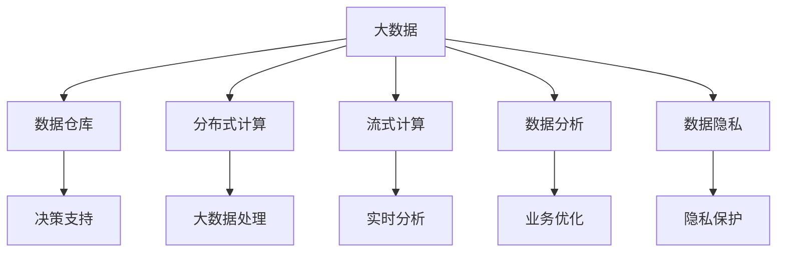

                 

# 大数据时代：人类计算的机遇与挑战

## 1. 背景介绍

### 1.1 问题由来

随着互联网的普及和数据采集技术的不断发展，全球数据量呈现爆炸式增长。据国际数据公司(IDC)预测，全球数据量将在2025年达到175ZB，其中85%以上的数据将由企业生成和存储。这些海量数据涵盖社交媒体、电子商务、金融交易、医疗健康等多个领域，为各行各业带来了前所未有的机遇和挑战。

数据驱动的决策分析、精准营销、个性化服务、智能制造等应用场景，正在改变人们的工作和生活方式。然而，如何高效地存储、处理、分析这些数据，提取其中的有用信息，并将其转化为实际价值，成为当今科技和工业领域亟需解决的问题。

### 1.2 问题核心关键点

数据量的激增为人类计算带来了巨大的机遇，同时也带来了前所未有的挑战。这些挑战主要包括数据存储、数据处理、数据分析和数据隐私等多个方面。

- **数据存储**：传统的数据存储方式如关系数据库、文件系统等已难以满足海量数据存储的需求。如何构建高效、可扩展、低成本的大数据存储体系，是大数据时代的关键技术之一。

- **数据处理**：传统的数据处理方式如批处理、实时流处理等已无法满足实时数据处理的要求。如何构建高效、可靠、低延迟的大数据处理平台，是实现数据实时分析的前提。

- **数据分析**：传统的数据分析方式如SQL查询、统计分析等已无法满足复杂数据分析的需求。如何构建高效、灵活、自适应的数据分析工具，是大数据时代的重要任务。

- **数据隐私**：海量数据的收集和分析涉及个人隐私、商业机密等敏感信息，如何保障数据隐私安全，防止数据滥用和泄漏，是大数据应用的核心伦理问题。

## 2. 核心概念与联系

### 2.1 核心概念概述

为更好地理解大数据时代人类计算的机遇与挑战，本节将介绍几个密切相关的核心概念：

- **大数据(Big Data)**：指超出传统数据处理工具和平台处理能力的数据集合，通常具有海量、多样、高速、实时等特征。大数据技术旨在通过分布式计算、流式计算等手段，高效处理和管理海量数据。

- **数据仓库(Data Warehouse)**：指通过ETL(Extract, Transform, Load)技术从多个数据源抽取、转换、加载数据，建立集中存储的数据平台，支持大规模数据分析和决策支持。

- **分布式计算(Distributed Computing)**：指通过多台计算机协同工作，共同完成大规模计算任务的技术。分布式计算可以提高计算效率、降低计算成本，支持大规模数据处理和分析。

- **流式计算(Streaming Computing)**：指对实时数据流进行连续、快速处理和分析的技术。流式计算可以支持实时数据监控、异常检测、实时决策等应用场景。

- **数据分析(Data Analytics)**：指对大规模数据进行统计、挖掘、分析和可视化的过程。数据分析可以帮助企业提取数据中的有用信息，支持业务决策和优化。

- **数据隐私(Data Privacy)**：指在数据收集、存储、传输和分析过程中，保障数据主体隐私权益和数据安全的技术和机制。数据隐私是大数据应用的重要伦理问题。

这些核心概念之间的逻辑关系可以通过以下Mermaid流程图来展示：



这个流程图展示了大数据时代人类计算的核心概念及其之间的关系：

1. 大数据通过分布式计算和流式计算等技术进行处理和分析，得到有价值的信息。
2. 数据仓库集中存储这些数据，支持大规模数据分析和决策支持。
3. 数据分析揭示数据中的规律和趋势，帮助企业优化业务。
4. 数据隐私保障在数据处理和分析过程中保护数据主体的权益。

这些概念共同构成了大数据时代人类计算的基础框架，使得海量数据得以被高效利用和分析，驱动创新发展。

## 3. 核心算法原理 & 具体操作步骤
### 3.1 算法原理概述

大数据时代的核心算法原理主要基于分布式计算和流式计算等技术，以支持海量数据的存储、处理和分析。其中，分布式计算和流式计算是大数据时代处理大规模数据的关键技术。

### 3.2 算法步骤详解

#### 3.2.1 分布式计算算法

分布式计算算法主要包括以下几个步骤：

1. **数据分片**：将大数据分成若干小片，分配到多个节点上进行并行处理。每个节点负责处理自己分到的数据片，并将结果合并。
2. **任务调度**：调度器将任务分配给各个节点，并监控节点状态，及时调整任务分配。
3. **数据合并**：将各个节点的处理结果进行合并，得到最终的数据结果。

分布式计算的核心思想是将任务分解成若干小任务，分配到多个节点上并行处理，从而提高计算效率。常见的分布式计算框架包括Hadoop、Spark等。

#### 3.2.2 流式计算算法

流式计算算法主要包括以下几个步骤：

1. **数据流采集**：实时采集数据流，并进行预处理和清洗。
2. **数据分片和窗口划分**：将数据流划分为若干小窗口，每个窗口内的数据进行并行处理。
3. **实时处理和分析**：在每个窗口内，对数据进行实时处理和分析，生成实时结果。
4. **数据存储和可视**：将实时结果存储在数据仓库中，并实时可视化和监控。

流式计算的核心思想是对实时数据流进行连续、快速处理和分析，支持实时决策和监控。常见的流式计算框架包括Storm、Flink等。

### 3.3 算法优缺点

分布式计算和流式计算各有优缺点：

**分布式计算的优点**：
1. 可扩展性高：可以方便地添加或移除计算节点，支持大规模数据处理。
2. 容错性好：单个节点故障不会影响整个系统，具有高可用性。
3. 计算能力强：可以处理大规模的计算任务，支持复杂的数据分析和建模。

**分布式计算的缺点**：
1. 通信开销大：节点之间需要频繁通信，导致性能瓶颈。
2. 调度复杂：调度器的设计和实现较为复杂，影响系统性能。
3. 数据合并复杂：数据片需要在不同节点上合并，可能导致数据冗余和数据丢失。

**流式计算的优点**：
1. 实时性强：可以实时处理数据流，支持实时分析和决策。
2. 延迟低：数据处理延迟较小，支持实时监控和预警。
3. 灵活性好：可以动态调整数据窗口大小，支持不同场景的数据分析。

**流式计算的缺点**：
1. 数据冗余高：数据窗口内数据需要重复处理，可能导致数据冗余。
2. 存储开销大：实时数据需要存储在数据仓库中，存储开销较大。
3. 数据一致性难以保证：实时数据处理可能存在数据一致性问题。

### 3.4 算法应用领域

分布式计算和流式计算在大数据时代的应用非常广泛，涵盖了数据存储、数据分析、实时监控等多个领域：

1. **数据存储**：分布式文件系统如HDFS、分布式数据库如HBase等，提供了高效、可扩展的大数据存储解决方案。
2. **数据分析**：分布式计算框架如Hadoop、Spark等，支持大规模数据分析和建模，支持SQL查询、机器学习等数据分析技术。
3. **实时监控**：流式计算框架如Storm、Flink等，支持实时数据监控和异常检测，广泛应用于金融交易、社交媒体等领域。
4. **实时推荐**：流式计算和机器学习技术结合，支持实时推荐系统和个性化广告，提高用户体验和业务价值。

## 4. 数学模型和公式 & 详细讲解 & 举例说明

### 4.1 数学模型构建

在大数据时代，数据分析和建模通常基于分布式计算和流式计算等技术。这里，我们以Hadoop MapReduce为例，介绍其数学模型构建。

假设有一大数据集$D$，需要对其进行分析和处理。分布式计算框架将数据分成若干小片，分配到多个节点上进行并行处理。每个节点分别处理自己的数据片，并将结果进行合并，最终得到整个数据集的处理结果。

**Map函数**：将输入数据进行映射，生成中间结果。形式化表示为：

$$
\text{Map}(x_i) = (k_i, v_i), \quad \forall x_i \in D
$$

其中$k_i$表示中间结果的键，$v_i$表示中间结果的值。

**Reduce函数**：将中间结果进行合并，生成最终结果。形式化表示为：

$$
\text{Reduce}((k_i, \{v_{i_j}\})) = r_k, \quad \forall k_i \in K
$$

其中$k_i$表示中间结果的键，$\{v_{i_j}\}$表示中间结果的值集合，$r_k$表示最终结果的键值对。

MapReduce的核心思想是将计算任务分解成若干小任务，在多个节点上并行处理，最终合并得到整个任务的结果。

### 4.2 公式推导过程

以下我们将对MapReduce的核心公式进行推导。

假设有一大数据集$D$，需要进行求和操作。首先将$D$分成若干小片，分配到多个节点上进行Map操作，得到中间结果集合$M$：

$$
M = \{(k_i, v_i) \mid \text{Map}(x_i) = (k_i, v_i), \forall x_i \in D
\}
$$

然后，在每个节点上对中间结果进行Reduce操作，生成最终结果$r$：

$$
r = \text{Reduce}(M) = \{(k_i, \sum_{j} v_{i_j}) \mid (k_i, \{v_{i_j}\}) \in M
\}
$$

其中$\sum_{j} v_{i_j}$表示$v_{i_j}$的求和结果。

通过MapReduce算法，可以对大规模数据集进行高效的并行处理和分析。

### 4.3 案例分析与讲解

下面以Hadoop分布式文件系统为例，介绍其核心数学模型和推导过程。

假设有一大量文件数据$F_1, F_2, ..., F_n$，需要将它们合并到一个大的文件中。Hadoop分布式文件系统将每个文件分成若干小片，分配到多个节点上进行Map操作，得到中间结果集合$M$：

$$
M = \{(k_i, v_i) \mid \text{Map}(F_j) = (k_i, v_i), \forall F_j \in F
\}
$$

然后，在每个节点上对中间结果进行Reduce操作，生成最终结果$r$：

$$
r = \text{Reduce}(M) = \{(k_i, \sum_{j} v_{i_j}) \mid (k_i, \{v_{i_j}\}) \in M
\}
$$

最终，将所有节点上的结果合并，得到大文件的合并结果。

## 5. 项目实践：代码实例和详细解释说明

### 5.1 开发环境搭建

在进行大数据项目实践前，我们需要准备好开发环境。以下是使用Python进行PySpark开发的开发环境配置流程：

1. 安装Anaconda：从官网下载并安装Anaconda，用于创建独立的Python环境。

2. 创建并激活虚拟环境：
```bash
conda create -n spark-env python=3.8 
conda activate spark-env
```

3. 安装PySpark：根据CUDA版本，从官网获取对应的安装命令。例如：
```bash
conda install pyarrow pydantic pytorch-gpu -c nvidia -c conda-forge
```

4. 安装各类工具包：
```bash
pip install numpy pandas scikit-learn matplotlib tqdm jupyter notebook ipython
```

完成上述步骤后，即可在`spark-env`环境中开始大数据项目实践。

### 5.2 源代码详细实现

下面我们以Hadoop分布式文件系统为例，给出使用PySpark进行数据合并的Python代码实现。

首先，定义数据文件：

```python
data_files = ['file1.txt', 'file2.txt', 'file3.txt']
```

然后，使用PySpark进行数据合并：

```python
from pyspark.sql import SparkSession
from pyspark.sql.functions import concat_ws

spark = SparkSession.builder.appName('Hadoop File Merge').getOrCreate()

# 创建DataFrame
data_frames = []
for file in data_files:
    df = spark.read.text(file)
    df = df.select('value')
    data_frames.append(df)

# 合并DataFrame
merged_df = data_frames[0].union(data_frames[1]).union(data_frames[2])

# 输出合并结果
merged_df.write.csv('merged.txt')
```

在上述代码中，我们首先创建了包含三个数据文件的列表。然后使用PySpark读取每个文件，将其转换为DataFrame，并使用`union`方法合并多个DataFrame，最终将合并结果输出为CSV文件。

### 5.3 代码解读与分析

让我们再详细解读一下关键代码的实现细节：

**数据文件定义**：
- `data_files`列表定义了需要进行合并的数据文件。

**数据读取和转换**：
- `spark.read.text(file)`方法读取每个文件，并将其转换为文本列。
- `df.select('value')`方法从文本列中提取出数据。
- `data_frames.append(df)`方法将每个DataFrame添加到`data_frames`列表中。

**数据合并**：
- `merged_df = data_frames[0].union(data_frames[1]).union(data_frames[2])`方法使用`union`方法合并多个DataFrame，得到最终结果。

**输出结果**：
- `merged_df.write.csv('merged.txt')`方法将合并结果输出为CSV文件。

以上代码展示了如何使用PySpark进行数据合并的基本流程。通过配置Spark环境，并使用PySpark的API，我们可以高效地处理大规模数据集，实现分布式计算和分析。

## 6. 实际应用场景

### 6.1 数据存储

#### 6.1.1 分布式文件系统

分布式文件系统如HDFS、Ceph等，是大数据时代数据存储的核心技术。这些系统通过将大文件分成若干小片，分配到多个节点上进行存储和访问，支持大规模数据的高效存储和访问。

- **HDFS**：Hadoop分布式文件系统，支持海量文件的分布式存储和访问，广泛应用于企业数据仓库和数据湖。
- **Ceph**：分布式文件系统，支持大规模数据的可靠存储和访问，广泛应用于云存储和分布式计算。

#### 6.1.2 分布式数据库

分布式数据库如HBase、Cassandra等，是大数据时代数据存储的另一重要技术。这些系统通过将数据分成若干小片，分配到多个节点上进行存储和查询，支持大规模数据的分布式存储和查询。

- **HBase**：分布式数据库，支持海量数据的分布式存储和查询，广泛应用于企业数据仓库和数据湖。
- **Cassandra**：分布式数据库，支持大规模数据的可靠存储和查询，广泛应用于云存储和分布式计算。

### 6.2 数据分析

#### 6.2.1 分布式计算

分布式计算框架如Hadoop、Spark等，是大数据时代数据分析的核心技术。这些框架通过将数据分成若干小片，分配到多个节点上进行并行处理和分析，支持大规模数据的分布式计算和分析。

- **Hadoop**：分布式计算框架，支持大规模数据的分布式计算和分析，广泛应用于企业数据仓库和数据湖。
- **Spark**：分布式计算框架，支持大规模数据的实时计算和分析，广泛应用于企业数据仓库和实时数据处理。

#### 6.2.2 流式计算

流式计算框架如Storm、Flink等，是大数据时代实时数据处理的核心技术。这些框架通过实时处理数据流，支持大规模数据的实时监控和分析。

- **Storm**：流式计算框架，支持实时数据流的分布式处理和分析，广泛应用于金融交易、社交媒体等领域。
- **Flink**：流式计算框架，支持实时数据流的分布式处理和分析，广泛应用于企业数据仓库和实时数据处理。

### 6.3 实时监控

#### 6.3.1 实时数据采集

实时数据采集是大数据时代实时监控的基础。通过各种传感器、日志文件、网络数据等，实时采集海量数据，为大数据处理和分析提供数据源。

- **传感器数据**：通过各种传感器实时采集环境数据、设备状态数据等。
- **日志文件**：通过日志文件实时采集应用程序、系统状态等数据。
- **网络数据**：通过网络数据实时采集用户行为、交易记录等数据。

#### 6.3.2 实时数据处理

实时数据处理是大数据时代实时监控的核心技术。通过分布式计算和流式计算等技术，实时处理海量数据，支持实时决策和监控。

- **分布式计算**：通过分布式计算框架如Hadoop、Spark等，实时处理海量数据，支持实时决策和监控。
- **流式计算**：通过流式计算框架如Storm、Flink等，实时处理海量数据，支持实时决策和监控。

## 7. 工具和资源推荐

### 7.1 学习资源推荐

为了帮助开发者系统掌握大数据时代的核心技术和方法，这里推荐一些优质的学习资源：

1. **《大数据时代：用数据说话》**：作者通过大量的实际案例，详细介绍了大数据时代的数据存储、处理和分析技术。

2. **《大数据技术》**：作者深入浅出地介绍了大数据技术的核心概念和应用场景。

3. **《分布式计算与大数据技术》**：作者详细讲解了分布式计算和大数据技术的基本原理和应用。

4. **《流式计算框架Storm与Flink》**：作者详细介绍了Storm和Flink等流式计算框架的核心思想和应用场景。

5. **《大数据分析工具与实践》**：作者详细讲解了大数据分析工具如Hadoop、Spark等的使用方法。

通过对这些资源的学习实践，相信你一定能够快速掌握大数据时代的核心技术和方法，并用于解决实际的数据分析问题。

### 7.2 开发工具推荐

高效的大数据项目开发离不开优秀的工具支持。以下是几款用于大数据项目开发的常用工具：

1. **Hadoop**：Apache基金会开源的分布式计算平台，支持大规模数据的分布式存储和计算。

2. **Spark**：Apache基金会开源的分布式计算平台，支持大规模数据的实时计算和分析。

3. **Storm**：Apache基金会开源的流式计算平台，支持实时数据流的分布式处理和分析。

4. **Flink**：Apache基金会开源的流式计算平台，支持实时数据流的分布式处理和分析。

5. **Hive**：基于Hadoop的分布式数据仓库平台，支持大规模数据的分布式查询和分析。

6. **Impala**：基于Hadoop的分布式SQL查询平台，支持大规模数据的实时查询和分析。

合理利用这些工具，可以显著提升大数据项目的开发效率，加快创新迭代的步伐。

### 7.3 相关论文推荐

大数据时代的核心技术得益于学界的持续研究。以下是几篇奠基性的相关论文，推荐阅读：

1. **《大数据时代》**：作者通过大量实证数据，详细介绍了大数据时代的核心技术和应用。

2. **《大数据技术：从数据存储到数据处理》**：作者详细讲解了大数据技术的核心概念和应用场景。

3. **《分布式计算与大数据技术》**：作者详细介绍了分布式计算和大数据技术的基本原理和应用。

4. **《流式计算框架Storm与Flink》**：作者详细介绍了Storm和Flink等流式计算框架的核心思想和应用场景。

5. **《大数据分析工具与实践》**：作者详细讲解了大数据分析工具如Hadoop、Spark等的使用方法。

这些论文代表了大数据时代的核心技术的研究脉络。通过学习这些前沿成果，可以帮助研究者把握学科前进方向，激发更多的创新灵感。

## 8. 总结：未来发展趋势与挑战

### 8.1 总结

本文对大数据时代人类计算的机遇与挑战进行了全面系统的介绍。首先阐述了大数据时代的背景和核心技术，明确了大数据存储、处理和分析在大数据时代的重要作用。其次，从原理到实践，详细讲解了分布式计算和流式计算的核心算法原理和操作步骤，给出了大数据项目开发的完整代码实例。同时，本文还广泛探讨了大数据时代的数据存储、数据分析、实时监控等多个应用场景，展示了大数据技术在各行业的广泛应用。此外，本文精选了大数据时代的技术学习资源和开发工具，力求为读者提供全方位的技术指引。

通过本文的系统梳理，可以看到，大数据时代人类计算面临的机遇与挑战并存。海量数据带来了前所未有的机遇，但也带来了前所未有的挑战。如何在数据存储、数据处理、数据分析、数据隐私等环节进行全面优化，是大数据时代亟需解决的重要问题。未来，伴随大数据技术的不断演进，人类计算能力将得到大幅提升，为各行各业带来更加智能、高效的计算解决方案。

### 8.2 未来发展趋势

展望未来，大数据时代人类计算将呈现以下几个发展趋势：

1. **云化**：随着云计算技术的不断发展，大数据存储和计算将更多依赖云服务，降低企业硬件和维护成本，提升计算效率。

2. **自动化**：大数据时代的自动化技术将进一步发展，通过机器学习和智能算法，自动化数据清洗、特征提取、模型训练等环节，提升数据处理效率。

3. **实时化**：大数据时代的实时处理技术将进一步发展，通过流式计算等技术，实现实时数据采集、分析和决策，提升业务响应速度。

4. **智能化**：大数据时代的智能化技术将进一步发展，通过人工智能和大数据技术的结合，提升数据分析和决策的智能化水平，支持更精准的业务预测和优化。

5. **边缘化**：大数据时代的边缘计算技术将进一步发展，通过在设备端进行数据处理和分析，降低数据传输和存储成本，提升数据处理效率。

以上趋势凸显了大数据时代人类计算的广阔前景。这些方向的探索发展，将进一步提升大数据技术的计算能力、处理效率和应用场景，驱动人类计算向更高层次迈进。

### 8.3 面临的挑战

尽管大数据时代人类计算技术已经取得了显著进展，但在迈向更加智能化、普适化应用的过程中，它仍面临着诸多挑战：

1. **数据存储成本高**：传统的数据存储方式如关系数据库、文件系统等已难以满足海量数据存储的需求，如何构建高效、可扩展的大数据存储体系，是大数据时代的关键技术之一。

2. **数据处理延迟大**：传统的数据处理方式如批处理、实时流处理等已无法满足实时数据处理的要求，如何构建高效、可靠、低延迟的大数据处理平台，是实现数据实时分析的前提。

3. **数据隐私风险高**：海量数据的收集和分析涉及个人隐私、商业机密等敏感信息，如何保障数据隐私安全，防止数据滥用和泄漏，是大数据应用的核心伦理问题。

4. **数据一致性难以保证**：分布式计算和流式计算过程中，数据一致性问题难以解决，如何保证数据一致性，是大数据处理的核心技术难题。

5. **技术复杂度高**：大数据技术涉及分布式计算、流式计算、机器学习等多方面的知识，如何高效整合和应用这些技术，是大数据时代的重要挑战。

这些挑战需要技术界和产业界的共同努力，才能在大数据时代实现计算能力的全面提升。只有通过不断创新和优化，才能应对大数据时代带来的各种挑战，充分发挥大数据技术的潜力。

### 8.4 研究展望

面对大数据时代人类计算所面临的诸多挑战，未来的研究需要在以下几个方面寻求新的突破：

1. **云存储优化**：通过云存储技术和分布式文件系统，构建高效、可扩展的大数据存储体系，降低数据存储成本，提升数据处理效率。

2. **分布式计算优化**：通过优化分布式计算框架，降低数据处理延迟，提高数据处理效率，支持实时数据处理和分析。

3. **数据隐私保护**：通过数据加密、访问控制等技术，保障数据隐私安全，防止数据滥用和泄漏，保护用户隐私权益。

4. **数据一致性保障**：通过数据一致性协议和分布式事务，保障数据一致性，确保数据处理和分析的准确性和可靠性。

5. **技术整合与优化**：通过整合和优化分布式计算、流式计算、机器学习等多方面的技术，提升大数据处理和分析的效率和效果。

这些研究方向将进一步推动大数据时代人类计算的进步，为各行各业带来更加智能、高效、安全的计算解决方案。相信伴随技术的不断演进和优化，大数据时代的人类计算能力将得到更大提升，驱动各行业的智能化转型和升级。

## 9. 附录：常见问题与解答

**Q1：大数据时代对数据存储和处理有哪些影响？**

A: 大数据时代对数据存储和处理带来了重大影响：

1. **存储需求激增**：随着数据量的激增，传统的关系数据库、文件系统等已无法满足海量数据存储的需求。需要构建高效、可扩展的大数据存储体系，如HDFS、Ceph等。

2. **处理需求提升**：传统的数据处理方式如批处理、实时流处理等已无法满足实时数据处理的要求。需要构建高效、可靠、低延迟的大数据处理平台，如Hadoop、Spark等。

3. **处理效率提升**：通过分布式计算和流式计算等技术，实现大规模数据的并行处理和实时分析，提升数据处理效率和效果。

4. **存储成本降低**：通过云存储技术，降低数据存储和维护成本，提升数据处理效率和效果。

**Q2：如何在数据处理中保障数据一致性？**

A: 在分布式计算和流式计算中，数据一致性问题难以解决，但可以通过以下方法保障数据一致性：

1. **分布式事务**：通过分布式事务协议，确保多个节点上的数据处理结果一致，防止数据不一致问题。

2. **一致性哈希算法**：通过一致性哈希算法，将数据分片分配到多个节点上，防止节点故障影响数据一致性。

3. **分布式锁**：通过分布式锁机制，防止多个节点同时访问同一数据，保证数据一致性。

4. **数据冗余**：通过数据冗余和备份机制，保障数据在节点故障时仍然可用，防止数据丢失。

**Q3：大数据时代如何优化计算资源使用？**

A: 在大数据时代，优化计算资源使用是提升系统性能和降低成本的重要手段：

1. **资源复用**：通过资源复用技术，优化计算资源的利用率，降低资源浪费。

2. **任务调度优化**：通过优化任务调度算法，提高任务执行效率，降低任务执行时间。

3. **资源隔离**：通过资源隔离技术，防止不同任务间的资源竞争，提高系统稳定性和性能。

4. **缓存机制**：通过缓存机制，减少重复计算和数据传输，提升系统响应速度和效率。

**Q4：大数据时代如何提升数据处理效率？**

A: 在大数据时代，提升数据处理效率是实现实时分析和决策的关键：

1. **分布式计算**：通过分布式计算框架如Hadoop、Spark等，实现大规模数据的并行处理和分析，提升数据处理效率。

2. **流式计算**：通过流式计算框架如Storm、Flink等，实现实时数据流的分布式处理和分析，支持实时决策和监控。

3. **数据压缩**：通过数据压缩技术，减少数据存储和传输的开销，提升数据处理效率。

4. **数据缓存**：通过数据缓存机制，减少重复计算和数据传输，提升数据处理效率和系统响应速度。

通过这些方法，可以在大数据时代实现高效的数据处理和分析，提升数据处理效率和效果。

**Q5：大数据时代如何保障数据隐私？**

A: 在大数据时代，保障数据隐私是数据应用的核心伦理问题：

1. **数据加密**：通过数据加密技术，防止数据在存储和传输过程中被泄露和篡改。

2. **访问控制**：通过访问控制技术，限制数据访问权限，防止未授权访问。

3. **匿名化处理**：通过数据匿名化技术，去除敏感信息，防止数据泄露。

4. **数据去标识化**：通过数据去标识化技术，将数据与个人身份分离，防止数据关联。

5. **隐私保护算法**：通过隐私保护算法，如差分隐私、联邦学习等，保护数据隐私安全。

这些方法可以有效地保障数据隐私安全，防止数据滥用和泄漏，保护用户隐私权益。

---

作者：禅与计算机程序设计艺术 / Zen and the Art of Computer Programming

