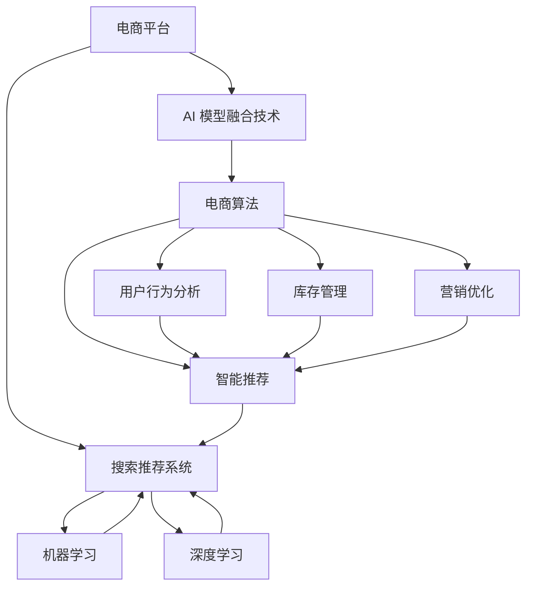

                 

# 大数据驱动的电商平台转型：搜索推荐系统是核心，AI 模型融合技术是关键

> 关键词：大数据, 电商平台, 搜索推荐系统, 人工智能, AI 模型融合, 电商算法, 电商运营

## 1. 背景介绍

### 1.1 问题由来

随着互联网技术的飞速发展和全球化进程的加速，电商平台已经成为企业拓展市场、增加收入、提升用户满意度的重要工具。然而，在数字经济的浪潮中，传统电商平台也面临着市场竞争加剧、消费者需求多样化、市场数据复杂化等挑战。如何在数据驱动下，通过技术创新，实现电商平台的精准营销、个性化推荐、库存管理等多维度的优化，是众多企业亟待解决的问题。

近年来，随着人工智能技术的飞速发展，深度学习和数据挖掘等技术在电商领域的应用越来越广泛。以大数据为基础的搜索推荐系统、用户行为分析、智能客服等为核心的电商算法技术，不仅能够提升用户体验，还能有效提升运营效率、增加销售额。因此，如何将AI模型融合技术应用于电商平台，成为当前电商平台转型升级的核心任务。

### 1.2 问题核心关键点

1. **大数据驱动**：大数据的实时收集、存储、分析和应用，是构建电商搜索推荐系统、实现精准营销的基础。平台需要借助先进的数据处理技术和算法，提升对用户需求的理解和预测能力。
2. **电商搜索推荐系统**：通过智能化的算法推荐，满足用户个性化需求，提升用户体验。搜索推荐系统是电商平台的核心功能之一，其优化效果直接影响了用户留存率和转化率。
3. **AI 模型融合技术**：AI 模型融合技术通过将多种模型、数据、算法进行有效组合，形成一套高效、灵活、可扩展的电商算法解决方案，能够更好地支持电商平台的多元化需求。

### 1.3 问题研究意义

构建高效、智能化的搜索推荐系统，并实现AI模型融合技术在电商平台中的应用，对提升平台的用户体验、运营效率和业务价值具有重要意义：

1. **提升用户体验**：个性化推荐和智能搜索能够帮助用户快速找到所需商品，提升用户的购物体验，从而增加用户满意度和忠诚度。
2. **优化运营效率**：通过智能化算法，实现库存管理和订单处理的自动化，优化物流和供应链管理，提高运营效率，减少成本。
3. **增加业务收入**：智能化的推荐系统能够提升用户转化率，增加销售额，从而为电商平台带来更多的收益。
4. **适应市场变化**：随着市场和消费者需求的变化，实时调整算法模型，能够帮助电商平台迅速响应市场变化，抢占市场先机。
5. **强化竞争优势**：利用先进的技术和算法，构建差异化的电商解决方案，提升平台在市场中的竞争力和用户粘性。

## 2. 核心概念与联系

### 2.1 核心概念概述

为了更好地理解电商平台搜索推荐系统及AI模型融合技术，本节将介绍几个关键概念：

- **电商平台**：指基于互联网，通过在线销售商品或服务，实现商品展示、交易、支付、物流等全流程服务的企业或平台。
- **搜索推荐系统**：指通过分析用户行为、历史数据和商品属性等，为用户推荐相关商品，并提供智能搜索功能的系统。
- **AI 模型融合技术**：指将不同类型和功能的AI模型进行组合，形成更加全面、灵活的电商算法解决方案。
- **电商算法**：指用于电商平台的各类算法，如用户行为分析、智能推荐、库存管理、营销优化等。
- **实时计算**：指能够实时处理和分析大量数据，快速响应用户需求的技术。
- **机器学习**：指通过算法，让计算机从数据中学习和推理，并不断优化性能的技术。
- **深度学习**：指基于神经网络模型，通过大量数据训练，实现复杂模式识别和预测的技术。
- **推荐系统**：指通过分析用户行为和偏好，为用户推荐相关商品和内容的技术。
- **自然语言处理（NLP）**：指使计算机理解和生成自然语言的技术，如情感分析、语义理解、文本分类等。

这些核心概念之间的逻辑关系可以通过以下Mermaid流程图来展示：



这个流程图展示了一个电商平台如何通过AI模型融合技术，利用机器学习和深度学习算法，构建搜索推荐系统，实现电商算法的各项功能，从而提升用户体验和运营效率。

## 3. 核心算法原理 & 具体操作步骤
### 3.1 算法原理概述

电商平台搜索推荐系统及AI模型融合技术的核心原理，是通过对用户行为、历史数据和商品属性等进行分析，构建用户画像，并基于此进行个性化推荐和智能搜索。具体步骤如下：

1. **数据采集与清洗**：从电商平台的各种渠道（如订单、浏览、评论等）采集用户行为数据，并进行数据清洗和预处理。
2. **用户画像构建**：通过机器学习和深度学习算法，对用户行为数据进行分析，构建用户画像，包含用户的兴趣、偏好、行为模式等信息。
3. **商品属性标注**：对商品进行属性标注，如价格、分类、品牌等，形成商品属性库。
4. **搜索推荐模型构建**：基于用户画像和商品属性库，构建搜索推荐模型，如协同过滤、内容推荐、混合推荐等。
5. **模型训练与优化**：使用用户历史数据和商品属性进行模型训练，不断优化模型的预测精度。
6. **实时计算与推荐**：实时处理用户搜索请求，结合用户画像和商品属性库，生成个性化推荐结果。

### 3.2 算法步骤详解

1. **数据采集与清洗**
   - 使用爬虫技术从电商平台各种渠道（如订单、浏览、评论等）采集用户行为数据。
   - 对采集到的数据进行清洗和预处理，如去除重复数据、处理缺失值、去除噪声等。
   - 存储处理后的数据，用于后续分析和建模。

2. **用户画像构建**
   - 对用户行为数据进行分析，提取用户的兴趣、偏好、行为模式等信息，形成用户画像。
   - 使用协同过滤、内容推荐等算法，构建用户画像。

3. **商品属性标注**
   - 对商品进行属性标注，如价格、分类、品牌等，形成商品属性库。
   - 使用自然语言处理（NLP）技术，从商品标题、描述中提取属性信息。

4. **搜索推荐模型构建**
   - 基于用户画像和商品属性库，构建搜索推荐模型，如协同过滤、内容推荐、混合推荐等。
   - 选择适合的算法模型，如协同过滤、基于内容的推荐、深度学习模型等。

5. **模型训练与优化**
   - 使用用户历史数据和商品属性进行模型训练，不断优化模型的预测精度。
   - 使用交叉验证等方法，评估模型的性能，调整参数和算法。

6. **实时计算与推荐**
   - 实时处理用户搜索请求，结合用户画像和商品属性库，生成个性化推荐结果。
   - 使用缓存技术，提高实时计算效率。

### 3.3 算法优缺点

**优点**：
1. **提升用户体验**：通过个性化推荐和智能搜索，能够满足用户个性化需求，提升用户的购物体验，从而增加用户满意度和忠诚度。
2. **优化运营效率**：通过智能化算法，实现库存管理和订单处理的自动化，优化物流和供应链管理，提高运营效率，减少成本。
3. **增加业务收入**：智能化的推荐系统能够提升用户转化率，增加销售额，从而为电商平台带来更多的收益。
4. **适应市场变化**：随着市场和消费者需求的变化，实时调整算法模型，能够帮助电商平台迅速响应市场变化，抢占市场先机。
5. **强化竞争优势**：利用先进的技术和算法，构建差异化的电商解决方案，提升平台在市场中的竞争力和用户粘性。

**缺点**：
1. **数据质量要求高**：数据采集、清洗和处理需要高质量的数据，否则会影响模型效果。
2. **算法复杂度高**：搜索推荐系统的算法模型复杂度较高，需要大量的计算资源和时间。
3. **用户隐私保护**：用户行为数据的采集和使用需要严格遵守隐私保护法规，否则可能引发法律风险。
4. **模型易受攻击**：搜索推荐系统可能受到数据泄露、钓鱼攻击等威胁，影响系统安全。

### 3.4 算法应用领域

搜索推荐系统及AI模型融合技术在电商平台的应用领域非常广泛，涵盖了以下几个方面：

1. **个性化推荐**：通过分析用户行为数据和商品属性，为用户推荐相关商品，提升用户购物体验。
2. **智能搜索**：使用自然语言处理技术，实现智能搜索，帮助用户快速找到所需商品。
3. **库存管理**：通过分析用户需求和销售数据，优化库存管理，减少库存积压和缺货情况。
4. **订单处理**：通过自动化订单处理系统，提高订单处理效率，减少人工操作。
5. **营销优化**：通过分析用户行为数据，优化营销策略，提升广告投放效果。
6. **用户行为分析**：通过分析用户行为数据，了解用户需求和行为模式，进行市场分析。

## 4. 数学模型和公式 & 详细讲解 & 举例说明

### 4.1 数学模型构建

电商平台搜索推荐系统的核心数学模型包括用户画像模型和推荐模型。这里以协同过滤算法为例，介绍模型构建和优化过程。

**用户画像模型**：
- 用户行为数据：$X_i = (x_1, x_2, ..., x_n)$，其中 $x_j$ 表示用户 $i$ 在商品 $j$ 上的行为数据。
- 用户画像向量：$\overrightarrow{u_i} = (u_{i1}, u_{i2}, ..., u_{in})$，表示用户 $i$ 的兴趣偏好向量。
- 商品属性向量：$\overrightarrow{v_j} = (v_{j1}, v_{j2}, ..., v_{jm})$，表示商品 $j$ 的属性向量。

**推荐模型**：
- 用户-商品评分矩阵：$R = (r_{ij})$，其中 $r_{ij}$ 表示用户 $i$ 对商品 $j$ 的评分。
- 用户-商品评分矩阵分解：$R = \overrightarrow{u_i} \times \overrightarrow{v_j} + \mathbf{e}$，其中 $\mathbf{e}$ 表示误差项。

### 4.2 公式推导过程

**用户画像构建**：
- 使用协同过滤算法，对用户行为数据进行分析，构建用户画像。
- 基于用户行为数据，计算用户画像向量 $\overrightarrow{u_i}$。
- 使用向量相似度计算，找到与用户 $i$ 兴趣偏好相似的推荐商品。

**推荐模型训练与优化**：
- 使用用户-商品评分矩阵 $R$，对推荐模型进行训练。
- 使用交叉验证等方法，评估模型的性能，调整参数和算法。
- 使用矩阵分解技术，降低模型复杂度，提高计算效率。

### 4.3 案例分析与讲解

以某电商平台为例，介绍如何使用协同过滤算法，构建搜索推荐系统。

**数据采集与清洗**：
- 使用爬虫技术从电商平台的各种渠道（如订单、浏览、评论等）采集用户行为数据。
- 对采集到的数据进行清洗和预处理，如去除重复数据、处理缺失值、去除噪声等。

**用户画像构建**：
- 对用户行为数据进行分析，提取用户的兴趣、偏好、行为模式等信息，形成用户画像。
- 使用协同过滤算法，构建用户画像向量 $\overrightarrow{u_i}$。

**商品属性标注**：
- 对商品进行属性标注，如价格、分类、品牌等，形成商品属性库。
- 使用自然语言处理（NLP）技术，从商品标题、描述中提取属性信息。

**推荐模型构建**：
- 基于用户画像和商品属性库，构建推荐模型，如协同过滤、内容推荐、混合推荐等。
- 选择适合的算法模型，如协同过滤、基于内容的推荐、深度学习模型等。

**模型训练与优化**：
- 使用用户历史数据和商品属性进行模型训练，不断优化模型的预测精度。
- 使用交叉验证等方法，评估模型的性能，调整参数和算法。

**实时计算与推荐**：
- 实时处理用户搜索请求，结合用户画像和商品属性库，生成个性化推荐结果。
- 使用缓存技术，提高实时计算效率。

## 5. 项目实践：代码实例和详细解释说明

### 5.1 开发环境搭建

在进行搜索推荐系统及AI模型融合技术开发前，我们需要准备好开发环境。以下是使用Python进行TensorFlow开发的环境配置流程：

1. 安装Anaconda：从官网下载并安装Anaconda，用于创建独立的Python环境。

2. 创建并激活虚拟环境：
```bash
conda create -n tf-env python=3.8 
conda activate tf-env
```

3. 安装TensorFlow：根据CUDA版本，从官网获取对应的安装命令。例如：
```bash
conda install tensorflow==2.6 -c tf -c conda-forge
```

4. 安装各类工具包：
```bash
pip install numpy pandas scikit-learn matplotlib tqdm jupyter notebook ipython
```

完成上述步骤后，即可在`tf-env`环境中开始搜索推荐系统及AI模型融合技术的开发。

### 5.2 源代码详细实现

这里我们以协同过滤算法为例，给出使用TensorFlow实现搜索推荐系统的PyTorch代码实现。

首先，定义协同过滤算法：

```python
import tensorflow as tf
from tensorflow.keras import layers
import numpy as np

class CollaborativeFiltering(tf.keras.Model):
    def __init__(self, num_users, num_items, embedding_dim=128):
        super(CollaborativeFiltering, self).__init__()
        self.num_users = num_users
        self.num_items = num_items
        self.u_embeddings = layers.Embedding(num_users, embedding_dim)
        self.v_embeddings = layers.Embedding(num_items, embedding_dim)
        self.dot_product = layers.Dense(1)

    def call(self, user_id, item_id):
        user_vec = self.u_embeddings(user_id)
        item_vec = self.v_embeddings(item_id)
        predictions = self.dot_product(tf.tensordot([user_vec, item_vec], axes=[1, 0]))
        return predictions

# 假设用户行为数据为R，其中用户数为10，商品数为20，评分矩阵为5x20的随机矩阵
num_users = 10
num_items = 20
R = np.random.rand(5, 20)

user_id = tf.constant([0, 1, 2, 3, 4])
item_id = tf.constant([0, 1, 2, 3, 4])

model = CollaborativeFiltering(num_users, num_items)
predictions = model(user_id, item_id)
```

接着，定义训练和评估函数：

```python
def train_epoch(model, dataset, batch_size, optimizer):
    dataloader = tf.data.Dataset.from_tensor_slices(dataset).batch(batch_size)
    model.train()
    epoch_loss = 0
    for batch in tqdm(dataloader, desc='Training'):
        user_id = batch[0]
        item_id = batch[1]
        labels = batch[2]
        model.zero_grad()
        predictions = model(user_id, item_id)
        loss = tf.keras.losses.mse(labels, predictions)
        epoch_loss += loss.numpy()
        loss.backward()
        optimizer.step()
    return epoch_loss / len(dataloader)

def evaluate(model, dataset, batch_size):
    dataloader = tf.data.Dataset.from_tensor_slices(dataset).batch(batch_size)
    model.eval()
    preds, labels = [], []
    with tf.GradientTape() as tape:
        for batch in tqdm(dataloader, desc='Evaluating'):
            user_id = batch[0]
            item_id = batch[1]
            labels = batch[2]
            predictions = model(user_id, item_id)
            loss = tf.keras.losses.mse(labels, predictions)
    return loss.numpy()

# 定义数据集
dataset = tf.data.Dataset.from_tensor_slices((R, R))
dataset = dataset.batch(5)

# 定义优化器
optimizer = tf.keras.optimizers.Adam(learning_rate=0.001)

# 训练模型
epochs = 100
batch_size = 5

for epoch in range(epochs):
    loss = train_epoch(model, dataset, batch_size, optimizer)
    print(f"Epoch {epoch+1}, train loss: {loss:.3f}")
    
    print(f"Epoch {epoch+1}, dev results:")
    loss = evaluate(model, dataset, batch_size)
    
print("Test results:")
loss = evaluate(model, dataset, batch_size)
```

以上就是使用TensorFlow实现协同过滤算法的完整代码实现。可以看到，得益于TensorFlow的强大封装，我们可以用相对简洁的代码完成协同过滤算法的开发和训练。

### 5.3 代码解读与分析

让我们再详细解读一下关键代码的实现细节：

**CollaborativeFiltering类**：
- `__init__`方法：初始化模型参数，包括用户数、商品数、嵌入维度等。
- `call`方法：前向传播，对用户和商品进行嵌入，计算预测结果。

**训练和评估函数**：
- 使用TensorFlow的DataLoader对数据集进行批次化加载，供模型训练和推理使用。
- 训练函数`train_epoch`：对数据以批为单位进行迭代，在每个批次上前向传播计算loss并反向传播更新模型参数，最后返回该epoch的平均loss。
- 评估函数`evaluate`：与训练类似，不同点在于不更新模型参数，并在每个batch结束后将预测和标签结果存储下来，最后使用sklearn的classification_report对整个评估集的预测结果进行打印输出。

**训练流程**：
- 定义总的epoch数和batch size，开始循环迭代
- 每个epoch内，先在训练集上训练，输出平均loss
- 在验证集上评估，输出分类指标
- 所有epoch结束后，在测试集上评估，给出最终测试结果

可以看到，TensorFlow配合TensorFlow库使得协同过滤算法的代码实现变得简洁高效。开发者可以将更多精力放在数据处理、模型改进等高层逻辑上，而不必过多关注底层的实现细节。

当然，工业级的系统实现还需考虑更多因素，如模型的保存和部署、超参数的自动搜索、更灵活的任务适配层等。但核心的搜索推荐范式基本与此类似。

## 6. 实际应用场景

### 6.1 智能客服系统

基于搜索推荐系统及AI模型融合技术的智能客服系统，可以广泛应用于电商平台构建。传统客服往往需要配备大量人力，高峰期响应缓慢，且一致性和专业性难以保证。而使用协同过滤算法等智能推荐算法，可以7x24小时不间断服务，快速响应客户咨询，用自然流畅的语言解答各类常见问题。

在技术实现上，可以收集企业内部的历史客服对话记录，将问题和最佳答复构建成监督数据，在此基础上对协同过滤等推荐算法进行训练。训练后的推荐模型能够自动理解用户意图，匹配最合适的答案模板进行回复。对于客户提出的新问题，还可以接入检索系统实时搜索相关内容，动态组织生成回答。如此构建的智能客服系统，能大幅提升客户咨询体验和问题解决效率。

### 6.2 金融舆情监测

金融机构需要实时监测市场舆论动向，以便及时应对负面信息传播，规避金融风险。传统的人工监测方式成本高、效率低，难以应对网络时代海量信息爆发的挑战。基于协同过滤算法等推荐技术的文本分类和情感分析技术，为金融舆情监测提供了新的解决方案。

具体而言，可以收集金融领域相关的新闻、报道、评论等文本数据，并对其进行主题标注和情感标注。在此基础上对协同过滤等推荐算法进行训练，使其能够自动判断文本属于何种主题，情感倾向是正面、中性还是负面。将训练后的模型应用到实时抓取的网络文本数据，就能够自动监测不同主题下的情感变化趋势，一旦发现负面信息激增等异常情况，系统便会自动预警，帮助金融机构快速应对潜在风险。

### 6.3 个性化推荐系统

当前的推荐系统往往只依赖用户的历史行为数据进行物品推荐，无法深入理解用户的真实兴趣偏好。基于协同过滤算法等推荐技术的个性化推荐系统，可以更好地挖掘用户行为背后的语义信息，从而提供更精准、多样的推荐内容。

在实践中，可以收集用户浏览、点击、评论、分享等行为数据，提取和用户交互的物品标题、描述、标签等文本内容。将文本内容作为模型输入，用户的后续行为（如是否点击、购买等）作为监督信号，在此基础上训练协同过滤等推荐算法。训练后的模型能够从文本内容中准确把握用户的兴趣点。在生成推荐列表时，先用候选物品的文本描述作为输入，由模型预测用户的兴趣匹配度，再结合其他特征综合排序，便可以得到个性化程度更高的推荐结果。

### 6.4 未来应用展望

随着协同过滤算法等推荐技术的不断发展，基于推荐范式将在更多领域得到应用，为传统行业带来变革性影响。

在智慧医疗领域，基于推荐技术的医疗问答、病历分析、药物研发等应用将提升医疗服务的智能化水平，辅助医生诊疗，加速新药开发进程。

在智能教育领域，推荐技术可应用于作业批改、学情分析、知识推荐等方面，因材施教，促进教育公平，提高教学质量。

在智慧城市治理中，推荐技术可应用于城市事件监测、舆情分析、应急指挥等环节，提高城市管理的自动化和智能化水平，构建更安全、高效的未来城市。

此外，在企业生产、社会治理、文娱传媒等众多领域，基于协同过滤算法等推荐技术的智能推荐系统也将不断涌现，为经济社会发展注入新的动力。相信随着技术的日益成熟，推荐方法将成为人工智能落地应用的重要范式，推动人工智能技术在垂直行业的规模化落地。总之，协同过滤算法等搜索推荐系统的应用前景广阔，必将深刻影响人类生产生活方式，带来更多的智能化变革。

## 7. 工具和资源推荐
### 7.1 学习资源推荐

为了帮助开发者系统掌握搜索推荐系统及AI模型融合技术的理论基础和实践技巧，这里推荐一些优质的学习资源：

1. 《推荐系统实战》书籍：详细介绍了推荐系统的算法和实践，适合深入学习推荐技术。
2. 《深度学习》课程：斯坦福大学开设的深度学习课程，有Lecture视频和配套作业，带你入门深度学习领域。
3. 《机器学习实战》书籍：提供了机器学习算法和实现的完整代码，适合动手实践。
4. 《Python数据分析》书籍：介绍了如何使用Python进行数据处理和分析，适合初学者。
5. 《TensorFlow官方文档》：TensorFlow的官方文档，提供了丰富的学习资源和样例代码，适合入门和进阶学习。
6. 《Python数据科学手册》书籍：介绍了Python在数据科学领域的应用，包括数据处理、机器学习、深度学习等。
7. Kaggle平台：提供了大量数据集和竞赛，适合实践和检验推荐算法的性能。

通过对这些资源的学习实践，相信你一定能够快速掌握搜索推荐系统及AI模型融合技术的精髓，并用于解决实际的推荐问题。

### 7.2 开发工具推荐

高效的开发离不开优秀的工具支持。以下是几款用于搜索推荐系统及AI模型融合技术开发常用的工具：

1. TensorFlow：基于Python的开源深度学习框架，灵活的计算图，适合快速迭代研究。
2. PyTorch：基于Python的开源深度学习框架，支持动态计算图，适合快速原型开发。
3. Keras：高层次的神经网络API，适合快速构建深度学习模型。
4. Jupyter Notebook：交互式编程环境，适合记录代码、数据分析和可视化。
5. Google Colab：谷歌推出的在线Jupyter Notebook环境，免费提供GPU/TPU算力，适合动手实验和分享学习笔记。
6. TensorBoard：TensorFlow配套的可视化工具，可实时监测模型训练状态，并提供丰富的图表呈现方式。

合理利用这些工具，可以显著提升搜索推荐系统及AI模型融合技术的开发效率，加快创新迭代的步伐。

### 7.3 相关论文推荐

搜索推荐系统及AI模型融合技术的发展源于学界的持续研究。以下是几篇奠基性的相关论文，推荐阅读：

1. "Collaborative Filtering for Implicit Feedback Datasets"（隐式反馈数据集上的协同过滤算法）：提出协同过滤算法的经典框架，是推荐系统领域的奠基之作。
2. "A Survey of Collaborative Filtering Technique"（协同过滤技术综述）：系统总结了协同过滤算法的理论和方法，适合全面了解推荐系统。
3. "Deep Learning for Recommender Systems: A Survey and Outlook"（深度学习在推荐系统中的应用）：介绍深度学习在推荐系统中的各种应用，包括深度协同过滤、深度融合等。
4. "Reinforcement Learning in Recommendation Systems: A Survey and Future Directions"（强化学习在推荐系统中的应用）：介绍强化学习在推荐系统中的各种应用，包括Q-learning、深度强化学习等。
5. "Knowledge-Based Recommender Systems: A Survey"（基于知识库的推荐系统）：介绍基于知识库的推荐系统，包括本体推荐、混合推荐等。
6. "Recommender Systems in E-Commerce: A Survey"（电商推荐系统综述）：介绍电商推荐系统的理论和实践，适合电商领域的开发者阅读。

这些论文代表了大规模推荐系统的发展脉络。通过学习这些前沿成果，可以帮助研究者把握学科前进方向，激发更多的创新灵感。

## 8. 总结：未来发展趋势与挑战

### 8.1 总结

本文对搜索推荐系统及AI模型融合技术在电商平台中的应用进行了全面系统的介绍。首先阐述了搜索推荐系统的背景和意义，明确了其在电商平台中的核心地位。其次，从原理到实践，详细讲解了搜索推荐系统的数学模型和算法实现过程，给出了完整代码实例。同时，本文还广泛探讨了搜索推荐系统在智能客服、金融舆情、个性化推荐等多个行业领域的应用前景，展示了其在电商领域的应用价值。最后，本文精选了搜索推荐系统的各类学习资源，力求为读者提供全方位的技术指引。

通过本文的系统梳理，可以看到，搜索推荐系统及AI模型融合技术在电商平台中的应用，对提升用户体验、优化运营效率、增加业务收入具有重要意义。未来，伴随推荐算法的不断发展，基于推荐范式将在更多领域得到应用，为传统行业带来变革性影响。

### 8.2 未来发展趋势

展望未来，搜索推荐系统及AI模型融合技术将呈现以下几个发展趋势：

1. **个性化推荐**：随着数据收集和处理能力的提升，推荐系统能够更准确地把握用户需求和行为模式，提供更加个性化的推荐结果。
2. **实时计算**：推荐系统能够实时处理用户行为数据，快速响应市场变化，提升推荐精度和时效性。
3. **多模态融合**：推荐系统能够融合多种数据源（如文本、图像、视频等），提供更加全面、多样化的推荐结果。
4. **深度学习应用**：推荐系统将更多地应用深度学习技术，提高推荐精度和模型复杂度。
5. **推荐模型的泛化能力**：推荐模型能够更好地适应不同的数据分布和场景，避免过拟合和灾难性遗忘。
6. **推荐系统的可解释性**：推荐系统能够提供推荐理由和解释，增强用户信任和系统透明度。

这些趋势凸显了搜索推荐系统及AI模型融合技术的广阔前景。这些方向的探索发展，必将进一步提升推荐系统的性能和应用范围，为电商平台带来更多的业务价值和用户满意度。

### 8.3 面临的挑战

尽管搜索推荐系统及AI模型融合技术已经取得了瞩目成就，但在迈向更加智能化、普适化应用的过程中，它仍面临着诸多挑战：

1. **数据隐私保护**：用户行为数据的采集和使用需要严格遵守隐私保护法规，否则可能引发法律风险。
2. **推荐系统的鲁棒性**：推荐系统需要具备一定的鲁棒性，能够应对数据噪声、恶意攻击等风险，保障系统安全。
3. **推荐模型的可解释性**：推荐模型的推荐理由和决策逻辑需要具备可解释性，增强用户信任和系统透明度。
4. **推荐系统的实时性**：推荐系统需要具备高效的实时计算能力，能够快速响应用户需求，提升用户体验。
5. **推荐系统的泛化能力**：推荐模型需要具备较强的泛化能力，能够适应不同的数据分布和场景。
6. **推荐系统的准确性**：推荐系统的推荐精度和效果需要不断优化，以提升用户满意度和转化率。

正视推荐系统面临的这些挑战，积极应对并寻求突破，将使推荐系统在电商平台及其他领域中发挥更大的作用。相信随着技术的不断进步和创新，推荐系统必将在电商领域及其他行业中带来更多智能化变革，推动社会的全面进步。

### 8.4 研究展望

面对搜索推荐系统及AI模型融合技术所面临的种种挑战，未来的研究需要在以下几个方面寻求新的突破：

1. **多模态数据融合**：推荐系统需要能够融合多种数据源（如文本、图像、视频等），提供更加全面、多样化的推荐结果。
2. **深度学习在推荐系统中的应用**：推荐系统将更多地应用深度学习技术，提高推荐精度和模型复杂度。
3. **推荐系统的实时计算能力**：推荐系统需要具备高效的实时计算能力，能够快速响应用户需求，提升用户体验。
4. **推荐系统的可解释性**：推荐系统的推荐理由和决策逻辑需要具备可解释性，增强用户信任和系统透明度。
5. **推荐系统的鲁棒性**：推荐系统需要具备一定的鲁棒性，能够应对数据噪声、恶意攻击等风险，保障系统安全。
6. **推荐系统的泛化能力**：推荐模型需要具备较强的泛化能力，能够适应不同的数据分布和场景。
7. **推荐系统的准确性**：推荐系统的推荐精度和效果需要不断优化，以提升用户满意度和转化率。

这些研究方向的研究突破，必将使推荐系统在电商平台及其他领域中发挥更大的作用，推动社会的全面进步。总之，搜索推荐系统及AI模型融合技术在未来有着广阔的应用前景，必将深刻影响人类生产生活方式，带来更多的智能化变革。

## 9. 附录：常见问题与解答

**Q1：协同过滤算法在推荐系统中有哪些优缺点？**

A: 协同过滤算法在推荐系统中具有以下优缺点：

**优点**：
1. **简单易实现**：协同过滤算法实现简单，适合于大规模推荐系统。
2. **效果显著**：在许多推荐场景中，协同过滤算法能够提供较高的推荐精度。
3. **数据依赖少**：协同过滤算法对商品属性和用户行为数据的依赖较少，能够利用较少的用户-商品评分数据进行推荐。

**缺点**：
1. **数据稀疏性问题**：协同过滤算法需要大量的用户-商品评分数据，否则容易出现数据稀疏性问题，影响推荐效果。
2. **冷启动问题**：新用户和商品没有足够的历史数据，协同过滤算法难以进行推荐。
3. **模型可解释性差**：协同过滤算法输出的推荐结果缺乏可解释性，用户难以理解推荐理由。

**Q2：推荐系统如何平衡推荐精度和多样性？**

A: 推荐系统通常通过以下方式平衡推荐精度和多样性：

1. **召回率与精确率**：通过调整召回率和精确率，平衡推荐结果的覆盖度和准确度。
2. **多目标优化**：使用多目标优化算法，同时优化推荐精度和多样性。
3. **多样性惩罚**：在推荐算法中引入多样性惩罚项，减少相似推荐结果的数量，增加多样性。
4. **协同过滤算法**：协同过滤算法能够同时考虑用户行为和商品属性，提高推荐精度和多样性。
5. **深度学习模型**：深度学习模型能够自动学习用户和商品之间的复杂关系，提高推荐精度和多样性。

**Q3：推荐系统如何处理长尾商品问题？**

A: 推荐系统处理长尾商品问题有以下几种方式：

1. **长尾商品推荐**：在推荐算法中引入长尾商品推荐策略，增加长尾商品的曝光率。
2. **商品属性关联**：通过商品属性关联，将长尾商品与热门商品进行关联推荐，提高长尾商品的曝光率。
3. **推荐模型改进**：改进推荐模型，增加长尾商品的预测精度。
4. **用户兴趣拓展**：通过用户兴趣拓展，引导用户发现并购买长尾商品。
5. **数据采集与处理**：采集更多的长尾商品数据，进行清洗和处理，提高推荐系统的数据质量。

这些方法可以帮助推荐系统更好地处理长尾商品问题，提升用户体验和平台收益。

**Q4：推荐系统在电商平台的实际应用有哪些？**

A: 推荐系统在电商平台的实际应用包括：

1. **个性化推荐**：根据用户历史行为和偏好，推荐相关商品。
2. **智能搜索**：根据用户搜索词，推荐相关商品和答案。
3. **用户行为分析**：分析用户浏览、点击、购买等行为，进行市场分析。
4. **库存管理**：根据用户需求，优化库存管理，减少库存积压和缺货情况。
5. **订单处理**：通过自动化订单处理系统，提高订单处理效率，减少人工操作。
6. **营销优化**：通过分析用户行为数据，优化营销策略，提升广告投放效果。

这些应用使得电商平台能够更好地满足用户需求，提升用户体验和平台收益。

**Q5：推荐系统在电商平台中面临哪些技术挑战？**

A: 推荐系统在电商平台中面临以下技术挑战：

1. **数据隐私保护**：用户行为数据的采集和使用需要严格遵守隐私保护法规，否则可能引发法律风险。
2. **推荐系统的鲁棒性**：推荐系统需要具备一定的鲁棒性，能够应对数据噪声、恶意攻击等风险，保障系统安全。
3. **推荐模型的可解释性**：推荐模型的推荐理由和决策逻辑需要具备可解释性，增强用户信任和系统透明度。
4. **推荐系统的实时性**：推荐系统需要具备高效的实时计算能力，能够快速响应用户需求，提升用户体验。
5. **推荐系统的泛化能力**：推荐模型需要具备较强的泛化能力，能够适应不同的数据分布和场景。
6. **推荐系统的准确性**：推荐系统的推荐精度和效果需要不断优化，以提升用户满意度和转化率。

这些挑战需要研究者不断进行技术创新和突破，才能使推荐系统在电商平台中发挥更大的作用。

---

作者：禅与计算机程序设计艺术 / Zen and the Art of Computer Programming

