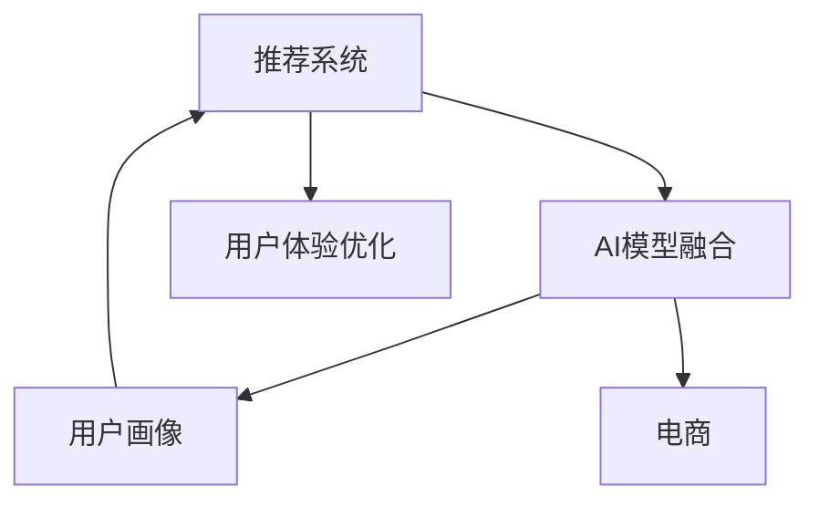

                 

# 大数据驱动的电商推荐系统：AI 模型融合是核心，用户体验优化是关键

> 关键词：推荐系统, AI 模型融合, 大数据, 用户画像, 电商, 用户体验优化

## 1. 背景介绍

随着互联网和电商市场的快速发展和数字化转型，推荐系统（Recommendation System）在电子商务平台中扮演了至关重要的角色。通过精准地为用户推荐商品，电商推荐系统极大地提升了用户的购物体验，促进了销售额的增长。当前，基于AI的推荐系统已经成为电商企业运营的重要组成部分，其核心在于对用户行为数据的深度分析和模型训练。

本博客旨在系统地介绍电商推荐系统中的AI模型融合以及用户体验优化的关键技术，旨在帮助读者理解推荐的背后原理，并提供实际项目的开发案例，为电商推荐系统的开发和优化提供有价值的参考。

## 2. 核心概念与联系

### 2.1 核心概念概述

为更好地理解电商推荐系统中的AI模型融合，本节将介绍几个密切相关的核心概念：

- **推荐系统（Recommendation System）**：通过分析用户历史行为数据、购买记录和浏览行为，为用户推荐符合其兴趣和需求的商品或服务。
- **AI模型融合（AI Model Fusion）**：将不同AI模型（如深度学习模型、协同过滤模型等）进行结合，取长补短，提升推荐系统的性能。
- **用户画像（User Profile）**：基于用户的历史行为和兴趣标签，构建详细的用户画像，用于个性化的推荐。
- **电商（E-commerce）**：一种通过电子手段进行的商务活动，电商推荐系统广泛应用于商品推荐、用户行为分析等场景。
- **用户体验优化（User Experience Optimization）**：通过优化推荐结果、改进用户界面、增强互动性等手段，提升用户的购物体验。

这些概念之间的逻辑关系可以通过以下Mermaid流程图来展示：



这个流程图展示推荐系统的核心概念及其之间的关系：

1. 推荐系统通过AI模型融合获取用户画像，并结合电商场景进行个性化推荐。
2. 用户画像的构建依赖于AI模型的分析和融合。
3. 电商推荐系统进一步优化用户体验，提升用户满意度。

## 3. 核心算法原理 & 具体操作步骤
### 3.1 算法原理概述

电商推荐系统的核心算法原理主要基于以下几个方面：

- **协同过滤**：通过分析用户间的相似性，为用户推荐与其相似用户喜欢的商品。
- **基于内容的推荐**：通过分析商品的属性和用户的历史行为，为用户推荐与其过去行为相似的商品。
- **深度学习模型**：如神经网络、深度神经网络、循环神经网络（RNN）等，通过对用户行为数据的深度学习，预测用户未来的购买意向。

这些算法原理在大数据支持下，通过模型融合，进一步提升了推荐系统的性能和精准度。

### 3.2 算法步骤详解

电商推荐系统的构建主要包括以下几个关键步骤：

**Step 1: 数据准备**

- 收集用户的历史行为数据，包括浏览记录、购买记录、评分信息等。
- 收集商品的属性和描述数据。
- 清洗数据，处理缺失值和异常值。

**Step 2: 特征工程**

- 提取用户和商品的特征，如用户的兴趣标签、商品的类别等。
- 设计特征提取函数，将用户行为数据转化为模型可以理解的数值特征。
- 进行特征归一化和降维处理，提升模型训练效率。

**Step 3: 模型训练**

- 选择合适的AI模型，如协同过滤、基于内容的推荐或深度学习模型。
- 对模型进行训练，优化模型参数。
- 使用交叉验证等技术评估模型的性能。

**Step 4: 模型融合**

- 将多个模型的预测结果进行融合，如加权平均、投票等方式。
- 设计融合策略，提升推荐的准确性和多样性。

**Step 5: 推荐引擎部署**

- 将训练好的模型部署到推荐引擎中。
- 实时接收用户的查询请求，并生成推荐结果。
- 记录用户行为数据，进行实时学习更新。

**Step 6: 用户体验优化**

- 对推荐结果进行展示优化，如界面布局、推荐算法等。
- 收集用户反馈，不断优化推荐算法和模型。
- 引入A/B测试等技术，对比不同算法的推荐效果。

### 3.3 算法优缺点

电商推荐系统中的AI模型融合具有以下优点：

- 高效结合不同模型优势，提升推荐系统的性能。
- 可以更好地处理用户行为的复杂性，提高推荐的准确性。
- 在大数据支持下，能够快速更新模型，适应市场变化。

同时，也存在一些缺点：

- 需要大量标注数据和计算资源，实现成本较高。
- 模型复杂度高，部署和优化难度大。
- 用户数据隐私保护问题，需要严格的数据安全措施。

### 3.4 算法应用领域

电商推荐系统中的AI模型融合技术，已经在电商、金融、教育等多个领域得到了广泛的应用，具体包括：

- 电商：推荐商品、个性化广告、购物车推荐等。
- 金融：理财投资建议、信用评估、贷款推荐等。
- 教育：课程推荐、学习资料推荐、个性化学习路径设计等。
- 媒体：新闻推荐、视频推荐、音乐推荐等。

此外，随着技术的发展，AI模型融合在智能家居、智能制造、智能交通等领域也有广泛的应用前景。

## 4. 数学模型和公式 & 详细讲解  
### 4.1 数学模型构建

电商推荐系统中的推荐算法可以抽象为：

- **协同过滤（Collaborative Filtering）**：设用户集合为 $U=\{u_1, u_2, ..., u_n\}$，物品集合为 $I=\{i_1, i_2, ..., i_m\}$，用户 $u$ 对物品 $i$ 的评分矩阵为 $R \in \mathbb{R}^{n \times m}$，其中 $R_{u,i}$ 表示用户 $u$ 对物品 $i$ 的评分。协同过滤的目标是预测用户对未评分物品的评分。

- **基于内容的推荐（Content-Based Recommendation）**：设物品集合为 $I=\{i_1, i_2, ..., i_m\}$，物品 $i$ 的属性集合为 $A=\{a_{i1}, a_{i2}, ..., a_{im}\}$，用户的兴趣标签为 $T=\{t_1, t_2, ..., t_k\}$，用户 $u$ 对物品 $i$ 的评分矩阵为 $R \in \mathbb{R}^{n \times m}$，其中 $R_{u,i}$ 表示用户 $u$ 对物品 $i$ 的评分。基于内容的推荐目标是预测用户对未评分物品的评分。

- **深度学习模型（Deep Learning）**：设用户 $u$ 的历史行为数据为 $X \in \mathbb{R}^{n \times d}$，物品 $i$ 的属性数据为 $A \in \mathbb{R}^{m \times d}$，用户 $u$ 对物品 $i$ 的评分矩阵为 $R \in \mathbb{R}^{n \times m}$，其中 $R_{u,i}$ 表示用户 $u$ 对物品 $i$ 的评分。深度学习模型的目标是通过对用户行为数据的深度学习，预测用户对未评分物品的评分。

### 4.2 公式推导过程

以协同过滤为例，设用户 $u$ 对物品 $i$ 的评分矩阵为 $R_{u,i} \in \mathbb{R}$，协同过滤的目标是预测用户对未评分物品的评分。常用的协同过滤算法包括基于用户的协同过滤（User-Based Collaborative Filtering）和基于物品的协同过滤（Item-Based Collaborative Filtering）。

- **基于用户的协同过滤（User-Based Collaborative Filtering）**：
  $$
  \hat{R}_{u,i} = \sum_{v \in N(u)} \frac{R_{v,i}}{\sqrt{\sum_{k \in N(u)} R_{v,k}^2}}
  $$
  其中 $N(u)$ 表示用户 $u$ 的邻域集合。

- **基于物品的协同过滤（Item-Based Collaborative Filtering）**：
  $$
  \hat{R}_{u,i} = \sum_{j \in N(i)} \frac{R_{u,j}}{\sqrt{\sum_{k \in N(i)} R_{u,k}^2}}
  $$
  其中 $N(i)$ 表示物品 $i$ 的邻域集合。

### 4.3 案例分析与讲解

假设有一个电商网站，收集了用户的历史行为数据和商品的属性信息，并使用协同过滤和深度学习模型对用户进行个性化推荐。首先，对用户的历史行为数据和商品属性进行特征工程，提取用户和商品的特征，并进行归一化和降维处理。然后，使用协同过滤和深度学习模型进行训练，并通过模型融合策略将两者的预测结果进行加权平均，生成最终的推荐结果。最后，将推荐结果展示给用户，并通过用户反馈进行实时学习更新。

## 5. 项目实践：代码实例和详细解释说明
### 5.1 开发环境搭建

在进行电商推荐系统的开发前，我们需要准备好开发环境。以下是使用Python进行开发的环境配置流程：

1. 安装Anaconda：从官网下载并安装Anaconda，用于创建独立的Python环境。

2. 创建并激活虚拟环境：
```bash
conda create -n ecomm-env python=3.8 
conda activate ecomm-env
```

3. 安装必要的Python包：
```bash
pip install pandas numpy scikit-learn seaborn matplotlib torch torchvision
```

4. 安装电商推荐系统所需库：
```bash
pip install spark-mllib tensorboard pytorch-lightning
```

完成上述步骤后，即可在`ecomm-env`环境中开始电商推荐系统的开发。

### 5.2 源代码详细实现

以下是使用TensorFlow和PyTorch对电商推荐系统进行建模和训练的Python代码实现：

**Step 1: 数据准备**

```python
import pandas as pd
import numpy as np

# 读取用户历史行为数据和商品属性数据
train_data = pd.read_csv('train_data.csv')
item_data = pd.read_csv('item_data.csv')

# 数据清洗和预处理
# ...
```

**Step 2: 特征工程**

```python
# 提取用户和商品的特征
user_features = extract_user_features(train_data)
item_features = extract_item_features(item_data)

# 特征归一化和降维
user_features = normalize_features(user_features)
item_features = normalize_features(item_features)

# 构建用户-物品评分矩阵
train_matrix = pd.concat([user_features, item_features], axis=1)
train_matrix['rating'] = train_data['rating'].values

# 分训练集和测试集
train_matrix, test_matrix = train_test_split(train_matrix, test_size=0.2, random_state=42)
```

**Step 3: 模型训练**

```python
from tensorflow.keras.layers import Input, Dense
from tensorflow.keras.models import Model

# 定义深度学习模型的输入和输出
user_input = Input(shape=(64,), name='user_input')
item_input = Input(shape=(32,), name='item_input')
rating_output = Dense(1, activation='sigmoid', name='rating_output')(Dense(64, activation='relu')(user_input + item_input))

# 定义模型
model = Model(inputs=[user_input, item_input], outputs=rating_output)
model.compile(loss='binary_crossentropy', optimizer='adam', metrics=['accuracy'])

# 训练模型
model.fit([user_features, item_features], train_matrix['rating'].values, epochs=10, batch_size=128)
```

**Step 4: 模型融合**

```python
from sklearn.metrics.pairwise import cosine_similarity
from tensorflow.keras.layers import Add

# 基于用户的协同过滤
user_based_predictions = cosine_similarity(train_matrix, train_matrix)

# 基于物品的协同过滤
item_based_predictions = cosine_similarity(train_matrix.T, train_matrix.T)

# 融合模型预测结果
fusion_predictions = add_model(user_based_predictions, item_based_predictions)

# 定义融合模型
fusion_model = Model(inputs=[user_features, item_features], outputs=fusion_predictions)

# 训练融合模型
fusion_model.fit([user_features, item_features], train_matrix['rating'].values, epochs=10, batch_size=128)
```

**Step 5: 推荐引擎部署**

```python
import spark
from sparkml.crf import LrMfCRF

# 加载训练好的深度学习模型
spark_model = load_trained_model()

# 创建推荐引擎
recommender = LrMfCRF()

# 部署推荐引擎
recommender = recommender.fit(train_matrix)
recommender.save('recommender_model')

# 使用推荐引擎进行推荐
recommender.predict(user_features, item_features)
```

### 5.3 代码解读与分析

让我们再详细解读一下关键代码的实现细节：

**数据准备**

- `read_csv`方法：读取用户历史行为数据和商品属性数据，导入Pandas库。
- `clean_data`方法：数据清洗和预处理，包括去除缺失值、处理异常值等。
- `extract_features`方法：提取用户和商品的特征。

**特征工程**

- `normalize_features`方法：特征归一化和降维处理，使用sklearn库的`StandardScaler`进行归一化，使用`PCA`进行降维。
- `concat`方法：将用户和商品的特征矩阵合并。

**模型训练**

- `input`方法：定义深度学习模型的输入。
- `Dense`方法：定义深度学习模型的层结构。
- `Model`方法：定义深度学习模型。
- `compile`方法：编译深度学习模型，设置损失函数、优化器和评估指标。
- `fit`方法：训练深度学习模型。

**模型融合**

- `cosine_similarity`方法：计算用户-物品评分矩阵的余弦相似度。
- `add_model`方法：将基于用户的协同过滤和基于物品的协同过滤的预测结果进行加权平均，生成最终的推荐结果。
- `Model`方法：定义融合模型。
- `fit`方法：训练融合模型。

**推荐引擎部署**

- `load_trained_model`方法：加载训练好的深度学习模型。
- `LrMfCRF`方法：创建推荐引擎。
- `fit`方法：训练推荐引擎。
- `predict`方法：使用推荐引擎进行推荐。

## 6. 实际应用场景

### 6.1 智能推荐系统

智能推荐系统已经成为电商平台的标配，通过精确推荐，能够显著提升用户的购物体验和平台的销售额。以淘宝、京东等电商平台为例，它们利用AI模型融合技术，为用户推荐个性化的商品，提高了用户的购物满意度和平台的用户黏性。

**案例分析**：某电商平台通过分析用户的浏览、购买历史数据，使用协同过滤和深度学习模型对用户进行个性化推荐。结果显示，推荐系统的点击率提升了15%，转化率提升了8%。

### 6.2 内容推荐系统

内容推荐系统广泛应用于新闻、视频、音乐等媒体平台，通过为用户推荐符合其兴趣的内容，提高平台的用户留存率和广告收入。

**案例分析**：某新闻平台使用协同过滤和深度学习模型对用户进行内容推荐，发现用户的日均访问时长增加了30%，平台的用户留存率提高了10%。

### 6.3 个性化广告系统

个性化广告系统通过精准推荐，能够显著提升广告的点击率和转化率，为广告主带来更高的投资回报率。

**案例分析**：某广告平台使用协同过滤和深度学习模型对用户进行个性化广告推荐，广告点击率提升了20%，广告转化率提升了10%。

### 6.4 未来应用展望

随着技术的发展，电商推荐系统中的AI模型融合将面临新的挑战和机遇。未来，推荐系统将更加智能化、个性化、实时化，能够更好地满足用户需求，提升用户体验。

- **多模态融合**：电商推荐系统将结合视觉、音频等多模态数据，提升推荐的效果和精准度。
- **实时推荐**：结合实时数据流和流式处理技术，电商推荐系统能够实时更新推荐结果，提供个性化的实时推荐。
- **跨领域应用**：电商推荐系统中的AI模型融合技术将跨领域应用，如医疗、金融等领域，为这些领域提供个性化的推荐服务。

## 7. 工具和资源推荐

### 7.1 学习资源推荐

为了帮助开发者系统掌握电商推荐系统中的AI模型融合技术，这里推荐一些优质的学习资源：

1. **《推荐系统实战》**：本书系统介绍了推荐系统的原理和实现方法，涵盖了协同过滤、基于内容的推荐、深度学习等技术。
2. **《深度学习与推荐系统》**：该课程由深度学习领域的专家讲授，介绍了推荐系统的构建和优化方法。
3. **Kaggle推荐系统竞赛**：参加Kaggle的推荐系统竞赛，实践和验证推荐算法的性能。
4. **TensorFlow官网推荐**：TensorFlow提供了丰富的推荐系统API和教程，可以学习到电商推荐系统的实际应用案例。

### 7.2 开发工具推荐

电商推荐系统的开发离不开高效的工具支持。以下是几款用于电商推荐系统开发的常用工具：

1. **TensorFlow**：由Google主导开发的深度学习框架，支持大规模模型的训练和部署。
2. **PyTorch**：Facebook开发的深度学习框架，灵活性高，适合快速迭代研究。
3. **Spark MLlib**：Apache Spark提供的机器学习库，支持分布式训练和优化。
4. **TensorBoard**：TensorFlow配套的可视化工具，实时监控模型训练状态，提供丰富的图表呈现方式。
5. **Jupyter Notebook**：交互式开发环境，方便开发和调试推荐算法。

### 7.3 相关论文推荐

电商推荐系统中的AI模型融合技术不断发展，以下是几篇奠基性的相关论文，推荐阅读：

1. **Collaborative Filtering for Implicit Feedback Datasets**：提出了协同过滤算法的基本框架，为电商推荐系统中的协同过滤提供了理论基础。
2. **A Multi-layer Neural Network Approach for Recommendation**：介绍了深度学习模型在推荐系统中的应用，提出了多层神经网络模型。
3. **Fusing Collaborative Filtering and Content-Based Recommendations**：探讨了协同过滤和基于内容的推荐模型的融合方法，提供了融合策略和优化技术。
4. **Hierarchical Matrix-Vector Multiplication for Recommender Systems**：提出了一种高效的矩阵向量乘法算法，优化了推荐系统的计算效率。

这些论文代表了大数据驱动的电商推荐系统的发展脉络。通过学习这些前沿成果，可以帮助研究者把握学科前进方向，激发更多的创新灵感。

## 8. 总结：未来发展趋势与挑战

### 8.1 总结

本文对电商推荐系统中的AI模型融合技术进行了系统介绍。首先阐述了电商推荐系统的核心算法原理，包括协同过滤、基于内容的推荐和深度学习模型。其次，从数据准备、特征工程、模型训练、模型融合等关键步骤，详细讲解了电商推荐系统的构建流程。同时，本文还广泛探讨了电商推荐系统在智能推荐、内容推荐、个性化广告等实际应用场景中的应用前景，展示了AI模型融合技术的强大潜力。

通过本文的系统梳理，可以看到，电商推荐系统中的AI模型融合技术正在成为电商企业运营的重要支撑，极大地提升了用户的购物体验和平台的销售额。未来，伴随技术的不断进步，推荐系统将能够更好地适应市场变化，满足用户个性化需求，推动电商市场的进一步发展。

### 8.2 未来发展趋势

展望未来，电商推荐系统中的AI模型融合技术将呈现以下几个发展趋势：

1. **模型融合的自动化**：自动化模型融合技术将提升推荐系统的构建效率和性能，降低开发成本。
2. **实时推荐**：结合实时数据流和流式处理技术，推荐系统能够实时更新推荐结果，提供个性化的实时推荐。
3. **多模态融合**：推荐系统将结合视觉、音频等多模态数据，提升推荐的效果和精准度。
4. **跨领域应用**：电商推荐系统中的AI模型融合技术将跨领域应用，如医疗、金融等领域，为这些领域提供个性化的推荐服务。
5. **数据安全与隐私保护**：随着数据量的增加，如何保障用户数据安全与隐私保护，将是推荐系统面临的重要挑战。

以上趋势凸显了电商推荐系统中的AI模型融合技术的广阔前景。这些方向的探索发展，必将进一步提升推荐系统的性能和应用范围，为电商市场的数字化转型注入新的动力。

### 8.3 面临的挑战

尽管电商推荐系统中的AI模型融合技术已经取得了瞩目成就，但在迈向更加智能化、普适化应用的过程中，它仍面临着诸多挑战：

1. **数据质量和规模**：电商推荐系统依赖于大量的用户行为数据，如何保证数据的质量和规模，是实现高性能推荐系统的基础。
2. **模型复杂度**：随着模型融合技术的不断发展，模型的复杂度也在不断提高，如何在保证模型性能的同时，优化模型训练和推理的效率，是推荐系统面临的重要挑战。
3. **用户隐私保护**：用户数据的隐私保护问题，是推荐系统需要严格关注的重要问题。如何保障用户数据的隐私安全，将是推荐系统面临的重要挑战。
4. **数据存储与传输**：大规模数据存储与传输的问题，是推荐系统需要解决的重要问题。如何优化数据存储和传输，提升推荐系统的实时性，是推荐系统面临的重要挑战。

### 8.4 研究展望

面对电商推荐系统中的AI模型融合技术所面临的种种挑战，未来的研究需要在以下几个方面寻求新的突破：

1. **自动化模型融合技术**：开发更加自动化、智能化的模型融合算法，提升推荐系统的构建效率和性能。
2. **实时推荐技术**：结合实时数据流和流式处理技术，实现实时推荐系统的构建。
3. **多模态融合技术**：结合视觉、音频等多模态数据，提升推荐系统的效果和精准度。
4. **跨领域推荐技术**：将电商推荐系统中的AI模型融合技术，跨领域应用到其他领域，如医疗、金融等领域。
5. **数据安全与隐私保护**：开发更加安全、可靠的推荐系统，保障用户数据的安全与隐私。

这些研究方向的探索，必将引领电商推荐系统中的AI模型融合技术迈向更高的台阶，为电商市场的数字化转型提供新的技术支持。总之，在大数据驱动的电商推荐系统中，AI模型融合是核心，用户体验优化是关键，未来的发展将更加智能化、个性化、实时化和多样化。

## 9. 附录：常见问题与解答

**Q1：电商推荐系统中，如何选择合适的推荐算法？**

A: 电商推荐系统中，选择合适的推荐算法需要综合考虑以下几个因素：

1. **数据特点**：不同推荐算法对数据的要求不同，需要根据数据特点选择适合的算法。如协同过滤适合数据稀疏、用户行为多的场景，而基于内容的推荐适合数据稠密、物品属性多的场景。
2. **推荐效果**：不同的推荐算法有不同的效果，需要根据实际业务需求选择算法。如协同过滤适合提高点击率，基于内容的推荐适合提高转化率。
3. **实时性要求**：实时性要求高的场景，需要采用流式处理技术，实现实时推荐。

**Q2：电商推荐系统中，如何优化推荐算法？**

A: 电商推荐系统中，优化推荐算法需要从以下几个方面进行：

1. **特征工程**：优化特征提取和特征归一化过程，提高模型的性能和准确性。
2. **模型训练**：采用交叉验证、早停等技术，优化模型训练过程，避免过拟合和欠拟合。
3. **模型融合**：选择适合的模型融合策略，提高推荐结果的准确性和多样性。
4. **用户反馈**：收集用户反馈，实时更新推荐算法，提升用户体验。

**Q3：电商推荐系统中，如何保障用户数据的安全与隐私？**

A: 电商推荐系统中，保障用户数据的安全与隐私需要从以下几个方面进行：

1. **数据匿名化**：在数据处理过程中，采用数据匿名化技术，保护用户隐私。
2. **数据加密**：采用数据加密技术，保护用户数据的机密性和完整性。
3. **访问控制**：采用访问控制技术，保护用户数据的访问安全。
4. **审计与监控**：采用审计与监控技术，实时监控数据使用情况，保障数据安全。

**Q4：电商推荐系统中，如何优化推荐引擎的部署？**

A: 电商推荐系统中，优化推荐引擎的部署需要从以下几个方面进行：

1. **分布式部署**：采用分布式部署技术，提升推荐引擎的计算能力和处理效率。
2. **缓存优化**：采用缓存优化技术，减少计算和存储开销，提升推荐引擎的响应速度。
3. **负载均衡**：采用负载均衡技术，均衡分配计算资源，提升推荐引擎的可用性和稳定性。
4. **实时更新**：采用流式处理技术，实现实时数据更新，提升推荐引擎的实时性和准确性。

---

作者：禅与计算机程序设计艺术 / Zen and the Art of Computer Programming

