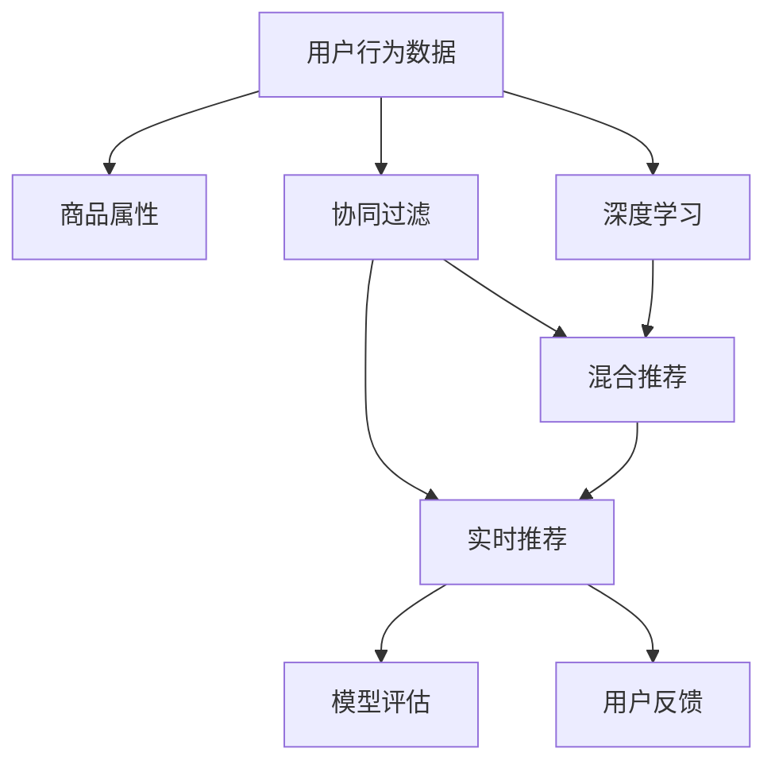

                 

# 大数据驱动的电商推荐：AI 模型融合技术在搜索推荐系统的应用

> 关键词：
- 大数据
- 电商推荐系统
- AI 模型融合
- 推荐算法
- 深度学习
- 协同过滤
- 混合推荐
- 实时推荐
- 用户行为分析
- 模型评估

## 1. 背景介绍

在数字化浪潮的推动下，电子商务行业正经历着前所未有的变革。随着消费者行为的变化和商品种类的日益丰富，如何高效地向用户推荐他们真正感兴趣的物品，成为了电商平台成功的关键。传统的推荐算法基于历史行为数据，难以应对快速变化的消费趋势和个性化需求。而在大数据和人工智能技术的加持下，电商推荐系统已成功演变成为一个复杂的、动态的、智能化的决策系统。

本博客将深入探讨基于AI模型融合技术的电商推荐系统的构建和优化，帮助读者理解如何在大数据驱动下实现更加精准、个性化的商品推荐，提升电商平台的用户体验和销售业绩。

## 2. 核心概念与联系

为了更好地理解电商推荐系统的原理和架构，本节将介绍几个核心概念及其联系。

### 2.1 核心概念概述

- **电商推荐系统**：根据用户的历史行为和商品属性，动态生成个性化推荐列表，帮助用户发现他们可能感兴趣的物品。

- **用户行为数据**：用户在电商平台上的浏览、点击、购买等操作数据，是推荐算法的重要输入。

- **商品属性**：商品的详细信息，如名称、描述、价格、类别等，是推荐算法进行商品匹配的基础。

- **协同过滤**：基于用户之间的相似性或商品之间的相关性进行推荐，是最基础的推荐算法之一。

- **深度学习**：利用神经网络模型从用户行为和商品属性中提取特征，进行推荐。

- **混合推荐**：结合多种推荐算法，取长补短，提高推荐效果。

- **实时推荐**：利用流式处理技术，实时分析用户行为和商品数据，动态更新推荐列表。

- **模型评估**：通过A/B测试、用户满意度调查等手段，评估推荐模型的效果和用户接受度。

### 2.2 核心概念原理和架构的 Mermaid 流程图



## 3. 核心算法原理 & 具体操作步骤

### 3.1 算法原理概述

电商推荐系统的核心原理是利用用户行为数据和商品属性，通过计算模型预测用户对商品的兴趣，生成个性化推荐列表。算法一般包括以下几个步骤：

1. **数据预处理**：清洗和整合用户行为数据和商品属性，构建可用于模型训练的数据集。

2. **模型训练**：选择合适的推荐算法，利用历史数据训练模型，学习用户偏好和商品相关性。

3. **预测与推荐**：根据用户实时行为和模型预测结果，动态生成个性化推荐列表。

4. **评估与优化**：实时监控推荐效果，根据用户反馈和业务需求进行调整优化。

### 3.2 算法步骤详解

#### 3.2.1 数据预处理

电商推荐系统依赖于大量结构化和非结构化的数据。数据预处理通常包括以下几个步骤：

- **数据清洗**：去除噪声数据，处理缺失值和异常值，保证数据质量。
- **特征提取**：从用户行为和商品属性中提取有意义的特征，如用户浏览记录、商品类别、价格区间等。
- **数据整合**：将不同来源的数据整合在一起，构建统一的用户画像和商品档案。

#### 3.2.2 模型训练

模型训练是推荐系统的核心步骤，涉及选择合适的算法和优化模型参数。常见的推荐算法包括：

- **协同过滤**：基于用户之间的相似性或商品之间的相关性进行推荐。协同过滤分为基于用户的协同过滤和基于物品的协同过滤两种方法。

- **基于内容的推荐**：利用商品属性和用户偏好进行推荐，常用于新用户或新商品的情况。

- **深度学习推荐**：利用神经网络模型从用户行为和商品属性中提取特征，进行推荐。常用的深度学习模型包括：
  - 基于矩阵分解的模型，如ALS（Alternating Least Squares）。
  - 基于神经网络的模型，如神经协同过滤（NeuMF）。
  - 基于注意力机制的模型，如Seq2Seq、Transformer等。

#### 3.2.3 预测与推荐

预测与推荐是电商推荐系统的关键步骤，涉及利用模型预测用户对商品的兴趣，生成个性化推荐列表。推荐系统一般包括：

- **召回**：从商品库中选出可能被用户感兴趣的商品。
- **排序**：根据用户偏好对召回的商品进行排序，生成推荐列表。

#### 3.2.4 评估与优化

评估与优化是电商推荐系统的反馈机制，涉及实时监控推荐效果和用户反馈，根据业务需求进行调整优化。常用的评估指标包括：

- **覆盖率**：推荐列表中包含的商品占商品库的比例。
- **点击率**：用户点击推荐列表中商品的比例。
- **转化率**：用户购买推荐列表中商品的比例。

### 3.3 算法优缺点

#### 3.3.1 优点

- **个性化**：能够根据用户历史行为和偏好，生成个性化推荐，提升用户体验。
- **实时性**：能够实时更新推荐列表，捕捉用户即时兴趣。
- **泛化性强**：能够处理大规模数据，适应不断变化的市场需求。

#### 3.3.2 缺点

- **数据依赖性强**：需要大量高质量的标注数据，对数据采集和清洗要求高。
- **模型复杂度高**：深度学习模型参数量大，训练和推理开销大。
- **冷启动问题**：新用户或新商品缺乏历史数据，难以进行有效推荐。

### 3.4 算法应用领域

电商推荐系统广泛应用于各类电商平台上，帮助用户发现新商品，提高用户粘性和购买转化率。具体应用场景包括：

- **商品推荐**：根据用户浏览和购买历史，生成个性化商品推荐。
- **个性化搜索**：利用用户搜索关键词和历史行为，生成个性化搜索结果。
- **跨商品推荐**：基于用户对某一商品的使用情况，推荐相关联的其他商品。
- **新用户引导**：为新注册用户推荐热门商品，帮助其快速了解平台。

## 4. 数学模型和公式 & 详细讲解 & 举例说明

### 4.1 数学模型构建

电商推荐系统的数学模型构建通常包括以下几个步骤：

- **用户行为表示**：将用户行为表示为向量，用于模型训练和预测。
- **商品属性表示**：将商品属性表示为向量，用于模型训练和推荐。
- **推荐模型**：构建推荐模型，将用户行为和商品属性映射到推荐结果。

### 4.2 公式推导过程

以基于矩阵分解的ALS模型为例，公式推导过程如下：

假设用户-商品评分矩阵为 $R$，用户特征向量为 $U$，商品特征向量为 $V$，则ALS模型的目标是最小化误差平方和：

$$
\min_{U,V} \sum_{i,j}(R_{ij} - \langle U_i, V_j \rangle)^2
$$

其中 $\langle U_i, V_j \rangle$ 表示用户和商品的相似度，可以通过矩阵分解得到：

$$
U_i = \sum_{k=1}^{K} u_{ik}e_k \quad V_j = \sum_{k=1}^{K} v_{kj}e_k
$$

其中 $u_{ik}$ 和 $v_{kj}$ 是用户和商品特征向量的系数，$e_k$ 是基向量。

### 4.3 案例分析与讲解

假设用户A对商品1和商品2分别打分4和3，商品1的特征向量为 $V_1 = [0.5, 0.5]$，用户A的特征向量为 $U_A = [1.0, 0.5]$。根据ALS模型，可以计算用户A对商品1的预测评分：

$$
\langle U_A, V_1 \rangle = \sum_{k=1}^{K} u_{Ak}v_{1k} = 1.0 \times 0.5 + 0.5 \times 0.5 = 0.75
$$

由于用户A实际对商品1的评分为4，误差为 $|0.75 - 4| = 3.25$。通过对 $U_A$ 和 $V_1$ 的调整，逐步减小误差，直到收敛。

## 5. 项目实践：代码实例和详细解释说明

### 5.1 开发环境搭建

在进行电商推荐系统开发前，需要搭建适合的数据处理和机器学习环境。以下是开发环境的搭建流程：

1. **数据收集与处理**：搭建数据收集系统，整合用户行为数据和商品属性数据，构建训练集和测试集。
2. **环境安装与配置**：安装Python、NumPy、Pandas、Scikit-learn、TensorFlow等依赖库，配置开发环境。
3. **模型训练与优化**：使用TensorFlow、PyTorch等深度学习框架，训练推荐模型，优化模型参数。
4. **系统部署与监控**：将训练好的模型部署到服务器上，实时监控推荐效果和用户反馈，根据业务需求进行调整优化。

### 5.2 源代码详细实现

以下是一个简单的电商推荐系统实现示例，包括数据预处理、模型训练和推荐列表生成。

```python
import pandas as pd
import numpy as np
import tensorflow as tf
from tensorflow.keras.layers import Input, Embedding, Dot, Dense, Concatenate
from tensorflow.keras.models import Model

# 加载数据集
train_data = pd.read_csv('train.csv')
test_data = pd.read_csv('test.csv')

# 数据预处理
user_ids = train_data['user_id'].unique()
item_ids = train_data['item_id'].unique()
train_data = train_data.groupby(['user_id', 'item_id'])['rating'].mean().reset_index()

# 构建用户和商品特征向量
user_embeddings = np.random.rand(len(user_ids), 10)
item_embeddings = np.random.rand(len(item_ids), 10)

# 构建推荐模型
user_input = Input(shape=(1,))
item_input = Input(shape=(1,))
user_item_dot = Dot(axes=(1, 1))([user_input, item_input])
user_item_dot = Dense(1, activation='sigmoid')(user_item_dot)

model = Model(inputs=[user_input, item_input], outputs=user_item_dot)
model.compile(optimizer='adam', loss='binary_crossentropy', metrics=['accuracy'])

# 训练模型
model.fit([train_data['user_id'], train_data['item_id']], train_data['rating'], epochs=10)

# 生成推荐列表
def recommend(user_id):
    user_embedding = np.random.rand(1, 10)
    item_predictions = model.predict([user_embedding, item_embeddings])
    top_items = item_embeddings[np.argsort(item_predictions)[-10:]]
    return top_items
```

### 5.3 代码解读与分析

上述代码实现了一个基于ALS模型的电商推荐系统，包括以下几个关键步骤：

- **数据预处理**：加载训练集和测试集，处理用户行为数据和商品属性数据，构建用户和商品特征向量。
- **模型构建**：使用TensorFlow构建推荐模型，利用矩阵分解方法计算用户和商品的相似度。
- **模型训练**：使用训练集数据训练模型，调整模型参数。
- **推荐列表生成**：利用训练好的模型，生成用户对商品的推荐列表。

## 6. 实际应用场景

### 6.1 商品推荐

商品推荐是电商推荐系统的核心应用场景之一。用户可以通过浏览、搜索、评价等行为，生成个性化推荐列表，提高购买转化率。

具体实现方式包括：

- **基于用户历史行为**：利用用户浏览、点击、购买等历史行为数据，生成个性化推荐列表。
- **基于商品属性**：利用商品属性信息，如价格、品牌、类别等，进行个性化推荐。
- **基于协同过滤**：利用用户之间的相似性，推荐其他用户喜欢的商品。

### 6.2 个性化搜索

个性化搜索是电商推荐系统的另一个重要应用场景。通过分析用户搜索关键词和历史行为，生成个性化的搜索结果，提高用户满意度和使用体验。

具体实现方式包括：

- **搜索关键词匹配**：利用自然语言处理技术，匹配用户输入的搜索关键词和商品标题、描述等文本信息。
- **相似商品推荐**：利用用户搜索行为，推荐与搜索结果相似的商品。
- **实时搜索优化**：根据用户搜索行为和实时数据，动态调整搜索结果。

### 6.3 跨商品推荐

跨商品推荐是电商推荐系统的高级应用场景之一。通过分析用户对某一商品的使用情况，推荐相关联的其他商品，提高用户的购物体验和满意度。

具体实现方式包括：

- **基于商品关联关系**：利用商品之间的关联关系，如上下位关系、替代关系等，进行跨商品推荐。
- **基于用户行为**：利用用户对某一商品的使用情况，推荐相关联的其他商品。
- **基于时间序列**：利用用户行为的时间序列，推荐时序相关的商品。

## 7. 工具和资源推荐

### 7.1 学习资源推荐

为了帮助开发者系统掌握电商推荐系统的理论和实践，这里推荐一些优质的学习资源：

1. **《推荐系统实战》**：清华大学出版社，详细介绍了推荐系统的理论基础和实战技巧。
2. **《深度学习》**：Ian Goodfellow等著，介绍了深度学习的基本概念和推荐系统的应用。
3. **《大规模深度学习：算法与系统》**：斯坦福大学提供的深度学习课程，涵盖深度学习的基础知识和推荐系统的应用。
4. **《TensorFlow实战》**：O'Reilly出版社，介绍了TensorFlow的使用方法和推荐系统的实现。
5. **《PyTorch深度学习入门》**：知名深度学习库PyTorch的使用手册，涵盖推荐系统的深度学习实现。

通过对这些资源的学习实践，相信你一定能够快速掌握电商推荐系统的精髓，并用于解决实际的推荐问题。

### 7.2 开发工具推荐

高效的开发离不开优秀的工具支持。以下是几款用于电商推荐系统开发的常用工具：

1. **TensorFlow**：谷歌开发的深度学习框架，支持分布式训练和实时推荐。
2. **PyTorch**：Facebook开发的深度学习框架，支持动态图和静态图，易于实现复杂的推荐算法。
3. **TensorBoard**：谷歌提供的可视化工具，实时监控训练过程和推荐效果。
4. **ELK Stack**：Elasticsearch、Logstash和Kibana的组合，支持实时数据处理和分析。
5. **Hadoop**：开源的分布式计算平台，支持大规模数据处理和分布式存储。

合理利用这些工具，可以显著提升电商推荐系统的开发效率，加快创新迭代的步伐。

### 7.3 相关论文推荐

电商推荐系统的发展得益于学界的持续研究。以下是几篇奠基性的相关论文，推荐阅读：

1. **《协同过滤算法及其应用》**：介绍了协同过滤算法的原理和应用场景。
2. **《基于深度学习的推荐系统》**：探讨了深度学习在推荐系统中的应用，如神经协同过滤、深度矩阵分解等。
3. **《用户行为分析与推荐系统》**：研究了用户行为对推荐系统的影响，提出了多种推荐算法。
4. **《推荐系统评价指标与技术》**：介绍了推荐系统的评价指标和优化技术，如A/B测试、用户满意度调查等。
5. **《实时推荐系统》**：探讨了实时推荐系统的实现方法和应用场景，如流式处理、缓存策略等。

这些论文代表了大规模推荐系统的研究方向，为推荐系统的发展提供了重要的理论基础。

## 8. 总结：未来发展趋势与挑战

### 8.1 总结

本文对基于AI模型融合技术的电商推荐系统的构建和优化进行了全面系统的介绍。首先阐述了电商推荐系统的背景和意义，明确了推荐系统在提升用户体验和销售业绩方面的重要作用。其次，从原理到实践，详细讲解了推荐系统的各个关键步骤，给出了电商推荐系统的完整代码实现。同时，本文还广泛探讨了推荐系统在商品推荐、个性化搜索、跨商品推荐等多个领域的应用前景，展示了推荐范式的巨大潜力。此外，本文精选了推荐系统的各类学习资源，力求为读者提供全方位的技术指引。

通过本文的系统梳理，可以看到，基于AI模型融合技术的电商推荐系统正在成为电商平台的标配，极大地提升了用户体验和销售业绩。未来，伴随深度学习技术的发展和数据量的持续增长，电商推荐系统必将在电商领域大放异彩，成为电商业务的重要引擎。

### 8.2 未来发展趋势

展望未来，电商推荐系统的技术发展将呈现以下几个趋势：

1. **深度学习模型的普及**：深度学习模型在推荐系统中的应用将更加广泛，基于神经网络、注意力机制等前沿技术将推动推荐系统的精度和效果提升。

2. **混合推荐算法的发展**：多种推荐算法（如协同过滤、基于内容的推荐、深度学习推荐）将更加灵活地组合，取长补短，提高推荐系统的泛化能力和鲁棒性。

3. **实时推荐系统的优化**：实时推荐系统将更加注重流式处理和缓存策略，提升推荐系统的响应速度和效率。

4. **跨域推荐的创新**：跨域推荐技术将更加注重多模态数据的融合，利用图像、视频、音频等多模态信息，提升推荐系统的多样性和创新性。

5. **用户反馈机制的完善**：用户反馈机制将更加注重个性化和实时性，利用用户行为数据和反馈信息，不断优化推荐系统。

6. **数据安全和隐私保护**：电商推荐系统将更加注重数据安全和隐私保护，利用联邦学习、差分隐私等技术，保护用户数据和隐私。

这些趋势凸显了电商推荐系统的广阔前景，未来将在大数据、人工智能等技术的推动下，不断拓展应用场景，提升用户体验和销售业绩。

### 8.3 面临的挑战

尽管电商推荐系统已经取得了显著的成果，但在迈向更加智能化、普适化应用的过程中，它仍面临着诸多挑战：

1. **数据质量问题**：电商推荐系统依赖于大量高质量的标注数据，但实际应用中数据质量往往难以保证，需要投入大量资源进行数据清洗和处理。

2. **模型复杂性**：深度学习模型参数量大，训练和推理开销大，需要高效的工具和技术进行优化。

3. **冷启动问题**：新用户或新商品缺乏历史数据，难以进行有效推荐，需要引入更多的数据采集和处理技术。

4. **用户体验优化**：如何更好地提升用户体验，平衡推荐效果和用户满意度，是一个重要的挑战。

5. **实时性要求**：实时推荐系统需要高效的数据处理和模型推理，对系统架构和资源配置提出了很高的要求。

6. **数据安全和隐私保护**：电商推荐系统需要保护用户数据和隐私，避免数据泄露和滥用。

7. **业务融合挑战**：如何将电商推荐系统与业务系统深度融合，提升业务价值，是一个重要的挑战。

这些挑战需要研究者和开发者在技术、业务、用户体验等多个维度协同发力，共同推动电商推荐系统的创新和发展。

### 8.4 研究展望

未来的研究将在以下几个方向寻求新的突破：

1. **多模态推荐技术**：利用图像、视频、音频等多模态数据，提升推荐系统的多样性和创新性。

2. **联邦学习**：利用分布式数据，保护用户隐私，提升推荐系统的安全性和普适性。

3. **推荐系统评估与优化**：利用A/B测试、用户满意度调查等手段，优化推荐系统，提升用户体验和业务价值。

4. **实时推荐系统优化**：利用流式处理和缓存策略，提升推荐系统的响应速度和效率。

5. **个性化推荐技术**：利用用户行为数据和反馈信息，提升推荐系统的个性化和精准度。

6. **推荐系统安全与隐私**：利用差分隐私、数据脱敏等技术，保护用户数据和隐私。

这些研究方向的探索，必将引领电商推荐系统迈向更高的台阶，为电商平台提供更加智能、普适的推荐服务，提升用户体验和销售业绩。

## 9. 附录：常见问题与解答

**Q1：电商推荐系统的数据预处理有哪些关键步骤？**

A: 电商推荐系统的数据预处理通常包括以下几个关键步骤：

1. **数据清洗**：去除噪声数据，处理缺失值和异常值，保证数据质量。
2. **特征提取**：从用户行为和商品属性中提取有意义的特征，如用户浏览记录、商品类别、价格区间等。
3. **数据整合**：将不同来源的数据整合在一起，构建统一的用户画像和商品档案。

**Q2：电商推荐系统中的协同过滤算法有哪些类型？**

A: 电商推荐系统中的协同过滤算法主要分为基于用户的协同过滤和基于物品的协同过滤两种类型：

1. **基于用户的协同过滤**：根据用户之间的相似性进行推荐。
2. **基于物品的协同过滤**：根据物品之间的相似性进行推荐。

**Q3：电商推荐系统的实时推荐是如何实现的？**

A: 电商推荐系统的实时推荐通常利用流式处理和缓存策略，具体实现方式包括：

1. **流式处理**：利用实时数据流，动态更新推荐列表。
2. **缓存策略**：利用缓存技术，提高推荐系统的响应速度。

**Q4：电商推荐系统的评价指标有哪些？**

A: 电商推荐系统的评价指标通常包括以下几个：

1. **覆盖率**：推荐列表中包含的商品占商品库的比例。
2. **点击率**：用户点击推荐列表中商品的比例。
3. **转化率**：用户购买推荐列表中商品的比例。

**Q5：电商推荐系统中的深度学习推荐模型有哪些？**

A: 电商推荐系统中的深度学习推荐模型主要有以下几种：

1. **基于矩阵分解的模型**，如ALS（Alternating Least Squares）。
2. **基于神经网络的模型**，如神经协同过滤（NeuMF）。
3. **基于注意力机制的模型**，如Seq2Seq、Transformer等。

通过学习这些知识，相信你一定能够快速掌握电商推荐系统的精髓，并用于解决实际的推荐问题。

