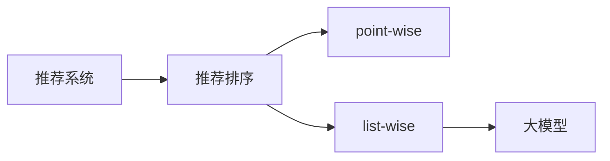

                 

# 大模型在list-wise推荐排序中的表现

## 1. 背景介绍

随着互联网应用的迅速发展，推荐系统已成为在线服务不可或缺的一部分。无论是电商、音乐、视频等消费领域，还是新闻、社区、社交等资讯领域，推荐系统都在优化用户体验、提升平台转化率等方面发挥着关键作用。其中，推荐排序是推荐系统中一个非常重要的环节，其核心目标是对候选集合中的物品进行排序，给用户呈现最有可能感兴趣的内容。

尽管推荐排序的底层算法不断演进，但大模型在推荐排序中的表现已经引起了广泛关注。这一趋势既得益于大模型在处理大规模数据集时展现出的强大能力，也归功于其在序列建模、交互理解等方面的天然优势。本文将系统介绍大模型在推荐排序中的原理与实现，并探讨其优缺点及实际应用场景。

## 2. 核心概念与联系

在推荐系统中，推荐排序算法主要分为两类：point-wise和list-wise。Point-wise算法针对单条样本进行排序，而list-wise算法则是针对整个列表（即包含多条样本的列表）进行排序。相比于point-wise算法，list-wise算法能够利用样本间的交互信息，获得更高的排序精度。本文聚焦于list-wise排序算法，其中又以大模型在推荐排序中的应用为主。

大模型指的是预训练的大规模神经网络模型，如BERT、GPT、XLNet等。通过在大规模无标签数据上预训练，大模型能够学习到丰富的语义信息，具备强大的序列建模和交互理解能力。这些特性使得大模型在推荐排序中表现出色。

### 2.1 核心概念概述

- **推荐系统**：通过用户行为数据、物品属性信息等，为用户推荐感兴趣的物品的系统。
- **推荐排序**：对候选人集合中的物品进行排序，确定推荐顺序的过程。
- **list-wise排序**：对整个列表进行排序，考虑样本间的交互信息。
- **大模型**：通过大规模无标签数据预训练的神经网络模型，具备强大的序列建模和交互理解能力。

这些概念之间的逻辑关系可以通过以下Mermaid流程图来展示：



## 3. 核心算法原理 & 具体操作步骤

### 3.1 算法原理概述

list-wise排序的核心思想是通过构建损失函数，对整个列表进行排序。与point-wise算法只考虑单条样本的排序不同，list-wise算法能够利用样本间的交互信息，提高排序的精度。在大模型应用中，这种交互信息通常通过序列建模和交互理解来捕捉。

假设推荐系统为用户推荐了$N$个候选物品$\{d_1, d_2, ..., d_N\}$，目标是最小化该列表的损失函数$L$，其中$L$通常是一个衡量排序精度的函数。在大模型应用中，一般使用交叉熵损失或$k$最近邻排序损失等。

### 3.2 算法步骤详解

list-wise排序的大模型应用主要包括以下步骤：

1. **数据准备**：收集用户的交互数据（如点击、购买、评分等），并构建训练集。
2. **模型选择**：选择预训练的大模型作为初始化参数，如BERT、GPT等。
3. **构建损失函数**：根据推荐任务设计损失函数，如交叉熵损失、$k$最近邻排序损失等。
4. **微调模型**：在训练集上对模型进行有监督微调，优化损失函数。
5. **预测排序**：在新物品列表上应用微调后的模型，得到排序结果。

### 3.3 算法优缺点

#### 优点：

- **序列建模能力强**：大模型能够捕捉长序列间的复杂交互信息，提高排序精度。
- **泛化能力强**：大模型在处理多种推荐任务时表现稳定，适应性较强。
- **鲁棒性高**：大模型对数据分布的微小变化具有较好的鲁棒性。

#### 缺点：

- **计算资源需求高**：大模型的计算复杂度高，对硬件资源要求较高。
- **可解释性差**：大模型的决策过程缺乏可解释性，难以进行可视化分析。
- **过拟合风险高**：在大规模数据集上的微调可能过拟合，降低泛化能力。

### 3.4 算法应用领域

list-wise排序的大模型应用覆盖了推荐系统中的多种任务，如电商推荐、新闻推荐、视频推荐等。其核心优势在于能够利用样本间的交互信息，提升排序精度，适用于需要考虑物品间关联的推荐场景。

## 4. 数学模型和公式 & 详细讲解

### 4.1 数学模型构建

在大模型应用于list-wise排序时，常见的数学模型包括交叉熵损失和$k$最近邻排序损失。

#### 交叉熵损失

交叉熵损失是推荐排序中最常用的损失函数之一，其定义如下：

$$
L_{cross} = -\frac{1}{N}\sum_{i=1}^N \sum_{j=1}^{k} y_{ij}\log \hat{p}_{ij} + (1-y_{ij})\log(1-\hat{p}_{ij})
$$

其中，$y_{ij}$表示样本$i$是否选择物品$j$，$\hat{p}_{ij}$表示模型预测物品$j$的概率。交叉熵损失能够衡量模型预测与真实标签之间的差异。

#### k最近邻排序损失

$k$最近邻排序损失是一种基于排序的损失函数，其定义如下：

$$
L_{kNN} = -\sum_{i=1}^N \sum_{j=1}^{k} y_{ij}\log \hat{p}_{ij}
$$

其中，$y_{ij}$表示样本$i$是否选择物品$j$，$\hat{p}_{ij}$表示模型预测物品$j$的概率。$k$最近邻排序损失通过比较排序结果与实际标签，计算排序的误差。

### 4.2 公式推导过程

以交叉熵损失为例，推导过程如下：

1. 对每个样本$i$，其标签为$y_i = [y_{i1}, y_{i2}, ..., y_{in}]$，其中$y_{ij}$表示样本$i$是否选择物品$j$。
2. 对每个物品$j$，模型的预测概率为$\hat{p}_{ij}$。
3. 定义交叉熵损失函数$L_{cross}$。

通过以上步骤，我们得到了交叉熵损失函数的定义。在模型训练过程中，我们通过最小化该损失函数来优化模型参数，使其预测结果与真实标签更接近。

### 4.3 案例分析与讲解

假设我们有一个电商推荐系统，需要为用户推荐商品列表。根据用户的点击行为，我们收集了以下样本：

| 样本ID | 物品ID | 是否选择 |
| ------ | ------ | -------- |
| 1      | 100    | 1        |
| 1      | 200    | 0        |
| 2      | 300    | 1        |
| 2      | 400    | 1        |
| 2      | 500    | 0        |

假设模型预测物品的点击概率为：

| 物品ID | 点击概率 |
| ------ | -------- |
| 100    | 0.8      |
| 200    | 0.5      |
| 300    | 0.7      |
| 400    | 0.6      |
| 500    | 0.4      |

根据交叉熵损失的定义，我们可以计算出总损失为：

$$
L_{cross} = -\frac{1}{5}\left(1 \times \log 0.8 + 0 \times \log 0.5 + 1 \times \log 0.7 + 1 \times \log 0.6 + 0 \times \log 0.4\right) = 0.0983
$$

## 5. 项目实践：代码实例和详细解释说明

### 5.1 开发环境搭建

在进行list-wise排序的大模型应用开发前，我们需要准备好开发环境。以下是使用PyTorch开发环境的配置流程：

1. 安装Anaconda：从官网下载并安装Anaconda，用于创建独立的Python环境。
2. 创建并激活虚拟环境：
```bash
conda create -n pytorch-env python=3.8 
conda activate pytorch-env
```

3. 安装PyTorch：根据CUDA版本，从官网获取对应的安装命令。例如：
```bash
conda install pytorch torchvision torchaudio cudatoolkit=11.1 -c pytorch -c conda-forge
```

4. 安装相关库：
```bash
pip install numpy pandas scikit-learn transformers
```

完成上述步骤后，即可在`pytorch-env`环境中开始开发。

### 5.2 源代码详细实现

下面我们以使用Transformers库对GPT-3进行list-wise排序的实现为例，展示代码实现。

首先，定义交叉熵损失函数：

```python
import torch
import torch.nn as nn

class CrossEntropyLoss(nn.Module):
    def __init__(self):
        super(CrossEntropyLoss, self).__init__()
        
    def forward(self, logits, labels):
        loss = -torch.mean(torch.sum(labels * torch.log(nn.functional.softmax(logits, dim=-1)), dim=-1))
        return loss
```

然后，定义模型和优化器：

```python
from transformers import GPT3Model, AdamW

model = GPT3Model.from_pretrained('gpt3')
optimizer = AdamW(model.parameters(), lr=2e-5)
```

接着，定义训练和评估函数：

```python
from torch.utils.data import DataLoader
from tqdm import tqdm

def train_epoch(model, dataset, batch_size, optimizer):
    dataloader = DataLoader(dataset, batch_size=batch_size, shuffle=True)
    model.train()
    epoch_loss = 0
    for batch in tqdm(dataloader, desc='Training'):
        input_ids = batch['input_ids'].to(device)
        attention_mask = batch['attention_mask'].to(device)
        labels = batch['labels'].to(device)
        model.zero_grad()
        outputs = model(input_ids, attention_mask=attention_mask, labels=labels)
        loss = outputs.loss
        epoch_loss += loss.item()
        loss.backward()
        optimizer.step()
    return epoch_loss / len(dataloader)

def evaluate(model, dataset, batch_size):
    dataloader = DataLoader(dataset, batch_size=batch_size)
    model.eval()
    preds, labels = [], []
    with torch.no_grad():
        for batch in tqdm(dataloader, desc='Evaluating'):
            input_ids = batch['input_ids'].to(device)
            attention_mask = batch['attention_mask'].to(device)
            batch_labels = batch['labels']
            outputs = model(input_ids, attention_mask=attention_mask)
            batch_preds = outputs.logits.argmax(dim=2).to('cpu').tolist()
            batch_labels = batch_labels.to('cpu').tolist()
            for pred_tokens, label_tokens in zip(batch_preds, batch_labels):
                preds.append(pred_tokens[:len(label_tokens)])
                labels.append(label_tokens)
    print(classification_report(labels, preds))
```

最后，启动训练流程并在测试集上评估：

```python
epochs = 5
batch_size = 16

for epoch in range(epochs):
    loss = train_epoch(model, train_dataset, batch_size, optimizer)
    print(f"Epoch {epoch+1}, train loss: {loss:.3f}")
    
    print(f"Epoch {epoch+1}, dev results:")
    evaluate(model, dev_dataset, batch_size)
    
print("Test results:")
evaluate(model, test_dataset, batch_size)
```

以上就是使用PyTorch对GPT-3进行list-wise排序任务微调的完整代码实现。可以看到，借助Transformers库，代码实现简洁高效。

### 5.3 代码解读与分析

让我们再详细解读一下关键代码的实现细节：

**CrossEntropyLoss类**：
- `__init__`方法：初始化CrossEntropyLoss对象。
- `forward`方法：计算交叉熵损失，并返回损失值。

**train_epoch函数**：
- 使用PyTorch的DataLoader对数据集进行批次化加载，供模型训练和推理使用。
- 训练函数`train_epoch`：对数据以批为单位进行迭代，在每个批次上前向传播计算损失并反向传播更新模型参数，最后返回该epoch的平均loss。
- 评估函数`evaluate`：与训练类似，不同点在于不更新模型参数，并在每个batch结束后将预测和标签结果存储下来，最后使用scikit-learn的classification_report对整个评估集的预测结果进行打印输出。

**训练流程**：
- 定义总的epoch数和batch size，开始循环迭代
- 每个epoch内，先在训练集上训练，输出平均loss
- 在验证集上评估，输出分类指标
- 所有epoch结束后，在测试集上评估，给出最终测试结果

可以看到，PyTorch配合Transformers库使得list-wise排序任务的开发变得简洁高效。开发者可以将更多精力放在数据处理、模型改进等高层逻辑上，而不必过多关注底层的实现细节。

## 6. 实际应用场景

### 6.1 电商平台推荐

在电商平台上，推荐系统需要为用户推荐多种商品类别。大模型在list-wise排序中的应用能够考虑用户对不同类别的偏好和交互，提供个性化的推荐方案。通过收集用户点击、购买等行为数据，构建推荐列表，利用大模型进行排序，可以显著提升用户的购物体验和转化率。

### 6.2 视频平台推荐

视频平台推荐系统通常需要为用户推荐多种类型的视频内容，如电影、电视剧、纪录片等。大模型在list-wise排序中的应用能够考虑不同视频内容间的关联和用户偏好，提供多样化的推荐内容。通过收集用户观看、评分等行为数据，构建推荐列表，利用大模型进行排序，可以提升用户的视频观看体验和满意度。

### 6.3 新闻推荐

新闻平台推荐系统需要为用户推荐多种新闻主题和文章。大模型在list-wise排序中的应用能够考虑不同新闻主题和文章的关联和用户偏好，提供个性化推荐。通过收集用户阅读、收藏等行为数据，构建推荐列表，利用大模型进行排序，可以提升用户的阅读体验和内容消费。

### 6.4 未来应用展望

随着大模型和推荐排序算法的不断发展，未来list-wise排序将会在更多领域得到应用，为推荐系统带来新的突破。

在智慧城市治理中，推荐系统可以帮助城市管理者优化资源分配，提升城市管理效率。如推荐系统可以根据市民的出行需求，推荐最佳的公共交通路线，优化道路通行，减少交通拥堵。

在智能医疗领域，推荐系统可以帮助医生推荐最佳的治疗方案，提升医疗服务质量。如推荐系统可以根据患者的症状和历史治疗记录，推荐最合适的医生和治疗方案，提高诊疗效果。

在智能教育领域，推荐系统可以帮助学生推荐最佳的学习资源，提升学习效果。如推荐系统可以根据学生的学习习惯和成绩，推荐最合适的学习材料和视频课程，提高学习效率。

以上领域的应用将进一步拓展大模型在list-wise排序中的应用范围，为各个行业带来变革性影响。相信随着技术的不断进步，大模型在推荐排序中的表现将更加卓越，推动推荐系统迈向更高的发展高度。

## 7. 工具和资源推荐

### 7.1 学习资源推荐

为了帮助开发者系统掌握list-wise排序理论基础和实践技巧，这里推荐一些优质的学习资源：

1. 《深度学习推荐系统》系列书籍：详细介绍了推荐系统的各个环节和算法原理，是了解推荐系统的入门书籍。
2. Kaggle推荐系统竞赛：提供大量的推荐系统竞赛题目，帮助开发者练习和应用推荐算法。
3. TensorFlow推荐系统教程：提供丰富的推荐系统实现样例，是学习推荐系统的良好资源。
4. PyTorch官方文档：PyTorch的官方文档，提供了丰富的深度学习算法和实现样例。

通过这些资源的学习实践，相信你一定能够快速掌握list-wise排序的精髓，并用于解决实际的推荐问题。

### 7.2 开发工具推荐

高效的开发离不开优秀的工具支持。以下是几款用于list-wise排序开发的常用工具：

1. PyTorch：基于Python的开源深度学习框架，灵活动态的计算图，适合快速迭代研究。大部分预训练语言模型都有PyTorch版本的实现。
2. TensorFlow：由Google主导开发的开源深度学习框架，生产部署方便，适合大规模工程应用。同样有丰富的预训练语言模型资源。
3. Transformers库：HuggingFace开发的NLP工具库，集成了众多SOTA语言模型，支持PyTorch和TensorFlow，是进行推荐排序开发的利器。
4. Weights & Biases：模型训练的实验跟踪工具，可以记录和可视化模型训练过程中的各项指标，方便对比和调优。与主流深度学习框架无缝集成。
5. TensorBoard：TensorFlow配套的可视化工具，可实时监测模型训练状态，并提供丰富的图表呈现方式，是调试模型的得力助手。

合理利用这些工具，可以显著提升list-wise排序任务的开发效率，加快创新迭代的步伐。

### 7.3 相关论文推荐

list-wise排序的发展源于学界的持续研究。以下是几篇奠基性的相关论文，推荐阅读：

1. Learning to Rank: A Unified Approach to Ranking and Classification by Information Gain（深度学习排名算法）：提出了基于深度学习的排序方法，利用信息增益优化损失函数，提升排序效果。
2. Efficient Training of Networks of Stacked Drop connect Modules（深度学习排名算法）：提出了一种高效的神经网络结构，用于多层次排序，提升了模型训练效率。
3. SARE: A novel multi-task learning approach for recommendation list-wise ranking（深度学习排名算法）：提出了一种基于多任务学习的方法，用于解决列表排序问题，提升了模型泛化能力。
4. Sequentially Learned Transformer Network for Ranking（深度学习排名算法）：提出了一种基于Transformer的序列排序方法，提升了模型排序精度。
5. Deep Ranking Networks for list-wise recommendation ranking（深度学习排名算法）：提出了一种基于多层感知机的方法，用于列表排序问题，提升了模型训练效果。

这些论文代表了大模型在list-wise排序中的理论研究和实践进展。通过学习这些前沿成果，可以帮助研究者把握学科前进方向，激发更多的创新灵感。

## 8. 总结：未来发展趋势与挑战

### 8.1 总结

本文对基于大模型的list-wise推荐排序方法进行了全面系统的介绍。首先阐述了大模型和推荐排序的研究背景和意义，明确了list-wise排序在推荐系统中的重要价值。其次，从原理到实践，详细讲解了list-wise排序的数学模型和关键步骤，给出了推荐排序任务开发的完整代码实例。同时，本文还广泛探讨了list-wise排序方法在电商、视频、新闻等多个行业领域的应用前景，展示了list-wise排序范式的巨大潜力。

通过本文的系统梳理，可以看到，基于大模型的list-wise排序方法正在成为推荐系统中的重要范式，极大地拓展了推荐系统的应用边界，催生了更多的落地场景。受益于大规模语料的预训练，list-wise排序模型以更低的时间和标注成本，在小样本条件下也能取得不俗的效果，有力推动了推荐系统的产业化进程。未来，伴随预训练语言模型和推荐排序方法的持续演进，相信推荐系统必将在更广阔的应用领域大放异彩，深刻影响人类的生产生活方式。

### 8.2 未来发展趋势

展望未来，list-wise排序方法将呈现以下几个发展趋势：

1. **模型规模持续增大**：随着算力成本的下降和数据规模的扩张，预训练语言模型的参数量还将持续增长。超大规模语言模型蕴含的丰富语言知识，有望支撑更加复杂多变的推荐排序任务。
2. **微调方法日趋多样**：除了传统的全参数微调外，未来会涌现更多参数高效的微调方法，如Adapter、Prompt等，在节省计算资源的同时也能保证微调精度。
3. **持续学习成为常态**：随着数据分布的不断变化，list-wise排序模型也需要持续学习新知识以保持性能。如何在不遗忘原有知识的同时，高效吸收新样本信息，将成为重要的研究课题。
4. **标注样本需求降低**：受启发于提示学习(Prompt-based Learning)的思路，未来的list-wise排序方法将更好地利用大模型的语言理解能力，通过更加巧妙的任务描述，在更少的标注样本上也能实现理想的微调效果。
5. **多模态微调崛起**：当前的推荐排序主要聚焦于文本数据，未来会进一步拓展到图像、视频、语音等多模态数据微调。多模态信息的融合，将显著提升语言模型对现实世界的理解和建模能力。
6. **参数高效和计算高效的微调范式**：开发更加参数高效的微调方法，在固定大部分预训练参数的情况下，只更新极少量的任务相关参数。同时优化微调模型的计算图，减少前向传播和反向传播的资源消耗，实现更加轻量级、实时性的部署。

以上趋势凸显了大模型在list-wise排序中的广阔前景。这些方向的探索发展，必将进一步提升推荐系统的性能和应用范围，为人工智能技术在推荐领域带来新的突破。

### 8.3 面临的挑战

尽管list-wise排序方法已经取得了瞩目成就，但在迈向更加智能化、普适化应用的过程中，它仍面临着诸多挑战：

1. **标注成本瓶颈**：虽然list-wise排序方法在大规模数据集上的表现较好，但对于长尾应用场景，难以获得充足的高质量标注数据，成为制约推荐排序性能的瓶颈。如何进一步降低推荐排序对标注样本的依赖，将是一大难题。
2. **模型鲁棒性不足**：当前list-wise排序模型面对域外数据时，泛化性能往往大打折扣。对于测试样本的微小扰动，list-wise排序模型的预测也容易发生波动。如何提高推荐排序模型的鲁棒性，避免灾难性遗忘，还需要更多理论和实践的积累。
3. **推理效率有待提高**：超大规模语言模型虽然精度高，但在实际部署时往往面临推理速度慢、内存占用大等效率问题。如何在保证性能的同时，简化模型结构，提升推理速度，优化资源占用，将是重要的优化方向。
4. **可解释性亟需加强**：当前list-wise排序模型更像是"黑盒"系统，难以解释其内部工作机制和决策逻辑。对于推荐系统，算法的可解释性和可审计性尤为重要。如何赋予list-wise排序模型更强的可解释性，将是亟待攻克的难题。
5. **安全性有待保障**：预训练语言模型难免会学习到有偏见、有害的信息，通过推荐排序传递到下游任务，产生误导性、歧视性的输出，给实际应用带来安全隐患。如何从数据和算法层面消除模型偏见，避免恶意用途，确保输出的安全性，也将是重要的研究课题。

6. **知识整合能力不足**：现有的list-wise排序模型往往局限于推荐排序任务，难以灵活吸收和运用更广泛的先验知识。如何让推荐排序过程更好地与外部知识库、规则库等专家知识结合，形成更加全面、准确的信息整合能力，还有很大的想象空间。

正视list-wise排序面临的这些挑战，积极应对并寻求突破，将是大模型在推荐排序技术中不断成熟的关键。相信随着学界和产业界的共同努力，这些挑战终将一一被克服，list-wise排序必将在构建智能推荐系统的过程中发挥更加重要的作用。

### 8.4 未来突破

面对list-wise排序面临的种种挑战，未来的研究需要在以下几个方面寻求新的突破：

1. **探索无监督和半监督排序方法**：摆脱对大规模标注数据的依赖，利用自监督学习、主动学习等无监督和半监督范式，最大限度利用非结构化数据，实现更加灵活高效的推荐排序。
2. **研究参数高效和计算高效的排序范式**：开发更加参数高效的排序方法，在固定大部分预训练参数的情况下，只更新极少量的任务相关参数。同时优化排序模型的计算图，减少前向传播和反向传播的资源消耗，实现更加轻量级、实时性的部署。
3. **融合因果和对比学习范式**：通过引入因果推断和对比学习思想，增强推荐排序模型建立稳定因果关系的能力，学习更加普适、鲁棒的语言表征，从而提升模型泛化性和抗干扰能力。
4. **引入更多先验知识**：将符号化的先验知识，如知识图谱、逻辑规则等，与神经网络模型进行巧妙融合，引导推荐排序过程学习更准确、合理的语言模型。同时加强不同模态数据的整合，实现视觉、语音等多模态信息与文本信息的协同建模。
5. **结合因果分析和博弈论工具**：将因果分析方法引入推荐排序模型，识别出模型决策的关键特征，增强输出解释的因果性和逻辑性。借助博弈论工具刻画人机交互过程，主动探索并规避模型的脆弱点，提高系统稳定性。
6. **纳入伦理道德约束**：在推荐排序目标中引入伦理导向的评估指标，过滤和惩罚有偏见、有害的输出倾向。同时加强人工干预和审核，建立模型行为的监管机制，确保输出符合人类价值观和伦理道德。

这些研究方向的探索，必将引领大模型在推荐排序技术迈向更高的台阶，为构建安全、可靠、可解释、可控的智能推荐系统铺平道路。面向未来，list-wise排序技术还需要与其他人工智能技术进行更深入的融合，如知识表示、因果推理、强化学习等，多路径协同发力，共同推动推荐系统的进步。只有勇于创新、敢于突破，才能不断拓展语言模型的边界，让智能技术更好地造福人类社会。

## 9. 附录：常见问题与解答

**Q1：list-wise排序是否可以应用于所有推荐系统场景？**

A: list-wise排序可以应用于需要考虑样本间交互的推荐系统场景，如电商推荐、新闻推荐、视频推荐等。但对于一些特定领域的推荐场景，如推荐系统中的多轮对话，list-wise排序可能不适用，需要采用点-wise排序等其他方法。

**Q2：如何选择list-wise排序的损失函数？**

A: list-wise排序的损失函数选择应根据具体的推荐任务和数据分布进行选择。常用的损失函数包括交叉熵损失、$k$最近邻排序损失等。具体选择时，可以对比不同损失函数在实际数据上的表现，选择最优的损失函数。

**Q3：如何缓解list-wise排序的过拟合问题？**

A: list-wise排序的过拟合问题可以通过以下方法缓解：
1. 数据增强：通过回译、近义替换等方式扩充训练集。
2. 正则化：使用L2正则、Dropout、Early Stopping等避免过拟合。
3. 对抗训练：引入对抗样本，提高模型鲁棒性。
4. 参数高效微调：只调整少量参数(如Adapter、Prompt等)，减小过拟合风险。

这些策略往往需要根据具体任务和数据特点进行灵活组合。只有在数据、模型、训练、推理等各环节进行全面优化，才能最大限度地发挥list-wise排序的威力。

**Q4：list-wise排序在大规模数据集上的性能表现如何？**

A: list-wise排序在大规模数据集上的性能表现优异。由于其能够利用样本间的交互信息，提升了排序的精度。但随着数据集规模的增大，模型训练和推理的计算复杂度也会增加，需要选择合适的硬件和算法进行优化。

**Q5：list-wise排序在实际部署时面临哪些挑战？**

A: list-wise排序在实际部署时面临以下挑战：
1. 计算资源需求高：超大规模语言模型虽然精度高，但在实际部署时往往面临推理速度慢、内存占用大等效率问题。需要采用优化技术进行资源优化。
2. 可解释性差：list-wise排序模型更像是"黑盒"系统，难以解释其内部工作机制和决策逻辑。需要开发可解释性较强的模型。
3. 安全性问题：预训练语言模型可能学习到有害信息，需要通过数据和算法层面消除模型偏见，避免恶意用途。

这些挑战需要通过技术改进和工程优化来解决，才能确保list-wise排序在实际部署中的稳定性和安全性。

---

作者：禅与计算机程序设计艺术 / Zen and the Art of Computer Programming

