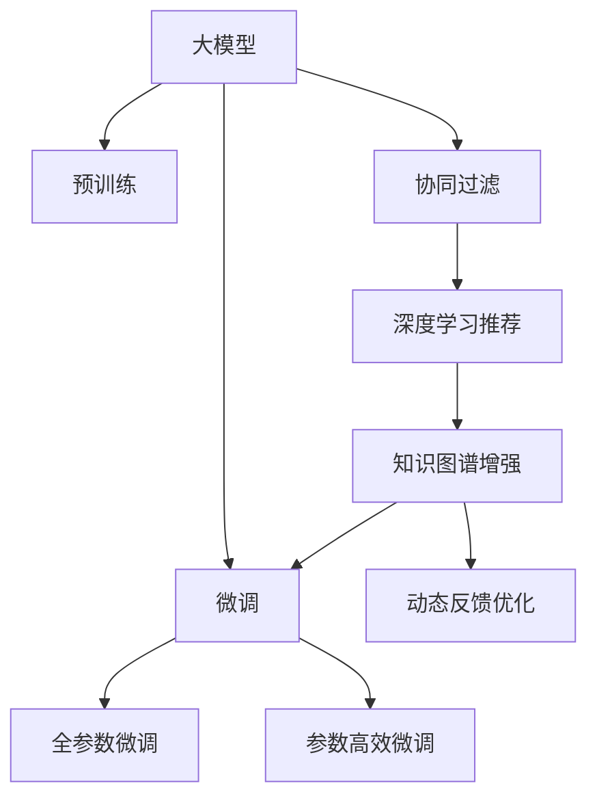

                 

# 大模型在商业应用中的潜力：推荐系统的进步

> 关键词：大模型,推荐系统,协同过滤,深度学习,知识图谱,用户行为预测,电商推荐,内容推荐

## 1. 背景介绍

### 1.1 问题由来

随着互联网技术的发展，电子商务平台和内容分发平台不断涌现，用户对个性化推荐的需求也日益增长。推荐系统在这些平台上发挥了越来越重要的作用，旨在通过智能算法为用户推荐其感兴趣的商品或内容，提高用户体验和平台收益。传统推荐系统主要基于协同过滤和浅层神经网络模型，这些方法在大规模数据下的推荐效果显著，但在冷启动问题、数据稀疏性、长尾效应等方面仍有局限性。

近年来，深度学习技术在推荐系统领域取得了重大进展。利用深度神经网络对用户行为进行建模，可以捕捉更深层次的隐含关联，并发现更加复杂的数据特征。具体而言，深度学习推荐系统主要分为基于矩阵分解的方法和基于神经网络的方法。这些方法在推荐精度、泛化能力、处理稀疏性方面具有优势，但对数据的规模、质量、用户行为多样性有较高要求。

大模型在推荐系统中的应用逐渐成为新趋势。以语言模型为基础的大模型，如BERT、GPT-3等，通过自监督预训练获得了丰富的语言知识，再通过微调适配推荐任务，可以有效提升推荐系统的效果。

### 1.2 问题核心关键点

大模型在推荐系统中的核心思想是，利用其强大的语言理解和生成能力，对用户行为数据进行高效建模，从而提供更加个性化、多样化的推荐。具体而言，关键点包括：

1. **预训练-微调范式**：利用大模型在大规模无标签数据上进行的预训练，对推荐系统进行微调，使其适应具体推荐任务。
2. **用户行为理解**：通过大模型对用户输入文本（如评论、搜索记录等）进行理解，获取用户的潜在需求。
3. **深度特征学习**：利用大模型学习用户行为背后的复杂关系，捕捉更为丰富的特征信息。
4. **推荐策略优化**：将大模型的输出作为推荐策略的一部分，优化推荐算法的参数设置。
5. **动态反馈优化**：通过大模型的反馈机制，不断调整模型参数，提升推荐效果。

## 2. 核心概念与联系

### 2.1 核心概念概述

为了更好地理解大模型在推荐系统中的应用，本节将介绍几个密切相关的核心概念：

- **大模型(Large Model)**：指具有大规模参数、复杂结构的深度学习模型，如BERT、GPT-3等。这些模型通过在大规模无标签数据上预训练，获得了丰富的语言知识。

- **推荐系统(Recommendation System)**：利用算法为用户推荐其感兴趣的商品或内容，提升用户体验和平台收益。推荐算法主要包括协同过滤、基于内容的方法、混合推荐等。

- **预训练(Pre-training)**：指在大规模无标签数据上，通过自监督学习任务训练模型的过程。预训练使得模型学习到通用的语言表示，可用于后续任务的微调。

- **微调(Fine-tuning)**：指在预训练模型的基础上，使用下游任务的少量标注数据，通过有监督学习优化模型在该任务上的性能。通常只调整顶层参数，以减小计算资源消耗。

- **协同过滤(Collaborative Filtering)**：通过分析用户的历史行为数据，预测其未交互物品的评分，再根据评分进行推荐。

- **知识图谱(Knowledge Graph)**：由实体、属性和关系构成的图结构数据，用于刻画实体间的复杂关系，提升推荐系统的表现。

这些核心概念之间的逻辑关系可以通过以下Mermaid流程图来展示：



这个流程图展示了大模型在推荐系统中的核心概念及其之间的关系：

1. 大模型通过预训练获得基础能力。
2. 微调是对预训练模型进行任务特定的优化，可以分为全参数微调和参数高效微调（PEFT）。
3. 协同过滤、深度学习推荐和知识图谱增强等方法，是利用大模型的推荐算法范式。
4. 动态反馈优化是利用大模型不断调整推荐策略的过程。

这些概念共同构成了大模型在推荐系统中的学习和应用框架，使其能够在各种场景下发挥强大的推荐能力。通过理解这些核心概念，我们可以更好地把握大模型在推荐系统中的工作原理和优化方向。

## 3. 核心算法原理 & 具体操作步骤
### 3.1 算法原理概述

基于大模型的推荐系统，本质上是一种基于监督学习的推荐范式。其核心思想是，利用大模型在预训练阶段获得的丰富语言知识，对推荐任务进行微调，使其能够更准确地预测用户的行为和偏好。

形式化地，假设推荐系统中的商品集合为 $\mathcal{I}$，用户集合为 $\mathcal{U}$，历史行为数据为 $D=\{(u_i, i_j)\}_{i=1}^N, u_i \in \mathcal{U}, i_j \in \mathcal{I}$，其中 $u_i$ 表示用户 $i$，$i_j$ 表示用户 $i$ 对商品 $j$ 的评分（可以是0-1的点击率、1-5的评分、浏览时长等）。设大模型的输出为 $F_{\theta}(\cdot)$，其中 $\theta$ 为模型参数。微调的目标是最小化预测评分与真实评分之间的差异，即：

$$
\hat{\theta}=\mathop{\arg\min}_{\theta} \sum_{(u_i, i_j) \in D} (\hat{y}_{i,j} - y_{i,j})^2
$$

其中 $\hat{y}_{i,j} = F_{\theta}(x_{i,j})$，$x_{i,j}$ 表示用户 $i$ 对商品 $j$ 的行为描述（如评论、搜索记录等）。通过梯度下降等优化算法，微调过程不断更新模型参数 $\theta$，最小化损失函数，使得模型输出逼近真实评分。由于 $\theta$ 已经通过预训练获得了较好的初始化，因此即便在只有少量行为数据的情况下，也能较快收敛到理想的模型参数 $\hat{\theta}$。

### 3.2 算法步骤详解

基于大模型的推荐系统一般包括以下几个关键步骤：

**Step 1: 准备数据集**
- 收集用户行为数据，包括用户ID、商品ID、评分、时间戳等信息。
- 将数据集划分为训练集、验证集和测试集，一般要求标注数据与预训练数据的分布不要差异过大。

**Step 2: 添加任务适配层**
- 根据推荐任务类型，在预训练模型顶层设计合适的输出层和损失函数。
- 对于评分预测任务，通常在顶层添加回归器输出预测评分。
- 对于点击率预测任务，通常使用二分类损失函数，如交叉熵损失。

**Step 3: 设置微调超参数**
- 选择合适的优化算法及其参数，如 AdamW、SGD 等，设置学习率、批大小、迭代轮数等。
- 设置正则化技术及强度，包括权重衰减、Dropout、Early Stopping等。
- 确定冻结预训练参数的策略，如仅微调顶层，或全部参数都参与微调。

**Step 4: 执行梯度训练**
- 将训练集数据分批次输入模型，前向传播计算损失函数。
- 反向传播计算参数梯度，根据设定的优化算法和学习率更新模型参数。
- 周期性在验证集上评估模型性能，根据性能指标决定是否触发 Early Stopping。
- 重复上述步骤直到满足预设的迭代轮数或 Early Stopping 条件。

**Step 5: 测试和部署**
- 在测试集上评估微调后模型 $F_{\hat{\theta}}$ 的性能，对比微调前后的评分预测精度提升。
- 使用微调后的模型对新商品进行评分预测，集成到实际的应用系统中。
- 持续收集新的用户行为数据，定期重新微调模型，以适应数据分布的变化。

以上是基于大模型的推荐系统的一般流程。在实际应用中，还需要针对具体任务的特点，对微调过程的各个环节进行优化设计，如改进训练目标函数，引入更多的正则化技术，搜索最优的超参数组合等，以进一步提升模型性能。

### 3.3 算法优缺点

基于大模型的推荐系统具有以下优点：
1. 高推荐精度。利用大模型的语言理解能力，可以捕捉更深层次的隐含关联，推荐精度显著提高。
2. 适应性广。大模型的通用预训练表示适用于多种推荐任务，可灵活适应不同场景。
3. 动态更新。大模型可以不断更新推荐策略，适应用户需求的变化。
4. 高效扩展。预训练和微调过程可以并行进行，提升推荐系统的可扩展性。

同时，该方法也存在一定的局限性：
1. 数据依赖性高。微调的效果很大程度上取决于标注数据的质量和数量，获取高质量标注数据的成本较高。
2. 模型复杂度高。大模型通常参数量巨大，计算资源消耗较大。
3. 泛化能力弱。当目标任务与预训练数据的分布差异较大时，微调的性能提升有限。
4. 解释性不足。大模型的决策过程缺乏可解释性，难以对其推理逻辑进行分析和调试。

尽管存在这些局限性，但就目前而言，基于大模型的推荐系统仍是目前推荐领域的主流范式。未来相关研究的重点在于如何进一步降低数据依赖，提高模型的泛化能力，同时兼顾可解释性和模型复杂度等因素。

### 3.4 算法应用领域

基于大模型的推荐系统已经在电商、内容分发、在线广告等领域得到了广泛应用，取得了显著的效果：

- **电商推荐**：推荐系统为用户推荐其感兴趣的商品，提高用户粘性和平台收益。例如，亚马逊的推荐系统通过用户浏览、点击、购买记录对商品进行评分预测，生成个性化推荐列表。
- **内容推荐**：推荐系统为用户推荐其感兴趣的内容，提升用户满意度和平台流量。例如，Netflix根据用户观看历史和评分数据，为用户推荐电影、电视剧等视频内容。
- **在线广告**：推荐系统为用户推荐其感兴趣的广告，提升广告投放效果。例如，谷歌广告通过用户的搜索行为和点击记录，预测其对不同广告的兴趣，实现精准投放。

除了上述这些经典应用外，大模型推荐系统还被创新性地应用到更多场景中，如智能客服推荐、个性化健康推荐、智能推荐引擎等，为推荐技术带来了全新的突破。随着预训练模型和推荐方法的不断进步，相信推荐系统将在更广阔的应用领域大放异彩。

## 4. 数学模型和公式 & 详细讲解 & 举例说明
### 4.1 数学模型构建

本节将使用数学语言对基于大模型的推荐系统进行更加严格的刻画。

记推荐系统中的商品集合为 $\mathcal{I}$，用户集合为 $\mathcal{U}$，历史行为数据为 $D=\{(u_i, i_j)\}_{i=1}^N, u_i \in \mathcal{U}, i_j \in \mathcal{I}$。设大模型的输出为 $F_{\theta}(\cdot)$，其中 $\theta$ 为模型参数。假设推荐任务为评分预测，目标是最小化预测评分与真实评分之间的均方误差（Mean Squared Error, MSE）损失函数：

$$
\mathcal{L}(\theta) = \frac{1}{N}\sum_{(u_i, i_j) \in D} (\hat{y}_{i,j} - y_{i,j})^2
$$

其中 $\hat{y}_{i,j} = F_{\theta}(x_{i,j})$，$x_{i,j}$ 表示用户 $i$ 对商品 $j$ 的行为描述。

### 4.2 公式推导过程

以下我们以评分预测任务为例，推导均方误差损失函数的梯度计算公式。

假设模型 $F_{\theta}$ 在输入 $x$ 上的输出为 $\hat{y} = F_{\theta}(x)$，表示用户对商品 $j$ 的评分预测。真实评分 $y$ 表示用户对商品 $j$ 的真实评分。则均方误差损失函数定义为：

$$
\ell(F_{\theta}(x),y) = (\hat{y} - y)^2
$$

将其代入经验风险公式，得：

$$
\mathcal{L}(\theta) = \frac{1}{N}\sum_{(u_i, i_j) \in D} (\hat{y}_{i,j} - y_{i,j})^2
$$

根据链式法则，损失函数对参数 $\theta_k$ 的梯度为：

$$
\frac{\partial \mathcal{L}(\theta)}{\partial \theta_k} = \frac{2}{N}\sum_{(u_i, i_j) \in D} (\hat{y}_{i,j} - y_{i,j}) \frac{\partial F_{\theta}(x_{i,j})}{\partial \theta_k}
$$

其中 $\frac{\partial F_{\theta}(x_{i,j})}{\partial \theta_k}$ 可进一步递归展开，利用自动微分技术完成计算。

在得到损失函数的梯度后，即可带入参数更新公式，完成模型的迭代优化。重复上述过程直至收敛，最终得到适应推荐任务的最优模型参数 $\theta^*$。

## 5. 项目实践：代码实例和详细解释说明
### 5.1 开发环境搭建

在进行推荐系统微调实践前，我们需要准备好开发环境。以下是使用Python进行PyTorch开发的环境配置流程：

1. 安装Anaconda：从官网下载并安装Anaconda，用于创建独立的Python环境。

2. 创建并激活虚拟环境：
```bash
conda create -n pytorch-env python=3.8 
conda activate pytorch-env
```

3. 安装PyTorch：根据CUDA版本，从官网获取对应的安装命令。例如：
```bash
conda install pytorch torchvision torchaudio cudatoolkit=11.1 -c pytorch -c conda-forge
```

4. 安装Transformers库：
```bash
pip install transformers
```

5. 安装各类工具包：
```bash
pip install numpy pandas scikit-learn matplotlib tqdm jupyter notebook ipython
```

完成上述步骤后，即可在`pytorch-env`环境中开始微调实践。

### 5.2 源代码详细实现

下面我们以电商推荐任务为例，给出使用Transformers库对BERT模型进行微调的PyTorch代码实现。

首先，定义电商推荐任务的数据处理函数：

```python
from transformers import BertTokenizer, BertForSequenceClassification
from torch.utils.data import Dataset
import torch

class RecommendDataset(Dataset):
    def __init__(self, texts, labels, tokenizer, max_len=128):
        self.texts = texts
        self.labels = labels
        self.tokenizer = tokenizer
        self.max_len = max_len
        
    def __len__(self):
        return len(self.texts)
    
    def __getitem__(self, item):
        text = self.texts[item]
        label = self.labels[item]
        
        encoding = self.tokenizer(text, return_tensors='pt', max_length=self.max_len, padding='max_length', truncation=True)
        input_ids = encoding['input_ids'][0]
        attention_mask = encoding['attention_mask'][0]
        
        # 对标签进行编码
        label_ids = torch.tensor([label2id[label] for label in self.labels], dtype=torch.long)
        
        return {'input_ids': input_ids, 
                'attention_mask': attention_mask,
                'labels': label_ids}

# 标签与id的映射
label2id = {'buy': 0, 'not_buy': 1}
id2label = {v: k for k, v in label2id.items()}

# 创建dataset
tokenizer = BertTokenizer.from_pretrained('bert-base-cased')

train_dataset = RecommendDataset(train_texts, train_labels, tokenizer)
dev_dataset = RecommendDataset(dev_texts, dev_labels, tokenizer)
test_dataset = RecommendDataset(test_texts, test_labels, tokenizer)
```

然后，定义模型和优化器：

```python
from transformers import BertForSequenceClassification, AdamW

model = BertForSequenceClassification.from_pretrained('bert-base-cased', num_labels=len(label2id))

optimizer = AdamW(model.parameters(), lr=2e-5)
```

接着，定义训练和评估函数：

```python
from torch.utils.data import DataLoader
from tqdm import tqdm
from sklearn.metrics import classification_report

device = torch.device('cuda') if torch.cuda.is_available() else torch.device('cpu')
model.to(device)

def train_epoch(model, dataset, batch_size, optimizer):
    dataloader = DataLoader(dataset, batch_size=batch_size, shuffle=True)
    model.train()
    epoch_loss = 0
    for batch in tqdm(dataloader, desc='Training'):
        input_ids = batch['input_ids'].to(device)
        attention_mask = batch['attention_mask'].to(device)
        labels = batch['labels'].to(device)
        model.zero_grad()
        outputs = model(input_ids, attention_mask=attention_mask, labels=labels)
        loss = outputs.loss
        epoch_loss += loss.item()
        loss.backward()
        optimizer.step()
    return epoch_loss / len(dataloader)

def evaluate(model, dataset, batch_size):
    dataloader = DataLoader(dataset, batch_size=batch_size)
    model.eval()
    preds, labels = [], []
    with torch.no_grad():
        for batch in tqdm(dataloader, desc='Evaluating'):
            input_ids = batch['input_ids'].to(device)
            attention_mask = batch['attention_mask'].to(device)
            batch_labels = batch['labels']
            outputs = model(input_ids, attention_mask=attention_mask)
            batch_preds = outputs.logits.argmax(dim=2).to('cpu').tolist()
            batch_labels = batch_labels.to('cpu').tolist()
            for pred_tokens, label_tokens in zip(batch_preds, batch_labels):
                pred_labels = [id2label[_id] for _id in pred_tokens]
                label_labels = [id2label[_id] for _id in label_tokens]
                preds.append(pred_labels[:len(label_labels)])
                labels.append(label_labels)
                
    print(classification_report(labels, preds))
```

最后，启动训练流程并在测试集上评估：

```python
epochs = 5
batch_size = 16

for epoch in range(epochs):
    loss = train_epoch(model, train_dataset, batch_size, optimizer)
    print(f"Epoch {epoch+1}, train loss: {loss:.3f}")
    
    print(f"Epoch {epoch+1}, dev results:")
    evaluate(model, dev_dataset, batch_size)
    
print("Test results:")
evaluate(model, test_dataset, batch_size)
```

以上就是使用PyTorch对BERT进行电商推荐任务微调的完整代码实现。可以看到，得益于Transformers库的强大封装，我们可以用相对简洁的代码完成BERT模型的加载和微调。

### 5.3 代码解读与分析

让我们再详细解读一下关键代码的实现细节：

**RecommendDataset类**：
- `__init__`方法：初始化文本、标签、分词器等关键组件。
- `__len__`方法：返回数据集的样本数量。
- `__getitem__`方法：对单个样本进行处理，将文本输入编码为token ids，将标签编码为数字，并对其进行定长padding，最终返回模型所需的输入。

**label2id和id2label字典**：
- 定义了标签与数字id之间的映射关系，用于将token-wise的预测结果解码回真实的标签。

**训练和评估函数**：
- 使用PyTorch的DataLoader对数据集进行批次化加载，供模型训练和推理使用。
- 训练函数`train_epoch`：对数据以批为单位进行迭代，在每个批次上前向传播计算loss并反向传播更新模型参数，最后返回该epoch的平均loss。
- 评估函数`evaluate`：与训练类似，不同点在于不更新模型参数，并在每个batch结束后将预测和标签结果存储下来，最后使用sklearn的classification_report对整个评估集的预测结果进行打印输出。

**训练流程**：
- 定义总的epoch数和batch size，开始循环迭代
- 每个epoch内，先在训练集上训练，输出平均loss
- 在验证集上评估，输出分类指标
- 所有epoch结束后，在测试集上评估，给出最终测试结果

可以看到，PyTorch配合Transformers库使得BERT微调的代码实现变得简洁高效。开发者可以将更多精力放在数据处理、模型改进等高层逻辑上，而不必过多关注底层的实现细节。

当然，工业级的系统实现还需考虑更多因素，如模型的保存和部署、超参数的自动搜索、更灵活的任务适配层等。但核心的微调范式基本与此类似。

## 6. 实际应用场景
### 6.1 智能客服推荐

基于大语言模型微调的推荐技术，可以广泛应用于智能客服推荐系统的构建。传统客服推荐系统需要基于用户历史行为数据，通过复杂算法计算用户可能感兴趣的商品或内容。而利用大语言模型，可以直接从用户输入（如客服对话记录）中理解用户需求，生成个性化推荐列表。

在技术实现上，可以收集客户服务的历史对话记录，将问题和推荐商品构建成监督数据，在此基础上对预训练推荐模型进行微调。微调后的模型能够自动理解用户意图，匹配最合适的商品推荐。对于客户提出的新问题，还可以接入检索系统实时搜索相关商品，动态生成推荐列表。如此构建的智能客服推荐系统，能大幅提升客户服务体验和推荐效果。

### 6.2 金融投资推荐

金融投资平台需要实时推荐用户可能感兴趣的投资产品，以提高用户粘性和投资收益。传统推荐系统往往依赖用户的历史交易数据，对新用户或少交易用户推荐效果不佳。利用大语言模型，可以从用户的文字评论、新闻浏览记录等非结构化数据中挖掘潜在需求，生成个性化的投资产品推荐。

具体而言，可以收集用户的历史文字记录和浏览记录，通过大语言模型对其进行理解，提取用户兴趣点，然后基于这些兴趣点生成个性化推荐列表。此外，可以利用金融市场的新闻信息、行情数据等，作为推荐模型的输入，进一步提升推荐精度。

### 6.3 个性化健康推荐

医疗健康平台需要为用户推荐个性化的健康服务，如医生、药品、诊疗方案等。传统推荐系统基于用户的历史健康数据，推荐效果单一。利用大语言模型，可以从用户的文字咨询记录中提取健康问题，生成个性化的健康服务推荐。

例如，可以通过收集用户的健康咨询记录，使用大语言模型对其进行分析，提取用户的健康需求，然后基于这些需求生成个性化的健康服务推荐。此外，可以结合医生的知识库、医学文献等，进一步提升推荐效果。

### 6.4 未来应用展望

随着大语言模型推荐技术的不断发展，其在更多领域的应用前景将进一步拓展。

在智慧城市治理中，推荐系统可以用于推荐城市的公共服务、文化活动等，提升城市居民的生活质量。在教育领域，推荐系统可以推荐个性化的学习资源、课程等，促进教育公平和个性化教育的发展。

此外，在社交媒体、新闻媒体、游戏娱乐等众多领域，基于大语言模型的推荐技术也将不断涌现，为各行各业提供智能化的信息和服务推荐。相信随着技术的日益成熟，推荐系统必将在更广阔的应用领域大放异彩，为数字化转型提供新的动力。

## 7. 工具和资源推荐
### 7.1 学习资源推荐

为了帮助开发者系统掌握大语言模型推荐系统的理论基础和实践技巧，这里推荐一些优质的学习资源：

1. 《Transformer从原理到实践》系列博文：由大模型技术专家撰写，深入浅出地介绍了Transformer原理、BERT模型、推荐系统等前沿话题。

2. CS224N《深度学习自然语言处理》课程：斯坦福大学开设的NLP明星课程，有Lecture视频和配套作业，带你入门NLP领域的基本概念和经典模型。

3. 《Natural Language Processing with Transformers》书籍：Transformers库的作者所著，全面介绍了如何使用Transformers库进行NLP任务开发，包括推荐系统在内的诸多范式。

4. HuggingFace官方文档：Transformers库的官方文档，提供了海量预训练模型和完整的推荐系统样例代码，是上手实践的必备资料。

5. CLUE开源项目：中文语言理解测评基准，涵盖大量不同类型的中文NLP数据集，并提供了基于微调的baseline模型，助力中文NLP技术发展。

通过对这些资源的学习实践，相信你一定能够快速掌握大语言模型推荐系统的精髓，并用于解决实际的NLP问题。
###  7.2 开发工具推荐

高效的开发离不开优秀的工具支持。以下是几款用于大语言模型推荐系统开发的常用工具：

1. PyTorch：基于Python的开源深度学习框架，灵活动态的计算图，适合快速迭代研究。大部分预训练语言模型都有PyTorch版本的实现。

2. TensorFlow：由Google主导开发的开源深度学习框架，生产部署方便，适合大规模工程应用。同样有丰富的预训练语言模型资源。

3. Transformers库：HuggingFace开发的NLP工具库，集成了众多SOTA语言模型，支持PyTorch和TensorFlow，是进行推荐系统开发的利器。

4. Weights & Biases：模型训练的实验跟踪工具，可以记录和可视化模型训练过程中的各项指标，方便对比和调优。与主流深度学习框架无缝集成。

5. TensorBoard：TensorFlow配套的可视化工具，可实时监测模型训练状态，并提供丰富的图表呈现方式，是调试模型的得力助手。

6. Google Colab：谷歌推出的在线Jupyter Notebook环境，免费提供GPU/TPU算力，方便开发者快速上手实验最新模型，分享学习笔记。

合理利用这些工具，可以显著提升大语言模型推荐系统的开发效率，加快创新迭代的步伐。

### 7.3 相关论文推荐

大语言模型和推荐系统的发展源于学界的持续研究。以下是几篇奠基性的相关论文，推荐阅读：

1. Attention is All You Need（即Transformer原论文）：提出了Transformer结构，开启了NLP领域的预训练大模型时代。

2. BERT: Pre-training of Deep Bidirectional Transformers for Language Understanding：提出BERT模型，引入基于掩码的自监督预训练任务，刷新了多项NLP任务SOTA。

3. Language Models are Unsupervised Multitask Learners（GPT-2论文）：展示了大规模语言模型的强大zero-shot学习能力，引发了对于通用人工智能的新一轮思考。

4. Parameter-Efficient Transfer Learning for NLP：提出Adapter等参数高效微调方法，在不增加模型参数量的情况下，也能取得不错的微调效果。

5. Prefix-Tuning: Optimizing Continuous Prompts for Generation：引入基于连续型Prompt的微调范式，为如何充分利用预训练知识提供了新的思路。

6. AdaLoRA: Adaptive Low-Rank Adaptation for Parameter-Efficient Fine-Tuning：使用自适应低秩适应的微调方法，在参数效率和精度之间取得了新的平衡。

这些论文代表了大语言模型推荐系统的发展脉络。通过学习这些前沿成果，可以帮助研究者把握学科前进方向，激发更多的创新灵感。

## 8. 总结：未来发展趋势与挑战
### 8.1 总结

本文对基于大模型的推荐系统进行了全面系统的介绍。首先阐述了大模型和推荐系统研究的背景和意义，明确了微调在拓展预训练模型应用、提升推荐系统效果方面的独特价值。其次，从原理到实践，详细讲解了微调数学模型和关键步骤，给出了推荐系统微调任务开发的完整代码实例。同时，本文还广泛探讨了微调方法在智能客服、金融投资、个性化健康等多个领域的应用前景，展示了微调范式的巨大潜力。此外，本文精选了微调技术的各类学习资源，力求为读者提供全方位的技术指引。

通过本文的系统梳理，可以看到，基于大模型的推荐系统正在成为推荐领域的重要范式，极大地拓展了预训练语言模型的应用边界，催生了更多的落地场景。受益于大规模语料的预训练，推荐系统在推荐精度、泛化能力、处理稀疏性等方面具有优势，为推荐技术带来了新的突破。未来，伴随预训练语言模型和推荐方法的持续演进，相信推荐系统将在更广阔的应用领域大放异彩，深刻影响人类的生产生活方式。

### 8.2 未来发展趋势

展望未来，大语言模型推荐系统将呈现以下几个发展趋势：

1. 模型规模持续增大。随着算力成本的下降和数据规模的扩张，预训练语言模型的参数量还将持续增长。超大规模语言模型蕴含的丰富语言知识，有望支撑更加复杂多变的推荐任务。

2. 推荐方法日趋多样。除了传统的基于矩阵分解的方法，未来会涌现更多基于深度学习的方法，如生成对抗网络(GAN)、自回归模型等，在推荐精度、处理稀疏性方面具有优势。

3. 跨模态推荐崛起。当前的推荐系统主要聚焦于文本数据，未来会进一步拓展到图像、视频、音频等多模态数据推荐。多模态信息的融合，将显著提升推荐系统的表现。

4. 个性化推荐增强。未来的推荐系统将更加注重用户个性化需求，通过深度学习技术，对用户画像、行为、偏好等进行精准建模，提供更加个性化的推荐。

5. 实时推荐系统发展。当前的推荐系统往往需要离线训练和推理，未来将发展实时推荐系统，在用户行为实时发生时，能够即时生成推荐结果。

6. 联邦学习与隐私保护。随着数据隐私保护法规的完善，未来的推荐系统将更多采用联邦学习等隐私保护技术，避免数据泄露和隐私侵犯。

以上趋势凸显了大语言模型推荐系统的广阔前景。这些方向的探索发展，必将进一步提升推荐系统的性能和应用范围，为数字化转型提供新的动力。

### 8.3 面临的挑战

尽管大语言模型推荐系统已经取得了瞩目成就，但在迈向更加智能化、普适化应用的过程中，它仍面临着诸多挑战：

1. 数据依赖性高。微调的效果很大程度上取决于标注数据的质量和数量，获取高质量标注数据的成本较高。如何进一步降低微调对标注样本的依赖，将是一大难题。

2. 模型鲁棒性不足。当前推荐模型面对域外数据时，泛化性能往往大打折扣。对于测试样本的微小扰动，推荐模型的预测也容易发生波动。如何提高推荐模型的鲁棒性，避免灾难性遗忘，还需要更多理论和实践的积累。

3. 推理效率有待提高。大规模语言模型虽然精度高，但在实际部署时往往面临推理速度慢、内存占用大等效率问题。如何在保证性能的同时，简化模型结构，提升推理速度，优化资源占用，将是重要的优化方向。

4. 可解释性亟需加强。当前推荐模型缺乏可解释性，难以对其决策过程进行解释和调试。对于医疗、金融等高风险应用，算法的可解释性和可审计性尤为重要。如何赋予推荐模型更强的可解释性，将是亟待攻克的难题。

5. 安全性有待保障。推荐模型可能学习到有偏见、有害的信息，通过推荐传递到用户，产生误导性、歧视性的输出，给实际应用带来安全隐患。如何从数据和算法层面消除模型偏见，避免恶意用途，确保输出的安全性，也将是重要的研究课题。

6. 知识整合能力不足。现有的推荐模型往往局限于文本数据，难以灵活吸收和运用更广泛的先验知识。如何让推荐过程更好地与外部知识库、规则库等专家知识结合，形成更加全面、准确的信息整合能力，还有很大的想象空间。

正视推荐系统面临的这些挑战，积极应对并寻求突破，将是大语言模型推荐系统走向成熟的必由之路。相信随着学界和产业界的共同努力，这些挑战终将一一被克服，推荐系统必将在构建人机协同的智能时代中扮演越来越重要的角色。

### 8.4 研究展望

面向未来，大语言模型推荐系统需要在以下几个方面寻求新的突破：

1. 探索无监督和半监督推荐方法。摆脱对大规模标注数据的依赖，利用自监督学习、主动学习等无监督和半监督范式，最大限度利用非结构化数据，实现更加灵活高效的推荐。

2. 研究参数高效和计算高效的推荐范式。开发更加参数高效的推荐方法，在固定大部分预训练参数的同时，只更新极少量的任务相关参数。同时优化推荐模型的计算图，减少前向传播和反向传播的资源消耗，实现更加轻量级、实时性的部署。

3. 引入因果推断和对比学习范式。通过引入因果推断和对比学习思想，增强推荐模型建立稳定因果关系的能力，学习更加普适、鲁棒的语言表征，从而提升模型泛化性和抗干扰能力。

4. 引入更多先验知识。将符号化的先验知识，如知识图谱、逻辑规则等，与神经网络模型进行巧妙融合，引导推荐过程学习更准确、合理的语言模型。同时加强不同模态数据的整合，实现视觉、语音等多模态信息与文本信息的协同建模。

5. 结合因果分析和博弈论工具。将因果分析方法引入推荐模型，识别出模型决策的关键特征，增强输出解释的因果性和逻辑性。借助博弈论工具刻画人机交互过程，主动探索并规避模型的脆弱点，提高系统稳定性。

6. 纳入伦理道德约束。在推荐目标中引入伦理导向的评估指标，过滤和惩罚有偏见、有害的输出倾向。同时加强人工干预和审核，建立推荐模型的监管机制，确保输出符合人类价值观和伦理道德。

这些研究方向的探索，必将引领大语言模型推荐系统迈向更高的台阶，为构建安全、可靠、可解释、可控的智能推荐系统铺平道路。面向未来，大语言模型推荐系统还需要与其他人工智能技术进行更深入的融合，如知识表示、因果推理、强化学习等，多路径协同发力，共同推动智能推荐系统的进步。只有勇于创新、敢于突破，才能不断拓展语言模型的边界，让智能技术更好地造福人类社会。

## 9. 附录：常见问题与解答

**Q1：大模型在推荐系统中的应用与传统推荐系统有何不同？**

A: 大模型在推荐系统中的应用与传统推荐系统有以下几点不同：
1. 数据来源多样：传统推荐系统主要依赖用户历史行为数据，而大模型可以通过多模态数据（如评论、社交媒体、图片等）理解用户需求。
2. 模型复杂度高：大模型参数量巨大，结构复杂，能够捕捉更深的隐含关联，推荐精度和泛化能力更强。
3. 动态更新：大模型能够不断学习新数据，动态调整推荐策略，适应用户需求的变化。
4. 可解释性强：大模型通过理解输入文本，可以提供推荐理由，增强推荐系统的透明性和可解释性。

**Q2：大模型的预训练和微调过程如何进行？**

A: 大模型的预训练和微调过程通常包括以下几个步骤：
1. 预训练：在大规模无标签数据上，通过自监督学习任务（如语言建模、掩码语言模型）训练大模型，获得通用的语言表示。
2. 微调：在大模型的基础上，使用下游任务的少量标注数据进行有监督学习，优化模型在该任务上的性能。
3. 动态反馈优化：在推荐系统运行过程中，不断收集用户反馈数据，重新训练大模型，提升推荐效果。

**Q3：大模型推荐系统在电商推荐中的应用有何优势？**

A: 大模型推荐系统在电商推荐中的应用优势主要体现在以下几个方面：
1. 用户画像精细：通过大模型对用户评论、浏览记录等文本数据的分析，可以更准确地描绘用户画像，实现个性化推荐。
2. 冷启动问题解决：大模型可以通过自然语言理解，从用户输入的文本中获取新用户的兴趣点，快速推荐商品。
3. 长尾商品覆盖：大模型可以更好地捕捉长尾商品的特征，提升小众商品的曝光率，增加平台收益。
4. 实时推荐：大模型可以实时处理用户行为数据，生成动态推荐结果，提升用户体验。

**Q4：大语言模型推荐系统面临的主要挑战是什么？**

A: 大语言模型推荐系统面临的主要挑战包括：
1. 数据依赖性高：推荐效果很大程度上依赖标注数据的质量和数量，获取高质量标注数据的成本较高。
2. 模型鲁棒性不足：大模型面对域外数据时，泛化性能可能较差，推荐效果不稳定。
3. 推理效率低：大规模语言模型虽然精度高，但在实际部署时推理速度较慢，内存占用较大。
4. 可解释性不足：大模型缺乏可解释性，难以对其决策过程进行解释和调试。
5. 安全性问题：大模型可能学习到有害信息，通过推荐传递给用户，产生误导性、歧视性的输出。
6. 知识整合能力不足：现有大模型主要基于文本数据，难以灵活整合外部知识库和规则库。

**Q5：大语言模型推荐系统在未来有哪些应用前景？**

A: 大语言模型推荐系统在未来有以下应用前景：
1. 智能客服推荐：利用大模型从用户输入中理解需求，生成个性化推荐，提升客户服务体验。
2. 金融投资推荐：从用户文字记录和浏览记录中提取兴趣点，推荐个性化投资产品，提高用户粘性和收益。
3. 个性化健康推荐：利用大模型分析用户健康咨询记录，推荐个性化健康服务，促进健康管理。
4. 智慧城市推荐：为城市居民推荐公共服务、文化活动等，提升城市生活质量。
5. 教育推荐：推荐个性化的学习资源和课程，促进教育公平和个性化教育的发展。
6. 社交媒体推荐：推荐用户感兴趣的内容，增加用户活跃度和平台流量。

**Q6：如何优化大语言模型推荐系统的性能？**

A: 大语言模型推荐系统的性能优化可以从以下几个方面进行：
1. 数据增强：通过回译、近义替换等方式扩充训练集，提高模型泛化能力。
2. 正则化技术：使用L2正则、Dropout等技术防止过拟合。
3. 动态反馈优化：持续收集用户反馈数据，重新训练模型，动态调整推荐策略。
4. 参数高效微调：只更新少部分任务相关参数，减小计算资源消耗。
5. 多模型集成：训练多个推荐模型，取平均输出，提升推荐效果。
6. 知识图谱增强：结合知识图谱，丰富推荐模型知识，提高推荐精度。

通过这些优化方法，可以在保证推荐精度和用户体验的同时，减少计算资源消耗，提高模型泛化能力，增强推荐系统的可解释性。

