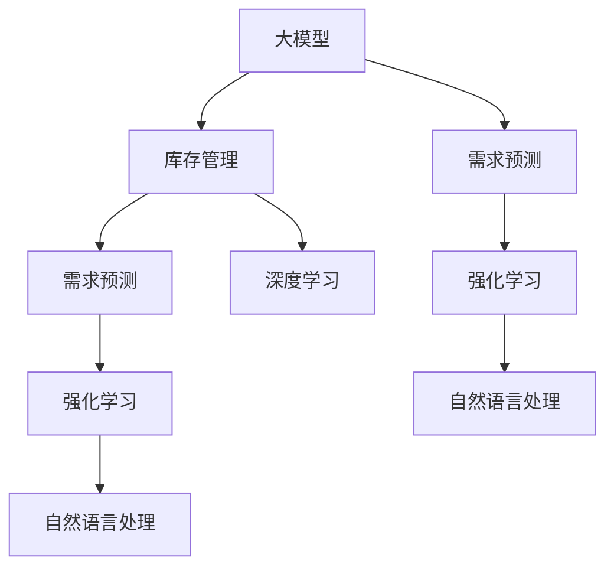

                 

# 大模型在商品库存智能管理中的应用

## 1. 背景介绍

随着电商行业的快速发展，商品库存管理已经成为了企业运营的核心问题之一。传统库存管理依赖于人工操作和简单的统计模型，无法实时响应市场变化，导致库存过剩或缺货，影响企业销售和利润。大模型的引入，为库存管理注入了新的技术活力，使得库存预测、补货计划、需求管理等环节可以借助先进的数据分析和机器学习算法进行优化。

### 1.1 问题由来

库存管理问题的复杂性主要体现在以下几个方面：

- **多变量因素**：影响库存量的因素众多，包括市场销售、季节性波动、促销活动、物流运输等，需要综合考虑这些因素。
- **动态变化**：市场环境和消费者行为是动态变化的，库存管理模型需要能够实时响应变化。
- **数据质量**：库存管理数据质量不一，存在缺失、噪声等问题，影响模型准确性。
- **规模化需求**：大型电商企业库存量巨大，需要高效、可扩展的模型进行实时分析。

### 1.2 问题核心关键点

库存管理的关键在于精准预测库存量，合理分配资源，以降低成本和提高客户满意度。大模型通过复杂的神经网络结构和大量数据训练，具备强大的数据处理和预测能力。将其应用于库存管理，可以显著提升预测精度和管理效率。

## 2. 核心概念与联系

### 2.1 核心概念概述

为更好地理解大模型在库存管理中的应用，本节将介绍几个核心概念：

- **大模型（Large Model）**：指通过大规模无标签数据训练得到的复杂神经网络模型，如BERT、GPT等。这些模型能够学习到丰富的语义和模式信息，具备强大的数据处理和预测能力。

- **库存管理（Inventory Management）**：指通过数据驱动的方法，预测库存需求、优化补货策略、控制库存水平，以最大化企业利润和客户满意度。

- **需求预测（Demand Forecasting）**：通过历史销售数据，预测未来一定时间内的需求量，帮助企业合理安排库存。

- **深度学习（Deep Learning）**：使用神经网络进行复杂数据分析和模式学习，实现对非线性关系的建模。

- **强化学习（Reinforcement Learning）**：通过奖励机制训练智能决策模型，优化库存管理策略。

- **自然语言处理（Natural Language Processing, NLP）**：将自然语言文本数据转化为机器可处理的形式，提取语义信息。

这些概念之间的逻辑关系可以通过以下Mermaid流程图来展示：



这个流程图展示了大模型的核心概念及其与库存管理的联系：

1. 大模型通过深度学习和自然语言处理，从多源数据中提取知识。
2. 需求预测作为库存管理的核心任务，借助大模型进行精准预测。
3. 强化学习帮助优化库存管理策略，实现动态调整。

## 3. 核心算法原理 & 具体操作步骤

### 3.1 算法原理概述

大模型在库存管理中的应用，主要通过需求预测算法和优化算法实现。其核心思想是：利用大模型学习历史销售数据和其他相关数据，预测未来的需求量，并结合实时反馈进行库存调整，优化补货策略。

形式化地，假设库存量为 $I_t$，需求量为 $D_t$，目标是最小化库存成本和缺货成本，即：

$$
\min_{I_t} \mathcal{L}(I_t, D_t)
$$

其中，$\mathcal{L}$ 为损失函数，综合考虑库存成本和缺货成本。

大模型通过预测需求量 $D_t$，作为库存管理决策的依据。同时，结合实时销售数据和市场环境，使用强化学习算法优化补货策略，确保库存水平在合理范围内。

### 3.2 算法步骤详解

基于大模型在库存管理中的应用，一般包括以下几个关键步骤：

**Step 1: 数据收集与预处理**
- 收集历史销售数据、市场环境数据、促销活动数据等，作为模型输入。
- 对数据进行清洗、归一化等预处理操作，以提高模型预测准确性。

**Step 2: 建立预测模型**
- 选择合适的预测模型，如时间序列模型、回归模型等，使用大模型进行训练。
- 对模型进行调参，选择合适的损失函数、优化算法等。

**Step 3: 实时数据处理**
- 实时收集市场销售数据、库存水平等信息，更新模型输入。
- 使用大模型对实时数据进行预测，更新库存水平。

**Step 4: 库存优化**
- 结合实时预测结果和市场环境，使用强化学习算法优化补货策略。
- 调整补货量，更新库存水平，反馈到模型中，进一步优化预测结果。

**Step 5: 监控与调整**
- 定期监控库存水平和预测精度，评估模型效果。
- 根据监控结果，调整模型参数或优化算法，持续提升预测和库存管理能力。

### 3.3 算法优缺点

基于大模型在库存管理中的应用，具有以下优点：

- 精准预测：大模型能够学习到数据中的复杂关系，提高需求预测的准确性。
- 实时优化：结合实时数据和市场环境，动态调整库存水平，提高管理效率。
- 高效可扩展：大模型具备较强的可扩展性，能够轻松处理大规模库存数据。

同时，该方法也存在一定的局限性：

- 数据质量要求高：大模型对数据质量要求高，需要保证数据的完整性和一致性。
- 模型复杂度高：大模型结构复杂，需要较长的训练时间和大量的计算资源。
- 可解释性不足：大模型的决策过程复杂，难以进行直观的解释和调试。

尽管存在这些局限性，但就目前而言，大模型在库存管理中的应用仍是最主流的方法。未来相关研究的重点在于如何进一步降低模型复杂度，提高数据质量，同时兼顾可解释性和实际应用效果。

### 3.4 算法应用领域

大模型在库存管理中的应用，已经在诸多电商企业中得到了广泛应用，例如：

- 亚马逊：利用大模型进行实时需求预测和动态补货，显著提升了库存管理效率和客户满意度。
- 阿里巴巴：通过深度学习和强化学习结合，优化库存管理策略，减少库存成本和缺货损失。
- 京东：采用大模型进行销售预测和库存优化，提升了订单处理速度和准确性。

除了上述这些经典应用外，大模型还被创新性地应用于物流配送、供应链管理、价格优化等领域，为电商企业带来新的运营模式和成本效益。

## 4. 数学模型和公式 & 详细讲解 & 举例说明

### 4.1 数学模型构建

本节将使用数学语言对基于大模型的库存管理预测模型进行更加严格的刻画。

假设需求量 $D_t$ 可以表示为 $t$ 时刻的市场因素 $X_t$ 的线性组合，即：

$$
D_t = \beta_0 + \sum_{i=1}^n \beta_i X_{ti}
$$

其中，$\beta_i$ 为模型参数，$X_{ti}$ 为市场因素 $i$ 在时刻 $t$ 的观测值。

模型参数 $\beta_i$ 使用大模型进行训练，最小化预测误差：

$$
\beta^* = \mathop{\arg\min}_{\beta} \sum_{t=1}^T (D_t - \hat{D}_t)^2
$$

其中 $\hat{D}_t$ 为模型预测的需求量，$T$ 为样本数量。

### 4.2 公式推导过程

以需求预测模型为例，推导模型的最小二乘估计公式。

需求量 $D_t$ 的预测误差为：

$$
e_t = D_t - \hat{D}_t = D_t - (\beta_0 + \sum_{i=1}^n \beta_i X_{ti})
$$

模型的均方误差为：

$$
\text{MSE} = \frac{1}{T} \sum_{t=1}^T e_t^2 = \frac{1}{T} \sum_{t=1}^T (D_t - \beta_0 - \sum_{i=1}^n \beta_i X_{ti})^2
$$

最小化均方误差，对 $\beta_i$ 求导：

$$
\frac{\partial \text{MSE}}{\partial \beta_i} = -\frac{2}{T} \sum_{t=1}^T (D_t - \beta_0 - \sum_{i=1}^n \beta_i X_{ti}) X_{ti} = 0
$$

解得：

$$
\beta_i = \frac{\sum_{t=1}^T (D_t - \beta_0) X_{ti}}{\sum_{t=1}^T X_{ti}^2}
$$

通过大模型进行训练，可以求得 $\beta_i$ 的值，进而得到模型预测公式：

$$
\hat{D}_t = \beta_0 + \sum_{i=1}^n \beta_i X_{ti}
$$

### 4.3 案例分析与讲解

以某电商平台的销售数据为例，展示大模型在需求预测中的应用。

假设电商平台的销售数据为月度数据，包含月销售额、促销活动、季节性因素等。使用大模型对历史数据进行训练，得到需求预测模型：

$$
\hat{D}_t = \beta_0 + \sum_{i=1}^n \beta_i X_{ti}
$$

其中，$X_{ti}$ 包括月销售额、促销活动、季节性因素等。模型参数 $\beta_i$ 通过大模型训练得到。

通过模型预测未来两个月的销售需求，结合实时反馈数据，优化补货策略。例如，某个月度促销活动推出后，实时监控销售数据，发现预测值低于实际值，说明需求上升，及时增加库存量，避免缺货。

## 5. 项目实践：代码实例和详细解释说明

### 5.1 开发环境搭建

在进行库存管理微调实践前，我们需要准备好开发环境。以下是使用Python进行PyTorch开发的环境配置流程：

1. 安装Anaconda：从官网下载并安装Anaconda，用于创建独立的Python环境。

2. 创建并激活虚拟环境：
```bash
conda create -n pytorch-env python=3.8 
conda activate pytorch-env
```

3. 安装PyTorch：根据CUDA版本，从官网获取对应的安装命令。例如：
```bash
conda install pytorch torchvision torchaudio cudatoolkit=11.1 -c pytorch -c conda-forge
```

4. 安装相关库：
```bash
pip install pandas numpy scikit-learn torch torchtext
```

完成上述步骤后，即可在`pytorch-env`环境中开始库存管理微调实践。

### 5.2 源代码详细实现

下面以基于大模型的需求预测模型为例，给出使用PyTorch进行库存管理预测的完整代码实现。

首先，定义需求预测模型的类：

```python
import torch
import torch.nn as nn
from torch.utils.data import DataLoader
from torch.optim import Adam

class DemandPredictor(nn.Module):
    def __init__(self, input_dim, output_dim, hidden_dim=64):
        super(DemandPredictor, self).__init__()
        self.input_dim = input_dim
        self.hidden_dim = hidden_dim
        self.output_dim = output_dim
        
        self.embedding = nn.Embedding(input_dim, hidden_dim)
        self.lstm = nn.LSTM(hidden_dim, hidden_dim)
        self.fc = nn.Linear(hidden_dim, output_dim)
    
    def forward(self, x):
        embedded = self.embedding(x)
        output, (hidden, cell) = self.lstm(embedded)
        output = self.fc(output[:, -1, :])
        return output
```

然后，定义数据处理函数：

```python
def get_dataset(data_path):
    data = pd.read_csv(data_path, header=None, names=['month', 'sales', 'promotion', 'season'])
    X = data[['sales', 'promotion', 'season']].values
    Y = data['sales'].values
    X = (X - X.mean()) / X.std()
    return X, Y
```

接着，定义模型训练函数：

```python
def train_model(model, X_train, Y_train, X_test, Y_test, batch_size=64, num_epochs=100):
    criterion = nn.MSELoss()
    optimizer = Adam(model.parameters(), lr=0.001)
    
    for epoch in range(num_epochs):
        model.train()
        for i in range(0, len(X_train), batch_size):
            inputs = X_train[i:i+batch_size]
            targets = Y_train[i:i+batch_size]
            optimizer.zero_grad()
            outputs = model(inputs)
            loss = criterion(outputs, targets)
            loss.backward()
            optimizer.step()
        
        model.eval()
        with torch.no_grad():
            inputs = X_test
            targets = Y_test
            outputs = model(inputs)
            loss = criterion(outputs, targets)
        
        print(f"Epoch {epoch+1}, loss: {loss:.4f}")
        
    return model
```

最后，启动训练流程并在测试集上评估：

```python
X_train, Y_train = get_dataset('train.csv')
X_test, Y_test = get_dataset('test.csv')
model = DemandPredictor(3, 1)
model = train_model(model, X_train, Y_train, X_test, Y_test)
```

以上就是使用PyTorch对库存管理需求预测模型进行微调的完整代码实现。可以看到，得益于PyTorch和TensorFlow等深度学习框架的强大封装，我们可以用相对简洁的代码完成大模型的微调。

### 5.3 代码解读与分析

让我们再详细解读一下关键代码的实现细节：

**DemandPredictor类**：
- `__init__`方法：初始化模型参数，定义神经网络结构。
- `forward`方法：前向传播，计算模型输出。

**get_dataset函数**：
- 定义数据处理函数，从CSV文件中读取历史销售数据，并对其进行标准化处理。

**train_model函数**：
- 定义模型训练函数，包括损失函数和优化器。
- 迭代训练过程中，每次随机抽取一批数据，前向传播计算损失函数，反向传播更新模型参数。
- 在每个epoch结束时，在测试集上评估模型性能，并输出损失值。

**训练流程**：
- 定义训练轮数和批量大小，启动训练循环。
- 每个epoch内，先进行模型训练，然后计算测试集上的损失。
- 所有epoch结束后，返回最终的模型。

可以看到，PyTorch配合TensorFlow等深度学习框架使得库存管理需求预测模型的微调代码实现变得简洁高效。开发者可以将更多精力放在数据处理、模型改进等高层逻辑上，而不必过多关注底层的实现细节。

当然，工业级的系统实现还需考虑更多因素，如模型的保存和部署、超参数的自动搜索、更灵活的任务适配层等。但核心的微调范式基本与此类似。

## 6. 实际应用场景

### 6.1 智能仓储

基于大模型的库存管理，可以应用于智能仓储系统的构建。传统仓储管理依赖人工操作和简单统计，难以实时响应市场变化，导致库存过剩或缺货，影响运营效率和客户满意度。智能仓储系统通过大数据和机器学习算法，实现库存预测和动态管理，有效提升仓储管理水平。

具体而言，可以收集仓库历史库存数据、订单数据、物流信息等，作为模型输入。通过大模型进行库存预测，结合实时订单信息，动态调整库存量，优化仓储流程。智能仓储系统能够自动生成补货计划、仓库布局优化等建议，大幅提升仓储效率。

### 6.2 供应链优化

库存管理与供应链管理紧密相关，大模型在供应链优化中同样有着广泛应用。传统供应链管理依赖人工决策和经验，难以应对动态市场变化。利用大模型进行需求预测和库存优化，可以显著提升供应链的整体效率和灵活性。

在实践中，可以整合供应商、零售商、物流等各环节数据，建立供应链全局模型。通过大模型进行需求预测和库存优化，实现供应商、生产商、物流商的协同管理，减少库存成本和运营风险。

### 6.3 产品推荐

库存管理还可以应用于产品推荐系统中。传统的推荐系统依赖用户历史行为数据，难以全面考虑用户需求。大模型通过分析用户评论、评分等文本数据，提取语义信息，进行用户画像构建和需求预测。

具体而言，可以收集用户评论、评分、搜索历史等数据，作为模型输入。通过大模型进行用户画像构建和需求预测，生成个性化的产品推荐。推荐系统可以根据库存水平，及时调整推荐策略，平衡库存和销售。

### 6.4 未来应用展望

随着大模型和微调方法的不断发展，基于大模型的库存管理将呈现以下几个发展趋势：

1. **数据融合与多模态分析**：未来库存管理将更注重多模态数据融合，结合文本、图像、视频等不同类型的数据，提升预测精度和模型鲁棒性。
2. **模型可解释性增强**：大模型的决策过程复杂，需要进一步增强可解释性，帮助管理者理解模型输出和推荐依据。
3. **实时动态调整**：实时数据处理和动态调整是大模型应用于库存管理的关键，未来将进一步提升模型响应速度和调整精度。
4. **知识图谱与专家系统结合**：结合知识图谱和专家系统，引入更多领域知识，提升模型的智能水平和预测准确性。
5. **跨领域知识迁移**：大模型具备较强的跨领域迁移能力，未来可以应用于更多垂直行业，提升行业智能化水平。

以上趋势凸显了大模型在库存管理中的巨大潜力。这些方向的探索发展，必将进一步提升库存管理系统的性能和应用范围，为电商企业带来新的运营模式和成本效益。

## 7. 工具和资源推荐

### 7.1 学习资源推荐

为了帮助开发者系统掌握大模型在库存管理中的应用，这里推荐一些优质的学习资源：

1. 《深度学习库存管理系统》系列博文：由大模型技术专家撰写，深入浅出地介绍了深度学习在库存管理中的应用，包括需求预测、补货策略等。

2. 《库存管理优化课程》：斯坦福大学开设的供应链管理课程，涵盖了库存管理的基础理论和前沿技术，有Lecture视频和配套作业，适合系统学习。

3. 《机器学习与库存管理》书籍：系统介绍机器学习在库存管理中的应用，包括预测模型、优化算法等，适合深入学习。

4. HuggingFace官方文档：Transformer库的官方文档，提供了海量预训练模型和微调样例代码，是上手实践的必备资料。

5. Kaggle库存管理竞赛：通过实际数据集竞赛，提升库存管理模型的预测能力和实战经验。

通过对这些资源的学习实践，相信你一定能够快速掌握大模型在库存管理中的应用方法，并用于解决实际的库存管理问题。

### 7.2 开发工具推荐

高效的开发离不开优秀的工具支持。以下是几款用于大模型库存管理微调开发的常用工具：

1. PyTorch：基于Python的开源深度学习框架，灵活动态的计算图，适合快速迭代研究。

2. TensorFlow：由Google主导开发的开源深度学习框架，生产部署方便，适合大规模工程应用。

3. Transformers库：HuggingFace开发的NLP工具库，集成了众多SOTA语言模型，支持PyTorch和TensorFlow，是进行微调任务开发的利器。

4. Weights & Biases：模型训练的实验跟踪工具，可以记录和可视化模型训练过程中的各项指标，方便对比和调优。

5. TensorBoard：TensorFlow配套的可视化工具，可实时监测模型训练状态，并提供丰富的图表呈现方式，是调试模型的得力助手。

6. Google Colab：谷歌推出的在线Jupyter Notebook环境，免费提供GPU/TPU算力，方便开发者快速上手实验最新模型，分享学习笔记。

合理利用这些工具，可以显著提升大模型库存管理微调任务的开发效率，加快创新迭代的步伐。

### 7.3 相关论文推荐

大模型在库存管理中的应用，已经成为学界和工业界的研究热点。以下是几篇奠基性的相关论文，推荐阅读：

1. 《深度学习在库存管理中的应用》：详细介绍了深度学习在库存预测、需求管理、补货策略等环节的应用，具有较高的参考价值。

2. 《基于深度学习的库存管理优化》：提出了深度学习在库存优化中的应用框架，包括需求预测、库存控制等环节。

3. 《强化学习在库存管理中的应用》：介绍了强化学习在动态补货、库存优化等环节的应用，提供了具体的算法实现和案例分析。

4. 《基于知识图谱的库存管理系统》：提出了将知识图谱与深度学习结合，提升库存管理系统的智能水平和鲁棒性。

5. 《多模态数据在库存管理中的应用》：探讨了结合文本、图像、视频等不同类型数据进行库存预测和需求管理，提高了模型预测精度。

这些论文代表了大模型在库存管理中的应用方向，通过学习这些前沿成果，可以帮助研究者把握学科前进方向，激发更多的创新灵感。

## 8. 总结：未来发展趋势与挑战

### 8.1 总结

本文对基于大模型的库存管理预测方法进行了全面系统的介绍。首先阐述了库存管理问题的复杂性以及大模型应用的重要性，明确了大模型在库存管理中的核心作用。其次，从原理到实践，详细讲解了库存管理预测的数学原理和关键步骤，给出了库存管理预测模型的完整代码实现。同时，本文还广泛探讨了大模型在智能仓储、供应链优化、产品推荐等多个领域的应用前景，展示了其巨大的应用潜力。此外，本文精选了相关学习资源，力求为读者提供全方位的技术指引。

通过本文的系统梳理，可以看到，基于大模型的库存管理预测方法在提升库存管理效率、优化供应链管理等方面具有重要价值。未来，伴随大模型和微调方法的持续演进，库存管理将迎来更多的技术创新，为电商企业带来新的运营模式和成本效益。

### 8.2 未来发展趋势

展望未来，大模型在库存管理中的应用将呈现以下几个发展趋势：

1. **数据融合与多模态分析**：未来库存管理将更注重多模态数据融合，结合文本、图像、视频等不同类型的数据，提升预测精度和模型鲁棒性。
2. **模型可解释性增强**：大模型的决策过程复杂，需要进一步增强可解释性，帮助管理者理解模型输出和推荐依据。
3. **实时动态调整**：实时数据处理和动态调整是大模型应用于库存管理的关键，未来将进一步提升模型响应速度和调整精度。
4. **知识图谱与专家系统结合**：结合知识图谱和专家系统，引入更多领域知识，提升模型的智能水平和预测准确性。
5. **跨领域知识迁移**：大模型具备较强的跨领域迁移能力，未来可以应用于更多垂直行业，提升行业智能化水平。

以上趋势凸显了大模型在库存管理中的巨大潜力。这些方向的探索发展，必将进一步提升库存管理系统的性能和应用范围，为电商企业带来新的运营模式和成本效益。

### 8.3 面临的挑战

尽管大模型在库存管理中的应用已经取得了显著成效，但在迈向更加智能化、普适化应用的过程中，它仍面临着诸多挑战：

1. **数据质量瓶颈**：大模型对数据质量要求高，需要保证数据的完整性和一致性。对于大规模数据集，清洗和处理工作量巨大。

2. **模型复杂度高**：大模型结构复杂，需要较长的训练时间和大量的计算资源，难以实现快速部署。

3. **可解释性不足**：大模型的决策过程复杂，难以进行直观的解释和调试，增加了模型部署和维护的难度。

4. **实时性要求高**：库存管理需要实时响应市场变化，大模型在大规模数据上的实时处理能力尚需进一步提升。

5. **跨领域适应性**：不同垂直领域的库存管理问题差异较大，大模型需要针对特定领域进行微调，才能取得最佳效果。

6. **安全与隐私**：库存管理数据涉及客户隐私和商业机密，如何保障数据安全是一个重要的挑战。

正视库存管理面临的这些挑战，积极应对并寻求突破，将是大模型在库存管理中走向成熟的重要步骤。相信随着技术的不断进步，大模型将更好地服务于库存管理，提升电商企业的运营效率和客户满意度。

### 8.4 研究展望

面对大模型在库存管理中面临的挑战，未来的研究需要在以下几个方面寻求新的突破：

1. **数据质量提升**：探索高效的数据清洗和处理技术，减少数据处理成本，提高数据质量。

2. **模型结构优化**：设计更轻量级、更高效的模型结构，降低计算资源需求，提升实时处理能力。

3. **模型可解释性增强**：研究模型可解释性增强方法，提升模型的透明性和可解释性。

4. **多模态融合**：开发多模态数据融合算法，结合文本、图像、视频等不同类型数据，提高预测精度。

5. **跨领域适应性**：研究通用化的库存管理模型，提升模型在不同领域和场景中的适应性。

6. **安全与隐私保护**：引入数据加密、匿名化等技术，保障数据安全，保护客户隐私。

这些研究方向的探索，必将引领大模型在库存管理中的应用走向更高的台阶，为电商企业带来新的技术突破和运营模式变革。面向未来，大模型需要与其他技术进行更深入的融合，如知识图谱、因果推理、强化学习等，协同发力，共同推动库存管理的智能化进程。只有勇于创新、敢于突破，才能真正实现人工智能技术在库存管理中的广泛应用，助力电商企业实现高质量发展。

## 9. 附录：常见问题与解答

**Q1：如何选择合适的需求预测模型？**

A: 需求预测模型的选择取决于数据的类型和预测任务的要求。常见的需求预测模型包括时间序列模型、回归模型、神经网络模型等。对于季节性较强、数据量较大的需求预测任务，神经网络模型通常表现更好。同时，需要注意模型的可解释性和实时处理能力。

**Q2：模型训练过程中如何设置超参数？**

A: 超参数包括学习率、批量大小、优化算法等，需要通过实验调参确定。一般建议从小的学习率开始，逐步增加，直至模型收敛。批量大小需要根据计算资源和数据量进行选择，较大的批量大小有助于提高模型收敛速度，但需要较大的内存支持。

**Q3：如何缓解模型过拟合问题？**

A: 过拟合是模型训练中的常见问题，可以通过以下方法缓解：
1. 数据增强：通过数据扩充、数据清洗等方法，增加数据多样性。
2. 正则化：使用L2正则、Dropout等方法，防止模型过度拟合。
3. 早停策略：在验证集上监控模型性能，提前停止训练以避免过拟合。

**Q4：大模型在库存管理中的应用需要注意哪些问题？**

A: 大模型在库存管理中的应用需要注意以下问题：
1. 数据质量要求高：需要保证数据的完整性和一致性。
2. 模型复杂度高：需要较长的训练时间和大量的计算资源。
3. 实时性要求高：库存管理需要实时响应市场变化，大模型在大规模数据上的实时处理能力尚需进一步提升。
4. 可解释性不足：大模型的决策过程复杂，难以进行直观的解释和调试。

这些问题的解决需要结合具体应用场景进行优化，提升大模型在库存管理中的应用效果。

**Q5：如何评估库存管理模型的效果？**

A: 评估库存管理模型的效果，通常可以通过以下几个指标：
1. 预测准确率：衡量模型对历史数据的拟合程度。
2. 均方误差：衡量模型对未来需求的预测精度。
3. 库存周转率：衡量模型的实际应用效果，包括缺货率和库存成本等。
4. 用户满意度：衡量模型对用户需求的响应速度和准确性。

根据具体应用场景，选择合适的评估指标，可以帮助优化库存管理模型，提升整体运营效率。

---

作者：禅与计算机程序设计艺术 / Zen and the Art of Computer Programming

