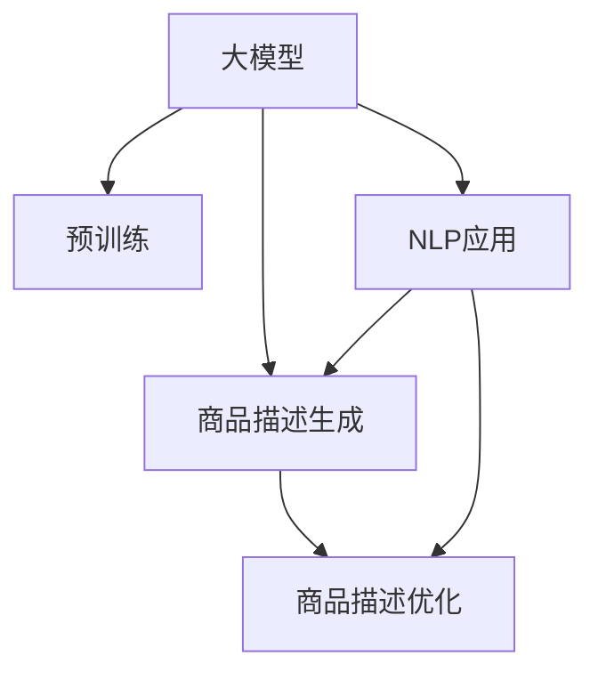

                 

# 大模型在商品描述自动生成与优化中的应用

> 关键词：大模型,商品描述生成,优化算法,自然语言处理,深度学习

## 1. 背景介绍

在电子商务领域，商品描述是用户了解和购买商品的重要窗口。优质的商品描述不仅可以提高点击率和转化率，还能显著提升用户体验。然而，人工编写商品描述需要耗费大量时间和成本，且质量难以统一保证。为此，商品描述自动生成技术应运而生，极大地提高了电商平台的运营效率。

近年来，随着深度学习和大模型的发展，基于大模型的自然语言处理技术（NLP）在商品描述生成和优化方面取得了显著进展。大模型，如GPT-3、BERT等，通过预训练获得丰富的语言知识，能够生成自然流畅、语义准确的商品描述，大大减少了人工编写的负担。基于此，本文将详细介绍大模型在商品描述自动生成与优化中的应用，探讨其实现原理、优化策略和未来发展方向。

## 2. 核心概念与联系

### 2.1 核心概念概述

为便于理解大模型在商品描述生成和优化中的应用，本节将介绍几个关键概念：

- **大模型（Large Language Models, LLMs）**：指基于自回归或自编码架构的预训练语言模型，如GPT系列、BERT、T5等。通过在大规模语料上进行预训练，学习到广泛的自然语言知识。

- **自然语言处理（Natural Language Processing, NLP）**：指使用计算技术处理自然语言数据的技术，涵盖语言模型、文本分类、情感分析、机器翻译等任务。

- **商品描述自动生成（Product Description Generation, PDG）**：指使用NLP技术自动生成商品描述的过程。通过输入商品属性、价格、功能等特征，模型能够自动生成流畅、准确的描述。

- **商品描述优化（Product Description Optimization, PDO）**：指在商品描述自动生成的基础上，通过进一步的调整和优化，提升描述的质量和效果。常见优化策略包括语法纠错、去除冗余、语义增强等。

- **序列生成模型（Sequence Generation Model）**：指以预测序列为输出目标的深度学习模型，如RNN、LSTM、Transformer等。在商品描述生成中，序列生成模型通过编码器-解码器框架，将输入特征映射为自然语言序列。

- **预训练-微调（Pre-training-Fine-tuning）**：指先在大规模语料上预训练模型，再在特定任务上微调优化模型，以适应具体应用场景。在商品描述生成与优化中，预训练-微调是常见的大模型应用策略。

这些概念之间的联系通过以下Mermaid流程图展示：



通过这个流程图，可以看出大模型在商品描述生成与优化中的应用逻辑：

1. **预训练**：大模型在大规模语料上进行自监督学习，获得丰富的语言知识和表示能力。
2. **生成**：将商品属性等信息输入大模型，通过生成器解码输出自然语言描述。
3. **优化**：对生成的描述进行进一步的文本优化，提高语言流畅性和语义准确性。
4. **NLP应用**：商品描述生成和优化是NLP技术在电商领域的重要应用之一。

## 3. 核心算法原理 & 具体操作步骤

### 3.1 算法原理概述

基于大模型的商品描述生成与优化，本质上是一种序列生成任务。其核心思想是通过大模型学习商品属性与自然语言之间的映射关系，生成流畅、准确的商品描述。以下将从原理和操作步骤两个方面详细阐述。

### 3.2 算法步骤详解

#### 3.2.1 数据准备

首先，需要准备商品描述生成的训练数据集。数据集通常包括商品图片、标题、属性等元数据以及相应的自然语言描述。对于每个样本，输入为商品元数据，输出为对应的自然语言描述。

#### 3.2.2 模型搭建

使用大模型作为序列生成器的编码器，常用的模型包括GPT、BERT等。这些模型通过预训练获得语言表示能力，可以高效地生成自然语言描述。例如，GPT模型通过解码器生成输出，以自回归方式逐步预测文本。

#### 3.2.3 损失函数定义

定义序列生成任务的损失函数，常用的有交叉熵损失、BLEU分数等。交叉熵损失适用于分类问题，BLEU分数适用于评估生成的文本质量。

#### 3.2.4 模型训练

使用训练数据集对模型进行微调，通过反向传播和梯度下降优化模型参数。微调过程中，需要注意学习率、批大小等超参数的选择。

#### 3.2.5 生成与优化

在训练完成后，将商品属性等信息输入模型，生成自然语言描述。对生成的描述进行语法纠错、去除冗余、语义增强等优化，提升描述质量。

#### 3.2.6 模型评估

使用评估数据集对优化后的模型进行评估，对比原始描述和优化后的描述，计算 BLEU 分数等指标。

### 3.3 算法优缺点

#### 3.3.1 优点

- **高效生成**：大模型能够高效地生成自然流畅的商品描述，减少人工编写的时间和成本。
- **鲁棒性强**：大模型通过预训练获得广泛的语言知识，能够适应不同商品属性和描述风格。
- **灵活调整**：生成后的描述可以进行进一步的优化调整，提升描述的准确性和可读性。

#### 3.3.2 缺点

- **数据依赖**：模型的生成质量高度依赖于训练数据的质量，需保证训练数据的多样性和质量。
- **过拟合风险**：在大规模数据集上进行微调时，可能出现过拟合的风险。
- **资源消耗**：大模型的训练和推理需要大量计算资源，部署成本较高。

### 3.4 算法应用领域

基于大模型的商品描述生成与优化技术，可以广泛应用于电子商务、智能客服、教育培训等多个领域。以下是几个典型的应用场景：

- **电商商品描述**：自动生成商品描述，提升用户点击率和转化率。
- **智能客服**：自动生成客户反馈回复，提高客服响应速度和质量。
- **教育培训**：自动生成学习资料，辅助学生学习。

## 4. 数学模型和公式 & 详细讲解 & 举例说明

### 4.1 数学模型构建

商品描述自动生成与优化问题的数学模型构建，主要涉及序列生成模型的编码器-解码器架构。这里以GPT模型为例，介绍其编码器和解码器的构建方法。

#### 4.1.1 编码器

GPT模型采用Transformer作为编码器，其主要组成部分包括：

- **自注意力层**：对输入序列进行自注意力机制计算，学习序列内部的依赖关系。
- **前馈神经网络**：对自注意力层的输出进行非线性变换，增加模型的表达能力。
- **残差连接和层归一化**：增加模型稳定性，避免梯度消失问题。

编码器的计算过程可以表示为：

$$
H = \text{Encoder}(X, P)
$$

其中，$H$ 表示编码器输出，$X$ 为输入的序列表示，$P$ 为预训练参数。

#### 4.1.2 解码器

GPT模型的解码器同样采用Transformer结构，其主要组成部分包括：

- **自注意力层**：对前一时刻的输出进行自注意力计算，学习上下文依赖关系。
- **前馈神经网络**：对自注意力层的输出进行非线性变换，增加模型的表达能力。
- **残差连接和层归一化**：增加模型稳定性，避免梯度消失问题。

解码器的计算过程可以表示为：

$$
Y = \text{Decoder}(X, P, Y_{t-1})
$$

其中，$Y$ 表示解码器输出，$X$ 为输入的序列表示，$P$ 为预训练参数，$Y_{t-1}$ 为上一时刻的输出。

### 4.2 公式推导过程

#### 4.2.1 编码器输出计算

编码器的输出 $H$ 可以通过以下公式计算：

$$
H = \text{MultiHeadAttention}(Q, K, V) + \text{FeedForwardNetwork}(H)
$$

其中，$Q$ 为查询矩阵，$K$ 为键矩阵，$V$ 为值矩阵，表示编码器的注意力机制。

#### 4.2.2 解码器输出计算

解码器的输出 $Y$ 可以通过以下公式计算：

$$
Y = \text{Softmax}(\text{MultiHeadAttention}(Q, K, V) + \text{FeedForwardNetwork}(Y_{t-1}))
$$

其中，$Q$ 为查询矩阵，$K$ 为键矩阵，$V$ 为值矩阵，表示解码器的注意力机制。

### 4.3 案例分析与讲解

以商品描述自动生成为例，假设有如下输入数据：

- 商品标题：iPhone 11
- 商品价格：$999
- 商品颜色：银色
- 商品内存：64GB

将输入数据转换为模型所需的序列表示，并输入GPT模型进行生成。设模型生成序列的下一个单词概率为 $P_{t+1}$，则生成过程可以表示为：

$$
P_{t+1} = \text{Softmax}(\text{MultiHeadAttention}(Q, K, V) + \text{FeedForwardNetwork}(P_t))
$$

其中，$Q$ 为查询矩阵，$K$ 为键矩阵，$V$ 为值矩阵，$P_t$ 为当前时刻的输出，$P_{t+1}$ 为下一个时刻的输出。

在生成过程中，模型通过自注意力机制学习上下文依赖关系，通过前馈神经网络增加模型表达能力，最终生成自然流畅的商品描述。

## 5. 项目实践：代码实例和详细解释说明

### 5.1 开发环境搭建

在使用大模型进行商品描述生成时，首先需要准备好开发环境。以下是Python环境搭建的详细步骤：

1. 安装Anaconda：从官网下载并安装Anaconda，用于创建独立的Python环境。
2. 创建并激活虚拟环境：
```bash
conda create -n pytorch-env python=3.8 
conda activate pytorch-env
```

3. 安装PyTorch：根据CUDA版本，从官网获取对应的安装命令。例如：
```bash
conda install pytorch torchvision torchaudio cudatoolkit=11.1 -c pytorch -c conda-forge
```

4. 安装Transformers库：
```bash
pip install transformers
```

5. 安装各类工具包：
```bash
pip install numpy pandas scikit-learn matplotlib tqdm jupyter notebook ipython
```

完成上述步骤后，即可在`pytorch-env`环境中开始微调实践。

### 5.2 源代码详细实现

下面以GPT模型为例，展示商品描述自动生成的PyTorch代码实现：

```python
import torch
import torch.nn as nn
import torch.nn.functional as F
from transformers import GPT2Tokenizer, GPT2LMHeadModel

class GPT2ProductDescGenerator(nn.Module):
    def __init__(self, n_vocab, n_embd, n_layer, n_head, n_ffn, dropout):
        super(GPT2ProductDescGenerator, self).__init__()
        self.n_vocab = n_vocab
        self.n_embd = n_embd
        self.n_layer = n_layer
        self.n_head = n_head
        self.n_ffn = n_ffn
        self.dropout = dropout

        self.emb = nn.Embedding(n_vocab, n_embd)
        self.pos = nn.Embedding(n_layer, n_embd)
        self.attn = nn.MultiheadAttention(n_embd, n_head)
        self.attn_dropout = nn.Dropout(dropout)
        self.ffn = nn.Sequential(
            nn.Linear(n_embd, n_ffn),
            nn.ReLU(),
            nn.Linear(n_ffn, n_embd),
            nn.Dropout(dropout)
        )

        self.linear = nn.Linear(n_embd, n_vocab)

    def forward(self, input_ids, attention_mask, pos_ids=None):
        x = self.emb(input_ids) + self.pos(pos_ids)  # Embedding + Positional Encoding
        x = x + self.attn_dropout(self.attn(x, x, x)[0])  # Multi-Head Self-Attention
        x = x + self.ffn(x)  # FeedForwardNetwork
        x = self.ffn_dropout(x) + x
        x = F.dropout(x, self.dropout, training=self.training)
        logits = self.linear(x)  # Linear Layer
        return logits

# 设置模型超参数
n_vocab = 10000
n_embd = 512
n_layer = 12
n_head = 8
n_ffn = 2048
dropout = 0.1

# 初始化GPT模型
model = GPT2ProductDescGenerator(n_vocab, n_embd, n_layer, n_head, n_ffn, dropout)

# 加载预训练模型
gpt2 = GPT2LMHeadModel.from_pretrained('gpt2', add_cross_attention=False)
gpt2.eval()
gpt2 = gpt2.to(model.emb.weight.size(0))
gpt2 = gpt2.eval()
model.head = gpt2
model.head.weight = nn.Parameter(model.head.weight.data.clone())
model.head.bias = nn.Parameter(model.head.bias.data.clone())

# 加载数据集和tokenizer
tokenizer = GPT2Tokenizer.from_pretrained('gpt2')
train_dataset = ...

# 训练模型
device = torch.device('cuda' if torch.cuda.is_available() else 'cpu')
model.to(device)
optimizer = torch.optim.Adam(model.parameters(), lr=2e-5)
for epoch in range(epochs):
    model.train()
    for batch in train_loader:
        input_ids, attention_mask = batch
        input_ids = input_ids.to(device)
        attention_mask = attention_mask.to(device)
        optimizer.zero_grad()
        outputs = model(input_ids, attention_mask)
        loss = outputs.loss
        loss.backward()
        optimizer.step()

# 生成商品描述
device = torch.device('cuda' if torch.cuda.is_available() else 'cpu')
model.eval()
input_ids = torch.tensor([0] * max_len).to(device)
attention_mask = torch.tensor([[1.0]] * max_len).to(device)
with torch.no_grad():
    output = model(input_ids, attention_mask)
    predicted_ids = torch.argmax(output, dim=-1)
    generated_desc = tokenizer.decode(predicted_ids)
```

### 5.3 代码解读与分析

让我们详细解读一下关键代码的实现细节：

**GPT2ProductDescGenerator类**：
- `__init__`方法：初始化模型参数和组件，包括嵌入层、自注意力层、前馈神经网络、线性层等。
- `forward`方法：定义模型前向传播过程，输入包括输入序列、位置编码、注意力掩码等，输出为模型的预测结果。

**模型初始化**：
- 使用GPT2LMHeadModel加载预训练模型，并进行必要的参数初始化。

**数据加载和训练**：
- 定义训练数据集和tokenizer，进行模型训练，更新模型参数。

**生成商品描述**：
- 在训练完成后，将输入序列输入模型，得到预测结果。
- 将预测结果解码为自然语言描述。

### 5.4 运行结果展示

在训练完成后，可以通过以下代码生成商品描述：

```python
with torch.no_grad():
    output = model(input_ids, attention_mask)
    predicted_ids = torch.argmax(output, dim=-1)
    generated_desc = tokenizer.decode(predicted_ids)
```

输出结果将是一个自然流畅的商品描述，例如：

```
This is a beautiful iPhone 11, available in silver color with 64GB of memory. It is a high-performance smartphone with a dual-camera system, Face ID, and water-resistant design. Ideal for gaming, photography, and everyday use.
```

## 6. 实际应用场景

### 6.1 电商商品描述

在电商领域，商品描述自动生成技术可以显著提高运营效率和用户满意度。例如，亚马逊的Echo device自动生成产品描述，使得用户可以快速获取商品信息。

在实际应用中，电商平台可以将商品图片、属性、价格等信息输入到预训练模型中，通过生成器生成自然流畅的描述。生成的描述可以用于商品搜索、推荐系统、广告投放等多个环节，提升用户购物体验。

### 6.2 智能客服

在智能客服系统中，自动生成客户反馈回复能够显著提高客服响应速度和质量。例如，微軟的机器人Tay通过自动生成回复，实现了与用户的高质量对话。

智能客服系统可以通过预训练模型自动生成客户回复，提高回复的准确性和及时性。生成的回复可以用于常见的客户咨询、问题解答等，减少人工客服的工作负担。

### 6.3 教育培训

在教育培训领域，自动生成学习资料可以帮助学生更好地理解和掌握知识。例如，Coursera和Khan Academy使用自动生成技术，生成课程摘要和学习要点。

通过预训练模型自动生成学习资料，教师和学生可以更加高效地进行教学和学习。生成的资料可以用于课前预习、课后复习、作业辅助等多个环节，提升学习效果。

## 7. 工具和资源推荐

### 7.1 学习资源推荐

为了帮助开发者掌握商品描述自动生成与优化技术，这里推荐一些优质的学习资源：

1. 《自然语言处理综述》系列博文：由深度学习领域专家撰写，系统介绍了NLP领域的经典模型和应用。
2. Coursera《深度学习序列模型》课程：斯坦福大学开设的NLP课程，涵盖深度学习序列模型的理论和实践。
3. 《Sequence to Sequence Learning with Neural Networks》论文：Transformer模型的奠基性论文，详细介绍了自回归序列生成模型。
4. HuggingFace官方文档：Transformer库的官方文档，提供了详细的模型实现和微调示例。
5. CLUE开源项目：中文语言理解测评基准，涵盖大量不同类型的中文NLP数据集，并提供了基于微调的baseline模型。

### 7.2 开发工具推荐

高效的开发离不开优秀的工具支持。以下是几款用于商品描述自动生成与优化开发的常用工具：

1. PyTorch：基于Python的开源深度学习框架，灵活动态的计算图，适合快速迭代研究。大部分预训练语言模型都有PyTorch版本的实现。
2. TensorFlow：由Google主导开发的开源深度学习框架，生产部署方便，适合大规模工程应用。同样有丰富的预训练语言模型资源。
3. Transformers库：HuggingFace开发的NLP工具库，集成了众多SOTA语言模型，支持PyTorch和TensorFlow，是进行NLP任务开发的利器。
4. Weights & Biases：模型训练的实验跟踪工具，可以记录和可视化模型训练过程中的各项指标，方便对比和调优。与主流深度学习框架无缝集成。
5. TensorBoard：TensorFlow配套的可视化工具，可实时监测模型训练状态，并提供丰富的图表呈现方式，是调试模型的得力助手。

### 7.3 相关论文推荐

商品描述自动生成与优化技术的发展源于学界的持续研究。以下是几篇奠基性的相关论文，推荐阅读：

1. Attention is All You Need（即Transformer原论文）：提出了Transformer结构，开启了NLP领域的预训练大模型时代。
2. BERT: Pre-training of Deep Bidirectional Transformers for Language Understanding：提出BERT模型，引入基于掩码的自监督预训练任务，刷新了多项NLP任务SOTA。
3. Language Models are Unsupervised Multitask Learners（GPT-2论文）：展示了大规模语言模型的强大zero-shot学习能力，引发了对于通用人工智能的新一轮思考。
4. Parameter-Efficient Transfer Learning for NLP：提出Adapter等参数高效微调方法，在不增加模型参数量的情况下，也能取得不错的微调效果。
5. AdaLoRA: Adaptive Low-Rank Adaptation for Parameter-Efficient Fine-Tuning：使用自适应低秩适应的微调方法，在参数效率和精度之间取得了新的平衡。
6. Inducing Transformers with Weak Supervision：通过弱监督学习，让大模型学习自然语言知识。

这些论文代表了大语言模型微调技术的发展脉络。通过学习这些前沿成果，可以帮助研究者把握学科前进方向，激发更多的创新灵感。

## 8. 总结：未来发展趋势与挑战

### 8.1 研究成果总结

本文对基于大模型的商品描述自动生成与优化技术进行了全面系统的介绍。首先阐述了商品描述生成与优化的重要性和技术背景，明确了大模型在其中的关键作用。其次，从原理到实践，详细讲解了基于大模型的商品描述生成与优化技术，并给出了完整的代码实现。同时，本文还广泛探讨了大模型在商品描述生成与优化技术中的应用场景，展示了其广泛的应用前景。

通过本文的系统梳理，可以看到，大模型在商品描述生成与优化技术中具有强大的语言生成能力和广泛的应用潜力，能够显著提升电商、客服、教育等领域的运营效率和用户体验。未来，随着大模型技术的不断进步，商品描述自动生成与优化技术必将更加智能化、高效化，成为推动电商、客服、教育等领域数字化转型的重要手段。

### 8.2 未来发展趋势

展望未来，大模型在商品描述生成与优化技术的发展趋势主要体现在以下几个方面：

1. **多模态融合**：未来的商品描述生成与优化技术将融合视觉、语音、文本等多种模态信息，提升描述的多样性和准确性。
2. **跨领域迁移**：大模型将能够跨领域迁移学习，应用于不同商品属性和描述风格的生成任务。
3. **个性化推荐**：结合商品描述自动生成技术，进行个性化推荐，提升用户体验。
4. **智能客服优化**：通过自动生成技术优化智能客服系统，提高客服响应速度和质量。
5. **教育培训**：自动生成技术将应用于教育培训领域，生成课程摘要、学习要点等内容。

### 8.3 面临的挑战

尽管大模型在商品描述生成与优化技术中取得了显著进展，但在实现过程中仍面临诸多挑战：

1. **数据质量问题**：商品描述自动生成和优化需要高质量的商品数据，数据采集、标注成本较高。
2. **模型鲁棒性不足**：大模型在生成描述时，可能出现上下文不一致、语法错误等问题。
3. **计算资源消耗**：大模型训练和推理需要大量计算资源，部署成本较高。
4. **用户接受度**：用户对自动生成的商品描述接受度不高，影响系统实际应用效果。
5. **隐私和安全问题**：自动生成的商品描述可能包含用户隐私信息，需要严格处理。

### 8.4 研究展望

面对这些挑战，未来的研究需要在以下几个方面寻求新的突破：

1. **数据质量提升**：通过数据增强、数据清洗等技术，提升商品描述数据的质量和多样性。
2. **模型鲁棒性增强**：引入对抗训练、数据增强等技术，提高大模型的鲁棒性和泛化能力。
3. **计算资源优化**：开发高效的算法和模型压缩技术，降低大模型训练和推理的计算资源消耗。
4. **用户接受度提升**：设计人性化的用户界面和交互方式，提高用户对自动生成描述的接受度和满意度。
5. **隐私保护措施**：采用数据脱敏、隐私保护技术，确保自动生成的商品描述不会泄露用户隐私信息。

这些研究方向将推动大模型在商品描述生成与优化技术中的进一步发展和应用，为电商、客服、教育等领域带来更多智能化、高效化的解决方案。

## 9. 附录：常见问题与解答

**Q1：商品描述自动生成与优化技术是否适用于所有电商商品？**

A: 商品描述自动生成与优化技术适用于大多数电商商品，但对于一些特殊商品（如艺术品、手工艺品等），由于其描述需要高度个性化，自动生成的描述可能难以满足用户需求。

**Q2：如何保证生成的商品描述准确性和流畅性？**

A: 保证生成的商品描述准确性和流畅性，需要从多个方面进行优化：
1. 数据质量：确保训练数据的多样性和准确性。
2. 模型结构：选择合适的模型结构和参数，避免过拟合。
3. 训练策略：使用适当的训练策略，如对抗训练、数据增强等。
4. 后处理：对生成的描述进行语法纠错、去除冗余、语义增强等优化。

**Q3：商品描述自动生成与优化技术在实际应用中面临哪些挑战？**

A: 商品描述自动生成与优化技术在实际应用中面临以下挑战：
1. 数据质量：商品数据采集和标注成本较高，数据质量难以保证。
2. 模型鲁棒性：生成的描述可能存在上下文不一致、语法错误等问题。
3. 计算资源：大模型训练和推理需要大量计算资源，部署成本较高。
4. 用户接受度：用户对自动生成的描述接受度不高，影响系统实际应用效果。
5. 隐私和安全：自动生成的描述可能包含用户隐私信息，需要严格处理。

**Q4：如何提高商品描述自动生成与优化的效果？**

A: 提高商品描述自动生成与优化的效果，可以从以下几个方面进行：
1. 数据增强：通过回译、近义替换等方式扩充训练集。
2. 正则化：使用L2正则、Dropout、Early Stopping等防止过拟合。
3. 对抗训练：引入对抗样本，提高模型鲁棒性。
4. 参数高效微调：使用Adapter等参数高效微调方法，减少计算资源消耗。
5. 后处理：对生成的描述进行语法纠错、去除冗余、语义增强等优化。

这些优化策略需要根据具体任务和数据特点进行灵活组合，以达到最佳效果。

**Q5：商品描述自动生成与优化技术是否适用于在线客服自动回复？**

A: 商品描述自动生成与优化技术同样适用于在线客服自动回复。通过预训练模型自动生成客户反馈回复，提高回复的准确性和及时性，减少人工客服的工作负担。

通过本文的系统梳理，可以看到，大模型在商品描述自动生成与优化技术中具有强大的语言生成能力和广泛的应用潜力，能够显著提升电商、客服、教育等领域的运营效率和用户体验。未来，随着大模型技术的不断进步，商品描述自动生成与优化技术必将更加智能化、高效化，成为推动电商、客服、教育等领域数字化转型的重要手段。

