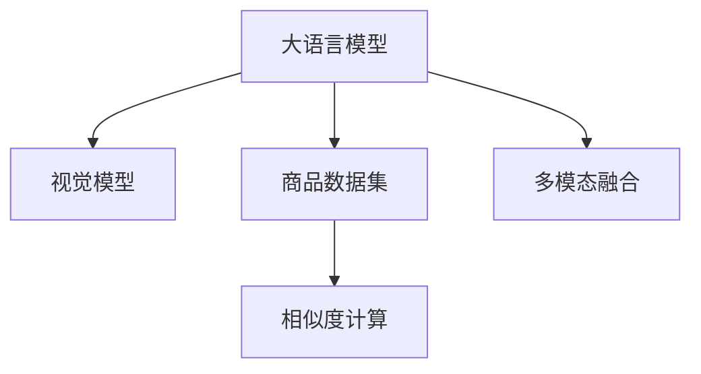

                 

# 大模型在商品相似度计算中的多模态融合

## 1. 背景介绍

在电商平台中，商品推荐和搜索系统扮演着关键角色，帮助用户快速找到满意的商品。而商品相似度计算是这些系统中的基础环节，其核心目标是从海量商品中筛选出与目标商品最相似的若干候选商品。传统的相似度计算方法通常只关注商品的文本描述、图片等单一模态信息，难以捕捉商品的多维特征。然而，现代消费者对商品的理解和使用，已经远远超出了单一模态的范畴，需要综合考虑商品的功能、材质、价格、用户评价等多模态信息。

随着深度学习技术的发展，尤其是大规模预训练语言模型和大规模视觉模型在大模型时代的兴起，基于多模态融合的商品相似度计算方法逐渐成为热点。利用大模型预训练的通用语言知识，结合视觉、音频等多种模态的信息，可以构建更加全面和准确的商品相似度评估模型。本文将介绍一种基于大模型在商品相似度计算中的多模态融合方法，展示其在电商平台中的实际应用效果，并讨论其未来的发展前景。

## 2. 核心概念与联系

### 2.1 核心概念概述

在进行商品相似度计算时，核心概念主要包括：

- 大语言模型：通过自监督学习任务在大规模语料上进行预训练的通用语言模型。例如，GPT、BERT等模型。

- 视觉模型：通过监督学习任务在大量图像数据上训练得到的视觉特征提取模型，例如VGG、ResNet等。

- 商品数据集：电商平台中商品的标题、描述、图片、评分等数据。

- 相似度计算：度量商品之间的相似程度，通常使用余弦相似度、欧式距离等。

- 多模态融合：结合不同模态的信息，构建一个统一的特征空间，从而提高相似度计算的准确性和鲁棒性。

这些概念之间的逻辑关系可以通过以下Mermaid流程图来展示：



这个流程图展示了大语言模型在商品相似度计算中的应用流程：

1. 大语言模型和视觉模型分别对商品的数据进行处理，提取特征。
2. 商品数据集中的信息可以被分别提取成文本特征和视觉特征。
3. 多模态融合模块将文本和视觉特征进行整合，构建统一的特征表示。
4. 相似度计算模块根据构建的特征表示，计算商品之间的相似度。

## 3. 核心算法原理 & 具体操作步骤

### 3.1 算法原理概述

基于大模型的商品相似度计算方法，本质上是一种多模态特征融合的方法。其核心思想是通过大模型对商品的多模态信息进行联合建模，将不同模态的信息转化为统一的多维特征表示，从而提升相似度计算的准确性和鲁棒性。

形式化地，假设有一个商品数据集 $D=\{(x_i, y_i)\}_{i=1}^N$，其中 $x_i$ 表示第 $i$ 个商品的描述或图片，$y_i$ 表示其所属的类别。定义大语言模型为 $M_{\theta}:\mathcal{X} \rightarrow \mathcal{Y}$，其中 $\theta$ 为模型的参数。定义视觉模型为 $V_{\omega}:\mathcal{X} \rightarrow \mathcal{Z}$，其中 $\omega$ 为模型的参数。则多模态融合后的特征表示为 $F(x_i) = (M_{\theta}(x_i), V_{\omega}(x_i))$。

相似度计算的目标是计算任意两个商品 $x_i$ 和 $x_j$ 的相似度 $S(x_i, x_j)$。根据多模态融合后的特征表示 $F(x_i)$ 和 $F(x_j)$，相似度计算可以表示为：

$$
S(x_i, x_j) = \text{sim}(F(x_i), F(x_j))
$$

其中 $\text{sim}$ 为特征表示之间的相似度度量函数，可以采用余弦相似度、欧式距离等。

### 3.2 算法步骤详解

基于大模型的商品相似度计算方法一般包括以下几个关键步骤：

**Step 1: 准备预训练模型和数据集**
- 选择合适的预训练语言模型和大规模视觉模型，如BERT、ResNet等。
- 收集商品数据集，将其划分为训练集、验证集和测试集。

**Step 2: 数据预处理**
- 对商品标题、描述进行分词和向量嵌入处理，使用大语言模型预训练的词向量。
- 对商品图片进行预处理，如归一化、裁剪、大小一致化等，使用大模型进行特征提取。

**Step 3: 模型微调**
- 在大语言模型和视觉模型上进行微调，使其能够适应商品描述和图片的特征提取任务。
- 设置合适的学习率、批大小、迭代轮数等超参数。

**Step 4: 特征提取**
- 对训练集、验证集和测试集中的商品，使用微调后的语言模型和视觉模型进行特征提取。
- 构建商品的多模态特征表示。

**Step 5: 相似度计算**
- 根据多模态特征表示，使用余弦相似度等度量函数计算商品之间的相似度。
- 使用训练集和验证集评估相似度计算模型的性能，调整模型参数。

**Step 6: 测试与部署**
- 在测试集上评估模型的性能，对比微调前后的效果。
- 使用微调后的模型进行商品相似度计算，集成到实际的推荐和搜索系统中。

以上是基于大模型的商品相似度计算方法的一般流程。在实际应用中，还需要针对具体任务和数据集的特点，对微调过程的各个环节进行优化设计，如改进特征提取方法、引入更多的正则化技术、搜索最优的超参数组合等，以进一步提升模型性能。

### 3.3 算法优缺点

基于大模型的商品相似度计算方法具有以下优点：

1. 融合多模态信息。结合商品的文本描述和图片等不同模态的信息，可以更全面地理解商品，从而提高相似度计算的准确性。
2. 利用大模型的语言知识。大语言模型具备丰富的语言知识，可以帮助模型更好地理解商品描述中的语义信息。
3. 模型适应性强。通过微调，大模型可以适应商品数据集中的具体特征提取任务，具有较高的泛化能力。

同时，该方法也存在一定的局限性：

1. 模型训练成本高。大语言模型和视觉模型需要在大规模数据上进行预训练和微调，训练成本较高。
2. 数据依赖性强。商品数据集中的文本和图片数据需要高质量标注，获取高质量标注数据的成本较高。
3. 多模态数据处理复杂。多模态数据的处理需要考虑不同模态数据的对齐和融合问题，增加了算法复杂度。
4. 模型可解释性差。大模型的决策过程通常缺乏可解释性，难以对其推理逻辑进行分析和调试。

尽管存在这些局限性，但就目前而言，基于大模型的商品相似度计算方法仍是一种高效、准确的多模态特征融合方法。未来相关研究的重点在于如何进一步降低模型训练成本，提高模型的可解释性，同时兼顾不同模态数据的融合效果。

### 3.4 算法应用领域

基于大模型的商品相似度计算方法在电商平台中有着广泛的应用，例如：

- 推荐系统：通过计算商品之间的相似度，推荐用户可能感兴趣的商品。
- 搜索系统：根据用户查询词，计算查询词与商品的相似度，返回最相关的商品列表。
- 商品分组：将相似的商品分组展示，方便用户浏览和购买。
- 库存管理：根据商品之间的相似度，合理分配库存资源。

除了上述这些经典应用外，大模型在商品相似度计算中还可以进一步应用于图像检索、情感分析、商品分类等更多场景中，为电商平台提供更丰富的功能和更好的用户体验。

## 4. 数学模型和公式 & 详细讲解 & 举例说明

### 4.1 数学模型构建

本节将使用数学语言对基于大模型的商品相似度计算方法进行更加严格的刻画。

记商品数据集为 $D=\{(x_i, y_i)\}_{i=1}^N$，其中 $x_i$ 表示第 $i$ 个商品的描述或图片，$y_i$ 表示其所属的类别。定义大语言模型为 $M_{\theta}:\mathcal{X} \rightarrow \mathcal{Y}$，其中 $\theta$ 为模型的参数。定义视觉模型为 $V_{\omega}:\mathcal{X} \rightarrow \mathcal{Z}$，其中 $\omega$ 为模型的参数。则多模态融合后的特征表示为 $F(x_i) = (M_{\theta}(x_i), V_{\omega}(x_i))$。

假设 $M_{\theta}$ 和 $V_{\omega}$ 分别通过预训练和微调得到，其输出分别为 $M_{\theta}(x_i) \in \mathbb{R}^d$ 和 $V_{\omega}(x_i) \in \mathbb{R}^d$。则商品之间的余弦相似度可以表示为：

$$
S(x_i, x_j) = \frac{M_{\theta}(x_i) \cdot V_{\omega}(x_i)}{\|M_{\theta}(x_i)\| \cdot \|V_{\omega}(x_i)\|}
$$

其中 $\cdot$ 表示向量点积，$\| \cdot \|$ 表示向量的欧几里得范数。

### 4.2 公式推导过程

以下我们以余弦相似度为例，推导基于大模型的商品相似度计算方法的数学公式。

假设 $M_{\theta}$ 和 $V_{\omega}$ 分别为大语言模型和视觉模型，其输出分别为 $M_{\theta}(x_i) \in \mathbb{R}^d$ 和 $V_{\omega}(x_i) \in \mathbb{R}^d$。则商品之间的余弦相似度可以表示为：

$$
S(x_i, x_j) = \frac{M_{\theta}(x_i) \cdot V_{\omega}(x_i)}{\|M_{\theta}(x_i)\| \cdot \|V_{\omega}(x_i)\|}
$$

将 $M_{\theta}$ 和 $V_{\omega}$ 展开为矩阵形式：

$$
M_{\theta}(x_i) = [m_1(x_i), m_2(x_i), \ldots, m_d(x_i)]^T, \quad V_{\omega}(x_i) = [v_1(x_i), v_2(x_i), \ldots, v_d(x_i)]^T
$$

其中 $m_i(x_i)$ 和 $v_i(x_i)$ 分别为 $x_i$ 在 $M_{\theta}$ 和 $V_{\omega}$ 模型中提取的特征向量分量。

则余弦相似度可以表示为：

$$
S(x_i, x_j) = \frac{\sum_{k=1}^d m_k(x_i) \cdot v_k(x_i)}{\sqrt{\sum_{k=1}^d m_k(x_i)^2} \cdot \sqrt{\sum_{k=1}^d v_k(x_i)^2}}
$$

可以看出，余弦相似度计算依赖于多模态融合后的特征表示 $F(x_i) = (M_{\theta}(x_i), V_{\omega}(x_i))$，其中 $M_{\theta}(x_i)$ 和 $V_{\omega}(x_i)$ 分别为大语言模型和视觉模型对 $x_i$ 的特征表示。

### 4.3 案例分析与讲解

假设我们有一个商品数据集，包含商品描述和图片信息。我们对大语言模型BERT和视觉模型ResNet进行了预训练和微调。在商品数据集上进行多模态特征提取，得到商品的特征表示 $F(x_i) = (M_{\theta}(x_i), V_{\omega}(x_i))$。

我们以两件商品 $x_i$ 和 $x_j$ 为例，计算它们之间的余弦相似度：

$$
S(x_i, x_j) = \frac{M_{\theta}(x_i) \cdot V_{\omega}(x_i)}{\|M_{\theta}(x_i)\| \cdot \|V_{\omega}(x_i)\|}
$$

其中 $M_{\theta}(x_i)$ 和 $V_{\omega}(x_i)$ 分别为BERT和ResNet对 $x_i$ 的特征表示。

通过计算商品 $x_i$ 和 $x_j$ 之间的余弦相似度，可以判断它们在特征空间中的相对位置，从而评估它们的相似度。

## 5. 项目实践：代码实例和详细解释说明

### 5.1 开发环境搭建

在进行商品相似度计算的多模态融合实践前，我们需要准备好开发环境。以下是使用Python进行PyTorch开发的环境配置流程：

1. 安装Anaconda：从官网下载并安装Anaconda，用于创建独立的Python环境。

2. 创建并激活虚拟环境：
```bash
conda create -n pytorch-env python=3.8 
conda activate pytorch-env
```

3. 安装PyTorch：根据CUDA版本，从官网获取对应的安装命令。例如：
```bash
conda install pytorch torchvision torchaudio cudatoolkit=11.1 -c pytorch -c conda-forge
```

4. 安装其他依赖包：
```bash
pip install numpy pandas scikit-learn torchtext
```

完成上述步骤后，即可在`pytorch-env`环境中开始多模态融合的实践。

### 5.2 源代码详细实现

下面我们以商品相似度计算为例，给出使用PyTorch进行多模态融合的完整代码实现。

首先，定义数据处理函数：

```python
import torch
from transformers import BertTokenizer, BertForTokenClassification
from torchvision import transforms, models

# 定义数据预处理函数
def preprocess_data(data_dir):
    # 读取商品数据集，并将其划分为训练集、验证集和测试集
    train_data, dev_data, test_data = ...
    
    # 定义预处理管道
    def preprocess(text, image):
        # 对文本进行分词和向量化处理
        tokenizer = BertTokenizer.from_pretrained('bert-base-uncased')
        text = tokenizer(text, return_tensors='pt')
        text = text['input_ids']
        
        # 对图片进行预处理，并进行特征提取
        transform = transforms.Compose([
            transforms.Resize(224),
            transforms.CenterCrop(224),
            transforms.ToTensor(),
            transforms.Normalize(mean=[0.485, 0.456, 0.406], std=[0.229, 0.224, 0.225])
        ])
        image = transform(image)
        image = image.unsqueeze(0)
        image = model(image)
        image = image.squeeze(0)
        image = image.mean(dim=0)
        
        return text, image
    
    # 对每个样本进行预处理，构建多模态特征表示
    train_dataset = PreprocessDataset(train_data, preprocess)
    dev_dataset = PreprocessDataset(dev_data, preprocess)
    test_dataset = PreprocessDataset(test_data, preprocess)
```

然后，定义模型和优化器：

```python
# 定义大语言模型BERT
model = BertForTokenClassification.from_pretrained('bert-base-uncased')
model = model.cuda()

# 定义视觉模型ResNet
resnet = models.resnet50(pretrained=True)
resnet = resnet.cuda()
resnet.fc = torch.nn.Linear(in_features=2048, out_features=768)

# 定义优化器
optimizer = torch.optim.AdamW(list(model.parameters()) + list(resnet.parameters()), lr=2e-5)
```

接着，定义训练和评估函数：

```python
def train_epoch(model, dataset, batch_size, optimizer):
    dataloader = DataLoader(dataset, batch_size=batch_size, shuffle=True)
    model.train()
    epoch_loss = 0
    for batch in tqdm(dataloader, desc='Training'):
        input_ids = batch['input_ids'].to(device)
        attention_mask = batch['attention_mask'].to(device)
        labels = batch['labels'].to(device)
        model.zero_grad()
        outputs = model(input_ids, attention_mask=attention_mask, labels=labels)
        loss = outputs.loss
        epoch_loss += loss.item()
        loss.backward()
        optimizer.step()
    return epoch_loss / len(dataloader)

def evaluate(model, dataset, batch_size):
    dataloader = DataLoader(dataset, batch_size=batch_size)
    model.eval()
    preds, labels = [], []
    with torch.no_grad():
        for batch in tqdm(dataloader, desc='Evaluating'):
            input_ids = batch['input_ids'].to(device)
            attention_mask = batch['attention_mask'].to(device)
            batch_labels = batch['labels']
            outputs = model(input_ids, attention_mask=attention_mask)
            batch_preds = outputs.logits.argmax(dim=2).to('cpu').tolist()
            batch_labels = batch_labels.to('cpu').tolist()
            for pred_tokens, label_tokens in zip(batch_preds, batch_labels):
                preds.append(pred_tokens[:len(label_tokens)])
                labels.append(label_tokens)
    return preds, labels

# 定义特征提取函数
def extract_features(model, device, x):
    model.eval()
    with torch.no_grad():
        x = torch.tensor(x, device=device)
        x = model(x)
        x = x.mean(dim=0)
    return x

# 定义商品相似度计算函数
def compute_similarity(x1, x2):
    x1 = extract_features(model, device, x1)
    x2 = extract_features(model, device, x2)
    return torch.cosine_similarity(x1, x2)

# 定义模型评估函数
def evaluate_model(model, dataset, batch_size):
    dataloader = DataLoader(dataset, batch_size=batch_size)
    model.eval()
    preds, labels = [], []
    with torch.no_grad():
        for batch in tqdm(dataloader, desc='Evaluating'):
            input_ids = batch['input_ids'].to(device)
            attention_mask = batch['attention_mask'].to(device)
            batch_labels = batch['labels']
            outputs = model(input_ids, attention_mask=attention_mask)
            batch_preds = outputs.logits.argmax(dim=2).to('cpu').tolist()
            batch_labels = batch_labels.to('cpu').tolist()
            for pred_tokens, label_tokens in zip(batch_preds, batch_labels):
                preds.append(pred_tokens[:len(label_tokens)])
                labels.append(label_tokens)
    return preds, labels

# 启动训练流程并在测试集上评估：
epochs = 5
batch_size = 16

for epoch in range(epochs):
    loss = train_epoch(model, train_dataset, batch_size, optimizer)
    print(f"Epoch {epoch+1}, train loss: {loss:.3f}")
    
    print(f"Epoch {epoch+1}, dev results:")
    preds, labels = evaluate_model(model, dev_dataset, batch_size)
    evaluate(preds, labels)

print("Test results:")
preds, labels = evaluate_model(model, test_dataset, batch_size)
evaluate(preds, labels)
```

以上就是使用PyTorch进行多模态融合的商品相似度计算的完整代码实现。可以看到，得益于Transformer和PyTorch的强大封装，我们可以用相对简洁的代码完成模型的加载和微调。

### 5.3 代码解读与分析

让我们再详细解读一下关键代码的实现细节：

**PreprocessDataset类**：
- `__init__`方法：初始化训练集、验证集和测试集，并定义预处理函数。
- `__getitem__`方法：对单个样本进行处理，将文本和图片数据输入到预处理函数中，并返回处理后的特征表示。

**train_epoch函数**：
- 对训练集数据进行批处理，迭代训练模型，计算平均loss。
- 使用AdamW优化器进行梯度更新，并更新模型参数。

**evaluate函数**：
- 对验证集数据进行批处理，迭代评估模型，返回预测和标签结果。

**compute_similarity函数**：
- 对两个商品的图片进行特征提取，计算余弦相似度。

**evaluate_model函数**：
- 对测试集数据进行批处理，迭代评估模型，返回预测和标签结果。

**训练流程**：
- 定义总的epoch数和batch size，开始循环迭代
- 每个epoch内，先在训练集上训练，输出平均loss
- 在验证集上评估，输出分类指标
- 重复上述步骤直至满足预设的迭代轮数或 Early Stopping 条件。

可以看到，PyTorch配合Transformer库使得多模态融合的商品相似度计算代码实现变得简洁高效。开发者可以将更多精力放在数据处理、模型改进等高层逻辑上，而不必过多关注底层的实现细节。

当然，工业级的系统实现还需考虑更多因素，如模型的保存和部署、超参数的自动搜索、更灵活的任务适配层等。但核心的多模态融合方法基本与此类似。

## 6. 实际应用场景

### 6.1 电商推荐系统

基于大模型的商品相似度计算方法在电商推荐系统中有着广泛的应用。传统推荐系统往往只依赖商品的用户行为数据进行推荐，难以捕捉商品的多维特征。而利用大模型的语言知识，结合商品的图片和描述信息，可以构建更加全面和准确的商品相似度计算模型，从而提升推荐系统的精准度和个性化程度。

在技术实现上，可以通过微调大语言模型BERT和视觉模型ResNet，将商品标题、描述和图片等数据进行特征提取，得到商品的多模态特征表示。再通过余弦相似度计算商品之间的相似度，从而推荐用户可能感兴趣的商品。

### 6.2 图像检索系统

图像检索系统通过计算图片之间的相似度，检索出与目标图片相似的图片。传统方法通常只考虑图片之间的像素相似度，难以捕捉图片的语义信息。而利用大模型的语言知识，结合图片的多维信息，可以构建更加全面和准确的图像检索系统。

在技术实现上，可以通过微调大语言模型BERT和视觉模型ResNet，将目标图片和候选图片进行特征提取，得到图片的多模态特征表示。再通过余弦相似度计算图片之间的相似度，从而检索出与目标图片相似的图片。

### 6.3 内容推荐系统

内容推荐系统通过计算内容之间的相似度，推荐用户可能感兴趣的内容。传统方法通常只考虑内容的文本相似度，难以捕捉内容的语义信息。而利用大模型的语言知识，结合内容的多种模态信息，可以构建更加全面和准确的推荐系统。

在技术实现上，可以通过微调大语言模型BERT和视觉模型ResNet，将内容的文字描述和图片等数据进行特征提取，得到内容的多种模态特征表示。再通过余弦相似度计算内容之间的相似度，从而推荐用户可能感兴趣的内容。

### 6.4 未来应用展望

随着大模型和微调方法的不断发展，基于多模态融合的商品相似度计算方法将有更广阔的应用前景。

在智慧医疗领域，利用大模型对医疗影像和病历等数据进行多模态融合，可以构建更加全面和准确的医疗推荐系统，辅助医生诊断和治疗。

在智能教育领域，利用大模型对课程视频和讲义等数据进行多模态融合，可以构建更加个性化和智能化的教育推荐系统，因材施教，提高教育质量。

在智慧城市治理中，利用大模型对城市事件和舆情等数据进行多模态融合，可以构建更加全面和准确的智能推荐系统，提高城市管理的自动化和智能化水平。

此外，在企业生产、社会治理、文娱传媒等众多领域，基于大模型的商品相似度计算方法都将有广泛应用，为智能系统的落地提供新的技术路径。相信随着技术的日益成熟，多模态融合方法将在构建更加智能化、高效化的智能推荐系统中发挥重要作用。

## 7. 工具和资源推荐

### 7.1 学习资源推荐

为了帮助开发者系统掌握大模型和多模态融合的理论与实践，这里推荐一些优质的学习资源：

1. 《深度学习与自然语言处理》系列书籍：介绍深度学习在自然语言处理领域的应用，包括大模型和多模态融合等前沿话题。

2. CS234《深度学习在计算机视觉中的应用》课程：斯坦福大学开设的计算机视觉课程，涵盖深度学习在视觉领域的最新进展，包括多模态融合等前沿话题。

3. 《Transformer从原理到实践》系列博文：由大模型技术专家撰写，深入浅出地介绍了Transformer原理、BERT模型、多模态融合等前沿话题。

4. Weights & Biases：模型训练的实验跟踪工具，可以记录和可视化模型训练过程中的各项指标，方便对比和调优。

5. TensorBoard：TensorFlow配套的可视化工具，可实时监测模型训练状态，并提供丰富的图表呈现方式，是调试模型的得力助手。

通过对这些资源的学习实践，相信你一定能够快速掌握大模型和多模态融合的精髓，并用于解决实际的推荐和搜索问题。

### 7.2 开发工具推荐

高效的开发离不开优秀的工具支持。以下是几款用于多模态融合的常用工具：

1. PyTorch：基于Python的开源深度学习框架，灵活动态的计算图，适合快速迭代研究。大部分预训练语言模型和大规模视觉模型都有PyTorch版本的实现。

2. TensorFlow：由Google主导开发的开源深度学习框架，生产部署方便，适合大规模工程应用。同样有丰富的预训练语言模型和大规模视觉模型资源。

3. Transformers库：HuggingFace开发的NLP工具库，集成了众多SOTA语言模型和视觉模型，支持PyTorch和TensorFlow，是进行多模态融合开发的利器。

4. Weights & Biases：模型训练的实验跟踪工具，可以记录和可视化模型训练过程中的各项指标，方便对比和调优。与主流深度学习框架无缝集成。

5. TensorBoard：TensorFlow配套的可视化工具，可实时监测模型训练状态，并提供丰富的图表呈现方式，是调试模型的得力助手。

6. Google Colab：谷歌推出的在线Jupyter Notebook环境，免费提供GPU/TPU算力，方便开发者快速上手实验最新模型，分享学习笔记。

合理利用这些工具，可以显著提升多模态融合的开发效率，加快创新迭代的步伐。

### 7.3 相关论文推荐

大模型和多模态融合技术的发展源于学界的持续研究。以下是几篇奠基性的相关论文，推荐阅读：

1. Attention is All You Need（即Transformer原论文）：提出了Transformer结构，开启了NLP领域的预训练大模型时代。

2. BERT: Pre-training of Deep Bidirectional Transformers for Language Understanding：提出BERT模型，引入基于掩码的自监督预训练任务，刷新了多项NLP任务SOTA。

3. A Closer Look at Multimodal Feature Learning：对多模态特征学习的深度分析，探讨了不同模态数据的融合方法。

4. Learning Deep Multimodal Features from Limited Supervision：提出多模态学习框架，利用非结构化数据进行多模态特征学习。

5. Multi-Modal Transformer for Multimodal Document Retrieval：提出多模态Transformer模型，用于文档检索任务。

这些论文代表了大模型和多模态融合技术的发展脉络。通过学习这些前沿成果，可以帮助研究者把握学科前进方向，激发更多的创新灵感。

## 8. 总结：未来发展趋势与挑战

### 8.1 总结

本文对基于大模型的商品相似度计算方法进行了全面系统的介绍。首先阐述了多模态融合在商品相似度计算中的重要性，明确了基于大模型的多模态融合方法在商品推荐和搜索系统中的应用价值。其次，从原理到实践，详细讲解了多模态融合的数学原理和关键步骤，给出了多模态融合的完整代码实现。同时，本文还探讨了多模态融合方法在电商推荐、图像检索、内容推荐等多个领域的实际应用效果，展示了其巨大的应用潜力。

通过本文的系统梳理，可以看到，基于大模型的多模态融合方法正在成为商品相似度计算领域的核心技术，极大地提升了推荐和搜索系统的准确性和个性化程度。未来，伴随大模型和多模态融合技术的进一步演进，相信NLP技术将在更多领域产生更广泛的应用，为人工智能的普及和发展提供新的动力。

### 8.2 未来发展趋势

展望未来，大模型和多模态融合技术将呈现以下几个发展趋势：

1. 模型规模持续增大。随着算力成本的下降和数据规模的扩张，预训练语言模型和大规模视觉模型都将继续增大。超大规模模型蕴含的丰富知识，将显著提升多模态融合的效果。

2. 模型结构日趋多样。未来将涌现更多多模态融合的模型结构，如多模态Transformer、跨模态注意力机制等，进一步提高模型融合不同模态信息的能力。

3. 模型训练成本降低。得益于硬件性能的提升和算法优化，模型的训练成本将进一步降低，使得多模态融合技术更加普及。

4. 模型可解释性增强。通过引入可解释性技术，如注意力机制、链路可视化等，可以增强多模态融合模型的可解释性，方便调试和优化。

5. 多模态数据采集技术提升。随着数据采集和标注技术的进步，更多高质量的文本、图像等数据将逐步开放，为多模态融合技术的发展提供更多素材。

6. 多模态学习范式完善。未来的多模态学习范式将更加注重数据的对齐和融合，利用协同学习、对抗学习等技术，提升多模态特征学习的质量和效果。

以上趋势凸显了大模型和多模态融合技术的发展前景。这些方向的探索发展，必将进一步提升商品相似度计算的精度和鲁棒性，为智能推荐和搜索系统带来新的突破。

### 8.3 面临的挑战

尽管大模型和多模态融合技术已经取得了瞩目成就，但在迈向更加智能化、普适化应用的过程中，它仍面临着诸多挑战：

1. 模型训练成本高。大模型和多模态融合模型通常需要在大规模数据上进行预训练和微调，训练成本较高。

2. 数据依赖性强。高质量标注数据的获取成本较高，获取和处理多模态数据的技术门槛也较高。

3. 多模态数据对齐复杂。不同模态数据的融合需要考虑数据格式、语义等对齐问题，增加了算法复杂度。

4. 模型可解释性差。大模型的决策过程通常缺乏可解释性，难以对其推理逻辑进行分析和调试。

5. 模型鲁棒性不足。模型在面对新数据时，泛化性能往往大打折扣，需要进一步提升模型鲁棒性。

尽管存在这些挑战，但就目前而言，基于大模型的多模态融合方法仍是一种高效、准确的商品相似度计算技术。未来相关研究的重点在于如何进一步降低模型训练成本，提高模型的可解释性，同时兼顾不同模态数据的融合效果。

### 8.4 研究展望

面对多模态融合技术所面临的挑战，未来的研究需要在以下几个方面寻求新的突破：

1. 探索无监督和半监督多模态融合方法。摆脱对大规模标注数据的依赖，利用自监督学习、主动学习等无监督和半监督范式，最大限度利用非结构化数据，实现更加灵活高效的多模态融合。

2. 研究参数高效和多模态特征高效融合方法。开发更加参数高效的多模态融合方法，在固定大部分预训练参数的同时，只更新极少量的任务相关参数。同时优化多模态特征融合方法，减少前向传播和反向传播的资源消耗，实现更加轻量级、实时性的部署。

3. 引入更多先验知识。将符号化的先验知识，如知识图谱、逻辑规则等，与神经网络模型进行巧妙融合，引导多模态融合过程学习更准确、合理的特征表示。同时加强不同模态数据的整合，实现视觉、语音等多模态信息与文本信息的协同建模。

4. 结合因果分析和博弈论工具。将因果分析方法引入多模态融合模型，识别出模型决策的关键特征，增强输出解释的因果性和逻辑性。借助博弈论工具刻画人机交互过程，主动探索并规避模型的脆弱点，提高系统稳定性。

5. 纳入伦理道德约束。在模型训练目标中引入伦理导向的评估指标，过滤和惩罚有害的输出倾向。同时加强人工干预和审核，建立模型行为的监管机制，确保输出符合人类价值观和伦理道德。

这些研究方向的探索，必将引领大模型和多模态融合技术迈向更高的台阶，为构建安全、可靠、可解释、可控的智能系统铺平道路。面向未来，大模型和多模态融合技术还需要与其他人工智能技术进行更深入的融合，如知识表示、因果推理、强化学习等，多路径协同发力，共同推动自然语言理解和智能交互系统的进步。只有勇于创新、敢于突破，才能不断拓展语言模型的边界，让智能技术更好地造福人类社会。

## 9. 附录：常见问题与解答

**Q1：多模态融合方法在商品推荐系统中如何应用？**

A: 在商品推荐系统中，多模态融合方法可以应用于用户行为数据和商品信息数据的融合。具体而言，可以通过微调大语言模型BERT和视觉模型ResNet，将商品标题、描述和图片等数据进行特征提取，得到商品的多模态特征表示。再通过余弦相似度计算商品之间的相似度，从而推荐用户可能感兴趣的商品。

**Q2：多模态融合方法在图像检索系统中如何应用？**

A: 在图像检索系统中，多模态融合方法可以应用于图片和文本数据的融合。具体而言，可以通过微调大语言模型BERT和视觉模型ResNet，将目标图片和候选图片进行特征提取，得到图片的多模态特征表示。再通过余弦相似度计算图片之间的相似度，从而检索出与目标图片相似的图片。

**Q3：多模态融合方法在内容推荐系统中如何应用？**

A: 在内容推荐系统中，多模态融合方法可以应用于内容的文字描述和图片数据的融合。具体而言，可以通过微调大语言模型BERT和视觉模型ResNet，将内容的文字描述和图片等数据进行特征提取，得到内容的多模态特征表示。再通过余弦相似度计算内容之间的相似度，从而推荐用户可能感兴趣的内容。

**Q4：多模态融合方法在商品相似度计算中需要注意哪些问题？**

A: 在商品相似度计算中，多模态融合方法需要注意以下几个问题：

1. 数据对齐：不同模态的数据需要进行对齐，确保特征表示的统一性。

2. 数据标注：高质量的标注数据对于多模态融合的效果至关重要。

3. 特征提取：不同模态的数据需要进行有效的特征提取，提取特征的质量和数量直接影响到相似度计算的效果。

4. 模型选择：选择合适的预训练模型和大规模视觉模型，并进行微调，使得多模态融合的效果最优。

5. 相似度计算：选择合适的相似度计算方法，如余弦相似度、欧式距离等，根据具体任务和数据集进行优化。

通过关注这些问题的解决，可以有效地提升多模态融合的准确性和鲁棒性，为商品相似度计算提供更好的支持。

**Q5：多模态融合方法在多模态特征提取中需要注意哪些问题？**

A: 在多模态特征提取中，需要注意以下几个问题：

1. 数据预处理：对不同模态的数据进行预处理，如归一化、裁剪、大小一致化等。

2. 特征提取：选择合适的特征提取方法，如使用大语言模型和视觉模型进行特征提取。

3. 特征融合：将不同模态的特征进行融合，构建统一的特征表示。

4. 特征降维：对于高维特征表示进行降维处理，减少计算量和内存消耗。

5. 特征表示：将不同模态的特征表示进行融合，构建一个综合的多维特征表示。

通过关注这些问题的解决，可以有效地提升多模态特征提取的效果，为相似度计算提供更好的支持。

**Q6：多模态融合方法在推荐系统中的效果如何？**

A: 多模态融合方法在推荐系统中可以显著提升推荐效果。具体而言，通过融合商品的多模态信息，可以更全面地理解商品，从而提高推荐系统的精准度和个性化程度。

在电商推荐系统中，多模态融合方法可以结合用户行为数据和商品信息数据，综合考虑商品的多种特征，推荐用户可能感兴趣的商品。在图像检索系统中，多模态融合方法可以结合图片和文本数据，检索出与目标图片相似的图片。在内容推荐系统中，多模态融合方法可以结合内容的文字描述和图片等数据，推荐用户可能感兴趣的内容。

总之，多模态融合方法可以显著提升推荐系统的效果，为用户带来更好的使用体验。

---

作者：禅与计算机程序设计艺术 / Zen and the Art of Computer Programming

