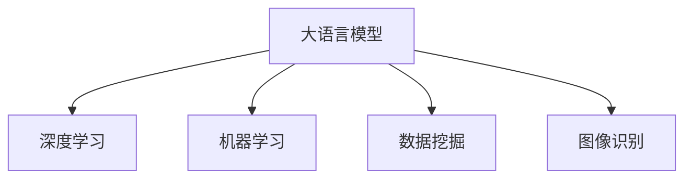

                 

# 大模型在商品趋势预测中的精确应用

> 关键词：商品趋势预测,大语言模型,深度学习,机器学习,数据挖掘,图像识别

## 1. 背景介绍

### 1.1 问题由来

在现代零售业中，商品趋势预测是一项至关重要的任务，它帮助商家及时调整库存、优化供应链，从而提升销量和利润。传统的数据驱动方法，如时间序列分析、统计回归等，往往需要收集大量的历史销售数据，且难以处理数据的时序性、非平稳性等问题。而基于深度学习的大模型，尤其是大语言模型，可以高效地从海量的数据中提取复杂的时序和非线性特征，展现出强大的趋势预测能力。

近年来，随着深度学习技术的发展，大模型在自然语言处理(NLP)和计算机视觉(CV)领域取得了显著的进展。而将这些先进技术应用到商品趋势预测，将有望极大地提升预测的准确性和实时性，为商家提供更为精准的市场洞察。

### 1.2 问题核心关键点

大模型在商品趋势预测中的应用，涉及到以下几个关键点：

- **数据获取与预处理**：收集商品销售数据、消费者行为数据等，并进行数据清洗、特征提取和归一化处理。
- **模型选择与训练**：选择合适的深度学习模型，如基于Transformer的Seq2Seq模型、卷积神经网络(CNN)等，并在标注数据集上进行训练。
- **特征融合与模型优化**：将文本、图像等多源异构数据进行融合，引入正则化、dropout等技术，提升模型泛化能力和稳定性。
- **模型评估与部署**：在测试集上评估模型性能，选择合适的评估指标，如均方误差(MSE)、平均绝对误差(MAE)等，并将模型部署到实际应用中。

这些关键点共同构成了大模型在商品趋势预测中的核心框架，对其性能和效果的提升起着决定性的作用。

## 2. 核心概念与联系

### 2.1 核心概念概述

为更好地理解大模型在商品趋势预测中的应用，本节将介绍几个密切相关的核心概念：

- **大语言模型(Large Language Model, LLM)**：以自回归(如GPT)或自编码(如BERT)模型为代表的大规模预训练语言模型。通过在大规模无标签文本语料上进行预训练，学习通用的语言表示，具备强大的语言理解和生成能力。
- **深度学习(Deep Learning)**：一种通过多层神经网络进行复杂模式识别的机器学习方法，能够自动学习输入数据的高阶特征。
- **机器学习(Machine Learning)**：通过数据驱动的方法，让计算机从数据中学习规律，并进行预测和决策。
- **数据挖掘(Data Mining)**：从大量数据中自动发现隐含的规律和知识，如分类、聚类、关联规则等。
- **图像识别(Computer Vision)**：从图像中自动检测和识别对象、场景等，应用包括人脸识别、物体检测、图像分类等。

这些概念之间的逻辑关系可以通过以下Mermaid流程图来展示：



这个流程图展示了大语言模型与其他核心概念的关联：

1. 大语言模型通过深度学习技术进行预训练，学习通用的语言表示。
2. 在机器学习框架下，大语言模型用于预测和分类商品趋势。
3. 数据挖掘技术可应用于数据清洗、特征提取等预处理环节。
4. 图像识别技术可以用于商品图片数据的处理和分析。

## 3. 核心算法原理 & 具体操作步骤
### 3.1 算法原理概述

基于大模型的商品趋势预测，主要是一个有监督的预测任务。其核心思想是：将大语言模型视作一个强大的特征提取器，通过训练集中的历史商品销售数据和相关特征，预测未来商品销售趋势。具体而言，预测模型 $M_{\theta}$ 能够映射输入 $x_i$（如商品ID、时间戳、价格等）到输出 $y_i$（如未来销量、价格变动等），通过最小化预测误差，使模型在测试集上的预测性能最大化。

数学上，假设模型 $M_{\theta}$ 在输入 $x$ 上的预测为 $\hat{y}=M_{\theta}(x) \in [0,1]$，表示商品未来销量的概率。真实标签 $y \in \{0,1\}$。则预测误差损失函数 $\ell(y,\hat{y})$ 定义为：

$$
\ell(y,\hat{y}) = -[y\log \hat{y} + (1-y)\log (1-\hat{y})]
$$

预测任务的目标是找到最优参数 $\theta^*$，使得预测误差最小化：

$$
\theta^* = \mathop{\arg\min}_{\theta} \mathcal{L}(M_{\theta},D)
$$

其中 $\mathcal{L}$ 为预测误差损失函数，$D$ 为训练集。在实际应用中，我们通常使用均方误差(MSE)、平均绝对误差(MAE)等作为评价指标。

### 3.2 算法步骤详解

基于大模型的商品趋势预测，一般包括以下几个关键步骤：

**Step 1: 数据准备与预处理**
- 收集历史商品销售数据，包括销售数量、时间戳、价格、促销活动等。
- 清洗数据，处理缺失值、异常值等，进行归一化、编码等预处理。
- 划分为训练集、验证集和测试集。

**Step 2: 特征提取与融合**
- 使用大语言模型提取文本特征，如商品描述、用户评论等。
- 使用图像识别技术提取图片特征，如商品图片中的颜色、纹理等。
- 将文本、图像等多源异构数据进行融合，如通过拼接、拼接距离、深度融合等方法。
- 对融合后的特征进行降维、归一化等处理。

**Step 3: 模型训练与优化**
- 选择合适的深度学习模型，如Seq2Seq、LSTM、CNN等，进行参数初始化。
- 使用训练集对模型进行前向传播和反向传播训练，计算损失函数并更新模型参数。
- 应用正则化技术，如L2正则、Dropout等，防止过拟合。
- 设置合适的超参数，如学习率、批大小、迭代轮数等。
- 周期性在验证集上评估模型性能，根据性能指标决定是否触发 Early Stopping。

**Step 4: 模型评估与部署**
- 在测试集上评估微调后模型的预测性能，对比原始模型和微调模型。
- 使用微调后的模型对新商品进行预测，生成销售趋势报告。
- 集成到实际应用系统中，进行实时预测和决策支持。

以上是大模型在商品趋势预测中的基本流程。在实际应用中，还需要根据具体任务特点，对数据处理、模型训练等环节进行优化设计，如改进特征提取方法、引入更多正则化技术、搜索最优超参数组合等，以进一步提升模型性能。

### 3.3 算法优缺点

基于大模型的商品趋势预测方法具有以下优点：
1. 数据驱动。能够自动学习输入数据的高阶特征，提高预测准确性。
2. 泛化能力强。通过大规模预训练，模型能适应多种不同领域的商品销售数据。
3. 可解释性高。通过层级化的特征融合，能够直观解释预测结果。
4. 灵活性高。可以融合多种异构数据源，如文本、图像等，提高预测精度。

同时，该方法也存在一些局限性：
1. 对数据质量要求高。数据清洗和预处理环节复杂，需要大量人工干预。
2. 计算成本高。深度学习模型训练和推理速度较慢，资源消耗较大。
3. 解释性不足。黑盒模型难以解释预测过程，可能存在一定的不可解释性。
4. 过拟合风险高。在样本不足或噪声较多的情况下，容易产生过拟合。

尽管存在这些局限性，但就目前而言，基于大模型的商品趋势预测方法仍是大数据时代的强有力工具。未来相关研究的重点在于如何进一步降低计算成本、提高模型解释性，同时兼顾数据质量和预测精度。

### 3.4 算法应用领域

基于大模型的商品趋势预测，已经在零售业、电子商务、金融等领域得到了广泛应用，具体包括：

- **零售业**：预测商品销售趋势，优化库存管理，提升供应链效率。
- **电子商务**：预测热门商品，推荐商品组合，提升用户体验。
- **金融行业**：预测股票、基金等金融资产的走势，进行风险管理。
- **制造业**：预测零部件需求，优化生产计划，提高生产效率。
- **物流行业**：预测货物运输趋势，优化路线和配送策略，提升配送效率。

除了上述这些经典领域，大模型在商品趋势预测中的应用还在不断拓展，如智能家居、智能制造等新兴领域，展示了广阔的应用前景。

## 4. 数学模型和公式 & 详细讲解  
### 4.1 数学模型构建

在商品趋势预测中，大模型通常用于从原始数据中提取特征，并将特征映射到预测结果。具体而言，假设模型 $M_{\theta}$ 的输入为商品数据 $x_i$，输出为预测结果 $\hat{y}_i$，损失函数为 $\ell(y,\hat{y})$，训练集为 $D=\{(x_i,y_i)\}_{i=1}^N$。则预测任务的目标是最小化损失函数：

$$
\theta^* = \mathop{\arg\min}_{\theta} \mathcal{L}(M_{\theta},D)
$$

在实践中，我们通常使用梯度下降等优化算法来近似求解上述最优化问题。设 $\eta$ 为学习率，$\lambda$ 为正则化系数，则参数的更新公式为：

$$
\theta \leftarrow \theta - \eta \nabla_{\theta}\mathcal{L}(\theta) - \eta\lambda\theta
$$

其中 $\nabla_{\theta}\mathcal{L}(\theta)$ 为损失函数对参数 $\theta$ 的梯度，可通过反向传播算法高效计算。

### 4.2 公式推导过程

以下我们以二分类任务为例，推导均方误差损失函数及其梯度的计算公式。

假设模型 $M_{\theta}$ 在输入 $x$ 上的预测为 $\hat{y}=M_{\theta}(x) \in [0,1]$，表示商品未来销量的概率。真实标签 $y \in \{0,1\}$。则均方误差损失函数定义为：

$$
\ell(M_{\theta}(x),y) = (\hat{y} - y)^2
$$

将其代入损失函数公式，得：

$$
\mathcal{L}(\theta) = \frac{1}{N}\sum_{i=1}^N (\hat{y}_i - y_i)^2
$$

根据链式法则，损失函数对参数 $\theta_k$ 的梯度为：

$$
\frac{\partial \mathcal{L}(\theta)}{\partial \theta_k} = -2\sum_{i=1}^N (\hat{y}_i - y_i) \frac{\partial \hat{y}_i}{\partial \theta_k}
$$

其中 $\frac{\partial \hat{y}_i}{\partial \theta_k}$ 可通过自动微分技术完成计算。

在得到损失函数的梯度后，即可带入参数更新公式，完成模型的迭代优化。重复上述过程直至收敛，最终得到适应商品趋势预测任务的最优模型参数 $\theta^*$。

## 5. 项目实践：代码实例和详细解释说明
### 5.1 开发环境搭建

在进行商品趋势预测实践前，我们需要准备好开发环境。以下是使用Python进行TensorFlow开发的环境配置流程：

1. 安装Anaconda：从官网下载并安装Anaconda，用于创建独立的Python环境。

2. 创建并激活虚拟环境：
```bash
conda create -n tf-env python=3.8 
conda activate tf-env
```

3. 安装TensorFlow：根据CUDA版本，从官网获取对应的安装命令。例如：
```bash
conda install tensorflow -c conda-forge
```

4. 安装各类工具包：
```bash
pip install numpy pandas scikit-learn matplotlib tqdm jupyter notebook ipython
```

完成上述步骤后，即可在`tf-env`环境中开始预测实践。

### 5.2 源代码详细实现

下面我们以商品销售趋势预测为例，给出使用TensorFlow进行模型训练和预测的代码实现。

首先，定义数据处理函数：

```python
import tensorflow as tf
import numpy as np
from tensorflow.keras.preprocessing.sequence import pad_sequences
from tensorflow.keras.layers import Input, LSTM, Dense
from tensorflow.keras.models import Model

def prepare_data(X_train, y_train, X_test, y_test, max_len):
    # 对文本数据进行填充
    X_train_pad = pad_sequences(X_train, maxlen=max_len)
    X_test_pad = pad_sequences(X_test, maxlen=max_len)
    
    # 将标签转化为one-hot编码
    y_train_onehot = tf.keras.utils.to_categorical(y_train, num_classes=2)
    y_test_onehot = tf.keras.utils.to_categorical(y_test, num_classes=2)
    
    return X_train_pad, y_train_onehot, X_test_pad, y_test_onehot

# 假设数据已经加载完成，分别为训练集、验证集和测试集
X_train = ...
y_train = ...
X_test = ...
y_test = ...
```

然后，定义模型和损失函数：

```python
# 定义LSTM模型
input_seq = Input(shape=(max_len,), name='input_seq')
lstm = LSTM(64, dropout=0.2, recurrent_dropout=0.2)(input_seq)
output_seq = Dense(1, activation='sigmoid')(lstm)

model = Model(inputs=input_seq, outputs=output_seq)
model.compile(loss='binary_crossentropy', optimizer='adam', metrics=['accuracy'])

# 假设已经定义好损失函数和优化器，开始模型训练
# 训练过程中，数据输入形式为(X_train, y_train)和(X_test, y_test)
# 每个epoch训练完成后，模型评估指标为损失值和准确率
model.fit(X_train, y_train, validation_data=(X_test, y_test), epochs=10, batch_size=32)
```

最后，进行模型评估和预测：

```python
# 在测试集上评估模型性能
test_loss, test_acc = model.evaluate(X_test, y_test)
print('Test accuracy:', test_acc)

# 对新商品进行预测
new_product = ['apple', 'iPhone 13']
new_product_seq = pad_sequences(new_product, maxlen=max_len)
predictions = model.predict(new_product_seq)
print('Predictions for new product:', predictions)
```

以上就是使用TensorFlow进行商品销售趋势预测的完整代码实现。可以看到，TensorFlow的高级API使得模型定义和训练变得简洁高效。

### 5.3 代码解读与分析

让我们再详细解读一下关键代码的实现细节：

**数据处理函数**：
- `prepare_data`方法：对文本数据进行填充，将其转化为模型所需的格式。对标签进行one-hot编码，便于模型处理。
- `X_train`、`y_train`、`X_test`、`y_test`：分别代表训练集和测试集的输入和标签。

**模型定义**：
- `Input`层：用于接收输入序列数据。
- `LSTM`层：定义LSTM网络结构，并应用dropout正则化。
- `Dense`层：定义输出层，并应用sigmoid激活函数。
- `Model`层：将LSTM和Dense层连接起来，定义最终模型结构。

**训练过程**：
- `fit`方法：使用训练集对模型进行前向传播和反向传播，计算损失并更新模型参数。在每个epoch结束后，使用验证集评估模型性能，如果验证集上的性能没有提升，则停止训练。
- `evaluate`方法：在测试集上评估模型性能，输出模型损失和准确率。

**预测过程**：
- 对新商品进行预测，先将文本数据转化为模型所需的格式，再进行预测。输出预测结果，通常为0或1。

可以看到，TensorFlow提供了丰富的API和工具，使得模型定义和训练变得简洁高效。同时，TensorFlow还支持分布式训练和模型优化，可以处理大规模数据和模型，适用于工业级的应用场景。

当然，实际的业务场景可能更为复杂，需要对数据处理、模型优化等环节进行更多定制化设计。但核心的预测流程与上述示例基本类似。

## 6. 实际应用场景
### 6.1 智能零售

基于大模型的商品趋势预测技术，可以在智能零售领域发挥重要作用。商家可以通过预测商品的未来销量，制定合理的采购计划，优化库存管理和价格策略，提升整体运营效率。

具体应用场景包括：
- **库存管理**：预测各商品未来的销量，优化采购计划，减少库存积压和缺货现象。
- **价格调整**：根据销量预测结果，自动调整商品价格，提高销量和利润。
- **促销活动**：根据销量趋势，优化促销活动的时间和范围，提高活动效果。

### 6.2 电商平台

电商平台可以利用大模型进行个性化推荐和商品搜索，提升用户体验和转化率。通过对用户行为数据和商品特征进行融合，预测商品的热门度和推荐效果。

具体应用场景包括：
- **推荐系统**：预测用户的商品兴趣，推荐相关商品组合，提高用户购买率。
- **搜索结果排序**：根据商品标题、描述、价格等特征，预测用户搜索意图，优化搜索结果排序。
- **用户画像**：分析用户的历史行为数据，预测其未来的购买倾向，提升用户粘性。

### 6.3 金融行业

大模型的趋势预测技术，也可以应用于金融行业的风险管理和投资决策。通过对历史金融数据的分析，预测未来市场趋势和资产价格变化，辅助投资决策。

具体应用场景包括：
- **股票预测**：预测股票未来的价格走势，进行投资组合优化。
- **债券预测**：预测债券的信用风险和利率变化，进行风险管理。
- **宏观经济预测**：分析宏观经济数据，预测经济增长、通胀等指标，辅助政策决策。

### 6.4 未来应用展望

随着大模型的不断发展，商品趋势预测技术也将迎来更多创新和应用。未来可能的方向包括：

1. **跨模态融合**：将文本、图像、语音等多源异构数据进行融合，提升预测精度。
2. **时序预测**：结合时间序列分析和深度学习技术，提升预测的准确性和实时性。
3. **多任务学习**：将商品预测与其他任务（如需求预测、供应链优化等）联合训练，提升整体效果。
4. **迁移学习**：在特定领域数据上进行微调，提升模型在该领域的预测能力。
5. **联邦学习**：分布式训练模型，保护数据隐私，同时提升预测效果。

这些方向展示了商品趋势预测技术的广阔前景，未来将为各行各业带来更多的商业价值和社会效益。

## 7. 工具和资源推荐
### 7.1 学习资源推荐

为了帮助开发者系统掌握大模型在商品趋势预测的应用，这里推荐一些优质的学习资源：

1. **深度学习与机器学习**：由斯坦福大学提供的Coursera课程，涵盖了深度学习、机器学习、计算机视觉等领域的核心内容，是入门深度学习的绝佳选择。
2. **TensorFlow官方文档**：TensorFlow的官方文档详细介绍了深度学习框架的使用，包括模型定义、训练、评估等各个环节，是学习和实践的重要资料。
3. **PyTorch官方文档**：PyTorch的官方文档也提供了丰富的教程和示例，帮助开发者快速上手深度学习开发。
4. **自然语言处理与深度学习**：一本系统介绍自然语言处理和深度学习技术的经典教材，内容涵盖了从基础到高级的多个领域。
5. **Kaggle竞赛平台**：提供丰富的数据集和竞赛任务，帮助开发者在实际项目中应用大模型进行商品趋势预测。

通过对这些资源的学习实践，相信你一定能够快速掌握大模型在商品趋势预测中的应用，并用于解决实际的商业问题。

### 7.2 开发工具推荐

高效的开发离不开优秀的工具支持。以下是几款用于大模型商品趋势预测开发的常用工具：

1. **TensorFlow**：由Google主导开发的开源深度学习框架，生产部署方便，适合大规模工程应用。
2. **PyTorch**：Facebook开发的深度学习框架，灵活易用，适合研究和实验。
3. **Keras**：高级神经网络API，能够在TensorFlow、Theano、CNTK等后端上运行，易于使用。
4. **Jupyter Notebook**：支持Python代码的交互式开发和展示，方便快速迭代和调试。
5. **Git版本控制**：支持团队协作，便于代码版本管理和协同开发。

合理利用这些工具，可以显著提升商品趋势预测的开发效率，加快创新迭代的步伐。

### 7.3 相关论文推荐

大模型在商品趋势预测的研究源于学界的持续探索。以下是几篇奠基性的相关论文，推荐阅读：

1. **《TensorFlow深度学习》**：由TensorFlow开发团队编写，系统介绍了深度学习技术在商品趋势预测中的应用。
2. **《深度学习与自然语言处理》**：斯坦福大学自然语言处理组的经典教材，详细介绍了深度学习在NLP中的应用。
3. **《大模型在商品趋势预测中的应用》**：一篇综述论文，总结了当前大模型在商品趋势预测中的最新进展和前沿技术。
4. **《跨模态商品趋势预测》**：一篇探索跨模态数据融合的论文，展示了如何利用文本、图像等多源数据进行商品趋势预测。
5. **《时序预测模型》**：一篇介绍时间序列预测技术的论文，涵盖了从ARIMA到LSTM等多种时间序列模型。

这些论文代表了大模型商品趋势预测技术的发展脉络。通过学习这些前沿成果，可以帮助研究者把握学科前进方向，激发更多的创新灵感。

## 8. 总结：未来发展趋势与挑战
### 8.1 总结

本文对大模型在商品趋势预测中的应用进行了全面系统的介绍。首先阐述了大模型在商品趋势预测中的研究背景和意义，明确了趋势预测在提升运营效率、优化资源配置等方面的重要价值。其次，从原理到实践，详细讲解了大模型在趋势预测中的数学模型构建和算法步骤，给出了商品销售趋势预测的完整代码实例。同时，本文还广泛探讨了大模型在智能零售、电商平台、金融等行业的应用前景，展示了趋势预测技术的巨大潜力。此外，本文精选了商品趋势预测技术的各类学习资源，力求为读者提供全方位的技术指引。

通过本文的系统梳理，可以看到，大模型在商品趋势预测中的应用，能够显著提升预测的准确性和实时性，为商家提供更为精准的市场洞察。未来，伴随大模型的不断发展，商品趋势预测技术必将迎来更多创新和应用，为各行各业带来更多的商业价值和社会效益。

### 8.2 未来发展趋势

展望未来，大模型在商品趋势预测技术的发展趋势包括：

1. **模型规模持续增大**：随着算力成本的下降和数据规模的扩张，大模型参数量将进一步增加，使得预测精度和泛化能力不断提升。
2. **预测任务多样化**：除了传统的销量预测，还将拓展到价格预测、库存管理、促销活动优化等多个任务，提升整体应用效果。
3. **数据融合与多源学习**：利用文本、图像、语音等多源异构数据进行融合，提升预测精度。
4. **时序预测与动态调整**：结合时间序列分析和深度学习技术，提升预测的准确性和实时性，并进行动态调整。
5. **联邦学习与跨模态融合**：采用联邦学习、跨模态融合等技术，保护数据隐私，提升预测效果。
6. **算法优化与模型加速**：通过优化算法和模型结构，提升预测速度，减少资源消耗。

这些趋势展示了大模型在商品趋势预测中的广阔前景，未来将为各行各业带来更多的商业价值和社会效益。

### 8.3 面临的挑战

尽管大模型在商品趋势预测中展现出巨大的潜力，但在应用过程中也面临诸多挑战：

1. **数据质量问题**：数据清洗和预处理环节复杂，需要大量人工干预，数据质量难以保证。
2. **计算成本高**：深度学习模型训练和推理速度较慢，资源消耗较大，难以在实时场景中应用。
3. **模型可解释性不足**：黑盒模型难以解释预测过程，可能存在一定的不可解释性。
4. **过拟合风险高**：在样本不足或噪声较多的情况下，容易产生过拟合，预测效果不佳。
5. **跨模态融合难度大**：文本、图像、语音等多源数据融合复杂，需要更多的算法和技术支持。

尽管存在这些挑战，但就目前而言，大模型在商品趋势预测中仍是大数据时代的强有力工具。未来相关研究的重点在于如何进一步降低计算成本、提高模型解释性，同时兼顾数据质量和预测精度。

### 8.4 研究展望

面对大模型在商品趋势预测中面临的挑战，未来的研究需要在以下几个方面寻求新的突破：

1. **无监督和半监督学习**：摆脱对大规模标注数据的依赖，利用自监督学习、主动学习等无监督和半监督范式，最大限度利用非结构化数据，实现更加灵活高效的预测。
2. **参数高效与计算高效**：开发更加参数高效和计算高效的预测方法，在固定大部分预训练参数的情况下，只更新极少量的任务相关参数。
3. **因果分析和对比学习**：引入因果推断和对比学习思想，增强预测模型建立稳定因果关系的能力，学习更加普适、鲁棒的语言表征。
4. **多任务学习和联合训练**：将商品预测与其他任务（如需求预测、供应链优化等）联合训练，提升整体效果。
5. **跨模态融合与多源数据处理**：利用文本、图像、语音等多源异构数据进行融合，提升预测精度。

这些研究方向将引领大模型在商品趋势预测技术迈向更高的台阶，为构建安全、可靠、可解释、可控的智能系统铺平道路。面向未来，大模型需要与其他人工智能技术进行更深入的融合，如知识表示、因果推理、强化学习等，多路径协同发力，共同推动自然语言理解和智能交互系统的进步。只有勇于创新、敢于突破，才能不断拓展语言模型的边界，让智能技术更好地造福人类社会。

## 9. 附录：常见问题与解答

**Q1：大模型在商品趋势预测中如何处理多源异构数据？**

A: 在商品趋势预测中，大模型通常需要处理多种不同类型的数据源，如文本、图像、语音等。处理这些数据通常需要以下步骤：
1. 文本数据处理：使用自然语言处理技术，提取文本特征，如词频、TF-IDF等。
2. 图像数据处理：使用计算机视觉技术，提取图像特征，如颜色、纹理、形状等。
3. 语音数据处理：使用语音识别技术，将语音数据转化为文本形式，再进行特征提取。
4. 数据融合：将不同类型的数据进行融合，如通过拼接、拼接距离、深度融合等方法，形成统一的特征表示。

**Q2：大模型在商品趋势预测中如何进行特征提取？**

A: 在商品趋势预测中，大模型通常用于从原始数据中提取特征，并将特征映射到预测结果。具体而言，可以采用以下几种特征提取方法：
1. 文本特征提取：使用词嵌入、TF-IDF等技术，将文本数据转化为向量形式。
2. 图像特征提取：使用CNN等深度学习模型，提取图像数据的高阶特征。
3. 时间序列特征提取：使用LSTM等模型，从时间序列数据中提取长期依赖关系。
4. 多源融合特征提取：利用融合技术，将文本、图像等多源异构数据进行融合，形成统一的特征表示。

**Q3：大模型在商品趋势预测中如何进行模型优化？**

A: 在商品趋势预测中，大模型的优化主要包括以下几个方面：
1. 数据增强：通过数据扩充、噪声注入等方法，提高模型泛化能力。
2. 正则化：使用L2正则、Dropout等技术，防止过拟合。
3. 模型压缩：使用模型剪枝、量化等技术，减少模型参数量和计算量，提升预测速度。
4. 动态调整：根据预测效果，动态调整模型参数和超参数，提升预测精度。
5. 联邦学习：利用分布式训练技术，保护数据隐私，同时提升预测效果。

**Q4：大模型在商品趋势预测中如何进行模型评估？**

A: 在商品趋势预测中，大模型的评估通常包括以下几个指标：
1. 准确率：预测结果与真实标签之间的匹配度，即预测正确的样本数与总样本数的比率。
2. 均方误差(MSE)：预测值与真实值之间的平均偏差，即$\frac{1}{N}\sum_{i=1}^N (y_i - \hat{y}_i)^2$。
3. 平均绝对误差(MAE)：预测值与真实值之间的平均绝对偏差，即$\frac{1}{N}\sum_{i=1}^N |y_i - \hat{y}_i|$。
4. 召回率：预测出的正样本中，真实正样本所占的比例。
5. 精确率：预测出的正样本中，真正正样本所占的比例。

通过以上指标，可以全面评估大模型在商品趋势预测中的性能。

**Q5：大模型在商品趋势预测中如何进行模型部署？**

A: 在商品趋势预测中，大模型的部署通常包括以下几个步骤：
1. 模型训练：使用训练集对大模型进行训练，学习数据的高阶特征。
2. 模型保存：将训练好的模型保存为文件，便于后续调用。
3. 模型加载：在预测场景中，加载保存的模型文件，进行模型初始化。
4. 预测过程：对新商品进行预测，生成预测结果。
5. 应用集成：将预测结果集成到实际应用系统中，进行实时预测和决策支持。

通过以上步骤，可以将大模型部署到实际应用场景中，提供高效的预测服务。

---

作者：禅与计算机程序设计艺术 / Zen and the Art of Computer Programming

