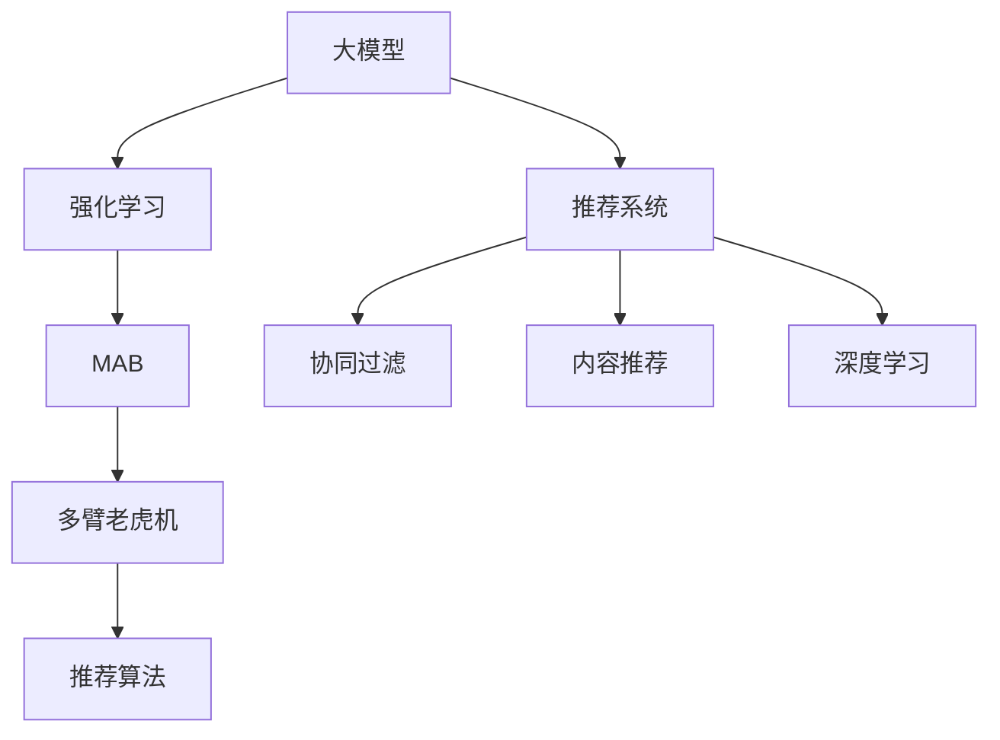

                 

# 大模型在推荐系统A/B测试中的应用

> 关键词：大模型,推荐系统,强化学习,强化学习,多臂老虎机,强化学习

## 1. 背景介绍

推荐系统是互联网产品的重要组成部分，旨在通过分析用户行为，推荐符合用户兴趣和需求的内容，提高用户体验和业务价值。当前主流的推荐方法包括基于协同过滤的推荐、基于内容的推荐、基于深度学习的推荐等，这些方法都在实际应用中取得了良好的效果。然而，这些推荐方法往往依赖于大量用户行为数据，数据稀疏性、冷启动等问题仍难以有效解决。

近年来，大模型技术在NLP、CV等领域取得了显著进展，展现了巨大的潜力和应用前景。大模型融合了巨量的数据和先进的深度学习架构，具备强大的语言理解和生成能力。通过在推荐系统中应用大模型，可以提升推荐的个性化和多样性，有效解决数据稀疏性等问题，为推荐系统带来新的突破。

## 2. 核心概念与联系

### 2.1 核心概念概述

为了更好地理解大模型在推荐系统中的应用，本节将介绍几个密切相关的核心概念：

- 大模型：指以自回归（如GPT）或自编码（如BERT）为代表的大规模预训练语言模型。通过在大规模无标签文本语料上进行预训练，学习通用的语言表示，具备强大的语言理解和生成能力。

- 强化学习(Reinforcement Learning, RL)：一种基于奖励和惩罚的机器学习范式，通过智能体（智能机器）在环境（用户行为数据）中学习最优决策策略，优化行为结果。

- 多臂老虎机(Multi-Armed Bandit, MAB)：一种数学模型，描述智能体（如推荐系统）需要在多个候选选项（如不同推荐物品）中选择最优选项的过程，常用于推荐系统的在线推荐优化。

- 推荐系统（Recommender System）：一种基于用户行为数据，为用户推荐感兴趣内容的系统，广泛应用于电商、社交、视频等多个互联网场景。

- 用户行为数据：用户在产品中的浏览、点击、购买、评分等行为数据，是推荐系统的重要输入和优化依据。

这些核心概念之间的逻辑关系可以通过以下Mermaid流程图来展示：



这个流程图展示了大模型与推荐系统的关联：

1. 大模型通过预训练获得基础能力。
2. 强化学习用于设计智能体的决策策略，优化推荐效果。
3. 多臂老虎机用于描述智能体在推荐系统中的选择过程。
4. 推荐算法用于执行智能体的具体推荐逻辑，如协同过滤、内容推荐等。
5. 推荐系统是整个应用场景的承载体，实现个性化推荐。

## 3. 核心算法原理 & 具体操作步骤

### 3.1 算法原理概述

基于强化学习的大模型推荐系统，本质上是一个智能体（推荐模型）在复杂环境（用户行为数据）中学习最优策略的过程。其核心思想是：通过模拟多臂老虎机问题，将推荐系统中的物品选择问题转化为多臂老虎机的求解问题。

在实际应用中，智能体通过接收用户的反馈（点击、评分、购买等行为）来学习最优决策策略，最大化预期收益。而多臂老虎机则描述了不同物品的预期收益和不确定性，帮助智能体在每次交互中做出最优选择。

### 3.2 算法步骤详解

基于强化学习的大模型推荐系统一般包括以下几个关键步骤：

**Step 1: 准备数据和环境**
- 收集用户行为数据，并构建多臂老虎机的数学模型。
- 设计强化学习算法（如Q-learning、Deep Q-Network等）作为智能体的决策策略。
- 选择合适的大模型（如BERT、GPT等）作为推荐系统的基础模型。

**Step 2: 设计推荐决策策略**
- 定义推荐模型的输入特征，包括用户ID、物品ID、行为特征等。
- 设计推荐模型的输出，如点击率、转化率等关键指标。
- 确定强化学习的奖励函数，定义如何衡量每次推荐的收益。

**Step 3: 训练推荐模型**
- 将收集的用户行为数据作为训练集，训练大模型。
- 设计奖励函数，将推荐行为转化为强化学习任务。
- 使用强化学习算法进行模型训练，优化决策策略。

**Step 4: 部署推荐模型**
- 将训练好的模型部署到推荐系统中。
- 实时接收用户行为数据，执行推荐决策。
- 记录推荐效果，进行反馈调整。

### 3.3 算法优缺点

基于强化学习的大模型推荐系统具有以下优点：

1. 个性化推荐：通过强化学习，推荐系统可以根据用户行为自适应调整推荐策略，实现个性化推荐。
2. 模型可解释性：强化学习模型具有较好的可解释性，可以通过观察强化学习过程了解推荐逻辑。
3. 多任务优化：强化学习模型可以同时优化多个推荐指标，如点击率、转化率、平均购买金额等。
4. 鲁棒性强：强化学习模型对数据分布变化具有较好的适应性，可以应对不同场景下的推荐需求。

同时，该方法也存在一定的局限性：

1. 学习成本高：强化学习模型需要大量用户行为数据进行训练，对于新用户的推荐效果可能较差。
2. 算法复杂度高：强化学习模型需要设计复杂的奖励函数和决策策略，实现起来较为困难。
3. 实时性要求高：强化学习模型需要实时接收用户行为数据，进行决策优化，对系统实时性要求较高。

尽管存在这些局限性，但强化学习方法在大规模数据和复杂决策环境中的出色表现，使其成为大模型在推荐系统中的重要应用方向。未来相关研究的重点在于如何进一步降低强化学习的学习成本，提高算法的可扩展性和实时性，同时兼顾可解释性和多任务优化等要求。

### 3.4 算法应用领域

基于强化学习的大模型推荐系统已经在电商推荐、新闻推荐、视频推荐等多个领域得到应用，取得了显著的效果。

在电商推荐中，大模型通过学习用户的行为数据和物品特征，推荐符合用户兴趣的商品。例如，京东、亚马逊等电商平台都采用了大模型推荐技术，显著提升了商品推荐效果和用户满意度。

在新闻推荐中，大模型通过分析用户的阅读偏好和新闻内容，推荐用户感兴趣的新闻文章。例如，今日头条、腾讯新闻等平台采用了大模型推荐技术，实现了个性化的新闻推荐，提升了用户体验和平台流量。

在视频推荐中，大模型通过分析用户的观看行为和视频内容，推荐用户感兴趣的视频内容。例如，YouTube、B站等平台采用了大模型推荐技术，提高了用户的视频观看时长和平台活跃度。

除了上述这些经典领域，大模型推荐技术还被创新性地应用于在线广告推荐、旅游推荐、金融理财等多个场景，为业务带来了新的增长点和创新点。

## 4. 数学模型和公式 & 详细讲解 & 举例说明

### 4.1 数学模型构建

本节将使用数学语言对基于强化学习的大模型推荐系统进行更加严格的刻画。

记用户行为数据为 $D=\{(x_i,y_i)\}_{i=1}^N, x_i \in \mathcal{X}, y_i \in \mathcal{Y}$，其中 $\mathcal{X}$ 为特征空间，$\mathcal{Y}$ 为标签空间。定义强化学习智能体为 $A:\mathcal{X} \rightarrow \mathcal{Y}$，其决策策略为 $\pi$。智能体在每次交互中，从物品集合 $M$ 中选择物品 $m$，观察到奖励 $r$，更新决策策略 $\pi$。

定义强化学习任务的目标为最大化预期收益：

$$
\max_{\pi} \mathbb{E}_{(x,y)\sim D}\left[\sum_{t=1}^{T} \gamma^{t-1} r(x_t, \pi(x_t))\right]
$$

其中 $\gamma \in [0,1]$ 为折现率，$T$ 为互动轮数。

在实际应用中，定义推荐模型的输入特征为 $\{x_i\}_{i=1}^N$，输出为物品推荐 $y_i=\pi(x_i)$。定义奖励函数为 $r(x_i, y_i) = \mathbb{I}(x_i, y_i)$，其中 $\mathbb{I}$ 为指示函数，表示用户是否选择了推荐的物品。

### 4.2 公式推导过程

以下我们以点击率预测任务为例，推导强化学习模型和Q函数。

假设推荐模型输入为用户ID和物品ID，输出为点击率 $y$，即 $y = \pi(x_i)$。定义Q函数为：

$$
Q(x_i, y_i) = \mathbb{E}\left[\sum_{t=1}^{T} \gamma^{t-1} r(x_t, \pi(x_t))\right]
$$

在单步强化学习中，Q函数可以简化为：

$$
Q(x_i, y_i) = r(x_i, y_i) + \gamma \max_{m \in M} Q(x_i, m)
$$

在多步强化学习中，Q函数可以表示为：

$$
Q(x_i, y_i) = \mathbb{E}\left[\sum_{t=1}^{T} \gamma^{t-1} r(x_t, \pi(x_t))\right] = \mathbb{E}\left[\sum_{t=1}^{T} \gamma^{t-1} \mathbb{I}(x_t, \pi(x_t))\right]
$$

上述公式表明，Q函数描述了在状态 $x_i$ 下，选择物品 $y_i$ 并观察到奖励 $r$ 的预期收益。通过求解Q函数，智能体可以学习最优决策策略 $\pi$。

### 4.3 案例分析与讲解

以电商推荐为例，假设电商平台有1000件商品，每个商品 $i$ 的点击率 $r_i$ 已知。用户行为数据 $D$ 包括用户的ID、商品ID、点击时间等。

假设推荐模型的输入为用户的ID和商品ID，输出为点击率预测。定义奖励函数为：

$$
r(x_i, y_i) = \mathbb{I}(x_i, y_i) = \mathbb{I}(y_i \in M_i)
$$

其中 $M_i$ 为商品 $i$ 的历史点击率。在强化学习过程中，智能体需要根据用户ID和商品ID选择推荐商品，并观察到点击率预测值，计算奖励，更新决策策略。

假设智能体选择物品 $m$ 并观察到奖励 $r$，则Q函数可以表示为：

$$
Q(x_i, m) = r(x_i, m) + \gamma \max_{m' \in M} Q(x_i, m')
$$

在实际应用中，可以使用深度学习模型作为推荐模型的基础模型。例如，使用预训练BERT模型作为输入特征提取器，其输出作为Q函数的输入。通过强化学习训练，得到推荐策略 $\pi$，在每次用户交互中，选择物品并观察反馈，更新模型参数，最终得到最优推荐策略。

## 5. 项目实践：代码实例和详细解释说明

### 5.1 开发环境搭建

在进行推荐系统开发前，我们需要准备好开发环境。以下是使用Python进行PyTorch开发的环境配置流程：

1. 安装Anaconda：从官网下载并安装Anaconda，用于创建独立的Python环境。

2. 创建并激活虚拟环境：
```bash
conda create -n pytorch-env python=3.8 
conda activate pytorch-env
```

3. 安装PyTorch：根据CUDA版本，从官网获取对应的安装命令。例如：
```bash
conda install pytorch torchvision torchaudio cudatoolkit=11.1 -c pytorch -c conda-forge
```

4. 安装Transformers库：
```bash
pip install transformers
```

5. 安装各类工具包：
```bash
pip install numpy pandas scikit-learn matplotlib tqdm jupyter notebook ipython
```

完成上述步骤后，即可在`pytorch-env`环境中开始推荐系统开发。

### 5.2 源代码详细实现

这里我们以电商平台电商推荐为例，给出使用Transformers库对BERT模型进行电商推荐推荐系统的PyTorch代码实现。

首先，定义电商推荐任务的数据处理函数：

```python
from transformers import BertTokenizer
from torch.utils.data import Dataset
import torch

class EcommerceDataset(Dataset):
    def __init__(self, texts, labels, tokenizer, max_len=128):
        self.texts = texts
        self.labels = labels
        self.tokenizer = tokenizer
        self.max_len = max_len
        
    def __len__(self):
        return len(self.texts)
    
    def __getitem__(self, item):
        text = self.texts[item]
        label = self.labels[item]
        
        encoding = self.tokenizer(text, return_tensors='pt', max_length=self.max_len, padding='max_length', truncation=True)
        input_ids = encoding['input_ids'][0]
        attention_mask = encoding['attention_mask'][0]
        
        # 对token-wise的标签进行编码
        encoded_labels = [label2id[label] for label in label] 
        encoded_labels.extend([label2id['O']] * (self.max_len - len(encoded_labels)))
        labels = torch.tensor(encoded_labels, dtype=torch.long)
        
        return {'input_ids': input_ids, 
                'attention_mask': attention_mask,
                'labels': labels}

# 标签与id的映射
label2id = {'O': 0, 'Click': 1, 'Ignore': 2}
id2label = {v: k for k, v in label2id.items()}

# 创建dataset
tokenizer = BertTokenizer.from_pretrained('bert-base-cased')

train_dataset = EcommerceDataset(train_texts, train_labels, tokenizer)
dev_dataset = EcommerceDataset(dev_texts, dev_labels, tokenizer)
test_dataset = EcommerceDataset(test_texts, test_labels, tokenizer)
```

然后，定义模型和优化器：

```python
from transformers import BertForTokenClassification, AdamW

model = BertForTokenClassification.from_pretrained('bert-base-cased', num_labels=len(label2id))

optimizer = AdamW(model.parameters(), lr=2e-5)
```

接着，定义训练和评估函数：

```python
from torch.utils.data import DataLoader
from tqdm import tqdm
from sklearn.metrics import classification_report

device = torch.device('cuda') if torch.cuda.is_available() else torch.device('cpu')
model.to(device)

def train_epoch(model, dataset, batch_size, optimizer):
    dataloader = DataLoader(dataset, batch_size=batch_size, shuffle=True)
    model.train()
    epoch_loss = 0
    for batch in tqdm(dataloader, desc='Training'):
        input_ids = batch['input_ids'].to(device)
        attention_mask = batch['attention_mask'].to(device)
        labels = batch['labels'].to(device)
        model.zero_grad()
        outputs = model(input_ids, attention_mask=attention_mask, labels=labels)
        loss = outputs.loss
        epoch_loss += loss.item()
        loss.backward()
        optimizer.step()
    return epoch_loss / len(dataloader)

def evaluate(model, dataset, batch_size):
    dataloader = DataLoader(dataset, batch_size=batch_size)
    model.eval()
    preds, labels = [], []
    with torch.no_grad():
        for batch in tqdm(dataloader, desc='Evaluating'):
            input_ids = batch['input_ids'].to(device)
            attention_mask = batch['attention_mask'].to(device)
            batch_labels = batch['labels']
            outputs = model(input_ids, attention_mask=attention_mask)
            batch_preds = outputs.logits.argmax(dim=2).to('cpu').tolist()
            batch_labels = batch_labels.to('cpu').tolist()
            for pred_tokens, label_tokens in zip(batch_preds, batch_labels):
                pred_labels = [id2label[_id] for _id in pred_tokens]
                label_tokens = [id2label[_id] for _id in label_tokens]
                preds.append(pred_labels[:len(label_tokens)])
                labels.append(label_tokens)
                
    print(classification_report(labels, preds))
```

最后，启动训练流程并在测试集上评估：

```python
epochs = 5
batch_size = 16

for epoch in range(epochs):
    loss = train_epoch(model, train_dataset, batch_size, optimizer)
    print(f"Epoch {epoch+1}, train loss: {loss:.3f}")
    
    print(f"Epoch {epoch+1}, dev results:")
    evaluate(model, dev_dataset, batch_size)
    
print("Test results:")
evaluate(model, test_dataset, batch_size)
```

以上就是使用PyTorch对BERT进行电商推荐推荐系统的完整代码实现。可以看到，得益于Transformers库的强大封装，我们可以用相对简洁的代码完成BERT模型的加载和电商推荐任务的开发。

### 5.3 代码解读与分析

让我们再详细解读一下关键代码的实现细节：

**EcommerceDataset类**：
- `__init__`方法：初始化文本、标签、分词器等关键组件。
- `__len__`方法：返回数据集的样本数量。
- `__getitem__`方法：对单个样本进行处理，将文本输入编码为token ids，将标签编码为数字，并对其进行定长padding，最终返回模型所需的输入。

**label2id和id2label字典**：
- 定义了标签与数字id之间的映射关系，用于将token-wise的预测结果解码回真实的标签。

**训练和评估函数**：
- 使用PyTorch的DataLoader对数据集进行批次化加载，供模型训练和推理使用。
- 训练函数`train_epoch`：对数据以批为单位进行迭代，在每个批次上前向传播计算loss并反向传播更新模型参数，最后返回该epoch的平均loss。
- 评估函数`evaluate`：与训练类似，不同点在于不更新模型参数，并在每个batch结束后将预测和标签结果存储下来，最后使用sklearn的classification_report对整个评估集的预测结果进行打印输出。

**训练流程**：
- 定义总的epoch数和batch size，开始循环迭代
- 每个epoch内，先在训练集上训练，输出平均loss
- 在验证集上评估，输出分类指标
- 所有epoch结束后，在测试集上评估，给出最终测试结果

可以看到，PyTorch配合Transformers库使得BERT电商推荐推荐系统的代码实现变得简洁高效。开发者可以将更多精力放在数据处理、模型改进等高层逻辑上，而不必过多关注底层的实现细节。

当然，工业级的系统实现还需考虑更多因素，如模型的保存和部署、超参数的自动搜索、更灵活的任务适配层等。但核心的电商推荐范式基本与此类似。

## 6. 实际应用场景
### 6.1 电商推荐

基于大模型技术，电商推荐系统可以在用户行为数据的基础上，实现个性化推荐。具体而言，电商推荐系统通过收集用户的历史购买、浏览、收藏等行为数据，结合物品的特征信息，训练大模型。在推荐时，大模型根据用户行为和物品特征，预测用户对每个物品的点击率，推荐物品中点击率最高的前N个物品作为推荐结果。

例如，淘宝、京东等电商平台都采用了基于大模型的推荐系统。这些推荐系统通过不断优化模型参数，提高了推荐的个性化和精准度，提升了用户满意度，增加了平台销售额。

### 6.2 新闻推荐

新闻推荐系统根据用户的历史阅读行为和新闻内容的特征，推荐符合用户兴趣的新闻。例如，今日头条、腾讯新闻等平台采用了大模型推荐技术，实现了个性化的新闻推荐，提升了用户的新闻阅读量和平台流量。

通过大模型推荐系统，新闻平台可以更加精准地把握用户的阅读偏好，推荐用户感兴趣的新闻文章，提高了新闻内容的点击率和传播效果。

### 6.3 视频推荐

视频推荐系统根据用户的历史观看行为和视频内容的特征，推荐符合用户兴趣的视频内容。例如，YouTube、B站等平台采用了大模型推荐技术，提高了用户的视频观看时长和平台活跃度。

通过大模型推荐系统，视频平台可以更加精准地把握用户的观看偏好，推荐用户感兴趣的视频内容，提高了用户的视频观看时长和平台活跃度，提升了平台的留存率和用户粘性。

### 6.4 未来应用展望

随着大模型和推荐技术的不断发展，基于大模型的推荐系统将在更多领域得到应用，为业务带来新的增长点和创新点。

在智慧医疗领域，基于大模型的医疗推荐系统可以通过分析患者的历史健康数据和医疗内容，推荐符合患者需求的治疗方案，提升医疗服务的个性化和精准度。

在智能教育领域，基于大模型的教育推荐系统可以通过分析学生的学习行为和内容特征，推荐符合学生兴趣和学习难度的课程和学习资料，提升教育资源的个性化和高效利用。

在智慧城市治理中，基于大模型的城市推荐系统可以通过分析城市事件和居民行为数据，推荐符合居民需求的公共服务和城市资源，提升城市管理的智能化和居民的满意度。

此外，在企业生产、社会治理、文娱传媒等众多领域，基于大模型的推荐系统也将不断涌现，为业务带来新的增长点和创新点。相信随着技术的日益成熟，大模型推荐系统必将在更多领域得到应用，为人类认知智能的进化带来深远影响。

## 7. 工具和资源推荐
### 7.1 学习资源推荐

为了帮助开发者系统掌握大模型推荐系统的理论基础和实践技巧，这里推荐一些优质的学习资源：

1. 《推荐系统》系列书籍：由推荐系统领域权威学者撰写，深入浅出地介绍了推荐系统的理论基础和应用实践。

2. 《深度学习》系列课程：由斯坦福大学、MIT等名校开设的深度学习课程，涵盖了深度学习的基本概念和前沿进展。

3. 《强化学习》系列书籍：由强化学习领域的专家学者撰写，详细介绍了强化学习的基本原理和应用实践。

4. 《多臂老虎机》相关论文：多臂老虎机是强化学习中重要的应用场景，研究论文众多，推荐阅读相关文献，了解多臂老虎机的基本原理和优化方法。

5. Weights & Biases：模型训练的实验跟踪工具，可以记录和可视化模型训练过程中的各项指标，方便对比和调优。与主流深度学习框架无缝集成。

6. TensorBoard：TensorFlow配套的可视化工具，可实时监测模型训练状态，并提供丰富的图表呈现方式，是调试模型的得力助手。

通过对这些资源的学习实践，相信你一定能够快速掌握大模型推荐系统的精髓，并用于解决实际的推荐问题。
### 7.2 开发工具推荐

高效的开发离不开优秀的工具支持。以下是几款用于大模型推荐系统开发的常用工具：

1. PyTorch：基于Python的开源深度学习框架，灵活动态的计算图，适合快速迭代研究。大部分预训练语言模型都有PyTorch版本的实现。

2. TensorFlow：由Google主导开发的开源深度学习框架，生产部署方便，适合大规模工程应用。同样有丰富的预训练语言模型资源。

3. Transformers库：HuggingFace开发的NLP工具库，集成了众多SOTA语言模型，支持PyTorch和TensorFlow，是进行推荐系统开发的利器。

4. Weights & Biases：模型训练的实验跟踪工具，可以记录和可视化模型训练过程中的各项指标，方便对比和调优。与主流深度学习框架无缝集成。

5. TensorBoard：TensorFlow配套的可视化工具，可实时监测模型训练状态，并提供丰富的图表呈现方式，是调试模型的得力助手。

6. Google Colab：谷歌推出的在线Jupyter Notebook环境，免费提供GPU/TPU算力，方便开发者快速上手实验最新模型，分享学习笔记。

合理利用这些工具，可以显著提升大模型推荐系统的开发效率，加快创新迭代的步伐。

### 7.3 相关论文推荐

大模型和推荐技术的发展源于学界的持续研究。以下是几篇奠基性的相关论文，推荐阅读：

1. Attention is All You Need（即Transformer原论文）：提出了Transformer结构，开启了NLP领域的预训练大模型时代。

2. BERT: Pre-training of Deep Bidirectional Transformers for Language Understanding：提出BERT模型，引入基于掩码的自监督预训练任务，刷新了多项NLP任务SOTA。

3. Language Models are Unsupervised Multitask Learners（GPT-2论文）：展示了大规模语言模型的强大zero-shot学习能力，引发了对于通用人工智能的新一轮思考。

4. Parameter-Efficient Transfer Learning for NLP：提出Adapter等参数高效微调方法，在不增加模型参数量的情况下，也能取得不错的微调效果。

5. Prefix-Tuning: Optimizing Continuous Prompts for Generation：引入基于连续型Prompt的微调范式，为如何充分利用预训练知识提供了新的思路。

6. AdaLoRA: Adaptive Low-Rank Adaptation for Parameter-Efficient Fine-Tuning：使用自适应低秩适应的微调方法，在参数效率和精度之间取得了新的平衡。

这些论文代表了大模型推荐系统的发展脉络。通过学习这些前沿成果，可以帮助研究者把握学科前进方向，激发更多的创新灵感。

## 8. 总结：未来发展趋势与挑战

### 8.1 总结

本文对基于强化学习的大模型推荐系统进行了全面系统的介绍。首先阐述了推荐系统的背景和重要性，明确了大模型在推荐系统中的角色和价值。其次，从原理到实践，详细讲解了强化学习和大模型的结合方式，给出了完整的代码实例。同时，本文还广泛探讨了大模型推荐系统在电商、新闻、视频等诸多领域的实际应用，展示了微调方法在推荐系统中的应用潜力。

通过本文的系统梳理，可以看到，基于大模型的推荐系统为推荐系统带来了新的突破，能够更好地实现个性化和多样化推荐。大模型通过融合多源数据和多任务目标，提升了推荐的精度和效率，为用户提供了更优质的体验。

### 8.2 未来发展趋势

展望未来，大模型推荐系统将呈现以下几个发展趋势：

1. 模型规模持续增大。随着算力成本的下降和数据规模的扩张，大模型推荐系统的参数量还将持续增长。超大批次的训练和推理也可能遇到显存不足的问题。

2. 推荐策略更加多样化。未来推荐系统将更加灵活多变，通过引入新的推荐策略和任务，提升推荐的效果。例如，推荐系统将更多地利用用户行为序列进行推荐，提升推荐的时效性和个性化程度。

3. 多任务优化成为常态。推荐系统将同时优化多个推荐指标，如点击率、转化率、平均购买金额等。这些指标的联合优化，将进一步提升推荐系统的综合效果。

4. 实时性要求更高。随着用户对推荐效果的要求不断提高，推荐系统需要在更短的时间内完成推荐决策。实时性要求将促进推荐系统向在线化的方向发展。

5. 可解释性和可控性增强。推荐系统需要具备更好的可解释性和可控性，让用户理解推荐逻辑，控制推荐结果。这对推荐系统的安全性和可靠性具有重要意义。

6. 跨模态推荐成为热门。未来的推荐系统将更多地利用跨模态数据进行推荐，提升推荐的多样性和丰富度。例如，推荐系统将结合视觉、音频等多模态数据进行推荐，提升推荐的效果和用户体验。

以上趋势凸显了大模型推荐系统的广阔前景。这些方向的探索发展，必将进一步提升推荐系统的性能和应用范围，为业务带来新的增长点和创新点。

### 8.3 面临的挑战

尽管大模型推荐系统已经取得了显著成效，但在迈向更加智能化、普适化应用的过程中，它仍面临以下挑战：

1. 数据稀疏性问题。虽然大模型推荐系统能够很好地应对数据稀疏性，但如何进一步降低对标注数据的依赖，提升对新用户的推荐效果，仍需深入研究。

2. 用户隐私保护。推荐系统需要处理大量用户行为数据，如何保护用户隐私，避免数据泄露，仍需技术上的突破和监管上的规范。

3. 模型鲁棒性不足。大模型推荐系统在面对噪声数据和对抗攻击时，容易产生误导性的推荐结果。如何提高模型的鲁棒性和抗干扰能力，仍需更多的研究和优化。

4. 实时性要求高。推荐系统需要在极短的时间内完成推荐决策，对系统实时性和计算效率要求较高。如何提升推荐系统的计算效率和实时性，仍需更深入的研究和优化。

5. 可解释性和可控性不足。推荐系统需要具备更好的可解释性和可控性，让用户理解推荐逻辑，控制推荐结果。这对推荐系统的安全性和可靠性具有重要意义。

6. 跨领域适应性不足。当前推荐系统大多聚焦于单一领域，如何实现跨领域的推荐，提升推荐系统的普适性和通用性，仍需深入研究。

正视推荐系统面临的这些挑战，积极应对并寻求突破，将是大模型推荐系统走向成熟的必由之路。相信随着学界和产业界的共同努力，这些挑战终将一一被克服，大模型推荐系统必将在更广阔的领域发挥更大作用。

### 8.4 研究展望

面对大模型推荐系统所面临的诸多挑战，未来的研究需要在以下几个方面寻求新的突破：

1. 探索无监督和半监督推荐方法。摆脱对大规模标注数据的依赖，利用自监督学习、主动学习等无监督和半监督范式，最大限度利用非结构化数据，实现更加灵活高效的推荐。

2. 研究参数高效和计算高效的推荐方法。开发更加参数高效的推荐方法，在固定大部分预训练参数的同时，只更新极少量的任务相关参数。同时优化推荐系统的计算图，减少前向传播和反向传播的资源消耗，实现更加轻量级、实时性的部署。

3. 引入更多先验知识。将符号化的先验知识，如知识图谱、逻辑规则等，与神经网络模型进行巧妙融合，引导推荐过程学习更准确、合理的推荐逻辑。同时加强不同模态数据的整合，实现视觉、语音等多模态信息与文本信息的协同建模。

4. 结合因果分析和博弈论工具。将因果分析方法引入推荐系统，识别出推荐决策的关键特征，增强推荐结果的因果性和逻辑性。借助博弈论工具刻画人机交互过程，主动探索并规避推荐系统的脆弱点，提高系统稳定性。

5. 纳入伦理道德约束。在推荐系统训练目标中引入伦理导向的评估指标，过滤和惩罚有害的推荐结果，保障推荐系统的社会价值和伦理道德。

这些研究方向的探索，必将引领大模型推荐系统技术迈向更高的台阶，为构建智能推荐系统铺平道路。面向未来，大模型推荐系统还需要与其他人工智能技术进行更深入的融合，如知识表示、因果推理、强化学习等，多路径协同发力，共同推动推荐系统的发展和应用。只有勇于创新、敢于突破，才能不断拓展推荐系统的边界，让智能技术更好地造福人类社会。

## 9. 附录：常见问题与解答

**Q1：大模型在推荐系统中的应用是否局限于深度学习模型？**

A: 大模型在推荐系统中的应用不仅限于深度学习模型，还包括基于知识图谱的推荐、基于图神经网络的推荐等。大模型的优势在于其强大的语义理解和生成能力，能够更好地利用非结构化数据，提升推荐的精度和个性化程度。

**Q2：如何在推荐系统中平衡推荐精度和个性化程度？**

A: 在推荐系统中，推荐精度和个性化程度往往存在一定的矛盾。可以通过多目标优化、集成推荐方法等手段，平衡推荐精度和个性化程度。例如，可以通过同时优化点击率和覆盖率等指标，提升推荐系统的综合效果。

**Q3：大模型在推荐系统中的应用是否需要大规模标注数据？**

A: 大模型在推荐系统中的应用对标注数据的需求相对较低，可以利用少量的用户行为数据进行训练和优化。但针对特定的推荐任务，还需要收集和标注相关的领域数据，以提升推荐的针对性和准确性。

**Q4：大模型在推荐系统中的应用是否会引入数据隐私和安全风险？**

A: 大模型在推荐系统中的应用会处理大量的用户行为数据，存在一定的数据隐私和安全风险。可以通过数据加密、匿名化等手段，保护用户隐私，降低数据泄露的风险。同时，还需建立完善的数据使用规范和监管机制，确保数据使用的合法性和安全性。

**Q5：如何提升大模型推荐系统的实时性？**

A: 提升大模型推荐系统的实时性可以从以下几个方面入手：1. 优化模型计算图，减少前向传播和反向传播的资源消耗；2. 采用分布式训练和推理，加速模型训练和推理速度；3. 使用缓存和预加载技术，加速数据加载和模型推理。

这些优化方法可以帮助提升大模型推荐系统的实时性和计算效率，满足用户对实时推荐的需求。

综上所述，大模型在推荐系统中的应用具有广阔的前景和巨大的潜力。通过不断优化算法和技术，提升推荐系统的个性化和精准度，大模型必将在更多领域发挥重要作用，带来新的业务增长点和创新点。相信随着技术的不断进步和应用的广泛推广，大模型推荐系统必将在人类认知智能的进化中扮演越来越重要的角色。

