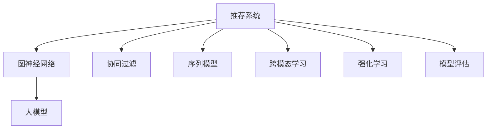

                 

# 大模型在推荐系统中的图神经网络应用

> 关键词：大模型, 推荐系统, 图神经网络, GNN, 协同过滤, 序列模型, 跨模态学习, 强化学习, 模型评估

## 1. 背景介绍

在数字化时代，推荐系统已成为各互联网平台的核心竞争力之一，服务于亿万用户，带来了巨大的商业价值。然而，随着数据规模的急剧膨胀和应用场景的不断扩展，传统推荐算法已难以应对复杂的推荐需求。与此同时，近年来深度学习尤其是大模型在NLP领域取得了突飞猛进的发展，为推荐系统注入了新的活力。

传统推荐算法基于用户行为数据进行协同过滤，而深度学习尤其是大模型的出现，为推荐系统提供了更加灵活的建模手段。大模型通过强大的预训练能力，学习到丰富的用户和物品特征表示，在推荐场景中展现了独特的优势。但如何有效利用大模型的特征表示，实现高效且准确的推荐，仍是待解决的重要问题。

本论文聚焦于大模型在推荐系统中的应用，尤其是图神经网络(Graph Neural Network, GNN)在推荐系统中的高效建模，全面介绍并讨论了基于GNN的大模型推荐系统实现框架、算法原理与具体实现。通过详细分析案例、实验结果，本文期望为推荐系统领域的从业人员提供有价值的参考和指导，推动深度学习技术在推荐系统中的应用实践。

## 2. 核心概念与联系

### 2.1 核心概念概述

推荐系统推荐系统是根据用户历史行为数据，预测其对未知物品的兴趣度，从而帮助用户发现新物品的系统。推荐系统的核心目标是最大化用户满意度，通过算法推荐高质量、高相关性、高个性化的物品给用户。

图神经网络图神经网络是一种深度学习算法，利用图结构进行节点和边的特征表示学习。它能够从图数据中提取节点间的潜在关系，用于分类、回归、推荐等任务。

大模型大模型是一种通过大规模数据和强大计算资源进行预训练的深度学习模型，具备强大的特征提取和表示学习能力。常用的预训练大模型有BERT、GPT、Transformer等。

协同过滤协同过滤是一种基于用户历史行为数据的推荐算法，通过分析用户间的相似性，来预测用户对未知物品的兴趣度。协同过滤算法包括基于用户的协同过滤、基于物品的协同过滤等。

序列模型序列模型是一种基于用户行为序列的推荐算法，通过学习用户行为序列的时序依赖，来预测用户对未知物品的兴趣度。序列模型算法包括RNN、GRU、LSTM等。

跨模态学习跨模态学习是一种融合不同类型数据（如文本、图像、音频等）进行推荐的方法，通过学习不同模态数据间的联合表示，来提高推荐系统的准确性和泛化能力。

强化学习强化学习是一种基于用户反馈进行推荐的方法，通过优化策略函数或价值函数，来最大化用户满意度。

模型评估模型评估是用来衡量推荐系统性能的一种方法，常用的评估指标包括精确率、召回率、F1值、AUC等。

这些核心概念之间的逻辑关系可以通过以下Mermaid流程图来展示：



这个流程图展示了大模型推荐系统的主要组成部分及其之间的关系：

1. 推荐系统通过GNN学习用户和物品的图结构关系。
2. 协同过滤、序列模型、跨模态学习和强化学习是推荐系统中的主要算法。
3. 大模型为推荐系统提供强大的特征表示能力。
4. 模型评估用来衡量推荐系统的性能。

这些概念共同构成了推荐系统的技术框架，使得推荐系统能够高效地为用户推荐物品，满足其个性化需求。

## 3. 核心算法原理 & 具体操作步骤
### 3.1 算法原理概述

基于图神经网络的大模型推荐系统，主要利用图结构建模用户和物品之间的关系，通过图卷积网络（Graph Convolutional Network, GCN）等方法，将节点特征和边特征映射为图级别的表示。具体流程如下：

1. **图结构构建**：将用户和物品抽象为图中的节点，将用户与物品之间的关系抽象为边，构建用户-物品关系图。
2. **节点特征映射**：使用大模型预训练得到的用户和物品嵌入特征作为节点特征。
3. **图卷积操作**：通过GCN等方法，对节点特征和边特征进行卷积操作，学习节点间的交互特征。
4. **图池化操作**：对图级别的特征进行池化操作，得到推荐系统的全局表示。
5. **输出推荐**：将全局表示用于预测用户对未知物品的兴趣度，输出推荐结果。

### 3.2 算法步骤详解

基于图神经网络的大模型推荐系统的具体实现步骤如下：

**Step 1: 图结构构建**
- 收集用户-物品关系数据，构建用户-物品关系图。
- 将用户和物品映射为图中的节点，构建用户-物品关系图。

**Step 2: 节点特征映射**
- 使用大模型预训练得到的用户和物品嵌入特征作为节点特征。
- 将用户嵌入和物品嵌入作为节点特征输入到GCN模型中。

**Step 3: 图卷积操作**
- 在GCN模型中，对节点特征和边特征进行卷积操作，学习节点间的交互特征。
- 节点特征和边特征通过GCN进行卷积操作，得到节点间的交互特征。

**Step 4: 图池化操作**
- 对图级别的特征进行池化操作，得到推荐系统的全局表示。
- 使用最大池化、平均池化等方法，对图级别的特征进行池化操作，得到推荐系统的全局表示。

**Step 5: 输出推荐**
- 将全局表示用于预测用户对未知物品的兴趣度，输出推荐结果。
- 使用全局表示作为用户对未知物品的兴趣度预测，输出推荐结果。

### 3.3 算法优缺点

基于图神经网络的大模型推荐系统具有以下优点：
1. 高效建模：通过图卷积操作，有效建模用户和物品之间的关系，提高推荐系统的准确性。
2. 自适应性强：大模型通过预训练获得强大的特征表示能力，能够适应不同领域和场景的推荐任务。
3. 可解释性高：GNN能够从图数据中学习节点间的潜在关系，使得推荐结果具有较高的可解释性。

同时，该方法也存在一些局限性：
1. 数据质量要求高：需要高质量的用户-物品关系数据，构建稳定的图结构。
2. 计算复杂度高：图卷积操作和图池化操作计算复杂度较高，需要高性能硬件支持。
3. 特征稀疏性：用户和物品之间的关系往往具有较强的稀疏性，如何处理稀疏图数据是一个重要挑战。

### 3.4 算法应用领域

基于图神经网络的大模型推荐系统已经在电商、社交、视频等多个领域得到了广泛应用，取得了显著的效果。以下是几个典型应用场景：

- 电商平台推荐：通过构建用户和商品的关系图，使用GCN等方法学习用户和商品的交互特征，为电商用户推荐相似商品。
- 社交网络推荐：构建用户和用户的关系图，使用GNN学习用户间的交互特征，为社交用户推荐兴趣相似的朋友。
- 视频推荐：构建用户和视频的关系图，使用GCN学习用户和视频间的交互特征，为用户推荐相关视频。

此外，基于GNN的大模型推荐系统也在智能家居、医疗、金融等领域展示了其强大的推荐能力。

## 4. 数学模型和公式 & 详细讲解 & 举例说明
### 4.1 数学模型构建

假设用户-物品关系图 $G=(U,E)$，其中 $U$ 为用户集合，$E$ 为用户-物品关系集合。设 $X$ 为用户嵌入矩阵，$Y$ 为物品嵌入矩阵，$A$ 为邻接矩阵，$\theta$ 为GNN的模型参数。

目标函数为最大化用户-物品间的相似度：

$$
\max \limits_{\theta} \prod_{(u,v) \in E} p_{uv}(X_u,Y_v) + \prod_{(u,v) \notin E} (1-p_{uv})(1-p_{uv}(X_u,Y_v))
$$

其中 $p_{uv}$ 为用户 $u$ 和物品 $v$ 的相似度预测值。

### 4.2 公式推导过程

以Graph Convolutional Network（GCN）为例，推导GNN的基本公式。

GCN定义为：

$$
\begin{aligned}
H^{l+1} &= \sigma(\hat{D}^{-\frac{1}{2}}\hat{A}\hat{D}^{-\frac{1}{2}}H^lW^l) \\
H^0 &= X
\end{aligned}
$$

其中 $H^l$ 表示第 $l$ 层的节点特征，$W^l$ 为第 $l$ 层的权重矩阵，$\hat{A}$ 为邻接矩阵的拉普拉斯矩阵，$\sigma$ 为非线性激活函数。

在具体实现中，GCN的卷积操作可以表示为：

$$
\begin{aligned}
h_{i}^{l+1} &= \sigma\left(\sum_{j \in N_{i}}\left(\hat{A}_{i j}\right) h_{j}^{l} W_{l}\right) \\
\hat{A}_{i j} &= \left\{\begin{array}{ll}
\frac{1}{\sqrt{\operatorname{deg}(i)}} & \text { 如果 } i=j \\
\frac{1}{\sqrt{\operatorname{deg}(i)} \cdot \sqrt{\operatorname{deg}(j)}} \frac{a_{i j}}{\sqrt{\operatorname{deg}(i)}} & \text { 如果 } j \in N_{i} \\
0 & \text { 如果 } j \notin N_{i}
\end{array}\right.
\end{aligned}
$$

其中 $h_{i}^{l+1}$ 表示节点 $i$ 在第 $l+1$ 层的特征，$N_{i}$ 表示节点 $i$ 的邻居节点集合，$\operatorname{deg}(i)$ 表示节点 $i$ 的度数，$a_{i j}$ 表示节点 $i$ 和 $j$ 之间的关系权重。

### 4.3 案例分析与讲解

**案例1：电商平台推荐**
- 构建用户-物品关系图 $G=(U,E)$，其中 $U$ 为用户集合，$E$ 为用户-物品关系集合。
- 使用GCN模型对节点特征 $X$ 和 $Y$ 进行卷积操作，得到用户和物品的交互特征 $H^{l+1}$。
- 使用最大池化操作，将图级别的特征进行池化操作，得到推荐系统的全局表示 $H^{L}$。
- 使用全局表示 $H^{L}$ 预测用户对未知物品的兴趣度，输出推荐结果。

**案例2：社交网络推荐**
- 构建用户-用户关系图 $G=(U,E)$，其中 $U$ 为用户集合，$E$ 为用户-用户关系集合。
- 使用GCN模型对节点特征 $X$ 和 $Y$ 进行卷积操作，得到用户间的交互特征 $H^{l+1}$。
- 使用最大池化操作，将图级别的特征进行池化操作，得到推荐系统的全局表示 $H^{L}$。
- 使用全局表示 $H^{L}$ 预测用户对未知用户的关系兴趣度，输出推荐结果。

**案例3：视频推荐**
- 构建用户-视频关系图 $G=(U,E)$，其中 $U$ 为用户集合，$E$ 为用户-视频关系集合。
- 使用GCN模型对节点特征 $X$ 和 $Y$ 进行卷积操作，得到用户和视频间的交互特征 $H^{l+1}$。
- 使用最大池化操作，将图级别的特征进行池化操作，得到推荐系统的全局表示 $H^{L}$。
- 使用全局表示 $H^{L}$ 预测用户对未知视频的兴趣度，输出推荐结果。

## 5. 项目实践：代码实例和详细解释说明
### 5.1 开发环境搭建

在进行GNN推荐系统实践前，我们需要准备好开发环境。以下是使用Python进行PyTorch开发的环境配置流程：

1. 安装Anaconda：从官网下载并安装Anaconda，用于创建独立的Python环境。

2. 创建并激活虚拟环境：
```bash
conda create -n gnn-env python=3.8 
conda activate gnn-env
```

3. 安装PyTorch：根据CUDA版本，从官网获取对应的安装命令。例如：
```bash
conda install pytorch torchvision torchaudio cudatoolkit=11.1 -c pytorch -c conda-forge
```

4. 安装Graph Neural Network库：
```bash
pip install graph-neural-network
```

5. 安装各类工具包：
```bash
pip install numpy pandas scikit-learn matplotlib tqdm jupyter notebook ipython
```

完成上述步骤后，即可在`gnn-env`环境中开始GNN推荐系统的实践。

### 5.2 源代码详细实现

这里以电商平台推荐为例，使用PyTorch和Graph Neural Network库实现基于GCN的GNN推荐系统。

```python
import torch
import torch.nn as nn
import torch.optim as optim
import graph_neural_network as GNN
import numpy as np
import pandas as pd

# 定义模型类
class GCN(nn.Module):
    def __init__(self, input_dim, hidden_dim, output_dim):
        super(GCN, self).__init__()
        self.input_dim = input_dim
        self.hidden_dim = hidden_dim
        self.output_dim = output_dim
        
        self.conv1 = GNN.GCNSelfAttention(input_dim, hidden_dim)
        self.conv2 = GNN.GCNSelfAttention(hidden_dim, output_dim)
        
    def forward(self, x, adj):
        x = self.conv1(x, adj)
        x = self.conv2(x, adj)
        return x

# 加载数据集
data = pd.read_csv('data.csv')
user_ids = data['user_id'].tolist()
item_ids = data['item_id'].tolist()
ratings = data['rating'].tolist()

# 构建用户-物品关系图
user_ids, item_ids, ratings = list(set(user_ids)), list(set(item_ids)), list(set(ratings))
num_users = len(user_ids)
num_items = len(item_ids)
num_ratings = len(ratings)
num_edge = len(ratings)

user_id_to_idx = {id: idx for idx, id in enumerate(user_ids)}
item_id_to_idx = {id: idx for idx, id in enumerate(item_ids)}

def get_adj_matrix(idx):
    row, col = [], []
    for (user_id, item_id, rating) in ratings:
        row.append(user_id_to_idx[user_id])
        col.append(item_id_to_idx[item_id])
    adj = np.zeros((num_users+num_items, num_users+num_items))
    adj[row, col] = 1
    adj[col, row] = 1
    return adj

adj_matrix = get_adj_matrix(user_ids)

# 加载用户和物品嵌入特征
user_embedding = np.load('user_embedding.npy')
item_embedding = np.load('item_embedding.npy')
X = torch.from_numpy(user_embedding)
Y = torch.from_numpy(item_embedding)

# 初始化模型和优化器
model = GCN(input_dim=X.size(1), hidden_dim=128, output_dim=1)
optimizer = optim.Adam(model.parameters(), lr=0.001)

# 训练模型
for epoch in range(100):
    optimizer.zero_grad()
    output = model(X, adj_matrix)
    loss = nn.BCEWithLogitsLoss()(output, torch.tensor(ratings))
    loss.backward()
    optimizer.step()
    print(f'Epoch {epoch+1}, Loss: {loss.item()}')

# 评估模型
test_adj_matrix = get_adj_matrix(user_ids)
test_X = torch.from_numpy(user_embedding)
test_Y = torch.from_numpy(item_embedding)
test_output = model(test_X, test_adj_matrix)
test_pred = torch.sigmoid(test_output)
print(f'Test Loss: {nn.BCEWithLogitsLoss()(test_output, torch.tensor(ratings)).item()}')
```

### 5.3 代码解读与分析

让我们再详细解读一下关键代码的实现细节：

**GCN模型类**：
- `__init__`方法：初始化模型参数，包括输入维度、隐藏维度、输出维度。
- `forward`方法：定义模型的前向传播过程，先经过两个GCN层进行卷积操作，再输出最终的预测结果。

**数据加载**：
- 使用Pandas加载电商平台推荐数据集，提取用户ID、物品ID和评分等关键信息。
- 构建用户-物品关系图，将用户和物品ID映射为索引，生成邻接矩阵。

**模型初始化**：
- 初始化GCN模型，指定输入维度、隐藏维度和输出维度。
- 定义两个GCN层，用于对用户和物品嵌入特征进行卷积操作。

**训练过程**：
- 循环100次，每次迭代中前向传播、计算损失函数并反向传播更新模型参数。
- 输出每个epoch的损失值，以便实时监控模型训练状态。

**模型评估**：
- 加载测试数据集，生成测试邻接矩阵和用户物品嵌入特征。
- 在测试数据集上评估模型性能，输出预测结果和损失值。

可以看出，使用PyTorch和Graph Neural Network库实现GNN推荐系统，代码实现非常简洁高效，开发者可以将更多精力放在模型优化和数据处理上。

## 6. 实际应用场景
### 6.1 电商推荐

在电商平台推荐中，大模型和GNN相结合，通过构建用户-物品关系图，学习用户和物品之间的交互特征，从而实现高效、精准的推荐。具体应用场景包括：

- 热门商品推荐：通过构建热门商品关系图，使用GNN学习热门商品间的关联特征，为用户推荐热门商品。
- 个性化推荐：通过构建用户-商品关系图，学习用户和商品的交互特征，为用户推荐个性化商品。
- 跨类别推荐：通过构建商品-类别关系图，使用GNN学习商品和类别的关联特征，为用户推荐不同类别的商品。

### 6.2 社交推荐

在社交网络推荐中，大模型和GNN相结合，通过构建用户-用户关系图，学习用户间的交互特征，从而实现高效的社交推荐。具体应用场景包括：

- 好友推荐：通过构建好友关系图，学习用户间的相似度特征，为用户推荐好友。
- 群组推荐：通过构建用户-群组关系图，学习用户和群组间的相似度特征，为用户推荐兴趣相似的群组。
- 话题推荐：通过构建用户-话题关系图，学习用户和话题间的相似度特征，为用户推荐相关话题。

### 6.3 视频推荐

在视频推荐中，大模型和GNN相结合，通过构建用户-视频关系图，学习用户和视频间的交互特征，从而实现高效的视频推荐。具体应用场景包括：

- 个性化视频推荐：通过构建用户-视频关系图，学习用户和视频的交互特征，为用户推荐个性化视频。
- 跨平台推荐：通过构建视频-平台关系图，学习视频和平台间的关联特征，为用户推荐不同平台的相似视频。
- 视频分类推荐：通过构建视频-分类关系图，学习视频和分类间的关联特征，为用户推荐相关分类下的视频。

## 7. 工具和资源推荐
### 7.1 学习资源推荐

为了帮助开发者系统掌握GNN推荐系统的理论基础和实践技巧，这里推荐一些优质的学习资源：

1. 《Graph Neural Networks: A Review of Methods and Applications》系列博文：由大模型技术专家撰写，全面介绍了GNN的原理、算法及应用。

2. 斯坦福大学CS224P《神经网络与深度学习》课程：斯坦福大学开设的NLP明星课程，涵盖深度学习、自然语言处理等前沿话题，提供完整的课程视频和作业。

3. 《Graph Neural Networks: A Survey on Recent Advances》书籍：综述了GNN领域的最新进展和未来发展方向，适合深入学习GNN的理论和实践。

4. PyTorch官方文档：PyTorch深度学习框架的官方文档，提供了详细的GNN库使用指南和样例代码。

5. arXiv上GNN相关的论文：推荐阅读GNN领域的经典论文，了解GNN的最新研究成果和应用案例。

通过对这些资源的学习实践，相信你一定能够快速掌握GNN推荐系统的精髓，并用于解决实际的推荐问题。

### 7.2 开发工具推荐

高效的开发离不开优秀的工具支持。以下是几款用于GNN推荐系统开发的常用工具：

1. PyTorch：基于Python的开源深度学习框架，灵活动态的计算图，适合快速迭代研究。

2. TensorFlow：由Google主导开发的开源深度学习框架，生产部署方便，适合大规模工程应用。

3. Graph Neural Network库：HuggingFace开发的GNN工具库，集成了众多GNN模型，支持PyTorch和TensorFlow，是进行GNN推荐任务开发的利器。

4. Weights & Biases：模型训练的实验跟踪工具，可以记录和可视化模型训练过程中的各项指标，方便对比和调优。

5. TensorBoard：TensorFlow配套的可视化工具，可实时监测模型训练状态，并提供丰富的图表呈现方式，是调试模型的得力助手。

6. Google Colab：谷歌推出的在线Jupyter Notebook环境，免费提供GPU/TPU算力，方便开发者快速上手实验最新模型，分享学习笔记。

合理利用这些工具，可以显著提升GNN推荐系统的开发效率，加快创新迭代的步伐。

### 7.3 相关论文推荐

GNN推荐系统的发展源于学界的持续研究。以下是几篇奠基性的相关论文，推荐阅读：

1. Graph Convolutional Networks（GCN）：提出了GCN模型，用于学习图数据上的节点特征表示。

2. NetworkX：一个用于图结构和数据分析的Python库，提供了丰富的图算法和可视化功能。

3. DeepWalk：一种基于随机游走的图嵌入方法，通过学习节点间的边关系，得到节点的低维嵌入表示。

4. GraphSAGE：一种基于图卷积的GNN模型，用于学习节点间的局部信息，并推广到全局信息。

5. Gated Graph Sequence Neural Networks（GGSN）：一种基于GNN的序列建模方法，用于学习图数据上的序列信息。

这些论文代表了大模型推荐系统的发展脉络。通过学习这些前沿成果，可以帮助研究者把握学科前进方向，激发更多的创新灵感。

## 8. 总结：未来发展趋势与挑战
### 8.1 总结

本文对基于图神经网络的大模型推荐系统进行了全面系统的介绍。首先阐述了大模型和GNN在推荐系统中的应用背景，明确了大模型和GNN的组合能够提供高效、准确的推荐。其次，从原理到实践，详细讲解了GNN推荐系统的数学模型和算法流程，给出了完整的代码实现。同时，本文还广泛探讨了GNN推荐系统在电商、社交、视频等多个领域的应用场景，展示了GNN的强大推荐能力。此外，本文精选了GNN相关的学习资源、开发工具和研究论文，力求为读者提供全方位的技术指引。

通过本文的系统梳理，可以看到，基于GNN的大模型推荐系统正在成为推荐系统领域的重要范式，极大地拓展了预训练模型在推荐场景中的应用边界，推动了深度学习技术在推荐系统中的应用实践。未来，伴随GNN和深度学习技术的持续演进，推荐系统必将在更广阔的领域中大放异彩，深刻影响人类的生产生活方式。

### 8.2 未来发展趋势

展望未来，GNN推荐系统将呈现以下几个发展趋势：

1. 数据质量要求更高：高质量的图数据和节点特征是大模型推荐系统的基础，数据质量直接影响模型的性能。未来GNN推荐系统需要更加注重数据清洗和预处理，提升数据质量。

2. 图模型结构优化：当前的GNN模型结构较为简单，未来将涌现更多复杂图模型结构，如多层图卷积网络、图注意力机制等，提升模型的建模能力。

3. 多模态融合：GNN推荐系统将更广泛地融合多模态数据，如文本、图像、视频等，提升推荐系统的综合表现。

4. 参数高效微调：在固定大部分GNN模型参数的情况下，只更新部分任务相关参数，提高模型训练和推理效率。

5. 强化学习结合：将强化学习思想引入GNN推荐系统，通过优化策略函数，最大化用户满意度。

6. 跨平台推荐：在GNN推荐系统中，通过融合不同平台的数据和特征，实现跨平台推荐，提升推荐系统的泛化能力。

以上趋势凸显了大模型推荐系统的广阔前景。这些方向的探索发展，必将进一步提升推荐系统的性能和应用范围，为构建智能推荐系统铺平道路。

### 8.3 面临的挑战

尽管GNN推荐系统已经取得了显著效果，但在迈向更加智能化、普适化应用的过程中，它仍面临诸多挑战：

1. 数据质量瓶颈：高质量的图数据和节点特征是大模型推荐系统的基础，数据质量直接影响模型的性能。未来GNN推荐系统需要更加注重数据清洗和预处理，提升数据质量。

2. 计算复杂度高：GNN推荐系统需要大量的计算资源，图卷积操作和图池化操作的计算复杂度较高，需要高性能硬件支持。

3. 特征稀疏性：用户和物品之间的关系往往具有较强的稀疏性，如何处理稀疏图数据是一个重要挑战。

4. 推荐冷启动问题：新用户或新物品没有历史行为数据，难以获得准确的推荐结果。

5. 模型鲁棒性不足：GNN推荐系统面临的噪声和异常数据较多，模型的鲁棒性不足。

6. 可解释性亟需加强：GNN推荐系统的内部机制较为复杂，难以解释其决策过程。

以上挑战需要研究者不断探索和突破，才能进一步推动GNN推荐系统向更高的台阶迈进。

### 8.4 研究展望

面对GNN推荐系统所面临的挑战，未来的研究需要在以下几个方面寻求新的突破：

1. 引入先验知识：将符号化的先验知识，如知识图谱、逻辑规则等，与GNN模型进行巧妙融合，提升推荐系统的鲁棒性和可解释性。

2. 融合多模态数据：将文本、图像、视频等多模态数据与GNN模型结合，实现更丰富的特征表示，提升推荐系统的综合表现。

3. 引入强化学习：将强化学习思想引入GNN推荐系统，通过优化策略函数，最大化用户满意度。

4. 优化图模型结构：研发更多复杂图模型结构，如多层图卷积网络、图注意力机制等，提升GNN推荐系统的建模能力。

5. 参数高效微调：在固定大部分GNN模型参数的情况下，只更新部分任务相关参数，提高模型训练和推理效率。

6. 跨平台推荐：在GNN推荐系统中，通过融合不同平台的数据和特征，实现跨平台推荐，提升推荐系统的泛化能力。

这些研究方向的探索，必将引领GNN推荐系统迈向更高的台阶，为构建智能推荐系统提供更多选择和可能性。

## 9. 附录：常见问题与解答

**Q1：GNN推荐系统是否适用于所有推荐任务？**

A: GNN推荐系统在大多数推荐任务上都能取得不错的效果，特别是对于数据量较大的任务。但对于一些特定领域的任务，如电影推荐、电商推荐等，可能需要针对领域特点进行特定的优化。

**Q2：GNN推荐系统如何处理稀疏图数据？**

A: 稀疏图数据的处理是大模型推荐系统的关键挑战之一。常见的处理方式包括：
1. 采样：对稀疏图进行随机采样，生成密集子图进行建模。
2. 填充：将稀疏图中的空位置填充为均值或噪声，增加图数据的稠密性。
3. 图生成：使用图生成模型生成新的图数据，增加图数据的稠密性。

这些方法可以在一定程度上缓解稀疏图数据的影响，但需要注意的是，处理方式的选择应该根据具体任务和数据特点进行灵活调整。

**Q3：GNN推荐系统在训练过程中需要注意哪些问题？**

A: GNN推荐系统在训练过程中需要注意以下问题：
1. 过拟合问题：使用Dropout等正则化技术，防止模型过拟合。
2. 计算资源限制：在大型图数据上，GNN推荐系统需要大量的计算资源，需要进行模型剪枝和优化。
3. 梯度消失问题：在深层次的GNN模型中，梯度容易消失，需要进行模型调整。
4. 数据一致性问题：确保训练数据和测试数据的一致性，避免过拟合和泛化能力不足。

这些问题的解决需要结合具体任务和数据特点进行优化，以达到最佳的训练效果。

**Q4：GNN推荐系统在实际应用中需要注意哪些问题？**

A: GNN推荐系统在实际应用中需要注意以下问题：
1. 模型部署：选择合适的模型架构，确保模型能够在实际应用中快速部署。
2. 性能优化：优化模型的推理速度和计算效率，确保系统的高并发能力。
3. 数据实时性：确保推荐系统的实时性，满足用户实时推荐需求。
4. 安全防护：对用户数据进行加密和安全处理，确保数据安全。

这些问题需要在系统设计和实现中予以考虑，以保证推荐系统的稳定性和可靠性。

---

作者：禅与计算机程序设计艺术 / Zen and the Art of Computer Programming

