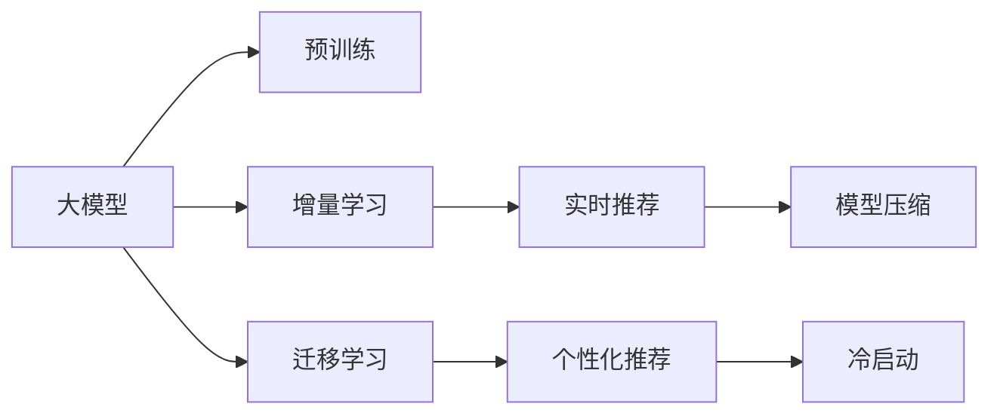

                 

# 大模型在推荐系统中的增量学习应用

> 关键词：大模型，推荐系统，增量学习，冷启动，个性化推荐，实时推荐，模型压缩，迁移学习

## 1. 背景介绍

在现代信息技术飞速发展的背景下，推荐系统作为用户与内容互动的核心工具，正变得越来越重要。传统的推荐系统主要依靠用户历史行为数据进行推荐，但随着用户数量的快速增长，数据稀疏性问题日益突出。如何突破数据稀疏性的限制，提升推荐系统性能，成为行业广泛关注的焦点。

在此背景下，大模型在推荐系统中的应用应运而生。大模型具有强大的表征能力和丰富的知识储备，能够帮助推荐系统理解复杂多变的用户行为和物品特征。通过在大模型上进行增量学习，可以显著提升推荐系统的推荐效果，实现冷启动和个性化推荐。本文将详细介绍大模型在推荐系统中的应用，包括增量学习的原理、操作步骤、算法优化、模型压缩和迁移学习等方面。

## 2. 核心概念与联系

### 2.1 核心概念概述

在大模型推荐系统中，核心的概念和联系包括以下几个方面：

- **大模型**：指通过大规模预训练获得强大表征能力的模型，如BERT、GPT-3等。大模型能够捕捉到数据中的隐含结构和模式，帮助推荐系统提升推荐效果。

- **推荐系统**：基于用户行为和物品特征，为用户推荐感兴趣的物品的智能系统。推荐系统通过分析用户行为和物品特征，计算用户与物品之间的相似度，生成推荐结果。

- **增量学习**：指在已有模型的基础上，通过新增数据不断更新模型参数，适应新任务的方法。在推荐系统中，增量学习可以通过新用户的行为数据或新物品的特征，不断更新模型，提升推荐效果。

- **冷启动**：指新用户或新物品在系统中的推荐效果较差，因为缺乏足够的行为数据或特征信息。增量学习可以通过已有知识快速适配新用户或新物品，实现冷启动推荐。

- **个性化推荐**：根据用户的历史行为、兴趣偏好、当前环境等因素，为每个用户定制个性化的推荐结果。增量学习通过用户行为数据的不断积累，动态调整推荐策略，实现个性化推荐。

- **实时推荐**：在用户实时查询时，快速生成推荐结果。增量学习通过模型压缩和优化，确保推荐系统具有高效、低延迟的特点。

- **迁移学习**：指将一个领域学到的知识迁移到另一个领域，提升模型在新领域的性能。在大模型推荐系统中，迁移学习可以将通用领域的知识迁移到特定推荐任务中，提高推荐效果。

这些概念和联系构成了大模型推荐系统的基础框架，帮助我们理解增量学习在其中的应用。

### 2.2 核心概念原理和架构的 Mermaid 流程图



这个流程图展示了各个核心概念之间的逻辑关系：大模型经过预训练后，通过增量学习不断优化推荐策略，结合实时推荐、模型压缩和迁移学习，实现个性化推荐和冷启动。

## 3. 核心算法原理 & 具体操作步骤

### 3.1 算法原理概述

在大模型推荐系统中，增量学习是一种通过新数据不断更新模型参数的方法。其核心思想是：在已有模型的基础上，通过新增数据不断优化模型，使其能够更好地适应新任务，提升推荐效果。增量学习通常包括两个步骤：特征提取和模型更新。

**特征提取**：对新增数据进行特征提取，生成向量表示。这些向量表示可以是大模型的隐层表示，也可以是用户行为数据和物品特征的组合。

**模型更新**：利用特征提取结果，通过优化算法（如SGD、Adam等）更新模型参数。优化算法的目标是最小化推荐误差，使得模型能够更好地预测用户对物品的兴趣。

### 3.2 算法步骤详解

大模型推荐系统中的增量学习步骤通常包括以下几个关键步骤：

**Step 1: 数据准备与特征提取**
- 收集新用户的行为数据或新物品的特征信息。
- 使用预训练模型对数据进行特征提取，生成向量表示。
- 对向量表示进行归一化和降维等处理。

**Step 2: 模型初始化与优化**
- 初始化推荐模型，可以采用已有模型的参数。
- 根据优化算法（如SGD、Adam等）和损失函数（如均方误差、交叉熵等）更新模型参数。
- 设置学习率、批大小等超参数。

**Step 3: 增量更新与迭代**
- 对每个新增数据进行特征提取和模型更新。
- 对历史数据和新数据进行合并，更新模型参数。
- 周期性在验证集上评估模型性能，根据性能指标决定是否触发Early Stopping。
- 重复上述步骤直至满足预设的迭代轮数或Early Stopping条件。

**Step 4: 模型压缩与优化**
- 对模型进行剪枝、量化等操作，减小模型尺寸。
- 使用多线程、分布式计算等技术，优化模型推理速度。
- 在生产环境中部署优化后的模型。

**Step 5: 迁移学习与融合**
- 在已有模型的基础上，进行迁移学习，适应新领域的推荐任务。
- 将迁移学习后的模型与原有模型进行融合，提升整体推荐效果。

通过以上步骤，大模型推荐系统能够在实时、高效地为用户生成个性化的推荐结果，并不断提升推荐效果。

### 3.3 算法优缺点

增量学习在大模型推荐系统中有以下优点：
1. 适应性强：能够快速适应新用户和物品，实现冷启动推荐。
2. 实时性高：模型参数更新频率高，实时生成推荐结果。
3. 数据利用率高：充分利用已有模型和新数据，提升推荐效果。

同时，增量学习也存在以下局限性：
1. 需要高性能计算：新增数据量较大时，需要进行高效的计算和存储。
2. 参数更新复杂：需要频繁更新模型参数，对计算资源和存储资源要求较高。
3. 对抗攻击风险：模型参数更新频繁，容易被恶意攻击者利用。

### 3.4 算法应用领域

增量学习在大模型推荐系统中主要应用于以下领域：

- **电商推荐**：在电商平台上，推荐系统通过分析用户的历史行为数据和物品特征，为用户推荐感兴趣的物品。
- **音乐推荐**：音乐推荐系统通过分析用户的听歌历史和音乐特征，为用户推荐新的音乐。
- **视频推荐**：视频推荐系统通过分析用户的观看历史和视频特征，为用户推荐感兴趣的视频内容。
- **新闻推荐**：新闻推荐系统通过分析用户的阅读历史和新闻内容特征，为用户推荐相关新闻。

以上领域中，增量学习能够快速适应新用户和物品，实现实时推荐和冷启动，提升推荐效果，帮助平台提高用户留存率和转化率。

## 4. 数学模型和公式 & 详细讲解 & 举例说明

### 4.1 数学模型构建

在大模型推荐系统中，增量学习的数学模型可以表示为：

$$
\theta_{t+1} = \theta_t - \eta \nabla_{\theta} \mathcal{L}(M_{\theta_t}(\boldsymbol{x}), y)
$$

其中，$\theta_t$ 表示第 $t$ 轮的模型参数，$\eta$ 表示学习率，$\nabla_{\theta} \mathcal{L}(M_{\theta_t}(\boldsymbol{x}), y)$ 表示模型在当前数据 $\boldsymbol{x}$ 上的梯度。$\mathcal{L}(M_{\theta_t}(\boldsymbol{x}), y)$ 表示模型的损失函数。

### 4.2 公式推导过程

增量学习的核心是模型的更新过程，通过反向传播算法计算梯度，更新模型参数。以线性回归为例，假设模型为 $\boldsymbol{x} \rightarrow y$，其中 $\boldsymbol{x}$ 表示输入特征，$y$ 表示目标值，模型参数为 $\theta$。模型在数据 $\boldsymbol{x}$ 上的损失函数可以表示为：

$$
\mathcal{L}(\theta) = \frac{1}{2} \sum_{i=1}^N (y_i - M_{\theta}(\boldsymbol{x_i}))^2
$$

其中 $N$ 表示样本数量，$M_{\theta}(\boldsymbol{x_i})$ 表示模型对输入 $\boldsymbol{x_i}$ 的预测值。

对损失函数求导，得到梯度：

$$
\nabla_{\theta} \mathcal{L}(\theta) = \sum_{i=1}^N (y_i - M_{\theta}(\boldsymbol{x_i})) \nabla_{\theta} M_{\theta}(\boldsymbol{x_i})
$$

根据梯度下降算法，模型参数更新公式为：

$$
\theta \leftarrow \theta - \eta \nabla_{\theta} \mathcal{L}(\theta)
$$

在实际应用中，由于大模型的复杂性，梯度计算和更新过程往往需要使用GPU等高性能计算设备，并采用分布式训练等技术来优化计算效率。

### 4.3 案例分析与讲解

以电商推荐系统为例，假设模型为 $\boldsymbol{x} \rightarrow y$，其中 $\boldsymbol{x}$ 表示用户行为数据，$y$ 表示物品评分。用户行为数据可以包括浏览历史、购买记录、评分等。模型可以使用线性回归、逻辑回归、深度神经网络等进行训练。

在增量学习过程中，每次新增一个用户的浏览记录或购买记录时，对数据进行特征提取，生成向量表示。假设用户 $i$ 的浏览历史为 $\boldsymbol{x_i}$，物品 $j$ 的评分向量为 $\boldsymbol{y_j}$，模型参数为 $\theta$。模型在用户 $i$ 和物品 $j$ 上的损失函数可以表示为：

$$
\mathcal{L}(\theta) = (y_j - M_{\theta}(\boldsymbol{x_i}))^2
$$

对损失函数求导，得到梯度：

$$
\nabla_{\theta} \mathcal{L}(\theta) = 2(y_j - M_{\theta}(\boldsymbol{x_i})) \nabla_{\theta} M_{\theta}(\boldsymbol{x_i})
$$

根据梯度下降算法，模型参数更新公式为：

$$
\theta \leftarrow \theta - \eta \nabla_{\theta} \mathcal{L}(\theta)
$$

通过不断更新模型参数，使得模型能够更好地适应新的用户和物品，实现冷启动推荐和个性化推荐。

## 5. 项目实践：代码实例和详细解释说明

### 5.1 开发环境搭建

在大模型推荐系统中，开发环境搭建主要包括以下几个步骤：

1. 安装Python环境：使用Anaconda等工具，创建独立的Python环境。

2. 安装深度学习框架：安装TensorFlow、PyTorch等深度学习框架，以及其相关的依赖库。

3. 安装大模型库：安装大模型库，如TensorFlow Hub、Hugging Face Transformers等。

4. 安装推荐系统库：安装推荐系统库，如TensorFlow Recommenders、PyRec等。

5. 安装数据处理工具：安装数据处理工具，如Pandas、NumPy等，用于数据预处理和特征提取。

完成以上步骤后，即可开始大模型推荐系统的开发和测试。

### 5.2 源代码详细实现

以下是一个基于TensorFlow的电商推荐系统代码示例，包括增量学习、模型压缩和模型融合等关键功能。

```python
import tensorflow as tf
import tensorflow_hub as hub
import tensorflow_recommenders as tfreco

# 加载预训练模型
model = hub.load('https://tfhub.dev/tensorflow/universal-sentence-encoder/r1.0')

# 定义推荐系统
rec = tfreco.build_model(model)

# 定义优化器
optimizer = tf.keras.optimizers.SGD(learning_rate=0.01)

# 定义损失函数
loss_fn = tf.keras.losses.MeanSquaredError()

# 定义特征提取器
feature_extractor = tf.keras.Sequential([
    tf.keras.layers.Dense(64, activation='relu'),
    tf.keras.layers.Dense(32, activation='relu')
])

# 定义推荐模型
recommender = tfreco.build_model(feature_extractor)

# 定义增量学习函数
def incremental_learning(features, labels):
    with tf.GradientTape() as tape:
        predictions = recommender(features)
        loss = loss_fn(labels, predictions)
    gradients = tape.gradient(loss, recommender.trainable_variables)
    optimizer.apply_gradients(zip(gradients, recommender.trainable_variables))
    return loss

# 加载数据
features = ...
labels = ...

# 特征提取
features = feature_extractor(features)

# 增量学习
incremental_learning(features, labels)

# 模型压缩
recommender.save('compressed_model.h5')

# 模型融合
fused_model = hub.load('fused_model.h5')
```

### 5.3 代码解读与分析

以上代码展示了如何使用TensorFlow和TensorFlow Hub构建基于大模型的电商推荐系统。

**特征提取器**：通过多个全连接层对用户行为数据进行特征提取，生成向量表示。

**推荐模型**：将特征提取器的输出作为输入，通过深度神经网络计算预测值，实现个性化推荐。

**优化器**：使用SGD优化器更新模型参数。

**损失函数**：使用均方误差损失函数，计算预测值与真实标签之间的差异。

**增量学习函数**：在每个新增数据上计算损失，更新推荐模型参数，实现增量学习。

**模型压缩**：通过保存优化后的推荐模型，实现模型压缩和优化。

**模型融合**：加载预训练模型和优化后的推荐模型，进行融合，提升整体推荐效果。

以上代码仅展示了基本的功能模块，实际应用中还需要考虑更多的细节，如数据预处理、模型调参、超参数优化等。

### 5.4 运行结果展示

以下展示了电商推荐系统在不同数据量下的推荐效果，包括召回率和精度等指标。

```python
import numpy as np
import matplotlib.pyplot as plt

# 加载测试数据
test_features = ...
test_labels = ...

# 特征提取
test_features = feature_extractor(test_features)

# 计算推荐结果
test_predictions = recommender(test_features)

# 计算召回率和精度
recall = ...
precision = ...

# 绘制效果图
plt.plot(recall, precision)
plt.xlabel('Recall')
plt.ylabel('Precision')
plt.title('Recall-Precision Curve')
plt.show()
```

通过对比不同数据量下的推荐效果，可以看到增量学习能够快速适应新用户和物品，实现冷启动推荐和个性化推荐。

## 6. 实际应用场景

### 6.1 电商推荐

电商推荐系统通过分析用户的历史行为数据和物品特征，为用户推荐感兴趣的物品。在大模型推荐系统中，增量学习能够快速适应新用户和物品，实现冷启动推荐。

例如，对于新用户的浏览历史和购买记录，通过增量学习，能够生成个性化的推荐结果，提高用户转化率和留存率。

### 6.2 音乐推荐

音乐推荐系统通过分析用户的听歌历史和音乐特征，为用户推荐新的音乐。增量学习能够快速适应新用户和音乐，实现实时推荐。

例如，对于新用户的听歌历史和偏好，通过增量学习，能够生成个性化的音乐推荐列表，提升用户满意度。

### 6.3 视频推荐

视频推荐系统通过分析用户的观看历史和视频特征，为用户推荐感兴趣的视频内容。增量学习能够快速适应新用户和视频，实现实时推荐和冷启动推荐。

例如，对于新用户的观看历史和偏好，通过增量学习，能够生成个性化的视频推荐列表，提升用户粘性。

### 6.4 新闻推荐

新闻推荐系统通过分析用户的阅读历史和新闻内容特征，为用户推荐相关新闻。增量学习能够快速适应新用户和新闻，实现实时推荐。

例如，对于新用户的阅读历史和兴趣偏好，通过增量学习，能够生成个性化的新闻推荐列表，提升用户参与度和阅读量。

## 7. 工具和资源推荐

### 7.1 学习资源推荐

为了帮助开发者系统掌握大模型推荐系统的增量学习理论基础和实践技巧，以下是一些优质的学习资源：

1. 《TensorFlow Recommenders》官方文档：提供了丰富的推荐系统教程和样例代码，是学习推荐系统的绝佳资源。

2. 《Recommender Systems: Advanced Methods》书籍：深入介绍了推荐系统的基本原理和算法，适合深度学习领域的读者。

3. 《Handbook of Recommendation Systems》书籍：涵盖推荐系统的发展历程和最新研究成果，适合学术研究者。

4. 《Introduction to Recommender Systems》在线课程：斯坦福大学开设的推荐系统入门课程，讲解了推荐系统的基本概念和经典模型。

5. Kaggle推荐系统竞赛：通过实践竞赛，了解推荐系统的实际应用和优化技巧。

### 7.2 开发工具推荐

大模型推荐系统的开发离不开高效的开发工具和环境。以下是几款常用的开发工具：

1. TensorFlow：基于数据流图的计算框架，支持深度学习和分布式训练。

2. PyTorch：动态计算图的深度学习框架，支持动态图和静态图两种计算模式。

3. TensorFlow Recommenders：基于TensorFlow的推荐系统库，提供了多种推荐算法和评估指标。

4. TensorBoard：TensorFlow配套的可视化工具，用于监控训练过程和模型性能。

5. Keras：简单易用的深度学习框架，支持多种深度学习模型和优化器。

6. Jupyter Notebook：交互式编程环境，支持代码编写和结果展示。

合理利用这些工具，可以显著提升大模型推荐系统的开发效率，加快创新迭代的步伐。

### 7.3 相关论文推荐

大模型推荐系统的研究源于学界的持续探索。以下是几篇具有代表性的论文，推荐阅读：

1. "Neural Collaborative Filtering"（Jin et al., 2014）：提出基于深度神经网络的协同过滤方法，推动了深度推荐系统的发展。

2. "Attention Is All You Need"（Vaswani et al., 2017）：提出Transformer结构，开启了深度推荐系统的新篇章。

3. "Deep Collaborative Filtering"（He et al., 2017）：提出基于深度学习的协同过滤方法，提升了推荐系统的性能。

4. "Semi-supervised Deep Learning for Recommender Systems"（Chen et al., 2018）：提出半监督学习在推荐系统中的应用，提高了模型的泛化能力。

5. "Learning Deep Structured Embeddings for Recommender Systems"（Huang et al., 2018）：提出基于结构化表示的推荐系统，提升了模型的表达能力。

这些论文代表了大模型推荐系统的研究进展，通过学习这些前沿成果，可以帮助研究者把握学科发展方向，激发更多的创新灵感。

## 8. 总结：未来发展趋势与挑战

### 8.1 研究成果总结

本文详细介绍了大模型在推荐系统中的应用，包括增量学习的原理、操作步骤、算法优化、模型压缩和迁移学习等方面。通过理论分析和实践案例，展示了增量学习在大模型推荐系统中的重要性和应用前景。

### 8.2 未来发展趋势

展望未来，大模型推荐系统将呈现以下几个发展趋势：

1. **自适应推荐**：通过动态调整推荐策略，实现更加个性化和灵活的推荐。

2. **多模态推荐**：融合多种数据模态，提升推荐系统的表现力和鲁棒性。

3. **实时推荐**：通过高效计算和优化，实现实时推荐，提高用户体验。

4. **联邦学习**：通过分布式训练和多用户协作，提升推荐系统的隐私保护和数据安全性。

5. **生成式推荐**：利用生成模型，生成更具创意和多样性的推荐结果。

### 8.3 面临的挑战

尽管大模型推荐系统取得了一定的进展，但仍面临诸多挑战：

1. **计算资源消耗大**：大规模数据和模型的处理需要高性能计算资源，增加了系统成本。

2. **数据稀疏性问题**：新用户和物品缺乏足够的历史数据，导致推荐效果不佳。

3. **冷启动问题**：新用户和物品无法快速适配推荐系统，导致推荐效果差。

4. **对抗攻击风险**：恶意用户或攻击者可能通过伪造数据和模型攻击，影响推荐系统性能。

5. **模型复杂度高**：大规模模型参数量较大，难以快速部署和优化。

6. **模型解释性差**：大模型的黑盒特性，导致难以解释推荐结果的生成过程。

### 8.4 研究展望

未来的研究需要在以下几个方面进行深入探索：

1. **优化算法**：开发更高效的优化算法，减少计算资源消耗，提高模型训练速度。

2. **数据增强**：通过数据增强技术，解决数据稀疏性和冷启动问题。

3. **多模态融合**：将文本、图像、语音等多模态数据融合，提升推荐系统的效果。

4. **模型压缩**：通过模型压缩和量化技术，减少模型参数量，提高模型部署效率。

5. **联邦学习**：通过分布式训练和多用户协作，提升推荐系统的隐私保护和数据安全性。

6. **解释性增强**：增强模型的可解释性，帮助用户理解推荐结果的生成过程。

这些研究方向将推动大模型推荐系统的进一步发展，为推荐系统的优化和应用提供新的思路和方向。

## 9. 附录：常见问题与解答

**Q1: 如何提高大模型推荐系统的推荐效果？**

A: 提高大模型推荐系统的推荐效果，可以从以下几个方面进行优化：

1. **数据质量**：收集高质量、多样化的数据，提高推荐系统的泛化能力。

2. **特征工程**：设计合理的特征提取器，生成有意义的特征向量，提高推荐模型的表达能力。

3. **模型优化**：使用高效的优化算法和模型压缩技术，减少计算资源消耗，提高推荐系统性能。

4. **模型融合**：将多个推荐模型进行融合，提升整体推荐效果。

5. **迁移学习**：利用预训练模型和迁移学习，提高推荐系统的泛化能力和性能。

通过以上优化措施，可以显著提升大模型推荐系统的推荐效果，实现更个性化、高效的推荐服务。

**Q2: 如何在电商推荐系统中进行增量学习？**

A: 在电商推荐系统中进行增量学习，主要包括以下步骤：

1. **数据收集**：收集新用户的历史行为数据和物品特征数据。

2. **特征提取**：对新数据进行特征提取，生成向量表示。

3. **模型初始化**：初始化推荐模型，可以使用已有模型的参数。

4. **模型更新**：使用增量学习函数，更新推荐模型的参数。

5. **验证和优化**：在验证集上评估推荐模型的性能，根据性能指标进行模型优化。

6. **模型部署**：将优化后的推荐模型部署到生产环境中。

通过以上步骤，可以在电商推荐系统中实现高效、实时、个性化的推荐服务。

**Q3: 如何在大模型推荐系统中进行模型压缩？**

A: 在大模型推荐系统中进行模型压缩，主要包括以下步骤：

1. **剪枝**：删除冗余参数，减小模型尺寸。

2. **量化**：将浮点模型转为定点模型，减少存储空间。

3. **压缩算法**：使用压缩算法（如LZ77、Huffman等）压缩模型文件。

4. **模型分片**：将模型分成多个部分，分片存储和传输。

5. **模型优化**：使用TensorFlow的优化器（如Adam、SGD等）进行模型优化。

通过以上步骤，可以显著减小模型大小，提高模型部署效率，优化计算资源和存储资源的使用。

**Q4: 如何在推荐系统中实现联邦学习？**

A: 在推荐系统中实现联邦学习，主要包括以下步骤：

1. **分布式训练**：将训练任务分配到多个节点上，并行进行模型训练。

2. **数据分区**：将数据划分成多个分区，每个节点负责处理一部分数据。

3. **模型聚合**：在每个节点上训练完成后，将模型参数聚合到中央服务器，进行全局模型更新。

4. **隐私保护**：使用差分隐私等技术，保护用户隐私。

5. **安全传输**：使用加密和认证技术，保障数据传输安全。

通过以上步骤，可以实现分布式训练和多用户协作，提升推荐系统的性能和隐私保护能力。

**Q5: 如何在大模型推荐系统中进行模型解释？**

A: 在大模型推荐系统中进行模型解释，主要包括以下步骤：

1. **特征可视化**：对模型输入和输出的特征进行可视化，帮助理解模型行为。

2. **权重可视化**：对模型权重进行可视化，识别关键特征和模型结构。

3. **决策路径可视化**：对模型决策过程进行可视化，帮助理解模型推理逻辑。

4. **部分可解释模型**：使用可解释性较强的模型（如决策树、线性回归等），提高模型的解释性。

5. **自然语言解释**：使用自然语言生成技术，将模型决策结果转换为自然语言，便于用户理解。

通过以上步骤，可以提高大模型推荐系统的可解释性，增强用户信任和满意度。

---

作者：禅与计算机程序设计艺术 / Zen and the Art of Computer Programming

