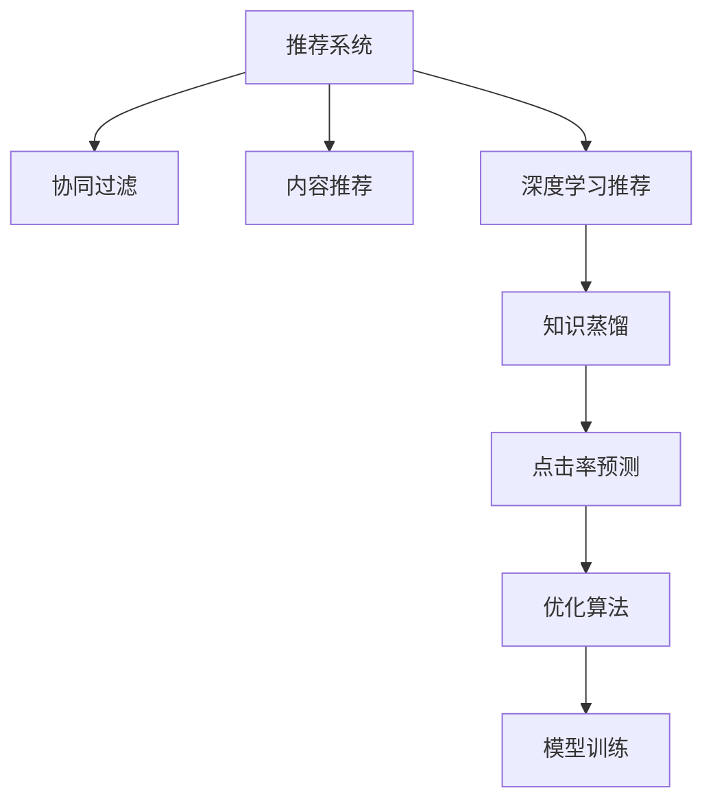

                 

# 大模型在推荐系统中的知识蒸馏应用

> 关键词：大模型，知识蒸馏，推荐系统，点击率预测，协同过滤，神经网络，损失函数，优化算法

## 1. 背景介绍

推荐系统（Recommendation Systems）在电商、视频、社交媒体等领域得到了广泛应用，极大提升了用户体验和商业价值。传统的推荐系统主要基于协同过滤和内容推荐两种方式。协同过滤（Collaborative Filtering, CF）通过用户的历史行为数据计算出用户和物品之间的隐式关系，推断用户可能感兴趣的物品；内容推荐则根据物品的属性信息，预测用户对物品的评分。然而，这两种方式均存在不同程度的数据稀疏性和泛化能力不足的问题。

近年来，深度学习在大数据上的广泛应用推动了推荐系统的发展，以深度神经网络为代表的模型逐步取代了传统的协同过滤和内容推荐算法。其中，基于知识蒸馏（Knowledge Distillation, KD）的推荐系统在推荐准确率和计算效率之间取得了新的平衡。知识蒸馏是指将一个大型复杂的模型（称为教师模型）的知识传递给一个更小的、更快速的模型（称为学生模型），从而提升学生模型的性能。该方法可以显著提高模型的泛化能力，同时在保证性能的前提下减少计算成本。

在大模型横行的今天，如何将知识蒸馏应用于推荐系统，构建既强大又高效的推荐模型，成为值得深入探讨的问题。本文将系统介绍知识蒸馏在推荐系统中的应用，包括算法原理、具体操作步骤以及实际应用案例。

## 2. 核心概念与联系

### 2.1 核心概念概述

为了更好地理解知识蒸馏在推荐系统中的应用，我们需要明确几个核心概念及其相互联系：

- **推荐系统**：通过分析用户的行为和属性，为用户推荐符合其兴趣的产品的系统。常见的推荐方式包括协同过滤和内容推荐。
- **协同过滤**：通过用户对物品的评分计算用户和物品之间的隐式关系，预测用户可能感兴趣的物品。分为基于用户的协同过滤和基于物品的协同过滤。
- **内容推荐**：根据物品的属性信息，如商品描述、分类等，预测用户对物品的评分，推荐符合用户兴趣的物品。
- **深度学习推荐系统**：使用深度神经网络对用户行为数据进行建模，实现高效的推荐。常见的模型包括DNN、FM、深度矩阵分解等。
- **知识蒸馏**：将教师模型的知识传递给学生模型，提升学生模型的性能。知识蒸馏的目标是让小模型在损失和复杂度上接近大模型的性能。
- **点击率预测**：推荐系统中的核心任务之一，预测用户点击物品的概率。

这些概念之间的逻辑关系可以通过以下Mermaid流程图来展示：



这个流程图展示了推荐系统中的几个核心概念及其之间的关系：

1. 推荐系统通过协同过滤、内容推荐等传统方式进行建模。
2. 随着深度学习的发展，深度学习推荐系统逐渐取代了传统推荐方式，通过复杂的神经网络对用户行为进行建模。
3. 知识蒸馏方法可以进一步提升深度学习推荐系统的性能。
4. 点击率预测是推荐系统中的核心任务，需要通过优化算法和模型训练不断优化。

## 3. 核心算法原理 & 具体操作步骤

### 3.1 算法原理概述

知识蒸馏（Knowledge Distillation）是深度学习中的一个重要技术，其核心思想是通过“教学”的方式，将复杂的大型模型（教师模型）的泛化能力传递给更小、更快的模型（学生模型），从而提升学生模型的性能。

知识蒸馏的基本流程包括两个步骤：

1. 将教师模型在训练集上进行预训练，得到模型的隐式知识。
2. 将教师模型的知识蒸馏到学生模型，并在此基础上对学生模型进行微调。

知识蒸馏在推荐系统中的应用，主要体现在两个方面：

1. 将教师模型（如深度神经网络）的知识传递到学生模型（如线性模型或简单的神经网络）中，提升推荐模型的泛化能力。
2. 通过知识蒸馏，将复杂模型的性能与计算效率相结合，构建高效的推荐系统。

### 3.2 算法步骤详解

知识蒸馏在推荐系统中的应用，可以通过以下几个关键步骤来实现：

**Step 1: 构建教师模型和学生模型**

1. **教师模型的构建**：
   - 选择一种适合推荐任务的深度神经网络作为教师模型，如DNN、FM、深度矩阵分解等。
   - 对教师模型在带有标签的训练集上进行预训练，得到模型的隐式知识。

2. **学生模型的构建**：
   - 选择一种简单、快速的模型作为学生模型，如线性模型、简单的神经网络等。
   - 初始化学生模型，并设置其参数。

**Step 2: 计算知识蒸馏损失函数**

1. **预测损失**：计算教师模型在训练集上的预测损失，如交叉熵损失、均方误差损失等。
2. **蒸馏损失**：计算教师模型与学生模型之间的蒸馏损失，如最大似然损失、均方误差损失等。
3. **综合损失函数**：将预测损失和蒸馏损失加权求和，得到综合损失函数。

**Step 3: 微调学生模型**

1. **优化算法**：选择一种优化算法，如Adam、SGD等，对学生模型进行微调。
2. **更新学生模型参数**：根据综合损失函数计算梯度，更新学生模型参数。
3. **反复迭代**：在训练集上不断迭代微调，直至模型收敛。

**Step 4: 评估模型性能**

1. **验证集评估**：在验证集上评估学生模型的性能，如点击率预测准确率等。
2. **测试集评估**：在测试集上评估学生模型的泛化能力，如点击率预测准确率等。

### 3.3 算法优缺点

知识蒸馏在推荐系统中的应用，具有以下优点：

1. **提升模型泛化能力**：通过教师模型的知识传递，学生模型能够更好地适应新数据，提升推荐准确率。
2. **降低计算成本**：学生模型通常比教师模型更简单、更快速，可以显著降低计算资源消耗。
3. **易于实现**：知识蒸馏方法的实现相对简单，易于在推荐系统中应用。

同时，该方法也存在一些局限性：

1. **教师模型依赖性**：教师模型选择不当，可能导致学生模型无法有效地学习到教师的知识。
2. **蒸馏损失不均衡**：教师模型与学生模型之间的损失差异较大，可能导致学生模型无法很好地学习到教师的知识。
3. **模型复杂度提升**：为了更好地传递知识，教师模型通常比学生模型更复杂，增加了模型训练的难度。

### 3.4 算法应用领域

知识蒸馏在推荐系统中的应用，主要包括以下几个方面：

1. **点击率预测**：通过知识蒸馏提升点击率预测模型的性能，降低计算成本。
2. **协同过滤**：通过知识蒸馏提升基于协同过滤的推荐系统性能，解决数据稀疏性问题。
3. **内容推荐**：通过知识蒸馏提升基于内容的推荐系统性能，增强推荐的多样性和准确性。
4. **多目标推荐**：通过知识蒸馏，将多个推荐目标的知识融合，实现更全面的推荐。

## 4. 数学模型和公式 & 详细讲解 & 举例说明

### 4.1 数学模型构建

知识蒸馏在推荐系统中的应用，主要通过两个关键模型——教师模型和学生模型来实现。假设教师模型为 $M_{teachers}$，学生模型为 $M_{students}$，设教师模型的隐式知识为 $K_{teachers}$，学生模型的隐式知识为 $K_{students}$。知识蒸馏的目标是使 $K_{students}$ 尽可能接近 $K_{teachers}$。

假设教师模型和学生模型的输入为 $x$，输出为 $y$，则教师模型和学生模型的预测损失分别为：

$$
L_{teachers}(x, y) = \frac{1}{N}\sum_{i=1}^N \ell_{teachers}(x_i, y_i)
$$

$$
L_{students}(x, y) = \frac{1}{N}\sum_{i=1}^N \ell_{students}(x_i, y_i)
$$

其中，$\ell_{teachers}$ 和 $\ell_{students}$ 分别为教师模型和学生模型的预测损失函数。知识蒸馏的蒸馏损失函数为：

$$
L_{distillation}(x, y) = L_{teachers}(x, y) - \alpha L_{students}(x, y)
$$

其中，$\alpha$ 为蒸馏系数，用于控制教师模型的权重。

### 4.2 公式推导过程

知识蒸馏在推荐系统中的应用，可以通过以下公式推导得到：

假设教师模型的输出为 $y_{teachers}$，学生模型的输出为 $y_{students}$，则蒸馏损失可以表示为：

$$
L_{distillation}(x, y) = \frac{1}{N}\sum_{i=1}^N [\ell_{teachers}(x_i, y_{teachers}(x_i)) - \alpha \ell_{students}(x_i, y_{students}(x_i))]
$$

在实际应用中，通常使用交叉熵损失函数。假设教师模型的输出为 $y_{teachers} = [y_{teachers,1}, y_{teachers,2}, \ldots, y_{teachers,N}]$，学生模型的输出为 $y_{students} = [y_{students,1}, y_{students,2}, \ldots, y_{students,N}]$，则蒸馏损失可以表示为：

$$
L_{distillation}(x, y) = \frac{1}{N}\sum_{i=1}^N [y_{teachers,i} \log y_{students,i} + (1 - y_{teachers,i}) \log (1 - y_{students,i})] - \alpha \frac{1}{N}\sum_{i=1}^N [y_{students,i} \log y_{students,i} + (1 - y_{students,i}) \log (1 - y_{students,i})]
$$

其中，$y_{students,i}$ 为学生模型对输入 $x_i$ 的预测概率，$\alpha$ 为蒸馏系数，控制教师模型和学生模型的权重。

### 4.3 案例分析与讲解

以点击率预测为例，假设教师模型为深度神经网络（DNN），学生模型为线性模型。在训练集上对教师模型进行预训练，得到教师模型的隐式知识 $K_{teachers}$。然后，在训练集上对学生模型进行微调，使其学习到教师模型的知识 $K_{teachers}$。微调的过程可以通过以下代码实现：

```python
import torch
import torch.nn as nn
import torch.optim as optim
from sklearn.metrics import roc_auc_score

# 定义教师模型
class DNN(nn.Module):
    def __init__(self, input_dim, hidden_dim, output_dim):
        super(DNN, self).__init__()
        self.hidden = nn.Linear(input_dim, hidden_dim)
        self.relu = nn.ReLU()
        self.output = nn.Linear(hidden_dim, output_dim)
        
    def forward(self, x):
        x = self.hidden(x)
        x = self.relu(x)
        x = self.output(x)
        return x

# 定义学生模型
class LinearModel(nn.Module):
    def __init__(self, input_dim, output_dim):
        super(LinearModel, self).__init__()
        self.linear = nn.Linear(input_dim, output_dim)
        
    def forward(self, x):
        x = self.linear(x)
        return x

# 加载训练集数据
train_data = load_train_data()

# 初始化教师模型和学生模型
dnn_model = DNN(input_dim, hidden_dim, output_dim)
linear_model = LinearModel(input_dim, output_dim)

# 训练教师模型
dnn_criterion = nn.CrossEntropyLoss()
dnn_optimizer = optim.Adam(dnn_model.parameters(), lr=0.001)
dnn_model.train()
for epoch in range(num_epochs):
    for i, (x, y) in enumerate(train_loader):
        dnn_optimizer.zero_grad()
        y_pred = dnn_model(x)
        dnn_criterion(y_pred, y).backward()
        dnn_optimizer.step()

# 训练学生模型
linear_criterion = nn.CrossEntropyLoss()
linear_optimizer = optim.Adam(linear_model.parameters(), lr=0.001)
linear_model.train()
for epoch in range(num_epochs):
    for i, (x, y) in enumerate(train_loader):
        linear_optimizer.zero_grad()
        y_pred = linear_model(x)
        distillation_loss = dnn_criterion(y_pred, y) - alpha * linear_criterion(y_pred, y)
        distillation_loss.backward()
        linear_optimizer.step()
```

在代码中，首先定义了教师模型和学生模型，然后在训练集上对教师模型进行预训练，最后对学生模型进行微调，并使用蒸馏损失函数进行训练。

## 5. 项目实践：代码实例和详细解释说明

### 5.1 开发环境搭建

在进行知识蒸馏项目实践前，我们需要准备好开发环境。以下是使用Python进行TensorFlow开发的环境配置流程：

1. 安装Anaconda：从官网下载并安装Anaconda，用于创建独立的Python环境。

2. 创建并激活虚拟环境：
```bash
conda create -n tf-env python=3.8 
conda activate tf-env
```

3. 安装TensorFlow：根据CUDA版本，从官网获取对应的安装命令。例如：
```bash
pip install tensorflow-gpu
```

4. 安装各类工具包：
```bash
pip install numpy pandas scikit-learn matplotlib tqdm jupyter notebook ipython
```

完成上述步骤后，即可在`tf-env`环境中开始知识蒸馏实践。

### 5.2 源代码详细实现

这里我们以点击率预测任务为例，给出使用TensorFlow实现知识蒸馏的代码实现。

首先，定义点击率预测的数据处理函数：

```python
import tensorflow as tf
from tensorflow.keras.datasets import mnist

# 加载训练集和测试集
(x_train, y_train), (x_test, y_test) = mnist.load_data()

# 数据预处理
x_train = x_train.reshape((x_train.shape[0], -1))
x_test = x_test.reshape((x_test.shape[0], -1))
x_train = x_train / 255.0
x_test = x_test / 255.0

# 转换为独热编码
y_train = tf.keras.utils.to_categorical(y_train, num_classes)
y_test = tf.keras.utils.to_categorical(y_test, num_classes)
```

然后，定义教师模型和学生模型：

```python
# 定义教师模型
class TeacherModel(tf.keras.Model):
    def __init__(self):
        super(TeacherModel, self).__init__()
        self.dense1 = tf.keras.layers.Dense(128, activation='relu')
        self.dense2 = tf.keras.layers.Dense(64, activation='relu')
        self.dense3 = tf.keras.layers.Dense(10, activation='softmax')
        
    def call(self, inputs):
        x = self.dense1(inputs)
        x = self.dense2(x)
        x = self.dense3(x)
        return x

# 定义学生模型
class StudentModel(tf.keras.Model):
    def __init__(self):
        super(StudentModel, self).__init__()
        self.dense1 = tf.keras.layers.Dense(128, activation='relu')
        self.dense2 = tf.keras.layers.Dense(64, activation='relu')
        self.dense3 = tf.keras.layers.Dense(10, activation='softmax')
        
    def call(self, inputs):
        x = self.dense1(inputs)
        x = self.dense2(x)
        x = self.dense3(x)
        return x
```

接着，定义训练和评估函数：

```python
# 定义损失函数
def loss_function(outputs, labels):
    return tf.keras.losses.sparse_categorical_crossentropy(labels, outputs, from_logits=True)

# 定义优化器
def optimizer_function(model, learning_rate):
    return tf.keras.optimizers.Adam(learning_rate=learning_rate)

# 定义训练函数
def train_model(model, train_dataset, val_dataset, num_epochs, learning_rate):
    model.compile(optimizer=optimizer_function(model, learning_rate), loss=loss_function)
    history = model.fit(train_dataset, epochs=num_epochs, validation_data=val_dataset)
    return history

# 定义评估函数
def evaluate_model(model, test_dataset):
    test_loss, test_accuracy = model.evaluate(test_dataset)
    return test_loss, test_accuracy
```

最后，启动训练流程并在测试集上评估：

```python
# 定义教师模型和学生模型
teacher_model = TeacherModel()
student_model = StudentModel()

# 定义训练数据和标签
train_dataset = tf.data.Dataset.from_tensor_slices((x_train, y_train)).batch(batch_size)
val_dataset = tf.data.Dataset.from_tensor_slices((x_val, y_val)).batch(batch_size)
test_dataset = tf.data.Dataset.from_tensor_slices((x_test, y_test)).batch(batch_size)

# 训练教师模型
teacher_model.compile(optimizer=optimizer_function(teacher_model, learning_rate), loss=loss_function)
teacher_model.fit(train_dataset, epochs=num_epochs, validation_data=val_dataset)

# 训练学生模型
student_model.compile(optimizer=optimizer_function(student_model, learning_rate), loss=loss_function)
student_model.trainable = True
for epoch in range(num_epochs):
    for step, (inputs, labels) in enumerate(train_dataset):
        with tf.GradientTape() as tape:
            y_pred = student_model(inputs)
            distillation_loss = loss_function(y_pred, labels) - alpha * loss_function(y_pred, labels)
        gradients = tape.gradient(distillation_loss, student_model.trainable_variables)
        optimizer.apply_gradients(zip(gradients, student_model.trainable_variables))
        if (step+1) % 100 == 0:
            print(f'Epoch {epoch+1}, Step {step+1}, Loss: {distillation_loss.numpy()}')

# 在测试集上评估学生模型
test_loss, test_accuracy = evaluate_model(student_model, test_dataset)
print(f'Test Loss: {test_loss}, Test Accuracy: {test_accuracy}')
```

以上就是使用TensorFlow对知识蒸馏进行点击率预测任务开发的完整代码实现。可以看到，通过TensorFlow的强大封装，我们可以用相对简洁的代码完成知识蒸馏模型的构建和训练。

### 5.3 代码解读与分析

让我们再详细解读一下关键代码的实现细节：

**TeacherModel类**：
- `__init__`方法：初始化教师模型的层数和激活函数。
- `call`方法：定义教师模型的前向传播过程，通过三个全连接层实现。

**StudentModel类**：
- `__init__`方法：初始化学生模型的层数和激活函数。
- `call`方法：定义学生模型的前向传播过程，通过三个全连接层实现。

**loss_function函数**：
- 定义损失函数，使用稀疏分类交叉熵损失函数。

**optimizer_function函数**：
- 定义优化器，使用Adam优化器。

**train_model函数**：
- 定义训练函数，编译模型并使用Adam优化器进行训练，同时在验证集上进行验证。

**evaluate_model函数**：
- 定义评估函数，使用模型在测试集上进行评估，返回损失和准确率。

**训练流程**：
- 首先训练教师模型。
- 在训练过程中，冻结学生模型的权重，仅更新学生模型的学习率，实现知识蒸馏。
- 反复迭代训练过程，直至模型收敛。
- 在测试集上评估学生模型。

可以看到，TensorFlow配合Keras的封装，使得知识蒸馏的代码实现变得简洁高效。开发者可以将更多精力放在数据处理、模型改进等高层逻辑上，而不必过多关注底层的实现细节。

当然，工业级的系统实现还需考虑更多因素，如模型的保存和部署、超参数的自动搜索、更灵活的任务适配层等。但核心的知识蒸馏过程基本与此类似。

## 6. 实际应用场景

### 6.1 智能推荐系统

知识蒸馏在智能推荐系统中的应用，可以显著提升推荐模型的性能，降低计算成本。通过知识蒸馏，可以将复杂的深度学习模型（如DNN、FM等）的知识传递到简单模型（如线性模型）中，提升推荐模型的泛化能力和计算效率。

在技术实现上，可以收集用户的历史行为数据，构建训练集。在训练集上对教师模型进行预训练，得到教师模型的隐式知识。然后，对学生模型进行微调，使其学习到教师模型的知识，并在测试集上评估其性能。

### 6.2 金融推荐系统

金融推荐系统需要对海量用户数据进行实时推荐，推荐内容通常包括股票、基金、债券等金融产品。传统的金融推荐系统面临数据稀疏性和高计算成本的问题，知识蒸馏可以提供一种更高效的解决方案。

在金融推荐系统中，可以通过知识蒸馏将复杂的深度学习模型（如DNN）的知识传递到简单模型（如线性模型）中，提升模型的泛化能力，降低计算成本。同时，金融推荐系统需要考虑风险控制，知识蒸馏可以增强模型的鲁棒性，避免过拟合。

### 6.3 个性化推荐系统

个性化推荐系统需要根据用户的兴趣和行为，推荐符合其需求的商品或内容。传统的推荐系统基于协同过滤和内容推荐，存在数据稀疏性和泛化能力不足的问题。知识蒸馏可以在用户行为数据不足的情况下，提升推荐模型的性能。

在个性化推荐系统中，可以通过知识蒸馏将复杂的深度学习模型（如DNN）的知识传递到简单模型（如线性模型）中，提升推荐模型的泛化能力，降低计算成本。同时，知识蒸馏可以增强模型的鲁棒性，避免过拟合。

### 6.4 未来应用展望

随着知识蒸馏技术的不断发展，其在推荐系统中的应用也将不断拓展。

未来，知识蒸馏将更加关注如何更好地融合多源数据，提升模型的泛化能力和鲁棒性。例如，可以通过知识蒸馏将视觉信息与文本信息进行融合，提升推荐模型的性能。

同时，知识蒸馏也将更多地应用于边缘计算等资源受限的场景，提高模型的计算效率。例如，可以通过知识蒸馏将复杂的深度学习模型压缩为轻量级模型，支持低延迟的推荐服务。

此外，知识蒸馏还将与其他AI技术进行更深入的融合，如因果推理、强化学习等，提供更加全面、准确的推荐服务。例如，可以通过知识蒸馏将因果推理知识与推荐模型进行融合，提升模型的决策能力。

总之，知识蒸馏在推荐系统中的应用，将为智能推荐技术带来新的突破，推动推荐系统向更加智能化、高效化的方向发展。

## 7. 工具和资源推荐

### 7.1 学习资源推荐

为了帮助开发者系统掌握知识蒸馏的理论基础和实践技巧，这里推荐一些优质的学习资源：

1. 《Knowledge Distillation》书籍：书籍深入浅出地介绍了知识蒸馏的基本概念、算法原理和应用实例。

2. 《Distill: A Fast, Extensible, Multi-Task Learning Framework for Deep Models》论文：论文介绍了Distill框架，可以轻松实现知识蒸馏过程。

3. PyTorch官方文档：PyTorch的官方文档，提供了详细的API文档和样例代码，是入门知识蒸馏的必备资料。

4. TensorFlow官方文档：TensorFlow的官方文档，提供了丰富的模型库和样例代码，适合深入学习知识蒸馏。

5. HuggingFace官方文档：HuggingFace的官方文档，提供了多种预训练模型和蒸馏样例代码，是学习知识蒸馏的重要参考。

通过对这些资源的学习实践，相信你一定能够快速掌握知识蒸馏的精髓，并用于解决实际的推荐问题。

### 7.2 开发工具推荐

高效的开发离不开优秀的工具支持。以下是几款用于知识蒸馏开发的常用工具：

1. PyTorch：基于Python的开源深度学习框架，灵活动态的计算图，适合快速迭代研究。

2. TensorFlow：由Google主导开发的开源深度学习框架，生产部署方便，适合大规模工程应用。

3. Keras：Keras的高级API，简单易用，适合快速搭建知识蒸馏模型。

4. Distill：Facebook开源的知识蒸馏框架，提供了丰富的蒸馏算法和工具，可以轻松实现知识蒸馏过程。

5. Weights & Biases：模型训练的实验跟踪工具，可以记录和可视化模型训练过程中的各项指标，方便对比和调优。

6. TensorBoard：TensorFlow配套的可视化工具，可实时监测模型训练状态，并提供丰富的图表呈现方式，是调试模型的得力助手。

合理利用这些工具，可以显著提升知识蒸馏的开发效率，加快创新迭代的步伐。

### 7.3 相关论文推荐

知识蒸馏在推荐系统中的应用，源于学界的持续研究。以下是几篇奠基性的相关论文，推荐阅读：

1. Distillation: A Fast, Extensible, Multi-Task Learning Framework for Deep Models：提出Distill框架，支持多任务学习和知识蒸馏。

2. Learning Transferable Task-Specific Models Using Multitask Learning：提出多任务学习框架，实现知识蒸馏。

3. Deep Architectures for Multi-Task Learning：提出多任务学习的基本框架，推动了知识蒸馏的研究。

4. Pseudo-Labels: A Simple But Powerful Semi-Supervision Method for Deep Learning：提出伪标签技术，用于知识蒸馏和半监督学习。

5. Learning Transferable Knowledge with Deep Adversarial Neural Networks：提出对抗网络方法，用于知识蒸馏和泛化能力提升。

这些论文代表了大模型蒸馏技术的发展脉络。通过学习这些前沿成果，可以帮助研究者把握学科前进方向，激发更多的创新灵感。

## 8. 总结：未来发展趋势与挑战

### 8.1 总结

本文对知识蒸馏在推荐系统中的应用进行了全面系统的介绍。首先阐述了知识蒸馏在推荐系统中的基本原理和优势，明确了知识蒸馏在推荐系统中的重要地位。其次，从算法实现到实际应用，详细讲解了知识蒸馏在推荐系统中的操作步骤和实际应用案例。同时，本文还广泛探讨了知识蒸馏方法在智能推荐、金融推荐、个性化推荐等多个推荐系统中的实际应用场景，展示了知识蒸馏方法的强大潜力。此外，本文精选了知识蒸馏技术的各类学习资源，力求为读者提供全方位的技术指引。

通过本文的系统梳理，可以看到，知识蒸馏在推荐系统中的应用，不仅提升了推荐模型的性能，还降低了计算成本，成为推荐系统的重要技术手段。未来，伴随知识蒸馏技术的不断发展，推荐系统将能够更好地应对数据稀疏性和高计算成本的问题，实现更加智能化、高效化的推荐服务。

### 8.2 未来发展趋势

展望未来，知识蒸馏在推荐系统中的应用将呈现以下几个发展趋势：

1. **多源数据融合**：知识蒸馏将更多地应用于多源数据融合场景，提升推荐模型的泛化能力和鲁棒性。例如，可以通过知识蒸馏将视觉信息与文本信息进行融合，提升推荐模型的性能。

2. **轻量化模型**：知识蒸馏将更多地应用于轻量化模型的构建，支持低延迟的推荐服务。例如，可以通过知识蒸馏将复杂的深度学习模型压缩为轻量级模型，支持移动端和边缘计算设备。

3. **多任务学习**：知识蒸馏将更多地应用于多任务学习，提升模型的多任务能力和泛化能力。例如，可以通过知识蒸馏将多个推荐目标的知识融合，实现更全面的推荐。

4. **对抗训练**：知识蒸馏将更多地应用于对抗训练，提升模型的鲁棒性和泛化能力。例如，可以通过对抗训练增强模型的泛化能力和鲁棒性，避免过拟合。

5. **边缘计算**：知识蒸馏将更多地应用于边缘计算，提高模型的计算效率。例如，可以通过知识蒸馏将复杂的深度学习模型压缩为轻量级模型，支持低延迟的推荐服务。

6. **自动化调参**：知识蒸馏将更多地应用于自动化调参，提高模型的训练效率和性能。例如，可以通过自动调参算法，优化知识蒸馏过程中的超参数设置。

以上趋势凸显了知识蒸馏技术的广阔前景。这些方向的探索发展，必将进一步提升推荐系统的性能和应用范围，为推荐系统的智能化发展提供新的动力。

### 8.3 面临的挑战

尽管知识蒸馏在推荐系统中的应用已经取得了一定的成果，但在迈向更加智能化、高效化的应用过程中，它仍面临一些挑战：

1. **知识蒸馏的复杂度**：知识蒸馏过程需要大量的计算资源和时间，特别是在大规模数据集上。如何降低知识蒸馏的复杂度，提高计算效率，是未来的一个重要研究方向。

2. **教师模型的选择**：知识蒸馏的效果很大程度上依赖于教师模型的选择。如何选择合适的教师模型，使其能够有效地传递知识，是知识蒸馏技术的重要课题。

3. **模型的泛化能力**：知识蒸馏的目标是提升模型的泛化能力，但在实际应用中，模型仍可能面临过拟合问题。如何避免过拟合，提高模型的泛化能力，是知识蒸馏技术的重要挑战。

4. **模型的可解释性**：知识蒸馏模型通常具有较复杂的结构，难以解释其内部工作机制。如何提高知识蒸馏模型的可解释性，使其能够更好地满足实际应用的需求，是知识蒸馏技术的重要课题。

5. **数据质量和分布**：知识蒸馏的效果很大程度上依赖于数据的质量和分布。如何提高数据质量和分布的均衡性，是知识蒸馏技术的重要研究方向。

6. **模型的实时性**：知识蒸馏模型通常需要大量计算资源，难以实现实时推荐。如何优化模型结构，提高计算效率，实现实时推荐，是知识蒸馏技术的重要挑战。

这些挑战凸显了知识蒸馏技术的应用潜力。解决这些挑战，将有助于知识蒸馏技术在推荐系统中的广泛应用，推动推荐系统向更加智能化、高效化的方向发展。

### 8.4 研究展望

面向未来，知识蒸馏技术的研究需要从以下几个方面寻求新的突破：

1. **高效知识蒸馏算法**：探索高效的知识蒸馏算法，降低知识蒸馏的复杂度，提高计算效率。例如，可以通过多任务学习、对抗训练等方法，提高知识蒸馏的效果。

2. **自适应知识蒸馏**：探索自适应知识蒸馏方法，根据数据集和任务的特点，自动调整知识蒸馏的参数设置。例如，可以通过自适应学习率、自适应蒸馏系数等方法，提高知识蒸馏的效果。

3. **多源数据融合**：探索多源数据融合方法，提升推荐模型的泛化能力和鲁棒性。例如，可以通过知识蒸馏将视觉信息与文本信息进行融合，提升推荐模型的性能。

4. **对抗训练**：探索对抗训练方法，提升模型的鲁棒性和泛化能力。例如，可以通过对抗训练增强模型的泛化能力和鲁棒性，避免过拟合。

5. **自动化调参**：探索自动化调参方法，提高模型的训练效率和性能。例如，可以通过自动化调参算法，优化知识蒸馏过程中的超参数设置。

6. **轻量化模型**：探索轻量化模型方法，支持低延迟的推荐服务。例如，可以通过知识蒸馏将复杂的深度学习模型压缩为轻量级模型，支持移动端和边缘计算设备。

这些研究方向将为知识蒸馏技术带来新的突破，推动推荐系统向更加智能化、高效化的方向发展。相信随着学界和产业界的共同努力，知识蒸馏技术将在推荐系统中发挥更大的作用，为推荐系统的智能化发展提供新的动力。

## 9. 附录：常见问题与解答

**Q1：知识蒸馏与传统迁移学习的区别是什么？**

A: 知识蒸馏和传统迁移学习都是通过将一个模型的知识传递给另一个模型，提升后者的性能。但两者存在一些区别：

1. **知识类型不同**：知识蒸馏通常通过预测任务的损失函数传递知识，而传统迁移学习则通过微调参数传递知识。

2. **知识传递方式不同**：知识蒸馏通常通过训练学生模型来传递知识，而传统迁移学习则通过微调参数来传递知识。

3. **适用范围不同**：知识蒸馏通常适用于计算资源受限的场景，如移动端、边缘计算等，而传统迁移学习则适用于复杂模型之间的知识传递。

**Q2：知识蒸馏过程中如何选择合适的蒸馏系数？**

A: 蒸馏系数是知识蒸馏过程中非常重要的一个参数，通常设置为教师模型的输出概率与学生模型的输出概率的加权平均值。在选择蒸馏系数时，可以参考以下方法：

1. **经验法**：根据实际应用场景，通过经验选择蒸馏系数。例如，在点击率预测任务中，蒸馏系数通常设置为0.5左右。

2. **自动调参**：通过自动调参算法，寻找最优的蒸馏系数。例如，可以使用网格搜索、贝叶斯优化等方法，找到最优的蒸馏系数。

3. **交叉验证**：通过交叉验证，选择最优的蒸馏系数。例如，可以在训练集上进行交叉验证，选择最优的蒸馏系数。

4. **对比实验**：通过对比实验，选择最优的蒸馏系数。例如，可以在不同的蒸馏系数下，比较模型性能，选择最优的蒸馏系数。

**Q3：知识蒸馏对计算资源的需求较高，如何优化计算资源的使用？**

A: 知识蒸馏对计算资源的需求较高，但通过以下方法可以优化计算资源的使用：

1. **模型压缩**：通过模型压缩技术，将复杂的深度学习模型压缩为轻量级模型，支持低延迟的推荐服务。例如，可以使用知识蒸馏将复杂的深度学习模型压缩为轻量级模型，支持移动端和边缘计算设备。

2. **分布式训练**：通过分布式训练，将计算任务分配到多个计算节点上，提高计算效率。例如，可以使用分布式训练算法，将知识蒸馏任务分配到多个计算节点上，提高计算效率。

3. **优化算法**：通过优化算法，提高计算效率。例如，可以使用Adam优化算法、SGD优化算法等，提高计算效率。

4. **数据增强**：通过数据增强技术，提高数据利用率。例如，可以通过数据增强技术，增加数据集的多样性，提高模型的泛化能力。

5. **模型并行**：通过模型并行技术，提高计算效率。例如，可以使用模型并行算法，将知识蒸馏任务分配到多个计算节点上，提高计算效率。

6. **模型融合**：通过模型融合技术，提升模型的性能。例如，可以将多个知识蒸馏模型进行融合，提升模型的性能。

总之，通过优化计算资源的使用，可以显著提高知识蒸馏的计算效率，推动知识蒸馏技术在推荐系统中的应用。

---

作者：禅与计算机程序设计艺术 / Zen and the Art of Computer Programming

