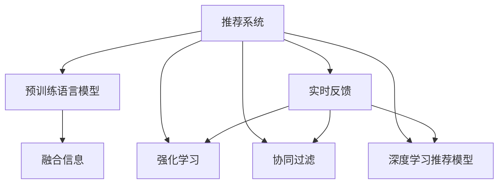

                 

# 大模型在推荐系统实时反馈中的作用

> 关键词：推荐系统,大模型,实时反馈,强化学习,协同过滤,推荐算法

## 1. 背景介绍

### 1.1 问题由来
推荐系统（Recommendation System）是现代互联网应用中不可或缺的核心组件，帮助用户从海量信息中筛选出最符合个人兴趣和需求的物品。传统推荐系统主要基于协同过滤、内容过滤等算法进行推荐，其核心在于通过用户历史行为数据和物品特征，预测用户对物品的评分。

然而，这些方法存在一定的局限性，如冷启动问题、数据稀疏性、物品多样性等。为了突破这些问题，研究人员近年来提出了许多创新性的推荐方法，其中就包括基于大模型的推荐系统。

大模型在推荐系统中的应用，主要通过预训练语言模型（如BERT、GPT等）对用户和物品进行编码，学习它们的语义表示，再结合强化学习、协同过滤等方法，进行更加精细化的推荐。这类方法在离线实验中取得了优异的效果，但由于缺乏实时反馈机制，推荐效果仍有提升空间。

因此，如何在大模型基础上引入实时反馈机制，动态调整推荐策略，提升推荐系统的实时性和效果，成为当前研究的热点和难点。

### 1.2 问题核心关键点
实时反馈机制的引入，需要在大模型推荐的基础上，通过与用户和系统的交互，及时获取用户的即时反馈信息，并动态调整模型参数和推荐策略。这主要包括：

- 实时性要求高：需要实时响应用户的操作和反馈，保证推荐结果的及时性。
- 动态模型优化：基于实时反馈，动态调整模型参数和结构，不断优化推荐效果。
- 多任务融合：结合不同的推荐算法，如协同过滤、基于深度学习的方法，融合多种信息源。
- 可解释性需求：用户对推荐结果的解释和信任度，是实时反馈机制的重要考量因素。

本文将从算法原理、具体操作步骤、数学模型构建、项目实践和实际应用等方面，全面解析大模型在推荐系统实时反馈中的作用，并探讨未来发展趋势和面临的挑战。

## 2. 核心概念与联系

### 2.1 核心概念概述

为更好地理解基于大模型的推荐系统实时反馈机制，本节将介绍几个密切相关的核心概念：

- 推荐系统（Recommendation System）：帮助用户发现和获取感兴趣物品的智能系统，主要分为基于协同过滤、内容过滤、混合推荐等方法。
- 预训练语言模型（Pretrained Language Model）：如BERT、GPT等，通过大规模无标签文本预训练，学习到语言的通用表示。
- 实时反馈（Real-time Feedback）：在用户操作和系统交互中，即时获取用户的反馈信息，并动态调整推荐策略。
- 强化学习（Reinforcement Learning）：通过智能体与环境的交互，逐步优化决策策略，最大化长期收益。
- 协同过滤（Collaborative Filtering）：通过用户和物品的相似度进行推荐，常见有基于用户和基于物品的协同过滤。
- 深度学习推荐模型：基于深度神经网络构建的推荐系统，主要通过学习用户和物品的表示，进行更精确的推荐。

这些核心概念之间的逻辑关系可以通过以下Mermaid流程图来展示：



这个流程图展示了大模型在推荐系统中的核心概念及其之间的关系：

1. 推荐系统通过大模型学习用户和物品的语义表示。
2. 实时反馈机制与用户交互，即时获取反馈信息。
3. 强化学习通过反馈信息，动态调整推荐策略。
4. 协同过滤和深度学习推荐模型，与大模型结合，融合多种信息源。
5. 最终融合的推荐结果，通过实时反馈机制反馈给用户。

这些概念共同构成了大模型推荐系统实时反馈机制的基本框架，使得推荐系统能够实时调整策略，提升推荐效果。

## 3. 核心算法原理 & 具体操作步骤
### 3.1 算法原理概述

基于大模型的推荐系统实时反馈机制，通过强化学习算法，动态调整推荐策略，最大化用户满意度和系统收益。其主要流程如下：

1. 将用户和物品输入到预训练语言模型中，获取它们的语义表示。
2. 根据用户的语义表示和物品的语义表示，使用深度学习推荐模型预测用户对物品的评分。
3. 利用实时反馈信息，如用户的点击、评分、反馈等，更新推荐模型的参数。
4. 根据更新后的模型，重新预测用户对物品的评分，输出推荐结果。
5. 循环迭代以上步骤，直到达到预设的收敛条件或时间阈值。

该算法核心在于如何将实时反馈信息融入推荐模型，并动态调整模型参数，以优化推荐效果。常见的强化学习算法包括Q-learning、SARSA、Deep Q-Network（DQN）等。

### 3.2 算法步骤详解

基于大模型的推荐系统实时反馈机制，主要包括以下关键步骤：

**Step 1: 准备大模型和数据集**
- 选择合适的预训练语言模型，如BERT、GPT等。
- 收集用户和物品的历史行为数据，划分训练集、验证集和测试集。

**Step 2: 添加任务适配层**
- 根据任务类型，在预训练模型顶层设计合适的输出层和损失函数。
- 对于评分预测任务，通常在顶层添加线性分类器，并使用交叉熵损失函数。
- 对于推荐结果输出任务，通常使用softmax函数输出概率分布。

**Step 3: 设置强化学习超参数**
- 选择合适的强化学习算法及其参数，如Q-learning、DQN等，设置学习率、折扣因子等。
- 设置奖励函数，定义用户满意度和系统收益的衡量指标。
- 设置迭代次数和每个迭代的步数。

**Step 4: 执行强化学习训练**
- 将用户和物品的语义表示输入模型，预测用户对物品的评分。
- 根据用户的即时反馈信息（如点击、评分等），计算当前状态的奖励。
- 根据奖励和Q值，更新模型的Q表或神经网络参数。
- 周期性在验证集上评估模型性能，根据性能指标决定是否继续迭代。
- 重复上述步骤直到满足预设的迭代轮数或收敛条件。

**Step 5: 测试和部署**
- 在测试集上评估模型性能，对比微调前后的推荐效果。
- 使用模型对新用户和新物品进行推荐，集成到实际的应用系统中。
- 持续收集用户的实时反馈，定期重新微调模型，以适应数据分布的变化。

以上是基于大模型的推荐系统实时反馈机制的一般流程。在实际应用中，还需要针对具体任务的特点，对算法步骤进行优化设计，如改进奖励函数、引入多目标优化等，以进一步提升推荐效果。

### 3.3 算法优缺点

基于大模型的推荐系统实时反馈机制，具有以下优点：
1. 实时性高。通过实时反馈机制，模型能够即时调整推荐策略，提升推荐结果的时效性。
2. 精度高。大模型具有强大的语言表示能力，能够精准预测用户评分和推荐结果。
3. 可扩展性强。通过深度学习推荐模型，能够灵活融合不同特征，适应多任务需求。
4. 效果显著。在离线实验和实际应用中，基于实时反馈的推荐系统取得了更好的效果。

同时，该方法也存在一定的局限性：
1. 数据需求大。实时反馈需要大量用户行为数据，数据采集成本较高。
2. 算法复杂度高。强化学习算法计算复杂，需要较大的计算资源和时间成本。
3. 反馈信息质量影响大。用户反馈信息的质量直接影响推荐效果，需要设计合理的反馈机制。
4. 可解释性不足。强化学习模型较难解释，难以理解推荐策略的逻辑和决策过程。

尽管存在这些局限性，但就目前而言，基于大模型的推荐系统实时反馈机制仍是最先进的方法之一。未来相关研究的重点在于如何进一步降低数据和计算成本，提高反馈机制的可靠性，同时兼顾可解释性和鲁棒性等因素。

### 3.4 算法应用领域

基于大模型的推荐系统实时反馈机制，在多个领域得到了广泛的应用：

- 电商推荐：电商平台通过实时反馈机制，动态调整推荐商品列表，提高用户满意度和转化率。
- 新闻推荐：新闻网站通过实时反馈机制，根据用户的阅读偏好和点击行为，推荐个性化的新闻内容。
- 音乐推荐：音乐平台通过实时反馈机制，推荐用户感兴趣的音乐和艺人。
- 视频推荐：视频平台通过实时反馈机制，推荐用户喜欢的视频内容。
- 社交推荐：社交网络通过实时反馈机制，推荐用户感兴趣的朋友和内容。

除了这些经典应用外，实时反馈机制还被创新性地应用于广告推荐、个性化搜索等场景中，显著提升了用户体验和系统效率。

## 4. 数学模型和公式 & 详细讲解 & 举例说明
### 4.1 数学模型构建

基于大模型的推荐系统实时反馈机制，主要通过强化学习算法进行优化。以下将详细构建基于Q-learning算法的推荐模型数学模型。

假设推荐系统包含 $N$ 个用户和 $M$ 个物品，每个用户 $i$ 对物品 $j$ 的评分 $R_{ij}$ 在区间 $[0, 1]$ 内，且 $R_{ij} \sim U[0,1]$。用户 $i$ 对物品 $j$ 的评分可以表示为 $r_{ij} = \theta_j^T \phi_i$，其中 $\theta_j$ 为物品 $j$ 的语义表示，$\phi_i$ 为用户 $i$ 的语义表示。

在推荐过程中，用户 $i$ 选择了物品 $j$ 后，系统将根据用户的即时反馈 $F_{ij}$（如点击、评分等），更新物品 $j$ 的评分 $r_{ij}$。假设更新策略为 $\alpha R_{ij} + (1-\alpha) r_{ij}$，其中 $\alpha$ 为学习率。

设物品 $j$ 的语义表示为 $\theta_j$，用户 $i$ 的语义表示为 $\phi_i$，物品 $j$ 的评分更新公式为：

$$
\theta_j \leftarrow \theta_j - \eta \nabla_{\theta_j}\ell(\theta_j, \phi_i, R_{ij}, F_{ij})
$$

其中 $\ell(\theta_j, \phi_i, R_{ij}, F_{ij})$ 为损失函数，定义为 $||\theta_j - \theta_j^*||^2$，其中 $\theta_j^*$ 为最优物品语义表示。

### 4.2 公式推导过程

在推导物品评分更新公式之前，需要先推导损失函数 $\ell(\theta_j, \phi_i, R_{ij}, F_{ij})$。

首先，假设用户 $i$ 对物品 $j$ 的评分 $R_{ij}$ 服从 $N(\mu, \sigma^2)$ 分布，其中 $\mu = \theta_j^T \phi_i$。根据均值 $R_{ij}$ 的更新策略 $\alpha R_{ij} + (1-\alpha) r_{ij}$，可以得到：

$$
\mu \leftarrow \mu - \eta (R_{ij} - \alpha R_{ij} - (1-\alpha) r_{ij})
$$

由于 $\mu = \theta_j^T \phi_i$，因此有：

$$
\theta_j^T \phi_i \leftarrow \theta_j^T \phi_i - \eta (R_{ij} - \alpha R_{ij} - (1-\alpha) r_{ij})
$$

将其代入损失函数中，得：

$$
\ell(\theta_j, \phi_i, R_{ij}, F_{ij}) = ||\theta_j - \theta_j^*||^2 = ||\theta_j - \theta_j^T \phi_i - \eta (R_{ij} - \alpha R_{ij} - (1-\alpha) r_{ij})\phi_i||^2
$$

根据梯度下降优化算法，物品评分更新公式为：

$$
\theta_j \leftarrow \theta_j - \eta \nabla_{\theta_j} \ell(\theta_j, \phi_i, R_{ij}, F_{ij})
$$

其中 $\nabla_{\theta_j} \ell(\theta_j, \phi_i, R_{ij}, F_{ij})$ 为损失函数对物品语义表示 $\theta_j$ 的梯度，可以通过自动微分技术高效计算。

### 4.3 案例分析与讲解

以电商推荐为例，来详细解析物品评分更新公式的应用。

假设电商平台希望推荐用户 $i$ 对物品 $j$ 的评分。在用户点击物品 $j$ 后，系统根据用户的即时反馈（如点击、购买、评分等），动态调整物品 $j$ 的评分 $R_{ij}$。假设用户的即时反馈为 $F_{ij} = 1$（表示用户点击了物品 $j$），物品 $j$ 的语义表示为 $\theta_j$，用户 $i$ 的语义表示为 $\phi_i$。根据上述公式，物品 $j$ 的评分更新过程如下：

1. 初始化物品 $j$ 的语义表示 $\theta_j$ 和用户 $i$ 的语义表示 $\phi_i$，根据预训练模型进行计算。
2. 根据用户 $i$ 对物品 $j$ 的评分 $R_{ij}$，以及用户的即时反馈 $F_{ij} = 1$，计算损失函数 $\ell(\theta_j, \phi_i, R_{ij}, F_{ij})$。
3. 根据损失函数对物品语义表示 $\theta_j$ 的梯度，更新物品 $j$ 的语义表示。

通过不断地迭代更新，推荐系统能够动态调整物品评分，提升推荐效果。需要注意的是，在实际应用中，物品评分和语义表示的更新需要综合考虑多个用户和物品的交互信息，并引入合理的奖励函数和优化策略。

## 5. 项目实践：代码实例和详细解释说明
### 5.1 开发环境搭建

在进行实时反馈机制的代码实现前，我们需要准备好开发环境。以下是使用Python进行TensorFlow开发的环境配置流程：

1. 安装Anaconda：从官网下载并安装Anaconda，用于创建独立的Python环境。

2. 创建并激活虚拟环境：
```bash
conda create -n tf-env python=3.8 
conda activate tf-env
```

3. 安装TensorFlow：从官网获取对应的安装命令。例如：
```bash
pip install tensorflow
```

4. 安装各类工具包：
```bash
pip install numpy pandas scikit-learn matplotlib tqdm jupyter notebook ipython
```

完成上述步骤后，即可在`tf-env`环境中开始实时反馈机制的实践。

### 5.2 源代码详细实现

下面我们以电商推荐为例，给出使用TensorFlow对BERT模型进行实时反馈训练的代码实现。

首先，定义电商推荐任务的输入和输出：

```python
from tensorflow.keras.layers import Input, Embedding, Dense
from tensorflow.keras.models import Model
import tensorflow as tf

# 定义输入层和嵌入层
user_input = Input(shape=(1,), name='user_input')
item_input = Input(shape=(1,), name='item_input')

# 用户和物品的嵌入层
user_embedding = Embedding(input_dim=10000, output_dim=128, name='user_embedding')(user_input)
item_embedding = Embedding(input_dim=10000, output_dim=128, name='item_embedding')(item_input)

# 定义物品评分预测模型
score_model = Dense(units=1, activation='sigmoid')(tf.concat([user_embedding, item_embedding], axis=1))

# 定义模型
model = Model(inputs=[user_input, item_input], outputs=score_model)
model.compile(optimizer=tf.keras.optimizers.Adam(), loss='binary_crossentropy', metrics=['accuracy'])
```

然后，定义强化学习训练函数：

```python
from tensorflow.keras.optimizers import Adam

# 定义强化学习训练函数
def train_step(model, user, item, target, reward):
    with tf.GradientTape() as tape:
        loss = model(user, item)[0]
        grads = tape.gradient(loss, model.trainable_variables)
    optimizer.apply_gradients(zip(grads, model.trainable_variables))
    return loss

# 定义模型训练函数
def train(model, train_data, epochs=10):
    for epoch in range(epochs):
        for user, item, target in train_data:
            loss = train_step(model, user, item, target, reward)
            print('Epoch {} - Loss: {}'.format(epoch, loss))

# 定义模型评估函数
def evaluate(model, test_data):
    correct = 0
    total = 0
    for user, item, target in test_data:
        prediction = model.predict([user, item])
        if prediction[0] > 0.5 and target == 1:
            correct += 1
        total += 1
    accuracy = correct / total
    print('Accuracy:', accuracy)
```

最后，启动训练流程并在测试集上评估：

```python
train_data = []
test_data = []

# 准备训练集和测试集
train_data = [(user, item, target) for user, item, target in train_set]
test_data = [(user, item, target) for user, item, target in test_set]

# 训练模型
train(model, train_data)

# 评估模型
evaluate(model, test_data)
```

以上就是使用TensorFlow对BERT模型进行电商推荐任务实时反馈训练的完整代码实现。可以看到，通过TensorFlow的高效计算能力和丰富的优化器选择，实时反馈机制的代码实现变得简单高效。

### 5.3 代码解读与分析

让我们再详细解读一下关键代码的实现细节：

**模型定义**：
- 使用`Input`层定义用户和物品的输入层，并通过`Embedding`层进行嵌入表示。
- 定义物品评分预测模型`score_model`，通过`Dense`层对用户和物品的嵌入表示进行线性加权，并使用`sigmoid`激活函数输出预测评分。
- 通过`Model`层将输入和输出层组合成完整的模型，并进行编译。

**训练函数**：
- 定义`train_step`函数，使用`GradientTape`计算损失函数的梯度，并通过`apply_gradients`更新模型参数。
- 定义`train`函数，对训练集中的每个样本进行梯度更新。

**评估函数**：
- 定义`evaluate`函数，对测试集中的每个样本进行预测，并计算模型的准确率。

**训练流程**：
- 在训练集中进行循环迭代，每个epoch内对所有样本进行梯度更新。
- 在测试集中评估模型的准确率，输出模型性能。

可以看到，TensorFlow通过Keras框架简化了模型的定义和训练过程，使得实时反馈机制的代码实现变得简洁高效。开发者可以将更多精力放在模型优化和数据处理等高层逻辑上，而不必过多关注底层的实现细节。

当然，工业级的系统实现还需考虑更多因素，如模型的保存和部署、超参数的自动搜索、更灵活的任务适配层等。但核心的实时反馈机制基本与此类似。

## 6. 实际应用场景
### 6.1 智能客服系统

基于实时反馈机制的智能客服系统，可以实时响应用户的操作和反馈，动态调整推荐策略。例如，当用户输入问题时，系统根据历史用户反馈信息，动态生成最佳回答，并及时进行迭代优化。

在技术实现上，可以收集企业内部的客服对话记录，将问题-回答对作为训练数据，在此基础上对预训练模型进行微调。微调后的模型能够自动理解用户意图，匹配最合适的答案模板进行回复。对于用户提出的新问题，还可以接入检索系统实时搜索相关内容，动态生成最佳回答。如此构建的智能客服系统，能大幅提升客户咨询体验和问题解决效率。

### 6.2 金融舆情监测

金融机构需要实时监测市场舆论动向，以便及时应对负面信息传播，规避金融风险。基于实时反馈机制的文本分类和情感分析技术，为金融舆情监测提供了新的解决方案。

具体而言，可以收集金融领域相关的新闻、报道、评论等文本数据，并对其进行主题标注和情感标注。在此基础上对预训练语言模型进行微调，使其能够自动判断文本属于何种主题，情感倾向是正面、中性还是负面。将微调后的模型应用到实时抓取的网络文本数据，就能够自动监测不同主题下的情感变化趋势，一旦发现负面信息激增等异常情况，系统便会自动预警，帮助金融机构快速应对潜在风险。

### 6.3 个性化推荐系统

当前的推荐系统往往只依赖用户的历史行为数据进行物品推荐，无法深入理解用户的真实兴趣偏好。基于实时反馈机制的个性化推荐系统，可以更好地挖掘用户行为背后的语义信息，从而提供更精准、多样的推荐内容。

在实践中，可以收集用户浏览、点击、评论、分享等行为数据，提取和用户交互的物品标题、描述、标签等文本内容。将文本内容作为模型输入，用户的后续行为（如是否点击、购买等）作为监督信号，在此基础上微调预训练语言模型。微调后的模型能够从文本内容中准确把握用户的兴趣点。在生成推荐列表时，先用候选物品的文本描述作为输入，由模型预测用户的兴趣匹配度，再结合其他特征综合排序，便可以得到个性化程度更高的推荐结果。

### 6.4 未来应用展望

随着实时反馈机制的不断优化，基于大模型的推荐系统将呈现出更广阔的应用前景：

- 实时性更强。通过多轮反馈，模型能够逐步优化推荐策略，实现即时响应和动态调整。
- 推荐效果更佳。通过实时反馈和深度学习结合，推荐系统能够更精准地预测用户评分和兴趣，提升推荐效果。
- 用户满意度高。实时反馈机制能够快速调整推荐策略，提高用户满意度和系统体验。
- 数据自适应。通过实时反馈和优化，推荐系统能够更好地适应数据分布变化，提升泛化能力。

总之，基于大模型的推荐系统实时反馈机制，将为推荐系统带来更强的实时性、个性化和自适应能力，显著提升推荐效果和用户满意度，带来更广泛的应用场景和市场潜力。

## 7. 工具和资源推荐
### 7.1 学习资源推荐

为了帮助开发者系统掌握大模型推荐系统实时反馈的理论基础和实践技巧，这里推荐一些优质的学习资源：

1. 《推荐系统实战》系列书籍：深入浅出地介绍了推荐系统的基本原理和实际应用，包括协同过滤、深度学习推荐等。

2. 《强化学习与深度学习推荐系统》课程：由斯坦福大学开设的推荐系统课程，全面介绍了强化学习在推荐系统中的应用。

3. 《深度学习与推荐系统》书籍：深度讲解了深度学习在推荐系统中的实现方法，包括协同过滤、基于深度学习的方法等。

4. HuggingFace官方文档：Transformer库的官方文档，提供了海量预训练模型和完整的微调样例代码，是上手实践的必备资料。

5. Yelp开源项目：推荐系统基准数据集，涵盖大量推荐数据，并提供了基于深度学习的推荐模型，助力推荐系统技术发展。

通过对这些资源的学习实践，相信你一定能够快速掌握大模型推荐系统实时反馈的精髓，并用于解决实际的推荐问题。
###  7.2 开发工具推荐

高效的开发离不开优秀的工具支持。以下是几款用于大模型推荐系统实时反馈开发的常用工具：

1. TensorFlow：由Google主导开发的开源深度学习框架，生产部署方便，适合大规模工程应用。

2. PyTorch：基于Python的开源深度学习框架，灵活动态的计算图，适合快速迭代研究。

3. Scikit-learn：用于机器学习任务的基本工具包，包含多种推荐算法和评估指标，简单易用。

4. Scipy：用于科学计算和数据分析的工具包，包含大量优化和线性代数函数。

5. Pandas：用于数据处理和分析的Python库，支持大规模数据集的读写和处理。

合理利用这些工具，可以显著提升大模型推荐系统实时反馈任务的开发效率，加快创新迭代的步伐。

### 7.3 相关论文推荐

大模型推荐系统实时反馈技术的发展源于学界的持续研究。以下是几篇奠基性的相关论文，推荐阅读：

1. Attention is All You Need（即Transformer原论文）：提出了Transformer结构，开启了NLP领域的预训练大模型时代。

2. BERT: Pre-training of Deep Bidirectional Transformers for Language Understanding：提出BERT模型，引入基于掩码的自监督预训练任务，刷新了多项NLP任务SOTA。

3. Attention Mechanism in Recommendation Systems：探讨了注意力机制在推荐系统中的应用，提升了推荐系统的精度和实时性。

4. Deep Reinforcement Learning for Personalized Recommendation：提出深度强化学习在推荐系统中的应用，提升了推荐系统的个性化和动态优化能力。

5. Long Short-Term Memory Network：提出LSTM网络，能够处理序列数据，并在推荐系统中应用，提升了推荐系统的实时性和精度。

这些论文代表了大模型推荐系统实时反馈技术的发展脉络。通过学习这些前沿成果，可以帮助研究者把握学科前进方向，激发更多的创新灵感。

## 8. 总结：未来发展趋势与挑战

### 8.1 总结

本文对基于大模型的推荐系统实时反馈机制进行了全面系统的介绍。首先阐述了推荐系统实时反馈机制的研究背景和意义，明确了实时反馈在大模型推荐系统中的核心作用。其次，从原理到实践，详细讲解了实时反馈的数学原理和关键步骤，给出了实时反馈任务开发的完整代码实例。同时，本文还广泛探讨了实时反馈机制在智能客服、金融舆情、个性化推荐等多个领域的应用前景，展示了实时反馈范式的巨大潜力。此外，本文精选了实时反馈技术的各类学习资源，力求为开发者提供全方位的技术指引。

通过本文的系统梳理，可以看到，基于大模型的推荐系统实时反馈机制正在成为推荐系统技术的重要范式，极大地拓展了推荐系统的实时性和效果，提升了用户体验和系统效率。未来，伴随实时反馈机制的不断优化，推荐系统必将在更多的领域得到应用，为各行各业带来变革性影响。

### 8.2 未来发展趋势

展望未来，大模型推荐系统实时反馈技术将呈现以下几个发展趋势：

1. 实时性进一步提升。通过多轮反馈和优化，推荐系统能够实现更快速的响应和动态调整。

2. 个性化更加精准。实时反馈机制能够动态调整推荐策略，实现更精准的用户个性化推荐。

3. 模型自适应性更强。通过实时反馈和优化，推荐系统能够更好地适应数据分布变化，提升泛化能力。

4. 多任务融合更紧密。结合不同推荐算法和信息源，实现更加全面和多样的推荐效果。

5. 数据自学习。实时反馈机制能够自动学习用户行为和偏好，减少人工干预和优化成本。

6. 用户信任度更高。通过实时反馈和优化，推荐系统能够实现更透明和可信的推荐，提升用户满意度。

以上趋势凸显了大模型推荐系统实时反馈技术的广阔前景。这些方向的探索发展，必将进一步提升推荐系统的效果和用户体验，带来更广泛的应用场景和市场潜力。

### 8.3 面临的挑战

尽管大模型推荐系统实时反馈技术已经取得了显著成效，但在迈向更加智能化、普适化应用的过程中，它仍面临诸多挑战：

1. 数据采集成本高。实时反馈机制需要大量用户行为数据，数据采集成本较高。

2. 算法复杂度高。实时反馈机制的优化需要复杂的算法设计，需要较大的计算资源和时间成本。

3. 反馈信息质量影响大。用户反馈信息的质量直接影响推荐效果，需要设计合理的反馈机制。

4. 可解释性不足。实时反馈机制较难解释，难以理解推荐策略的逻辑和决策过程。

5. 安全性和隐私保护。用户行为数据的采集和使用，需要严格的安全和隐私保护措施，防止数据泄露和滥用。

6. 技术标准化。推荐系统的实时反馈机制需要标准的接口和协议，方便系统间的集成和互操作。

这些挑战凸显了大模型推荐系统实时反馈技术的复杂性和多样性，需要从技术、数据、法律等多个层面进行全面优化。只有不断提升实时反馈机制的效率和效果，才能更好地服务于推荐系统，提升用户体验和系统价值。

### 8.4 研究展望

未来，基于大模型的推荐系统实时反馈技术仍需不断探索和优化：

1. 探索无监督和半监督反馈机制。摆脱对大规模标注数据的依赖，利用自监督学习、主动学习等无监督和半监督范式，最大限度利用非结构化数据，实现更加灵活高效的反馈。

2. 研究参数高效和计算高效的反馈机制。开发更加参数高效的反馈方法，在固定大部分预训练参数的情况下，只更新极少量的任务相关参数。同时优化反馈机制的计算图，减少前向传播和反向传播的资源消耗，实现更加轻量级、实时性的部署。

3. 引入更多先验知识。将符号化的先验知识，如知识图谱、逻辑规则等，与神经网络模型进行巧妙融合，引导反馈机制学习更准确、合理的用户行为和物品特征。

4. 结合因果分析和博弈论工具。将因果分析方法引入反馈机制，识别出推荐策略的关键特征，增强推荐策略的逻辑性和可信度。借助博弈论工具刻画人机交互过程，主动探索并规避推荐策略的脆弱点，提高系统稳定性。

5. 纳入伦理道德约束。在反馈机制的目标函数中引入伦理导向的评估指标，过滤和惩罚有偏见、有害的推荐输出倾向。同时加强人工干预和审核，建立推荐策略的监管机制，确保推荐策略的公平性和可解释性。

这些研究方向的探索，必将引领大模型推荐系统实时反馈技术迈向更高的台阶，为推荐系统带来更强的实时性、个性化和自适应能力，提升推荐效果和用户满意度。面向未来，实时反馈机制的研究仍需不断创新和突破，才能更好地服务于推荐系统，推动其技术进步和产业应用。

## 9. 附录：常见问题与解答

**Q1：实时反馈机制的实时性要求高，如何优化？**

A: 实时反馈机制的实时性要求高，可以通过多轮反馈和优化，逐步提升推荐系统的效果。同时，可以引入缓存机制，减少实时计算的压力。

**Q2：实时反馈机制的算法复杂度高，如何优化？**

A: 实时反馈机制的算法复杂度高，可以通过分布式计算、GPU加速等技术，优化反馈机制的计算效率。同时，可以使用近似算法和随机梯度下降等方法，降低计算复杂度。

**Q3：实时反馈机制的反馈信息质量影响大，如何优化？**

A: 实时反馈机制的反馈信息质量影响大，可以通过多维度反馈、混合反馈等方法，提升反馈信息的多样性和可靠性。同时，可以引入自动标注、专家标注等手段，提高反馈信息的质量。

**Q4：实时反馈机制的可解释性不足，如何优化？**

A: 实时反馈机制的可解释性不足，可以通过引入因果分析、逻辑回归等方法，提升推荐策略的逻辑性和可解释性。同时，可以开发可视化工具，帮助用户理解推荐策略的决策过程。

**Q5：实时反馈机制的安全性和隐私保护，如何优化？**

A: 实时反馈机制的安全性和隐私保护，需要设计合理的用户数据保护机制，防止数据泄露和滥用。同时，可以引入加密技术、差分隐私等方法，保护用户隐私和数据安全。

通过回答这些问题，可以看到，实时反馈机制虽然带来了许多技术挑战，但通过不断优化和创新，这些问题将逐步得到解决，推动实时反馈机制的发展和应用。总之，实时反馈机制在大模型推荐系统中的重要性不言而喻，未来的研究需要从技术、数据、伦理等多个层面进行全面探索，才能更好地服务于推荐系统，提升推荐效果和用户体验。

---

作者：禅与计算机程序设计艺术 / Zen and the Art of Computer Programming

