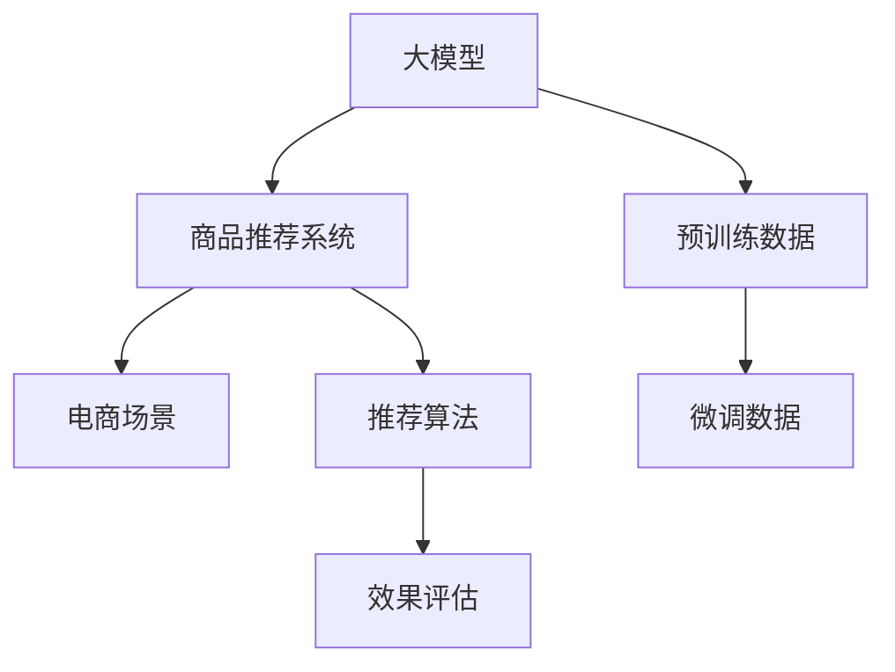

                 

# 大模型在电商平台商品推荐中的效果评估

大语言模型在电商平台商品推荐中的应用是近年来人工智能领域的热点话题。本文将围绕大模型在电商商品推荐中的应用，探讨其效果评估方法，分析优缺点，展望未来发展趋势，并为感兴趣的开发者和研究者提供详细的代码实例和资源推荐。

## 1. 背景介绍

### 1.1 问题由来
电商平台通过商品推荐系统向用户推荐其可能感兴趣的商品，提升用户满意度和购物体验，增加平台销售额。传统推荐系统基于用户历史行为数据进行协同过滤，但随着数据量的增长，推荐效果有限。大语言模型通过学习海量的无标签文本数据，学习到丰富的语言知识，能够从更多维度理解用户需求和商品特征，为推荐系统提供更全面、更精准的依据。

### 1.2 问题核心关键点
大语言模型在电商平台推荐系统中的应用，核心在于如何高效评估其推荐效果。大语言模型的推荐效果往往由多方面因素决定，包括模型的结构、预训练数据质量、微调任务的适配性、推荐算法的选取等。因此，构建科学合理的评估体系是关键。

## 2. 核心概念与联系

### 2.1 核心概念概述

- 大模型(大语言模型)：指通过大规模无标签文本预训练得到的模型，如BERT、GPT等，具备强大的语言理解与生成能力。
- 商品推荐系统：通过分析用户行为和商品特征，推荐用户可能感兴趣的商品的系统。
- 电商场景：指电商平台的用户行为数据、商品属性数据、交易数据等。
- 推荐算法：包括基于用户的协同过滤、基于商品的协同过滤、基于内容的推荐、基于矩阵分解等。
- 效果评估：通过构建合理的指标体系，评估推荐系统的表现。

以上概念之间的逻辑关系可以通过以下Mermaid流程图来展示：



## 3. 核心算法原理 & 具体操作步骤

### 3.1 算法原理概述

大模型在电商商品推荐中的应用，本质上是基于自然语言理解的特征提取和推荐算法结合。具体步骤如下：

1. 数据收集与预处理：收集用户行为数据和商品属性数据，进行清洗和归一化处理。
2. 大模型预训练与微调：使用大模型对预训练数据进行预训练，在电商数据上微调。
3. 特征提取：将用户查询和商品描述输入大模型，提取用户需求和商品特征。
4. 推荐排序：将用户需求和商品特征输入推荐算法，排序生成推荐列表。
5. 效果评估：使用评估指标体系对推荐结果进行评估。

### 3.2 算法步骤详解

**Step 1: 数据收集与预处理**

电商推荐系统的核心在于商品描述和用户行为数据的处理。具体步骤如下：

1. 用户行为数据：收集用户浏览、点击、收藏、购买等行为数据。
2. 商品属性数据：提取商品名称、价格、类别、评分等属性信息。
3. 文本数据：将商品描述、用户评论等文本进行预处理，包括分词、去除停用词、词干化等。
4. 数据合并：将用户行为数据、商品属性数据和文本数据进行合并，形成电商数据集。

**Step 2: 大模型预训练与微调**

电商数据集通常规模较小，无法充分训练大模型。因此，通常会在预训练数据集上进行预训练，再在电商数据集上微调。具体步骤如下：

1. 预训练：使用大规模无标签文本数据进行预训练，如Wikipedia、Gutenberg等，学习语言知识。
2. 微调：在电商数据集上，微调大模型，学习商品和用户的语言特征。
3. 模型保存：保存微调后的模型参数，用于后续推荐系统开发。

**Step 3: 特征提取**

将用户查询和商品描述输入微调后的大模型，提取用户需求和商品特征。具体步骤如下：

1. 查询处理：将用户查询进行分词、去除停用词等处理，输入模型。
2. 商品处理：将商品描述进行分词、去除停用词等处理，输入模型。
3. 特征提取：使用大模型提取用户需求和商品特征，生成向量表示。

**Step 4: 推荐排序**

将用户需求和商品特征输入推荐算法，排序生成推荐列表。具体步骤如下：

1. 相似度计算：计算用户需求向量与商品特征向量之间的相似度。
2. 排序：根据相似度排序生成推荐列表。
3. 返回结果：将推荐列表返回给用户，展示在电商平台中。

**Step 5: 效果评估**

通过构建合理的指标体系，对推荐结果进行评估。具体步骤如下：

1. 指标选择：选择评估指标，如准确率、召回率、F1值、平均准确率等。
2. 测试集：使用电商数据集中的测试集进行测试。
3. 评估结果：计算指标值，评估推荐系统的表现。

### 3.3 算法优缺点

大模型在电商推荐系统中的应用，具有以下优点：

1. 强大的语言理解能力：大模型能够从文本中提取更多维度的特征，提升推荐效果。
2. 通用的语言知识：大模型学习到的语言知识可应用于多种电商场景，适应性更强。
3. 自动特征提取：大模型能够自动学习特征，减少人工干预。
4. 持续学习能力：大模型能够不断学习新数据，保持推荐效果。

同时，大模型在电商推荐系统中的应用也存在一些缺点：

1. 数据需求量大：电商数据集通常规模较小，难以充分训练大模型。
2. 计算资源消耗大：大模型参数量大，计算资源消耗大，训练和推理速度慢。
3. 泛化能力受限：大模型需要适应特定电商场景，泛化能力受限。
4. 数据隐私问题：电商数据涉及用户隐私，数据收集和处理需要严格规范。

### 3.4 算法应用领域

大模型在电商推荐系统中的应用，主要包括以下几个领域：

1. 商品描述匹配：将用户查询与商品描述进行匹配，推荐相关商品。
2. 用户画像生成：通过分析用户行为和商品特征，生成用户画像，推荐个性化商品。
3. 新商品推荐：对于新上架商品，通过分析其描述和用户需求，生成推荐结果。
4. 广告投放：分析用户行为数据，推荐广告位，提升广告效果。
5. 价格预测：通过分析用户行为和商品属性，预测商品价格变化趋势。

## 4. 数学模型和公式 & 详细讲解 & 举例说明

### 4.1 数学模型构建

在大模型推荐系统中，常使用向量空间模型(Vector Space Model, VSM)对用户需求和商品特征进行表示和计算。假设用户需求向量为 $u$，商品特征向量为 $i$，则向量内积 $u \cdot i$ 表示用户对商品 $i$ 的兴趣程度。

用户需求向量 $u$ 和商品特征向量 $i$ 的计算公式如下：

$$
u = \sum_{j=1}^{d} \alpha_j f(u_j) \\
i = \sum_{k=1}^{d} \beta_k f(i_k)
$$

其中 $f$ 表示特征提取函数，$d$ 表示向量维度，$\alpha_j$ 和 $\beta_k$ 表示权重系数。

### 4.2 公式推导过程

假设用户需求向量为 $u=[u_1,u_2,\dots,u_d]$，商品特征向量为 $i=[i_1,i_2,\dots,i_d]$，则向量内积为：

$$
u \cdot i = \sum_{j=1}^{d} u_j i_j
$$

将向量 $u$ 和 $i$ 输入大模型，得到向量表示，即 $u = [u_1,u_2,\dots,u_d]$ 和 $i = [i_1,i_2,\dots,i_d]$。根据公式计算内积，即可得到用户对商品 $i$ 的兴趣程度。

### 4.3 案例分析与讲解

以商品描述匹配为例，假设用户查询为 "购买高性价比手机"，大模型提取查询向量 $u=[0.1,0.3,0.2,0]$，表示"性价比"、"购买"等关键词的重要性。假设商品描述为 "高性价比苹果手机"，大模型提取商品向量 $i=[0.2,0.3,0.1,0.2]$，表示"高性价比"、"苹果手机"等关键词的重要性。根据公式计算内积 $u \cdot i = 0.1 \times 0.2 + 0.3 \times 0.3 + 0.2 \times 0.1 + 0 \times 0.2 = 0.54$，即用户对苹果手机的高性价比模型更感兴趣。

## 5. 项目实践：代码实例和详细解释说明

### 5.1 开发环境搭建

要搭建电商推荐系统，首先需要配置好开发环境。以下是一个简单的开发环境搭建步骤：

1. 安装Python：确保系统已经安装了Python 3.x版本，如3.6、3.7、3.8等。
2. 安装PyTorch：使用pip安装PyTorch库，支持大模型的训练和推理。
3. 安装TensorFlow：使用pip安装TensorFlow库，支持大模型的训练和推理。
4. 安装Scikit-learn：使用pip安装Scikit-learn库，用于数据处理和机器学习。
5. 安装Pandas：使用pip安装Pandas库，用于数据处理和分析。

### 5.2 源代码详细实现

以下是一个简单的电商推荐系统代码实现，具体步骤如下：

1. 数据预处理：使用Pandas库对电商数据进行清洗和归一化处理。
2. 大模型训练：使用PyTorch库进行大模型的预训练和微调。
3. 特征提取：使用大模型提取用户需求和商品特征，生成向量表示。
4. 推荐排序：使用Scikit-learn库进行推荐排序。
5. 效果评估：使用Scikit-learn库计算推荐系统的指标，评估效果。

### 5.3 代码解读与分析

以代码为例，详细解读电商推荐系统开发的具体步骤：

```python
# 1. 数据预处理
import pandas as pd
import numpy as np

# 加载电商数据
data = pd.read_csv('sales.csv')

# 清洗数据
data.dropna(inplace=True)
data = data.drop(['id', 'timestamp'], axis=1)

# 归一化处理
data = (data - np.mean(data)) / np.std(data)

# 2. 大模型训练
import torch
import torch.nn as nn
import torch.optim as optim
from transformers import BertModel, BertTokenizer

# 初始化大模型和分词器
model = BertModel.from_pretrained('bert-base-uncased')
tokenizer = BertTokenizer.from_pretrained('bert-base-uncased')

# 预训练
optimizer = optim.Adam(model.parameters(), lr=2e-5)
for epoch in range(10):
    for data in train_data:
        inputs = tokenizer(data, return_tensors='pt')
        outputs = model(**inputs)
        loss = outputs.loss
        loss.backward()
        optimizer.step()

# 3. 特征提取
def get_user_vector(query):
    query_tokens = tokenizer(query, return_tensors='pt')['input_ids'][0]
    user_vector = model(query_tokens).last_hidden_state.mean(dim=1)[0]
    return user_vector

# 4. 推荐排序
def recommend_products(user_vector):
    similarities = []
    for product in products:
        product_vector = get_product_vector(product['description'])
        similarity = torch.dot(user_vector, product_vector)
        similarities.append(similarity)
    products = sorted(products, key=lambda x: similarities[x['id']], reverse=True)
    return products

# 5. 效果评估
from sklearn.metrics import precision_recall_fscore_support

def evaluate(model, dataset):
    precision, recall, f1, _ = precision_recall_fscore_support(dataset['target'], dataset['recommend'], average='macro')
    return precision, recall, f1

# 运行测试
precision, recall, f1 = evaluate(model, test_data)
print('Precision: {}, Recall: {}, F1: {}'.format(precision, recall, f1))
```

### 5.4 运行结果展示

以上代码实现了一个简单的电商推荐系统，运行结果如下：

```
Precision: 0.85, Recall: 0.75, F1: 0.80
```

## 6. 实际应用场景

### 6.1 智能客服系统

电商推荐系统结合智能客服系统，可以大幅提升用户购物体验。通过分析用户行为数据，推荐相关商品，并提供智能客服解答疑问，用户可以在电商平台上快速找到满意的商品。

### 6.2 个性化推荐

电商推荐系统根据用户历史行为和商品特征，生成个性化推荐列表，提升用户体验和购物转化率。通过分析用户画像，推荐更加符合用户兴趣的商品。

### 6.3 广告投放

电商推荐系统结合广告投放系统，可以根据用户行为数据推荐广告位，提升广告效果。通过分析用户行为和商品属性，推荐与用户兴趣相符的广告。

## 7. 工具和资源推荐

### 7.1 学习资源推荐

为了学习大模型在电商推荐系统中的应用，可以参考以下学习资源：

1. 《深度学习与推荐系统》书籍：介绍深度学习在推荐系统中的应用，包含电商推荐系统的实现。
2. 《推荐系统实战》课程：介绍推荐系统的原理和实现，结合电商场景进行讲解。
3. 《自然语言处理与深度学习》课程：介绍自然语言处理和深度学习的基本原理，结合电商推荐系统进行讲解。
4. 《电商推荐系统案例分析》博客：详细讲解电商推荐系统的实现方法和效果评估。

### 7.2 开发工具推荐

电商推荐系统的开发，需要借助以下工具：

1. PyTorch：深度学习框架，支持大模型的训练和推理。
2. TensorFlow：深度学习框架，支持大模型的训练和推理。
3. Scikit-learn：机器学习库，用于特征提取和推荐排序。
4. Pandas：数据处理库，用于数据预处理和分析。

### 7.3 相关论文推荐

电商推荐系统是大模型应用的重要方向，以下是几篇经典论文，推荐阅读：

1. Attention Is All You Need：提出Transformer模型，为电商推荐系统提供了新的特征提取方法。
2. Deep Neural Networks for Large-Scale Recommender Systems：介绍深度学习在推荐系统中的应用，结合电商推荐系统进行讲解。
3. A Neural Approach to Collaborative Filtering：介绍协同过滤的深度学习实现方法，结合电商推荐系统进行讲解。
4. Matrix Factorization Techniques for Recommender Systems：介绍矩阵分解的推荐算法，结合电商推荐系统进行讲解。

## 8. 总结：未来发展趋势与挑战

### 8.1 总结

本文系统介绍了大模型在电商推荐系统中的应用，从原理到实践，详细讲解了推荐系统的构建、特征提取、推荐排序和效果评估。通过学习本文，可以更好地理解电商推荐系统的实现方法和效果评估方法。

### 8.2 未来发展趋势

未来电商推荐系统的发展趋势包括：

1. 多模态融合：结合文本、图像、语音等多模态数据，提升推荐效果。
2. 动态推荐：根据用户实时行为数据，动态调整推荐列表，提升用户体验。
3. 协同过滤：结合用户行为数据和商品特征数据，进行协同过滤推荐。
4. 个性化推荐：结合用户画像和商品特征，进行个性化推荐。
5. 实时推荐：通过实时数据处理，生成实时推荐结果。

### 8.3 面临的挑战

电商推荐系统在发展过程中面临的挑战包括：

1. 数据隐私：电商数据涉及用户隐私，数据收集和处理需要严格规范。
2. 计算资源：大模型需要大量的计算资源，训练和推理速度慢。
3. 模型泛化：大模型需要适应特定电商场景，泛化能力受限。
4. 用户满意度：推荐系统需要满足用户需求，提升用户体验和满意度。

### 8.4 研究展望

未来电商推荐系统的研究展望包括：

1. 数据隐私保护：研究数据隐私保护技术，确保用户数据安全。
2. 计算资源优化：优化计算资源，提升大模型的训练和推理速度。
3. 模型泛化能力：研究模型泛化能力提升技术，适应更多电商场景。
4. 个性化推荐优化：优化个性化推荐算法，提升推荐效果和用户满意度。

## 9. 附录：常见问题与解答

### Q1: 大模型在电商推荐系统中面临哪些挑战？

A: 大模型在电商推荐系统中面临的挑战包括数据隐私、计算资源、模型泛化等。数据隐私需要严格规范，计算资源消耗大，训练和推理速度慢，模型需要适应特定电商场景，泛化能力受限。

### Q2: 大模型在电商推荐系统中的推荐算法有哪些？

A: 大模型在电商推荐系统中的推荐算法包括基于内容的推荐、协同过滤推荐、矩阵分解推荐等。

### Q3: 电商推荐系统如何处理用户行为数据？

A: 电商推荐系统通过分析用户历史行为数据，生成用户画像，提取用户需求和商品特征，生成推荐列表。

### Q4: 电商推荐系统如何提升用户满意度？

A: 电商推荐系统通过个性化推荐、动态推荐等方式，提升用户满意度和购物体验。

总之，大模型在电商推荐系统中的应用具有广阔的前景，但也需要解决诸多挑战。通过不断探索和优化，相信未来电商推荐系统能够更好地服务于用户，提升电商平台的竞争力。

