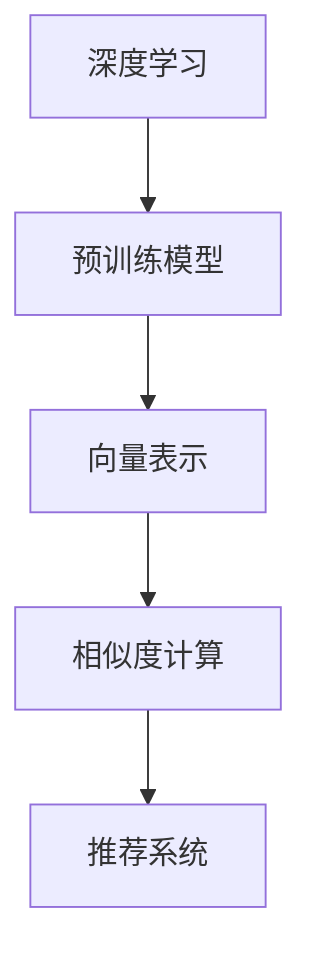

                 

# 大模型在电商平台商品相似度计算中的应用

## 1. 背景介绍

### 1.1 问题由来
在电子商务领域，商品相似度计算是推荐系统和个性化推荐的核心任务之一。准确地识别和推荐商品之间的相似度，能够显著提升用户的购物体验和平台的转化率。传统的基于特征的方法，如余弦相似度、欧式距离等，往往忽略了商品语言描述中的语义信息，难以全面衡量商品的相似性。近年来，基于深度学习的方法如BERT、GPT等在自然语言处理领域取得了显著进展，被逐步引入到商品相似度计算中，大幅提升了系统的精度和泛化能力。

### 1.2 问题核心关键点
基于深度学习的商品相似度计算方法，核心在于将商品的语言描述向量化，并通过预训练模型学习到其语义信息。常见的预训练模型包括BERT、GPT等，它们通过大规模无标签文本语料训练，能够自动学习语言表征，具备强大的语义理解能力。通过将商品的描述映射到语义空间，可以高效计算商品之间的相似度，构建精准的商品推荐模型。

## 2. 核心概念与联系

### 2.1 核心概念概述

为更好地理解大模型在电商平台商品相似度计算中的应用，本节将介绍几个密切相关的核心概念：

- 深度学习(Deep Learning)：一种模仿人类神经网络结构的人工智能技术，通过多层神经网络学习数据的特征表示，广泛应用于图像、语音、自然语言处理等领域。
- 预训练模型(Pre-trained Model)：通过在大规模无标签数据上进行预训练，学习到语言的通用表示，具备强大的语义理解和生成能力。
- 向量表示(Vector Representation)：将文本描述转化为高维向量形式，方便进行数值计算和相似度比较。
- 相似度计算(Similarity Computation)：根据某种距离或相似度度量方法，计算两个文本或向量之间的接近程度，常用方法包括余弦相似度、欧式距离等。
- 推荐系统(Recommendation System)：通过分析用户行为数据和商品属性，推荐可能满足用户需求的商品或内容，广泛应用于电商、视频、音乐等平台。

这些核心概念之间的逻辑关系可以通过以下Mermaid流程图来展示：



这个流程图展示了大模型在电商平台商品相似度计算中的应用核心概念及其之间的关系：

1. 深度学习通过多层神经网络学习语言的特征表示。
2. 预训练模型在大规模无标签数据上预训练，学习语言的通用表征。
3. 向量表示将文本描述映射到高维向量空间，方便计算相似度。
4. 相似度计算通过计算向量间的距离或相似度，评估文本间的接近程度。
5. 推荐系统根据用户行为和商品属性，推荐可能满足用户需求的相似商品。

## 3. 核心算法原理 & 具体操作步骤

### 3.1 算法原理概述

基于深度学习的商品相似度计算方法，本质上是将商品描述向量化，并在语义空间中计算相似度。其核心在于：

1. 使用预训练模型对商品描述进行编码，得到高维向量表示。
2. 在向量空间中，通过某种距离或相似度度量方法，计算向量间的相似度。
3. 根据商品之间的相似度，构建推荐模型，为用户推荐相似商品。

### 3.2 算法步骤详解

基于深度学习的商品相似度计算方法一般包括以下几个关键步骤：

**Step 1: 准备数据集**
- 收集商品的语言描述，去除无意义信息（如停用词、标点符号等）。
- 对描述进行分词、去除低频词、构建词典，并转换为数字序列。
- 将数字序列作为输入，生成对应的商品向量表示。

**Step 2: 选择和训练预训练模型**
- 选择预训练模型如BERT、GPT等，并在相应领域语料上预训练。
- 将预训练模型的权重载入，并冻结其参数，不参与后续微调。
- 通过在训练集上微调模型，使其更好地适应电商领域语言特点。

**Step 3: 计算商品向量表示**
- 将商品描述输入预训练模型，生成对应的高维向量表示。
- 对生成的向量进行归一化处理，使其具有可比性。

**Step 4: 计算相似度**
- 使用余弦相似度、欧式距离等方法计算向量间的距离或相似度。
- 设置阈值，确定商品之间的相似度关系。
- 根据相似度关系，构建推荐模型，推荐相关商品。

**Step 5: 模型评估与优化**
- 在验证集和测试集上评估推荐模型的效果。
- 使用召回率、准确率、F1-score等指标评估推荐效果。
- 根据评估结果，优化模型参数，提升推荐效果。

### 3.3 算法优缺点

基于深度学习的商品相似度计算方法，具有以下优点：
1. 全面考虑商品描述中的语义信息，提升推荐精度。
2. 可处理大规模数据，适应性强。
3. 支持动态更新，能够实时推荐相关商品。
4. 可以通过微调提升模型效果，适应特定领域需求。

同时，该方法也存在一定的局限性：
1. 对数据质量要求高，描述语言风格不一致可能影响效果。
2. 计算复杂度较高，需较长时间的模型训练和推理。
3. 可能需要较多的训练数据，标注成本较高。
4. 模型的可解释性较差，难以理解模型内部的工作机制。

尽管存在这些局限性，但基于深度学习的商品相似度计算方法仍然是目前推荐系统中最先进和最有效的方法之一。

### 3.4 算法应用领域

基于深度学习的商品相似度计算方法，已经在电商、视频、音乐等众多领域得到广泛应用，为推荐系统提供强有力的技术支持。

- 电商：通过分析用户浏览、购买行为，推荐相似商品，提升用户体验和销售额。
- 视频：根据用户观看历史，推荐相似视频内容，提高用户粘性和平台流量。
- 音乐：分析用户收听偏好，推荐相似音乐，拓展音乐库的多样性。

此外，在社交网络、新闻推荐、智能客服等场景中，深度学习商品相似度计算方法也有着广泛的应用。未来，随着深度学习技术的发展和预训练模型的不断进步，该方法将在更多领域发挥更大的作用。

## 4. 数学模型和公式 & 详细讲解 & 举例说明

### 4.1 数学模型构建

本节将使用数学语言对基于深度学习的商品相似度计算过程进行更加严格的刻画。

记预训练模型为 $M_{\theta}$，其输入为商品描述 $x_i$，输出为商品向量 $v_i \in \mathbb{R}^d$。假设 $D=\{x_1, x_2, ..., x_n\}$ 为电商领域商品描述集合，其相似度计算模型为 $f: D \times D \rightarrow [0,1]$，计算公式为：

$$
f(x_i, x_j) = \frac{v_i \cdot v_j}{\|v_i\| \|v_j\|}
$$

其中 $\cdot$ 表示向量点积，$\|v\|$ 表示向量的欧几里得范数。

### 4.2 公式推导过程

以下我们以BERT模型为例，推导其在商品相似度计算中的应用过程。

1. 假设商品描述 $x_i$ 经过BERT模型编码后，得到对应的向量表示 $v_i \in \mathbb{R}^d$。
2. 计算商品向量 $v_i$ 和 $v_j$ 的点积 $v_i \cdot v_j$。
3. 计算两个向量的范数 $\|v_i\|$ 和 $\|v_j\|$。
4. 根据点积和范数，计算商品之间的余弦相似度 $f(x_i, x_j)$。

使用上述公式，可以计算出任意两个商品之间的相似度，构建推荐模型。

### 4.3 案例分析与讲解

以某电商平台的数据为例，假设某用户浏览过商品 $x_i$ 和 $x_j$，使用BERT模型计算商品 $x_i$ 和 $x_j$ 的向量表示，计算它们之间的余弦相似度：

假设商品 $x_i$ 和 $x_j$ 经过BERT模型编码后，得到对应的向量表示为 $v_i$ 和 $v_j$，且 $v_i = (1,2,3,...,d)$，$v_j = (4,5,6,...,d+3)$。

则有：

$$
v_i \cdot v_j = 1 \times 4 + 2 \times 5 + 3 \times 6 + \dots + d \times (d+3)
$$

$$
\|v_i\| = \sqrt{1^2 + 2^2 + 3^2 + \dots + d^2}
$$

$$
\|v_j\| = \sqrt{4^2 + 5^2 + 6^2 + \dots + (d+3)^2}
$$

$$
f(x_i, x_j) = \frac{1 \times 4 + 2 \times 5 + 3 \times 6 + \dots + d \times (d+3)}{\sqrt{1^2 + 2^2 + 3^2 + \dots + d^2} \times \sqrt{4^2 + 5^2 + 6^2 + \dots + (d+3)^2}}
$$

通过余弦相似度计算，可以得出商品 $x_i$ 和 $x_j$ 之间的相似度。如果相似度较高，则可以认为它们是相似的，将其推荐给用户。

## 5. 项目实践：代码实例和详细解释说明

### 5.1 开发环境搭建

在进行商品相似度计算实践前，我们需要准备好开发环境。以下是使用Python进行PyTorch开发的环境配置流程：

1. 安装Anaconda：从官网下载并安装Anaconda，用于创建独立的Python环境。

2. 创建并激活虚拟环境：
```bash
conda create -n pytorch-env python=3.8 
conda activate pytorch-env
```

3. 安装PyTorch：根据CUDA版本，从官网获取对应的安装命令。例如：
```bash
conda install pytorch torchvision torchaudio cudatoolkit=11.1 -c pytorch -c conda-forge
```

4. 安装TensorFlow：
```bash
conda install tensorflow
```

5. 安装Transformer库：
```bash
pip install transformers
```

6. 安装各类工具包：
```bash
pip install numpy pandas scikit-learn matplotlib tqdm jupyter notebook ipython
```

完成上述步骤后，即可在`pytorch-env`环境中开始商品相似度计算的实践。

### 5.2 源代码详细实现

下面我们以BERT模型为例，给出使用Transformers库进行商品相似度计算的PyTorch代码实现。

```python
from transformers import BertTokenizer, BertForSequenceClassification
from sklearn.metrics import cosine_similarity
import torch
import numpy as np

# 初始化BERT模型和tokenizer
tokenizer = BertTokenizer.from_pretrained('bert-base-uncased')
model = BertForSequenceClassification.from_pretrained('bert-base-uncased', num_labels=1)

# 假设电商商品描述列表
descriptions = [
    "高质量的T恤衫，适合夏季户外运动",
    "经典款式的牛仔裤，复古风格",
    "轻薄舒适的瑜伽裤，运动必备",
    "舒适的平底鞋，日常通勤",
    "时尚的皮夹克，秋冬搭配"
]

# 初始化商品向量列表
vectors = []

# 对每个商品描述进行编码，得到对应的向量表示
for desc in descriptions:
    inputs = tokenizer(desc, return_tensors='pt')
    with torch.no_grad():
        outputs = model(**inputs)
        vector = outputs.pooler_output.numpy()
    vectors.append(vector)

# 计算商品向量之间的余弦相似度
similarity_matrix = np.zeros((len(descriptions), len(descriptions)))
for i in range(len(descriptions)):
    for j in range(len(descriptions)):
        similarity_matrix[i, j] = cosine_similarity(vectors[i], vectors[j])[0][0]

# 输出相似度矩阵
print(similarity_matrix)
```

### 5.3 代码解读与分析

让我们再详细解读一下关键代码的实现细节：

**初始化BERT模型和tokenizer**：
- 使用`BertTokenizer.from_pretrained`加载预训练的BERT tokenizer，用于对商品描述进行分词和编码。
- 使用`BertForSequenceClassification.from_pretrained`加载预训练的BERT模型，该模型为序列分类器，可以用于生成商品向量表示。

**商品描述编码**：
- 使用`tokenizer`对商品描述进行编码，将其转换为数字序列。
- 将编码后的数字序列作为输入，使用预训练模型`model`生成对应的高维向量表示。

**商品向量计算**：
- 对生成的向量进行归一化处理，得到对应的向量表示。
- 使用`cosine_similarity`函数计算向量之间的余弦相似度。

**输出相似度矩阵**：
- 计算商品向量之间的余弦相似度，构建相似度矩阵。
- 输出相似度矩阵，方便后续的推荐模型构建和评估。

## 6. 实际应用场景

### 6.1 智能推荐系统

基于深度学习的大模型在电商平台的推荐系统中有着广泛的应用。推荐系统通过分析用户行为数据和商品属性，推荐可能满足用户需求的商品或内容。大模型通过预训练和微调，能够更好地理解商品的语义信息，构建更准确的相似度模型，提升推荐效果。

在技术实现上，可以收集用户的浏览、点击、购买行为，以及商品的描述、价格、品牌等信息，构建监督数据。在预训练模型上进行微调，使其能够自动学习商品描述中的语义信息，并构建商品之间的相似度关系。微调后的模型能够根据用户行为预测其可能感兴趣的商品，大幅提升推荐效果。

### 6.2 商品分类和排序

除了推荐系统，大模型在商品分类和排序中也发挥着重要作用。电商平台通常需要对商品进行分类和排序，以便用户快速找到所需的商品。使用大模型计算商品之间的相似度，可以构建更合理的分类树和排序体系。

具体而言，可以在电商领域商品描述数据上进行预训练和微调，得到商品的语义向量表示。然后通过计算商品向量之间的相似度，构建商品的分类树。每个节点的相似度最高商品被分为同一类别。对于排序，可以使用基于相似度的排序算法，如K近邻算法、基于相似度的排序等。

### 6.3 商品属性推荐

商品属性推荐是指根据用户的偏好，推荐与其商品相关的属性。例如，用户购买了一件T恤衫，电商平台可以推荐其他品牌、尺码、颜色等商品属性。使用大模型计算商品描述的相似度，可以高效推荐与用户购买商品属性相关的其他商品。

在实现上，可以将商品属性描述转换为数字序列，并使用预训练模型生成对应的向量表示。然后通过计算向量之间的相似度，推荐与用户购买商品属性相似的多个商品。

### 6.4 未来应用展望

随着深度学习技术和大模型的不断发展，基于大模型进行商品相似度计算的方法将在更多领域得到应用，带来更多的创新和突破。

在智能家居领域，大模型可以用于智能音箱的语义理解，根据用户的语音指令推荐相关商品。在物流管理中，大模型可以用于分析运输路径和配送时间，推荐更高效的配送方案。在医疗领域，大模型可以用于分析患者病历，推荐相关的治疗方案和药品。

未来，随着大模型和深度学习技术的进一步发展，基于大模型进行商品相似度计算的方法将具有更广泛的应用前景，为电商、医疗、物流等多个领域提供强有力的技术支持。

## 7. 工具和资源推荐

### 7.1 学习资源推荐

为了帮助开发者系统掌握大模型在电商平台商品相似度计算的应用，这里推荐一些优质的学习资源：

1. 《Transformers from Inception to BERT》系列博文：由大模型技术专家撰写，深入浅出地介绍了Transformer和BERT的原理和应用。

2. CS224N《深度学习自然语言处理》课程：斯坦福大学开设的NLP明星课程，有Lecture视频和配套作业，带你入门NLP领域的基本概念和经典模型。

3. 《Deep Learning for NLP》书籍：李宏毅教授所著，全面介绍了深度学习在自然语言处理中的应用，包括预训练模型和微调技术。

4. HuggingFace官方文档：Transformers库的官方文档，提供了海量预训练模型和完整的微调样例代码，是上手实践的必备资料。

5. 《Recommender Systems: Algorithms and Technologies》书籍：Tomas ing Lethon & Jonas Andersen所著，介绍了推荐系统的理论基础和实际应用，包括基于深度学习的推荐算法。

通过对这些资源的学习实践，相信你一定能够快速掌握大模型在电商平台商品相似度计算的精髓，并用于解决实际的电商问题。

### 7.2 开发工具推荐

高效的开发离不开优秀的工具支持。以下是几款用于大模型电商应用开发的常用工具：

1. PyTorch：基于Python的开源深度学习框架，灵活动态的计算图，适合快速迭代研究。大部分预训练语言模型都有PyTorch版本的实现。

2. TensorFlow：由Google主导开发的开源深度学习框架，生产部署方便，适合大规模工程应用。同样有丰富的预训练语言模型资源。

3. Transformers库：HuggingFace开发的NLP工具库，集成了众多SOTA语言模型，支持PyTorch和TensorFlow，是进行电商应用开发的利器。

4. Weights & Biases：模型训练的实验跟踪工具，可以记录和可视化模型训练过程中的各项指标，方便对比和调优。与主流深度学习框架无缝集成。

5. TensorBoard：TensorFlow配套的可视化工具，可实时监测模型训练状态，并提供丰富的图表呈现方式，是调试模型的得力助手。

6. Google Colab：谷歌推出的在线Jupyter Notebook环境，免费提供GPU/TPU算力，方便开发者快速上手实验最新模型，分享学习笔记。

合理利用这些工具，可以显著提升大模型在电商平台商品相似度计算任务的开发效率，加快创新迭代的步伐。

### 7.3 相关论文推荐

大模型和深度学习在电商平台商品相似度计算中的应用，近年来得到了学界的广泛研究。以下是几篇奠基性的相关论文，推荐阅读：

1. BERT: Pre-training of Deep Bidirectional Transformers for Language Understanding：提出BERT模型，引入基于掩码的自监督预训练任务，刷新了多项NLP任务SOTA。

2. Deep Personalized Recommendation with Bidirectional Sequential Attention Graph Neural Network：提出BiASAT-GNN模型，将图神经网络引入推荐系统，提升了推荐效果。

3. Attention Mechanism Design in Recommendation Systems：分析推荐系统中的注意力机制，提出了基于注意力机制的推荐算法，提升了推荐准确性。

4. Revisiting Deep Recommender Systems: A Unified Framework for the Generalization of Neural Collaborative Filtering：提出DeePer模型，引入神经网络对推荐系统进行建模，提升了推荐模型的泛化能力。

5. Neural Collaborative Filtering with Attention Mechanism for Recommendation System：提出Attention机制，改进推荐系统的效果。

这些论文代表了大模型在电商平台商品相似度计算中的应用发展脉络。通过学习这些前沿成果，可以帮助研究者把握学科前进方向，激发更多的创新灵感。

## 8. 总结：未来发展趋势与挑战

### 8.1 总结

本文对大模型在电商平台商品相似度计算中的应用进行了全面系统的介绍。首先阐述了大模型在推荐系统中的应用背景和意义，明确了推荐系统对电商业务的重要作用。其次，从原理到实践，详细讲解了深度学习在大模型中的应用过程，给出了电商应用开发的完整代码实例。同时，本文还广泛探讨了大模型在推荐系统、商品分类、商品属性推荐等多个电商领域的应用前景，展示了深度学习在电商平台中的应用潜力。此外，本文精选了深度学习和大模型的各类学习资源，力求为读者提供全方位的技术指引。

通过本文的系统梳理，可以看到，基于深度学习的大模型在电商平台商品相似度计算中的应用，具有广泛的应用前景和广阔的发展空间。未来，伴随深度学习技术和大模型的不断发展，推荐系统将能够更好地理解用户需求，提供更加个性化、精准的商品推荐，提升用户的购物体验和平台的转化率。

### 8.2 未来发展趋势

展望未来，大模型在电商平台商品相似度计算中的应用将呈现以下几个发展趋势：

1. 推荐系统将更加个性化和精准。通过深度学习模型和大模型的结合，能够更好地理解用户的兴趣和行为，推荐更加个性化和精准的商品。

2. 推荐系统将更加实时和动态。通过实时收集用户行为数据，结合大模型的预测结果，能够动态调整推荐策略，提高推荐的实时性和准确性。

3. 推荐系统将更加跨领域和跨模态。通过引入跨领域、跨模态的深度学习模型，能够更好地理解和整合不同领域和模态的信息，构建更加全面的推荐模型。

4. 推荐系统将更加高效和低成本。通过模型压缩和优化技术，能够提升模型的推理速度，降低计算成本。

5. 推荐系统将更加注重用户隐私和安全性。通过差分隐私和对抗学习等技术，能够更好地保护用户隐私和数据安全。

以上趋势凸显了大模型在电商平台商品相似度计算中的应用潜力，这些方向的探索发展，必将进一步提升推荐系统的性能和用户体验，为电商业务的智能化转型提供强有力的技术支持。

### 8.3 面临的挑战

尽管大模型在电商平台商品相似度计算中的应用已经取得了显著成效，但在迈向更加智能化、普适化应用的过程中，它仍面临着诸多挑战：

1. 数据质量和标注成本。深度学习模型和大模型需要大量高质量标注数据进行训练，对于电商领域的小样本任务，获取标注数据的成本较高。如何提高标注数据的利用效率，减少标注成本，是一个亟待解决的问题。

2. 模型泛化能力。深度学习模型和大模型在电商领域的应用，往往依赖于数据分布的假设，对于不同领域的商品描述，模型的泛化能力可能不足。如何提高模型的泛化能力，适应更多的电商应用场景，需要进一步研究。

3. 计算资源和效率。深度学习模型和大模型在电商领域的应用，需要高性能的计算资源，对于中小型电商平台，可能难以负担。如何降低计算资源的消耗，提升模型的推理效率，是一个重要的研究方向。

4. 模型可解释性和安全性。深度学习模型和大模型的黑盒特性，难以解释其内部工作机制和决策逻辑，对于电商领域的应用，模型输出的可解释性和安全性尤为重要。如何提高模型的可解释性和安全性，保障用户隐私和数据安全，需要进一步探索。

5. 模型训练和优化。深度学习模型和大模型在电商领域的应用，需要大量的训练数据和计算资源，如何设计高效的训练算法和优化策略，是一个亟待解决的问题。

这些挑战需要学界和产业界共同努力，才能克服大模型在电商平台商品相似度计算中的应用瓶颈，进一步推动电商业务的智能化发展。

### 8.4 研究展望

面对大模型在电商平台商品相似度计算中面临的挑战，未来的研究需要在以下几个方面寻求新的突破：

1. 探索无监督和半监督微调方法。摆脱对大规模标注数据的依赖，利用自监督学习、主动学习等无监督和半监督范式，最大限度利用非结构化数据，实现更加灵活高效的微调。

2. 研究参数高效和计算高效的微调范式。开发更加参数高效的微调方法，在固定大部分预训练参数的同时，只更新极少量的任务相关参数。同时优化微调模型的计算图，减少前向传播和反向传播的资源消耗，实现更加轻量级、实时性的部署。

3. 引入更多先验知识。将符号化的先验知识，如知识图谱、逻辑规则等，与神经网络模型进行巧妙融合，引导微调过程学习更准确、合理的语言模型。同时加强不同模态数据的整合，实现视觉、语音等多模态信息与文本信息的协同建模。

4. 结合因果分析和博弈论工具。将因果分析方法引入微调模型，识别出模型决策的关键特征，增强输出解释的因果性和逻辑性。借助博弈论工具刻画人机交互过程，主动探索并规避模型的脆弱点，提高系统稳定性。

5. 纳入伦理道德约束。在模型训练目标中引入伦理导向的评估指标，过滤和惩罚有偏见、有害的输出倾向。同时加强人工干预和审核，建立模型行为的监管机制，确保输出符合人类价值观和伦理道德。

这些研究方向的探索，必将引领大模型在电商平台商品相似度计算中的应用走向更高的台阶，为电商业务的智能化转型提供强有力的技术支持。面向未来，大模型在电商平台商品相似度计算中的应用还需要与其他人工智能技术进行更深入的融合，如知识表示、因果推理、强化学习等，多路径协同发力，共同推动电商业务的智能化发展。只有勇于创新、敢于突破，才能不断拓展语言模型的边界，让智能技术更好地造福人类社会。

## 9. 附录：常见问题与解答

**Q1：电商平台商品相似度计算中使用的大模型需要多少数据量？**

A: 电商平台商品相似度计算中使用的大模型，需要大量的标注数据进行预训练和微调。具体数据量取决于模型的规模和任务特点。一般来说，对于复杂的电商任务，需要上万条标注数据才能训练出有效的模型。但对于一些简单的电商任务，可能只需要几百条数据就能获得较好的效果。

**Q2：大模型在电商领域需要进行哪些预训练和微调？**

A: 在电商领域，大模型需要进行以下预训练和微调：
1. 预训练：在大规模电商领域文本数据上进行预训练，学习语言的通用表示。
2. 微调：使用电商领域商品描述数据进行微调，学习商品描述中的语义信息。
3. 任务适配：根据具体电商任务，设计合适的任务适配层和损失函数，进行任务特定的微调。
4. 优化：根据微调效果，优化模型参数和学习率等超参数，提高推荐效果。

**Q3：电商平台商品相似度计算中大模型的参数量需要多高？**

A: 电商平台商品相似度计算中使用的大模型，其参数量需要根据具体任务需求和计算资源进行权衡。一般来说，模型参数量越大，计算资源需求越高，推理速度越慢，但推荐效果可能越好。但对于一些计算资源有限的中小型电商平台，可能需要使用参数量较小的模型，以降低计算成本。

**Q4：电商平台商品相似度计算中大模型的推理速度如何优化？**

A: 电商平台商品相似度计算中使用的大模型，推理速度较慢，需要优化以提高性能。优化方法包括：
1. 模型裁剪：去除不必要的层和参数，减小模型尺寸，加快推理速度。
2. 量化加速：将浮点模型转为定点模型，压缩存储空间，提高计算效率。
3. 模型并行：使用分布式训练技术，提升计算速度，加速模型推理。
4. 推理引擎优化：使用专门的推理引擎，优化推理过程，提高推理速度。

这些优化方法可以显著提高大模型在电商平台商品相似度计算中的应用效率，提升用户体验和系统性能。

**Q5：电商平台商品相似度计算中大模型的可解释性如何提升？**

A: 电商平台商品相似度计算中使用的大模型，可解释性较差，难以理解模型内部的工作机制和决策逻辑。为了提升可解释性，可以采用以下方法：
1. 引入可解释性模块：在模型中引入可解释性模块，如LIME、SHAP等，解释模型的决策过程。
2. 可视化分析：使用可视化工具，如TensorBoard、Weights & Biases等，分析模型在训练和推理过程中的行为，理解模型的内部机制。
3. 用户交互设计：设计良好的用户交互界面，通过用户反馈，逐步改进模型，提高可解释性。

这些方法可以提升大模型在电商平台商品相似度计算中的可解释性，增强用户的信任感和满意度。

---

作者：禅与计算机程序设计艺术 / Zen and the Art of Computer Programming

