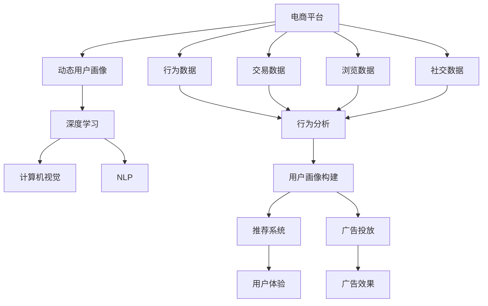

                 

# 大模型在电商平台用户画像动态更新中的应用

> 关键词：用户画像, 动态更新, 电商平台, 大模型, 深度学习, 计算机视觉, 自然语言处理

## 1. 背景介绍

### 1.1 问题由来
随着电子商务的迅猛发展，用户画像（User Profile）在电商平台中扮演了越来越重要的角色。用户画像通过收集和分析用户的行为数据，可以帮助商家更精准地定位和满足用户需求，从而提升用户满意度和商业效益。传统用户画像的构建往往依赖于静态的数据采集和定期更新，难以反映用户行为的真实变化和多样性，限制了其在动态场景中的应用。

### 1.2 问题核心关键点
动态用户画像（Dynamic User Profile）的构建需要在不断变化的用户行为数据上进行实时更新，以便及时捕捉用户的最新需求和偏好。面对庞大的数据量和复杂的用户行为模式，传统方法往往难以应对，而大模型的引入为此提供了全新的可能性。

通过使用大模型，可以结合用户的行为数据、交易数据、浏览数据等多源异构数据，构建一个能够自动动态更新且具有高效学习能力的用户画像系统。该系统能够在用户行为变化时，快速调整和优化用户画像，使之始终保持最新、最准确的状态。

### 1.3 问题研究意义
构建高效、灵活的动态用户画像，对于电商平台来说，意义重大：

1. **提升用户体验**：动态用户画像能够即时反映用户最新的需求和偏好，提供个性化的推荐和服务，提升用户的购物体验。
2. **优化广告投放**：精准的用户画像能够帮助商家在合适的时间和地点，以合适的价格，推送合适的广告，提升广告投放效果。
3. **降低运营成本**：动态更新能够避免过多的人工干预和数据冗余，减少库存管理成本和运营效率。
4. **挖掘隐藏商机**：通过深入分析用户行为模式和趋势，发现潜在商机，提前布局，抢占市场先机。
5. **强化客户关系**：通过个性化互动，提升用户粘性和忠诚度，构建长期稳定的客户关系。

## 2. 核心概念与联系

### 2.1 核心概念概述

为了更好地理解大模型在动态用户画像构建中的应用，本节将介绍几个密切相关的核心概念：

- **用户画像（User Profile）**：通过收集和分析用户的行为数据、交易数据、社交数据等，构建用户特征和偏好的综合描述，用于个性化推荐、广告投放、用户细分等场景。
- **动态用户画像（Dynamic User Profile）**：在用户行为数据进行实时采集和分析的基础上，动态更新和优化用户画像，以反映用户最新的需求和偏好。
- **电商平台（E-commerce Platform）**：以互联网为媒介，提供商品或服务交易的虚拟平台。
- **深度学习（Deep Learning）**：一类基于人工神经网络进行多层次特征提取的机器学习方法。
- **计算机视觉（Computer Vision）**：通过算法让计算机“看”和“理解”图像、视频等视觉信号。
- **自然语言处理（Natural Language Processing, NLP）**：使计算机能够处理和理解人类语言，包括文本分类、情感分析、机器翻译等任务。
- **大模型（Large Model）**：拥有数十亿甚至数百亿个参数的深度学习模型，能够高效地从大规模数据中学习到复杂的知识表示。

这些核心概念之间的逻辑关系可以通过以下Mermaid流程图来展示：



这个流程图展示了大模型在动态用户画像构建中的应用：

1. 电商平台收集各种用户数据。
2. 通过深度学习模型（包括计算机视觉和自然语言处理）对数据进行处理和分析。
3. 构建动态用户画像。
4. 根据动态用户画像，优化推荐系统广告投放等电商业务。
5. 实时更新用户画像，提升用户体验和广告效果。

## 3. 核心算法原理 & 具体操作步骤
### 3.1 算法原理概述

动态用户画像的构建基于大模型在深度学习框架下的端到端学习，通过收集和分析用户在电商平台上的多源异构数据（如行为数据、交易数据、浏览数据等），结合大模型的自监督学习能力和迁移学习能力，实时更新用户画像，以反映用户的最新需求和偏好。

具体而言，大模型在动态用户画像的构建中，主要利用以下步骤：

1. **数据采集与预处理**：收集用户在电商平台上的多源异构数据，并进行数据清洗、归一化等预处理。
2. **特征提取与表示**：利用大模型（如BERT、GPT等）对原始数据进行特征提取，构建用户特征向量。
3. **动态更新与优化**：基于用户特征向量，结合实时数据进行动态更新和优化，不断调整用户画像，以反映最新的用户需求和偏好。
4. **模型评估与调优**：对更新后的用户画像进行评估，并通过交叉验证等方法不断调优模型参数，确保用户画像的准确性和有效性。

### 3.2 算法步骤详解

大模型在动态用户画像构建中的应用流程如下：

**Step 1: 数据采集与预处理**

1. **行为数据采集**：从电商平台的用户行为日志中，提取用户的点击、浏览、购买等行为数据。
2. **交易数据采集**：从电商平台的用户交易记录中，提取用户的支付金额、购买频率、商品偏好等数据。
3. **浏览数据采集**：从电商平台的商品浏览日志中，提取用户对不同商品的浏览次数、停留时间、点击率等数据。
4. **社交数据采集**：从电商平台的用户社交互动中，提取用户的评论、点赞、分享等数据。

5. **数据预处理**：对采集到的数据进行去重、清洗、归一化等预处理，确保数据质量和一致性。

**Step 2: 特征提取与表示**

1. **向量编码**：利用大模型（如BERT）将预处理后的文本数据转化为向量表示，得到用户的文本特征向量。
2. **特征融合**：将用户的行为特征、交易特征、浏览特征、社交特征等进行融合，得到综合特征向量。
3. **降维处理**：通过主成分分析（PCA）等方法，对综合特征向量进行降维处理，减少维度，提升模型效率。

**Step 3: 动态更新与优化**

1. **在线学习**：根据用户最新的行为数据，实时更新用户画像，通过在线学习算法（如AdaGrad、Adam等）进行模型优化。
2. **模型迁移**：将用户画像中的先验知识进行迁移，利用预训练模型（如BERT）的参数初始化，加速新用户的画像构建。
3. **更新策略**：根据用户的活跃程度和行为变化频率，动态调整更新策略，保证实时性和准确性。

**Step 4: 模型评估与调优**

1. **评估指标**：定义评估指标（如准确率、召回率、F1分数等），对用户画像的准确性和有效性进行评估。
2. **交叉验证**：采用交叉验证方法，对用户画像进行多轮评估和调优，确保模型的泛化能力。
3. **模型调优**：通过网格搜索、随机搜索等方法，优化模型参数，提升模型性能。

### 3.3 算法优缺点

动态用户画像构建中，大模型的方法具有以下优点：

1. **高效性**：利用大模型的高效特征提取能力，能够快速处理大规模数据，实时更新用户画像，提高业务效率。
2. **泛化能力强**：大模型具有较强的泛化能力，能够从多源异构数据中学习到复杂的知识表示，适应不同的用户行为模式。
3. **灵活性高**：动态用户画像的构建可以灵活地融入电商平台的各个环节，支持个性化推荐、广告投放等业务。

同时，也存在以下缺点：

1. **计算资源消耗大**：大模型需要大量的计算资源进行训练和推理，初期投入成本较高。
2. **模型复杂度高**：大模型结构复杂，参数量庞大，需要更高的模型管理和维护能力。
3. **实时性要求高**：实时动态更新用户画像，对系统的实时性要求较高，需要高效的存储和计算技术支持。

### 3.4 算法应用领域

动态用户画像构建的大模型方法，已在多个领域得到应用，如电商平台、社交网络、金融服务等，具体应用场景如下：

- **电商平台**：用于构建实时更新的用户画像，提升推荐系统和广告投放的效果，增强用户体验。
- **社交网络**：用于分析用户的社交行为和兴趣偏好，进行个性化推荐和社交互动优化。
- **金融服务**：用于分析用户的交易行为和风险偏好，进行信用评估和风险控制。

## 4. 数学模型和公式 & 详细讲解 & 举例说明

### 4.1 数学模型构建

在动态用户画像构建中，大模型主要利用向量空间模型（Vector Space Model, VSM）和深度学习模型（如BERT、GPT等）构建用户特征向量，并结合在线学习算法进行动态更新。

设用户 $u$ 的行为数据为 $D_u$，包括行为数据 $B$、交易数据 $T$、浏览数据 $V$ 和社交数据 $S$。则用户画像 $P_u$ 的向量表示为：

$$
P_u = f(D_u)
$$

其中 $f$ 为特征提取函数，可以是大模型的嵌入层（Embedding Layer）或其他特征提取算法。

用户画像 $P_u$ 的更新公式为：

$$
P_u^{new} = P_u^{old} + \eta \times \Delta P_u
$$

其中 $\eta$ 为学习率，$\Delta P_u$ 为用户在最新数据上的特征向量变化。

### 4.2 公式推导过程

以BERT模型为例，其嵌入层输出 $E_u$ 为：

$$
E_u = M_{BERT}(D_u)
$$

其中 $M_{BERT}$ 为BERT模型的嵌入层，$D_u$ 为用户的行为数据。

用户画像 $P_u$ 的向量表示 $P_u^{old}$ 为：

$$
P_u^{old} = E_u
$$

用户在最新数据上的特征向量变化 $\Delta P_u$ 为：

$$
\Delta P_u = M_{BERT}(D_u^{new}) - E_u
$$

用户画像的更新公式为：

$$
P_u^{new} = P_u^{old} + \eta \times (M_{BERT}(D_u^{new}) - E_u)
$$

其中 $\eta$ 为学习率，$D_u^{new}$ 为用户在最新数据上的行为数据。

### 4.3 案例分析与讲解

以电商平台中的用户画像动态更新为例，结合BERT模型进行详细分析：

**数据采集与预处理**

假设电商平台收集了用户 $u$ 在过去一周内的行为数据 $D_u = (B, T, V, S)$，其中 $B = (b_1, b_2, ..., b_n)$ 为用户在一周内的点击、浏览记录，$T = (t_1, t_2, ..., t_m)$ 为用户在一周内的交易记录，$V = (v_1, v_2, ..., v_l)$ 为用户在一周内的浏览商品记录，$S = (s_1, s_2, ..., s_p)$ 为用户在一周内的社交互动记录。

**特征提取与表示**

利用BERT模型对用户行为数据进行特征提取，得到用户特征向量 $E_u$，其中 $E_u = M_{BERT}(D_u)$。

**动态更新与优化**

假设用户在最新数据 $D_u^{new}$ 上进行了一个新的浏览操作，更新后的用户特征向量变化为 $\Delta P_u = M_{BERT}(D_u^{new}) - E_u$。根据更新公式，用户画像 $P_u^{new}$ 为：

$$
P_u^{new} = P_u^{old} + \eta \times \Delta P_u
$$

其中 $\eta$ 为学习率，假设 $\eta = 0.1$。

**模型评估与调优**

通过定义准确率、召回率、F1分数等评估指标，对更新后的用户画像 $P_u^{new}$ 进行评估。假设在新的数据上，准确率为0.85，召回率为0.90，F1分数为0.88。通过交叉验证等方法，不断调整学习率 $\eta$ 和模型参数，提升模型性能。

## 5. 项目实践：代码实例和详细解释说明

### 5.1 开发环境搭建

在进行动态用户画像构建的代码实践前，我们需要准备好开发环境。以下是使用Python进行PyTorch开发的环境配置流程：

1. 安装Anaconda：从官网下载并安装Anaconda，用于创建独立的Python环境。

2. 创建并激活虚拟环境：
```bash
conda create -n pytorch-env python=3.8 
conda activate pytorch-env
```

3. 安装PyTorch：根据CUDA版本，从官网获取对应的安装命令。例如：
```bash
conda install pytorch torchvision torchaudio cudatoolkit=11.1 -c pytorch -c conda-forge
```

4. 安装Transformers库：
```bash
pip install transformers
```

5. 安装各类工具包：
```bash
pip install numpy pandas scikit-learn matplotlib tqdm jupyter notebook ipython
```

完成上述步骤后，即可在`pytorch-env`环境中开始代码实践。

### 5.2 源代码详细实现

下面我们以电商平台中的用户画像动态更新为例，给出使用PyTorch和Transformers库进行代码实现的样例。

**用户行为数据的表示**

```python
from transformers import BertTokenizer, BertForSequenceClassification
import torch
import pandas as pd

# 假设行为数据为一个Pandas DataFrame
df = pd.read_csv('user_behavior_data.csv')

# 定义BERT分词器
tokenizer = BertTokenizer.from_pretrained('bert-base-uncased')

# 将行为数据转化为BERT所需的格式
def encode_behavior_data(data):
    encoded = tokenizer(data, truncation=True, padding='max_length', max_length=512, return_tensors='pt')
    return encoded

# 获取行为数据的特征向量
def get_feature_vector(data):
    feature_vector = []
    for item in data:
        encoded = encode_behavior_data(item)
        feature_vector.append(encoded['input_ids'].numpy())
    return torch.tensor(feature_vector)

# 构建特征向量
feature_vector = get_feature_vector(df['behavior_data'])
```

**用户画像的动态更新**

```python
# 初始化用户画像的BERT模型
model = BertForSequenceClassification.from_pretrained('bert-base-uncased', num_labels=2)

# 定义在线学习算法
learning_rate = 0.1
learning_rate_scheduler = torch.optim.lr_scheduler.StepLR(optimizer, step_size=1, gamma=0.5)

# 动态更新用户画像
def update_user_profile(data, model, tokenizer, learning_rate, learning_rate_scheduler):
    with torch.no_grad():
        # 编码最新数据
        encoded = tokenizer(data, truncation=True, padding='max_length', max_length=512, return_tensors='pt')
        
        # 计算特征向量变化
        delta_feature_vector = model(encoded['input_ids'], attention_mask=encoded['attention_mask'])['logits'] - model(feature_vector, attention_mask=feature_vector['attention_mask'])['logits']
        
        # 更新特征向量
        feature_vector = feature_vector + learning_rate * delta_feature_vector
        
        # 更新学习率
        learning_rate_scheduler.step()
        
        # 返回更新后的特征向量
        return feature_vector

# 更新用户画像
new_feature_vector = update_user_profile(df['new_behavior_data'], model, tokenizer, learning_rate, learning_rate_scheduler)
```

**用户画像的评估**

```python
# 定义评估指标
def evaluate_user_profile(model, feature_vector):
    with torch.no_grad():
        # 预测用户画像
        logits = model(feature_vector)
        
        # 计算评估指标
        accuracy = (logits.argmax(dim=1) == labels).mean().item()
        recall = (logits.argmax(dim=1) == labels).nonzero().shape[0] / labels.shape[0]
        f1 = 2 * (accuracy * recall) / (accuracy + recall)
        
        # 返回评估指标
        return accuracy, recall, f1

# 评估用户画像
accuracy, recall, f1 = evaluate_user_profile(model, new_feature_vector)
```

**完整代码**

```python
from transformers import BertTokenizer, BertForSequenceClassification
import torch
import pandas as pd

# 假设行为数据为一个Pandas DataFrame
df = pd.read_csv('user_behavior_data.csv')

# 定义BERT分词器
tokenizer = BertTokenizer.from_pretrained('bert-base-uncased')

# 将行为数据转化为BERT所需的格式
def encode_behavior_data(data):
    encoded = tokenizer(data, truncation=True, padding='max_length', max_length=512, return_tensors='pt')
    return encoded

# 获取行为数据的特征向量
def get_feature_vector(data):
    feature_vector = []
    for item in data:
        encoded = encode_behavior_data(item)
        feature_vector.append(encoded['input_ids'].numpy())
    return torch.tensor(feature_vector)

# 初始化用户画像的BERT模型
model = BertForSequenceClassification.from_pretrained('bert-base-uncased', num_labels=2)

# 定义在线学习算法
learning_rate = 0.1
learning_rate_scheduler = torch.optim.lr_scheduler.StepLR(optimizer, step_size=1, gamma=0.5)

# 动态更新用户画像
def update_user_profile(data, model, tokenizer, learning_rate, learning_rate_scheduler):
    with torch.no_grad():
        # 编码最新数据
        encoded = tokenizer(data, truncation=True, padding='max_length', max_length=512, return_tensors='pt')
        
        # 计算特征向量变化
        delta_feature_vector = model(encoded['input_ids'], attention_mask=encoded['attention_mask'])['logits'] - model(feature_vector, attention_mask=feature_vector['attention_mask'])['logits']
        
        # 更新特征向量
        feature_vector = feature_vector + learning_rate * delta_feature_vector
        
        # 更新学习率
        learning_rate_scheduler.step()
        
        # 返回更新后的特征向量
        return feature_vector

# 更新用户画像
new_feature_vector = update_user_profile(df['new_behavior_data'], model, tokenizer, learning_rate, learning_rate_scheduler)

# 定义评估指标
def evaluate_user_profile(model, feature_vector):
    with torch.no_grad():
        # 预测用户画像
        logits = model(feature_vector)
        
        # 计算评估指标
        accuracy = (logits.argmax(dim=1) == labels).mean().item()
        recall = (logits.argmax(dim=1) == labels).nonzero().shape[0] / labels.shape[0]
        f1 = 2 * (accuracy * recall) / (accuracy + recall)
        
        # 返回评估指标
        return accuracy, recall, f1

# 评估用户画像
accuracy, recall, f1 = evaluate_user_profile(model, new_feature_vector)
```

### 5.3 代码解读与分析

让我们再详细解读一下关键代码的实现细节：

**编码行为数据**

- `encode_behavior_data`函数：对用户行为数据进行分词和编码，生成BERT模型所需的特征向量。

**动态更新用户画像**

- `update_user_profile`函数：根据最新数据动态更新用户画像。首先，通过分词器对新数据进行编码，然后计算特征向量变化，更新特征向量。最后，根据学习率调整模型参数，完成动态更新。

**评估用户画像**

- `evaluate_user_profile`函数：对更新后的用户画像进行评估。使用模型预测用户画像，计算准确率、召回率和F1分数等评估指标。

**完整代码**

- 完整的代码示例展示了如何利用BERT模型进行电商平台用户画像的动态更新和评估。通过调用`update_user_profile`函数，动态更新用户画像，使用`evaluate_user_profile`函数评估更新后的用户画像。

## 6. 实际应用场景

### 6.1 智能推荐系统

基于动态用户画像，电商平台可以构建一个智能推荐系统，为用户推荐最感兴趣的商品。该系统根据用户的最新行为数据，实时更新用户画像，动态调整推荐策略，从而提升推荐效果。

**系统架构**

1. **数据采集**：收集用户的行为数据、交易数据、浏览数据等。
2. **特征提取**：利用BERT模型对原始数据进行特征提取，得到用户的文本特征向量。
3. **动态更新**：根据用户最新的行为数据，实时更新用户画像，通过在线学习算法进行模型优化。
4. **推荐策略**：根据更新后的用户画像，动态调整推荐策略，生成个性化推荐列表。
5. **评估与调优**：对推荐结果进行评估，通过交叉验证等方法不断调优模型参数，提升推荐效果。

**应用效果**

- **提升推荐效果**：动态用户画像能够即时反映用户最新的需求和偏好，生成更加个性化的推荐列表。
- **降低运营成本**：动态更新能够避免过多的人工干预和数据冗余，减少库存管理成本和运营效率。
- **增强用户体验**：通过个性化互动，提升用户粘性和忠诚度，构建长期稳定的客户关系。

### 6.2 个性化广告投放

利用动态用户画像，电商平台可以进行个性化广告投放，在合适的时间和地点，以合适的价格，推送合适的广告，提升广告投放效果。

**系统架构**

1. **数据采集**：收集用户的浏览数据、交易数据等。
2. **特征提取**：利用BERT模型对原始数据进行特征提取，得到用户的文本特征向量。
3. **动态更新**：根据用户最新的行为数据，实时更新用户画像，通过在线学习算法进行模型优化。
4. **广告投放**：根据更新后的用户画像，动态调整广告投放策略，生成个性化广告。
5. **评估与调优**：对广告效果进行评估，通过交叉验证等方法不断调优模型参数，提升广告投放效果。

**应用效果**

- **提升广告效果**：个性化广告投放能够根据用户的最新需求和偏好，推送最合适的广告，提升广告点击率和转化率。
- **优化投放策略**：动态更新能够及时调整广告投放策略，避免过度投放或投放不足，提高广告投放效果。
- **增强用户满意度**：通过个性化广告投放，提升用户对平台的满意度和忠诚度。

### 6.3 风险控制

电商平台利用动态用户画像，可以进行风险控制，及时发现并防范异常行为，保障交易安全。

**系统架构**

1. **数据采集**：收集用户的交易数据、浏览数据等。
2. **特征提取**：利用BERT模型对原始数据进行特征提取，得到用户的文本特征向量。
3. **动态更新**：根据用户最新的行为数据，实时更新用户画像，通过在线学习算法进行模型优化。
4. **风险控制**：根据更新后的用户画像，动态调整风险控制策略，防范异常交易行为。
5. **评估与调优**：对风险控制效果进行评估，通过交叉验证等方法不断调优模型参数，提升风险控制能力。

**应用效果**

- **防范异常交易**：动态用户画像能够及时发现异常交易行为，防范欺诈和盗号等风险。
- **保障交易安全**：通过风险控制策略的动态调整，保障用户的交易安全，提升平台信誉度。
- **优化用户体验**：通过及时风险控制，提升用户对平台的信任度和满意度。

## 7. 工具和资源推荐

### 7.1 学习资源推荐

为了帮助开发者系统掌握动态用户画像构建的理论基础和实践技巧，这里推荐一些优质的学习资源：

1. 《深度学习框架PyTorch实战》系列博文：由大模型技术专家撰写，深入浅出地介绍了深度学习框架PyTorch的使用和实践。

2. 《计算机视觉基础与实践》课程：斯坦福大学开设的计算机视觉入门课程，涵盖图像处理、目标检测、图像生成等基础概念。

3. 《自然语言处理基础与实践》书籍：介绍自然语言处理的经典模型和前沿技术，如BERT、GPT等。

4. 《NLP任务实战》系列视频：B站上的NLP任务实战教程，涵盖文本分类、情感分析、机器翻译等经典任务。

5. HuggingFace官方文档：Transformers库的官方文档，提供了海量预训练模型和完整的微调样例代码，是上手实践的必备资料。

通过对这些资源的学习实践，相信你一定能够快速掌握动态用户画像构建的精髓，并用于解决实际的电商平台问题。

### 7.2 开发工具推荐

高效的开发离不开优秀的工具支持。以下是几款用于动态用户画像构建开发的常用工具：

1. PyTorch：基于Python的开源深度学习框架，灵活动态的计算图，适合快速迭代研究。

2. TensorFlow：由Google主导开发的开源深度学习框架，生产部署方便，适合大规模工程应用。

3. Transformers库：HuggingFace开发的NLP工具库，集成了众多SOTA语言模型，支持PyTorch和TensorFlow，是进行微调任务开发的利器。

4. Weights & Biases：模型训练的实验跟踪工具，可以记录和可视化模型训练过程中的各项指标，方便对比和调优。

5. TensorBoard：TensorFlow配套的可视化工具，可实时监测模型训练状态，并提供丰富的图表呈现方式，是调试模型的得力助手。

合理利用这些工具，可以显著提升动态用户画像构建的开发效率，加快创新迭代的步伐。

### 7.3 相关论文推荐

动态用户画像构建的大模型方法，已在多个领域得到应用，研究者们在此方向上做了大量探索。以下是几篇奠基性的相关论文，推荐阅读：

1. Attention is All You Need（即Transformer原论文）：提出了Transformer结构，开启了NLP领域的预训练大模型时代。

2. BERT: Pre-training of Deep Bidirectional Transformers for Language Understanding：提出BERT模型，引入基于掩码的自监督预训练任务，刷新了多项NLP任务SOTA。

3. Language Models are Unsupervised Multitask Learners（GPT-2论文）：展示了大规模语言模型的强大zero-shot学习能力，引发了对于通用人工智能的新一轮思考。

4. Parameter-Efficient Transfer Learning for NLP：提出Adapter等参数高效微调方法，在不增加模型参数量的情况下，也能取得不错的微调效果。

5. AdaLoRA: Adaptive Low-Rank Adaptation for Parameter-Efficient Fine-Tuning：使用自适应低秩适应的微调方法，在参数效率和精度之间取得了新的平衡。

这些论文代表了大模型微调技术的发展脉络。通过学习这些前沿成果，可以帮助研究者把握学科前进方向，激发更多的创新灵感。

## 8. 总结：未来发展趋势与挑战

### 8.1 总结

本文对动态用户画像构建中大模型的应用进行了全面系统的介绍。首先阐述了动态用户画像的构建方法和大模型的重要性，明确了动态用户画像在电商平台中的价值。其次，从原理到实践，详细讲解了动态用户画像的数学模型和关键步骤，给出了动态用户画像构建的完整代码实例。同时，本文还探讨了动态用户画像在智能推荐系统、个性化广告投放、风险控制等多个电商业务中的应用场景，展示了动态用户画像的广泛应用前景。

通过本文的系统梳理，可以看到，动态用户画像构建中大模型的方法具有高效、灵活、泛化能力强等优点，但同时面临计算资源消耗大、模型复杂度高、实时性要求高等挑战。

### 8.2 未来发展趋势

展望未来，动态用户画像构建中大模型的应用将呈现以下几个发展趋势：

1. **计算资源优化**：随着算力成本的下降和硬件技术的进步，大模型的计算资源消耗将逐渐减少。例如，通过模型压缩、混合精度训练、模型并行等技术，提升计算效率。

2. **多模态融合**：动态用户画像构建将越来越多地融合多模态数据（如视觉、语音、文本等），提升对用户行为的全方位理解。

3. **个性化推荐**：动态用户画像将越来越多地应用于个性化推荐系统，通过实时动态更新，提升推荐效果和用户体验。

4. **风险控制**：动态用户画像将越来越多地应用于风险控制，通过实时动态更新，及时发现并防范异常行为，保障交易安全。

5. **自动化调优**：动态用户画像将越来越多地引入自动化调优技术，通过模型自动优化，提升模型性能和业务效果。

6. **跨平台协作**：动态用户画像将越来越多地应用于跨平台协作，通过模型迁移和数据共享，提升不同平台之间的用户画像一致性。

以上趋势凸显了大模型在动态用户画像构建中的广泛应用前景。这些方向的探索发展，必将进一步提升动态用户画像的实时性和准确性，构建更加智能、灵活、安全的电商平台。

### 8.3 面临的挑战

尽管动态用户画像构建中大模型的方法已经取得了瞩目成就，但在迈向更加智能化、普适化应用的过程中，它仍面临着诸多挑战：

1. **计算资源消耗大**：大模型需要大量的计算资源进行训练和推理，初期投入成本较高。

2. **模型复杂度高**：大模型结构复杂，参数量庞大，需要更高的模型管理和维护能力。

3. **实时性要求高**：实时动态更新用户画像，对系统的实时性要求较高，需要高效的存储和计算技术支持。

4. **数据隐私保护**：在数据采集和处理过程中，需要严格保护用户隐私，防止数据泄露。

5. **模型公平性**：在模型训练和应用过程中，需要避免模型偏见和歧视，确保公平性和公正性。

6. **模型安全性**：在模型应用过程中，需要确保模型的安全性，防止模型被恶意攻击和滥用。

这些挑战需要研究者不断探索和解决，才能使大模型在动态用户画像构建中发挥更大的作用。相信随着技术的不断进步和研究的深入，这些挑战终将一一被克服。

### 8.4 研究展望

面对动态用户画像构建中大模型面临的挑战，未来的研究需要在以下几个方面寻求新的突破：

1. **计算资源优化**：开发更高效的模型压缩和剪枝技术，提升计算效率，降低成本。

2. **模型复杂度控制**：研究模型参数优化算法，提高模型训练和推理的效率。

3. **实时性提升**：优化数据存储和模型推理技术，提高实时性，满足动态更新的要求。

4. **数据隐私保护**：引入差分隐私、联邦学习等技术，保护用户隐私，确保数据安全。

5. **模型公平性**：开发公平性评估和优化算法，确保模型公平性和公正性。

6. **模型安全性**：研究安全性和鲁棒性评估方法，提升模型的鲁棒性和安全性。

这些研究方向的探索，必将引领动态用户画像构建中大模型的方法迈向更高的台阶，为电商平台带来更大的价值和创新。面向未来，动态用户画像构建中大模型的方法还将与其他人工智能技术进行更深入的融合，共同推动电商平台的智能化转型。

## 9. 附录：常见问题与解答

**Q1：动态用户画像的构建需要大量的计算资源，如何降低计算成本？**

A: 通过模型压缩、剪枝、量化等技术，优化模型的计算图和参数量，降低计算成本。例如，利用TensorFlow Lite和Android Studio进行模型量化和压缩，显著提升模型推理效率。

**Q2：动态用户画像的构建对实时性要求较高，如何提高实时性？**

A: 采用模型推理加速技术，如TensorRT、Quantization Aware Training等，提升模型推理速度。同时，优化数据存储和读取方式，提高数据传输效率。

**Q3：动态用户画像的构建需要保护用户隐私，如何确保数据安全？**

A: 引入差分隐私、联邦学习等技术，保护用户隐私，确保数据安全。例如，在数据采集和处理过程中，使用差分隐私算法，保护用户数据的隐私性。

**Q4：动态用户画像的构建需要保证模型公平性，如何避免模型偏见？**

A: 在模型训练和应用过程中，引入公平性评估和优化算法，确保模型公平性和公正性。例如，在模型训练时，使用对抗样本生成技术，提高模型的鲁棒性。

**Q5：动态用户画像的构建需要保证模型安全性，如何防止模型被攻击？**

A: 引入安全性和鲁棒性评估方法，提升模型的鲁棒性和安全性。例如，在模型训练时，使用对抗训练和梯度攻击技术，增强模型的鲁棒性。

这些研究方向的探索，必将引领动态用户画像构建中大模型的方法迈向更高的台阶，为电商平台带来更大的价值和创新。面向未来，动态用户画像构建中大模型的方法还将与其他人工智能技术进行更深入的融合，共同推动电商平台的智能化转型。

---

作者：禅与计算机程序设计艺术 / Zen and the Art of Computer Programming

