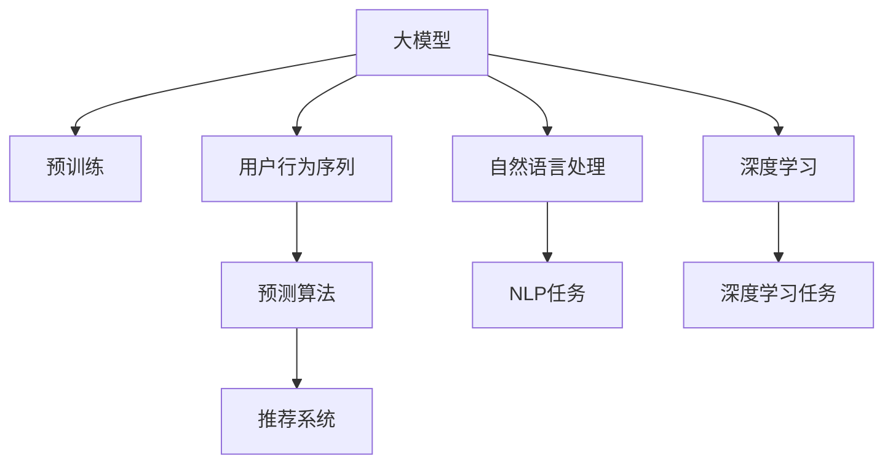

                 

# 大模型在电商平台用户行为序列预测中的应用

> 关键词：电商平台、用户行为序列、大模型、预测算法、推荐系统、自然语言处理、深度学习

## 1. 背景介绍

随着电子商务的蓬勃发展，电商平台的用户行为数据呈现出日益增长的规模和复杂性。这些数据中蕴含着用户的潜在偏好和行为规律，能够为电商平台提供有价值的洞察，优化商品推荐、广告投放、库存管理等决策。用户行为序列预测作为电商平台中的一项关键技术，旨在根据用户的历史行为数据，预测其未来的购买意愿和浏览行为，从而提升用户体验和平台收益。

近年来，深度学习技术在自然语言处理(NLP)和计算机视觉(CV)等领域的突破性进展，推动了大模型（Large Model）的兴起。大模型，特别是基于自回归(如Transformer)或自编码(如BERT)结构的预训练语言模型，通过在海量无标签文本数据上进行预训练，学习到了丰富的语言和视觉知识，具备强大的表征能力和泛化能力。这些模型在大规模数据上的表现，为电商平台用户行为序列预测提供了新的解决思路。

## 2. 核心概念与联系

### 2.1 核心概念概述

为了更好地理解大模型在电商平台用户行为序列预测中的应用，本节将介绍几个核心概念及其之间的联系：

- **大模型**：以自回归Transformer或自编码BERT等结构为代表的大规模预训练模型，如GPT、BERT、T5等。这些模型通过在海量无标签文本或图像数据上进行预训练，学习到通用的语言或视觉表示，具备强大的泛化能力。

- **用户行为序列**：电商平台用户的点击、浏览、购买等行为序列数据，是进行预测和推荐的重要输入。这些序列数据通常具有高维稀疏性和时间依赖性。

- **预测算法**：基于大模型的预测算法，包括时间序列预测、回归预测、分类预测等，用于从用户行为序列中提取规律，预测未来的用户行为。

- **推荐系统**：利用预测算法生成个性化推荐结果的系统，根据用户行为序列预测未来的行为，推荐用户可能感兴趣的商品或服务。

- **自然语言处理**：分析、理解和生成人类语言的技术，大模型常用于处理用户行为序列中的文本数据，提取有意义的语义信息。

- **深度学习**：一种基于神经网络的机器学习技术，用于构建复杂的学习模型，如图神经网络、卷积神经网络等，大模型常用于深度学习模型的预训练和微调。

这些核心概念之间的逻辑关系可以通过以下Mermaid流程图来展示：



这个流程图展示了大模型在电商平台中的核心概念及其之间的联系：

1. 大模型通过预训练获得基础能力。
2. 用户行为序列作为模型输入。
3. 通过预测算法处理序列数据，提取行为规律。
4. 推荐系统生成个性化推荐结果。
5. 自然语言处理技术用于文本数据的分析和处理。
6. 深度学习技术用于构建复杂的模型结构，进一步提升预测精度。

## 3. 核心算法原理 & 具体操作步骤

### 3.1 算法原理概述

基于大模型的电商平台用户行为序列预测，本质上是一种序列到序列(Seq2Seq)的学习任务。其核心思想是：通过大模型的自回归或自编码特性，将用户的历史行为序列作为输入，学习到用户行为的潜在模式，并基于这些模式预测未来的行为序列。

形式化地，设用户的历史行为序列为 $X=\{x_1, x_2, \ldots, x_t\}$，其中 $x_i$ 表示第 $i$ 步的行为。目标是根据 $X$ 预测下一步 $x_{t+1}$，即 $y_{t+1}=M_{\theta}(X)$。这里 $M_{\theta}$ 表示大模型，$\theta$ 为模型参数。

### 3.2 算法步骤详解

基于大模型的电商平台用户行为序列预测，一般包括以下几个关键步骤：

**Step 1: 准备预训练模型和数据集**
- 选择合适的预训练模型，如BERT、GPT等。
- 收集电商平台用户的历史行为序列数据，清洗和预处理数据，得到标注数据集 $D=\{(X_i, Y_i)\}_{i=1}^N$，其中 $X_i$ 为历史行为序列，$Y_i$ 为下一步的行为预测。

**Step 2: 设计任务适配层**
- 根据具体任务，设计适当的任务适配层。对于分类预测任务，通常添加线性分类器；对于回归预测任务，则使用回归器；对于序列生成任务，则使用解码器。

**Step 3: 设置预测超参数**
- 选择合适的优化算法及其参数，如Adam、SGD等，设置学习率、批大小、迭代轮数等。
- 应用正则化技术，如L2正则、Dropout、Early Stopping等，防止过拟合。
- 设置模型输出层的激活函数，如Sigmoid、ReLU等。

**Step 4: 执行预测训练**
- 将训练集数据分批次输入模型，前向传播计算损失函数。
- 反向传播计算参数梯度，根据设定的优化算法和学习率更新模型参数。
- 周期性在验证集上评估模型性能，根据性能指标决定是否触发Early Stopping。
- 重复上述步骤直到满足预设的迭代轮数或Early Stopping条件。

**Step 5: 测试和部署**
- 在测试集上评估预测模型，对比预测结果与真实标签之间的误差。
- 使用预测模型对新用户行为序列进行推理预测，集成到实际的推荐系统中。

以上是基于大模型的电商平台用户行为序列预测的一般流程。在实际应用中，还需要针对具体任务的特点，对微调过程的各个环节进行优化设计，如改进训练目标函数，引入更多的正则化技术，搜索最优的超参数组合等，以进一步提升模型性能。

### 3.3 算法优缺点

基于大模型的用户行为序列预测方法具有以下优点：
1. 数据利用率高。大模型通过预训练学习到了丰富的语言或视觉知识，能够高效利用用户行为序列中的信息。
2. 泛化能力强。大模型的泛化能力更强，对于小规模数据也能取得不错的预测效果。
3. 动态调整性好。大模型可以基于实时数据进行微调，快速适应用户行为的变化。
4. 灵活性高。可以应用于多种NLP任务，如文本分类、序列生成、情感分析等。

同时，该方法也存在一定的局限性：
1. 依赖高质量数据。预测效果很大程度上取决于训练数据的质量，需要花费较多的精力进行数据预处理和清洗。
2. 计算资源需求高。大模型的计算量较大，训练和推理过程中需要大量的计算资源。
3. 模型解释性差。大模型通常是"黑盒"系统，难以解释其内部工作机制和决策逻辑。
4. 数据隐私问题。电商平台的用户数据涉及隐私，需要在模型训练和应用过程中注意数据保护。

尽管存在这些局限性，但就目前而言，基于大模型的用户行为序列预测方法仍是最主流范式。未来相关研究的重点在于如何进一步降低计算资源需求，提高模型的可解释性和数据隐私保护水平，同时兼顾预测精度和灵活性。

### 3.4 算法应用领域

基于大模型的用户行为序列预测方法，已经在电商平台中得到了广泛的应用，涵盖了以下多个领域：

- **个性化推荐**：根据用户的历史行为序列预测其未来的购买意愿和浏览行为，推荐可能感兴趣的商品或服务。
- **广告投放优化**：通过预测用户的行为序列，优化广告的展示时机和内容，提升广告效果。
- **库存管理**：预测用户行为序列，提前调整库存水平，避免断货或库存积压。
- **价格优化**：预测用户对价格变化的反应，调整定价策略，提升销售额。
- **客户流失预测**：预测用户流失风险，提前采取措施挽留客户。

除了上述这些典型应用外，大模型在电商平台中的创新应用还在不断涌现，如实时竞价系统、智能客服、需求预测等，为电商平台的运营效率和服务质量提供了新的解决方案。随着预训练模型和预测算法的不断进步，相信大模型在电商平台中的应用前景将更加广阔。

## 4. 数学模型和公式 & 详细讲解 & 举例说明

### 4.1 数学模型构建

本节将使用数学语言对基于大模型的电商平台用户行为序列预测过程进行更加严格的刻画。

设用户的历史行为序列为 $X=\{x_1, x_2, \ldots, x_t\}$，其中 $x_i$ 表示第 $i$ 步的行为。目标是根据 $X$ 预测下一步 $x_{t+1}$，即 $y_{t+1}=M_{\theta}(X)$。这里 $M_{\theta}$ 表示大模型，$\theta$ 为模型参数。

形式化地，设大模型为 $M_{\theta}$，其中 $\theta$ 为模型参数，输入序列为 $X=\{x_1, x_2, \ldots, x_t\}$，目标输出为 $y_{t+1}$。则模型的预测公式可以表示为：

$$
y_{t+1}=M_{\theta}(X)
$$

其中 $M_{\theta}$ 表示大模型，$\theta$ 为模型参数。

### 4.2 公式推导过程

以下我们以分类预测任务为例，推导基于大模型的预测公式。

设大模型为 $M_{\theta}$，其中 $\theta$ 为模型参数，输入序列为 $X=\{x_1, x_2, \ldots, x_t\}$，目标输出为 $y_{t+1}$。分类任务的目标是预测用户行为 $y_{t+1}$ 属于某一类别 $c_k$，其中 $k=1,2,\ldots,K$。则分类预测的损失函数为交叉熵损失，定义为：

$$
\ell(y_{t+1}, \hat{y}_{t+1})=-\sum_{k=1}^K y_{t+1,k}\log \hat{y}_{t+1,k}
$$

其中 $\hat{y}_{t+1}=M_{\theta}(X)$ 表示大模型对 $y_{t+1}$ 的预测结果，$y_{t+1,k}$ 表示 $y_{t+1}$ 属于类别 $k$ 的标签。

通过反向传播算法计算模型参数 $\theta$ 的梯度，并根据梯度下降等优化算法更新模型参数。最终，通过训练集 $D$ 上的经验风险最小化，得到最优参数 $\theta^*$。

### 4.3 案例分析与讲解

以电商平台的个性化推荐系统为例，分析大模型在其中的应用。

假设用户 $u$ 最近浏览了三条商品 $x_1, x_2, x_3$，其行为序列为 $X=\{x_1, x_2, x_3\}$。使用大模型 $M_{\theta}$ 进行预测，目标是预测用户 $u$ 下一步的行为 $y_{4}$，即是否购买商品 $x_4$。

首先，将用户的历史行为序列 $X$ 输入大模型 $M_{\theta}$，得到预测结果 $\hat{y}_{4}$。该结果为一个长度为 $K$ 的向量，表示用户 $u$ 购买商品 $x_4$ 的概率分布。例如，如果 $\hat{y}_{4,1}=0.9$，表示用户 $u$ 有 90% 的概率购买商品 $x_4$。

接着，根据预测结果 $\hat{y}_{4}$，向用户推荐可能感兴趣的商品。例如，如果 $\hat{y}_{4,1}=0.9$ 且 $\hat{y}_{4,2}=0.1$，则推荐商品 $x_4$ 的购买，同时考虑到用户对商品 $x_2$ 的浏览历史，进一步推荐相关的商品 $x_5$。

通过这种方式，大模型能够高效地预测用户的行为序列，并生成个性化的推荐结果，提升电商平台的用户体验和运营效率。

## 5. 项目实践：代码实例和详细解释说明

### 5.1 开发环境搭建

在进行大模型在电商平台应用的研究和开发前，我们需要准备好开发环境。以下是使用Python进行PyTorch开发的环境配置流程：

1. 安装Anaconda：从官网下载并安装Anaconda，用于创建独立的Python环境。

2. 创建并激活虚拟环境：
```bash
conda create -n pytorch-env python=3.8 
conda activate pytorch-env
```

3. 安装PyTorch：根据CUDA版本，从官网获取对应的安装命令。例如：
```bash
conda install pytorch torchvision torchaudio cudatoolkit=11.1 -c pytorch -c conda-forge
```

4. 安装Transformers库：
```bash
pip install transformers
```

5. 安装各类工具包：
```bash
pip install numpy pandas scikit-learn matplotlib tqdm jupyter notebook ipython
```

完成上述步骤后，即可在`pytorch-env`环境中开始大模型在电商平台应用的研究和开发。

### 5.2 源代码详细实现

下面以电商平台的个性化推荐系统为例，给出使用Transformers库对BERT模型进行个性化推荐微调的PyTorch代码实现。

首先，定义推荐任务的数据处理函数：

```python
from transformers import BertTokenizer
from torch.utils.data import Dataset
import torch

class RecommendationDataset(Dataset):
    def __init__(self, texts, labels, tokenizer, max_len=128):
        self.texts = texts
        self.labels = labels
        self.tokenizer = tokenizer
        self.max_len = max_len
        
    def __len__(self):
        return len(self.texts)
    
    def __getitem__(self, item):
        text = self.texts[item]
        label = self.labels[item]
        
        encoding = self.tokenizer(text, return_tensors='pt', max_length=self.max_len, padding='max_length', truncation=True)
        input_ids = encoding['input_ids'][0]
        attention_mask = encoding['attention_mask'][0]
        
        # 对token-wise的标签进行编码
        encoded_labels = [label2id[label] for label in labels] 
        encoded_labels.extend([label2id['O']] * (self.max_len - len(encoded_labels)))
        labels = torch.tensor(encoded_labels, dtype=torch.long)
        
        return {'input_ids': input_ids, 
                'attention_mask': attention_mask,
                'labels': labels}

# 标签与id的映射
label2id = {'O': 0, 'B': 1, 'I': 2, 'C': 3}
id2label = {v: k for k, v in label2id.items()}

# 创建dataset
tokenizer = BertTokenizer.from_pretrained('bert-base-cased')

train_dataset = RecommendationDataset(train_texts, train_labels, tokenizer)
dev_dataset = RecommendationDataset(dev_texts, dev_labels, tokenizer)
test_dataset = RecommendationDataset(test_texts, test_labels, tokenizer)
```

然后，定义模型和优化器：

```python
from transformers import BertForTokenClassification, AdamW

model = BertForTokenClassification.from_pretrained('bert-base-cased', num_labels=len(label2id))

optimizer = AdamW(model.parameters(), lr=2e-5)
```

接着，定义训练和评估函数：

```python
from torch.utils.data import DataLoader
from tqdm import tqdm
from sklearn.metrics import classification_report

device = torch.device('cuda') if torch.cuda.is_available() else torch.device('cpu')
model.to(device)

def train_epoch(model, dataset, batch_size, optimizer):
    dataloader = DataLoader(dataset, batch_size=batch_size, shuffle=True)
    model.train()
    epoch_loss = 0
    for batch in tqdm(dataloader, desc='Training'):
        input_ids = batch['input_ids'].to(device)
        attention_mask = batch['attention_mask'].to(device)
        labels = batch['labels'].to(device)
        model.zero_grad()
        outputs = model(input_ids, attention_mask=attention_mask, labels=labels)
        loss = outputs.loss
        epoch_loss += loss.item()
        loss.backward()
        optimizer.step()
    return epoch_loss / len(dataloader)

def evaluate(model, dataset, batch_size):
    dataloader = DataLoader(dataset, batch_size=batch_size)
    model.eval()
    preds, labels = [], []
    with torch.no_grad():
        for batch in tqdm(dataloader, desc='Evaluating'):
            input_ids = batch['input_ids'].to(device)
            attention_mask = batch['attention_mask'].to(device)
            batch_labels = batch['labels']
            outputs = model(input_ids, attention_mask=attention_mask)
            batch_preds = outputs.logits.argmax(dim=2).to('cpu').tolist()
            batch_labels = batch_labels.to('cpu').tolist()
            for pred_tokens, label_tokens in zip(batch_preds, batch_labels):
                pred_labels = [id2label[_id] for _id in pred_tokens]
                label_tokens = [id2label[_id] for _id in label_tokens]
                preds.append(pred_labels[:len(label_tokens)])
                labels.append(label_tokens)
                
    print(classification_report(labels, preds))
```

最后，启动训练流程并在测试集上评估：

```python
epochs = 5
batch_size = 16

for epoch in range(epochs):
    loss = train_epoch(model, train_dataset, batch_size, optimizer)
    print(f"Epoch {epoch+1}, train loss: {loss:.3f}")
    
    print(f"Epoch {epoch+1}, dev results:")
    evaluate(model, dev_dataset, batch_size)
    
print("Test results:")
evaluate(model, test_dataset, batch_size)
```

以上就是使用PyTorch对BERT进行个性化推荐任务微调的完整代码实现。可以看到，得益于Transformers库的强大封装，我们可以用相对简洁的代码完成BERT模型的加载和微调。

### 5.3 代码解读与分析

让我们再详细解读一下关键代码的实现细节：

**RecommendationDataset类**：
- `__init__`方法：初始化文本、标签、分词器等关键组件。
- `__len__`方法：返回数据集的样本数量。
- `__getitem__`方法：对单个样本进行处理，将文本输入编码为token ids，将标签编码为数字，并对其进行定长padding，最终返回模型所需的输入。

**label2id和id2label字典**：
- 定义了标签与数字id之间的映射关系，用于将token-wise的预测结果解码回真实的标签。

**训练和评估函数**：
- 使用PyTorch的DataLoader对数据集进行批次化加载，供模型训练和推理使用。
- 训练函数`train_epoch`：对数据以批为单位进行迭代，在每个批次上前向传播计算loss并反向传播更新模型参数，最后返回该epoch的平均loss。
- 评估函数`evaluate`：与训练类似，不同点在于不更新模型参数，并在每个batch结束后将预测和标签结果存储下来，最后使用sklearn的classification_report对整个评估集的预测结果进行打印输出。

**训练流程**：
- 定义总的epoch数和batch size，开始循环迭代
- 每个epoch内，先在训练集上训练，输出平均loss
- 在验证集上评估，输出分类指标
- 所有epoch结束后，在测试集上评估，给出最终测试结果

可以看到，PyTorch配合Transformers库使得BERT微调的代码实现变得简洁高效。开发者可以将更多精力放在数据处理、模型改进等高层逻辑上，而不必过多关注底层的实现细节。

当然，工业级的系统实现还需考虑更多因素，如模型的保存和部署、超参数的自动搜索、更灵活的任务适配层等。但核心的微调范式基本与此类似。

## 6. 实际应用场景

### 6.1 智能推荐系统

基于大模型的电商平台个性化推荐系统，可以显著提升用户的购物体验和平台收益。推荐系统通过分析用户的历史行为序列，预测用户的兴趣和偏好，从而推荐个性化的商品，满足用户需求。

在技术实现上，可以收集用户的历史点击、浏览、购买等行为数据，将数据进行清洗和预处理，得到用户行为序列。在此基础上对预训练模型进行微调，使其能够从行为序列中提取特征，预测用户对每个商品的兴趣度。根据预测结果进行排序，推荐用户可能感兴趣的商品，提升点击率和转化率。

### 6.2 广告投放优化

电商平台需要精准地进行广告投放，以最小的成本获得最大的收益。通过预测用户行为序列，电商平台可以优化广告的展示时机和内容，提升广告效果。

具体而言，可以收集用户的历史点击、展示、转化等广告互动数据，将数据进行清洗和预处理，得到用户行为序列。在此基础上对预训练模型进行微调，使其能够预测用户对不同广告内容的响应。根据预测结果，调整广告投放策略，优先展示用户可能感兴趣的广告内容，提升广告点击率和转化率。

### 6.3 库存管理

电商平台需要合理管理库存，避免断货或库存积压，影响用户体验和平台收益。通过预测用户行为序列，电商平台可以优化库存管理策略，提升库存水平和运营效率。

具体而言，可以收集用户的历史购买、浏览、评价等行为数据，将数据进行清洗和预处理，得到用户行为序列。在此基础上对预训练模型进行微调，使其能够预测用户未来的购买意愿。根据预测结果，提前调整库存水平，避免断货或库存积压，提升运营效率和用户体验。

### 6.4 未来应用展望

随着大模型和微调方法的不断发展，基于大模型的电商平台应用也将不断涌现，为电商平台的运营效率和服务质量提供新的解决方案。

在智慧仓储领域，基于大模型的仓储管理优化，可以大幅提升仓储效率，降低物流成本，提升供应链的响应速度。

在智能客服领域，基于大模型的智能客服系统，可以24小时不间断服务，快速响应客户咨询，提升客服效率和用户满意度。

在智能搜索领域，基于大模型的智能搜索推荐，可以提升搜索的精准度和用户体验，帮助用户快速找到所需商品。

除了上述这些领域外，大模型在电商平台中的应用还在不断扩展，为电商平台的数字化转型提供新的动力。相信随着技术的日益成熟，大模型在电商平台中的应用前景将更加广阔。

## 7. 工具和资源推荐

### 7.1 学习资源推荐

为了帮助开发者系统掌握大模型在电商平台中的应用，这里推荐一些优质的学习资源：

1. 《深度学习与自然语言处理》书籍：深入讲解深度学习在NLP中的应用，包括序列到序列预测、推荐系统等。
2. 《Transformer》课程：斯坦福大学开设的Transformer及其应用课程，涵盖Transformer模型的原理和应用。
3. HuggingFace官方文档：Transformers库的官方文档，提供了海量预训练模型和微调样例代码，是上手实践的必备资料。
4. Kaggle竞赛：参加电商平台的推荐系统竞赛，实战锻炼预测算法和模型微调能力。
5. Coursera《机器学习》课程：由斯坦福大学Andrew Ng教授主讲的机器学习课程，涵盖深度学习基础和算法优化等内容。

通过对这些资源的学习实践，相信你一定能够快速掌握大模型在电商平台中的应用，并用于解决实际的电商问题。

### 7.2 开发工具推荐

高效的开发离不开优秀的工具支持。以下是几款用于大模型在电商平台应用开发的常用工具：

1. PyTorch：基于Python的开源深度学习框架，灵活动态的计算图，适合快速迭代研究。大部分预训练语言模型都有PyTorch版本的实现。
2. TensorFlow：由Google主导开发的开源深度学习框架，生产部署方便，适合大规模工程应用。同样有丰富的预训练语言模型资源。
3. Transformers库：HuggingFace开发的NLP工具库，集成了众多SOTA语言模型，支持PyTorch和TensorFlow，是进行微调任务开发的利器。
4. Weights & Biases：模型训练的实验跟踪工具，可以记录和可视化模型训练过程中的各项指标，方便对比和调优。与主流深度学习框架无缝集成。
5. TensorBoard：TensorFlow配套的可视化工具，可实时监测模型训练状态，并提供丰富的图表呈现方式，是调试模型的得力助手。

合理利用这些工具，可以显著提升大模型在电商平台应用的研究和开发效率，加快创新迭代的步伐。

### 7.3 相关论文推荐

大模型在电商平台中的应用源于学界的持续研究。以下是几篇奠基性的相关论文，推荐阅读：

1. Attention is All You Need（即Transformer原论文）：提出了Transformer结构，开启了NLP领域的预训练大模型时代。

2. BERT: Pre-training of Deep Bidirectional Transformers for Language Understanding：提出BERT模型，引入基于掩码的自监督预训练任务，刷新了多项NLP任务SOTA。

3. Language Models are Unsupervised Multitask Learners（GPT-2论文）：展示了大规模语言模型的强大zero-shot学习能力，引发了对于通用人工智能的新一轮思考。

4. Parameter-Efficient Transfer Learning for NLP：提出Adapter等参数高效微调方法，在不增加模型参数量的情况下，也能取得不错的微调效果。

5. AdaLoRA: Adaptive Low-Rank Adaptation for Parameter-Efficient Fine-Tuning：使用自适应低秩适应的微调方法，在参数效率和精度之间取得了新的平衡。

6. Attention-based Recommender System for E-commerce：基于Attention机制的电商推荐系统，通过预测用户行为序列，推荐个性化商品。

这些论文代表了大模型在电商平台中的应用发展脉络。通过学习这些前沿成果，可以帮助研究者把握学科前进方向，激发更多的创新灵感。

## 8. 总结：未来发展趋势与挑战

### 8.1 总结

本文对基于大模型的电商平台用户行为序列预测方法进行了全面系统的介绍。首先阐述了大模型和微调技术的研究背景和意义，明确了微调在电商平台用户行为序列预测中的独特价值。其次，从原理到实践，详细讲解了序列到序列的预测算法和关键步骤，给出了微调任务开发的完整代码实例。同时，本文还广泛探讨了微调方法在电商平台中的多种应用场景，展示了微调范式的巨大潜力。

通过本文的系统梳理，可以看到，基于大模型的用户行为序列预测方法已经在电商平台上取得了初步成功，为电商平台的运营效率和服务质量带来了显著提升。未来，伴随预训练模型和预测算法的不断进步，大模型在电商平台中的应用前景将更加广阔。

### 8.2 未来发展趋势

展望未来，大模型在电商平台中的应用将呈现以下几个发展趋势：

1. 模型规模持续增大。随着算力成本的下降和数据规模的扩张，预训练语言模型的参数量还将持续增长。超大规模语言模型蕴含的丰富语言知识，有望支撑更加复杂多变的电商应用。

2. 预测精度逐步提升。通过不断的优化训练算法和模型结构，大模型在电商行为序列预测中的精度将逐步提升，预测结果将更加精准可靠。

3. 应用场景不断拓展。随着技术的成熟和应用的深入，大模型在电商平台的预测应用将不断拓展，覆盖更多的业务环节，如广告投放、库存管理、客户流失预测等。

4. 实时性需求增加。电商平台的运营需要实时响应用户行为，因此对预测算法的实时性提出了更高的要求。未来，实时预测和大模型在边缘计算、流式处理中的应用将更加普遍。

5. 数据隐私保护加强。随着电商平台的不断扩展，用户隐私保护将成为一个重要问题。未来，基于差分隐私等技术的预测算法和模型保护机制将得到广泛应用，确保用户数据的隐私安全。

6. 跨平台应用普及。大模型在电商平台中的应用将逐步向跨平台、跨设备、跨场景的方向发展，提升用户体验和平台的包容性。

以上趋势凸显了大模型在电商平台中的广阔前景。这些方向的探索发展，必将进一步提升电商平台的运营效率和服务质量，为电商平台的数字化转型提供新的动力。

### 8.3 面临的挑战

尽管大模型在电商平台中的应用已经取得了初步成功，但在迈向更加智能化、普适化应用的过程中，它仍面临着诸多挑战：

1. 标注成本瓶颈。虽然微调大大降低了标注数据的需求，但对于长尾应用场景，难以获得充足的高质量标注数据，成为制约微调性能的瓶颈。如何进一步降低微调对标注样本的依赖，将是一大难题。

2. 计算资源需求高。大模型的计算量较大，训练和推理过程中需要大量的计算资源。如何降低计算资源需求，提升预测算法的实时性，还需进一步优化。

3. 数据隐私问题。电商平台的用户数据涉及隐私，需要在模型训练和应用过程中注意数据保护。如何设计更加安全的数据存储和处理机制，将是未来的重要课题。

4. 模型鲁棒性不足。当前微调模型面对域外数据时，泛化性能往往大打折扣。对于测试样本的微小扰动，微调模型的预测也容易发生波动。如何提高微调模型的鲁棒性，避免灾难性遗忘，还需要更多理论和实践的积累。

5. 模型解释性差。大模型通常是"黑盒"系统，难以解释其内部工作机制和决策逻辑。如何赋予大模型更强的可解释性，将是亟待攻克的难题。

6. 实时性需求高。电商平台的运营需要实时响应用户行为，因此对预测算法的实时性提出了更高的要求。如何优化预测算法，提升实时性，将是未来的重要研究方向。

7. 跨平台应用挑战。大模型在电商平台中的应用将逐步向跨平台、跨设备、跨场景的方向发展，提升用户体验和平台的包容性。如何设计跨平台的预测算法和模型保护机制，将是未来的重要课题。

这些挑战凸显了大模型在电商平台中的应用仍需不断优化和完善。唯有从数据、算法、工程、业务等多个维度协同发力，才能真正实现大模型在电商平台中的广泛应用。总之，大模型需要不断突破现有瓶颈，才能更好地服务电商平台的数字化转型。

### 8.4 研究展望

面对大模型在电商平台中的应用挑战，未来的研究需要在以下几个方面寻求新的突破：

1. 探索无监督和半监督微调方法。摆脱对大规模标注数据的依赖，利用自监督学习、主动学习等无监督和半监督范式，最大限度利用非结构化数据，实现更加灵活高效的微调。

2. 研究参数高效和计算高效的微调范式。开发更加参数高效的微调方法，在固定大部分预训练参数的情况下，只更新极少量的任务相关参数。同时优化微调模型的计算图，减少前向传播和反向传播的资源消耗，实现更加轻量级、实时性的部署。

3. 引入因果和对比学习范式。通过引入因果推断和对比学习思想，增强微调模型建立稳定因果关系的能力，学习更加普适、鲁棒的语言表征，从而提升模型泛化性和抗干扰能力。

4. 融合先验知识和符号逻辑。将符号化的先验知识，如知识图谱、逻辑规则等，与神经网络模型进行巧妙融合，引导微调过程学习更准确、合理的语言模型。同时加强不同模态数据的整合，实现视觉、语音等多模态信息与文本信息的协同建模。

5. 结合因果分析和博弈论工具。将因果分析方法引入微调模型，识别出模型决策的关键特征，增强输出解释的因果性和逻辑性。借助博弈论工具刻画人机交互过程，主动探索并规避模型的脆弱点，提高系统稳定性。

6. 纳入伦理道德约束。在模型训练目标中引入伦理导向的评估指标，过滤和惩罚有偏见、有害的输出倾向。同时加强人工干预和审核，建立模型行为的监管机制，确保输出符合人类价值观和伦理道德。

这些研究方向的探索，必将引领大模型在电商平台中的应用走向更高的台阶，为电商平台的用户体验和运营效率带来新的提升。面向未来，大模型在电商平台中的应用还需要与其他人工智能技术进行更深入的融合，如知识表示、因果推理、强化学习等，多路径协同发力，共同推动电商平台的数字化转型。只有勇于创新、敢于突破，才能不断拓展大模型的边界，让智能技术更好地服务于电商平台。

## 9. 附录：常见问题与解答

**Q1：电商平台的推荐系统如何处理长尾商品？**

A: 长尾商品的推荐需要考虑数据稀疏性和冷启动问题。大模型可以通过冷启动策略，如基线推荐、用户兴趣点预测等，提升对长尾商品的覆盖率。同时，可以采用重构损失函数、引入稀疏性正则等方法，提升长尾商品的推荐效果。

**Q2：如何平衡个性化推荐和通用性推荐？**

A: 个性化推荐和通用性推荐需要平衡用户的独特需求和平台的多样性。大模型可以通过设置多个任务适配层，对不同类型的推荐任务进行微调，同时引入个性化权重和共性权重，优化推荐结果。

**Q3：大模型在实时预测中的计算效率如何优化？**

A: 实时预测对计算效率提出了高要求。可以采用分布式训练、模型压缩、量化加速等技术，优化大模型的计算资源消耗。同时，可以引入流式处理、增量学习等方法，提升预测算法的实时性。

**Q4：大模型在电商平台中的应用如何保障数据隐私？**

A: 电商平台的用户数据涉及隐私，需要在模型训练和应用过程中注意数据保护。可以采用差分隐私、联邦学习等技术，保护用户数据的隐私安全。同时，可以设计数据脱敏和加密机制，确保数据在传输和存储过程中的安全性。

**Q5：大模型在电商平台中的应用如何扩展到跨平台、跨设备？**

A: 大模型在跨平台、跨设备中的应用需要考虑模型部署和数据迁移的问题。可以采用模型微调、模型压缩等技术，优化模型在不同平台和设备上的性能和计算效率。同时，可以引入跨平台的数据同步和共享机制，提升系统的一致性和稳定性。

通过这些问题的探讨，我们可以看到，大模型在电商平台中的应用仍需不断优化和完善。只有从数据、算法、工程、业务等多个维度协同发力，才能真正实现大模型在电商平台中的广泛应用，提升电商平台的运营效率和服务质量。

